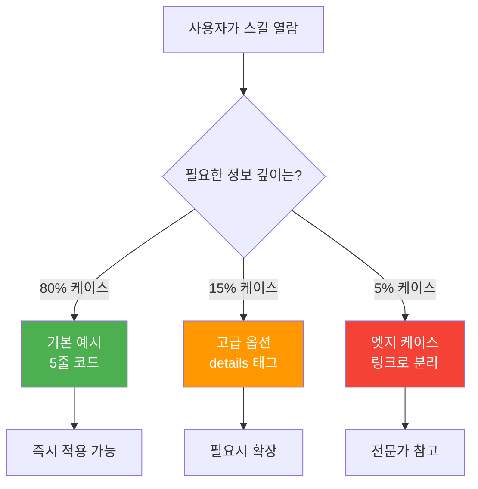
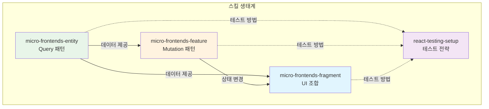
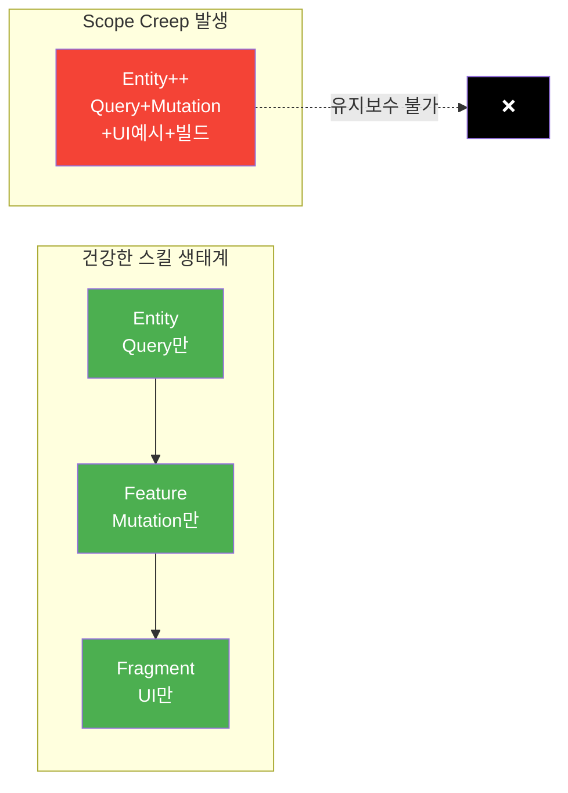
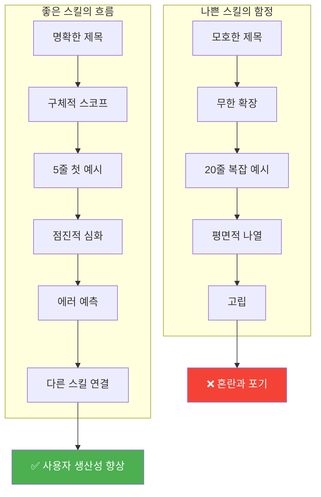

# AI 스킬 설계 베스트 프랙티스: 좋은 스킬과 나쁜 스킬의 차이

## 한눈에 보기

AI 에이전트의 능력을 확장하는 "스킬"은 단순한 프롬프트 모음이 아닙니다. 잘 설계된 스킬은 LLM의 인지적 특성을 이해하고, 인간의 정보 처리 한계를 존중하며, 소프트웨어 공학의 검증된 원칙들을 따릅니다. 이 글에서는 스킬 설계의 5가지 핵심 패턴과 피해야 할 5가지 함정을 탐구합니다.

---

## 들어가며

AI 에이전트 시대가 열리면서 새로운 개념이 등장했습니다. 바로 "스킬(Skill)"입니다. 스킬이란 AI 에이전트가 특정 작업을 수행할 수 있도록 정의된 명령어 세트로, 코드 리뷰, 문서 작성, 테스트 생성 같은 복잡한 작업을 재사용 가능한 단위로 캡슐화합니다.

그런데 왜 스킬 "설계"가 중요할까요? LLM에게 그냥 자연어로 지시하면 되지 않나요?

여기에 흥미로운 역설이 있습니다. LLM은 자연어를 이해하지만, 잘 구조화된 지시를 받았을 때 훨씬 더 일관된 결과를 냅니다. 연구에 따르면 few-shot 설정에서 형식 변경만으로 최대 76%의 정확도 변동이 발생합니다. 같은 내용이라도 어떻게 전달하느냐에 따라 결과가 완전히 달라지는 것입니다.

스킬 설계는 결국 "LLM과의 효과적인 소통 방법"을 체계화하는 작업입니다. 그리고 이 체계화에는 인지과학, 소프트웨어 공학, 프롬프트 엔지니어링의 통찰이 모두 필요합니다.

---

## 정보의 흐름을 설계하기: 점진적 공개의 원리

스킬을 작성할 때 가장 먼저 마주치는 질문이 있습니다. "얼마나 많은 정보를 담아야 하는가?"

1995년, 사용성 전문가 Jakob Nielsen은 "점진적 공개(Progressive Disclosure)"라는 개념을 제안했습니다. 핵심 기능을 먼저 보여주고, 고급 옵션은 필요할 때만 드러내라는 것입니다. 이 원칙은 스킬 설계에서 더욱 중요해집니다.

그 이유는 Miller's Law에서 찾을 수 있습니다. 인간의 작업 기억은 약 7(±2)개의 항목으로 제한됩니다. 흥미롭게도 LLM에도 비슷한 제약이 존재합니다. 연구에 따르면 LLM의 컨텍스트 활용률이 85%를 초과하면 모델 성능이 23% 저하됩니다. 더 많은 정보가 항상 더 좋은 결과를 의미하지 않는 것입니다.

좋은 스킬은 이 점을 반영합니다. 기본 사용법을 먼저 제시하고, 고급 옵션은 별도 섹션으로 분리합니다. Claude Agent Skills 역시 이 점진적 공개를 핵심 설계 원칙으로 채택하고 있습니다.

```
# 기본 사용법 (먼저 보여줌)
/review-pr 123

# 고급 옵션 (필요시 참조)
/review-pr 123 --focus security --depth deep
```

여기서 "Lost in the Middle" 효과도 고려해야 합니다. LLM은 프롬프트의 처음 20%와 마지막 10%에서 정보를 가장 잘 검색합니다. 따라서 가장 중요한 지시사항은 스킬의 시작과 끝에 배치하는 것이 효과적입니다.



> 정보를 계층화하는 점진적 공개 전략. 80-15-5 비율은 실전 적용 시 판단 기준이 됩니다.

---

## 추상에서 구체로: 인라인 예시의 힘

"좋은 코드를 작성하세요"라는 지시와 "다음과 같은 형식으로 코드를 작성하세요: [예시]"라는 지시 중 어느 것이 더 효과적일까요?

LLM의 작동 방식을 이해하면 답이 명확해집니다. LLM은 본질적으로 패턴 매칭 시스템입니다. In-Context Learning(ICL)이라는 메커니즘을 통해 프롬프트 내의 예시를 마치 학습 데이터처럼 활용합니다. 추상적인 설명보다 구체적인 예시가 훨씬 강력한 신호가 되는 것입니다.

이것이 "인라인 예시(Inline Examples)" 패턴의 근거입니다. 규칙을 설명한 직후에 바로 예시를 배치하면, LLM이 그 패턴을 정확히 인식하고 재현할 확률이 높아집니다.

```markdown
# 나쁜 스킬 설계
"커밋 메시지는 명확하게 작성하세요."

# 좋은 스킬 설계
"커밋 메시지는 다음 형식을 따르세요:
- feat: 새 기능 추가 시
- fix: 버그 수정 시
예시: 'feat: add user authentication module'"
```

연구자들은 LLM 내부에서 "Task Recognition Point"라는 현상을 발견했습니다. 특정 레이어에서 모델이 작업의 성격을 인식한 후, 이후 레이어에서는 실행 모드로 전환한다는 것입니다. 좋은 예시는 이 인식 과정을 가속화합니다.

---

## 경계를 명확히: 스코프 명시와 에러 예측

1972년, David Parnas는 소프트웨어 공학 역사상 가장 영향력 있는 논문 중 하나를 발표했습니다. "정보 은닉(Information Hiding)"에 관한 것이었습니다. 모듈은 무엇을 공유하는가가 아니라 무엇을 숨기는가로 정의되어야 한다는 통찰이었습니다.

스킬 설계에서 이 원칙은 "스코프 명시(Scope Statement)"로 번역됩니다. 스킬이 무엇을 하는지만큼, 무엇을 하지 않는지를 명확히 하는 것입니다.

```markdown
## 이 스킬의 범위
- PR의 코드 품질 리뷰
- 보안 취약점 검사

## 이 스킬이 하지 않는 것
- 자동 머지
- 성능 벤치마크
```

이런 명시적 경계 설정은 Constitutional AI의 원리와도 맞닿아 있습니다. Anthropic이 개발한 이 접근법은 AI에게 명시적인 규칙 목록을 제공하여 행동을 제어합니다. "하지 않는 것" 목록은 LLM에게 명확한 경계를 제공하는 일종의 헌법 조항인 셈입니다.

에러 예측(Error Anticipation)도 같은 맥락입니다. 사용자들이 자주 하는 실수를 미리 짚어주면, LLM은 그 패턴을 피해야 할 안티패턴으로 인식합니다.

```markdown
## 흔한 실수
- ❌ main 브랜치에 직접 커밋하지 마세요
- ❌ 테스트 없이 PR을 생성하지 마세요
```

---

## 홀로 vs 함께: 스킬 생태계 설계

UNIX 철학의 핵심 원칙 중 하나는 "Do One Thing Well"입니다. 각 프로그램이 한 가지를 잘 하도록 만들라는 것입니다. 이 원칙은 1970년대부터 소프트웨어 설계를 지배해왔고, 객체지향의 단일 책임 원칙(SRP)으로 이어졌습니다.

스킬 설계에서도 이 원칙은 유효합니다. 하나의 스킬이 너무 많은 것을 하려 하면, 컨텍스트가 비대해지고 LLM의 성능이 저하됩니다. 그러나 여기서 새로운 질문이 생깁니다. 스킬들이 서로 어떻게 협력해야 하는가?

"통합 맵(Integration Map)"은 이 질문에 대한 답입니다. 스킬이 다른 스킬들과 어떤 관계를 맺는지 시각화하는 것입니다.



> 스킬 간 의존 관계(실선)와 참고 관계(점선)를 구분하여, "어떤 순서로 학습해야 하는지" 직관적으로 파악할 수 있습니다.

```markdown
## 관련 스킬
- 이전 단계: /create-branch
- 이후 단계: /merge-pr
- 함께 사용: /run-tests
```

이런 맵은 Chain-of-Thought 원리와도 연결됩니다. 복잡한 작업을 중간 단계로 분해하면 LLM의 추론 능력이 향상됩니다. 스킬들이 명확한 파이프라인을 형성하면, 복잡한 워크플로우도 단계별로 처리할 수 있게 됩니다.

---

## 피해야 할 다섯 가지 함정

좋은 패턴만큼 중요한 것이 피해야 할 안티패턴입니다.

### 1. 스코프 크립(Scope Creep)

"이 기능도 추가하면 좋겠다"는 유혹에 빠져 스킬이 계속 비대해지는 현상입니다. 앞서 언급했듯이 컨텍스트 과부하는 성능 저하를 초래합니다. 새 기능이 필요하면 별도 스킬로 분리하는 것이 낫습니다.



> "작고 집중된 스킬 여러 개" vs "거대한 만능 스킬 하나"의 차이

### 2. 문서 중복(Documentation Duplication)

공식 문서를 스킬에 그대로 복사하면 어떻게 될까요? 시간이 지나면 원본은 업데이트되고 스킬의 내용은 outdated됩니다. 문서를 복사하기보다 참조하도록 설계해야 합니다.

### 3. 사용자 맥락 손실(User Context Loss)

스킬이 실행될 때 사용자의 현재 상태(어떤 브랜치에 있는지, 어떤 파일을 편집 중인지)를 무시하면 엉뚱한 결과가 나옵니다. 맥락을 활용하도록 설계해야 합니다.

### 4. 하드코딩된 가정(Hard-coded Assumptions)

"사용자는 Mac을 쓴다", "프로젝트는 TypeScript다"와 같은 가정을 박아넣으면 스킬의 범용성이 사라집니다.

### 5. 버전 관리 없는 변경(Breaking Changes Without Versioning)

API 설계에서 Semantic Versioning이 중요하듯, 스킬도 버전 관리가 필요합니다. 기존 사용법을 깨뜨리는 변경은 명시적으로 공지해야 합니다.

---

## 좋은 스킬 vs 나쁜 스킬 비교

| 측면 | 나쁜 스킬 | 좋은 스킬 |
|------|----------|----------|
| **제목** | "Helper", "Utils" | "JWT Auth Setup for Next.js" |
| **설명** | "여러 가지 도움말" | "Next.js에 JWT 인증 추가" |
| **첫 예시** | 20줄, 모든 옵션 포함 | 5줄, 최소 동작 코드 |
| **구조** | 평면적 나열 | 기본 → 고급 점진적 공개 |
| **에러** | 언급 없음 | "흔한 실수" 섹션 |
| **스코프** | 모호함 | "이것만 다룸" 명시 |
| **관계** | 고립됨 | 다른 스킬과 연결 |
| **문서** | 공식 문서 복사 | 고유 패턴만, 링크 제공 |
| **업데이트** | 방치됨 | Changelog 유지 |



---

## 트레이드오프

모든 설계 결정에는 트레이드오프가 있습니다.

**상세함 vs 간결함**: 자세한 스킬은 초보자에게 친절하지만 컨텍스트를 많이 소비합니다. 간결한 스킬은 효율적이지만 암묵적 지식을 요구합니다. 점진적 공개가 이 균형을 맞추는 방법입니다.

**독립성 vs 통합성**: 완전히 독립적인 스킬은 단독으로 동작하지만 복잡한 워크플로우에서 불편합니다. 긴밀히 연결된 스킬들은 강력하지만 의존성 관리가 어렵습니다. 느슨한 결합(loose coupling)이 답입니다.

**범용성 vs 전문성**: 모든 상황을 커버하려는 스킬은 어떤 상황에서도 평범합니다. 특정 도메인에 최적화된 스킬은 그 영역에서 탁월하지만 적용 범위가 좁습니다. 사용 빈도를 기준으로 판단하세요.

---

## 마무리하며

스킬 설계는 결국 "제약 안에서의 창의성"입니다. LLM의 컨텍스트 한계, 인간의 인지적 제약, 소프트웨어의 유지보수 비용을 모두 고려하면서도, 그 안에서 최대한 효과적인 도구를 만들어야 합니다.

좋은 스킬과 나쁜 스킬의 차이는 기능의 많고 적음이 아닙니다. 사용자와 LLM 모두에게 명확한 멘탈 모델을 제공하느냐의 차이입니다. 점진적 공개, 인라인 예시, 명시적 경계, 에러 예측, 통합 맵은 모두 이 명확성을 향한 도구들입니다.

1972년 Parnas가 정보 은닉을 말했을 때, 그가 AI 시대를 예견한 것은 아닙니다. 하지만 "좋은 모듈은 무엇을 숨기는가로 정의된다"는 통찰은 50년이 지난 지금도 유효합니다. 좋은 스킬은 LLM에게 필요한 것만 보여주고, 나머지는 적절히 숨깁니다.

스킬을 설계할 때 자문해보세요. "이 스킬은 LLM에게 무엇을 숨기고 있는가?"

---

## 더 읽어볼 자료

- [Anthropic Claude Documentation - Prompt Engineering](https://docs.anthropic.com/claude/docs/prompt-engineering)
- [Nielsen Norman Group - Progressive Disclosure](https://www.nngroup.com/articles/progressive-disclosure/)
- [Miller's Law - Wikipedia](https://en.wikipedia.org/wiki/Miller%27s_law)
- [On the Criteria To Be Used in Decomposing Systems into Modules - David Parnas (1972)](https://www.win.tue.nl/~wstomv/edu/2ip30/references/criteria_for_modularization.pdf)
- [Constitutional AI: Harmlessness from AI Feedback - Anthropic](https://arxiv.org/abs/2212.08073)
- [The UNIX Philosophy - Wikipedia](https://en.wikipedia.org/wiki/Unix_philosophy)
- [Semantic Versioning 2.0.0](https://semver.org/)
- [IBM - What is In-Context Learning](https://www.ibm.com/think/topics/in-context-learning)
- [Prompt Engineering Guide - Few-Shot Prompting](https://www.promptingguide.ai/techniques/fewshot)
- [Google Research - Chain-of-Thought Prompting](https://research.google/blog/language-models-perform-reasoning-via-chain-of-thought/)
