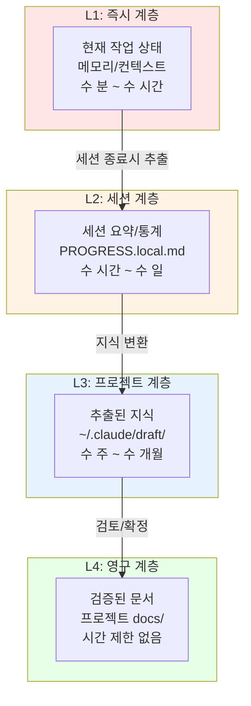
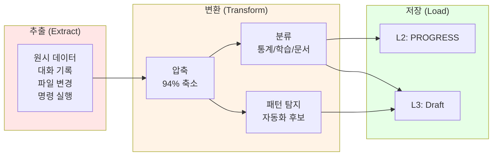
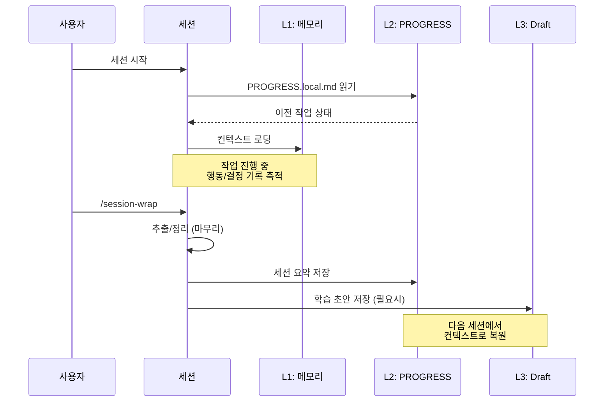

# AI 에이전트 세션 지속성: 휘발되는 대화에서 축적되는 지식으로

## 한눈에 보기

AI 코딩 에이전트는 본질적으로 무상태(stateless) 시스템 위에서 동작합니다. 세션이 종료되면 축적된 컨텍스트, 의사결정의 맥락, 학습된 패턴 모두가 사라집니다. 세션 지속성(Session Persistence)은 이 휘발성을 극복하고, 단절된 대화를 연속적인 지식 축적으로 전환하는 설계 패러다임입니다.

---

## 들어가며

Claude Code와 같은 AI 코딩 에이전트로 복잡한 리팩토링 작업을 진행하다가 세션이 종료된 경험이 있으신가요? 다음 세션에서 같은 작업을 이어가려면 무엇이 필요할까요. 프로젝트 구조를 다시 설명하고, 이전에 시도했던 접근법과 그것이 실패한 이유를 다시 전달하고, 코드베이스의 특수한 컨벤션을 다시 알려주어야 합니다. 이 반복되는 "온보딩" 비용은 단순한 불편함을 넘어, AI 에이전트 활용의 근본적인 병목이 됩니다.

LLM 기반 에이전트는 강력한 추론 능력을 가지고 있지만, 그 능력은 컨텍스트 윈도우라는 물리적 한계 안에서만 발휘됩니다. 128K, 200K 토큰이라는 숫자는 인상적으로 보이지만, 실제 코드 작업에서는 놀라울 정도로 빠르게 소진됩니다. 더 근본적인 문제는 세션 간 경계에서 발생합니다. 아무리 긴 컨텍스트 윈도우도 세션이 끝나면 초기화됩니다. 매번 빈 슬레이트에서 시작하는 것입니다.

세션 지속성은 이 문제에 대한 체계적인 접근입니다. 단순히 "대화 기록을 저장하자"가 아니라, "무엇을 어떻게 지속시켜야 에이전트가 연속적인 작업 파트너로 기능할 수 있는가"에 대한 설계 질문입니다.

---

## 컨텍스트 윈도우의 역설: 넓어질수록 드러나는 한계

LLM의 컨텍스트 윈도우는 인간의 작업 기억(working memory)과 유사한 특성을 가집니다. 인지과학에서 작업 기억은 약 4-7개의 청크(chunk)만 동시에 처리할 수 있다고 알려져 있습니다. LLM의 컨텍스트 윈도우는 이보다 훨씬 크지만, 본질적으로 같은 제약을 공유합니다. 바로 "동시에 주의를 기울일 수 있는 정보량의 한계"입니다.

흥미로운 역설이 있습니다. 컨텍스트 윈도우가 커질수록 더 많은 정보를 담을 수 있지만, 동시에 "정말 중요한 것"을 찾아내기가 어려워집니다. 200K 토큰의 컨텍스트에서 핵심 결정 사항 하나를 놓치는 것은 충분히 발생할 수 있는 일입니다. 인간이 방대한 문서 더미에서 핵심을 놓치는 것처럼 말입니다.

| 인간 기억 | LLM 에이전트 | 특성 |
|----------|-------------|------|
| 작업 기억 | 컨텍스트 윈도우 | 제한된 용량, 빠른 접근 |
| 장기 기억 | 외부 저장소 (파일, DB) | 큰 용량, 검색 필요 |
| 기억 강화 | 반복 참조, 중요도 표시 | 자주 사용하면 강화 |
| 망각 | 컨텍스트 오버플로우 | 오래된 정보 소실 |

이 한계는 코드 작업에서 특히 두드러집니다. 코드는 상태 변화가 누적되는 특성이 있습니다. 파일 A의 수정이 파일 B에 영향을 주고, 그것이 다시 파일 C의 동작을 바꿉니다. 이 연쇄적 맥락을 모두 컨텍스트 윈도우 안에 유지하는 것은 이론적으로 가능하지만, 실용적이지 않습니다. 더욱이 코드 작업은 본질적으로 탐색적입니다. 여러 접근법을 시도하고, 실패하고, 방향을 수정합니다. 이 탐색의 역사는 최종 결과물만큼이나 가치 있는 정보입니다.

세션 지속성은 이 한계를 우회합니다. 모든 것을 컨텍스트 윈도우 안에 유지하려는 시도 대신, 필요한 것을 필요한 시점에 불러올 수 있는 구조를 만드는 것입니다. 인간의 장기 기억이 작업 기억을 보완하듯, 지속되는 세션 데이터가 제한된 컨텍스트 윈도우를 보완합니다.

---

## 컴퓨팅 역사가 알려주는 지속성의 패턴

세션 지속성의 문제는 새로운 것이 아닙니다. 컴퓨팅 역사는 이미 유사한 문제들을 해결해왔고, 그 해법들은 AI 에이전트 세션 설계에 직접적인 통찰을 제공합니다.

**운영체제의 프로세스 관리**를 생각해보겠습니다. 현대 OS는 수십, 수백 개의 프로세스를 동시에 실행하는 것처럼 보이게 합니다. 실제로는 CPU 코어 수만큼만 진정한 동시 실행이 가능합니다. 비밀은 컨텍스트 스위칭에 있습니다. 프로세스의 상태(레지스터, 메모리, 열린 파일 등)를 저장하고, 다른 프로세스의 상태를 복원하는 것입니다. 노트북을 닫아도 작업이 유지되는 하이버네이션(hibernation) 기능도 같은 원리입니다. 전체 메모리 상태를 디스크에 저장하고, 나중에 복원합니다.

AI 에이전트 세션에 이를 적용하면 어떻게 될까요? 세션 종료 시 현재 작업 상태, 의사결정 맥락, 탐색 기록을 "체크포인트"로 저장하고, 다음 세션 시작 시 이를 복원하는 것입니다. 완벽한 복원은 아니더라도, 핵심 컨텍스트의 빠른 복구는 가능합니다.

**데이터베이스의 WAL(Write-Ahead Logging)**은 더 정교한 패턴을 보여줍니다. 데이터베이스는 모든 변경을 먼저 로그에 기록한 후 실제 데이터를 수정합니다. 시스템이 갑자기 종료되어도 로그를 재생하면 일관된 상태로 복구할 수 있습니다. 세션 지속성에서 이는 "행동의 의도와 결과를 기록"하는 것에 해당합니다. 단순히 최종 상태만 저장하는 것이 아니라, 어떤 시도가 있었고 왜 그런 결정을 내렸는지의 과정을 기록하는 것입니다.

**분산 시스템의 이벤트 소싱(Event Sourcing)**은 이 아이디어를 한 단계 더 발전시킵니다. 현재 상태를 저장하는 대신, 상태 변화를 일으킨 모든 이벤트를 저장합니다. 이벤트를 순차적으로 재생하면 어떤 시점의 상태든 재구성할 수 있습니다. 세션 지속성에서 이는 "의사결정의 역사"를 보존한다는 의미입니다. "왜 이 접근법을 선택했는가", "어떤 대안을 검토했는가", "어떤 제약 조건이 있었는가"와 같은 맥락 정보가 미래 세션에서 더 나은 결정을 가능하게 합니다.

---

## 4계층 지속성 모델: 시간 범위에 따른 설계

세션 지속성을 설계할 때 핵심 질문 중 하나는 "얼마나 오래 지속되어야 하는가"입니다. 모든 정보가 같은 수명을 가질 필요는 없습니다. 4계층 지속성 모델은 이 관점에서 유용한 프레임워크를 제공합니다.

**L1 즉시 계층(Immediate Layer)**은 현재 작업의 맥락입니다. 지금 편집 중인 파일, 최근 실행한 명령어, 현재 논의 중인 문제가 여기에 속합니다. 이 정보는 수 분에서 수 시간 단위로 유지됩니다. 컨텍스트 윈도우 내에서 자연스럽게 관리되는 영역입니다.

**L2 세션 계층(Session Layer)**은 하나의 작업 세션 동안 축적되는 정보입니다. 오늘 시도한 접근법들, 발견한 문제점들, 내린 결정들이 여기에 해당합니다. 세션이 종료될 때 명시적으로 저장되어야 하며, 다음 세션 시작 시 복원 가능해야 합니다. 수 시간에서 수 일 단위의 지속성입니다.

**L3 프로젝트 계층(Project Layer)**은 특정 프로젝트에 귀속되는 지식입니다. 코드베이스의 아키텍처 이해, 팀의 코딩 컨벤션, 프로젝트 특유의 제약 조건 같은 것들입니다. 이 정보는 프로젝트가 활성화된 동안 유지되며, 수 주에서 수 개월의 수명을 가집니다.

**L4 영구 계층(Permanent Layer)**은 프로젝트를 넘어 전이되는 지식입니다. 사용자의 선호하는 코딩 스타일, 자주 사용하는 패턴, 일반적인 문제 해결 접근법 등이 여기에 속합니다. 이 계층의 정보는 시간 제한 없이 유지됩니다.

각 계층은 다른 저장 전략, 다른 접근 패턴, 다른 갱신 주기를 가집니다. L1은 메모리 기반으로 빠른 접근이 중요하고, L4는 파일 기반으로 안정성이 중요합니다. 효과적인 세션 지속성은 이 계층들 사이의 정보 흐름을 설계하는 것입니다. L1에서 시작된 통찰이 L2로 정제되고, 가치가 입증되면 L3나 L4로 승격되는 흐름입니다.

---

## 무엇을 지속시킬 것인가: 세션 데이터의 분류

세션에서 발생하는 모든 정보가 지속될 가치가 있는 것은 아닙니다. 선택적 저장을 위해서는 세션 데이터의 유형을 이해해야 합니다.

**통계(Statistics)**는 세션의 정량적 기록입니다. 몇 개의 파일을 수정했는지, 얼마나 많은 테스트를 실행했는지, 어떤 도구를 얼마나 자주 사용했는지와 같은 정보입니다. 이 데이터는 작업 패턴을 파악하고 자동화 기회를 발견하는 데 유용합니다.

**히스토리(History)**는 세션의 시간적 기록입니다. 어떤 순서로 파일을 탐색했는지, 어떤 명령어를 실행했는지, 어떤 대화가 오갔는지의 로그입니다. 이벤트 소싱의 관점에서 보면, 히스토리는 상태를 재구성할 수 있는 원본 데이터입니다.

**학습(Learnings)**은 세션에서 도출된 통찰입니다. "이 코드베이스에서는 이런 패턴을 사용한다", "이 API는 이런 특성이 있다", "이 접근법은 이런 이유로 실패했다"와 같은 명시화된 지식입니다. 원시 히스토리에서 추출된 정제된 정보로, 더 높은 지속성 계층으로 승격될 후보입니다.

**문서화(Documentation)**는 세션의 결과물에 대한 기록입니다. 무엇을 왜 변경했는지, 어떤 결정을 내렸고 그 근거는 무엇인지에 대한 설명입니다. 미래의 자신(또는 다른 사람)을 위한 커뮤니케이션입니다.

이 분류는 Unix 철학의 "작은 도구의 조합"과 맥을 같이합니다. 각 유형의 데이터는 독립적으로 처리되고 저장될 수 있으며, 필요에 따라 조합됩니다. 통계는 집계되고, 히스토리는 압축되고, 학습은 정제되고, 문서화는 구조화됩니다. ETL(Extract-Transform-Load) 패턴처럼, 원시 데이터에서 가치 있는 정보를 추출하고, 사용 가능한 형태로 변환하고, 적절한 저장소에 적재하는 파이프라인입니다.

---

## 암묵지의 명시화: 숨겨진 가치를 포착하기

세션 지속성의 가장 흥미로운 측면 중 하나는 암묵지(tacit knowledge)의 명시화입니다. 암묵지는 마이클 폴라니가 제안한 개념으로, "말로 표현하기 어렵지만 알고 있는 지식"을 의미합니다. 자전거를 타는 방법을 아는 것과 그것을 설명하는 것의 차이입니다.

코드 작업에서 암묵지는 풍부하게 존재합니다. "이 코드베이스는 이런 느낌이다", "이 버그는 보통 이쪽에서 발생한다", "이 팀은 이런 스타일을 선호한다"와 같은 직관적 이해입니다. 인간 개발자는 경험을 통해 이런 암묵지를 축적합니다. AI 에이전트도 세션 내에서 유사한 이해를 형성하지만, 세션이 끝나면 사라집니다.

세션 지속성은 이 암묵지를 포착할 기회를 제공합니다. 세션 중에 반복되는 패턴, 자주 발생하는 오류, 특정 맥락에서의 선호도 같은 것들을 기록하면, 암묵지의 일부를 명시지로 전환할 수 있습니다. Personal Knowledge Management(PKM) 분야에서 말하는 "원자적 노트(atomic notes)"의 개념이 여기에 적용됩니다. 하나의 명확한 아이디어를 하나의 단위로 기록하고, 이 단위들 사이의 연결을 만들어가는 것입니다.

흥미로운 점은 AI 에이전트가 인간보다 이 명시화에 유리할 수 있다는 것입니다. 인간은 자신의 암묵지를 인식하는 것 자체가 어렵습니다. 하지만 에이전트는 자신의 모든 행동과 결정을 로그로 남길 수 있고, 그 로그에서 패턴을 추출할 수 있습니다. 세션 지속성은 단순한 "기억"을 넘어, 자기 인식과 개선의 기반이 될 수 있습니다.

---

## 세션 생명주기: 시작에서 종료까지

세션 지속성이 실제로 작동하는 모습을 생명주기 관점에서 살펴보겠습니다.

**시작 단계**에서는 이전 세션의 유산을 복원합니다. PROGRESS.local.md에서 이전 작업 상태를 확인하고, CLAUDE.md에서 프로젝트 컨텍스트를 로딩하며, 미완료 TODO를 식별하여 작업 재개점을 제안합니다.

**작업 단계**에서는 L1 계층에서 정보가 축적됩니다. 파일을 탐색하고, 코드를 수정하고, 테스트를 실행하고, 결정을 내립니다. 이 모든 활동이 컨텍스트 윈도우 안에서 처리되지만, 중요한 것들은 별도로 마킹됩니다.

**마무리 단계**에서는 축적된 정보를 추출하고 정제합니다. 통계를 집계하고, 히스토리를 압축하고, 학습 포인트를 식별하고, 문서화 기회를 발견합니다. 이 과정을 자동화하는 것이 `/session-wrap`과 같은 오케스트레이션 명령의 역할입니다.

**저장 단계**에서는 정제된 정보가 적절한 계층에 저장됩니다. PROGRESS.local.md가 업데이트되고, 필요하면 학습 초안이 생성되며, 다음 세션을 위한 TODO가 기록됩니다.

이 생명주기가 반복되면서, 세션들은 단절된 대화가 아니라 연속적인 지식 축적 과정이 됩니다.

---

## 트레이드오프

세션 지속성 설계에는 여러 중요한 선택지가 있으며, 각각 장단점을 가집니다.

**완전 저장 vs 선택적 저장**: 세션의 모든 것을 저장할 것인가, 가치 있는 것만 선별할 것인가의 문제입니다. 완전 저장은 정보 손실이 없지만 저장 비용과 검색 복잡성이 증가합니다. 선택적 저장은 효율적이지만 무엇이 "가치 있는가"의 판단이 필요하며, 나중에 중요해질 정보를 놓칠 위험이 있습니다.

**자동 저장 vs 명시적 저장**: 시스템이 자동으로 지속성을 관리할 것인가, 사용자가 명시적으로 지시할 것인가의 선택입니다. 자동 저장은 편리하지만 불필요한 것까지 저장될 수 있습니다. 명시적 저장은 사용자 의도를 반영하지만 저장을 잊으면 손실이 발생합니다. 두 접근의 하이브리드가 현실적인 해법인 경우가 많습니다.

**실시간 저장 vs 배치 저장**: 변경이 발생할 때마다 저장할 것인가, 세션 종료 시 한 번에 처리할 것인가의 문제입니다. 실시간 저장은 데이터 손실 위험이 적지만 성능 오버헤드가 있습니다. 배치 저장은 효율적이지만 갑작스러운 종료에 취약합니다. 데이터베이스의 WAL이 이 트레이드오프를 해결하는 방법을 참고할 수 있습니다.

**컨텍스트 완전성 vs 효율성**: 모든 맥락을 보존할 것인가, 핵심만 압축할 것인가의 선택입니다. 완전한 컨텍스트는 정확한 복원을 가능하게 하지만 저장과 로딩 비용이 큽니다. 압축된 컨텍스트는 효율적이지만 세부 사항이 손실될 수 있습니다. PKM에서 말하는 "점진적 요약(progressive summarization)"이 하나의 접근법입니다. 원본을 유지하면서 여러 수준의 요약을 만들어 필요에 따라 적절한 상세도를 선택할 수 있게 하는 것입니다.

**로컬 저장 vs 클라우드 저장**: 데이터를 로컬에 둘 것인가, 클라우드에 둘 것인가의 문제입니다. 로컬은 프라이버시와 접근 속도에 유리하지만 백업과 동기화가 복잡합니다. 클라우드는 접근성과 안정성에 유리하지만 프라이버시 우려와 네트워크 의존성이 있습니다. 민감도에 따라 다른 저장소를 선택하는 계층적 접근이 가능합니다.

---

## 마무리하며

AI 에이전트 세션 지속성은 결국 "연속성"에 관한 문제입니다. 인간 협업자와의 관계를 생각해보면, 좋은 협업은 공유된 맥락 위에서 이루어집니다. 매번 처음부터 설명해야 하는 관계는 피상적 수준을 넘어서기 어렵습니다. AI 에이전트도 마찬가지입니다. 지속되는 맥락 없이는 진정한 협업 파트너가 되기 어렵습니다.

컴퓨팅 역사가 보여주듯, 지속성 문제는 항상 새로운 형태로 등장하지만 해결의 원리는 유사합니다. 상태를 저장하고, 변경을 기록하고, 필요할 때 복원하는 것입니다. OS의 컨텍스트 스위칭, 데이터베이스의 WAL, 분산 시스템의 이벤트 소싱 모두 같은 문제의 다른 표현입니다.

AI 에이전트 세션 지속성이 흥미로운 이유는 여기에 인지적 차원이 더해지기 때문입니다. 단순히 데이터를 저장하는 것이 아니라, 지식을 축적하는 것입니다. 작업 기억과 장기 기억의 상호작용, 암묵지의 명시화, 경험에서 패턴의 추출이 기술적 문제와 얽혀 있습니다.

Memory-Augmented LLM, RAG, MemGPT 같은 기술의 발전은 이 방향으로의 진전을 보여줍니다. 하지만 기술만으로는 충분하지 않습니다. 무엇을 기억할 가치가 있는가, 어떻게 조직화할 것인가, 언제 꺼내 쓸 것인가에 대한 설계 원칙이 필요합니다. 그리고 그 원칙은 결국 "좋은 협업이란 무엇인가"에 대한 이해에서 나옵니다.

세션 지속성은 AI 에이전트를 도구에서 파트너로 전환하는 핵심 요소입니다. 휘발되는 대화를 축적되는 지식으로 바꾸는 것, 그것이 세션 지속성의 본질입니다.

---

## 더 읽어볼 자료

- **[Write-Ahead Logging](https://www.postgresql.org/docs/current/wal-intro.html)** - PostgreSQL의 WAL 소개, 지속성 원리의 기초
- **[Event Sourcing Pattern](https://martinfowler.com/eaaDev/EventSourcing.html)** - Martin Fowler의 이벤트 소싱 설명
- **[The Tacit Dimension](https://press.uchicago.edu/ucp/books/book/chicago/T/bo6035368.html)** - Michael Polanyi의 암묵지 개념 원전
- **[Building a Second Brain](https://www.buildingasecondbrain.com/)** - Tiago Forte의 개인 지식 관리 방법론
- **[MemGPT: Towards LLMs as Operating Systems](https://arxiv.org/abs/2310.08560)** - 메모리 증강 LLM의 최신 연구
- **[Retrieval-Augmented Generation](https://arxiv.org/abs/2005.11401)** - RAG 패턴의 원 논문
