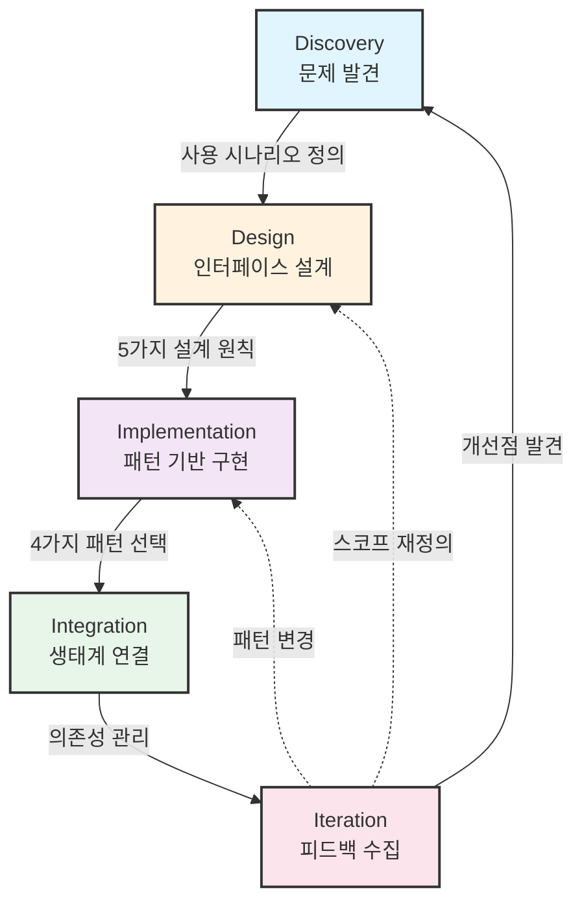
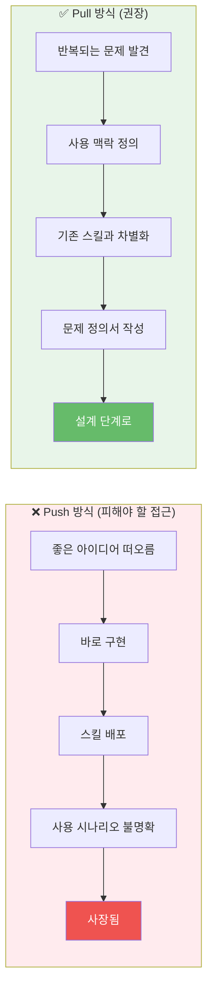
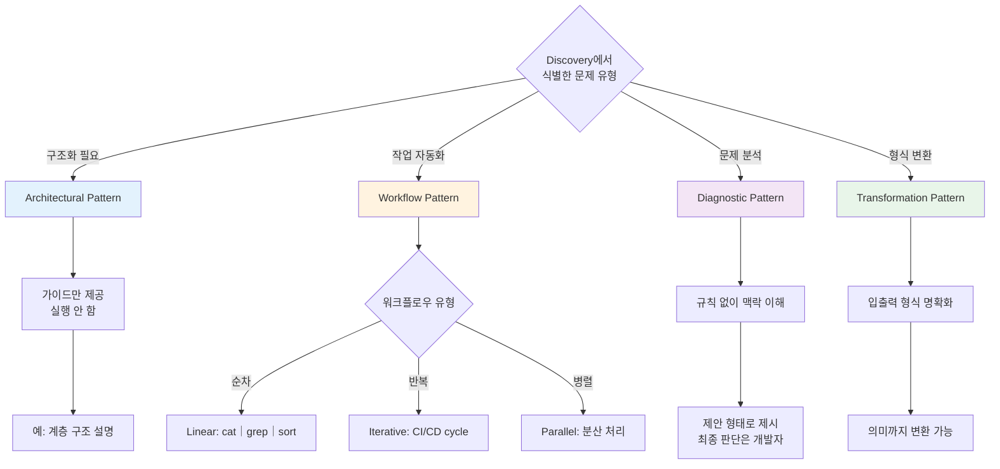
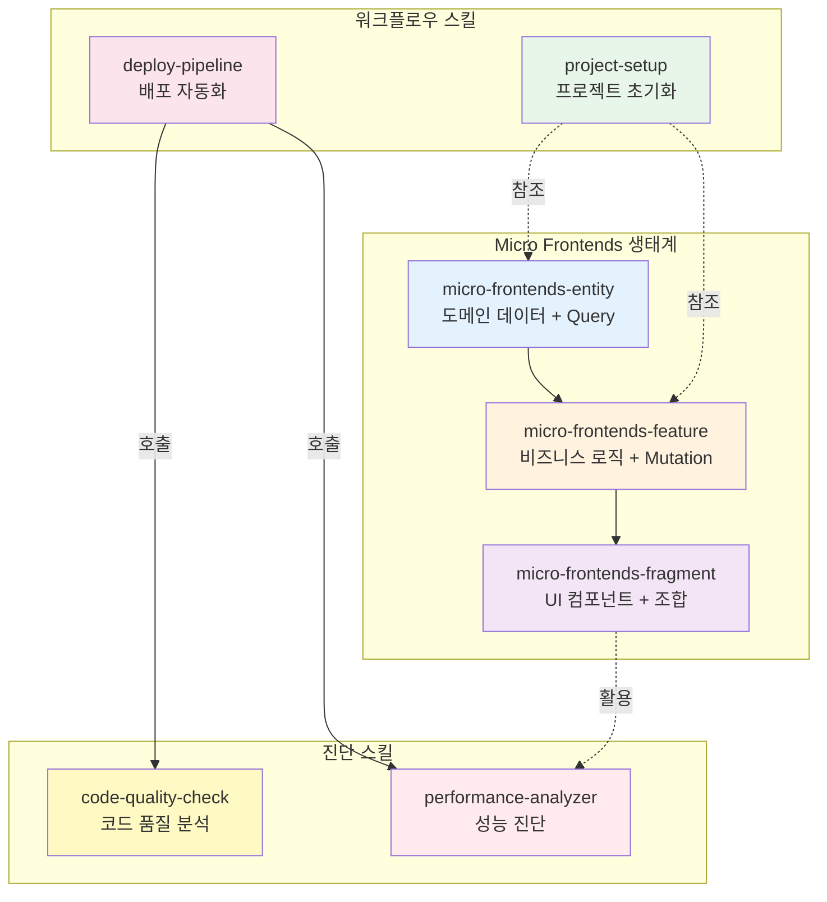
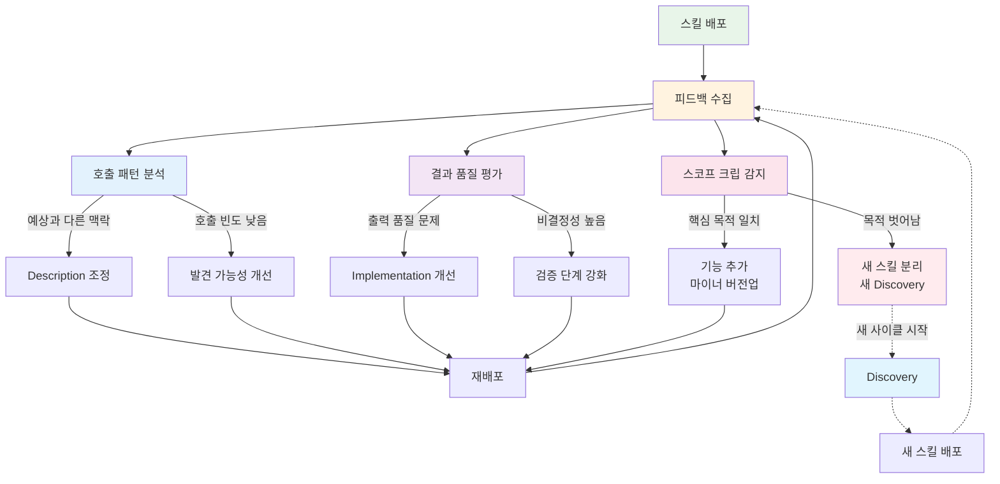

# Claude Code 스킬 생성 워크플로우: 개념에서 통합까지의 5단계 라이프사이클

## 한눈에 보기

Claude Code 스킬을 만드는 과정은 단순히 "코드를 작성하는 것"이 아닙니다. Discovery(발견), Design(설계), Implementation(구현), Integration(통합), Iteration(반복)의 5단계 라이프사이클을 따릅니다. 이 체계적인 워크플로우는 소프트웨어 개발 방법론의 수십 년 역사에서 검증된 원칙들을 AI 도구 개발에 맞게 재해석한 결과입니다.

---

## 들어가며

왜 스킬 생성에 체계적인 워크플로우가 필요할까요?

처음 스킬을 만들 때 흔히 저지르는 실수가 있습니다. "좋은 아이디어가 떠올랐으니 바로 구현하자"는 접근입니다. 문제는 그렇게 만든 스킬이 대부분 사장된다는 것입니다. 스코프가 불명확하고, 다른 스킬들과 연결되지 않으며, 사용자가 언제 이 스킬을 호출해야 하는지 알 수 없기 때문입니다.

Claude Code 스킬은 전통적인 소프트웨어와 근본적으로 다른 특성을 가집니다. 함수처럼 명시적으로 호출되는 것이 아니라 AI가 사용자의 의도를 해석하여 호출됩니다. 결과가 매번 달라질 수 있는 비결정성을 가집니다. 그리고 대화의 컨텍스트에 따라 같은 스킬도 다르게 동작합니다. 이러한 특수성 때문에 체계적인 워크플로우가 더욱 중요합니다.

이 글에서는 스킬 생성의 5단계 라이프사이클을 살펴봅니다. 각 단계가 왜 필요한지, 전통적인 소프트웨어 개발 방법론에서 어떤 교훈을 가져왔는지, 그리고 AI 도구 개발에서 어떻게 변형되었는지 탐구합니다.

---

## 5단계 라이프사이클: 개념부터 통합까지

스킬 생성의 5단계 라이프사이클은 각각 고유한 질문에 답합니다.

| 단계 | 핵심 질문 | 결과물 |
|------|----------|--------|
| Discovery | "이 스킬이 왜 필요한가?" | 문제 정의, 사용 시나리오 |
| Design | "AI가 어떻게 이해하고 실행할까?" | 프롬프트 설계, 설계 원칙 |
| Implementation | "어떤 패턴으로 구현할까?" | 스킬 코드, 예시 |
| Integration | "생태계와 어떻게 연결할까?" | 의존성 맵, 네이밍 |
| Iteration | "어떻게 개선할까?" | 피드백 반영, 버전 업데이트 |



흥미로운 점은 이 5단계가 전통적인 SDLC(Software Development Life Cycle)와 유사하면서도 다르다는 것입니다. Waterfall 모델의 순차적 명확성과 Agile의 반복적 개선, 그리고 Lean의 가치 중심 사고가 결합되어 있습니다. 그러나 AI 도구의 특수성을 반영하여 각 단계의 초점이 달라졌습니다.

---

## Discovery: 문제를 발견하고 정의하다

스킬 생성의 첫 단계는 "무엇을 만들 것인가"가 아니라 "왜 이것이 필요한가"입니다.

전통적인 소프트웨어 개발에서는 요구사항 수집 단계가 있습니다. 사용자가 원하는 기능을 정리하고 명세를 작성합니다. 그러나 스킬 생성 워크플로우의 Discovery 단계는 조금 다른 질문에서 시작합니다. "사용자가 어떤 상황에서 이 스킬을 호출하게 될까?"

이 접근은 Lean 방법론의 Pull 원칙에서 영감을 받았습니다. Toyota Production System에서 유래한 Pull 원칙은 "수요가 생산을 이끈다"는 것입니다. 스킬 생성에서 이것은 "실제 문제가 스킬을 이끈다"로 번역됩니다. 아무리 기술적으로 우아한 스킬이라도 실제 사용 시나리오가 없으면 가치가 없습니다.



Discovery 단계에서 답해야 할 질문들은 다음과 같습니다.

**반복되는 문제 식별**: "이 작업을 여러 번 반복했는가?" 한두 번 발생하는 문제는 스킬로 만들 가치가 없습니다. 여러 프로젝트에서, 여러 상황에서 반복적으로 발생하는 패턴이어야 합니다.

**사용 맥락 정의**: "사용자가 어떤 대화 흐름에서 이 스킬을 필요로 할까?" Claude Code는 자연어 대화를 통해 동작합니다. 사용자가 "Entity 계층을 어떻게 만들어야 해?"라고 물었을 때 호출되어야 하는지, "이 코드의 문제가 뭐야?"라고 물었을 때 호출되어야 하는지 명확해야 합니다.

**기존 스킬과의 차별화**: "비슷한 문제를 해결하는 스킬이 이미 있는가?" 스코프가 겹치는 스킬은 사용자를 혼란스럽게 합니다. 기존 스킬과 어떻게 다른지, 왜 새로운 스킬이 필요한지 명확한 근거가 있어야 합니다.

Discovery 단계의 결과물은 간결한 문제 정의서입니다. "이 스킬은 [특정 상황]에서 [특정 문제]를 해결한다. 기존의 [다른 스킬]과 달리 [차별점]에 초점을 맞춘다."

---

## Design: AI가 이해할 수 있는 인터페이스 설계

Discovery에서 "왜"를 정의했다면, Design에서는 "어떻게"를 설계합니다. 그러나 스킬 생성 워크플로우에서 Design 단계는 전통적인 소프트웨어 설계와 근본적으로 다릅니다. 스킬의 description이 곧 프롬프트이기 때문입니다.

전통적인 API 설계에서 문서는 인간 개발자를 위한 것입니다. 함수 시그니처와 파라미터 설명을 읽고 개발자가 올바르게 호출합니다. 그러나 스킬의 description은 LLM이 읽고 해석합니다. LLM은 description을 바탕으로 "이 스킬을 언제 호출할지", "어떤 컨텍스트 정보를 전달할지"를 결정합니다.

이 특수성 때문에 UX 디자인과 API 문서화의 원칙이 스킬 설계에 통합됩니다. 특히 다음 5가지 설계 원칙이 스킬 생성 워크플로우의 Design 단계에서 핵심이 됩니다.

### Progressive Disclosure (점진적 공개)

1970년대 IBM의 연구에서 시작되어 Don Norman의 "The Design of Everyday Things"에서 체계화된 이 원칙은 "복잡한 정보를 한 번에 보여주지 말라"는 것입니다. 스킬 생성 워크플로우에서 이것은 description의 구조에 적용됩니다. 첫 문장에서 핵심 기능을 설명하고, 고급 옵션은 나중에 언급합니다.

```markdown
## 기본 사용법
가장 흔한 케이스 (80%)를 먼저 다룹니다.

<details>
<summary>고급 옵션</summary>
특수한 경우에만 필요한 기능을 여기에 배치합니다.
</details>
```

### Inline Examples (인라인 예시)

Steve Krug의 "Don't Make Me Think" 원칙에 따르면, 사용자가 생각할 필요 없이 바로 이해할 수 있어야 합니다. 스킬 생성 워크플로우에서 이것은 추상적 설명 옆에 바로 실행 가능한 예시를 배치하는 것을 의미합니다.

```markdown
## Entity는 도메인 데이터만 다룹니다

```typescript
// 좋은 예: 순수한 데이터 Query
export const productQuery = (id: string) =>
  queryOptions({
    queryKey: ['product', id],
    queryFn: () => api.getProduct(id),
  });

// 나쁜 예: UI 상태 포함
export const productQuery = (id: string) =>
  queryOptions({
    queryKey: ['product', id],
    queryFn: () => api.getProduct(id),
    select: (data) => ({ ...data, isExpanded: false }), // UI 로직
  });
```
```

### Error Anticipation (에러 예측)

사용자가 실수하기 쉬운 부분을 미리 짚어줍니다. 스킬 생성 워크플로우에서 이것은 "흔한 실수" 섹션을 통해 구현됩니다. 사용자가 직접 실수하고 나서야 깨닫는 것이 아니라, 미리 경고를 받을 수 있어야 합니다.

### Scope Statement (스코프 명시)

"이 스킬이 무엇을 하고, 무엇을 하지 않는지" 명확히 밝힙니다. LLM은 모호한 description을 만나면 부적절한 시점에 스킬을 호출할 수 있습니다. 명확한 스코프 선언은 이를 방지합니다.

### Integration Map (통합 맵)

이 스킬이 다른 스킬들과 어떻게 연결되는지 보여줍니다. 정보 아키텍처(Information Architecture) 분야에서 발전한 이 개념은 개별 정보가 전체 구조에서 어떤 위치를 차지하는지 명확히 하는 것입니다.

---

## Implementation: 비결정성을 받아들이다

Design이 "무엇을"을 정의했다면, Implementation은 "어떻게"를 코드로 구현합니다. 그러나 스킬 생성 워크플로우의 Implementation 단계는 전통적인 소프트웨어 구현과 다른 철학을 요구합니다.

전통적인 프로그래밍은 결정론적입니다. 같은 입력에 같은 출력이 나옵니다. 그러나 LLM 기반 스킬은 비결정적입니다. 같은 호출에도 미묘하게 다른 결과가 나올 수 있습니다. 스킬 생성 워크플로우에서 Implementation 단계의 핵심은 이 비결정성을 억제하는 것이 아니라 받아들이고 활용하는 것입니다.

Discovery 단계에서 식별한 문제의 성격에 따라 4가지 패턴 중 하나를 선택합니다. 각 패턴은 GoF(Gang of Four) 디자인 패턴과 Unix 철학에서 영감을 받았지만, AI 도구의 특성을 반영하여 변형되었습니다.



### Architectural Pattern 구현

"어떻게 구조화할까?"라는 질문에 답하는 스킬입니다. 흥미로운 점은 이 패턴의 스킬이 **실행하지 않는다**는 것입니다. 코드를 생성하거나 파일을 만들지 않고, 오직 가이드와 체크리스트만 제공합니다.

GoF 패턴에서 영감을 받은 이 접근은 관심사 분리(Separation of Concerns) 원칙을 따릅니다. "무엇을 해야 하는가"를 알려주는 것과 "실제로 실행하는 것"을 분리합니다. 이렇게 하면 개발자가 구조적 결정의 근거를 먼저 이해하고, 자신의 맥락에 맞게 적용할 수 있습니다.

### Workflow Pattern 구현

"일련의 작업을 자동화"하는 스킬입니다. Unix 파이프라인의 `cat | grep | sort`에서 영감을 받은 Linear Workflow, CI/CD의 빌드-테스트-배포 사이클에서 영감을 받은 Iterative Workflow, 분산 시스템의 병렬 처리에서 영감을 받은 Parallel Workflow로 나뉩니다.

스킬 생성 워크플로우에서 Workflow Pattern을 구현할 때 핵심은 검증 단계입니다. 비결정적 LLM 출력을 신뢰할 수 있게 만드는 것은 중간 검증과 피드백 루프입니다.

### Diagnostic Pattern 구현

"문제를 분석하고 해결책을 제안"하는 스킬입니다. 전통적인 규칙 기반 린터(ESLint 등)와 달리, LLM 기반 Diagnostic은 명시적 규칙 없이도 맥락을 이해하고 문제를 진단할 수 있습니다. 스킬 생성 워크플로우에서 이 패턴을 구현할 때 주의할 점은 False Positive(오탐)의 가능성입니다. 결과를 제안 형태로 제시하고 최종 판단은 개발자에게 맡겨야 합니다.

### Transformation Pattern 구현

"입력 데이터를 다른 형식으로 변환"하는 스킬입니다. 컴파일러, 트랜스파일러, ETL 도구의 계보를 잇지만, LLM은 형식뿐 아니라 의미까지 변환할 수 있습니다. 스킬 생성 워크플로우에서 이 패턴을 구현할 때는 입출력 형식을 명확히 정의하고, 예외 케이스 처리를 신중히 설계해야 합니다.

---

## Integration: 생태계의 일부가 되다

Implementation이 완료되면 스킬은 기술적으로 동작합니다. 그러나 고립된 스킬은 가치가 제한적입니다. Integration 단계는 새로운 스킬을 기존 스킬 생태계와 연결하는 과정입니다.

소프트웨어 아키텍처에서 플러그인 시스템의 역사는 깊습니다. Eclipse IDE의 플러그인 아키텍처, WordPress의 훅 시스템, VS Code의 확장 생태계는 모두 "핵심 시스템은 작게 유지하고, 기능은 플러그인으로 확장한다"는 철학을 공유합니다. 스킬 생성 워크플로우의 Integration 단계도 이 철학을 따릅니다.

### 의존성 관리

새 스킬이 다른 스킬에 의존하는지, 또는 다른 스킬이 이 스킬을 필요로 하는지 명확히 해야 합니다. 예를 들어 `micro-frontends-feature` 스킬은 `micro-frontends-entity` 스킬을 참조합니다. Entity 계층 없이 Feature 계층을 논할 수 없기 때문입니다. 이러한 의존성 관계는 스킬의 description에 명시되어야 합니다.



### 네이밍 컨벤션

이름은 발견 가능성(Discoverability)의 핵심입니다. `micro-frontends-entity`, `micro-frontends-feature`, `micro-frontends-fragment`처럼 접두사를 공유하면 관련 스킬을 그룹으로 인식할 수 있습니다. 네이밍은 정보 아키텍처의 핵심 요소이며, 스킬 생성 워크플로우에서 Integration 단계의 중요한 결정입니다.

### 버전 관리

스킬도 진화합니다. Breaking change가 발생하면 기존 사용자에게 영향을 줍니다. Semantic Versioning의 원칙을 따라 메이저, 마이너, 패치 버전을 관리하고, Changelog를 유지해야 합니다. 스킬 생성 워크플로우에서 Integration 단계는 이러한 장기적 유지보수 계획도 포함합니다.

### 조합 패턴

개별 스킬은 레고 블록처럼 조합될 수 있어야 합니다. Workflow 스킬이 Diagnostic 스킬을 호출하고, 그 결과를 바탕으로 Transformation을 수행하는 식입니다. Unix 철학의 "작은 도구들의 조합"이 스킬 생태계에도 적용됩니다.

---

## Iteration: 지속적으로 개선하다

스킬이 배포되었다고 끝이 아닙니다. Iteration 단계는 스킬 생성 워크플로우의 마지막이자 처음으로 돌아가는 순환점입니다.

Agile 방법론의 핵심 통찰은 "완벽한 계획보다 빠른 피드백"입니다. 2001년 Agile Manifesto가 선언한 "Working software over comprehensive documentation"은 스킬 생성 워크플로우에도 적용됩니다. 처음부터 완벽한 스킬을 만들려 하지 말고, 빠르게 배포하고 피드백을 받아 개선하는 것이 효과적입니다.

Iteration 단계에서 수집해야 할 피드백은 다음과 같습니다.

**호출 패턴 분석**: "사용자가 이 스킬을 언제 호출하는가?" 예상과 다른 맥락에서 호출된다면 description을 조정해야 합니다. 예상보다 적게 호출된다면 발견 가능성 문제일 수 있습니다.

**결과 품질 평가**: "스킬의 출력이 사용자의 기대를 충족하는가?" LLM 기반 스킬은 비결정적이므로, 다양한 입력에 대한 출력 품질을 모니터링해야 합니다.

**스코프 크립 감지**: "스킬이 원래 목적을 벗어나고 있지 않은가?" 사용자 요청에 따라 기능을 계속 추가하다 보면 스킬이 비대해질 수 있습니다. 새로운 기능이 스킬의 핵심 목적과 일치하는지, 별도 스킬로 분리해야 하는지 판단해야 합니다.



Iteration 단계의 결과는 Discovery로 다시 연결됩니다. 피드백에서 새로운 문제가 발견되면 새로운 스킬의 Discovery가 시작됩니다. 기존 스킬의 개선점이 발견되면 Design부터 다시 시작합니다. 이것이 라이프사이클이 "cycle"인 이유입니다.

---

## 트레이드오프: 구조화 vs 유연성

5단계 라이프사이클이라는 체계적인 워크플로우는 분명한 장점을 제공합니다. 그러나 모든 설계 결정에는 트레이드오프가 있습니다.

### 체계적 워크플로우의 장점

**일관성**: 모든 스킬이 동일한 프로세스를 거쳐 만들어지므로 품질이 균일해집니다.

**예측 가능성**: 각 단계에서 무엇을 해야 하는지 명확하므로 스킬 생성 시간을 예측할 수 있습니다.

**학습 용이성**: 새로운 스킬 개발자도 라이프사이클을 따라가면 됩니다.

**통합성**: Integration 단계가 명시적으로 존재하므로 고립된 스킬이 줄어듭니다.

### 체계적 워크플로우의 단점

**오버헤드**: 단순한 스킬에도 5단계를 모두 거쳐야 하면 비효율적입니다.

**창의성 제약**: 프레임워크가 사고를 제한할 수 있습니다. "이 스킬은 어떤 패턴에도 안 맞는데?"라는 상황이 발생할 수 있습니다.

**경직성**: 빠르게 실험하고 싶을 때 프로세스가 발목을 잡을 수 있습니다.

### 하이브리드 접근법

현실적인 해결책은 스킬의 복잡도와 영향 범위에 따라 프로세스의 강도를 조절하는 것입니다.

**실험적 스킬**: Discovery → Implementation → Iteration (Design, Integration 간소화)

**핵심 스킬**: 5단계 전체를 엄격하게 수행

**생태계 스킬**: Integration에 특히 많은 시간 투자

Ad-hoc 접근과 체계적 접근 사이에서 적절한 균형점을 찾는 것이 스킬 개발자의 판단력입니다.

---

## 마무리하며

스킬 생성 워크플로우의 5단계 라이프사이클은 단순한 프로세스 정의가 아닙니다. 이것은 "AI 도구를 어떻게 체계적으로 개발하고 유지할 것인가"라는 질문에 대한 구조화된 답변입니다.

Discovery 단계는 Lean의 Pull 원칙을 적용하여 실제 문제에서 출발합니다. Design 단계는 UX 디자인과 API 문서화의 원칙을 LLM 맥락에 맞게 재해석합니다. Implementation 단계는 GoF 패턴의 지혜를 활용하되 비결정성이라는 새로운 특성을 수용합니다. Integration 단계는 플러그인 아키텍처의 역사에서 배운 생태계 사고를 적용합니다. Iteration 단계는 Agile의 피드백 중심 철학을 구현합니다.

이 워크플로우가 스킬 생태계에 미치는 영향은 개별 스킬의 품질 향상을 넘어섭니다. 체계적으로 개발된 스킬들은 서로 자연스럽게 연결됩니다. 명확한 스코프와 통합 맵을 가진 스킬들은 조합하여 더 큰 가치를 만들어냅니다. 이것이 생태계의 힘입니다.

소프트웨어 개발 방법론의 수십 년 역사가 스킬 생성 워크플로우에 녹아 있습니다. Waterfall의 명확한 단계 구분, Agile의 반복적 개선, Lean의 가치 중심 사고, GoF의 패턴 분류, Unix의 조합 철학—이 모든 것이 AI 도구 개발이라는 새로운 맥락에서 재해석되어 5단계 라이프사이클을 형성합니다.

Claude Code 스킬 생태계는 아직 초기 단계입니다. 더 많은 스킬이 만들어지고, 더 많은 패턴이 발견되고, 더 많은 개선이 이루어질 것입니다. 체계적인 워크플로우는 이 성장의 기반이 됩니다. 개별 스킬 개발자의 창의성과 생태계 전체의 일관성 사이에서 균형을 잡는 것—이것이 스킬 생성 워크플로우의 궁극적인 목표입니다.

---

## 더 읽어볼 자료

- **Lean Software Development** - Mary와 Tom Poppendieck의 Lean 원칙 적용 가이드
- **The Design of Everyday Things** - Don Norman의 UX 디자인 고전
- **Gang of Four Design Patterns** - 소프트웨어 디자인 패턴의 원전
- **Unix Philosophy** - Doug McIlroy의 "작은 프로그램들의 조합" 철학
- **Agile Manifesto** - agilemanifesto.org에서 원문과 원칙 확인
- **Claude Code 공식 문서** - Anthropic의 Claude Code CLI 가이드
