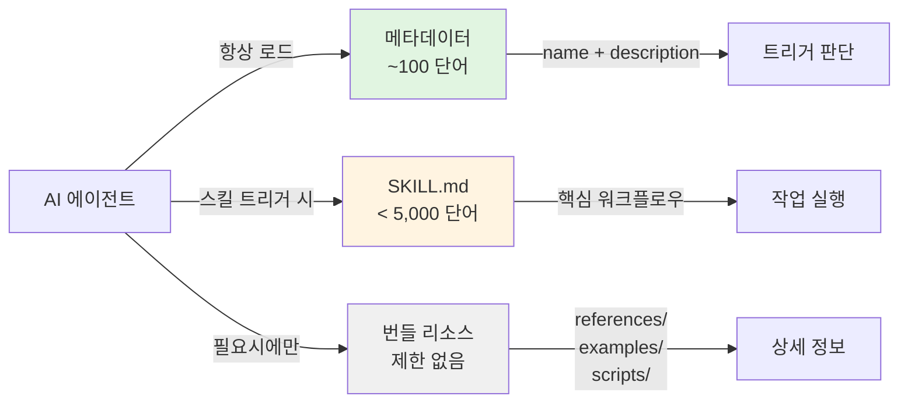
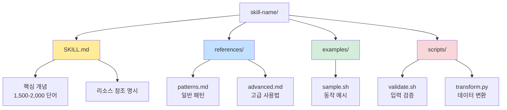
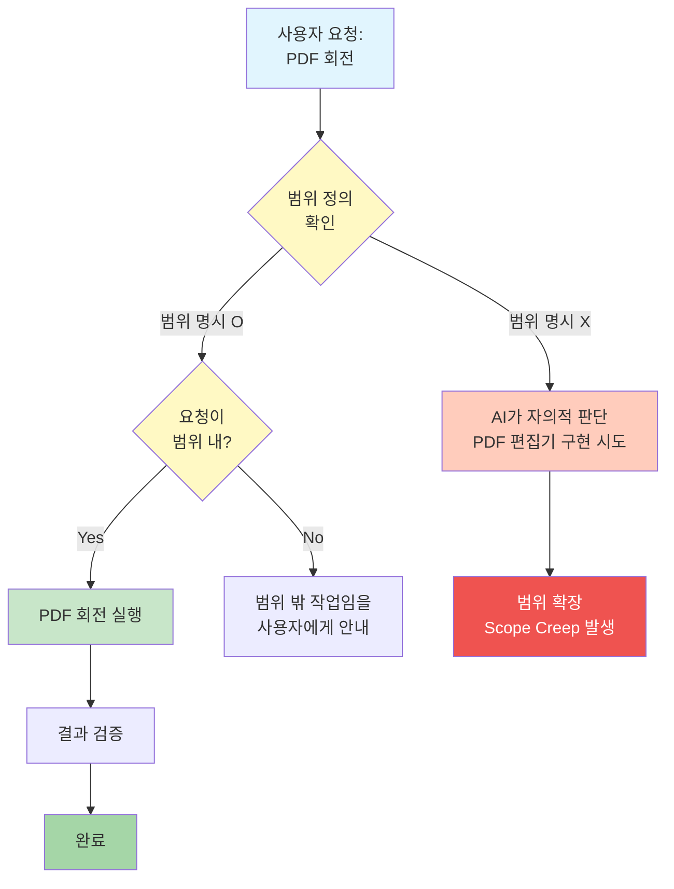

# 스킬 설계 베스트 프랙티스와 흔한 실수

## 한눈에 보기

스킬(Skill)은 AI 에이전트에게 특정 도메인의 전문 지식과 워크플로우를 제공하는 모듈화된 지식 패키지입니다. 잘 설계된 스킬은 범용 AI를 해당 분야의 전문가로 변환시키지만, 설계 원칙을 무시한 스킬은 오히려 AI의 성능을 저하시킵니다. 이 글에서는 효과적인 스킬 설계의 핵심 원칙과 피해야 할 실수들을 탐구합니다.

---

## 들어가며

AI 에이전트 시대가 도래하면서 새로운 설계 영역이 등장했습니다. 바로 "스킬 설계"입니다. 스킬이란 무엇일까요? 한마디로 정의하면, AI가 특정 작업을 수행할 때 참조하는 **절차적 지식의 패키지**입니다. 마치 새로운 팀원에게 업무 매뉴얼을 건네주듯, 스킬은 AI에게 도메인 특화된 지식, 워크플로우, 도구 사용법을 전달합니다.

그런데 왜 스킬이 필요할까요? 아무리 뛰어난 대형 언어 모델이라도 모든 절차적 지식을 내재화할 수 없습니다. 회사의 내부 API 스펙, 특정 프레임워크의 관용적 패턴, 팀의 코딩 컨벤션 같은 것들은 모델의 학습 데이터에 없습니다. 스킬은 이 간극을 메웁니다.

하지만 스킬 설계는 기존의 코드 작성이나 문서화와는 다른 도전을 안고 있습니다. 독자가 사람이 아니라 AI이기 때문입니다. AI는 모호한 지시를 자의적으로 해석하고, 너무 많은 정보에 압도되며, 명확한 경계가 없으면 범위를 무한히 확장하려 합니다. 이 글에서는 이러한 AI 독자의 특성을 고려한 스킬 설계의 핵심 원칙과 흔한 실수들을 살펴봅니다.

---

## 1. 스킬 설계의 핵심 과제: AI라는 독자 이해하기

스킬 설계에서 가장 먼저 마주하는 질문은 "누가 이 문서를 읽는가?"입니다. 답은 명확합니다. AI입니다. 그리고 AI 독자는 인간 독자와 근본적으로 다른 특성을 가집니다.

### 컨텍스트 윈도우의 제약

AI 모델은 한 번에 처리할 수 있는 텍스트 양에 제한이 있습니다. 이를 컨텍스트 윈도우라 부릅니다. 스킬의 모든 내용이 항상 이 윈도우에 로드되는 것은 아닙니다. 따라서 스킬 설계자는 "어떤 정보가 언제 로드되어야 하는가?"를 신중하게 결정해야 합니다.



이 구조는 "필요한 것만, 필요할 때"라는 원칙을 반영합니다. 8,000단어짜리 스킬 파일 하나에 모든 것을 담으면, 스킬이 트리거될 때마다 불필요한 세부사항까지 컨텍스트를 점유합니다.

### 트리거 정확도의 중요성

스킬은 사용자가 직접 호출하는 것이 아니라 AI가 자율적으로 판단해서 사용합니다. 이 판단의 근거가 되는 것이 스킬의 `description` 필드입니다. 여기에 적힌 문구가 모호하면 AI는 엉뚱한 상황에서 스킬을 호출하거나, 필요한 상황에서 호출하지 않습니다.

```yaml
# 나쁜 예: 모호한 트리거
description: 개발 작업을 도와주는 스킬입니다.

# 좋은 예: 구체적인 트리거 문구
description: This skill should be used when the user asks to
  "create a hook", "add a PreToolUse hook", "validate tool use",
  or mentions hook events (PreToolUse, PostToolUse, Stop).
```

후자의 예시가 영어로 작성된 것은 우연이 아닙니다. AI 모델은 영어로 학습된 경우가 많아, 트리거 판단 시 영어 문구가 더 정확하게 작동하는 경향이 있습니다. 또한 3인칭 형식("This skill should be used when...")을 사용하는 것도 AI가 객관적으로 상황을 판단하도록 돕습니다.

---

## 2. Progressive Disclosure: 복잡도를 단계적으로 공개하기

스킬 설계에서 가장 중요한 원칙 중 하나가 "점진적 공개(Progressive Disclosure)"입니다. 이 개념은 UI/UX 디자인에서 왔지만, AI를 위한 스킬 설계에서 더욱 중요해집니다.

### 왜 점진적 공개가 필요한가

인간 개발자에게 방대한 문서를 한꺼번에 주면 필요한 부분만 찾아 읽습니다. 하지만 AI에게 같은 문서를 주면 전체를 컨텍스트에 로드하려 하고, 이는 두 가지 문제를 일으킵니다.

첫째, 컨텍스트 낭비입니다. 단순한 PDF 회전 작업에 BigQuery 스키마 문서까지 로드할 필요가 없습니다.

둘째, 주의 분산입니다. AI는 컨텍스트에 있는 모든 정보를 고려하려 합니다. 관련 없는 정보가 많을수록 핵심에서 벗어날 가능성이 높아집니다.

### 실제 구현 패턴

효과적인 스킬 구조를 살펴보겠습니다.



SKILL.md에는 "이 스킬이 무엇인지", "언제 사용하는지", "핵심 워크플로우"만 담습니다. 구체적인 API 명세, 엣지 케이스 처리, 마이그레이션 가이드는 `references/` 디렉토리에 분리합니다.

중요한 것은 SKILL.md에서 이 리소스들을 명시적으로 언급하는 것입니다.

```markdown
## 추가 리소스

상세한 패턴과 기법은 다음 파일을 참조하세요:
- **`references/patterns.md`** - 일반적인 사용 패턴
- **`references/advanced.md`** - 고급 기법과 엣지 케이스

작동하는 예시 코드:
- **`examples/sample.sh`** - 기본 사용법 시연
```

AI는 이 참조를 보고 필요할 때 해당 파일을 로드합니다. 마치 사람이 목차를 보고 필요한 장으로 이동하는 것과 같습니다.

### 정보 배치의 원칙

어떤 정보를 어디에 둘 것인가? 이 질문에 대한 답은 UNIX 철학의 "한 가지를 잘하라(Do One Thing Well)"에서 찾을 수 있습니다.

SKILL.md에 포함할 것:
- 스킬의 목적과 범위 정의
- 핵심 워크플로우 (3-5단계 이내)
- 가장 흔한 사용 케이스
- 리소스 파일 참조

references/에 분리할 것:
- 상세한 API 명세
- 엣지 케이스와 예외 처리
- 마이그레이션/업그레이드 가이드
- 상세한 문제 해결 가이드

scripts/에 포함할 것:
- 반복적으로 작성되는 코드
- 검증 유틸리티
- 결정론적 신뢰성이 필요한 로직

---

## 3. Error Anticipation: AI의 실수를 예방하는 설계

AI는 실수합니다. 중요한 것은 실수를 비난하는 것이 아니라, 실수하기 어렵게 설계하는 것입니다. 이것이 "방어적 프로그래밍"의 AI 버전입니다.

### AI가 흔히 하는 실수 유형

첫째, 범위 확장(Scope Creep)입니다. "PDF 회전" 스킬에게 작업을 맡겼는데 PDF 편집기 전체를 구현하려 합니다. AI는 "더 좋게 만들자"는 본능이 있어서, 명시적 경계가 없으면 범위를 넓히려 합니다.

둘째, 도구 오용입니다. 스킬에서 특정 도구 사용을 안내했는데, AI가 더 "효율적"이라고 판단한 다른 도구를 사용합니다.

셋째, 순서 무시입니다. 워크플로우의 단계를 건너뛰거나 순서를 바꿉니다.

### 예방적 설계 패턴

이러한 실수를 예방하는 몇 가지 패턴이 있습니다.

**명시적 범위 선언(Scope Statement)**

스킬 시작 부분에 "이 스킬이 하는 것"과 "하지 않는 것"을 명시합니다.

```markdown
## 범위

이 스킬은 다음을 수행합니다:
- PDF 페이지 회전 (90, 180, 270도)
- 회전된 PDF 저장

이 스킬은 다음을 수행하지 않습니다:
- PDF 내용 편집
- PDF 병합 또는 분할
- OCR 또는 텍스트 추출
```

범위 선언이 AI의 의사결정에 미치는 영향을 시각화하면 다음과 같습니다.



**필수 단계 강조**

워크플로우에서 건너뛰면 안 되는 단계를 명확히 표시합니다.

```markdown
## 워크플로우

1. 입력 파일 검증 (필수 - 절대 건너뛰지 마세요)
2. 회전 각도 확인
3. 변환 실행
4. 결과 검증 (필수)
```

**부정적 예시 포함**

AI에게 "하지 말아야 할 것"을 보여주는 것도 효과적입니다.

```markdown
## 흔한 실수

다음은 피해야 할 패턴입니다:

### 잘못된 예
```python
# 파일 존재 여부를 확인하지 않고 바로 처리
rotate_pdf(input_file)  # 위험!
```

### 올바른 예
```python
# 먼저 파일 존재 여부 확인
if not os.path.exists(input_file):
    raise FileNotFoundError(f"파일을 찾을 수 없습니다: {input_file}")
rotate_pdf(input_file)
```
```

### 명령형 문체의 힘

스킬 작성 시 문체도 중요합니다. 2인칭("You should...")보다 명령형("Validate the input")이 AI에게 더 명확하게 전달됩니다.

```markdown
# 비권장
당신은 먼저 파일을 확인해야 합니다.
그 다음 당신은 변환을 실행할 수 있습니다.

# 권장
파일을 먼저 확인하세요.
변환을 실행하세요.
```

명령형 문체는 모호함을 줄이고, AI가 지시를 직접적인 행동으로 연결하도록 돕습니다.

---

## 4. 유지보수성: 시간이 지나도 유효한 스킬

스킬은 한번 작성하고 끝나는 것이 아닙니다. 도구가 업데이트되고, 요구사항이 변하며, 새로운 패턴이 발견됩니다. 유지보수하기 쉬운 스킬을 설계하는 것은 장기적 관점에서 필수입니다.

### Single Source of Truth 원칙

소프트웨어 공학의 고전적 원칙인 "단일 진실 공급원(Single Source of Truth, SSOT)"은 스킬 설계에서도 유효합니다. 같은 정보가 SKILL.md와 references/patterns.md에 중복되면, 나중에 하나만 업데이트하고 다른 하나는 잊어버리는 상황이 발생합니다.

```markdown
# 나쁜 예: 정보 중복
## SKILL.md
API 엔드포인트: https://api.example.com/v2
...

## references/api-docs.md
API 엔드포인트: https://api.example.com/v2  # 나중에 v3로 변경 시 여기를 놓칠 수 있음
```

```markdown
# 좋은 예: 참조로 연결
## SKILL.md
API 엔드포인트와 상세 스펙은 `references/api-docs.md`를 참조하세요.

## references/api-docs.md
API 엔드포인트: https://api.example.com/v2
...
```

### 버전 관리 고려

스킬이 외부 도구나 API에 의존한다면, 버전 정보를 명시하는 것이 좋습니다.

```yaml
---
name: BigQuery Skill
description: This skill should be used when querying BigQuery...
version: 1.2.0
---

# BigQuery 스킬

## 호환성
- BigQuery API v2 호환
- google-cloud-bigquery Python 패키지 3.x 필요
- 마지막 검증일: 2026-01-15
```

이렇게 하면 스킬이 동작하지 않을 때 원인을 빠르게 파악할 수 있습니다.

### 반복 작업의 스크립트화

같은 코드를 AI가 매번 새로 작성하면 미세한 차이가 생기고, 이는 유지보수 비용으로 이어집니다. 반복적인 작업은 스크립트로 만들어 스킬에 번들하세요.

```
skill-name/
└── scripts/
    ├── validate.sh      # 입력 검증
    ├── transform.py     # 데이터 변환
    └── test-runner.sh   # 테스트 실행
```

스크립트의 장점:
- 결정론적(Deterministic): 같은 입력에 항상 같은 출력
- 토큰 효율적: 실행만 하면 되므로 컨텍스트 사용 최소화
- 테스트 가능: 스크립트는 별도로 테스트할 수 있음

---

## 5. 흔한 실수들 (Gotchas)

스킬 설계에서 자주 발생하는 실수들을 정리했습니다.

### 실수 1: 모호한 트리거 설명

```yaml
# 나쁜 예
description: 개발 작업을 도와주는 스킬

# 왜 나쁜가: "개발 작업"이 무엇인지 불명확.
# AI가 언제 이 스킬을 선택해야 할지 판단 불가.

# 좋은 예
description: This skill should be used when the user asks to
  "create a React component", "set up TypeScript config",
  "add ESLint rules", or mentions frontend development patterns.
```

### 실수 2: 모든 것을 SKILL.md에 담기

```
# 나쁜 예
skill-name/
└── SKILL.md  (8,000 단어 - 모든 내용이 한 파일에)

# 왜 나쁜가: 스킬 트리거 시 불필요한 세부사항까지 로드됨.
# 간단한 작업에도 전체 문서가 컨텍스트 점유.

# 좋은 예
skill-name/
├── SKILL.md  (1,800 단어 - 핵심만)
└── references/
    ├── patterns.md (2,500 단어)
    └── advanced.md (3,700 단어)
```

### 실수 3: 리소스 참조 누락

```markdown
# 나쁜 예 - AI가 references/가 있는지 모름
# SKILL.md
[핵심 내용만 있고 리소스 언급 없음]

# 좋은 예 - 명시적 참조
## 추가 리소스

상세 가이드:
- **`references/patterns.md`** - 상세 패턴
- **`references/advanced.md`** - 고급 기법
```

### 실수 4: 범위 정의 없음

AI는 "더 좋은" 결과를 위해 범위를 확장하려는 경향이 있습니다. 명시적 범위 정의가 없으면 PDF 회전 스킬이 PDF 편집기 전체를 구현하려 할 수 있습니다.

```markdown
# 권장: 스킬 초반에 범위 명시
## 이 스킬의 범위

수행하는 것:
- PDF 페이지 회전

수행하지 않는 것:
- PDF 편집, 병합, 분할, OCR
```

### 실수 5: 2인칭 사용

```markdown
# 나쁜 예
당신은 먼저 파일을 검증해야 합니다.
당신이 원한다면 옵션을 변경할 수 있습니다.

# 좋은 예
파일을 먼저 검증하세요.
필요시 옵션을 변경하세요.
```

명령형 문체가 AI에게 더 직접적으로 전달됩니다.

---

## 트레이드오프

스킬 설계는 여러 트레이드오프 사이에서 균형을 잡는 작업입니다.

### 완전성 vs 간결성

완전한 정보를 담으려면 스킬이 길어지고, 간결하게 만들면 정보가 부족해집니다. 점진적 공개가 이 딜레마의 해법이지만, 완벽하지는 않습니다. 참조 파일이 너무 많으면 AI가 어느 파일을 봐야 할지 혼란스러워합니다.

**가이드라인**: 참조 파일은 3-5개 이내로 유지하고, 각 파일의 목적을 명확히 기술하세요.

### 구체성 vs 유연성

너무 구체적인 스킬은 예상치 못한 상황에 대응하지 못하고, 너무 유연한 스킬은 AI가 범위를 벗어난 행동을 합니다.

**가이드라인**: 핵심 워크플로우는 구체적으로, 엣지 케이스 처리는 원칙 기반으로 기술하세요.

### 자동화 vs 제어

스크립트를 많이 번들하면 결과가 일관되지만 유연성이 떨어지고, AI에게 더 많은 자율권을 주면 유연하지만 예측 가능성이 낮아집니다.

**가이드라인**: 결정론적 신뢰성이 필요한 작업(검증, 변환)은 스크립트로, 상황 판단이 필요한 작업은 가이드라인으로 제공하세요.

---

## 마무리하며

스킬 설계는 전통적인 문서화나 프로그래밍과는 다른 새로운 영역입니다. 독자가 AI라는 점이 모든 차이를 만듭니다. 인간 독자를 위한 문서화 원칙들, 예를 들어 점진적 공개, 명확한 범위 정의, 예시 중심 설명 등은 여전히 유효하지만, AI의 특성을 고려한 조정이 필요합니다.

핵심 원칙을 정리하면 다음과 같습니다.

1. **트리거 설명을 구체적으로**: 모호한 설명은 잘못된 호출로 이어집니다.
2. **점진적 공개를 활용**: 핵심은 SKILL.md에, 세부사항은 references/에.
3. **명시적 범위 정의**: AI의 범위 확장 경향을 제어합니다.
4. **방어적으로 설계**: AI가 실수하기 어렵게 만드세요.
5. **유지보수를 고려**: 중복을 피하고 버전을 관리하세요.

스킬은 AI 에이전트 시대의 새로운 추상화 계층입니다. 잘 설계된 스킬은 범용 AI를 도메인 전문가로 변환시키는 강력한 도구가 됩니다. 이 글에서 다룬 원칙들이 여러분의 스킬 설계에 도움이 되기를 바랍니다.

---

## 더 읽어볼 자료

- [Claude Code Plugin Development Guide](https://docs.anthropic.com/claude-code/plugins) - 공식 플러그인 개발 가이드
- [Progressive Disclosure in UX](https://www.nngroup.com/articles/progressive-disclosure/) - Nielsen Norman Group의 점진적 공개 원칙
- [The Art of UNIX Programming](http://www.catb.org/~esr/writings/taoup/) - UNIX 철학의 원전
- [Defensive Programming](https://en.wikipedia.org/wiki/Defensive_programming) - 방어적 프로그래밍 개요
- [Single Source of Truth](https://en.wikipedia.org/wiki/Single_source_of_truth) - SSOT 원칙 설명
