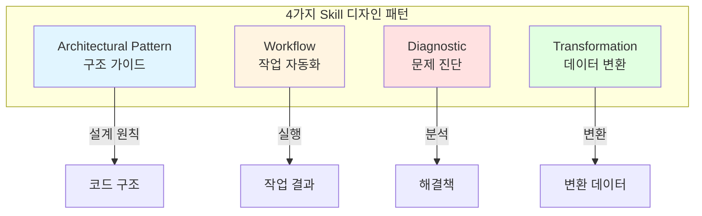
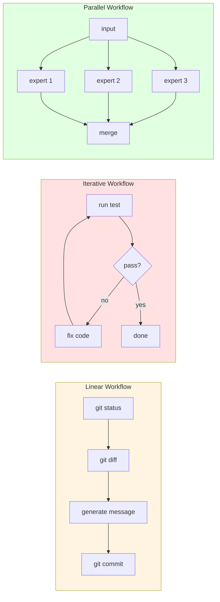
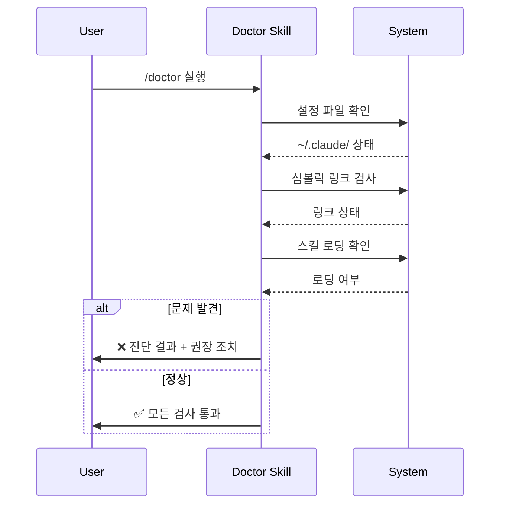
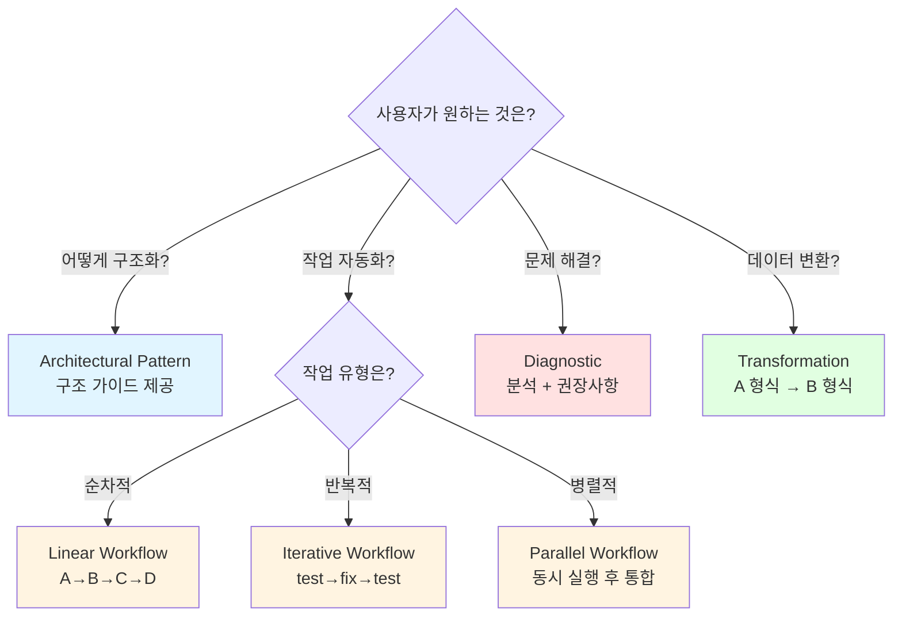
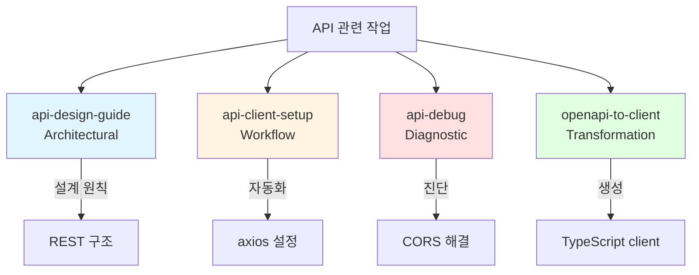

# Claude Code 스킬 디자인 패턴: 4가지 분류로 보는 AI 도구 설계의 미학

## 한눈에 보기

Claude Code 스킬은 Architectural Pattern, Workflow Pattern, Diagnostic Pattern, Transformation Pattern이라는 4가지 패턴으로 분류됩니다. 이 분류는 단순한 카테고리가 아니라 "어떤 문제를 어떻게 해결하는가"라는 본질적 질문에 대한 답입니다. Gang of Four의 디자인 패턴과 Unix 철학에서 영감을 받았지만, AI 도구만의 특수성을 반영하여 진화했습니다.

---

## 들어가며

Claude Code 스킬을 어떻게 분류하고 설계하는가는 단순한 정리의 문제가 아닙니다. 이것은 "AI 도구가 개발자의 작업을 어떤 방식으로 도울 수 있는가"라는 근본적인 질문과 맞닿아 있습니다. Claude Code는 터미널에서 동작하는 AI 코딩 어시스턴트로, 다양한 '스킬'을 통해 개발자의 작업을 지원합니다. 그런데 이 스킬들을 살펴보면 흥미로운 패턴이 발견됩니다. 어떤 스킬은 구조를 제안하고, 어떤 스킬은 작업을 자동화하며, 어떤 스킬은 문제를 진단하고, 또 어떤 스킬은 데이터를 변환합니다.

이 글에서는 Claude Code 스킬이 왜 4가지 패턴으로 분류되는지, 각 패턴이 어떤 철학적 기반 위에 서 있는지, 그리고 이 분류가 AI 도구 설계에 어떤 의미를 갖는지 탐구합니다. 소프트웨어 엔지니어링의 수십 년 역사가 이 분류 체계에 어떻게 녹아들었는지 살펴보면서, 동시에 LLM이라는 새로운 기술이 기존 패턴을 어떻게 재해석했는지도 함께 다룹니다.

---

## 패턴 분류가 필요한 이유: "무엇을 만들 것인가"에서 "어떻게 만들 것인가"로

1994년, Erich Gamma를 비롯한 네 명의 저자가 『Design Patterns: Elements of Reusable Object-Oriented Software』를 출간했습니다. 이른바 Gang of Four(GoF)의 디자인 패턴입니다. 이 책이 혁명적이었던 이유는 "무엇을 만들 것인가"라는 질문에서 "어떻게 만들 것인가"라는 질문으로 관심을 전환했기 때문입니다. 프로그래머들은 더 이상 매번 바퀴를 재발명하지 않아도 되었습니다. Factory, Observer, Strategy 같은 패턴 이름만으로도 복잡한 설계 의도를 공유할 수 있게 되었습니다.

Claude Code 스킬에서도 이와 유사한 필요성이 대두되었습니다. 스킬의 수가 늘어나면서 "이 스킬은 어떤 종류의 문제를 해결하는가?"라는 질문에 명확히 답할 수 있는 분류 체계가 필요해졌습니다. 단순히 기능별로 나열하는 것은 한계가 있습니다. 사용자가 "나는 지금 무엇을 하고 싶은가?"라는 질문을 던졌을 때, 적절한 스킬을 빠르게 찾을 수 있어야 합니다.

여기에 Unix 철학의 영향도 무시할 수 없습니다. "한 가지 일을 잘 하라(Do one thing well)"는 원칙은 Claude Code 스킬 설계에도 그대로 적용됩니다. 각 스킬은 명확한 책임을 가지며, 필요할 때 조합하여 사용할 수 있어야 합니다. 4가지 패턴 분류는 바로 이 원칙을 구현하는 방법입니다. 구조를 제안하는 일, 작업을 자동화하는 일, 문제를 진단하는 일, 데이터를 변환하는 일—이 네 가지는 서로 다른 "한 가지 일"이며, 각각 다른 설계 원칙이 적용됩니다.

---

## Architectural Pattern: 구조의 뼈대를 제시하는 가이드

"이 프로젝트를 어떻게 구조화해야 할까?" 모든 개발자가 새 프로젝트를 시작할 때 마주하는 질문입니다. Architectural Pattern은 바로 이 질문에 답하기 위해 존재합니다. 흥미로운 점은 이 패턴이 **실행하지 않는다**는 것입니다. 코드를 생성하거나 파일을 만들지 않습니다. 오직 가이드와 체크리스트만을 제공합니다.

이 설계 철학은 관심사 분리(Separation of Concerns)의 원칙에서 비롯됩니다. 1972년 Edsger Dijkstra가 처음 제안한 이 원칙은 "각 부분이 하나의 관심사만 다루어야 한다"고 말합니다. Claude Code 스킬에서 Architectural Pattern은 "무엇을 해야 하는가"와 "실제로 실행하는 것"을 분리합니다. 왜 이런 분리가 필요할까요?

첫째, 실행 전에 검토할 기회를 제공합니다. AI가 즉시 코드를 생성해버리면 개발자는 "왜 이런 구조인가"를 이해하지 못한 채 결과물만 받게 됩니다. Architectural Pattern은 구조적 결정의 근거를 먼저 제시함으로써 개발자의 학습과 검증을 가능하게 합니다.

둘째, 팀 일관성을 유지합니다. 계층화 아키텍처(Layered Architecture)의 핵심은 명확한 경계입니다. Presentation, Business Logic, Data Access 계층이 뒤섞이면 유지보수가 어려워집니다. Claude Code의 Architectural Pattern 스킬들은 이러한 계층 구조를 체크리스트로 제공하여, 팀 전체가 동일한 아키텍처 원칙을 따르도록 돕습니다.

예를 들어 `deepinit` 스킬은 코드베이스를 분석하여 계층적 문서 구조를 제안합니다. 직접 파일을 생성하는 대신, "이런 구조로 문서화하면 좋겠다"는 가이드를 제공합니다. 이것이 Architectural Pattern의 본질입니다—뼈대를 보여주되, 살을 붙이는 것은 개발자의 몫으로 남겨둡니다.

---

## Workflow Pattern: 자동화의 세 가지 얼굴

"이 작업을 자동화하고 싶다"는 요구는 소프트웨어 엔지니어링의 영원한 테마입니다. Unix 파이프라인의 `cat file.txt | grep pattern | sort | uniq`부터 현대의 CI/CD 파이프라인까지, 자동화는 항상 "입력 → 처리 → 출력"이라는 기본 구조를 따릅니다. Claude Code의 Workflow Pattern도 이 전통을 계승하면서, AI 도구에 맞게 세 가지 하위 패턴으로 진화했습니다.

**Linear Pattern**은 가장 단순한 형태입니다. 입력을 받아 순차적으로 처리하고 결과를 출력합니다. `git-master` 스킬이 좋은 예입니다. 변경사항을 분석하고, 커밋 메시지를 생성하고, 필요시 리베이스를 수행하는 일련의 과정이 선형으로 진행됩니다. Unix 파이프라인의 직접적인 후손이라고 할 수 있습니다.

**Iterative Pattern**은 목표 달성까지 반복하는 구조입니다. `ralph` 스킬이 대표적입니다. 작업을 수행하고, 결과를 검증하고, 부족하면 다시 수행하는 루프를 형성합니다. 이것은 전통적인 CI/CD의 "빌드-테스트-배포" 사이클과 유사하지만, LLM의 자가 검증 능력이 더해져 더 유연해졌습니다. 사전에 정의된 규칙이 아니라 맥락을 이해하고 판단하는 검증이 가능해진 것입니다.

**Parallel Pattern**은 여러 작업을 동시에 수행합니다. `ultrawork` 스킬은 복수의 에이전트를 병렬로 실행하여 처리량을 극대화합니다. 이것은 현대 분산 시스템의 설계 원칙을 AI 도구에 적용한 사례입니다.

Workflow Pattern의 장점은 명확합니다—반복적인 작업에서 개발자를 해방시킵니다. 그러나 트레이드오프도 존재합니다. 자동화 파이프라인이 복잡해질수록 디버깅이 어려워집니다. "중간 단계에서 무슨 일이 일어났는가?"를 추적하기 어렵기 때문입니다. Claude Code 스킬에서는 이를 로깅과 중간 결과 출력으로 완화하지만, 완전한 해결책은 아닙니다. 자동화의 편리함과 디버깅의 복잡성 사이에서 균형점을 찾는 것이 Workflow Pattern 설계의 핵심 과제입니다.

---

## Diagnostic Pattern: AI가 재발명한 진단의 기술

"문제를 찾고 고치고 싶다"—Diagnostic Pattern이 해결하는 요구입니다. 진단이라는 개념은 소프트웨어보다 훨씬 오래되었습니다. 의료 분야에서 진단은 증상을 관찰하고, 가능한 원인을 추론하고, 검사로 확인하는 과정을 거칩니다. 컴파일러의 에러 분석도 유사한 패턴을 따릅니다—코드를 파싱하고, 문법 규칙과 대조하고, 위반 사항을 보고합니다.

전통적인 진단 도구들은 **규칙 기반**이었습니다. ESLint는 정의된 규칙에 따라 코드를 검사합니다. 규칙에 없는 문제는 찾지 못합니다. 이것이 규칙 기반 진단의 한계입니다. 새로운 종류의 문제가 발생하면 새로운 규칙을 추가해야 합니다.

Claude Code 스킬에서 Diagnostic Pattern은 이 패러다임을 근본적으로 바꿉니다. LLM은 명시적 규칙 없이도 맥락을 이해하고 문제를 진단할 수 있습니다. `analyze` 스킬은 코드베이스 전체를 분석하여 잠재적 이슈를 발견합니다. "이 함수는 너무 많은 책임을 지고 있다"거나 "이 의존성 구조는 순환 참조를 유발할 수 있다" 같은 진단은 단순한 규칙 매칭으로는 불가능합니다. 코드의 의미와 맥락을 이해해야만 가능한 판단입니다.

`doctor` 스킬은 설치 및 설정 문제를 진단합니다. 전통적인 진단 도구라면 "파일 X가 없습니다" 수준의 메시지만 출력했겠지만, LLM 기반 진단은 "파일 X가 없는 이유는 아마도 Y 단계를 건너뛰었기 때문이며, Z 명령으로 해결할 수 있습니다"라는 맥락적 진단을 제공합니다.

물론 트레이드오프가 있습니다. LLM 기반 진단은 False Positive(오탐)의 위험이 있습니다. 규칙 기반 시스템은 틀리더라도 일관되게 틀리지만, LLM은 때때로 예측 불가능한 방식으로 틀릴 수 있습니다. 이것이 Diagnostic Pattern 스킬들이 항상 결과를 제안 형태로 제시하고, 최종 판단은 개발자에게 맡기는 이유입니다.

---

## Transformation Pattern: 형식을 넘어 의미를 변환하다

컴파일러는 인류가 만든 가장 정교한 변환기 중 하나입니다. 소스 코드를 기계어로 변환하는 과정에서 구문 분석, 의미 분석, 최적화, 코드 생성이라는 복잡한 단계를 거칩니다. 트랜스파일러(TypeScript → JavaScript), 데이터 변환 도구(ETL: Extract, Transform, Load)도 같은 계보에 속합니다. 이들의 공통점은 **형식적 변환**이라는 것입니다. 입력 형식과 출력 형식이 명확히 정의되어 있고, 변환 규칙도 명시적입니다.

Claude Code 스킬의 Transformation Pattern은 한 단계 더 나아갑니다. 형식뿐만 아니라 **의미**를 변환합니다. `draft-to-blog` 스킬이 좋은 예입니다. 기술 초안을 블로그 글로 변환하는 이 스킬은 단순히 포맷을 바꾸는 것이 아닙니다. 내용의 구조를 재편하고, 독자층에 맞게 어조를 조정하며, 필요한 맥락을 추가합니다. 이것은 전통적인 변환 도구로는 불가능한 작업입니다.

LLM이 가능하게 한 혁신은 **예시 기반 변환**입니다. 전통적인 변환 도구는 규칙을 먼저 정의해야 합니다. "입력이 A 형태이면 출력은 B 형태여야 한다"는 규칙을 코드로 작성해야 합니다. 하지만 LLM 기반 Transformation 스킬은 예시만으로 변환 패턴을 학습합니다. "이런 입력이 이런 출력이 되었다"는 예시 몇 개면 유사한 변환을 수행할 수 있습니다.

그러나 이 유연성에는 대가가 따릅니다. 전통적인 변환 도구는 결정론적입니다—같은 입력에 항상 같은 출력이 나옵니다. LLM 기반 변환은 그렇지 않습니다. 같은 초안을 여러 번 변환하면 미묘하게 다른 결과가 나올 수 있습니다. 또한 입력 형식에 대한 의존성이 있습니다. 프롬프트가 기대하는 형식과 다른 입력이 들어오면 예측 불가능한 결과가 나올 수 있습니다. Transformation Pattern 스킬을 설계할 때는 이러한 트레이드오프를 명확히 인식하고, 적절한 검증 단계를 포함해야 합니다.

---

## 패턴 선택 가이드: 언제 어떤 패턴을 써야 하는가

네 가지 패턴이 있다면, 자연스러운 질문은 "언제 어떤 패턴을 써야 하는가"입니다. 의사결정 트리는 다음과 같습니다.

**"구조에 대한 조언이 필요한가?"** → Architectural Pattern. 새 프로젝트 시작, 리팩토링 계획, 아키텍처 검토 시 사용합니다. 핵심은 "실행하지 않고 가이드만 받고 싶다"는 요구입니다.

**"반복적인 작업을 자동화하고 싶은가?"** → Workflow Pattern. 커밋, 배포, 테스트 같은 정형화된 작업에 적합합니다. 작업이 선형인지, 반복이 필요한지, 병렬화가 가능한지에 따라 하위 패턴을 선택합니다.

**"문제를 찾고 원인을 파악하고 싶은가?"** → Diagnostic Pattern. 버그 추적, 성능 이슈 분석, 설정 문제 해결에 사용합니다. 핵심은 "왜 이런 일이 일어났는가"라는 질문입니다.

**"데이터나 콘텐츠의 형태를 바꾸고 싶은가?"** → Transformation Pattern. 문서 변환, 코드 마이그레이션, 포맷 변경에 적합합니다. 입력과 출력의 형태가 다르다면 이 패턴입니다.

패턴은 조합하여 사용할 수 있습니다. 예를 들어 대규모 리팩토링은 Architectural Pattern(구조 가이드 받기) → Diagnostic Pattern(현재 문제 진단) → Transformation Pattern(코드 변환) → Workflow Pattern(테스트 자동화)의 순서로 진행될 수 있습니다. 패턴이 명확히 분리되어 있기에 이런 조합이 자연스럽습니다.

### 실전 예시: API 관련 작업을 패턴별로 분리

하나의 거대한 "api-everything" 스킬 대신, 4가지 패턴으로 분리하면:
- **api-design-guide** (Architectural): REST API 구조 설계 원칙, 엔드포인트 네이밍
- **api-client-setup** (Workflow): axios/fetch 설정 자동화, 타입 생성
- **api-debug** (Diagnostic): 네트워크 에러 분석, CORS 문제 진단
- **openapi-to-client** (Transformation): OpenAPI spec → TypeScript client 생성

---

## 트레이드오프: 패턴 분리가 가져온 빛과 그림자

4가지 패턴 분류는 분명한 장점을 제공합니다. **명확성**—각 스킬이 어떤 종류의 문제를 해결하는지 즉시 파악할 수 있습니다. **조합 가능성**—단일 책임 원칙에 따라 설계된 스킬들은 레고 블록처럼 조합됩니다. **학습 용이성**—새로운 스킬을 만들 때 "이것은 어떤 패턴인가?"라는 질문이 설계의 출발점이 됩니다.

그러나 그림자도 있습니다. **러닝 커브**—4가지 패턴을 이해해야 스킬 생태계를 효과적으로 활용할 수 있습니다. 처음 접하는 사용자에게는 진입 장벽이 될 수 있습니다. **패턴 선택의 어려움**—때로는 하나의 요구가 여러 패턴에 걸쳐 있습니다. "코드를 분석해서 개선점을 찾아 자동으로 수정해줘"라는 요청은 Diagnostic과 Transformation, 심지어 Workflow의 경계에 걸쳐 있습니다. **경계의 인위성**—현실의 문제는 패턴의 경계를 깔끔하게 존중하지 않습니다. 진단하면서 동시에 변환하고 싶을 때, 패턴 분리가 오히려 불편함이 될 수 있습니다.

이러한 트레이드오프를 인식하면서도 패턴 분류를 유지하는 이유는 **장기적 이점**이 크기 때문입니다. 단기적으로는 "하나의 만능 스킬"이 편리해 보일 수 있지만, 스킬 생태계가 성장할수록 명확한 분류 체계의 가치가 드러납니다. 이것은 GoF 디자인 패턴이 30년이 지난 지금도 유효한 이유와 같습니다.

---

## 마무리하며

Claude Code 스킬의 4가지 디자인 패턴—Architectural, Workflow, Diagnostic, Transformation—은 단순한 분류 체계가 아닙니다. 이것은 "AI 도구가 개발자를 어떻게 도울 수 있는가"라는 질문에 대한 구조화된 답변입니다.

Architectural Pattern은 "먼저 생각하고 나중에 실행하라"는 지혜를 구현합니다. Workflow Pattern은 Unix 철학의 "작은 도구들의 조합"을 AI 시대에 맞게 재해석합니다. Diagnostic Pattern은 LLM의 맥락 이해 능력을 활용하여 규칙 기반의 한계를 넘어섭니다. Transformation Pattern은 형식적 변환을 넘어 의미의 변환을 가능하게 합니다.

이 4가지 패턴이 AI 도구 설계에 시사하는 바는 명확합니다. AI의 능력이 아무리 뛰어나도, 그것을 조직하고 분류하는 프레임워크가 없으면 혼란만 가중됩니다. 수십 년간 축적된 소프트웨어 엔지니어링의 지혜—관심사 분리, 단일 책임, 파이프라인 아키텍처—는 AI 도구 설계에도 여전히 유효합니다. 다만 LLM이라는 새로운 기술의 특성을 반영하여 적절히 변형될 필요가 있을 뿐입니다.

Claude Code 스킬 디자인 패턴은 그 변형의 한 가지 사례입니다. 앞으로 AI 도구가 더 발전하면 새로운 패턴이 추가되거나 기존 패턴이 진화할 수 있습니다. 그러나 "문제의 본질에 따라 도구를 분류한다"는 원칙은 변하지 않을 것입니다. 그것이 좋은 설계의 본질이기 때문입니다.

---

## 더 읽어볼 자료

- **Gang of Four Design Patterns** - Gamma, Helm, Johnson, Vlissides의 『Design Patterns: Elements of Reusable Object-Oriented Software』
- **Unix Philosophy** - Doug McIlroy의 "작은 프로그램들의 조합" 철학
- **Claude Code 공식 문서** - Anthropic의 Claude Code CLI 가이드
- **The Twelve-Factor App** - 현대적 애플리케이션 설계 원칙
- **Martin Fowler의 Refactoring** - 코드 변환과 패턴의 관계
