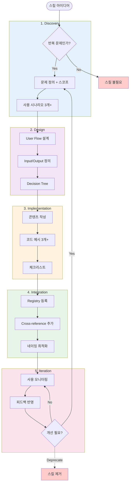
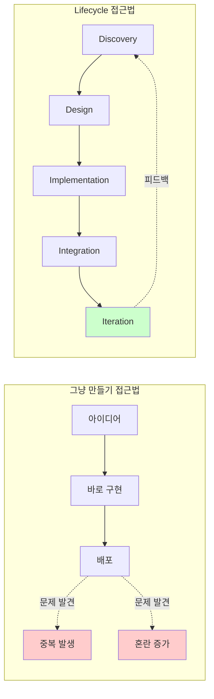
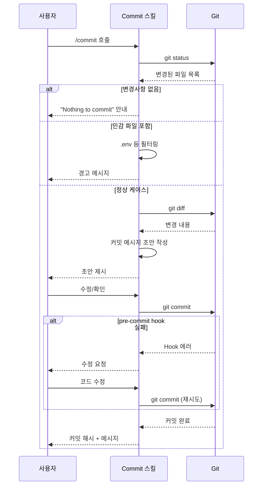
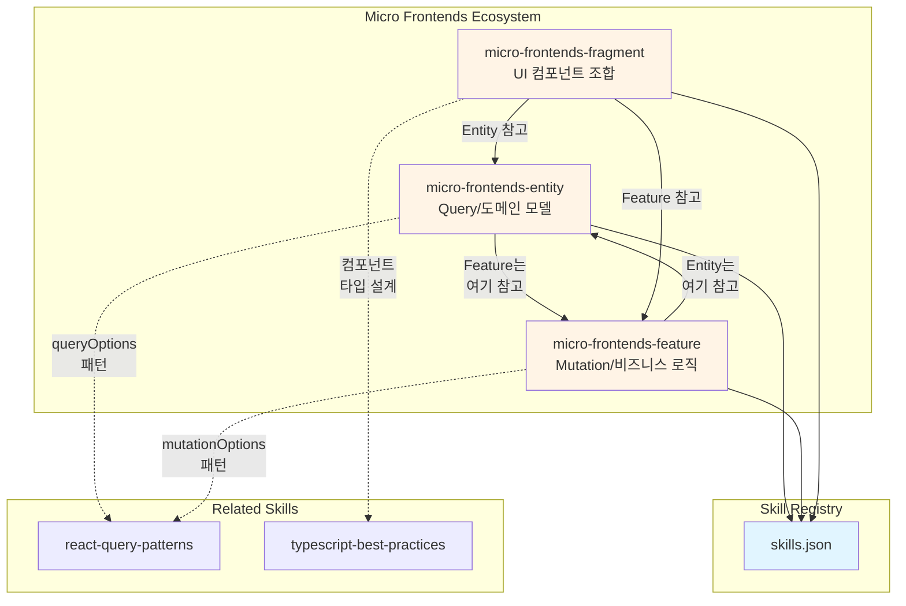
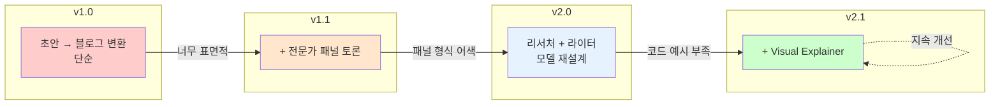

# Skill Lifecycle: Discovery부터 Iteration까지

## 한눈에 보기

Skill Lifecycle은 AI 에이전트의 능력을 체계적으로 확장하기 위한 5단계 프레임워크입니다. Discovery(발견), Design(설계), Implementation(구현), Integration(통합), Iteration(반복)의 단계를 거치며, 이는 50년간 소프트웨어 공학이 축적한 교훈—폭포수 모델의 체계성, 애자일의 점진적 개선, DevOps의 지속적 통합—을 하나의 흐름으로 압축한 것입니다.

---

## 전체 Lifecycle 흐름도



---

## 들어가며

"그냥 만들면 되지 않나요?"

새로운 기능을 요청받았을 때 가장 먼저 드는 생각입니다. 특히 AI 에이전트에게 새로운 스킬을 추가할 때, 프롬프트 하나 작성하고 등록하면 끝이라고 생각하기 쉽습니다. 그러나 실제로 그렇게 만들어진 스킬은 예상치 못한 상황에서 실패하고, 다른 스킬과 충돌하며, 시간이 지날수록 유지보수가 불가능해집니다.

Skill Lifecycle은 이러한 문제에 대한 해답입니다. 단순히 "좋은 스킬을 만드는 방법"이 아니라, "스킬이 발견되고, 설계되고, 구현되고, 시스템에 통합되고, 지속적으로 개선되는 전체 생명주기"를 다루는 프레임워크입니다.

이 글에서는 Skill Lifecycle의 각 단계가 왜 필요한지, 그리고 소프트웨어 공학의 어떤 교훈이 각 단계에 녹아 있는지를 탐구합니다.

---

## "그냥 만들기"의 문제점

스킬을 즉흥적으로 만들면 어떤 일이 벌어지는지 살펴보겠습니다.

첫 번째 문제는 **범위의 불명확성**입니다. "코드 리뷰 스킬"을 만든다고 할 때, 이것이 문법 검사인지, 아키텍처 리뷰인지, 보안 취약점 분석인지 명확하지 않으면 스킬은 모든 것을 하려다 아무것도 제대로 하지 못하게 됩니다.

두 번째 문제는 **통합의 어려움**입니다. 독립적으로 잘 작동하던 스킬이 다른 스킬과 함께 사용될 때 예상치 못한 충돌을 일으킵니다. 파일을 수정하는 두 스킬이 동시에 실행되면 어떻게 될까요?

세 번째 문제는 **개선 불가능성**입니다. 처음 만들 때의 맥락이 사라지면, 왜 그렇게 만들었는지 알 수 없어 수정이 두려워집니다.



이 세 가지 문제는 소프트웨어 개발에서 수십 년간 반복되어 온 것들입니다. 그리고 그 해결책 역시 이미 존재합니다.

---

## 5단계 Lifecycle의 탄생 배경

1970년, Winston W. Royce가 제안한 폭포수 모델은 소프트웨어 개발에 "단계"라는 개념을 도입했습니다. 요구사항 → 설계 → 구현 → 테스트 → 유지보수. 이 순차적 접근은 "무엇을 만들지 결정하기 전에 코드를 작성하지 말라"는 중요한 교훈을 남겼습니다.

그러나 폭포수 모델은 변화에 취약했습니다. 요구사항이 바뀌면 처음부터 다시 시작해야 했습니다. 2001년 등장한 애자일 선언은 이에 대한 반성이었습니다. "계획을 따르는 것보다 변화에 대응하는 것"을 강조하며, 짧은 주기의 반복적 개발을 제안했습니다.

2010년대 DevOps 운동은 여기에 "개발과 운영의 통합"을 더했습니다. 코드가 작성되는 순간부터 배포와 모니터링을 고려해야 한다는 "Shift Left" 철학이 자리 잡았습니다.

Skill Lifecycle의 5단계—Discovery, Design, Implementation, Integration, Iteration—는 이 50년의 교훈을 압축한 것입니다. 폭포수의 체계성, 애자일의 반복성, DevOps의 통합성이 모두 녹아 있습니다.

---

## Discovery: 무엇을 만들 것인가

Lifecycle의 첫 단계는 "이 스킬이 정말 필요한가?"를 묻는 것입니다.

1970년대 UNIX 철학은 "한 가지 일을 잘 하라(Do One Thing Well)"고 가르쳤습니다. 이 원칙이 스킬 설계에서 왜 중요한지 생각해 보겠습니다. "만능 코드 도우미" 스킬보다 "Python 타입 힌트 추가" 스킬이 더 유용한 이유는 명확합니다. 범위가 좁을수록 프롬프트가 정확해지고, 테스트가 쉬워지며, 실패 시 원인 파악이 가능합니다.

Discovery 단계에서 답해야 할 질문들입니다:
- 이 스킬이 해결하는 구체적인 문제는 무엇인가?
- 기존 스킬로 해결할 수 없는가?
- 이 스킬의 경계는 어디까지인가?

Robert C. Martin의 단일 책임 원칙(SRP)은 여기서 지침이 됩니다. "스킬이 변경되어야 하는 이유는 하나여야 한다." 코드 포맷팅과 코드 리뷰가 하나의 스킬에 있다면, 포맷팅 규칙이 바뀔 때 리뷰 로직까지 건드려야 합니다.

### Discovery 검증 로직

```typescript
// Discovery 단계의 체크리스트 검증 로직
interface DiscoveryCheck {
  isRepeating: boolean;      // 반복적 문제인가?
  hasExistingSolution: boolean; // 기존 해결책이 있는가?
  valueProposition: string;     // 명확한 가치는?
  userTriggers: string[];       // 사용자 트리거 시나리오
}

function validateSkillIdea(check: DiscoveryCheck): boolean {
  // 필수 조건: 반복 문제 + 기존 솔루션 없음
  if (!check.isRepeating || check.hasExistingSolution) {
    return false;
  }

  // 최소 3개의 사용 시나리오 필요
  if (check.userTriggers.length < 3) {
    console.warn('최소 3개 이상의 실제 사용 시나리오 필요');
    return false;
  }

  // 명확한 가치 정의 필요
  if (!check.valueProposition.trim()) {
    console.error('가치 제안(Value Proposition) 누락');
    return false;
  }

  return true;
}

// 예시: micro-frontends-entity 검증
const entitySkillCheck: DiscoveryCheck = {
  isRepeating: true,
  hasExistingSolution: false,
  valueProposition: 'Query 배치 위치 가이드',
  userTriggers: [
    '새 도메인 엔티티 추가',
    'API 호출 리팩토링',
    'queryOptions 패턴 적용'
  ]
};

validateSkillIdea(entitySkillCheck); // true
```

---

## Design: 어떻게 만들 것인가

Discovery에서 "무엇"이 결정되면, Design에서는 "어떻게"를 구체화합니다.

프롬프트 엔지니어링에서 가장 흔한 실수는 모호한 지시입니다. "코드를 개선해 주세요"보다 "이 함수의 시간 복잡도를 O(n²)에서 O(n log n)으로 줄여 주세요"가 더 나은 결과를 만들어 냅니다. 이것은 스킬 설계에도 동일하게 적용됩니다.

Design 단계에서 명세해야 할 것들입니다:
- **입력**: 스킬이 받아들이는 데이터의 형식과 제약 조건
- **출력**: 스킬이 생성하는 결과의 형식과 품질 기준
- **에러 처리**: 예상되는 실패 상황과 대응 방법
- **의존성**: 다른 스킬이나 시스템과의 관계

이 단계를 건너뛰면 구현 중에 끊임없이 결정을 내려야 하고, 그 결정들은 일관성 없이 흩어지게 됩니다.

### User Flow 시각화: Commit 스킬 예시



---

## Implementation: 실제로 동작하는가

설계가 끝나면 구현입니다. 그러나 Skill Lifecycle에서 구현은 단순히 "코드 작성"이 아닙니다.

구현 단계의 핵심은 **동작하는 최소 버전**을 먼저 만드는 것입니다. 애자일에서 말하는 MVP(Minimum Viable Product)와 같은 개념입니다. 모든 기능을 한 번에 구현하려 하면 어디서 문제가 생겼는지 파악하기 어렵습니다.

실제 구현에서 고려해야 할 사항들입니다:
- 프롬프트의 명확성: 모호함이 없는가?
- 예외 상황 처리: 예상치 못한 입력에 어떻게 반응하는가?
- 테스트 가능성: 이 스킬의 성공/실패를 어떻게 판단하는가?

Kent Beck의 "Make it work, make it right, make it fast" 원칙이 여기서 적용됩니다. 먼저 동작하게 만들고, 그다음 올바르게 만들고, 마지막으로 빠르게 만듭니다.

---

## Integration: 시스템과 조화되는가

독립적으로 완벽한 스킬도 시스템에 통합되면 문제가 될 수 있습니다. Integration 단계는 이 간극을 다룹니다.

DevOps의 "Shift Left" 철학은 "문제를 가능한 한 일찍 발견하라"고 가르칩니다. 스킬을 등록하기 전에 확인해야 할 것들이 있습니다:
- **이름 충돌**: 기존 스킬과 이름이나 기능이 겹치지 않는가?
- **권한 범위**: 이 스킬이 접근하는 자원이 적절한가?
- **호출 규약**: 다른 스킬과 함께 사용될 때 예상대로 동작하는가?

CI/CD 파이프라인의 개념이 여기서 빛을 발합니다. 스킬이 등록되기 전에 자동화된 검증을 거치도록 설계하면, "배포 후 발견"되는 문제를 "등록 전 발견"으로 앞당길 수 있습니다.

### Skill 에코시스템 네트워크



---

## Iteration: 더 나아질 수 있는가

Lifecycle의 마지막 단계는 "끝"이 아니라 "새로운 시작"입니다.

Blue-Green Deployment 전략을 생각해 보겠습니다. 새 버전(Green)을 기존 버전(Blue)과 병행 운영하다가, 문제가 없으면 전환하고, 문제가 있으면 롤백합니다. 스킬의 iteration도 마찬가지입니다. 새 버전을 갑자기 전면 교체하는 것이 아니라, 점진적으로 테스트하고 개선합니다.

Iteration 단계에서 수집해야 할 데이터입니다:
- **사용 빈도**: 이 스킬이 실제로 쓰이고 있는가?
- **성공률**: 의도한 대로 동작하는 비율은?
- **사용자 피드백**: 개선 요청이나 불만 사항은?

이 데이터를 바탕으로 Discovery 단계로 돌아갑니다. "이 스킬을 개선해야 하는가, 분리해야 하는가, 폐기해야 하는가?"

### 버전 진화 타임라인



---

## 트레이드오프와 실전 적용

Skill Lifecycle이 만능은 아닙니다. 모든 프레임워크에는 트레이드오프가 있습니다.

**체계성 vs 속도**: 5단계를 모두 거치면 시간이 걸립니다. 급하게 필요한 일회성 스킬에는 과도할 수 있습니다. 그러나 재사용될 스킬이라면 초기 투자가 장기적으로 시간을 절약합니다.

**좁은 범위 vs 넓은 범위**: UNIX 철학에 따라 범위를 좁히면 스킬 수가 많아집니다. 스킬 간 조합의 복잡성이 증가할 수 있습니다. 그러나 각 스킬의 예측 가능성은 높아집니다.

**문서화 vs 민첩성**: 각 단계의 결정을 기록하면 나중에 유용하지만, 문서 작성 부담이 생깁니다. 핵심 결정만 간결하게 기록하는 균형이 필요합니다.

실전에서는 스킬의 중요도와 재사용 가능성에 따라 각 단계의 깊이를 조절합니다. 핵심 스킬은 5단계를 철저히, 실험적 스킬은 가볍게 거칩니다.

### 안티패턴 vs 올바른 패턴

```typescript
// ❌ 안티패턴: 각 단계 생략 시 발생하는 타입 오류

// Discovery 생략 → 중복 스킬
type SkillWithoutDiscovery = {
  name: 'react-query-setup' | 'api-setup' | 'data-fetching-guide';
  // 모두 같은 내용인데 이름만 다름
  content: string; // 중복된 가이드
};

// Design 생략 → 사용하기 어려운 인터페이스
type SkillWithoutDesign = {
  name: string;
  execute: (input?: unknown) => unknown; // 무엇을 받는지 불명확
};

// Integration 생략 → 고립된 스킬
type IsolatedSkill = {
  name: string;
  content: string;
  // relatedSkills 필드 없음
  // tags 없음
  // registry에 미등록
};

// ✅ 올바른 패턴: 전체 Lifecycle 준수

type SkillMetadata = {
  // Discovery 산출물
  problemStatement: string;
  scope: {
    includes: string[];
    excludes: string[];
  };
  useCases: [string, string, string, ...string[]]; // 최소 3개

  // Design 산출물
  userFlow: {
    trigger: string;
    steps: string[];
    output: string;
  };
  inputSpec?: Record<string, unknown>;
  outputSpec: Record<string, unknown>;

  // Implementation 산출물
  content: string;
  examples: {
    title: string;
    code: string;
    language: 'typescript' | 'python' | 'bash';
  }[];
  checklist: string[];

  // Integration 산출물
  name: string;
  tags: string[];
  relatedSkills: {
    name: string;
    relationship: 'prerequisite' | 'alternative' | 'complementary';
  }[];
  registry: 'registered' | 'pending' | 'deprecated';

  // Iteration 산출물
  version: `${number}.${number}.${number}`;
  changelog: {
    version: string;
    changes: string[];
    feedback: string;
  }[];
};

// 실제 스킬 예시
const microFrontendsEntity: SkillMetadata = {
  problemStatement: 'MF 환경에서 Query 배치 위치 혼란',
  scope: {
    includes: ['Entity 계층', 'queryOptions 패턴'],
    excludes: ['Feature 계층', 'UI 컴포넌트']
  },
  useCases: [
    '새 도메인 엔티티 추가',
    'API 호출 리팩토링',
    'queryOptions 패턴 적용'
  ],
  userFlow: {
    trigger: '/micro-frontends-entity 호출',
    steps: ['현재 Entity 구조 분석', '패턴 제시', '코드 생성'],
    output: 'Entity 계층 구현 코드'
  },
  content: '...',
  examples: [
    {
      title: '기본 queryOptions 패턴',
      code: 'export const userQueryOptions = ...',
      language: 'typescript'
    }
  ],
  checklist: ['queryOptions 사용', 'Type-safe', 'Atomic'],
  name: 'micro-frontends-entity',
  tags: ['architecture', 'frontend', 'microfrontends'],
  relatedSkills: [
    { name: 'micro-frontends-feature', relationship: 'complementary' },
    { name: 'react-query-patterns', relationship: 'prerequisite' }
  ],
  registry: 'registered',
  version: '1.0.0',
  changelog: []
};
```

---

## 마무리하며

Skill Lifecycle은 새로운 발명이 아닙니다. 1970년대 폭포수 모델이 가르친 "단계의 중요성", 2000년대 애자일이 가르친 "반복의 가치", 2010년대 DevOps가 가르친 "통합의 필요성"을 하나의 흐름으로 엮은 것입니다.

이 프레임워크의 핵심 통찰은 간단합니다: **좋은 스킬은 우연히 만들어지지 않습니다.**

Discovery에서 범위를 정하고, Design에서 구체화하고, Implementation에서 동작하게 만들고, Integration에서 시스템에 녹이고, Iteration에서 개선합니다. 이 과정을 거친 스킬은 예측 가능하고, 유지보수 가능하며, 시간이 지나도 가치를 유지합니다.

50년간 소프트웨어 공학이 배운 교훈은 결국 하나로 수렴합니다: **체계적인 접근이 장기적으로 더 빠릅니다.**

---

## 더 읽어볼 자료

- **Royce, W. (1970)**: "Managing the Development of Large Software Systems" - 폭포수 모델의 원문
- **Agile Manifesto (2001)**: agilemanifesto.org - 애자일 선언문과 12가지 원칙
- **Martin, R. C.**: "Clean Architecture" - SRP와 소프트웨어 설계 원칙
- **Humble, J. & Farley, D.**: "Continuous Delivery" - CI/CD와 배포 전략
- **Raymond, E. S.**: "The Art of Unix Programming" - UNIX 철학의 현대적 해석
