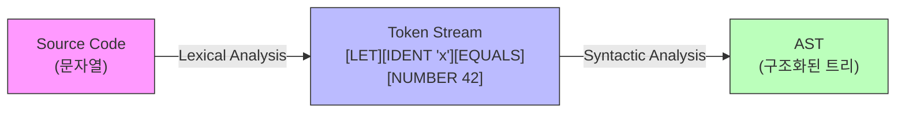
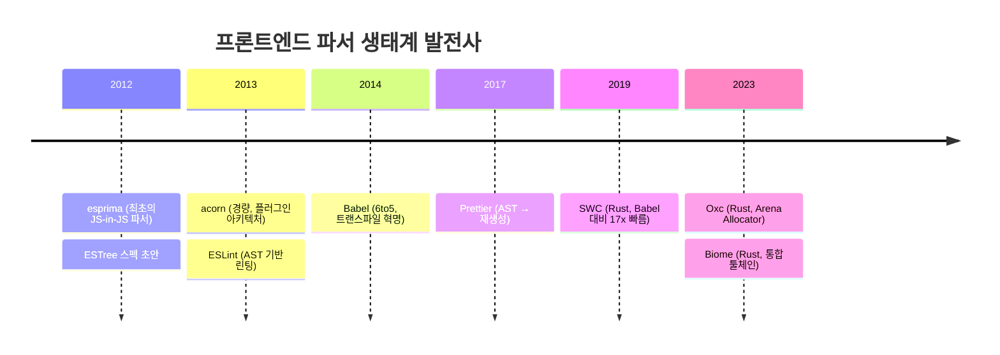
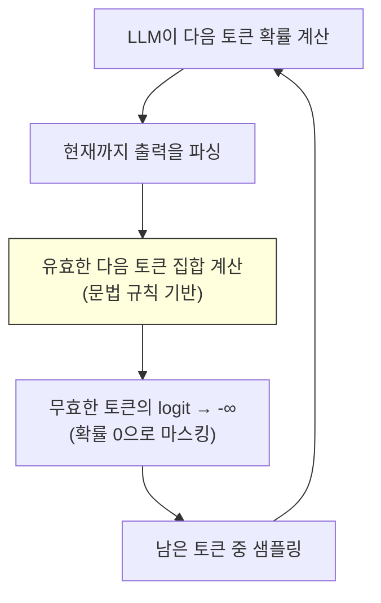

## 도입: 당신은 이미 파서를 쓰고 있다

`JSON.parse()`를 호출할 때, 정규표현식을 작성할 때, 브라우저가 URL을 해석할 때 — 우리는 이미 파서를 사용하고 있다. 파싱(Parsing)은 컴파일러 교과서 속 이론이 아니라, 소프트웨어의 거의 모든 레이어에 숨어 있는 근본 기술이다.

이 글에서는 컴파일러의 첫 번째 단계인 파싱을 출발점으로, 프론트엔드 도구 생태계, 네트워크 프로토콜, 빌드 시스템, 그리고 AI 코드 생성까지 — 파싱이 어떻게 현대 소프트웨어 개발 전반에 관통하는지를 탐구한다.

---

## 1. 파싱이란 무엇인가: 문장의 구조를 파악하는 것

파싱은 텍스트(문자열)를 문법 규칙에 따라 구조화된 데이터로 변환하는 과정이다. 컴파일러에서는 소스 코드를 AST(Abstract Syntax Tree)로 변환하는 전 과정을 담당한다.

이 과정은 두 단계로 나뉜다.



**Lexer(어휘 분석기)** 는 문자열을 의미 있는 최소 단위인 토큰(Token)으로 분리한다. `let x = 42 + y;`라는 코드를 `[LET] [IDENT "x"] [EQUALS] [NUMBER 42] [PLUS] [IDENT "y"] [SEMICOLON]`으로 분해하는 것이다. 우리가 문장을 읽을 때 단어를 인식하는 과정과 같다.

**Parser(구문 분석기)** 는 토큰 스트림을 문법 규칙에 따라 트리 구조로 조립한다. "주어 - 동사 - 목적어"를 파악하듯, 코드의 구조적 관계를 트리로 표현한다.

이 두 단계의 분리는 1950년대 Noam Chomsky의 형식 언어 이론에 뿌리를 두고 있다. Chomsky Hierarchy에서 Lexer는 Type-3(정규 문법, 유한 오토마톤)으로, Parser는 Type-2(문맥 자유 문법, 푸시다운 오토마톤)로 동작한다. 이론적으로 깔끔하게 분리되기 때문에, 실무에서도 두 단계를 독립적으로 최적화할 수 있다.

---

## 2. 문법을 정의하는 언어: BNF/EBNF

프로그래밍 언어의 문법을 어떻게 기술할까? 1960년 ALGOL 60 보고서에서 John W. Backus와 Peter Naur가 공식화한 **BNF(Backus-Naur Form)** 가 그 답이다.

```ebnf
expression = term (('+' | '-') term)*
term = factor (('*' | '/') factor)*
factor = NUMBER | '(' expression ')' | IDENT
```

이 세 줄의 문법이 연산자 우선순위를 어떻게 인코딩하는지 주목하라. `expression`이 `term`을 포함하고, `term`이 `factor`를 포함하는 **중첩 구조** 자체가 우선순위를 표현한다. `a + b * c`를 파싱하면 `*`가 `+`보다 깊은 위치에 놓이면서 자연스럽게 `a + (b * c)`가 된다.

이 개념을 직관적으로 이해하는 비유가 있다: **연산자 우선순위는 중력의 세기다.** `*`는 `+`보다 강한 중력을 가져서 피연산자를 더 강하게 끌어당긴다. 이 비유는 뒤에서 다룰 Pratt Parser의 "바인딩 파워(binding power)" 개념과 정확히 대응된다.

---

## 3. 파싱 전략: Top-Down vs Bottom-Up

파서를 구현하는 전략은 크게 두 갈래로 나뉜다.

### Recursive Descent Parser: 문법이 곧 코드

가장 직관적인 방식이다. BNF의 각 규칙을 함수 하나로 대응시킨다.

```python
def parse_expression():
 left = parse_term()
 while current_token in ('+', '-'):
 op = consume()
 right = parse_term()
 left = BinaryExpr(op, left, right)
 return left

def parse_term():
 left = parse_factor()
 while current_token in ('*', '/'):
 op = consume()
 right = parse_factor()
 left = BinaryExpr(op, left, right)
 return left
```

`parse_expression`이 `parse_term`을 호출하고, `parse_term`이 `parse_factor`를 호출하는 재귀 구조가 곧 우선순위를 결정한다. 문법을 따라 함수를 "내려가면(descent)" 자연스럽게 AST가 만들어지는 것이다.

### Pratt Parser: 연산자에 중력을 부여하다

1973년 Vaughan Pratt이 발표한 이 기법은 당시 학계의 주목을 받지 못했다. 학계가 LL(1), LR(0) 등 오토마타 기반 방식에 집중하던 시기였기 때문이다. Pratt 자신은 논문에서 *"BNF 문법과 오토마타 이론에 대한 집착이 다른 방향의 발전을 막았다"* 고 지적했다. 그의 기법이 재조명된 것은 50년이 지난 뒤, Bob Nystrom의 "Crafting Interpreters"와 Douglas Crockford의 JSLint 구현을 통해서였다.

핵심 아이디어는 간단하다. 각 연산자에 **바인딩 파워(binding power)** 라는 숫자를 부여하고, 현재 파싱 중인 표현식의 최소 바인딩 파워보다 높은 연산자만 계속 파싱한다.

```python
def parse_expression(min_bp):
 left = parse_prefix(next_token())

 while True:
 op = peek_token()
 left_bp, right_bp = infix_binding_power(op)

 if left_bp <= min_bp:
 break # 현재 연산자의 중력이 부족 → 상위로 반환

 advance()
 right = parse_expression(right_bp)
 left = BinaryNode(op, left, right)

 return left
```

`+`의 바인딩 파워가 `(1, 2)`, `*`의 바인딩 파워가 `(3, 4)`라면, `a + b * c`에서 `+` 이후 `b`를 파싱한 뒤 `*`를 만나면 `*`의 left_bp(3)이 `+`의 right_bp(2)보다 크므로 `*`가 `b`를 가져간다. 중력이 더 강한 연산자가 이기는 것이다.

Pratt Parser의 진정한 가치는 **확장성**이다. 새 연산자를 추가하려면 바인딩 파워 테이블에 한 줄만 추가하면 된다. BNF 규칙을 전면 수정할 필요가 없다. V8, rustc, Deno의 TypeScript 파서가 표현식 파싱에 이 방식을 채택한 이유다.

### LR Parsing: 퍼즐 조각을 쌓아올리다

LR 파서는 반대 방향으로 작동한다. 토큰을 하나씩 스택에 쌓다가(Shift), 스택 위의 패턴이 문법 규칙과 매칭되면 축약(Reduce)한다. 퍼즐 조각을 하나씩 놓다가 완성된 패턴이 보이면 하나의 큰 조각으로 합치는 과정과 같다.

```
입력: 1 + 2 * 3

Stack: [] Input: 1 + 2 * 3
Stack: [1] Shift
Stack: [E] Reduce (E → 1)
Stack: [E +] Shift
Stack: [E + 2] Shift
Stack: [E + E] Reduce? Shift? ← 우선순위 결정 시점
Stack: [E + E *] Shift (* 가 +보다 우선)
Stack: [E + E * 3] Shift
Stack: [E + E * E] Reduce (E → E * E)
Stack: [E + E] Reduce (E → E + E)
Stack: [E] 완료!
```

yacc(1975), Bison, ANTLR 같은 **Parser Generator**는 이 LR 테이블을 자동 생성한다. 한때는 이것이 표준이었지만, 오늘날에는 역전되었다.

---

## 4. Parser Generator에서 Hand-written Parser로: 역사의 반전

흥미로운 역사적 전환이 있었다. 1970~90년대에는 Parser Generator가 주류였지만, 2000년대 이후 주요 컴파일러들이 하나둘씩 Hand-written Parser로 전환했다.

| 프로젝트 | 전환 시점 | 이전 | 이후 |
|---------|----------|------|------|
| GCC | 2005 (v4.0) | Bison (LALR) | Recursive Descent |
| Go | 2015 (v1.5) | yacc | Recursive Descent |
| Clang | 처음부터 | — | Recursive Descent |
| V8 | 처음부터 | — | Recursive Descent + Pratt |
| Rust (rustc) | 처음부터 | — | Recursive Descent |

전환의 이유는 명확하다.

**첫째, 에러 메시지의 품질.** LALR 파서가 생성하는 "unexpected token" 메시지로는 개발자를 도울 수 없다. Hand-written Parser는 문맥을 파악하여 "did you mean `==`?" 같은 제안이 가능하다. Rust의 에러 메시지가 유독 친절한 이유가 여기에 있다.

**둘째, IDE 통합과 에러 복구.** LSP(Language Server Protocol) 기반 IDE가 표준이 된 시대에, 파서는 단순 컴파일 도구가 아니라 실시간 편집기 백엔드가 되었다. 불완전한 코드도 파싱할 수 있어야 자동완성이 작동한다. 이런 에러 복구 로직을 자동 생성 파서에 삽입하기는 극히 어렵다.

**셋째, 점진적 파싱(Incremental Parsing).** 파일 전체를 매번 재파싱하지 않고 변경된 부분만 처리하는 기능은 Generator 기반에서 구현이 거의 불가능하다. **tree-sitter**(GitHub, 2017)가 이 문제를 해결한 대표적 사례다. GLR 기반 incremental parser인 tree-sitter는 키 입력마다 변경된 CST 노드만 재파싱하여 수 밀리초 이내에 완료한다. 현재 Neovim, VS Code, Zed, Cursor가 이를 사용한다.

---

## 5. 프론트엔드 생태계: AST 기반 도구의 황금기

파서 이론이 가장 활발하게 실용화된 분야가 프론트엔드 개발이다.



이 생태계의 핵심 통찰은 **"파서는 컴파일러 내부의 블랙박스가 아니라 도구 생태계의 공개된 인프라가 될 수 있다"** 는 것이었다. esprima(2012)가 이를 증명한 후, Babel, ESLint, Prettier 등 AST를 소비하는 도구들이 폭발적으로 성장했다.

### CST vs AST: 두 가지 트리의 차이

파싱 결과물에는 두 종류가 있다.

**AST(Abstract Syntax Tree)** 는 의미 분석에 불필요한 정보(공백, 주석, 괄호)를 제거하고 구조적 의미만 남긴다. Babel, acorn, esprima의 출력이 AST다.

**CST(Concrete Syntax Tree)** 는 소스 코드의 모든 토큰을 보존한다. Prettier의 recast, TypeScript의 내부 표현이 CST에 가깝다. 정보 손실이 없기 때문에 "주석 위치를 보존하며 리팩토링"하는 도구에 필요하다.

### Rust 기반 파서의 부상: 왜 빠른가

SWC와 Oxc가 기존 JavaScript 파서보다 수십 배 빠른 이유는 단순히 "Rust니까"가 아니다.

Oxc의 핵심 기법은 **Arena Allocator**다. 일반적인 파서는 각 AST 노드를 힙에 개별 할당한다. Oxc는 `bumpalo` 기반 Arena에 모든 노드를 순차적으로 할당하고, 파싱이 끝나면 Arena 전체를 O(1)에 해제한다.

```
일반 할당: [Node1] [Node2] [Node3] (힙 곳곳에 분산)
Arena: [Node1|Node2|Node3|...] (연속 메모리, 캐시 효율 극대화)
```

Vercel이 SWC를 Next.js 12의 기본 트랜스파일러로 채택하면서 Babel 대비 **17배** 빌드 속도 향상을 측정한 것이 이 전환의 신호탄이었다.

### 실전: Babel 플러그인과 Codemod

파서 지식이 직접 생산성으로 연결되는 대표적인 사례가 **Babel 플러그인**과 **codemod**다.

```javascript
// Babel 플러그인: console.log 자동 제거
export default function removeConsoleLog() {
 return {
 visitor: {
 CallExpression(path) {
 const { callee } = path.node;
 if (
 callee.type === 'MemberExpression' &&
 callee.object.name === 'console' &&
 callee.property.name === 'log'
 ) {
 path.remove();
 }
 }
 }
 };
}
```

AST 노드를 Visitor 패턴으로 순회하며 변환하는 이 구조는 ESLint 커스텀 룰, jscodeshift 기반 대규모 리팩토링에도 동일하게 적용된다. `astexplorer.net`에서 코드를 입력하면 AST를 실시간으로 시각화할 수 있어, 파서 입문의 가장 빠른 경로다.

---

## 6. 네트워크 프로토콜: 파싱의 또 다른 전장

컴파일러만 파서를 쓰는 것이 아니다. 네트워크 프로토콜의 모든 레이어가 파서 위에서 돌아간다.

### Text Protocol vs Binary Protocol

HTTP/1.1은 텍스트 기반이다. `Content-Length: 1234\r\n`를 파싱하려면 바이트를 하나씩 스캔하고, 구분자를 찾고, ASCII 숫자를 정수로 변환해야 한다. 컴파일러의 Lexer와 본질적으로 동일한 작업이다.

HTTP/2는 바이너리 프레임으로 전환했다. 고정 9바이트 헤더를 읽으면 Length, Type, Flags를 비트 연산으로 즉시 추출할 수 있다. 문자열 검색이 전혀 필요 없다.

```
HTTP/1.1 (텍스트): "Content-Length: 1234\r\n"
 → 바이트 스캔 → 구분자 탐색 → atoi() → O(n)

HTTP/2 (바이너리): [0x00][0x04][0xD2]
 → 고정 오프셋 읽기 → 비트 연산 → O(1)
```

Protocol Buffer(protobuf)는 이 아이디어를 더 밀어붙여, **파싱을 컴파일 타임으로 이동**시켰다. 스키마를 미리 알고 있으므로 런타임에 필드 이름을 파싱하거나 타입을 추론할 필요가 없다. JSON 대비 파싱 속도 5-10배, 직렬화 크기 3-10배 차이가 여기서 나온다.

### SIMD로 파싱을 가속하다: simdjson

100Gbps 네트워크에서 최소 이더넷 프레임은 초당 약 1억 4,880만 개가 도착한다. 각 패킷 처리에 허용되는 시간은 **6.7 나노초**다. 이 환경에서 **simdjson**(2019)은 SIMD 명령어를 활용해 GB/s 단위의 JSON 파싱을 달성했다.

1단계에서 AVX2로 32바이트를 동시에 스캔하여 `{`, `}`, `"`, `,` 등 구조적 문자의 위치를 비트마스크로 추출하고, 2단계에서 이 인덱스를 순회하며 실제 파싱을 수행한다. 기존 라이브러리 대비 2-4배 향상이다.

### 파싱 오류의 대가: Heartbleed

프로토콜 파싱에서 가장 유명한 보안 취약점은 **Heartbleed(CVE-2014-0160)** 다. OpenSSL의 TLS Heartbeat Extension에서 클라이언트가 보낸 Length 필드를 검증 없이 신뢰한 것이 원인이었다. 컴파일러 파서의 관점에서 보면, "토큰의 길이 정보를 검증하지 않고 메모리를 읽은" 가장 비싼 버그다. 이 사건 이후 프로토콜 파서의 **퍼징(fuzzing)** 이 보안 개발의 표준 프로세스가 되었다.

---

## 7. 빌드 시스템에서의 파싱 최적화

대규모 코드베이스에서 파싱은 빌드 시간의 중요한 병목이다.

| 도구 | 파서 구현 | 1000 파일 처리 (참고값) |
|------|-----------|----------------------|
| tsc | Hand-written TypeScript | ~30s |
| esbuild | Hand-written Go | ~0.3s |
| SWC | Hand-written Rust | ~0.4s |

100배 차이의 핵심은 파서 알고리즘이 아니다(모두 Recursive Descent다). GC 없는 언어의 메모리 효율, SIMD Lexer 가속, 멀티스레드 병렬 파싱이 차이를 만든다.

### Lazy Parsing: V8의 핵심 최적화

V8 엔진은 페이지 로드 시 모든 함수를 즉시 파싱하지 않는다. 함수 본문은 토큰만 스캔하는 **pre-parsing** 단계를 거치고, 실제 호출 시점에 **full parsing**이 수행된다. 이 전략으로 페이지 로드 시 파싱 시간을 평균 **40% 단축**했다.

```javascript
function rarelyUsed() { // pre-parse만 수행 (토큰 스캔)
 return complexLogic(); // 호출될 때 비로소 full parse
}

const result = frequentlyUsed(); // 즉시 full parse
```

---

## 8. AI 시대의 파싱: LLM과 문법의 재회

### LLM 토크나이저 vs 전통적 Lexer

LLM의 BPE(Byte-Pair Encoding) 토크나이저와 전통적 Lexer는 둘 다 "문자 스트림을 의미 단위로 분해"하지만, 설계 철학이 다르다.

| 관점 | 전통적 Lexer | BPE / WordPiece |
|------|-------------|-----------------|
| 규칙 | 명시적, 결정론적 | 통계적, 데이터 주도 |
| 미지어 처리 | 오류 또는 unknown | 서브워드 분해 |
| 목적 | 문법 검증 시작점 | 임베딩 공간 입력 최적화 |

Lexer는 `identifier := [a-zA-Z_][a-zA-Z0-9_]*` 같은 고정 규칙으로 작동하지만, BPE는 훈련 코퍼스에서 가장 빈번한 바이트 쌍을 반복 병합하여 어휘를 학습한다.

### Grammar-Constrained Decoding: 파서 이론의 역방향 적용

LLM의 Structured Output(JSON mode 등)의 핵심은 **Grammar-Constrained Decoding(GCD)** 이다. 전통적 파서가 "입력이 문법에 맞는지 검증"한다면, GCD는 "출력이 문법에 맞도록 생성을 제약"한다. 파서 이론의 역방향 적용인 셈이다.



2024년의 **XGrammar**(MLC-AI)는 어휘를 문맥 독립/의존 토큰으로 분리하여 기존 대비 100배 속도 향상을 달성했고, 현재 vLLM, SGLang의 기본 백엔드로 사용된다.

### AI 코드 도구에서 파서의 이중 역할

Cursor, GitHub Copilot 같은 AI 코드 도구는 LLM 호출 **전후 양쪽**에서 파서를 활용한다.

- **호출 전**: tree-sitter로 현재 파일을 실시간 파싱하여 함수 시그니처, 클래스 구조, 변수 스코프를 추출한다. 이 AST 기반 컨텍스트가 LLM의 코드 생성 품질을 높인다.
- **호출 후**: 생성된 코드를 즉시 파싱하여 구문 오류를 감지한다. Monitor-Guided Decoding은 정적 분석을 런타임에 수행하여 타입 오류가 있는 코드 생성을 사전 차단한다.

컴파일러의 전통적 파이프라인(Lexer → Parser → AST → 의미 분석)이 AI 시대에 두 방향으로 부활하고 있는 것이다. 하나는 LLM 출력을 제어하는 Grammar-Constrained Decoding, 다른 하나는 LLM의 코드 이해를 높이는 AST-Aware Architecture다.

---

## 9. 일상 속의 숨은 파서들

정리하면, 파서는 우리가 인식하지 못하는 곳 곳곳에 있다.

| 일상 작업 | 내부의 파서 |
|-----------|-----------|
| `JSON.parse()` | 재귀 하강 파서로 중첩 구조를 AST(객체)로 변환 |
| 정규표현식 `/\d{3}/` | 패턴 자체를 파싱하여 NFA/DFA로 컴파일 |
| URL 입력 | RFC 3986 문법에 따라 프로토콜/호스트/경로/쿼리 분해 |
| SQL ORM | `.where({ age: { gt: 18 } })` → AST → SQL 문자열 직렬화 |
| 마크다운 렌더링 | `#`을 헤딩 토큰, `**`를 강조 토큰으로 인식 후 HTML AST 생성 |
| ESLint / Prettier | 소스 → AST → 규칙 적용 또는 재생성 |
| HTTP 통신 | 헤더/바디를 상태 머신으로 토큰화하고 구조체로 변환 |

---

## 마무리: 더 깊이 파고들기

파싱은 컴파일러의 첫 번째 관문이자, 소프트웨어 전반을 관통하는 근본 기술이다. FORTRAN 컴파일러에 18 person-years가 투입되던 1957년부터, SIMD로 초당 수 GB의 JSON을 파싱하는 2025년까지 — 파싱의 본질적 문제("텍스트를 구조로 변환하라")는 변하지 않았다. 변한 것은 요구사항의 규모와 적용 범위뿐이다.

더 탐구하고 싶다면:

- **직접 구현해보기**: [Crafting Interpreters](https://craftinginterpreters.com/) (Bob Nystrom) — Pratt Parser를 포함한 가장 접근하기 쉬운 파서 구현 가이드. 온라인 무료 공개.
- **200줄로 컴파일러 이해하기**: [The Super Tiny Compiler](https://github.com/jamiebuilds/the-super-tiny-compiler) — 파서/컴파일러 전체 파이프라인을 200줄 JavaScript로 구현.
- **AST 시각화**: [AST Explorer](https://astexplorer.net/) — 코드를 입력하면 다양한 파서의 AST를 실시간 비교. Babel 플러그인, ESLint 룰 작성도 가능.
- **Pratt Parser 심화**: [Simple but Powerful Pratt Parsing](https://matklad.github.io/2020/04/13/simple-but-powerful-pratt-parsing.html) (matklad) — rust-analyzer 저자의 현대적 설명.
- **이론적 토대**: "Compilers: Principles, Techniques, and Tools" (Dragon Book) — LALR 테이블 생성의 표준 레퍼런스.

다음 글에서는 파싱의 결과물인 **AST(Abstract Syntax Tree)** 를 깊이 탐구한다. 트리 순회, Visitor 패턴, 그리고 AST가 코드 변환과 정적 분석의 핵심이 되는 이유를 다룰 예정이다.
