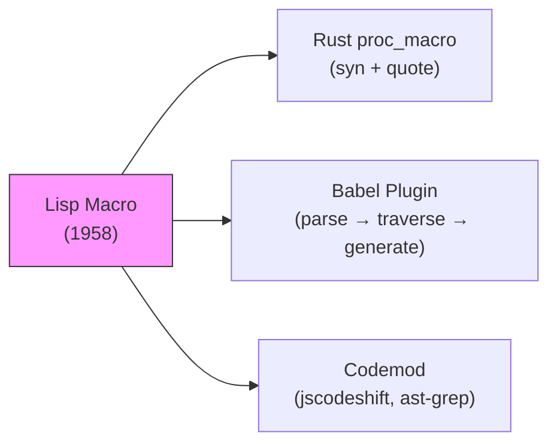
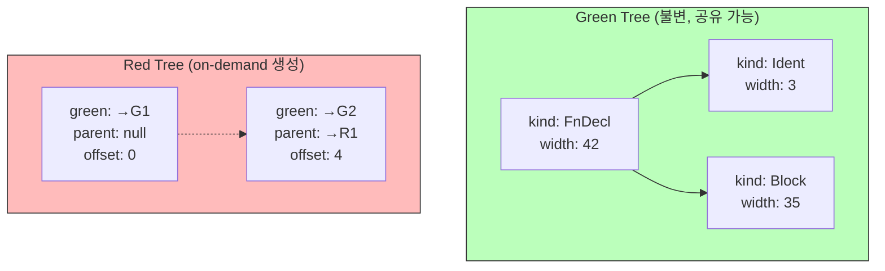

## 도입: 코드가 곧 데이터가 되는 순간

1958년 MIT의 John McCarthy는 Lisp를 설계하면서 의도치 않은 발견을 했다. 그가 만든 S-expression — `(+ 1 (* 2 3))` — 은 프로그램 코드이면서 동시에 데이터 구조였다. 코드를 트리로 표현하면 **코드를 데이터처럼 조작할 수 있다**는 통찰. 이것이 AST(Abstract Syntax Tree)의 기원이다.

70년이 지난 지금, AST는 컴파일러 내부를 넘어 프론트엔드 도구(Babel, ESLint, Prettier), IDE 지능(자동완성, 리팩토링), API 설계(GraphQL), 심지어 AI 코드 생성까지 — 소프트웨어 개발의 거의 모든 영역에서 핵심 인프라로 작동하고 있다.

이전 글에서 파싱(Parsing)이 소스 코드를 구조화하는 과정을 다뤘다면, 이번 글에서는 그 결과물인 AST를 깊이 탐구한다. AST란 정확히 무엇이고, 어떻게 설계되며, 어디에 쓰이는가?

---

## 1. CST vs AST: "어떻게 쓰였는가" vs "무엇을 의미하는가"

파서가 소스 코드를 처리하면 트리가 만들어진다. 이 트리에는 두 종류가 있다.

```
소스: (1 + 2) * 3

CST (Concrete Syntax Tree): AST (Abstract Syntax Tree):
 expression *
 / | \ / \
 term * factor + 3
 | | / \
 factor 3 1 2
 / | \
 ( expr )
 / | \
 1 + 2
```

**CST(Concrete Syntax Tree)** 는 소스 코드의 모든 문자를 빠짐없이 트리에 담는다. 괄호, 세미콜론, 공백, 주석까지 전부 노드로 존재한다. CST가 있으면 원본 소스 코드를 **완벽히 복원**할 수 있다.

**AST(Abstract Syntax Tree)** 는 의미에 불필요한 구문 요소를 제거한다. `(1 + 2)`에서 괄호는 연산 순서를 지정하기 위한 것이지 그 자체로 의미를 갖지 않는다. 파서가 `1 + 2`를 하나의 덧셈 노드로 묶는 순간 괄호의 역할은 끝난다. AST에서 괄호 노드는 사라지고, **트리의 깊이 자체가 우선순위를 표현**한다.

한 문장으로: CST는 "어떻게 쓰여 있는가"를 기록하고, AST는 "무엇을 의미하는가"를 기록한다.

이 구분은 실전에서 도구 선택을 결정한다.

| 도구 | 사용하는 트리 | 이유 |
|------|-------------|------|
| Babel, acorn, esprima | AST | 의미 변환에 집중, 구문 장식 불필요 |
| Prettier, recast | CST에 가까운 AST | 원본 포맷/주석 보존 필요 |
| tree-sitter | CST | 에디터 구문 강조, 불완전 코드 처리 |
| TypeScript 컴파일러 | CST + AST 혼합 | Trivia(공백/주석) 보존하면서 타입 분석 |

---

## 2. AST 노드 설계: 트리를 코드로 표현하는 법

AST의 각 노드는 "이 코드 조각이 어떤 종류인가?"를 나타낸다. 이를 코드로 표현하는 두 가지 대표적 방식이 있다.

### Discriminated Union (TypeScript)

```typescript
type Expression =
 | { type: "NumberLiteral"; value: number }
 | { type: "BinaryExpr"; op: string; left: Expression; right: Expression }
 | { type: "Identifier"; name: string }
 | { type: "CallExpr"; callee: Expression; args: Expression[] }

type Statement =
 | { type: "LetDecl"; name: string; init: Expression }
 | { type: "IfStmt"; condition: Expression; then: Statement[]; else?: Statement[] }
 | { type: "ReturnStmt"; value?: Expression }
```

`type` 필드가 판별자(discriminant) 역할을 한다. `if (node.type === "BinaryExpr")`로 분기하면 TypeScript가 자동으로 `left`, `right` 필드의 존재를 추론한다. ESTree 스펙이 이 방식을 채택했고, Babel, ESLint, Prettier 생태계 전체가 이 위에 구축되어 있다.

### Enum + Box (Rust)

```rust
enum Expr {
 Number(f64),
 Binary { op: BinOp, left: Box<Expr>, right: Box<Expr> },
 Ident(String),
 Call { callee: Box<Expr>, args: Vec<Expr> },
}
```

`Box<Expr>`이 필요한 이유가 흥미롭다. `Expr` 안에 `Expr`이 재귀적으로 포함되므로, 컴파일러가 크기를 계산할 수 없다. `Box`는 힙에 할당된 포인터(고정 크기)로 이 재귀를 끊는다. Rust의 `match`를 사용한 패턴 매칭은 Visitor 패턴 없이도 AST를 깔끔하게 순회할 수 있게 해준다.

### 설계 결정 포인트

- **Expression과 Statement 분리**: C, JavaScript처럼 `a = b`가 expression인 언어와 Python처럼 statement인 언어에서 AST 구조가 달라진다.
- **위치 정보 저장**: ESTree는 `{ line, column }` 객체를, Oxc는 바이트 오프셋 `Span { start: u32, end: u32 }`을 사용한다. 후자가 메모리 절약과 비교 연산에 유리하다.
- **주석 처리**: AST에 포함시킬 것인가, 별도 관리할 것인가? Babel은 노드에 `leadingComments`, `trailingComments`를 첨부하고, Go의 `go/ast`는 `CommentMap`으로 외부 관리한다.

---

## 3. AST 순회: 같은 나무, 다른 방문자

AST가 만들어지면 이를 순회하며 다양한 작업을 수행한다. 핵심 패턴은 두 가지다.

### Visitor Pattern: 구조와 알고리즘의 분리

직관적인 비유로, 도시(AST)는 그대로인데 방문자마다 다른 목적으로 돌아다니는 것과 같다. 건축 사진작가는 건물에 주목하고, 음식 평론가는 식당에 주목하며, 역사학자는 유적지에 주목한다.

```python
class Evaluator(Visitor):
 def visit_binary(self, node):
 left = node.left.accept(self)
 right = node.right.accept(self)
 if node.op == '+': return left + right
 if node.op == '*': return left * right

class Printer(Visitor):
 def visit_binary(self, node):
 return f"({node.left.accept(self)} {node.op} {node.right.accept(self)})"
```

**동일한 AST** 위에서 `Evaluator`는 값을 계산하고, `Printer`는 문자열을 생성한다. 새로운 분석이 필요하면 새 Visitor만 추가하면 된다. AST 구조는 건드리지 않는다.

### Pattern Matching: 함수형 접근

Rust처럼 강력한 패턴 매칭이 있는 언어에서는 Visitor 클래스 없이도 깔끔하게 순회할 수 있다.

```rust
fn eval(expr: &Expr) -> f64 {
 match expr {
 Expr::Number(n) => *n,
 Expr::Binary { op, left, right } => {
 let l = eval(left);
 let r = eval(right);
 match op {
 BinOp::Add => l + r,
 BinOp::Mul => l * r,
 }
 }
 }
}
```

Visitor Pattern은 노드 타입 추가에 열려 있고(새 노드를 추가해도 기존 Visitor는 동작), Pattern Matching은 연산 추가에 열려 있다(새 함수를 추가해도 기존 노드는 변경 불필요). 이것이 객체지향의 **Expression Problem**이다. 어느 쪽이 더 나은지는 "노드 타입이 자주 변하는가, 연산이 자주 변하는가"에 따라 달라진다.

---

## 4. AST 변환: Desugaring에서 매크로까지

AST → AST 변환은 컴파일러의 핵심 패턴이다.

### Desugaring: 달콤한 문법을 벗겨내기

**Syntactic Sugar(문법적 설탕)** 는 프로그래머 편의를 위한 축약 문법이다. Desugaring은 이를 더 기본적인 표현으로 펼치는 과정이다.

```
for (x in arr) { body }
↓ desugaring
{ let i = 0; while (i < arr.length) { let x = arr[i]; body; i++; } }

x * 1 → x (상수 접기)
x + 0 → x (항등원 제거)
```

컴파일러 이후 단계들은 단순화된 AST만 처리하면 되므로, desugaring은 복잡도를 격리하는 역할을 한다.

### Lisp에서 Babel까지: 코드를 조작하는 코드

McCarthy의 S-expression이 "최초의 범용 AST"가 된 이유는 **Homoiconicity(동형성)** 때문이다. Lisp에서 코드와 데이터는 동일한 형태를 가진다. `(+ 1 2)`는 프로그램이면서 동시에 리스트 자료구조다. 이 속성이 강력한 매크로 시스템을 가능하게 했다 — 매크로는 **코드 조각(AST 노드)을 인자로 받아 새로운 코드 조각을 반환**하는 함수다.

이 철학은 현대 도구로 이어진다.



**Rust의 `proc_macro`**: 컴파일 시점에 `TokenStream`을 받아 `TokenStream`을 반환한다. `syn` 크레이트가 토큰을 AST로 파싱하고, `quote` 크레이트가 AST를 다시 코드로 변환한다. `#[derive(Debug)]`가 이 방식으로 동작한다.

**Babel 플러그인**: `@babel/parser`로 AST를 만들고, `@babel/traverse`로 순회하며 변환하고, `@babel/generator`로 코드를 재생성한다. JSX `<div />` → `React.createElement("div", null)` 변환이 이 파이프라인의 대표 사례다.

---

## 5. 프론트엔드 생태계: ESTree와 AST 도구의 황금기

### ESTree: JavaScript AST의 공용어

2014년 esprima, acorn 등 주요 파서 메인테이너들이 모여 **ESTree** 스펙을 공식화했다. JavaScript AST 노드 타입과 구조를 정의하는 이 명세 덕분에, 파서를 교체해도 도구가 작동하는 **파서 교체 가능성(parser interoperability)** 이 실현되었다.

ESLint는 기본 파서 `espree`를 `@typescript-eslint/parser`로 교체하면 TypeScript를 분석할 수 있다. `@typescript-eslint/parser`는 TypeScript 컴파일러의 독자 AST를 ESTree 호환 형식으로 변환하는 브릿지다. TypeScript 전용 노드(`TSTypeAnnotation`, `TSInterfaceDeclaration`)를 ESTree 확장으로 추가하면서, `parserOptions.project`를 설정하면 타입 체커까지 연결할 수 있다.

### Babel, ESLint, Prettier: 같은 AST, 다른 목적

세 도구는 동일한 AST를 완전히 다른 방식으로 소비한다.

| 도구 | AST 소비 방식 | 핵심 API |
|------|-------------|---------|
| **Babel** | **변환(transform)** — 노드를 교체/추가/삭제 | `path.replaceWith()`, `path.remove()` |
| **ESLint** | **분석(analyze)** — 패턴 탐지 후 보고 | `context.report()`, `fixer.replaceText()` |
| **Prettier** | **재직렬화(reprint)** — 원본 버리고 재생성 | AST → Doc IR → 렌더링 |

Babel과 ESLint의 결정적 차이: Babel은 AST 노드를 직접 조작하지만, ESLint의 fixer는 **원본 소스 텍스트의 범위(range)** 를 기반으로 문자열을 교체한다. AST를 재생성하지 않는다.

### Babel `path.scope`: 숨겨진 강력한 API

```javascript
// 변수가 실제로 사용되는지 검사
const binding = path.scope.getBinding('myVar');
if (binding && binding.referencePaths.length === 0) {
 binding.path.remove(); // 미사용 변수 제거
}

// 충돌 없는 고유 식별자 생성
const uid = path.scope.generateUidIdentifier('temp');
// → '_temp', '_temp2' 등 현재 스코프에서 충돌 없는 이름

// 모든 참조를 원자적으로 리네임
path.scope.rename('oldName', 'newName');
```

`path.scope`는 Babel 플러그인에서 가장 강력하면서도 자주 간과되는 API다. 스코프 체인 탐색, 바인딩 종류 판별(`'var'`, `'let'`, `'const'`, `'param'`), 데드 코드 제거까지 이 API로 가능하다.

### Oxc/Biome: ESTree를 넘어선 설계

Rust 기반 Oxc와 Biome은 ESTree와 다른 독자적 AST를 채택했다.

- **Arena Allocator**: 모든 노드를 연속 메모리에 순차 할당. 캐시 효율 극대화, 해제 비용 O(1).
- **파싱과 시맨틱 분석 통합**: `SymbolTable`과 `ScopeTree`가 파싱 단계에서 생성. ESTree 도구가 별도의 `eslint-scope`를 필요로 하는 것과 대조적.
- **Span 기반 위치**: `{ line, column }` 객체 대신 `Span { start: u32, end: u32 }`. 메모리 절약 + 정수 비교로 단순화.

트레이드오프는 **ESTree 호환 레이어**의 변환 비용이다. 기존 생태계와의 호환성과 성능 사이의 선택이다.

---

## 6. Red-Green Tree: IDE를 위한 AST 혁신

2012년 Microsoft의 Roslyn(.NET Compiler Platform)은 핵심 과제에 직면했다. 사용자가 타이핑할 때마다 전체를 재파싱하면 응답성이 떨어진다. 불변 트리가 필요하지만(스레드 안전), 부모 노드 접근이나 절대 위치 같은 컨텍스트 정보도 필요하다. 이 모순을 해결한 것이 **Red-Green Tree**다.



**Green Tree**는 순수 구조 정보만 담는 불변 레이어다. 부모 참조도, 절대 위치도 없다. 덕분에 **구조적 공유(structural sharing)** 가 가능하다 — 코드 한 줄을 수정하면 해당 조상 노드들만 새로 생성하고, 나머지는 이전 Green Tree를 그대로 재사용한다.

**Red Tree**는 Green Tree 위에 얹히는 뷰 레이어다. `node.Parent`를 호출하면 그때 Red Tree 노드가 생성되고, 부모 참조와 절대 위치를 제공한다. Green Tree의 불변성을 해치지 않으면서 컨텍스트 정보를 제공하는 트릭이다.

rust-analyzer는 이 개념을 Rust로 재구현한 **rowan** 라이브러리를 사용한다. Green Tree 노드의 children을 인라인 슬라이스로 저장하여 캐시 지역성을 높이고, 언어별 타입(`FnDef`, `BlockExpr`)은 `SyntaxNode`에 대한 zero-cost 래퍼로 구현된다.

### tree-sitter: CST 기반의 다른 선택

tree-sitter(GitHub, 2017)는 의도적으로 AST가 아닌 CST를 선택했다. 구문 오류가 있어도 `ERROR` 노드를 삽입하며 트리를 유지하기 때문에, 타이핑 중인 불완전한 코드에서도 구문 강조와 코드 접기가 작동한다. 100K줄 파일에서 단일 문자 편집 시 ~1ms 이내 재파싱을 달성한다.

---

## 7. 네트워크와 API에서의 AST

AST는 컴파일러를 넘어 데이터 교환과 API 설계의 핵심 구조다.

### HTML DOM: 세계에서 가장 많이 사용되는 AST

브라우저가 HTML을 처리하는 파이프라인은 컴파일러와 구조적으로 동일하다.

```
HTML Source → Tokenizer → Parser → DOM Tree
"<div>..." [<div>,...] ... Node{type:"Element",...}

Source Code → Lexer → Parser → AST
"x + 1" [x,+,1] ... BinaryExpr{op:"+",...}
```

`appendChild`, `removeChild`, `querySelector`는 AST traversal 및 transformation API와 동일한 개념이다. 전 세계 수십억 기기에서 매 순간 실행되는, 가장 범용적인 AST 활용 사례다.

### GraphQL: API에 AST를 노출시키다

GraphQL은 클라이언트가 전송한 쿼리를 서버에서 AST로 파싱하고, 그 AST를 순회하며 데이터를 조회한다. 쿼리 AST의 구조가 응답 JSON의 구조와 1:1로 대응한다는 것이 핵심 설계다.

```graphql
query {
 user(id: "42") { ← Field 노드
 name ← Field 노드 (leaf)
 posts { ← Field 노드 (branch)
 title ← Field 노드 (leaf)
 }
 }
}
```

이 AST 구조 위에서 **Persisted Queries**(쿼리 해시로 90% 페이로드 절감), **Query Complexity Analysis**(AST depth/breadth로 비용 산출), **AST 기반 권한 검사**(필드별 접근 제어)가 가능하다.

### SQL 실행 계획: AST 재작성으로 성능 최적화

SQL 옵티마이저는 논리 계획 AST에 **Predicate Pushdown** 같은 변환을 적용한다.

```sql
-- 원래 AST: WHERE가 JOIN 바깥
SELECT * FROM orders JOIN users ON ... WHERE users.country = 'KR'

-- 최적화된 AST: WHERE를 JOIN 안으로 이동 → 스캔 대상 행 수 감소
SELECT * FROM orders JOIN (SELECT * FROM users WHERE country = 'KR') u ON ...
```

`EXPLAIN`의 들여쓰기 출력은 최적화된 AST의 preorder 직렬화다.

### WebAssembly: AST를 바이너리로 인코딩하다

WebAssembly의 바이너리 포맷은 AST를 postorder 인코딩한다. 연산자가 피연산자 뒤에 오는 스택 머신 모델로, 별도의 트리 구조 정보 없이 바이트 스트림만으로 AST를 완벽히 복원할 수 있다.

```wat
;; WAT (텍스트) ;; 바이너리 (postorder)
(i32.add 0x20 0x00 ;; local.get 0
 (local.get 0) 0x41 0x01 ;; i32.const 1
 (i32.const 1)) 0x6A ;; i32.add
```

동일 프로그램 기준 Wasm 바이너리는 WAT 텍스트 대비 평균 60-70% 작다.

---

## 8. AI 시대의 AST: 코드 표현의 진화

### 토큰 시퀀스에서 구조적 표현으로

AI의 코드 이해 방식은 급격히 진화했다.

| 시기 | 접근 | 대표 모델 | 한계 |
|------|------|----------|------|
| ~2014 | 토큰 시퀀스 | n-gram | 구조 정보 없음 |
| 2015-18 | AST 직접 처리 | Tree-LSTM, TBCNN | 깊은 트리에서 그래디언트 소실 |
| 2018-19 | AST 경로 추출 | code2vec, code2seq | 경로 선택의 정보 손실 |
| 2019-22 | 통합 그래프 | GraphCodeBERT (AST+DFG) | 계산 비용 높음 |
| 2024~ | AST-aware LLM | AST-T5, TreeDiff | 범용성 vs 특화 트레이드오프 |

**code2vec**(2018)은 AST 활용의 전환점이었다. 전체 트리 대신 두 리프 노드 사이의 **경로(path-context)** 를 추출하여 코드를 표현했다. **AST-T5**(2024, ICML)는 토크나이제이션 자체를 AST 노드 경계에 맞추고, T5의 span masking을 AST 서브트리 단위로 재설계하여 코드 이해/생성 품질을 높였다.

### RAG에서 AST 기반 청킹

코드 RAG 시스템에서 **어떻게 청킹하느냐**가 검색 품질을 결정한다. 고정 크기 토큰 청킹은 함수 중간에서 잘리거나, 클래스 메서드들을 분리시킨다.

AST 기반 청킹은 함수/클래스/메서드 단위로 의미론적 경계를 존중한다. **cAST 논문**(EMNLP 2025)은 AST 기반 청킹이 RepoEval 벤치마크에서 평균 5.5점 향상을 달성했음을 보고했다.

### AI 코드 도구의 이중 활용

Cursor, GitHub Copilot은 LLM 호출 **전후 양쪽**에서 AST를 활용한다.

- **호출 전**: tree-sitter로 현재 파일을 파싱하여 함수 시그니처, 스코프 정보를 추출 → LLM에 구조적 컨텍스트 제공
- **호출 후**: 생성된 코드를 즉시 파싱하여 구문 오류 감지 → 자기 수정 루프

"AST 먼저, LLM 나중" 원칙은 토큰 사용량 절감과 품질 향상을 동시에 달성하는 핵심 전략이다.

---

## 9. 일상 속의 AST: 모든 곳에 나무가 있다

Greenspun의 프로그래밍 격언이 있다: *"충분히 복잡한 모든 프로그램은 Common Lisp의 절반을 임시방편으로 재구현하고 있다."* 이것은 설정 파일에도 적용된다. 단순한 key-value는 조건이 필요해지면 `if`를, 반복이 필요해지면 `for`를, 재사용이 필요해지면 변수를 추가한다. 어느 순간 설정 파일은 언어가 되고, 언어에는 파서가 필요하며, 파서는 AST를 만든다.

| 일상 작업 | 숨겨진 AST |
|-----------|-----------|
| HTML 렌더링 | DOM Tree — 브라우저의 핵심 자료구조 |
| GraphQL API | 쿼리 AST → 스키마 AST 대조 → 실행 |
| SQL 쿼리 | 논리 계획 AST → 옵티마이저 재작성 → 물리 계획 |
| Babel/ESLint | ESTree AST → Visitor로 변환/분석 |
| IDE 자동완성 | AST + 심볼 테이블 → 후보 목록 생성 |
| Kubernetes YAML | Helm Template → Go 템플릿 AST → YAML |
| 정규표현식 | 패턴 문자열 → NFA/DFA(트리 구조)로 컴파일 |
| WebAssembly | 바이너리 → postorder AST 복원 → 실행 |

---

## 마무리: 더 깊이 파고들기

AST는 파싱의 결과물이자 그 이후 모든 분석과 변환의 출발점이다. McCarthy가 S-expression으로 코드와 데이터의 경계를 허문 1958년부터, Red-Green Tree로 IDE의 실시간 편집을 실현한 2012년, 그리고 AST-T5로 AI의 코드 이해를 높이는 2024년까지 — AST의 본질("코드의 구조를 트리로 표현하라")은 변하지 않았다.

더 탐구하고 싶다면:

- **AST 시각화**: [AST Explorer](https://astexplorer.net/) — 코드를 입력하면 다양한 파서의 AST를 실시간 비교. Babel 플러그인/ESLint 룰 작성도 가능.
- **직접 구현**: [Crafting Interpreters](https://craftinginterpreters.com/) Ch.5 "Representing Code" — AST 노드 설계와 Visitor 패턴 구현.
- **Red-Green Tree 심화**: [rowan 크레이트](https://github.com/rust-analyzer/rowan) — rust-analyzer의 실제 구현.
- **Babel 플러그인 개발**: [Babel Plugin Handbook](https://github.com/jamiebuilds/babel-handbook/blob/master/translations/en/plugin-handbook.md) — `path`, `scope`, `visitor` API 가이드.
- **AST 기반 AI**: [code2vec 프로젝트](https://code2vec.org/) — AST 경로 기반 코드 임베딩의 원조.

다음 글에서는 AST 위에서 수행되는 **정적 분석(Static Analysis)** 을 깊이 탐구한다. 타입 체킹, 데이터 흐름 분석, 그리고 코드를 실행하지 않고도 버그를 찾아내는 기법들을 다룰 예정이다.
