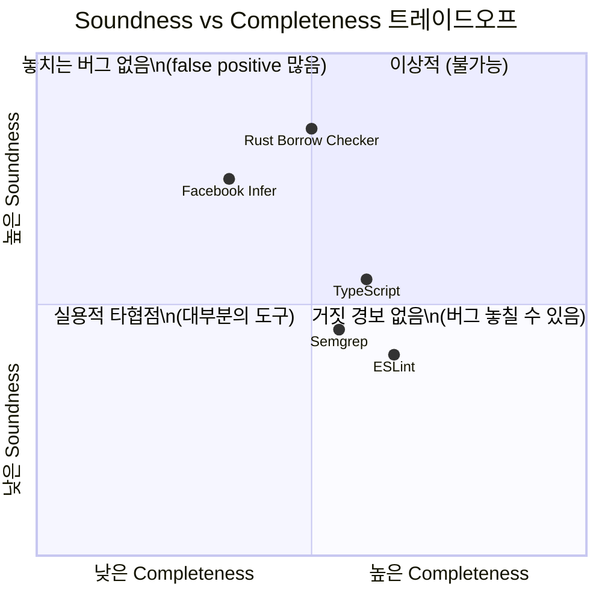
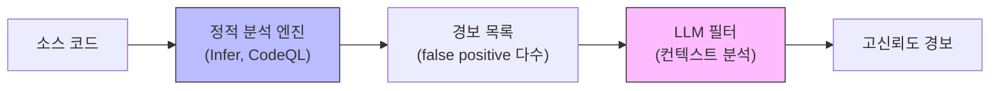

## 도입: 프로그램에 대한 프로그램

IDE에서 빨간 줄이 뜨는 순간, ESLint가 경고를 내는 순간, TypeScript가 `Object is possibly 'undefined'`를 보여주는 순간 — 우리는 이미 정적 분석의 결과를 보고 있다. 코드를 한 줄도 실행하지 않았는데 말이다.

정적 분석(Static Analysis)은 **프로그램을 실행하지 않고** 소스 코드의 속성을 추론하는 기법이다. "코드를 데이터로 다루는 메타 프로그래밍" — 프로그램에 대한 프로그램이다. 이전 글에서 다룬 AST가 코드의 구조적 표현이었다면, 정적 분석은 그 AST 위에서 수행되는 **추론**이다.

---

## 1. 왜 완벽한 정적 분석은 불가능한가: Rice's Theorem

1953년 Henry Gordon Rice가 증명한 정리가 정적 분석의 근본적 한계를 설명한다.

> "튜링 완전한 언어로 작성된 프로그램의 비자명한(non-trivial) 속성을 결정하는 일반적 알고리즘은 존재하지 않는다."

"이 함수는 항상 양수를 반환하는가?", "이 코드에 null dereference가 있는가?", "이 프로그램은 항상 종료하는가?" — 이 질문들에 항상 정확한 답을 내놓는 알고리즘은 **수학적으로 존재할 수 없다.** 이것이 Turing의 정지 문제(Halting Problem)와 같은 계산 불가능성에서 비롯된다.

따라서 모든 실제 정적 분석 도구는 타협한다: **Soundness와 Completeness 사이의 트레이드오프.**

### 형사의 딜레마: Sound vs Complete

**Sound 분석** — "모든 범인을 반드시 체포한다. 대신 무고한 사람도 연행할 수 있다."
실제 버그를 절대 놓치지 않지만, false positive(거짓 경보)가 발생한다. 보안, 항공, 의료처럼 "놓치는 것이 더 위험한" 도메인에서 선호된다.

**Complete 분석** — "무고한 사람은 절대 체포하지 않는다. 대신 범인을 놓칠 수 있다."
보고된 오류는 반드시 실제 오류이지만, 일부 버그를 놓친다. 개발자 경험(DX)이 중요한 도구에서 선호된다.



---

## 2. 분석의 스펙트럼: 간단함에서 정교함까지

정적 분석은 단일 기법이 아니라 정교함이 다른 여러 단계의 스펙트럼이다.

```
간단함 ◄────────────────────────────────────────► 정교함

패턴 매칭 이름 해석 타입 체킹 제어 흐름 데이터 흐름 추상 해석
(ESLint) (스코프) (TypeScript) (narrowing) (Taint) (Infer)
```

각 단계를 직관적 비유와 함께 살펴보자.

---

## 3. Name Resolution: "어느 김철수인가?"

학교 방송에서 "김철수 학생은 교무실로 오세요"라고 했을 때, 1학년 2반 김철수인지 3학년 1반 김철수인지 확인하는 것 — 이것이 Name Resolution이다.

```javascript
let x = 1; // x_1 (전역)
function foo() {
 let x = 2; // x_2 (foo 스코프, x_1을 shadow)
 console.log(x); // x_2를 참조
}
console.log(x); // x_1을 참조
```

Symbol Table이라는 자료구조가 각 스코프에서 이름과 선언의 매핑을 관리한다. 클로저, 호이스팅, `let` vs `var`의 스코프 차이 모두 이 단계에서 해석된다. Name Resolution이 없으면 이후 모든 분석은 불가능하다.

---

## 4. Type Checking & Inference: "퍼즐 조각의 모양이 맞는가?"

타입은 퍼즐 조각의 **모양**이고, 타입 체커는 모든 연결부의 모양이 호환되는지 확인한다.

```typescript
function add(a: number, b: number): number {
 return a + b; // OK: number + number → number
}
add("hello", 1); // ERROR: string 모양의 조각을 number 홈에 끼우려 함
```

### Hindley-Milner: 타입 추론의 핵심 알고리즘

타입을 명시하지 않아도 추론하는 알고리즘이다. 핵심은 세 단계다.

1. 각 expression에 타입 변수를 할당한다 (`t1`, `t2`, ...)
2. 사용 패턴에 따라 제약(constraint)을 생성한다 — `x + y`이면 `t_x = number, t_y = number`
3. **Unification**으로 제약을 풀어 타입 변수에 구체적 타입을 할당한다

### TypeScript는 Hindley-Milner가 아니다

TypeScript는 HM에서 출발했지만 의도적으로 이탈했다.

- **구조적 타이핑**: HM은 이름 기반(nominal)이지만, TypeScript는 JavaScript의 덕 타이핑을 반영해 구조적 타이핑을 선택. 수학적 완전성을 포기한 대신 JS 호환성을 확보.
- **양방향 추론**: `const fn: (x: number) => string = (x) => x.toString()`에서 컨텍스트 타입이 역방향으로 전파.
- **Widening**: `let x = "hello"`는 `string`, `const x = "hello"`는 `"hello"` 리터럴. JavaScript 관용법과의 호환을 위한 실용적 타협.

### TypeScript는 Turing-Complete이다

2020년 Alexey Berezin이 TypeScript 타입 시스템만으로 Brainfuck 인터프리터를 구현하면서, TypeScript의 타입 시스템이 Turing-complete임이 실증되었다. 조건부 타입(Conditional Types)과 `infer` 키워드의 조합이 이를 가능하게 했다.

```typescript
// 타입 레벨에서의 계산
type IsString<T> = T extends string ? true : false;
type ReturnType<T> = T extends (...args: any[]) => infer R ? R : never;

// 2022: satisfies — 타입 단언의 근본 문제를 해결
const palette = {
 red: [255, 0, 0],
 green: "#00ff00",
} satisfies Record<string, string | number[]>;
// palette.red는 number[]로 추론 (Record 타입으로 넓혀지지 않음)
```

실용적 함의: 타입 레벨 프로그래밍은 강력하지만, 깊은 재귀 타입은 컴파일러 성능을 급격히 저하시킨다. TypeScript는 재귀 깊이를 100으로 제한한다.

---

## 5. Control Flow Analysis: "미로의 모든 경로를 그리다"

미로가 있을 때, 실제로 걷지 않고 지도만 보면서 "가능한 모든 경로"를 그리는 것 — 이것이 Control Flow Analysis(CFA)다.

```python
def foo(x): # Entry
 if x > 0: # 분기점
 y = x # 경로 A
 else:
 y = -x # 경로 B
 return y # 합류점
```

이 CFG(Control Flow Graph) 위에서 다음 질문에 답한다:
- **Reachability**: 도달할 수 없는 코드가 있는가? (`if (false) { ... }`)
- **Definite Assignment**: 변수가 사용 전에 반드시 할당되는가?
- **Exhaustiveness**: `switch`가 모든 케이스를 커버하는가?

### TypeScript의 Narrowing: CFA의 실전 적용

TypeScript 컴파일러는 내부적으로 `FlowNode`를 사용해 CFG를 구성하고, 각 지점에서 변수의 타입을 추적한다.

```typescript
function process(x: string | null) {
 // 여기서 x: string | null
 if (x !== null) {
 // FlowCondition 노드 — null 제거
 x.toUpperCase(); // x: string ✓
 }
 // 합류점: x: string | null
}
```

`if (x !== null)` 조건을 만나면 `narrowTypeByEquality` 함수가 then-branch에서 `null`을 제거한다. **Discriminated Union**의 narrowing도 동일 메커니즘이다 — `switch (shape.kind)`에서 각 case가 union 멤버를 필터링한다.

---

## 6. Data Flow Analysis: "값이 어디서 오고 어디로 가는가"

### Reaching Definitions: 변수의 출처 추적

```python
x = 1 # def_1
y = 2 # def_2
if cond:
 x = 3 # def_3
print(x) # x는 def_1 또는 def_3 → 두 가지 가능성
print(y) # y는 반드시 def_2
```

### Live Variable Analysis: 죽은 코드 탐지

```python
x = compute() # x is live (아래서 사용됨)
y = expensive() # y is dead (이후 사용 안 됨) → 제거 가능!
return x
```

변수가 이후에 사용될 수 있는지(live) 역추적한다. Dead code 제거의 기초가 되는 분석이다.

### Taint Analysis: 식품 오염 추적

Taint Analysis는 정적 분석이 보안에 가장 직접적으로 기여하는 기법이다. 비유하면 **식품 안전 조사관이 오염된 식자재가 어떤 가공 공장을 거쳐 어떤 식당의 메뉴까지 도달했는지 추적**하는 것과 같다.

세 가지 핵심 개념:

| 개념 | 역할 | 예시 |
|------|------|------|
| **Source** | 오염 발생지 (신뢰할 수 없는 입력) | `req.query`, `req.body`, Cookie |
| **Sink** | 위험한 연산 (오염 도달 시 취약점) | `db.execute()`, `innerHTML`, `eval()` |
| **Sanitizer** | 정화 함수 (오염 제거) | `parseInt()`, `escapeHtml()`, Prepared Statement |

```python
user_input = request.get("name") # SOURCE: 오염 시작
query = "SELECT * FROM users WHERE name = '" + user_input + "'" # 전파
db.execute(query) # SINK: SQL Injection!
```

Source에서 Sink까지 Sanitizer 없이 도달하는 경로를 발견하면 취약점을 보고한다. OWASP Top 10의 Injection 카테고리(A03) 대부분이 이 방법으로 탐지 가능하다.

실제로 Apple의 GOTO FAIL 버그(2014, TLS 인증 우회), Heartbleed(2014, 버퍼 과다 읽기)도 적절한 정적 분석으로 사전 탐지가 가능했던 사례다.

---

## 7. Abstract Interpretation: 추상 세계에서의 모의 실행

1977년 Patrick Cousot 부부가 정립한 Abstract Interpretation은 정적 분석의 이론적 토대다. 핵심 아이디어: 실제 값 대신 **추상 도메인**에서 프로그램을 "실행"한다.

```
구체적 실행: x = 7, y = -3, z = x + y = 4
추상 실행: x = POS, y = NEG, z = POS + NEG = TOP (알 수 없음)

부호 도메인:
 POS + POS = POS ← 확실
 NEG + NEG = NEG ← 확실
 POS + NEG = TOP ← 양수일 수도, 음수일 수도
```

무한한 가능성을 유한한 추상 상태로 압축한다. 이 과정에서 **Lattice(격자)** 이론이 핵심 수학적 구조가 된다. Lattice 위의 단조 함수는 반드시 **fixpoint(고정점)** 에 수렴하므로, 분석의 종료가 수학적으로 보장된다.

Facebook **Infer**가 이 이론의 가장 성공적인 산업 적용 사례다. Separation Logic 기반으로 힙 메모리를 분석하며, 각 함수의 분석 결과를 요약(summary)으로 캐시하는 **compositional analysis**로 수백만 줄 코드베이스에서도 확장 가능하다.

---

## 8. Rust Borrow Checker: 언어와 분석기의 공동 설계

Rust의 borrow checker는 정적 분석의 혁신이다. 기존 도구들이 이미 설계된 언어에 분석을 "붙이는" 방식이었다면, Rust는 **언어 자체가 정적 분석에 유리하게 설계**되었다.

소유권(ownership), 빌림(borrowing), 생명주기(lifetime)를 타입 시스템에 인코딩하여, 컴파일 타임에 use-after-free, double free, data race를 **런타임 비용 없이** 증명한다.

```rust
let mut v = vec![1, 2, 3];
let first = &v[0]; // immutable borrow 시작
println!("{}", first); // 여기서 borrow 종료 (NLL)
v.push(4); // OK — first의 lifetime이 이미 끝남
```

2018년 도입된 **NLL(Non-Lexical Lifetimes)** 은 MIR(Mid-level IR) 위에서 live variable analysis를 수행하여, 참조의 lifetime을 실제 마지막 사용 시점까지만 추적한다. 이것이 초기 borrow checker의 과도한 보수성을 해결했다.

---

## 9. 실전 도구 생태계

### 프론트엔드: ESLint에서 차세대 린터까지

| 도구 | 구현 | 100K LOC 처리 시간 | 타입 인식 분석 |
|------|------|-------------------|--------------|
| ESLint (타입 인식) | JavaScript | 45~120초 | 지원 |
| ESLint (구문만) | JavaScript | 8~15초 | 미지원 |
| oxlint | Rust | 0.5~2초 | 미지원 |
| Biome | Rust | 1~3초 | 미지원 |

차세대 도구들의 실전 전략은 **하이브리드**다. 빠른 구문 규칙은 oxlint/Biome이 처리하고, `@typescript-eslint/no-floating-promises` 같은 타입 기반 규칙만 ESLint에 위임한다.

### 보안: Semgrep vs CodeQL

**Semgrep** — 패턴 매칭 기반, 규칙 작성이 쉽고 빠르지만 함수 경계를 넘는 분석이 제한적.

```yaml
rules:
 - id: sql-injection
 patterns:
 - pattern: $DB.execute($QUERY + $TAINTED)
 message: "SQL Injection 위험"
 severity: ERROR
```

**CodeQL** — 코드베이스를 관계형 DB로 변환, SQL 유사 언어로 쿼리. Full interprocedural dataflow 지원이지만 학습 곡선이 가파르다.

### CI/CD 통합: 계층형 전략

```
Pre-commit (로컬, <5초) → oxlint, Prettier
PR Check (CI, 변경분, <5분) → Semgrep, TypeScript
Nightly (전체, <30분) → CodeQL, Infer
```

---

## 10. AI 시대의 정적 분석: Hybrid 아키텍처

전통적 정적 분석과 LLM은 상호보완적이다.

| | 전통적 정적 분석 | LLM |
|---|---|---|
| **강점** | 완전성, 결정론적, 복잡한 데이터 흐름 | 의미론적 이해, 새 패턴 일반화 |
| **약점** | 높은 false positive, 의미 무시 | 비결정론적, 환각, 완전성 미보장 |

핵심 보완 관계: 정적 분석은 **무엇이 구조적으로 이상한지** 찾고, LLM은 **왜 그것이 실제 버그인지** 판단한다.



Facebook Research(2022)는 Infer 경보를 LLM으로 필터링하여 false positive를 70% 이상 감소시켰다. **LLIFT**(2023)는 use-before-initialization 버그 리포트에서 "이 경로가 현실적으로 트리거될 수 있는가?"를 LLM의 상식 추론으로 판단한다.

**Monitor-Guided Decoding**은 반대 방향이다 — LLM이 코드를 생성할 때 정적 분석기가 매 토큰마다 유효한 토큰 집합을 계산하여 타입 안전한 코드 생성을 보장한다.

비용 효율적 구성:
1. 정적 분석 ($0, 빠름) → 경보 생성
2. 경량 LLM 필터 ($) → 명백한 false positive 제거
3. 고급 LLM 분석 ($$) → 남은 경보 심층 분석
4. 전문가급 LLM ($$$) → 고위험 취약점에만 적용

---

## 11. 일상 속 보이지 않는 정적 분석

| 일상 경험 | 숨겨진 정적 분석 |
|-----------|----------------|
| IDE 자동완성 `.` 입력 시 | Name Resolution + Type Inference → 후보 메서드 목록 |
| TypeScript 빨간 줄 | Parsing → Name Resolution → Type Checking → CFA |
| `strictNullChecks` | Control Flow Analysis로 null 도달 경로 추적 |
| ESLint `no-unused-vars` | Symbol Table에서 선언 있으나 참조 없는 변수 탐지 |
| 컴파일러 `-Wall` 경고 | 미초기화 변수, unreachable code, 암묵적 변환 |
| Git pre-commit hook | AST 패턴 매칭 (lint) |
| CI의 Semgrep/CodeQL | Taint Analysis + Interprocedural Dataflow |

정적 분석을 이해하면 **에러 메시지가 달리 보인다.** `Object is possibly 'undefined'`는 단순히 "코드가 틀렸다"가 아니라, "CFA가 이 지점에서 `undefined`가 도달하는 경로를 발견했다"는 뜻이다. 이 맥락을 알면 null check, optional chaining, 타입 가드 중 상황에 맞는 해결책을 더 빠르게 선택할 수 있다.

---

## 마무리: 더 깊이 파고들기

정적 분석은 Rice's Theorem이 말하는 "완벽할 수 없는" 영역에서, 실용적 타협을 통해 놀라운 가치를 만들어내는 분야다. 1960년대 컴파일러 최적화에서 시작하여, 2020년대에는 LLM과 결합해 새로운 가능성을 열고 있다.

더 탐구하고 싶다면:

- **이론**: [Static Program Analysis](https://cs.au.dk/~amoeller/spa/) (Møller & Schwartzbach) — 무료 온라인 교재. 데이터 흐름 분석과 Abstract Interpretation을 체계적으로 다룬다.
- **타입 이론**: "Types and Programming Languages" (Benjamin Pierce) — 타입 시스템의 바이블.
- **실전 보안**: [Semgrep Academy](https://semgrep.dev/learn) — Taint Analysis 규칙 작성 실습.
- **Rust 관점**: [The Rust Reference - Borrow Checker](https://doc.rust-lang.org/reference/expressions.html) — 소유권 시스템의 공식 명세.
- **TypeScript 심화**: `tsc --diagnostics`로 타입 인스턴스화 수를 모니터링하며 타입 레벨 프로그래밍의 성능 한계를 체감해보라.

다음 글에서는 정적 분석과 AST를 넘어, 코드를 더 낮은 수준으로 변환하는 **IR(Intermediate Representation)** 을 깊이 탐구한다. 왜 컴파일러는 소스 코드를 직접 기계어로 바꾸지 않고 중간 표현을 거치는가?
