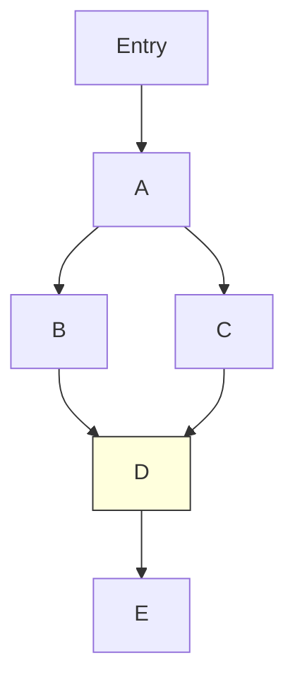

## 도입: 왜 컴파일러는 바로 기계어를 만들지 않는가?

C 코드를 x86 기계어로 변환하는 컴파일러, Go 코드를 ARM으로 바꾸는 컴파일러... M개의 언어와 N개의 하드웨어가 있다면 M×N개의 컴파일러가 필요할까?

1958년 SHARE 위원회는 이 문제를 **UNCOL(Universal Computer Oriented Language)** 이라는 꿈으로 풀려 했다. 중간에 "공용어" 하나를 끼워 넣으면 M+N으로 줄어든다는 통찰이었다. UNCOL은 실현되지 못했지만, 그 씨앗은 수십 년 뒤 LLVM IR, JVM bytecode, WebAssembly로 각각 다른 맥락에서 꽃을 피웠다.

```mermaid
flowchart LR
 subgraph "프론트엔드 (M개)"
 C["C / C++"]
 Rust["Rust"]
 Swift["Swift"]
 end
 subgraph "IR"
 IR["LLVM IR"]
 end
 subgraph "백엔드 (N개)"
 x86["x86"]
 ARM["ARM"]
 WASM["WebAssembly"]
 end
 C --> IR
 Rust --> IR
 Swift --> IR
 IR --> x86
 IR --> ARM
 IR --> WASM
```

IR(Intermediate Representation)은 소스 언어와 타겟 머신 사이의 **중간 형태**다. 컴파일러의 "공용어" — 프론트엔드와 백엔드를 분리하는 핵심 인터페이스. 이 글에서는 IR의 형태, 설계 원리, 그리고 JavaScript 엔진부터 AI 컴파일러, 커널 네트워킹까지 IR이 현대 소프트웨어를 어떻게 관통하는지를 탐구한다.

---

## 1. IR의 수준: 고수준에서 저수준으로

컴파일러는 소스 코드를 한 번에 기계어로 바꾸지 않는다. 여러 수준의 IR을 거치며 점점 낮아진다(lowering).

```
Source Code (High-level)
 ↓
High-level IR (HIR) ← 소스 언어에 가까움. 루프, 조건문 구조 유지
 ↓
Mid-level IR (MIR) ← 대부분의 최적화가 여기서. SSA form, CFG 기반
 ↓
Low-level IR (LIR) ← 기계어에 가까움. 레지스터, 구체적 명령어
 ↓
Machine Code
```

Rust의 컴파일 파이프라인이 이 계층을 잘 보여준다: `HIR(타입 체크) → MIR(borrow check) → LLVM IR(최적화) → 기계어`. MIR이 LLVM IR 위에 추가된 이유는 Rust의 소유권 시스템이 LLVM이 모르는 개념이기 때문이다.

---

## 2. 네 가지 IR 형태: 비유로 이해하기

### TAC (Three-Address Code) — "레시피의 단계별 지시"

복잡한 요리를 한 문장으로 쓰지 않듯, 복합 표현식을 단순 연산의 나열로 분해한다.

```
소스: a = b * c + d * e

TAC:
 t1 = b * c ← 중간 결과에 이름 붙이기
 t2 = d * e
 a = t1 + t2
```

각 명령어가 하나의 연산만 수행하므로, 최적화가 개입할 공간이 생긴다.

### SSA (Static Single Assignment) — "수학의 불변 변수"

**현대 컴파일러의 핵심 IR 형태.** 수학에서 `x = 5`라 쓰면 x는 영원히 5인 것처럼, SSA에서 모든 변수는 **정확히 한 번만** 정의된다.

```
일반 코드: SSA:
 x = 1 x₁ = 1
 x = x + 1 x₂ = x₁ + 1
 if (cond) if (cond)
 x = x * 2 x₃ = x₂ * 2
 print(x) x₄ = φ(x₂, x₃) ← phi 함수
 print(x₄)
```

**φ(phi) 함수**는 제어 흐름이 합류하는 지점에서 "어느 경로로 왔는지에 따라 값을 선택하라"는 선언이다. 이 단 하나의 불변성 덕분에 상수 전파, 죽은 코드 제거, 공통 부분식 제거가 극적으로 단순해진다.

1998년 Princeton의 Andrew Appel은 **"SSA is Functional Programming"** 이라는 4페이지짜리 논문으로 충격을 던졌다. SSA의 φ 함수는 함수형 프로그래밍의 merge 지점이고, 변수의 단일 할당은 불변 값(immutable value)이며, 기본 블록은 클로저와 동치라는 통찰이었다. 이 논문은 함수형 언어 최적화 기법을 명령형 언어 컴파일러로 이식하는 교량을 놓았다.

### CPS (Continuation-Passing Style) — "전화 돌려막기"

함수가 결과를 반환하는 대신, "다음에 할 일"을 명시적으로 전달받는다. 업무 결과를 보고하지 않고, 처음부터 "끝나면 이 사람에게 직접 전화하세요"라고 다음 담당자를 지정하는 방식이다.

```python
# 직접 스타일 # CPS
def add(x, y): def add_cps(x, y, k):
 return x + y k(x + y)

result = add(3, 4) add_cps(3, 4, lambda r: print(r))
print(result)
```

제어 흐름 전체가 코드에 명시되므로, 예외, 비동기, 코루틴이 모두 통일된 방식으로 표현된다. Scheme, ML 계열 컴파일러가 SSA 대신 CPS를 IR로 사용한다.

### Stack-Based IR — "접시 쌓기"

식당 주방의 접시 더미처럼, 위에서만 꺼내고 위에서만 쌓는다. JVM bytecode와 WebAssembly가 이 형태다.

```
소스: x = (3 + 4) * 2

스택 기반:
 push 3 ; 스택: [3]
 push 4 ; 스택: [3, 4]
 add ; 스택: [7]
 push 2 ; 스택: [7, 2]
 mul ; 스택: [14]
```

레지스터 이름이 불필요하므로 코드가 극도로 컴팩트하다. 네트워크 전송에 유리한 이유다.

---

## 3. LLVM IR: 현대 컴파일러 인프라의 심장

2002년 Chris Lattner가 시작한 LLVM은 M+N 문제를 공개 IR 인터페이스로 해결했다. GCC의 IR이 내부 구현 세부사항인 것과 달리, LLVM IR은 **명시적 API이자 공개 인터페이스**다. 이것이 LLVM 생태계가 더 빠르게 확장된 핵심 이유다.

```llvm
; 함수: int abs(int x)
define i32 @abs(i32 %x) {
entry:
 %cmp = icmp slt i32 %x, 0 ; x < 0?
 br i1 %cmp, label %negative, label %positive

negative:
 %neg = sub i32 0, %x
 br label %done

positive:
 br label %done

done:
 %result = phi i32 [%neg, %negative], [%x, %positive]
 ret i32 %result
}
```

관찰 포인트: SSA 형태(각 `%변수`는 한 번만 할당), 명시적 타입(`i32`, `i1`), 기본 블록 + 분기로 제어 흐름 표현, φ 함수로 합류 지점 처리.

### LLVM 최적화 패스 파이프라인

LLVM의 최적화는 "패스(Pass)"의 체인이다. 각 패스는 IR을 입력받아 개선된 IR을 출력한다.

```
mem2reg → alloca를 SSA φ 함수로 승격
instcombine → x + 0 → x 같은 peephole 최적화
licm → 루프 불변 코드를 루프 바깥으로 이동
inliner → 함수 인라인
gvn → 중복 연산 제거 (Global Value Numbering)
dce → 죽은 코드 제거
```

`-O0`에서는 모든 변수가 `alloca`(스택 할당)로 처리되지만, `-O2`에서는 `mem2reg` 패스가 이를 SSA 레지스터로 승격시킨다. 같은 코드가 최적화 레벨에 따라 전혀 다른 IR을 생성하는 이유다.

### LTO: IR의 가장 강력한 활용

**LTO(Link-Time Optimization)** 는 링크 단계에서 여러 파일의 IR을 합쳐 전체 프로그램 최적화를 수행한다. 파일 경계를 넘는 함수 인라인, 전역 죽은 코드 제거가 가능해진다.

```bash
# Thin LTO — 빌드 속도와 최적화의 균형
clang -flto=thin -O2 a.c b.c c.c -o output
```

Chrome 빌드에서 Thin LTO는 바이너리 크기 5-10% 감소, 성능 3-5% 향상을 달성했다.

---

## 4. JavaScript 엔진의 IR: V8 Ignition과 TurboFan

프론트엔드 개발자에게 가장 친숙한 IR은 V8의 bytecode다.

```
JavaScript Source → Parser → AST → Ignition(bytecode) → 실행
 ↓ (Hot function)
 TurboFan(Sea of Nodes IR) → 최적화 기계어
 ↓ (Deoptimization)
 Ignition으로 복귀
```

**Ignition bytecode** — 레지스터 기반 VM. AST보다 2-3배 작아 모바일 메모리를 절약한다.

```
// add(a, b) 함수의 V8 bytecode
Ldar a0 // accumulator ← a
Add a1, [0] // accumulator += b, 타입 피드백 slot 0
Return
```

**TurboFan의 Sea of Nodes IR** — 값 의존성과 제어 흐름을 동일한 노드 그래프로 표현. 전통적 CFG보다 코드 이동(code motion)이 자유롭다.

**Deoptimization**: TurboFan이 "항상 정수"로 가정하고 최적화했는데 문자열이 들어오면, 최적화 코드를 버리고 bytecode 실행으로 복귀한다. `node --trace-deopt`로 확인할 수 있다.

```javascript
function add(a, b) { return a + b; }
for (let i = 0; i < 10000; i++) add(i, i); // TurboFan 최적화
add("hello", "world"); // Deoptimization! 타입 가정 위반
```

---

## 5. 네트워크를 통해 전송되는 IR

### WebAssembly: 웹의 IR

WebAssembly는 처음부터 **네트워크 전송을 핵심 설계 목표**로 삼았다. JVM의 `.class`가 디스크 저장용이었다면, `.wasm`은 HTTP/2 스트리밍을 전제로 설계되었다.

```javascript
// 스트리밍 컴파일 — 다운로드와 컴파일이 동시 진행
const { instance } = await WebAssembly.instantiateStreaming(
 fetch('module.wasm'), // HTTP 스트림 직접 전달
 importObject
);
```

Code Section의 각 함수가 독립적이므로, 수신하는 즉시 병렬 컴파일이 가능하다. LEB128 인코딩으로 작은 값을 1바이트로 표현하여 페이로드를 최소화한다.

Edge Computing에서 WebAssembly는 컨테이너의 대안이 되고 있다. Cloudflare Workers의 콜드 스타트는 ~0ms(컨테이너 100ms~수 초 대비), Fastly Compute는 AOT 컴파일로 ~50μs 인스턴스화를 달성한다.

### eBPF: 커널 내부의 IR

eBPF는 **커널 공간에서 안전하게 실행되는 프로그램을 위한 IR**이다. XDP hook에서 네트워크 패킷을 커널 스택 우회로 처리하여, Cilium은 kube-proxy(iptables) 대비 100배 빠른 서비스 라우팅을 실현한다.

```
eBPF 프로그램 로드:
 clang → eBPF bytecode → verifier(추상 해석으로 안전성 증명)
 → JIT → 커널에서 실행
```

eBPF의 verifier는 모든 가능한 실행 경로에서 메모리 안전성을 **정적으로 증명**한다. 경계 검사 없는 메모리 접근은 로드 자체를 거부한다.

---

## 6. AI 컴파일러의 IR: MLIR과 torch.compile

### MLIR: IR을 위한 IR 프레임워크

2019년 Google이 발표한 MLIR은 "모든 ML 프레임워크 × 모든 하드웨어"의 M×N 문제를 **방언(Dialect)** 시스템으로 해결한다.

```
TensorFlow Dialect → 고수준 ML 연산
 ↓ (lowering)
TOSA Dialect → 하드웨어 독립적 텐서 연산
 ↓ (lowering)
Affine Dialect → 루프/메모리 패턴
 ↓ (lowering)
LLVM Dialect → 전통적 LLVM IR
```

LLVM이 언어와 CPU를 단일 IR로 연결했듯, MLIR은 ML 프레임워크와 하드웨어 가속기를 계층적 IR로 연결한다.

### torch.compile의 FX Graph IR

PyTorch 2.0의 `torch.compile`은 Python bytecode를 후킹하여 **FX Graph**라는 IR을 추출한다.

```python
import torch.fx as fx

def my_model(x, w):
 return torch.relu(torch.mm(x, w))

traced = fx.symbolic_trace(my_model)
# graph():
# %x = placeholder
# %w = placeholder
# %mm = call_function[torch.mm](x, w)
# %relu = call_function[torch.relu](mm)
# return relu
```

이 FX Graph 위에서 연산자 융합(operator fusion), 양자화(quantization), 커널 코드 생성(Triton)이 자동화된다. `LayerNorm → GeLU → Linear`를 각각 실행하면 GPU 메모리를 6번 접근하지만, 융합 커널은 2번으로 줄인다.

### ONNX: ML 모델의 범용 IR

ONNX는 "ML을 위한 LLVM IR"을 목표로 한다. PyTorch 모델을 `.onnx`로 내보내면, ONNX Runtime이 CPU/GPU/TensorRT/CoreML 등 다양한 백엔드에서 실행한다.

---

## 7. SSA 내부: φ 함수는 어떻게 배치되는가

SSA 변환의 핵심은 **어디에 φ 함수를 놓을 것인가**다. 이를 위해 Dominance Frontier가 필요하다.

노드 A가 노드 B를 "지배(dominate)"한다는 것은, 진입점에서 B에 도달하는 **모든** 경로가 반드시 A를 거친다는 뜻이다. Dominance Frontier(DF)는 A가 지배하지 못하는 첫 번째 노드들의 집합 — 바로 여기가 φ 함수가 필요한 자리다.



변수 x가 B와 C에서 정의된다면, 두 경로가 합류하는 D에 φ 함수가 놓인다:

```llvm
D:
 %x = phi i32 [ %x_from_B, %B ], [ %x_from_C, %C ]
```

현대 IR 설계(Cranelift, Swift SIL)는 φ 함수 대신 **Block Parameter** 방식을 채택하는 추세다 — `block2(v10: i32):`처럼 블록이 파라미터를 직접 받는다. 의미는 동일하지만 더 직관적이다.

---

## 8. Compiler Explorer: IR을 직접 보는 경험

[godbolt.org](https://godbolt.org)에서 코드를 입력하면 LLVM IR과 어셈블리를 실시간으로 볼 수 있다. 같은 코드를 `-O0`과 `-O2`로 비교하면 최적화가 IR을 어떻게 바꾸는지 체감할 수 있다.

```bash
# 로컬에서 LLVM IR 비교
clang -S -emit-llvm -O0 file.c -o file_O0.ll
clang -S -emit-llvm -O2 file.c -o file_O2.ll
diff file_O0.ll file_O2.ll
```

`-O0`에서는 모든 변수가 `alloca`(스택)에 있지만, `-O2`에서는 `mem2reg` 패스가 SSA 레지스터로 승격시킨다. 루프가 벡터화되는지, 함수가 인라인되는지 — IR을 읽으면 "왜 이 코드가 느린가"에 대한 답을 찾을 수 있다.

---

## 9. 일상 속의 IR

| 일상 경험 | 숨겨진 IR |
|-----------|----------|
| V8이 JavaScript 실행 | Ignition bytecode → TurboFan Sea of Nodes |
| Rust 컴파일 | HIR → MIR(borrow check) → LLVM IR → 기계어 |
| WebAssembly 로딩 | HTTP 스트리밍 → .wasm 바이너리(스택 기반 IR) → JIT |
| Java 실행 | .class bytecode → HotSpot JIT |
| Docker 컨테이너 | OCI 이미지 = "실행 환경의 IR" |
| eBPF 네트워크 관찰 | C → eBPF bytecode → 커널 verifier → JIT |
| PyTorch torch.compile | Python → FX Graph IR → Triton kernel |
| ONNX 모델 배포 | PyTorch → ONNX IR → 다양한 하드웨어 런타임 |
| npm 번들링 | esbuild: AST 직접 변환 (IR 생략 = 속도의 비결) |

---

## 마무리: 더 깊이 파고들기

IR은 UNCOL이 꿈꾼 "공용어"가 현실에서 분화된 형태다. LLVM IR은 언어와 하드웨어를, JVM bytecode는 플랫폼을, WebAssembly는 네트워크를, eBPF는 커널을, MLIR은 AI와 하드웨어를 잇는다. 각자의 영역에서, IR은 소프트웨어의 보이지 않는 심장으로 뛰고 있다.

더 탐구하고 싶다면:

- **직접 체험**: [Compiler Explorer](https://godbolt.org) — C/Rust/Go 코드의 LLVM IR과 어셈블리를 실시간 비교.
- **LLVM IR 입문**: [A Gentle Introduction to LLVM IR](https://mcyoung.xyz/2023/08/01/llvm-ir/) — LLVM IR 읽는 법을 실용적으로 설명.
- **V8 bytecode 확인**: `node --print-bytecode --print-bytecode-filter=myFn script.js`
- **SSA 심화**: [SSA Book](https://pfalcon.github.io/ssabook/latest/) — 무료 온라인, SSA에 대한 포괄적 참조.
- **이론적 보석**: "SSA is Functional Programming" (Appel, 1998) — SSA와 람다 대수의 수학적 동치를 4페이지로 증명.

다음 글에서는 IR 위에서 수행되는 **최적화 패스(Optimization Pass)** 를 깊이 탐구한다. 상수 전파, 죽은 코드 제거, 루프 최적화, 인라인 — 컴파일러가 코드를 어떻게 더 빠르게 만드는가?
