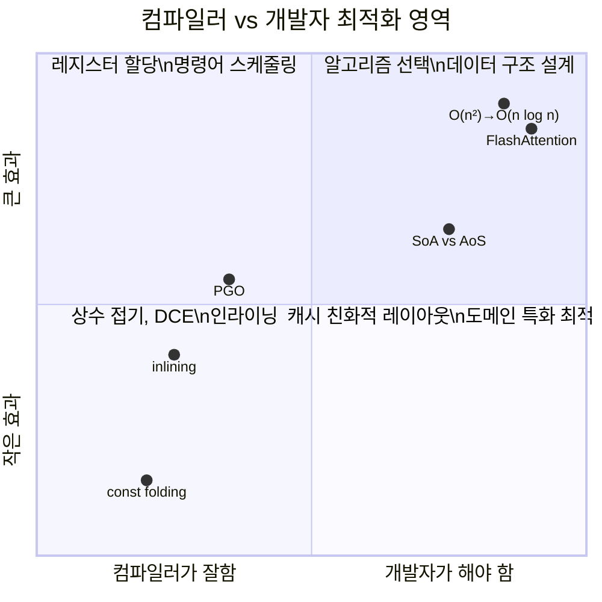

## 도입: "최적화"라는 이름이 잘못된 이유

컴파일러 "최적화"는 사실 최적(optimum)을 보장하지 않는다. 수학에서 최적화는 전역 최솟값을 찾는 것이지만, 컴파일러가 하는 일은 **개선(improvement)** 이다. 주어진 제약 하에서 휴리스틱을 적용해 더 나은 코드를 만들 뿐이다. 실제로 `-O3`가 `-O2`보다 느린 경우도 있다 — 과도한 루프 언롤링이 명령어 캐시를 오염시키기 때문이다.

그럼에도 최적화 패스의 효과는 경이적이다. 이전 글에서 다룬 IR 위에서, 수십 개의 패스가 순차적으로 코드를 변환하며 의미를 보존하면서 성능을 끌어올린다. 이 글에서는 각 최적화 패스가 **무엇을 하고, 왜 효과적이며, 어디서 실패하는지**를 탐구한다.

---

## 1. Pass Pipeline: 조립 라인처럼 작동하는 최적화

```
IR → [Pass 1] → IR' → [Pass 2] → IR'' → [Pass 3] → IR''' → ...
```

각 패스는 하나의 특정 최적화만 담당한다. 핵심 원리 세 가지:

1. **각 패스는 단순하게** — 하나의 일만 잘 한다
2. **시너지 효과** — A가 만든 기회를 B가 활용한다
3. **순서가 중요하다** — Phase Ordering Problem

### Phase Ordering Problem: 왜 순서가 중요한가

인라이닝을 먼저 하면 상수 전파의 기회가 생기지만, 코드 크기가 커져 루프 언롤링 효과가 줄어든다. N개 패스의 최적 순서를 찾으려면 N! 순열을 탐색해야 하므로 NP-hard다.

LLVM은 수십 년의 경험에서 도출한 **고정 파이프라인**을 `-O1`/`-O2`/`-O3`로 제공하고, 최근에는 ML 기반으로 인라이닝 결정을 최적화하는 **MLGO 프로젝트**를 통해 이 문제를 우회한다.

---

## 2. 기본 최적화: 직관적 비유로 이해하기

### Constant Folding — "계산기로 미리 계산하기"

```c
Before: x = 2 * 3 * 7
After: x = 42 // 컴파일 타임에 계산 완료
```

프로그래머가 가독성을 위해 `60 * 60 * 24`라고 썼을 때, 컴파일러는 런타임에 곱셈을 실행하지 않고 `86400`으로 접는다.

### Constant Propagation — 상수 전파와의 시너지

```c
Before: x = 5; y = x + 3; z = y * 2
After: x = 5; y = 8; z = 16
```

상수임이 밝혀진 변수를 사용처까지 전파하고, 전파된 결과를 다시 Folding한다. 두 패스의 연쇄 효과다.

### Dead Code Elimination — "안 쓰는 물건 버리기"

```c
Before: x = expensive_calc() // 결과를 아무도 안 씀
 return 42
After: return 42 // expensive_calc() 제거
```

SSA에서 구현이 자명한 이유: 각 변수의 사용처(use) 수를 세서 0이면 제거. 단, **부수 효과(side effect)** 가 있는 코드는 제거할 수 없다 — `printf` 호출을 "결과를 안 쓰니까" 삭제하면 의미가 바뀐다.

### Common Subexpression Elimination — "같은 일을 두 번 하지 않기"

```c
Before: a = b + c; d = b + c
After: a = b + c; d = a // 첫 계산 결과 재사용
```

두 동료에게 같은 조사를 따로 시키는 대신, 한 명의 결과를 공유한다.

### Inlining — "전화 대신 직접 가기"

```c
Before: int square(int x) { return x * x; }
 y = square(5)
After: y = 5 * 5 → (constant fold) → y = 25
```

인라이닝의 진짜 가치는 **다른 최적화의 기회를 열어주는 것**이다. 인수가 상수임이 밝혀지면 상수 전파 → 상수 접기 → 죽은 코드 제거가 연쇄적으로 발생한다. LLVM은 함수 크기, 호출 빈도, 핫/콜드 경로 정보를 점수화하여 인라이닝 여부를 결정한다.

---

## 3. 루프 최적화: 반복의 비용을 줄이다

### LICM — "매 바퀴마다 안전벨트를 다시 매지 않기"

```c
Before: for (int i = 0; i < n; i++) {
 float scale = width / 2.0f; // 루프마다 반복 계산
 result[i] = data[i] * scale;
 }
After: float scale = width / 2.0f; // 루프 밖으로 이동
 for (int i = 0; i < n; i++)
 result[i] = data[i] * scale;
```

루프 불변(loop-invariant) 계산을 루프 밖으로 끌어낸다. Alias Analysis가 "이 값이 루프 내에서 변하지 않음"을 증명해야 안전하게 이동 가능하다.

### Strength Reduction — 비싼 연산을 싼 연산으로

```c
Before: for (i = 0..n) x = i * 4 // 곱셈
After: x = 0; for (i = 0..n) { use(x); x += 4; } // 덧셈
```

### Loop Unrolling — 분기 오버헤드 제거

```c
Before: for (i = 0..4) a[i] = 0
After: a[0]=0; a[1]=0; a[2]=0; a[3]=0 // 루프 제거
```

### Auto-Vectorization — SIMD로 병렬 처리

```c
// 이 루프 패턴은 LLVM이 자동으로 AVX2 명령어로 변환
void add_arrays(float* a, float* b, float* c, int n) {
 for (int i = 0; i < n; i++)
 c[i] = a[i] + b[i]; // 8개씩 동시 처리 가능
}
```

벡터화 성공 조건: 반복 간 데이터 독립성, 메모리 정렬, aliasing 없음. `-Rpass-missed=loop-vectorize`로 실패 원인을 진단할 수 있다.

---

## 4. 메모리 최적화: 할당의 비용을 줄이다

### Escape Analysis — "이 택배를 집 밖으로 보내야 하는가?"

```java
void process() {
 Point p = new Point(1, 2); // p가 이 함수 밖으로 안 나감
 return p.x + p.y;
}
// → 힙 대신 스택에 할당, 또는 스칼라로 분해
```

객체가 생성 범위를 "탈출"하지 않으면 GC 없이 스택 할당으로 대체한다. JVM HotSpot, Go 컴파일러가 적극 활용한다.

### Alias Analysis — 두 포인터가 같은 곳을 가리키는가?

```c
void foo(int *a, int *b) {
 *a = 10;
 *b = 20;
 print(*a); // a == b이면 20, 아니면 10
}
```

컴파일러는 `a`와 `b`가 같은 메모리를 가리킬 가능성을 분석해야 최적화 여부를 결정한다. C의 `restrict` 키워드는 "aliasing 없음"을 보장하고, Rust의 소유권 시스템은 이를 타입 수준에서 강제한다.

---

## 5. 최적화 레벨: -O0부터 -Oz까지

| 레벨 | 핵심 패스 | 특징 |
|------|----------|------|
| `-O0` | 없음 | 디버깅용. 모든 변수가 스택에 `alloca` |
| `-O1` | mem2reg, instcombine, simplifycfg, DCE | 기본 최적화. 제한된 인라이닝 |
| `-O2` | O1 + 공격적 인라이닝, GVN, LICM, Loop Vectorizer | **프로덕션 기본값** |
| `-O3` | O2 + SLP Vectorizer, 공격적 언롤링 | 컴파일 느림, 5-10% 추가 향상 |
| `-Os` | O2 수준이되 크기 증가 최적화 비활성화 | 임베디드, I-cache 제한 환경 |
| `-Oz` | Os보다 공격적 크기 축소 | WebAssembly 배포 |

```bash
# 실제 파이프라인 확인
clang -O2 -mllvm -print-pipeline-passes -x c /dev/null 2>&1
```

---

## 6. PGO: 런타임 정보로 컴파일러를 무장시키다

**PGO(Profile-Guided Optimization)** 는 정적 분석의 한계를 실제 실행 데이터로 보완한다.

```bash
# 1단계: 프로파일링 빌드
clang -O2 -fprofile-generate program.c -o program_instr

# 2단계: 실제 워크로드로 실행
./program_instr < production_workload.txt

# 3단계: 프로파일 기반 최적화 빌드
llvm-profdata merge *.profraw -o merged.profdata
clang -O2 -fprofile-use=merged.profdata program.c -o program_opt
```

PGO가 활성화하는 최적화: 핫/콜드 코드 분리(I-cache 효율), 핫 경로 인라이닝 우선, 분기 배치 최적화. Nginx에서 5-10% 처리량 향상, Envoy Proxy에서 p99 레이턴시 10-15% 감소 사례가 보고되었다.

---

## 7. 프론트엔드의 최적화 패스

### V8의 투기적 최적화

V8은 Feedback Vector로 런타임 타입 정보를 수집하고, TurboFan이 이를 근거로 **투기적 최적화(Speculative Optimization)** 를 수행한다.

```javascript
function add(a, b) { return a + b; }
for (let i = 0; i < 10000; i++) add(i, i); // TurboFan: 정수 덧셈으로 특화
add("hello", "world"); // Deoptimization! 가정 위반 → Ignition으로 복귀
```

**Hidden Class 안정화**가 V8 최적화의 핵심이다. 동일한 프로퍼티를 같은 순서로 추가한 객체들은 같은 Hidden Class를 공유하여 프로퍼티 접근이 메모리 오프셋 직접 참조로 최적화된다.

```typescript
// 나쁜 패턴: 조건부 프로퍼티 → Hidden Class 불안정
const user: Partial<User> = { name: 'Kim' };
if (hasEmail) user.email = 'kim@ex.com';

// 좋은 패턴: 모든 프로퍼티를 처음부터 정의
const user: User = { name: 'Kim', email: email ?? null };
```

### Tree-shaking: 번들러의 DCE

ES Modules의 정적 구조(`import`/`export`)를 이용해 사용되지 않는 export를 제거한다. `package.json`의 `"sideEffects": false`는 번들러에게 "이 패키지의 모듈은 import만 하고 실행하지 않아도 안전하다"는 신호다.

```json
// 라이브러리 package.json
{ "sideEffects": ["*.css", "./src/polyfills.ts"] }
```

### React Compiler: 자동 메모이제이션

React Compiler(2024)는 컴포넌트의 의존성 그래프를 분석해 `useMemo`/`useCallback`에 해당하는 코드를 **자동으로 삽입**한다. 개발자가 수동 메모이제이션을 하지 않아도 된다. 단, 외부 가변 참조나 Rules of Hooks 위반 코드에서는 bail-out한다.

---

## 8. AI 컴파일러의 최적화 패스

### Operator Fusion: AI 최적화의 핵심

```
변환 전: x → LayerNorm → Dropout → Linear → GeLU → output
 (GPU 메모리 왕복 6회)

변환 후: x → FusedKernel → output
 (GPU 메모리 왕복 2회)
```

`torch.compile`의 Inductor 백엔드는 FX Graph IR에서 자동으로 fusion 가능한 연산을 찾아 Triton 커널로 코드 생성한다. FlashAttention은 컴파일러가 자동 발견하지 못하는 수학적 등가 변환(online softmax)을 수동으로 적용한 사례다.

### ML로 컴파일러 최적화하기

Google의 **MLGO**는 LLVM 인라이닝 결정에 강화학습 모델을 적용하여 바이너리 크기 3-7% 감소를 달성했다. **CompilerGym**(Meta)은 Phase Ordering을 표준 RL 벤치마크로 정형화했다.

---

## 9. 최적화의 정확성: 의미를 보존해야 한다

**가장 중요한 불변 조건: 프로그램의 관찰 가능한 동작을 변경하면 안 된다.**

### UB(Undefined Behavior)가 주는 자유와 위험

```c
void f(int *p) {
 *p = 10; // p != null 임을 컴파일러가 가정 (역참조했으므로)
 if (p) bar(); // null 체크가 제거될 수 있음!
}
```

C/C++의 UB는 컴파일러에게 강력한 가정을 허용한다. 부호 있는 정수 오버플로, null 역참조, 범위 초과 접근은 "발생하지 않는다"고 가정하고 최적화한다. `-fsanitize=undefined`로 런타임 UB를 검출하는 것이 방어 수단이다.

### `-ffast-math`의 트레이드오프

IEEE 754를 완화하여 부동소수점 연산 재결합, NaN/Inf 가정 제거, SIMD 벡터화를 허용한다. 수치 계산에서 5-20% 성능 향상을 주지만, 금융/과학 계산에서는 미묘한 수치 오류를 유발한다.

```bash
# 선택적 적용 권장
clang -fno-math-errno -fassociative-math file.c # NaN/Inf 처리는 유지
```

### 보안 코드가 삭제되는 사례

```c
void secure_clear(char *pwd, size_t len) {
 memset(pwd, 0, len); // 컴파일러가 DCE로 제거할 수 있음!
}
```

`pwd`를 이후 사용하지 않으면 컴파일러는 "관찰되지 않는 쓰기"로 판단해 제거한다. 해결: `memset_s` 또는 `explicit_bzero` 사용.

---

## 10. Compiler Explorer: 최적화를 직접 보는 경험

```bash
# LLVM 최적화 리마크 확인
clang -O2 -Rpass=inline file.c # 인라이닝된 함수
clang -O2 -Rpass-missed=loop-vectorize file.c # 벡터화 실패 원인

# IR 비교
clang -S -emit-llvm -O0 file.c -o O0.ll
clang -S -emit-llvm -O2 file.c -o O2.ll
diff O0.ll O2.ll
```

[godbolt.org](https://godbolt.org)에서 `-O0`과 `-O2`를 나란히 비교하면 상수 접기, 인라이닝, 벡터화가 IR을 어떻게 바꾸는지 체감할 수 있다.

---

## 11. 개발자와 컴파일러의 역할 분담

Knuth의 원문은 자주 잘려서 인용된다. 원문의 핵심: *"97%의 시간에는 작은 효율을 잊어라. 조기 최적화는 만악의 근원이다. **그러나 핵심 3%에서의 기회를 놓쳐서는 안 된다.**"*



**컴파일러에게 맡길 것**: 상수 계산, DCE, 인라이닝, 레지스터 할당, 명령어 스케줄링.

**개발자가 해야 할 것**: 알고리즘 선택(O(n²)→O(n log n)은 컴파일러가 못 함), 캐시 친화적 데이터 구조, 도메인 지식 기반 최적화, 프로파일 기반 병목 식별.

---

## 마무리: 시리즈를 돌아보며

이 글로 **컴파일러 기초 시리즈**를 마무리한다. 파싱에서 시작해 AST, 정적 분석, IR을 거쳐 최적화 패스까지 — 소스 코드가 기계어가 되기까지의 여정을 탐구했다.

```
Source Code → [Parsing] → AST → [Static Analysis] → Typed AST
→ [Lowering] → IR → [Optimization Passes] → Optimized IR → Machine Code
```

각 단계는 독립적이지 않다. 파싱의 에러 복구가 IDE 경험을 결정하고, AST의 설계가 도구 생태계를 좌우하며, 정적 분석의 깊이가 최적화의 공격성을 결정하고, IR의 형태가 패스의 효과를 한정한다.

더 탐구하고 싶다면:

- **실습 중심**: [Crafting Interpreters](https://craftinginterpreters.com/) — 파싱부터 VM까지 직접 구현.
- **LLVM 패스 작성**: [Writing an LLVM Pass](https://llvm.org/docs/WritingAnLLVMPass.html) — 커스텀 최적화 패스 구현 가이드.
- **최적화 시각화**: [Compiler Explorer](https://godbolt.org) + `-Rpass=.*` — 컴파일러의 결정을 직접 관찰.
- **이론 심화**: "Engineering a Compiler" (Cooper & Torczon) Ch.8-10 — 최적화 이론의 교과서.
- **ML + 컴파일러**: [CompilerGym](https://compilergym.com/) — Phase Ordering을 RL로 풀어보는 실험 환경.
