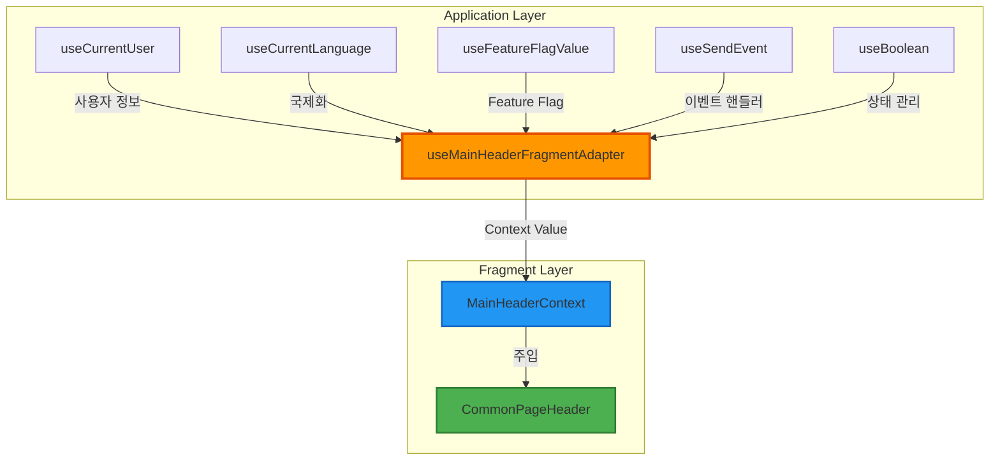
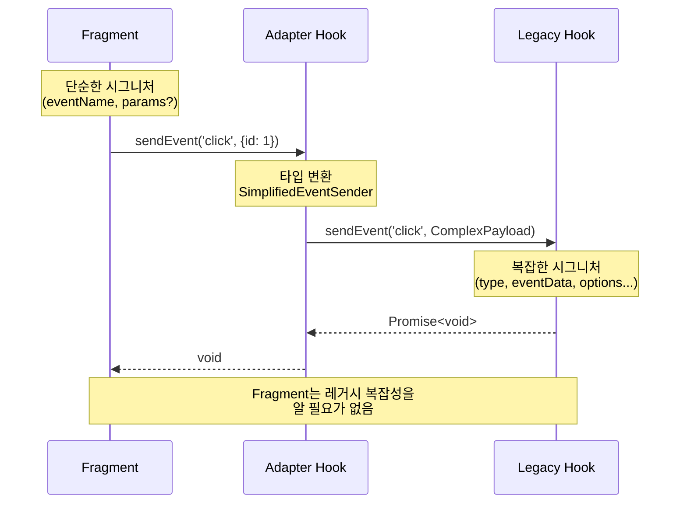
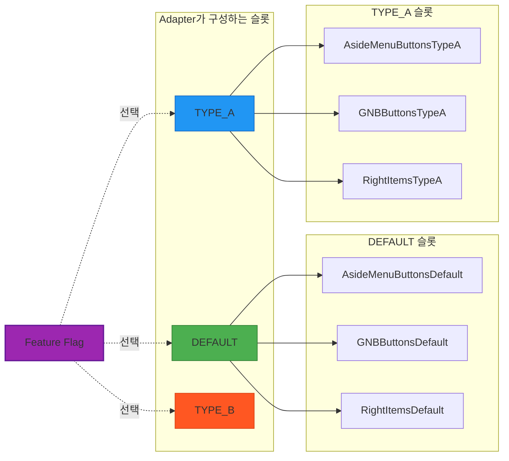

# Adapter Hook 패턴으로 Legacy 호환성 유지: 프론트엔드 내부의 BFF를 설계하다

## 한눈에 보기

Adapter Hook은 GoF Adapter 패턴의 함수형 변형으로, 레거시 시스템의 데이터를 새로운 컴포넌트가 기대하는 인터페이스로 변환합니다. 이 패턴은 프론트엔드 내부에 BFF(Backend For Frontend) 레이어를 구축하는 것과 같아서, Fragment가 레거시 Hook들의 복잡성을 전혀 알지 못한 채 깔끔한 Props만 받아 사용할 수 있게 합니다.

---

## 들어가며

레거시 시스템과 새로운 아키텍처의 공존은 프론트엔드 개발에서 피할 수 없는 현실입니다. 완전한 리팩토링이 이상적이지만, 현실의 제약 속에서 우리는 종종 "기존 것을 유지하면서 새 것을 도입하는" 전략을 선택해야 합니다. 이때 등장하는 질문이 있습니다: 어떻게 하면 레거시 데이터 구조를 새로운 컴포넌트가 기대하는 형태로 안전하게 변환할 수 있을까요?

Adapter Hook 패턴은 이 질문에 대한 하나의 답입니다. 1994년 GoF(Gang of Four)가 정립한 Adapter 패턴의 핵심 원칙을 React Hook이라는 현대적 컨텍스트에 적용한 것입니다. GoF는 Adapter를 "클래스의 인터페이스를 클라이언트가 기대하는 다른 인터페이스로 변환하는 것"이라고 정의했습니다. Adapter Hook은 이 정의를 그대로 따르되, 클래스와 상속 대신 함수와 클로저를 사용합니다.

이 글에서는 Adapter Hook이 왜 이렇게 작동하는지, 그 설계 철학과 실용적 가치를 탐구합니다.

---

## Object Adapter에서 Hook으로: 합성의 원칙이 살아남다

GoF는 Adapter 패턴을 두 가지 형태로 제시했습니다. Class Adapter는 상속을 통해 기존 클래스를 확장하고, Object Adapter는 합성(Composition)을 통해 기존 객체를 감쌉니다. TypeScript와 React 생태계에서 Class Adapter는 다중 상속의 제약으로 적용이 어렵습니다. 하지만 Object Adapter의 철학, 즉 "상속보다 합성을 선호하라"는 원칙은 Adapter Hook에서 고스란히 재현됩니다.

Adapter Hook은 레거시 데이터를 인자로 받습니다. 이것이 바로 합성입니다. Hook은 레거시 Hook을 상속받지 않고, 레거시 Hook이 반환하는 데이터를 조합하여 새로운 형태를 만들어냅니다. 구조적으로 보면, 외부 인터페이스(Adaptee)인 레거시 데이터를 받아 기대 인터페이스(Target)인 새로운 Props 형태로 반환하는 것입니다.

```typescript
// 레거시 Hook들 (Adaptee)
const { user } = useLegacyUser();
const { permissions } = useLegacyPermissions();
const { preferences } = useLegacyPreferences();

// Adapter Hook이 Target 인터페이스로 변환
function useUserAdapter(): UserFragmentProps {
  const { user } = useLegacyUser();
  const { permissions } = useLegacyPermissions();
  const { preferences } = useLegacyPreferences();

  return {
    displayName: user.firstName + ' ' + user.lastName,
    canEdit: permissions.includes('EDIT'),
    theme: preferences.darkMode ? 'dark' : 'light',
  };
}
```

이 구조에서 클로저는 클래스의 역할을 대신합니다. Hook 내부의 변환 로직은 클래스의 메서드처럼 캡슐화되고, 반환되는 객체는 클래스 인스턴스처럼 일관된 인터페이스를 제공합니다. 본질적인 구조는 1994년의 Object Adapter와 동일하지만, 표현 방식이 함수형으로 바뀐 것입니다.

---

## 프론트엔드 내부의 BFF: 단일 수집점의 가치

2015년 Sam Newman이 제안한 BFF(Backend For Frontend) 패턴은 각 프론트엔드 클라이언트마다 전용 백엔드 레이어를 두는 아키텍처입니다. 모바일 앱과 웹 앱이 서로 다른 데이터 형태를 필요로 할 때, 각각의 BFF가 백엔드 마이크로서비스들로부터 데이터를 수집하고 클라이언트에 맞게 가공합니다.

Adapter Hook은 이 BFF의 개념을 프론트엔드 내부로 가져옵니다. 레거시 Hook들이 백엔드 서비스라면, Adapter Hook은 BFF이고, Fragment는 클라이언트입니다. 이 비유가 왜 중요할까요? BFF가 해결하는 핵심 문제인 "클라이언트가 여러 서비스의 복잡성을 알 필요 없게 만드는 것"을 Adapter Hook도 똑같이 해결하기 때문입니다.



단일 수집점(Single Collection Point)으로서의 Adapter Hook은 여러 레거시 Hook의 데이터를 한 곳에서 수집합니다. Fragment는 Adapter가 제공하는 인터페이스만 알면 됩니다. 8개의 레거시 Hook이 있다고 가정해봅시다. Fragment가 이 8개에 직접 의존한다면, Fragment를 테스트하기 위해 8개의 Hook을 모두 모킹해야 합니다. 하지만 Adapter를 사용하면 Fragment는 단순히 Props를 주입받습니다. 테스트는 극적으로 단순해집니다.

```typescript
// Adapter가 복잡성을 흡수
function useOrderAdapter(): OrderFragmentProps {
  const { user, isLoading: userLoading } = useLegacyUser();
  const { cart, isLoading: cartLoading } = useLegacyCart();
  const { shipping, isLoading: shippingLoading } = useLegacyShipping();
  const { payment, isLoading: paymentLoading } = useLegacyPayment();
  // ... 더 많은 레거시 Hook들

  const isLoading = userLoading || cartLoading || shippingLoading || paymentLoading;

  return {
    isLoading,
    orderSummary: isLoading ? null : {
      customerName: user.name,
      items: cart.items,
      shippingAddress: shipping.address,
      paymentMethod: payment.method,
    },
  };
}

// Fragment는 깔끔한 Props만 받음
function OrderFragment({ isLoading, orderSummary }: OrderFragmentProps) {
  // 레거시 Hook의 존재를 전혀 모름
}
```

의존성 폭발(Dependency Explosion) 방지는 Adapter Hook의 핵심 가치입니다. 레거시 시스템이 복잡할수록, 이 가치는 더욱 빛납니다.

---

## 타입 안전성: 컴파일러를 협력자로 만들기

Adapter Hook에서 가장 주의해야 할 부분은 타입 변환입니다. 레거시 타입과 새로운 타입 사이의 변환에서 타입 단언(Type Assertion)을 사용하고 싶은 유혹이 있습니다. `as` 키워드 한 번이면 컴파일러의 경고가 사라지니까요. 하지만 이것은 컴파일러를 속이는 것입니다. 런타임에 예상치 못한 오류가 발생할 수 있고, 무엇보다 Adapter의 존재 이유인 "안전한 변환"을 포기하는 것입니다.

안전한 변환은 각 필드를 명시적으로 매핑하는 것입니다. 번거로워 보이지만, TypeScript 컴파일러가 변환의 완전성을 검증합니다. 레거시 타입에 새 필드가 추가되거나, 새로운 타입의 필수 필드가 변경되면, 컴파일러가 즉시 알려줍니다.



```typescript
// 위험한 변환
function unsafeAdapter(legacy: LegacyUser): NewUser {
  return legacy as unknown as NewUser; // 컴파일러를 속임
}

// 안전한 변환
function safeAdapter(legacy: LegacyUser): NewUser {
  return {
    id: legacy.userId,           // 명시적 매핑
    name: legacy.fullName,       // 필드명 변환
    email: legacy.emailAddress,
    isActive: legacy.status === 'ACTIVE',  // 값 변환
  };
}
```

컴파일러를 협력자로 삼으면, Adapter Hook은 레거시 시스템과 새 시스템 사이의 계약(Contract)이 됩니다. 이 계약이 깨지면 컴파일 타임에 알 수 있습니다. 런타임 오류보다 컴파일 타임 오류가 훨씬 저렴합니다.

---

## Memoization: 참조 안정성의 문제

Adapter Hook이 매번 새로운 객체를 반환하면 어떤 일이 벌어질까요? React의 얕은 비교(Shallow Comparison)에서 이전 렌더링과 다른 객체로 인식되어, Fragment 전체가 리렌더링됩니다. 데이터가 실제로 변경되지 않았는데도 말입니다.

이 문제의 해결책은 `useMemo`와 `useCallback`입니다. `useMemo`는 데이터 객체의 참조를 안정화하고, `useCallback`은 함수의 참조를 안정화합니다. 의존성 배열에는 실제로 변경을 감지해야 하는 원시값만 포함해야 합니다.

```typescript
function useUserAdapter(): UserFragmentProps {
  const { user } = useLegacyUser();
  const { permissions } = useLegacyPermissions();

  // 데이터 객체 참조 안정화
  const userData = useMemo(() => ({
    displayName: user.firstName + ' ' + user.lastName,
    canEdit: permissions.includes('EDIT'),
  }), [user.firstName, user.lastName, permissions]);

  // 함수 참조 안정화
  const handleUpdate = useCallback((newName: string) => {
    // 업데이트 로직
  }, []);

  return { userData, handleUpdate };
}
```

React 19의 React Compiler는 이러한 Memoization을 자동으로 처리할 것으로 예상됩니다. 하지만 현재로서는 수동으로 관리해야 하며, 특히 Context Provider의 value가 불안정하면 모든 Consumer가 리렌더링되므로 주의가 필요합니다.

---

## 슬롯 구성: 동적 UI 변형 지원

Adapter Hook의 또 다른 강력한 기능은 슬롯 구성입니다. Fragment는 "DEFAULT, TYPE_A, TYPE_B 중 무엇을 렌더링할지" 모릅니다. Adapter가 Feature Flag에 따라 적절한 컴포넌트 조합을 선택하여 슬롯으로 제공합니다.



```typescript
// Adapter Hook에서 슬롯 구성
function useMainHeaderFragmentAdapter() {
  const { commonPageHeaderType } = useFeatureFlagValue();
  const { isLogin } = useLegacyUser();

  return useMemo(() => ({
    slots: {
      default: {
        leftItemsSlot: <GNBButtonsDefault />,
        rightItemsSlot: <RightItemsDefault isLogin={isLogin} />,
        asideMenuSlot: <AsideMenuButtonsDefault />,
      },
      typeA: {
        leftItemsSlot: <GNBButtonsTypeA />,
        rightItemsSlot: <RightItemsTypeA isLogin={isLogin} />,
        asideMenuSlot: <AsideMenuButtonsTypeA />,
      },
      typeB: {
        leftItemsSlot: <GNBButtonsTypeB />,
        rightItemsSlot: <RightItemsTypeB isLogin={isLogin} />,
        asideMenuSlot: <AsideMenuButtonsTypeB />,
      },
    },
    currentType: commonPageHeaderType,
  }), [commonPageHeaderType, isLogin]);
}
```

Fragment는 현재 타입에 해당하는 슬롯을 렌더링하기만 하면 됩니다. 어떤 컴포넌트 조합이 사용되는지는 Adapter가 결정합니다.

---

## 트레이드오프

모든 패턴에는 비용이 있습니다. Adapter Hook 역시 예외가 아닙니다.

**강점:**
- **타입 안전성**: 컴파일러가 변환의 완전성을 검증합니다.
- **단일 변환점**: 레거시 인터페이스 변경 시 Adapter만 수정하면 됩니다.
- **테스트 용이성**: Fragment는 순수한 Props만 받아 테스트가 단순해집니다.
- **관심사 분리**: Fragment는 레거시 시스템의 존재를 모릅니다.

**한계:**
- **보일러플레이트**: 명시적 필드 매핑은 코드량을 증가시킵니다.
- **추상화 비용**: 간접 레이어가 추가되어 코드 추적이 복잡해질 수 있습니다.
- **Memoization 관리**: 참조 안정성을 위한 추가 작업이 필요합니다.
- **초기 설계 비용**: Adapter의 인터페이스를 신중하게 설계해야 합니다.

| 관점 | 직접 변환 | Adapter Hook |
|------|----------|--------------|
| 코드량 | 적음 | 많음 |
| 타입 안전성 | 낮음 | 높음 |
| 테스트 용이성 | 어려움 | 쉬움 |
| 변경 영향 범위 | 넓음 | 좁음 (Adapter만) |
| 적합한 상황 | 단순한 일회성 변환 | 복잡한 레거시, 장기 유지보수 |

이 트레이드오프는 상황에 따라 다르게 평가됩니다. 레거시 시스템이 복잡하고 오래 유지될수록, Adapter Hook의 가치는 높아집니다. 반면 단순한 일회성 변환이라면 과도한 추상화일 수 있습니다.

---

## 마무리하며

Adapter Hook 패턴은 30년 된 설계 원칙이 현대 프론트엔드에서도 유효함을 보여줍니다. GoF의 Object Adapter가 "상속보다 합성"을 강조했듯, Adapter Hook은 레거시 데이터를 합성하여 새로운 인터페이스를 만들어냅니다. BFF가 백엔드 복잡성을 클라이언트로부터 숨기듯, Adapter Hook은 레거시 Hook들의 복잡성을 Fragment로부터 숨깁니다.

핵심 통찰은 이것입니다: Adapter Hook은 단순한 데이터 변환기가 아니라, 레거시와 새 아키텍처 사이의 계약입니다. 이 계약을 타입으로 명시하고, 컴파일러가 검증하게 하면, 레거시 마이그레이션의 위험을 컴파일 타임으로 끌어올릴 수 있습니다. 런타임에 터지는 오류보다, 컴파일 타임에 잡히는 오류가 항상 더 낫습니다.

레거시 시스템과의 공존은 불가피합니다. 중요한 것은 그 공존을 어떻게 관리하느냐입니다. Adapter Hook은 그 관리를 타입 안전하고, 테스트 가능하며, 유지보수 가능한 방식으로 수행하는 하나의 방법입니다.

---

## 더 읽어볼 자료

- [Design Patterns: Elements of Reusable Object-Oriented Software (GoF, 1994)](https://en.wikipedia.org/wiki/Design_Patterns) - Adapter 패턴의 원전
- [Sam Newman, "Backends For Frontends" (2015)](https://samnewman.io/patterns/architectural/bff/) - BFF 패턴의 원래 제안
- [React 공식 문서: useMemo, useCallback](https://react.dev/reference/react) - Memoization의 공식 가이드
- [TypeScript Handbook: Type Assertions](https://www.typescriptlang.org/docs/handbook/2/everyday-types.html#type-assertions) - 타입 단언의 위험성과 대안
- [React 19 Release Notes](https://react.dev/blog) - React Compiler와 자동 Memoization
