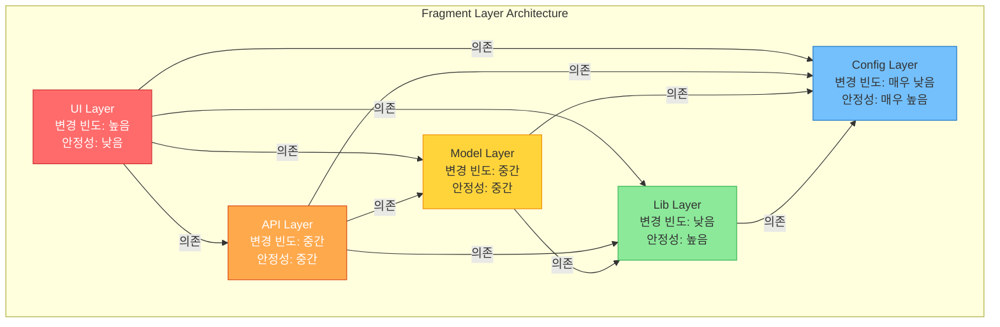
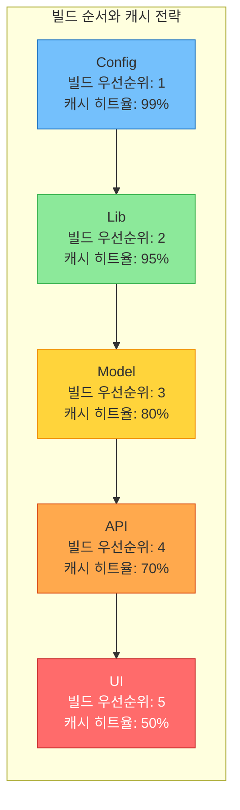
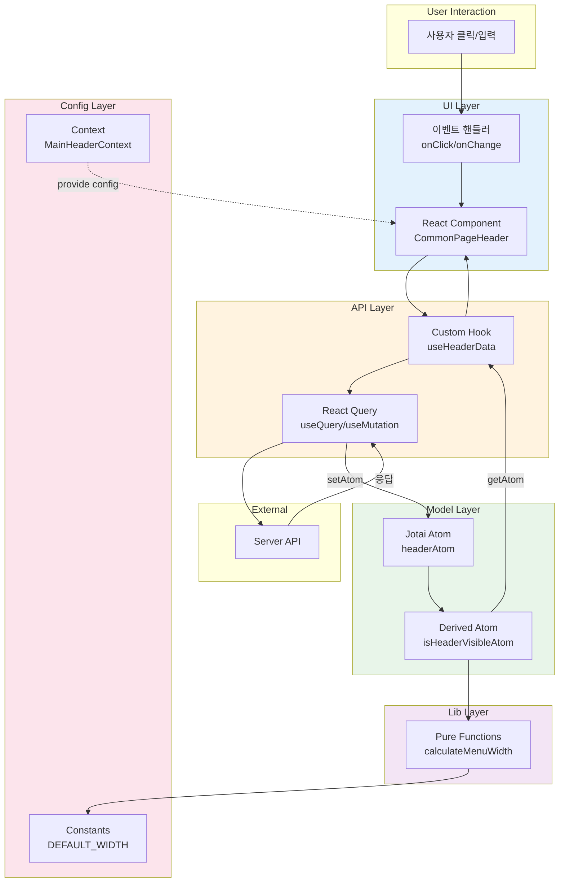
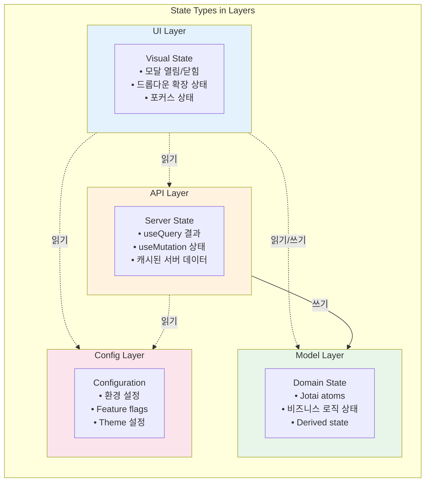
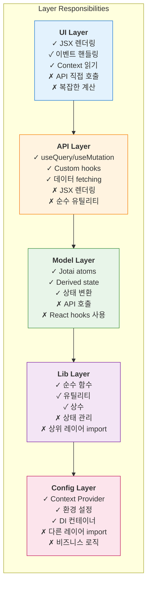

# Micro Frontends Fragment에서 레이어 기반 아키텍처가 필요한 이유: ui > api > model > lib > config의 설계 철학

## 한눈에 보기

Micro Frontends(MF) Fragment 내부를 ui > api > model > lib > config의 5개 레이어로 구조화하면, 각 레이어의 책임이 명확해지고 변경의 전파 범위를 예측할 수 있습니다. 이 구조는 단순한 폴더 정리가 아니라, 1968년 Dijkstra의 THE 시스템에서 시작된 계층적 추상화 원칙을 프론트엔드 맥락에 적용한 것입니다. 단방향 의존성이라는 단순한 규칙 하나가 테스트 격리, 독립 배포, Tree-shaking 최적화까지 가능하게 만듭니다.

---

## 들어가며

대규모 프론트엔드 애플리케이션을 Micro Frontends로 분리했다고 해서 복잡성이 사라지지는 않습니다. 오히려 복잡성은 각각의 Fragment 내부로 이동합니다. 하나의 Fragment가 화면 렌더링, API 호출, 비즈니스 로직, 유틸리티 함수, 설정값을 모두 담고 있을 때, 이것들이 서로 어떻게 의존하는지 파악하기 어려워집니다. 작은 수정이 예상치 못한 곳에 영향을 미치고, 테스트는 점점 어려워지며, 새로운 팀원이 코드베이스를 이해하는 데 오랜 시간이 걸립니다.

이 글에서는 MF Fragment 내부에 레이어 기반 아키텍처를 적용해야 하는 이유를 탐구합니다. 단순히 "이렇게 구조화하세요"라는 처방전이 아니라, 왜 ui가 가장 위에 있고 config가 가장 아래에 있어야 하는지, 이 순서가 빌드 시스템과 상태 관리에 어떤 영향을 미치는지를 살펴봅니다. 그 과정에서 계층형 아키텍처의 역사적 기원과 현대 프론트엔드에서의 적용 방식을 함께 이해하게 될 것입니다.

---

## 계층의 순서는 어디서 왔는가

MF Fragment에서 ui > api > model > lib > config 순서를 채택한 것은 임의적인 결정이 아닙니다. 이 순서는 "변경 빈도"와 "안정성"이라는 두 축을 기준으로 결정되었습니다.



> 레이어가 낮을수록 변경 빈도가 낮고 안정성이 높습니다. 이는 빌드 캐시 효율성과 직결됩니다.

UI 컴포넌트는 가장 자주 변경됩니다. 디자인이 바뀌고, 사용자 피드백에 따라 인터랙션이 수정되며, A/B 테스트를 위해 다양한 변형이 필요합니다. 반면 config 레이어에 있는 환경 설정이나 상수값은 거의 변경되지 않습니다. API 엔드포인트 정의, 도메인 모델, 유틸리티 함수들은 그 사이 어딘가에 위치합니다.

Robert C. Martin이 Clean Architecture에서 제시한 의존성 규칙이 여기서 적용됩니다. "소스 코드 의존성은 안쪽, 즉 고수준 정책을 향해야 한다." MF Fragment 맥락에서 번역하면, 자주 변경되는 레이어가 안정적인 레이어에 의존해야 한다는 뜻입니다. ui는 api를 import할 수 있지만, api가 ui를 import해서는 안 됩니다. 이 단방향 규칙이 지켜지면 config를 수정해도 그 영향은 위쪽으로만 전파되고, ui를 아무리 바꿔도 아래 레이어들은 영향받지 않습니다.

### 레이어 간 Import 규칙

```typescript
// ===== 허용되는 Import 패턴 =====

// ui/CommonPageHeader.tsx
import { useHeaderData } from '../api/hooks';           // ✅ ui → api
import { headerAtom } from '../model/store';            // ✅ ui → model
import { formatHeaderText } from '../lib/utils';        // ✅ ui → lib
import { useMainHeaderContext } from '../config';       // ✅ ui → config

// api/hooks.ts
import { headerAtom } from '../model/store';            // ✅ api → model
import { calculateWidth } from '../lib/utils';          // ✅ api → lib
import { useMainHeaderContext } from '../config';       // ✅ api → config

// model/store.ts
import { calculateMenuWidth } from '../lib/utils';      // ✅ model → lib
import type { HeaderConfig } from '../config/types';    // ✅ model → config

// lib/utils.ts
import { DEFAULT_WIDTH } from '../config/constants';    // ✅ lib → config

// ===== 금지된 Import 패턴 =====

// config/MainHeaderContext.tsx
import { headerAtom } from '../model/store';            // ❌ config → model (역방향 의존)

// lib/utils.ts
import { headerAtom } from '../model/store';            // ❌ lib → model (순환 의존 위험)
import { useHeaderData } from '../api/hooks';           // ❌ lib → api (순환 의존 위험)

// model/store.ts
import { useHeaderData } from '../api/hooks';           // ❌ model → api (역방향 의존)

// api/hooks.ts
import { CommonPageHeader } from '../ui/CommonPageHeader'; // ❌ api → ui (역방향 의존)
```

> 레이어는 자신보다 낮은 레이어만 import 가능합니다. 역방향 import는 순환 의존을 유발합니다.

이 원리의 기원은 1968년 Edsger Dijkstra의 THE 운영체제로 거슬러 올라갑니다. Dijkstra는 시스템을 6개의 계층으로 분리하고, 각 계층이 자신보다 낮은 계층만 사용하도록 설계했습니다. 그가 도입한 "추상화 수준(Level of Abstraction)" 개념은 각 계층을 독립적으로 검증할 수 있게 만들었습니다. 하드웨어 위에 메모리 관리가, 그 위에 프로세스 스케줄링이, 그 위에 입출력이 올라가는 구조는 오늘날 프론트엔드 레이어 구조의 원형입니다.

MF Fragment에서 이 원칙을 적용하면, 각 레이어는 자신의 추상화 수준에서만 동작합니다. config는 순수한 값들, lib는 범용 유틸리티, model은 도메인 개념, api는 서버 통신, ui는 시각적 표현을 담당합니다. 이 분리 덕분에 model 레이어의 비즈니스 로직을 테스트할 때 React 컴포넌트를 렌더링할 필요가 없고, api 레이어를 테스트할 때 실제 UI 없이 응답 변환만 검증할 수 있습니다.

---

## 단방향 의존성이 빌드 시스템에 미치는 영향

레이어 구조의 가장 실용적인 이점 중 하나는 빌드 최적화입니다. 현대 번들러의 Tree-shaking은 단방향 의존성 그래프를 전제로 동작합니다. 진입점(ui 레이어)에서 시작해서 실제로 import된 모듈만 추적하고, 사용되지 않는 코드는 최종 번들에서 제거합니다.



> 안정적인 하위 레이어는 캐시 히트율이 높아 빌드 성능 향상에 기여합니다. UI 변경 시에도 하위 레이어 캐시를 재사용 가능합니다.

순환 참조가 발생하면 이 메커니즘이 망가집니다. A가 B를 import하고 B가 다시 A를 import하면, 번들러는 어느 쪽을 먼저 평가해야 할지 결정할 수 없습니다. 결과적으로 두 모듈을 통째로 번들에 포함시키고, Dead Code Elimination(DCE)도 실패합니다. 실무에서 순환 참조로 인한 번들 크기 증가는 15-30%에 달하는 경우도 있습니다.

MF Fragment의 레이어 구조는 이 문제를 구조적으로 방지합니다. ui는 api를, api는 model을, model은 lib를, lib는 config만 import할 수 있다는 규칙이 있으면, 순환 참조는 원천적으로 불가능합니다. ESLint의 import/no-cycle 규칙과 eslint-plugin-boundaries를 조합하면 이 규칙을 CI 단계에서 강제할 수 있습니다.

Turborepo 같은 모노레포 빌드 도구를 사용할 때 레이어 구조의 이점은 더욱 두드러집니다. 각 레이어의 변경 빈도가 다르기 때문에 캐시 적중률도 차등화됩니다. config 레이어는 거의 변경되지 않으므로 99%에 가까운 캐시 적중률을 보이고, lib는 95%, model은 80%, api는 70%, ui는 50% 정도입니다. 원격 캐시를 활용하면 이 이점이 팀 전체로 확산됩니다. 한 개발자가 빌드한 결과를 다른 개발자가 재사용할 수 있기 때문입니다.

독립 배포 관점에서도 레이어 구조는 핵심적입니다. Fragment A의 ui 레이어만 변경되었다면, 다른 Fragment들을 다시 빌드하거나 배포할 필요가 없습니다. 변경의 영향 범위가 레이어 경계 내로 제한되기 때문입니다. 이것이 Micro Frontends가 약속하는 독립 배포의 실제 구현입니다. 레이어 구조 없이는 작은 변경이 전체 시스템에 영향을 미칠 수 있어서 진정한 의미의 독립 배포가 어렵습니다.

DCE가 제대로 작동하려면 몇 가지 조건이 필요합니다. ES Modules를 사용해야 정적 분석이 가능하고, package.json에 sideEffects: false를 선언해야 번들러가 부작용 없는 모듈을 안전하게 제거할 수 있습니다. 각 레이어에서 명시적인 export/import를 사용하고, 번들러 설정에서 usedExports와 minimize 옵션을 활성화해야 합니다.

---

## 데이터는 어떻게 레이어를 흐르는가

MF Fragment에서 데이터는 ui에서 api로, api에서 model로 흐릅니다. 각 레이어는 서로 다른 종류의 상태를 담당합니다.



> 데이터는 UI → API → Server 방향으로 요청되고, Server → Model → API → UI 방향으로 전파됩니다.

UI 레이어는 Visual State를 관리합니다. 모달이 열려 있는지, 드롭다운이 확장되었는지, 입력 필드에 포커스가 있는지 같은 상태입니다. 이 상태는 휘발성이고 로컬입니다. 페이지를 새로고침하면 사라져도 되고, 다른 컴포넌트와 공유할 필요도 거의 없습니다. React의 useState가 이 역할을 담당합니다.

API 레이어는 Server State를 관리합니다. 서버에서 가져온 데이터를 캐싱하고, 백그라운드에서 재검증하며, 낙관적 업데이트를 처리합니다. 이 상태는 서버와의 동기화가 필요하고, 여러 컴포넌트가 동일한 데이터를 필요로 할 수 있습니다. React Query가 이 레이어에 배치되는 이유입니다.

Model 레이어는 Domain State를 담습니다. 비즈니스 규칙, 유효성 검증 로직, 도메인 객체 간의 관계가 여기에 정의됩니다. 이 레이어는 React나 특정 상태 관리 라이브러리에 의존하지 않는 순수한 TypeScript 코드로 작성될 수 있습니다.



> Visual State는 UI에, Server State는 API에, Domain State는 Model에, Configuration은 Config에 배치됩니다.

이 구조는 CQRS(Command Query Responsibility Segregation) 패턴과 자연스럽게 연결됩니다. React Query의 useQuery는 Query 책임을 담당합니다. "현재 상태가 무엇인가?"라는 질문에 답합니다. useMutation은 Command 책임을 담당합니다. "상태를 어떻게 변경할 것인가?"라는 명령을 처리합니다. 각 MF Fragment가 자신만의 Query와 Command를 가지면, Fragment 간 독립성이 보장됩니다.

### API 레이어의 React Query 활용 패턴

```typescript
// packages/fragments/main-header/src/api/useHeaderData.ts
import { queryOptions, useSuspenseQuery, useMutation, useQueryClient } from '@tanstack/react-query';
import { useSetAtom } from 'jotai';
import { useEffect } from 'react';
import { headerAtom } from '../model/store';
import { fetchHeaderData, updateHeader } from '@entity/header';
import type { HeaderQueryOptions, UpdateHeaderRequest } from '@entity/header';

// ✅ queryOptions 패턴: 재사용 가능한 쿼리 정의
export const headerQueryOptions = (options: HeaderQueryOptions) =>
  queryOptions({
    queryKey: ['header', options],
    queryFn: () => fetchHeaderData(options),
    staleTime: 5 * 60 * 1000, // 5분
  });

// ✅ Suspense Query 활용
export const useHeaderData = (options: HeaderQueryOptions) => {
  return useSuspenseQuery(headerQueryOptions(options));
};

// ✅ Server State를 Domain State로 동기화
export const useSyncHeaderToStore = (options: HeaderQueryOptions) => {
  const { data } = useHeaderData(options);
  const setHeader = useSetAtom(headerAtom);

  useEffect(() => {
    if (data) {
      setHeader(data);
    }
  }, [data, setHeader]);
};

// ✅ Mutation with optimistic update
export const useUpdateHeaderMutation = () => {
  const queryClient = useQueryClient();

  return useMutation({
    mutationFn: (data: UpdateHeaderRequest) => updateHeader(data),
    onMutate: async (newData) => {
      // 낙관적 업데이트
      await queryClient.cancelQueries({ queryKey: ['header'] });
      const previousData = queryClient.getQueryData(['header']);
      queryClient.setQueryData(['header'], newData);
      return { previousData };
    },
    onError: (_error, _variables, context) => {
      // 롤백
      if (context?.previousData) {
        queryClient.setQueryData(['header'], context.previousData);
      }
    },
    onSettled: () => {
      queryClient.invalidateQueries({ queryKey: ['header'] });
    },
  });
};
```

> API 레이어는 React Query hooks를 관리하며, Server State와 Domain State를 연결하는 역할을 담당합니다.

useQuery와 useMutation을 api 레이어에 배치하는 것은 의도적인 결정입니다. 캐시 키 관리가 중앙화되어 동일한 데이터에 대해 일관된 캐시 정책을 적용할 수 있습니다. 서버 응답을 도메인 모델로 변환하는 DTO 변환 로직이 한 곳에 모여 있어서, API 스펙이 변경되어도 수정 범위가 api 레이어로 제한됩니다. 테스트할 때도 api 레이어만 모킹하면 ui 레이어의 렌더링 로직을 검증할 수 있습니다.

단방향 데이터 흐름의 역사를 잠시 살펴보면, 왜 이 구조가 중요한지 이해할 수 있습니다. 2010년대 초반 프론트엔드에서 유행했던 양방향 바인딩은 "데이터가 어디서 변경되었는지 추적하기 어렵다"는 치명적인 문제가 있었습니다. 2014년 Facebook이 발표한 Flux 아키텍처는 이 문제를 단방향 흐름으로 해결했고, 2015년 Redux가 이를 더 단순화했습니다. MF Fragment의 레이어 구조는 이 단방향 원칙을 레이어 간 의존성에 적용한 것입니다.

config 레이어에 Context를 배치하는 것도 이 흐름의 연장선입니다. 환경 설정, 테마, 인증 토큰 같은 전역 상태는 모든 상위 레이어에서 접근 가능해야 합니다. config가 가장 아래에 있으므로 ui, api, model, lib 모두가 config를 import할 수 있습니다. 이것이 Fragment의 부트스트랩 역할을 합니다. Fragment가 마운트될 때 config에서 필요한 설정을 읽어오고, 이 설정이 상위 레이어들의 동작을 결정합니다.

Jotai 같은 원자적 상태 관리 라이브러리와 React Query의 조합이 레이어 구조와 잘 어울리는 이유는 "상태의 종류에 따른 분리"라는 철학을 공유하기 때문입니다. React Query는 서버 상태만 담당하고, Jotai는 클라이언트 상태만 담당합니다. 이 분리가 레이어 구조와 정확히 일치합니다. 서버 상태는 api 레이어에, 클라이언트 설정 상태는 config 레이어에, 로컬 UI 상태는 ui 레이어에 위치합니다.

---

## Feature-Sliced Design과의 비교

MF Fragment 레이어 구조를 이해하려면 Feature-Sliced Design(FSD)과의 차이점을 아는 것이 도움됩니다. FSD는 전체 애플리케이션을 기능 단위로 조직하는 방법론입니다. app, pages, widgets, features, entities, shared라는 계층을 정의하고, 각 계층이 하위 계층만 의존하도록 합니다.

FSD가 "전체 앱을 어떻게 나눌 것인가"에 대한 답이라면, MF Fragment 레이어 구조는 "각 Fragment 내부를 어떻게 구성할 것인가"에 대한 답입니다. Micro Frontends 아키텍처에서는 이미 기능 단위 분리가 Fragment 수준에서 이루어졌습니다. 장바구니 Fragment, 상품 목록 Fragment, 결제 Fragment가 각각 독립적으로 존재합니다. 따라서 Fragment 내부에서 다시 기능 단위로 나눌 필요는 적고, 대신 관심사의 분리가 더 중요해집니다.

Hexagonal Architecture(Ports and Adapters 패턴)의 관점에서 보면, MF Fragment의 각 레이어는 특정 역할의 어댑터입니다. api 레이어는 외부 서버와의 통신을 담당하는 어댑터이고, ui 레이어는 사용자 인터페이스를 담당하는 어댑터입니다. model 레이어가 도메인 로직의 핵심이고, 다른 레이어들은 이 핵심을 외부 세계와 연결하는 포트 역할을 합니다.

---

## 레이어별 책임 요약



> 각 레이어는 명확한 책임(✓)과 금지사항(✗)을 가지며, 의존 방향은 단방향입니다.

---

## 트레이드오프

레이어 기반 아키텍처가 모든 상황에서 최선은 아닙니다. 장점과 한계를 명확히 인식해야 합니다.

### 장점

| 영역 | 이점 |
|------|------|
| **테스트** | 각 레이어를 독립적으로 테스트 가능, 하위 레이어 모킹 용이 |
| **배포** | Fragment 단위 독립 배포 가능, 변경 영향 범위 제한 |
| **인지 부하** | "이 로직은 어디에 있어야 하지?" 질문에 레이어 규칙이 답 제공 |
| **리팩토링** | 인터페이스만 유지하면 내부 구현 변경이 다른 레이어에 영향 없음 |
| **빌드 성능** | 레이어별 캐시 최적화, Tree-shaking 효율 극대화 |

### 한계

| 영역 | 비용 |
|------|------|
| **초기 복잡성** | 간단한 기능도 여러 레이어에 코드 분산 필요 |
| **학습 곡선** | 팀원들이 레이어 규칙을 내재화하는 데 시간 소요 |
| **간접 계층** | 코드 추적 시 여러 파일을 따라가야 함 |
| **보일러플레이트** | 레이어 간 데이터 전달을 위한 타입/변환 함수 필요 |

### 대안 비교

| 상황 | 권장 구조 |
|------|----------|
| 소규모 Fragment (파일 10개 미만) | Flat Structure |
| 도메인이 명확히 구분되는 경우 | Domain-Driven Grouping |
| 중대형 Fragment, 팀 협업 | 5-Layer Architecture |

과도한 추상화의 위험도 있습니다. "Layer Tax"라고 불리는 현상은 레이어를 통과하기 위해 지불하는 비용입니다. "Indirection Hell"은 실제 로직을 찾기 위해 여러 레이어를 따라가야 하는 상황입니다. 이를 방지하는 규칙 하나를 제안합니다. **"3번 반복되기 전까지 추상화하지 않는다."** 유틸리티 함수를 lib 레이어로 올리기 전에, 그 함수가 정말 여러 곳에서 필요한지 확인해야 합니다.

패키지 구성에 대한 권장 사항도 있습니다. Fragment 내부의 레이어는 폴더로 구성하고, 여러 Fragment가 공유하는 모듈만 별도 패키지로 분리하는 것이 좋습니다. 패키지 수가 과도하게 늘어나면 초기 빌드 오버헤드가 증가하고, 의존성 관리 복잡성도 높아집니다.

---

## 마무리하며

MF Fragment에 레이어 기반 아키텍처를 적용하는 것은 복잡성을 없애는 것이 아니라 복잡성을 관리 가능한 형태로 구조화하는 것입니다. ui > api > model > lib > config라는 단순한 순서 뒤에는 "자주 변경되는 것이 안정적인 것에 의존해야 한다"는 원칙이 있고, 이 원칙은 Dijkstra의 THE 시스템에서 시작된 계층적 추상화의 현대적 적용입니다.

단방향 의존성이라는 제약은 자유를 제한하는 것처럼 보이지만, 실제로는 새로운 가능성을 열어줍니다. 순환 참조 없는 그래프만이 효과적인 Tree-shaking을 가능하게 하고, 레이어별 변경 빈도 차이가 캐시 최적화를 가능하게 합니다. CQRS 패턴이 자연스럽게 적용되고, 각 Fragment가 진정한 의미에서 독립적으로 개발되고 배포될 수 있습니다.

물론 이 구조가 모든 상황에 맞는 것은 아닙니다. 소규모 프로젝트에서는 오버엔지니어링이 될 수 있고, 학습 곡선과 보일러플레이트라는 비용이 있습니다. 중요한 것은 왜 이런 구조가 필요한지 이해하고, 상황에 맞게 적용하거나 변형할 수 있는 판단력입니다.

레이어 구조의 핵심 가치는 예측 가능성입니다. "이 코드는 어디에 있어야 하는가?"라는 질문에 명확한 답이 있고, "이 변경은 어디에 영향을 미치는가?"라는 질문에도 답할 수 있습니다. 팀원 누구나 같은 규칙을 공유하면 코드 리뷰가 빨라지고, 새로운 팀원의 온보딩도 가속화됩니다. 아키텍처는 결국 사람을 위한 것이고, MF Fragment의 레이어 구조는 개발자들이 대규모 프론트엔드 시스템에서 길을 잃지 않도록 돕는 지도입니다.

---

## 더 읽어볼 자료

- [The Structure of "THE"-Multiprogramming System (Dijkstra, 1968)](https://www.cs.utexas.edu/users/EWD/ewd01xx/EWD196.PDF) - 계층형 아키텍처의 원형
- [Clean Architecture (Robert C. Martin)](https://blog.cleancoder.com/uncle-bob/2012/08/13/the-clean-architecture.html) - 의존성 규칙의 현대적 해석
- [Feature-Sliced Design](https://feature-sliced.design/) - 프론트엔드 아키텍처 방법론
- [Micro Frontends (Martin Fowler)](https://martinfowler.com/articles/micro-frontends.html) - Micro Frontends 개요
- [TanStack Query Documentation](https://tanstack.com/query/latest) - 서버 상태 관리
- [eslint-plugin-boundaries](https://github.com/javierbrea/eslint-plugin-boundaries) - 레이어 간 의존성 규칙 강제
