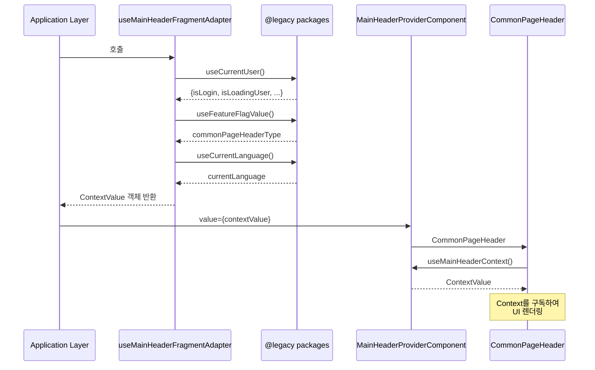

# Micro Frontends Fragment Layer 패턴: 의존성 역전으로 달성하는 점진적 마이그레이션

## 한눈에 보기

Fragment Layer 패턴은 Micro Frontends 아키텍처에서 새로운 컴포넌트가 레거시 시스템을 직접 의존하지 않고, 추상화된 인터페이스를 통해 소통하도록 설계하는 방식입니다. 이 패턴은 의존성의 방향을 역전시켜 독립적 배포, 테스트 격리, 점진적 마이그레이션을 가능하게 합니다. Context Provider를 통한 런타임 바인딩은 이 패턴의 핵심 구현 메커니즘입니다.

---

## 들어가며

대규모 프론트엔드 애플리케이션을 운영하다 보면 피할 수 없는 순간이 옵니다. 레거시 코드베이스 위에 새로운 기능을 추가해야 하는데, 기존 시스템을 한 번에 교체할 수는 없는 상황. Micro Frontends는 이런 상황에서 자주 언급되는 해법이지만, 단순히 코드를 여러 조각으로 나눈다고 해서 문제가 해결되지는 않습니다.

Fragment Layer 패턴은 이 지점에서 등장합니다. 새롭게 작성하는 Fragment가 레거시 시스템의 구체적인 구현을 직접 import하는 순간, 우리는 "독립적"이라고 부를 수 없는 의존 관계에 갇히게 됩니다. Fragment Layer 패턴은 이 의존성의 방향을 뒤집어, Fragment가 레거시를 모르는 상태에서도 레거시의 기능을 활용할 수 있게 만드는 설계 전략입니다.

이 글에서는 Fragment Layer 패턴이 해결하는 구체적인 문제들, 이 패턴이 작동하는 원리, 그리고 실제 구현에서 마주치는 트레이드오프를 탐구합니다.

---

## Fragment가 레거시를 직접 import할 때 발생하는 일

Fragment Layer 패턴을 이해하려면, 먼저 이 패턴이 없을 때 어떤 문제가 발생하는지 살펴볼 필요가 있습니다.

새로운 Fragment 컴포넌트가 레거시 시스템의 인증 모듈, 상태 관리 스토어, 유틸리티 함수를 직접 import한다고 가정해 봅시다. 코드 레벨에서는 단순해 보입니다. 필요한 것을 가져다 쓰면 되니까요. 하지만 이 단순함은 시간이 지나면서 복잡성으로 변모합니다.

**컴파일 타임 의존성의 고착화**가 첫 번째 문제입니다. Fragment의 import 구문은 컴파일 시점에 레거시 모듈의 존재와 구조를 전제합니다. 레거시의 API가 변경되면 Fragment도 함께 수정해야 합니다. 이것이 바로 "샷건 수술(Shotgun Surgery)" 안티패턴입니다. 하나의 변경이 여러 곳의 수정을 강제하는 상황.

**테스트 격리의 불가능**이 두 번째 문제입니다. Fragment를 단위 테스트하려면 레거시 모듈 전체를 목킹해야 합니다. 레거시가 복잡할수록 목킹도 복잡해지고, 결국 테스트는 유지보수 부담이 됩니다. Storybook에서 컴포넌트를 독립적으로 확인하는 것도 어려워집니다.

**순환 의존성과 빌드 복잡성**이 세 번째입니다. Fragment와 레거시가 서로를 참조하기 시작하면, 빌드 시스템은 복잡한 의존성 그래프를 해결해야 합니다. Turborepo나 Nx 같은 모노레포 도구의 캐시 적중률이 급격히 떨어집니다. 실제로 직접 의존 구조에서는 30% 수준이던 캐시 적중률이, 의존성을 역전시킨 후 80% 이상으로 향상되는 사례가 보고됩니다.

**독립적 배포의 불가능**이 마지막입니다. Fragment가 레거시의 특정 버전에 묶여 있으면, Fragment만 따로 배포할 수 없습니다. Micro Frontends의 핵심 가치인 "독립적 배포"가 무색해집니다.

```mermaid
graph TB
    subgraph "❌ Fragment가 직접 import"
        F1[CommonPageHeader<br/>Fragment]
        L1[@legacy/user]
        L2[@legacy/featureFlags]
        L3[@legacy/i18n]
        L4[@legacy/analytics]
        F1 -.직접 의존.-> L1
        F1 -.직접 의존.-> L2
        F1 -.직접 의존.-> L3
        F1 -.직접 의존.-> L4
        style F1 fill:#ffcccc
    end

    subgraph "✅ Context Provider 패턴"
        A[Application Layer]
        AD[useMainHeaderFragmentAdapter]
        F2[CommonPageHeader<br/>Fragment]
        CTX[MainHeaderContext]

        A --> AD
        AD -.수집.-> L1
        AD -.수집.-> L2
        AD -.수집.-> L3
        AD -.수집.-> L4
        AD -->|의존성 주입| CTX
        CTX -->|Context 구독| F2
        style F2 fill:#ccffcc
        style CTX fill:#e6f3ff
    end
```

---

## 의존성 역전: Fragment Layer 패턴의 핵심 원리

Fragment Layer 패턴은 이 문제들을 의존성의 방향을 바꾸는 것으로 해결합니다. Fragment가 레거시를 import하는 대신, Fragment는 추상화된 인터페이스에만 의존하고, 레거시 시스템이 이 인터페이스의 구현체를 제공하는 구조입니다.

이 아이디어는 사실 새로운 것이 아닙니다. 1988년 Ralph E. Johnson은 "Designing Reusable Classes"에서 프레임워크와 애플리케이션 코드 사이의 제어 흐름을 논했습니다. Hollywood Principle이라 불리는 "Don't call us, we'll call you" 원칙이 여기서 비롯되었습니다. 2004년 Martin Fowler는 이를 정리하여 Dependency Injection 패턴으로 분류했고, Robert C. Martin의 Dependency Inversion Principle(DIP)은 "상위 모듈이 하위 모듈에 의존하지 않고, 둘 다 추상화에 의존해야 한다"는 원칙을 명확히 했습니다.

Fragment Layer 패턴에서 이 원칙은 다음과 같이 구체화됩니다:

```
기존: Fragment → Legacy (직접 의존)
변경: Fragment → Interface ← Legacy Adapter (의존성 역전)
```

Fragment는 Interface만 알고, Legacy는 이 Interface를 구현하는 Adapter를 제공합니다. 의존성의 화살표가 모두 Interface(추상화)를 향합니다. Fragment와 Legacy 사이에 직접적인 연결이 없어집니다.

```mermaid
graph LR
    subgraph "Fragment Layer<br/>(의존성 없음)"
        F[CommonPageHeader]
        FC[MainHeaderContext]
        FT[types.ts]
    end

    subgraph "Application Layer<br/>(의존성 수집)"
        AL[MainPageLayout]
        AH[useMainHeaderFragmentAdapter]
    end

    subgraph "Legacy Layer"
        L1[@legacy/user]
        L2[@legacy/featureFlags]
        L3[@legacy/i18n]
        L4[...10+ packages]
    end

    FT -.타입 정의.-> FC
    FC -.Context 제공.-> F

    AH -->|import| L1
    AH -->|import| L2
    AH -->|import| L3
    AH -->|import| L4
    AH -->|ContextValue 생성| AL
    AL -->|Provider로 주입| FC

    style F fill:#90EE90
    style FC fill:#87CEEB
    style FT fill:#87CEEB
    style AH fill:#FFB6C1
    style AL fill:#FFB6C1
```

이 구조가 가져오는 변화는 극적입니다. Fragment의 빌드 단위는 이제 구체적인 레거시 패키지가 아닌 인터페이스 패키지에만 의존합니다. 레거시가 변경되어도 인터페이스가 유지되는 한 Fragment는 영향을 받지 않습니다. 번들러의 tree-shaking 효율도 향상됩니다. 패키지 경계가 명확해지면서 Fragment별 독립 번들링이 가능해지기 때문입니다.

---

## Context Provider: 런타임 바인딩의 구현 메커니즘

의존성 역전 원칙을 React 애플리케이션에서 구현하는 가장 자연스러운 방법이 Context Provider입니다. Context Provider는 컴포넌트 트리의 상위에서 값을 주입하고, 하위 컴포넌트가 이를 소비하는 구조를 제공합니다. 이것이 바로 런타임 바인딩입니다.

Fragment Layer 패턴에서 Context Provider의 역할은 레거시 시스템의 구체적인 구현체를 Fragment에 전달하는 것입니다. Fragment는 useContext를 통해 인터페이스에 정의된 기능을 호출하지만, 실제로 어떤 구현체가 동작하는지는 알지 못합니다.



이 런타임 바인딩이 가져오는 유연성은 상당합니다. 프로덕션 환경에서는 실제 레거시 Adapter를 주입합니다. 테스트 환경에서는 목(mock) 구현체를 주입합니다. Storybook에서는 스텁(stub) 데이터를 반환하는 단순한 구현체를 주입합니다. Fragment 코드는 전혀 변경 없이, 주입되는 구현체만 바꾸면 됩니다.

이것은 마치 Strangler Fig Pattern의 프론트엔드 버전과 같습니다. Strangler Fig Pattern은 레거시 시스템을 점진적으로 교체하는 전략으로, 새로운 시스템이 레거시를 감싸면서 점차 기능을 대체해 나갑니다. Fragment Layer 패턴에서 Context Provider는 이 "감싸기"의 역할을 합니다. 레거시 기능을 Interface로 감싸고, 시간이 지나면서 Interface의 구현체를 하나씩 새로운 코드로 교체할 수 있습니다.

---

## 데이터 흐름 설계: 단방향 원칙과 Slot 패턴

Fragment Layer 패턴을 설계할 때 데이터가 어떻게 흘러야 하는지는 중요한 고려사항입니다. Flux와 Redux가 대중화한 단방향 데이터 흐름(Unidirectional Data Flow) 원칙이 여기서도 적용됩니다.

핵심은 간단합니다. 데이터는 위에서 아래로 흐르고, 이벤트(액션)는 아래에서 위로 전파됩니다. Single Source of Truth를 유지하고, State는 직접 변경하지 않습니다. Fragment Layer 패턴에서 이는 Application Layer가 데이터를 소유하고, Fragment는 이 데이터를 렌더링하며, 사용자 인터랙션은 이벤트로 상위에 전달되는 구조로 나타납니다.

Slot 패턴은 이 데이터 흐름을 더욱 유연하게 만듭니다. Web Components의 `<slot>` 요소에서 시작된 이 패턴은 Vue.js의 Named Slots, Scoped Slots를 거쳐 React의 children과 Render Props로 발전했습니다. Fragment Layer 패턴에서 Slot은 Fragment가 UI의 틀(layout)을 제공하고, Application Layer가 구체적인 내용을 주입하는 방식으로 활용됩니다.

```typescript
// Fragment에서 Slot 사용 패턴
// packages/fragments/main-header/src/ui/headers/CommonPageHeaderDefault.tsx

export const CommonPageHeaderDefault = () => {
  const { slots } = useMainHeaderContext();
  const currentSlots = slots.default; // 타입에 따라 slots.typeA, slots.typeB 선택

  return (
    <header>
      <div className="left-section">
        {currentSlots.leftItemsSlot} {/* Application이 주입한 UI */}
      </div>
      <div className="right-section">
        {currentSlots.rightItemsSlot}
      </div>
      {currentSlots.asideMenuSlot}
    </header>
  );
};

// Application Layer에서 Slot 주입
// packages/miricanvas-legacy/.../useMainHeaderFragmentAdapter.tsx

export const useMainHeaderFragmentAdapter = () => {
  return useMemo(() => ({
    slots: {
      default: {
        leftItemsSlot: (
          <GNBButtonsDefault
            gnbButtonContents={GNB_BUTTON_CONTENTS_DEFAULT}
          />
        ),
        rightItemsSlot: <RightItemsDefault isLogin={isLogin} />,
        asideMenuSlot: (
          <AsideMenuModal>
            <AsideMenuButtonsDefault />
          </AsideMenuModal>
        ),
      },
      typeA: {
        leftItemsSlot: <GNBButtonsTypeA />,
        rightItemsSlot: <RightItemsTypeA />,
        asideMenuSlot: <AsideMenuTypeA />,
      },
    },
  }), [isLogin]);
};
```

예를 들어, Fragment가 카드 레이아웃을 제공하고, Application Layer가 카드 내부에 들어갈 구체적인 컨텐츠를 Slot으로 전달합니다. Fragment는 레이아웃의 책임만 지고, 컨텐츠의 구체적인 내용은 알지 못합니다. 이것도 일종의 의존성 역전입니다. Fragment가 구체적인 컨텐츠 컴포넌트를 import하는 대신, 추상화된 Slot 인터페이스를 통해 컨텐츠를 받아들입니다.

---

## Context와 Props: 무엇을 어떻게 전달할 것인가

Fragment Layer 패턴을 구현할 때 실무적으로 마주치는 질문이 있습니다. 어떤 것을 Context로 전달하고, 어떤 것을 Props로 전달해야 할까요?

Props drilling은 명시적입니다. 데이터가 어디서 오는지 컴포넌트 시그니처만 봐도 알 수 있습니다. 하지만 Fragment의 인터페이스가 비대해지는 문제가 있습니다. 레거시 시스템의 다양한 기능을 모두 Props로 전달하면, Fragment의 Props 인터페이스는 레거시의 복잡성을 그대로 반영하게 됩니다.

Context는 암묵적입니다. 컴포넌트 시그니처를 깔끔하게 유지할 수 있지만, 데이터의 출처를 파악하기 어려워집니다. 또한 Context 값이 변경되면 해당 Context를 구독하는 모든 컴포넌트가 리렌더링됩니다.

실무에서는 하이브리드 접근이 권장됩니다. 핵심 비즈니스 데이터는 Props로 명시적으로 전달합니다. Fragment가 렌더링하는 주요 데이터는 Props 인터페이스에 드러나야 합니다. 반면 인프라성 의존성은 Context로 주입합니다. 인증 상태 확인, API 클라이언트, 라우팅 유틸리티 같은 것들입니다. 이것들은 Fragment의 핵심 관심사가 아니라 동작을 위한 인프라입니다.

| 전달 방식 | Props | Context |
|----------|-------|---------|
| **명시성** | 높음 (시그니처에 드러남) | 낮음 (암묵적) |
| **인터페이스 크기** | 커질 수 있음 | 깔끔하게 유지 |
| **리렌더링** | Props 변경 시만 | Context 전체 구독자 |
| **적합한 데이터** | 핵심 비즈니스 데이터 | 인프라 의존성 |
| **테스트** | 직접 값 전달 | Provider 목킹 |

이 구분은 Fragment의 테스트 용이성에도 영향을 미칩니다. Props로 전달되는 핵심 데이터는 테스트에서 직접 값을 전달하면 됩니다. Context로 주입되는 인프라는 테스트용 Provider로 한 번에 목킹할 수 있습니다.

---

## 트레이드오프

Fragment Layer 패턴이 모든 상황에서 최선의 선택인 것은 아닙니다. 이 패턴을 도입할 때 고려해야 할 트레이드오프가 있습니다.

**복잡성의 증가**: 직접 import하는 것에 비해 인터페이스 정의, Context Provider 구성, Adapter 구현 등 추가적인 코드가 필요합니다. 작은 규모의 프로젝트에서는 이 오버헤드가 얻는 이점보다 클 수 있습니다.

**추상화 누수의 위험**: 인터페이스 설계가 잘못되면 레거시의 구체적인 특성이 인터페이스에 노출됩니다. 이 경우 의존성 역전의 이점이 반감됩니다. 인터페이스는 Fragment의 필요에 맞게 설계되어야지, 레거시의 구조를 그대로 반영해서는 안 됩니다.

**런타임 오버헤드**: Context를 통한 값 전달은 Props에 비해 약간의 런타임 오버헤드가 있습니다. 대부분의 경우 무시할 수 있는 수준이지만, 성능에 민감한 상황에서는 고려해야 합니다.

**학습 곡선**: 팀원들이 의존성 역전, Context Provider 패턴에 익숙하지 않다면 초기 학습 비용이 발생합니다.

반면, 이 패턴이 빛을 발하는 상황도 명확합니다. 레거시 시스템 위에 새로운 기능을 점진적으로 추가해야 할 때, 독립적인 배포 파이프라인이 필요할 때, 테스트 격리가 중요할 때, 빌드 성능 최적화가 필요할 때. 이런 상황에서 Fragment Layer 패턴의 초기 투자는 장기적으로 충분히 회수됩니다.

---

## 마무리하며

Fragment Layer 패턴은 Micro Frontends 아키텍처에서 "어떻게 새로운 코드가 레거시와 공존할 수 있는가"라는 질문에 대한 구조적 답변입니다. 핵심은 의존성의 방향입니다. Fragment가 레거시를 향하는 대신, 둘 다 추상화된 인터페이스를 향하게 만드는 것.

이 방향 전환은 단순한 코드 구조의 변경이 아닙니다. 배포 독립성, 테스트 용이성, 빌드 효율성, 점진적 마이그레이션 가능성으로 이어지는 연쇄 효과를 가져옵니다. 1988년 Hollywood Principle에서 시작된 아이디어가 2020년대 프론트엔드 아키텍처에서 여전히 유효한 이유입니다.

결국 중요한 것은 "무엇이 무엇을 아는가"입니다. Fragment가 레거시의 구체적인 구현을 알면, Fragment는 레거시에 종속됩니다. Fragment가 인터페이스만 알고 레거시가 이 인터페이스를 구현하면, 둘은 독립적으로 진화할 수 있습니다. Fragment Layer 패턴은 이 "앎의 방향"을 설계하는 기술입니다.

---

## 더 읽어볼 자료

- [Martin Fowler, "Inversion of Control Containers and the Dependency Injection pattern" (2004)](https://martinfowler.com/articles/injection.html)
- Robert C. Martin, "The Dependency Inversion Principle" - Clean Architecture
- [Michael Geers, "Micro Frontends in Action"](https://micro-frontends.org/) - Manning Publications
- Sam Newman, "Building Microservices" - Strangler Fig Pattern
- [React 공식 문서 - Context API](https://react.dev/reference/react/useContext)
- [Redux 스타일 가이드 - Unidirectional Data Flow](https://redux.js.org/style-guide/)
