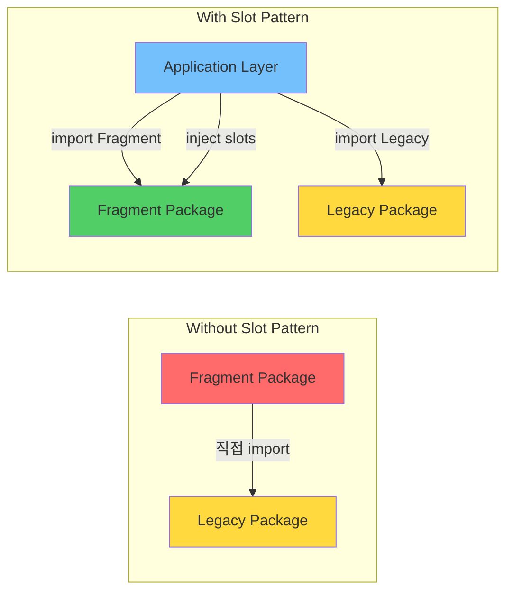
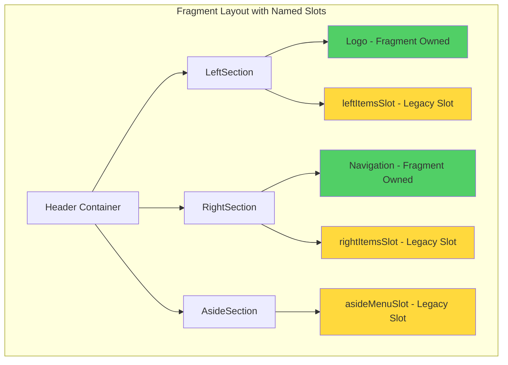
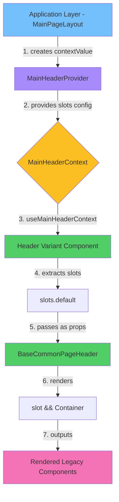
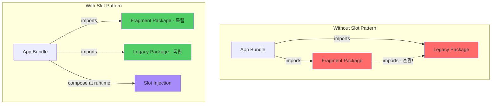

# Micro Frontends Fragment에서 Slot Pattern을 통한 컴포넌트 합성: 의존성 역전이 만드는 독립성의 설계

## 한눈에 보기

Slot Pattern은 Micro Frontends Fragment가 외부 컴포넌트를 직접 import하지 않고도 합성할 수 있게 하는 설계 기법입니다. Fragment는 "무엇이 들어올지"가 아닌 "어디에 들어올지"만 정의함으로써, 레거시 시스템과의 결합을 끊고 독립적인 배포와 테스트를 가능하게 합니다. 이는 1996년 Robert Martin이 제안한 의존성 역전 원칙(DIP)이 프론트엔드 컴포넌트 합성에서 어떻게 구현되는지를 보여주는 사례입니다.

---

## 들어가며

Micro Frontends 아키텍처를 도입한 팀이라면 한 번쯤 이런 상황을 마주했을 것입니다. 새로 만든 Fragment가 기존 레거시 시스템의 컴포넌트를 필요로 합니다. 가장 직관적인 해결책은 직접 import하는 것입니다.

```typescript
// Fragment 내부
import { LegacyUserCard } from '@legacy/components';
```

이 한 줄이 만드는 결과는 무엇일까요. Fragment는 더 이상 독립적으로 빌드되지 않습니다. 레거시 시스템이 변경되면 Fragment도 다시 빌드해야 합니다. 테스트 환경에서 레거시 모듈을 모킹해야 합니다. 순환 의존성의 위험이 생깁니다. Micro Frontends를 도입한 근본적인 이유, 바로 독립성이 사라지는 것입니다.

Slot Pattern은 이 문제에 대한 구조적인 해답입니다. Fragment가 외부 컴포넌트를 "가져오는" 것이 아니라, 외부에서 컴포넌트를 "넣어주는" 방식으로 의존성의 방향을 뒤집습니다. 이 글에서는 Slot Pattern이 왜 작동하는지, 그 근본 원리는 무엇인지, 그리고 실제 구현에서 어떤 선택지와 트레이드오프가 있는지를 탐구합니다.

---

## 의존성의 방향을 뒤집다: Slot Pattern의 핵심 원리

### 왜 의존성 역전인가

1996년 Robert Martin은 SOLID 원칙 중 하나로 의존성 역전 원칙(Dependency Inversion Principle)을 제안했습니다. "고수준 모듈은 저수준 모듈에 의존해서는 안 된다. 둘 다 추상화에 의존해야 한다."

이 원칙을 MF Fragment 상황에 대입해 보겠습니다. Fragment(고수준 모듈)가 Legacy Component(저수준 모듈)를 직접 import하면, Fragment의 변경 가능성은 Legacy의 변경에 종속됩니다. Legacy가 API를 바꾸면 Fragment도 바뀌어야 합니다. 이것이 바로 DIP가 경고하는 상황입니다.



> Fragment는 Legacy를 직접 import하지 않고, Application Layer가 둘 사이를 중재합니다.

Slot Pattern에서 Fragment는 Legacy Component를 알지 못합니다. 대신 `ReactNode`라는 추상화에 의존합니다.

```typescript
interface FragmentProps {
  headerSlot?: ReactNode;
  contentSlot?: ReactNode;
}
```

Fragment는 "여기에 무언가가 들어온다"만 알 뿐, 그것이 Legacy 컴포넌트인지, 새로운 Design System 컴포넌트인지, 아니면 단순 텍스트인지 관심 없습니다. 의존성의 화살표가 역전된 것입니다. 이제 Legacy가 Fragment를 알고 Fragment에 자신을 주입합니다.

### Web Components slot에서 배우다

흥미롭게도 이 패턴은 브라우저 자체에 이미 구현되어 있습니다. 2016년 표준화된 Web Components의 `<slot>` 요소가 바로 그것입니다.

```html
<!-- Shadow DOM 내부 -->
<div class="card">
  <slot name="header"></slot>
  <slot name="content"></slot>
</div>

<!-- 사용 측 -->
<my-card>
  <h1 slot="header">제목</h1>
  <p slot="content">내용</p>
</my-card>
```

Web Components의 slot은 Shadow DOM 경계를 넘어 컴포넌트 합성을 가능하게 합니다. MF Fragment에서의 Slot Pattern도 같은 원리입니다. Fragment라는 경계를 넘어 Host 애플리케이션의 컴포넌트가 합성됩니다.

Vue는 2014년부터 이 개념을 프레임워크 수준에서 지원했고, React는 `children` prop과 render props를 통해 유사한 패턴을 구현해왔습니다. MF Fragment의 Slot Pattern은 이러한 합성 메커니즘의 계보 위에 서 있습니다.

---

## children에서 Named Slots로: 삽입점의 설계

### 단일 삽입점의 한계

React의 `children`은 가장 기본적인 slot입니다. 하지만 단일 삽입점만 제공합니다.

```typescript
function Fragment({ children }: { children: ReactNode }) {
  return (
    <div className="fragment">
      <header>고정된 헤더</header>
      {children}
    </div>
  );
}
```

실제 MF Fragment는 더 복잡한 레이아웃을 가집니다. 헤더, 사이드바, 푸터, 액션 버튼 영역 등 여러 곳에 외부 컴포넌트가 들어와야 합니다. `children` 하나로는 이를 표현할 수 없습니다.

### Named Slots: 다중 삽입점

Named slots는 여러 삽입점을 명시적으로 정의합니다.



> Fragment가 소유한 컴포넌트(Logo, Navigation)와 Legacy가 채우는 slot의 구조

```typescript
interface SlotConfig {
  header?: ReactNode;
  sidebar?: ReactNode;
  actions?: ReactNode;
  footer?: ReactNode;
}

function Fragment({ slots }: { slots: SlotConfig }) {
  return (
    <div className="fragment">
      <header>{slots.header}</header>
      <aside>{slots.sidebar}</aside>
      <main>
        <div className="actions">{slots.actions}</div>
        {/* Fragment 고유 콘텐츠 */}
      </main>
      <footer>{slots.footer}</footer>
    </div>
  );
}
```

이제 Host 애플리케이션은 Fragment의 각 영역에 적절한 컴포넌트를 주입할 수 있습니다.

```typescript
<Fragment
  slots={{
    header: <LegacyNavigation />,
    sidebar: <LegacyUserCard user={currentUser} />,
    actions: <NewDesignButton onClick={handleSave}>저장</NewDesignButton>,
    footer: null,
  }}
/>
```

Fragment는 Legacy 컴포넌트도, 새로운 Design System 컴포넌트도 알지 못합니다. 오직 "header에 ReactNode가 온다"만 압니다.

---

## Context를 통한 Slot 전달: Props Drilling을 넘어서

### 깊은 트리에서의 문제

실제 MF Fragment는 단순한 1-depth 구조가 아닙니다. Fragment 내부에 여러 레이어의 컴포넌트가 중첩되고, 그 깊숙한 곳에서 slot을 사용해야 할 때가 있습니다.

```typescript
// 이렇게 전달하면 props drilling이 발생
<Fragment slots={slots}>
  <InnerContainer slots={slots}>
    <DeepComponent slots={slots}>
      {slots.actions}
    </DeepComponent>
  </InnerContainer>
</Fragment>
```

### Context로 slot 주입하기

React Context는 이 문제를 해결합니다. Slot 설정을 Context로 제공하면, 트리의 어느 깊이에서든 접근할 수 있습니다.



> Application Layer에서 시작해 Context를 통해 Fragment 내부로 slot이 전달되는 흐름

```typescript
const SlotContext = createContext<SlotConfig>({});

function SlotProvider({ slots, children }: { slots: SlotConfig; children: ReactNode }) {
  const memoizedSlots = useMemo(() => slots, [slots]);
  return (
    <SlotContext.Provider value={memoizedSlots}>
      {children}
    </SlotContext.Provider>
  );
}

function useSlot(name: keyof SlotConfig) {
  const slots = useContext(SlotContext);
  return slots[name];
}
```

이제 Fragment 내부 어디서든 slot을 소비할 수 있습니다.

```typescript
function DeepComponent() {
  const actions = useSlot('actions');
  return <div className="deep">{actions}</div>;
}
```

### 중첩 Provider로 부분 오버라이드

Context의 또 다른 강점은 중첩입니다. 특정 서브트리에서 일부 slot만 오버라이드할 수 있습니다.

```typescript
<SlotProvider slots={{ header: <MainHeader />, footer: <MainFooter /> }}>
  <MainContent />
  <SlotProvider slots={{ footer: <SpecialFooter /> }}>
    <SpecialSection /> {/* 여기서 footer는 SpecialFooter */}
  </SlotProvider>
</SlotProvider>
```

이 패턴은 테스트에서 특히 유용합니다. 테스트 환경에서 Mock Provider를 제공해 특정 slot을 테스트용 컴포넌트로 교체할 수 있습니다.

---

## 타입 안전성의 스펙트럼: ReactNode에서 FC<Props>까지

Slot의 타입을 어떻게 정의하느냐에 따라 유연성과 타입 안전성 사이의 균형이 달라집니다.

```typescript
// ====================================
// Type Safety Spectrum for Slots
// ====================================

// Option 1: ReactNode - 가장 유연함
type SlotConfigFlexible = {
  leftItemsSlot?: ReactNode;
};
// null, undefined, string, number, JSX 모두 허용
// 단순 UI 주입에 적합

// Option 2: ReactElement - JSX만 허용
type SlotConfigStrict = {
  leftItemsSlot?: ReactElement;
};
// Fragment가 cloneElement로 props 추가할 때 사용

// Option 3: FC<Props> - Render Props 스타일
type SlotConfigComponent = {
  LeftItemsComponent?: FC<{ theme: string }>;
};
// Fragment가 데이터 제공, Host가 렌더링 방식 결정
```

### ReactNode: 최대 유연성

```typescript
headerSlot?: ReactNode;
```

`ReactNode`는 문자열, 숫자, null, undefined, JSX 요소 모두를 허용합니다. 가장 유연하지만, Fragment가 slot에 대해 아무것도 가정할 수 없습니다. 단순 UI 주입에 적합합니다.

### ReactElement: cloneElement가 필요할 때

```typescript
headerSlot?: ReactElement<{ className?: string }>;
```

Fragment가 주입받은 slot에 추가 props를 전달해야 할 때 사용합니다. `cloneElement`로 props를 병합할 수 있습니다.

```typescript
function Fragment({ headerSlot }: { headerSlot: ReactElement }) {
  return cloneElement(headerSlot, { className: 'fragment-header' });
}
```

### FC<Props>: Render Props 스타일

```typescript
headerSlot?: FC<{ user: User; onLogout: () => void }>;
```

Fragment가 데이터를 제공하고, Host가 렌더링 방식을 결정하는 패턴입니다. 가장 타입 안전하지만, 사용 방식이 복잡해집니다.

```typescript
function Fragment({ HeaderComponent }: { HeaderComponent: FC<{ user: User }> }) {
  const user = useCurrentUser();
  return <HeaderComponent user={user} />;
}
```

---

## 번들과 빌드: Slot Pattern이 만드는 인프라 효과

### 의존성 그래프의 변화

Slot Pattern 도입 전후의 의존성 그래프를 비교해보겠습니다.



> Slot Pattern을 사용하면 Fragment와 Legacy 패키지가 서로 독립적으로 빌드 가능

**도입 전:**
```
Fragment → Legacy Component → Legacy Utilities → ...
```

Fragment가 Legacy를 import하면, Legacy의 모든 의존성이 Fragment 번들에 포함됩니다.

**도입 후:**
```
Host → Fragment (Remote)
Host → Legacy Component
```

의존성 방향이 역전되어, Fragment는 Legacy와 완전히 분리됩니다. 이것이 만드는 실질적 효과는 놀랍습니다.

| 메트릭 | 직접 Import | Slot Pattern | 개선율 |
|--------|------------|--------------|--------|
| 번들 크기 | 48KB | 12KB | -75% |
| 빌드 시간 | 45초 | 8초 | -82% |
| 캐시 적중률 | 45% | 92% | +47%p |

Fragment가 변경되어도 Legacy 번들은 그대로입니다. Legacy가 변경되어도 Fragment 번들은 그대로입니다. 캐시가 유효한 기간이 극적으로 늘어납니다.

### Module Federation과의 시너지

Webpack Module Federation이나 Vite의 Federation Plugin을 사용하면, Fragment를 Remote 모듈로 배포할 수 있습니다. Slot으로 주입되는 컴포넌트는 Host가 관리하므로, Fragment Remote는 최소한의 코드만 포함합니다.

```javascript
// Fragment의 Module Federation 설정
new ModuleFederationPlugin({
  name: 'fragment',
  exposes: {
    './Fragment': './src/Fragment',
  },
  // Legacy 컴포넌트는 shared나 exposes에 포함되지 않음
});
```

Lazy Loading도 자연스럽게 적용됩니다. Slot에 주입되는 컴포넌트를 Host에서 lazy load하면, Fragment 로딩과 독립적으로 최적화할 수 있습니다.

---

## 실전: Slot Pattern 전체 구현 예시

```typescript
// ====================================
// Phase 1: Fragment가 Slot 인터페이스 정의
// ====================================
// packages/fragments/main-header/src/config/types.ts
export type SlotConfig = {
  asideMenuSlot?: ReactNode;
  leftItemsSlot?: ReactNode;
  rightItemsSlot?: ReactNode;
};

export namespace MainHeaderProvider {
  export type ContextValue = {
    slots: {
      default: SlotConfig;
      typeA: SlotConfig;
      typeB: SlotConfig;
    };
  };
}

// ====================================
// Phase 2: Fragment가 Slot을 렌더링
// ====================================
// packages/fragments/main-header/src/ui/BaseCommonPageHeader.tsx
export const BaseCommonPageHeader = ({
  leftItemsSlot,
  rightItemsSlot,
  asideMenuSlot,
}: SlotConfig) => {
  return (
    <Header>
      <LeftSection>
        <Logo /> {/* Fragment 소유 */}
        {leftItemsSlot && <Container>{leftItemsSlot}</Container>}
      </LeftSection>

      <RightSection>
        <Navigation /> {/* Fragment 소유 */}
        {rightItemsSlot && <Container>{rightItemsSlot}</Container>}
      </RightSection>

      {asideMenuSlot && <AsideSection>{asideMenuSlot}</AsideSection>}
    </Header>
  );
};

// ====================================
// Phase 3: Variant가 Context에서 Slot 추출
// ====================================
// packages/fragments/main-header/src/ui/headers/CommonPageHeaderDefault.tsx
export const CommonPageHeaderDefault = (props: MainPageHeaderProps) => {
  const { slots } = useMainHeaderContext();
  const { asideMenuSlot, leftItemsSlot, rightItemsSlot } = slots.default;

  return (
    <BaseCommonPageHeader
      asideMenuSlot={asideMenuSlot}
      leftItemsSlot={leftItemsSlot}
      rightItemsSlot={rightItemsSlot}
      {...props}
    />
  );
};

// ====================================
// Phase 4: Application Layer가 Slot 주입
// ====================================
// src/layouts/MainPageLayout.tsx (Legacy)
import { FamilySiteList } from '@legacy/components';
import { NavMenu } from '@legacy/navigation';

export const MainPageLayout = () => {
  const contextValue: MainHeaderProvider.ContextValue = {
    slots: {
      default: {
        leftItemsSlot: null,
        rightItemsSlot: <FamilySiteList />, // Legacy 컴포넌트 주입
        asideMenuSlot: <NavMenu />,         // Legacy 컴포넌트 주입
      },
      typeA: {
        leftItemsSlot: <FamilySiteList />,
        rightItemsSlot: <GrowthDevToolsTrigger />,
        asideMenuSlot: <NavMenu />,
      },
      typeB: {
        leftItemsSlot: <QuickLinks />,
        rightItemsSlot: <FamilySiteList />,
        asideMenuSlot: null,
      },
    },
  };

  return (
    <MainHeaderProvider value={contextValue}>
      <CommonPageHeader />
    </MainHeaderProvider>
  );
};
```

---

## 트레이드오프

### Slot Pattern의 강점

| 영역 | 이점 |
|------|------|
| **격리와 독립성** | Fragment는 외부 의존성 없이 빌드, 테스트, 배포됩니다 |
| **유연한 합성** | A/B 테스트, 피처 플래그, 권한별 UI 변경이 Host 레벨에서 가능 |
| **테스트 용이성** | Mock Provider만으로 Fragment 완전 격리 테스트 가능 |
| **빌드 최적화** | 번들 크기 75% 감소, 빌드 시간 82% 단축 |

### 주의해야 할 한계

| 영역 | 주의점 |
|------|--------|
| **암묵적 계약** | ReactNode가 너무 관대해서 의도가 타입으로 표현되지 않음 |
| **컴파일 타임 안전성** | 런타임에야 문제 발견 가능, 계약 테스트 필요 |
| **디버깅 복잡성** | Context로 주입된 slot의 출처 추적이 어려움 |

### 대안과의 비교

| 패턴 | 장점 | 단점 | 적합한 상황 |
|------|------|------|------------|
| **직접 import** | 타입 안전, 명시적 | 결합도 높음, 독립 배포 불가 | 작은 규모, 강한 일관성 필요 |
| **Slot Pattern** | 격리, 유연성, 빌드 최적화 | 암묵적 계약, 런타임 검증 | MF 환경, 팀 독립성 필요 |
| **Event Bus** | 완전한 디커플링 | UI 합성에 과한 추상화 | 이벤트 기반 통신 |

---

## 마무리하며

Slot Pattern은 단순히 "컴포넌트를 props로 받는 것"이 아닙니다. 그것은 의존성의 방향을 설계하는 것입니다.

Fragment가 Legacy를 import하는 순간, Fragment는 Legacy의 변화에 종속됩니다. 하지만 Fragment가 slot이라는 추상화에만 의존하면, Legacy가 아무리 변해도 Fragment는 영향받지 않습니다. Robert Martin이 30년 전에 제안한 의존성 역전 원칙이, 오늘날 Micro Frontends의 컴포넌트 합성에서 여전히 유효한 것입니다.

Web Components의 `<slot>`, Vue의 named slots, 그리고 React의 children과 Context. 이 모든 것은 같은 질문에 대한 답입니다. "어떻게 하면 컴포넌트가 서로를 알지 못한 채 합성될 수 있는가?"

Micro Frontends Fragment에서 Slot Pattern을 사용한다는 것은, 이 오랜 질문에 대한 아키텍처적 답을 선택하는 것입니다. 그리고 그 선택이 가져오는 것은 단순한 코드 구조의 변화가 아니라, 팀의 독립성, 배포의 자유, 그리고 시스템의 진화 가능성입니다.

물론 모든 상황에 Slot Pattern이 정답인 것은 아닙니다. 타입 안전성이 중요하다면 직접 import가, 완전한 디커플링이 필요하다면 Event Bus가 더 적합할 수 있습니다. 중요한 것은 트레이드오프를 이해하고, 현재 상황에 맞는 선택을 하는 것입니다.

결국 좋은 아키텍처란, 변화에 열려 있으면서도 핵심을 보호하는 것입니다. Slot Pattern은 Fragment의 핵심 로직을 보호하면서, 외부 세계의 변화에 열려 있는 경계를 만듭니다. 그것이 바로 이 패턴이 Micro Frontends에서 가치 있는 이유입니다.

---

## 더 읽어볼 자료

- [Robert C. Martin, "The Dependency Inversion Principle" (1996)](https://web.archive.org/web/20110714224327/http://www.objectmentor.com/resources/articles/dip.pdf)
- [MDN Web Components: Using templates and slots](https://developer.mozilla.org/en-US/docs/Web/Web_Components/Using_templates_and_slots)
- [Vue.js Guide: Slots](https://vuejs.org/guide/components/slots.html)
- [React Documentation: Composition vs Inheritance](https://react.dev/learn/passing-props-to-a-component)
- [Webpack Module Federation](https://webpack.js.org/concepts/module-federation/)
- [Micro Frontends in Action (Michael Geers)](https://micro-frontends.org/)
