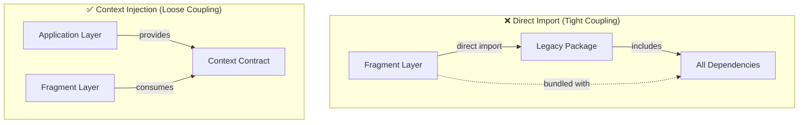
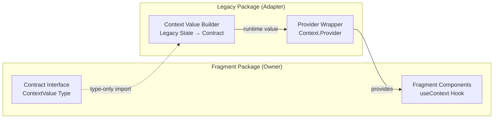
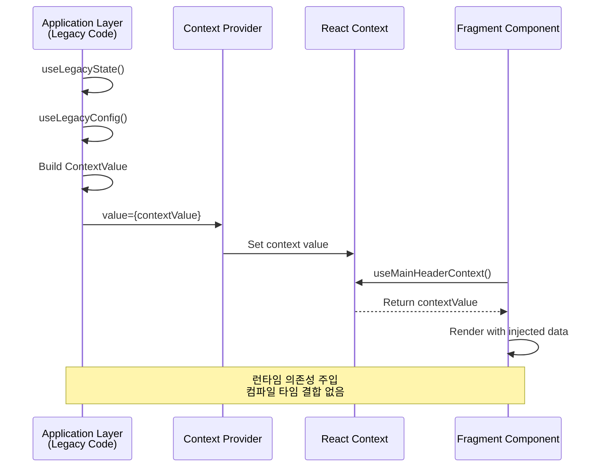

# Micro Frontends에서 Context/Provider를 활용한 의존성 주입 패턴: 결합도를 낮추는 아키텍처 설계

## 한눈에 보기

Micro Frontends 아키텍처에서 Fragment가 Legacy 시스템이나 다른 모듈을 직접 import하면 번들 크기 폭발, 독립 배포 불가, 순환 의존성이라는 심각한 문제가 발생합니다. React의 Context/Provider 패턴은 이 문제를 해결하는 의존성 주입(DI) 메커니즘으로, 컴파일 타임 의존성을 런타임 의존성으로 전환하여 각 Fragment의 자율성을 보장합니다.

---

## 들어가며

Micro Frontends를 도입하는 이유는 명확합니다. 거대한 모놀리식 프론트엔드를 독립적으로 개발하고 배포할 수 있는 작은 단위로 분리하는 것입니다. 그러나 실제 구현 단계에서 많은 팀이 마주하는 질문이 있습니다. "Fragment에서 기존 Legacy 시스템의 기능을 어떻게 사용해야 하는가?"

가장 직관적인 답은 직접 import하는 것입니다.

```typescript
// Fragment 내부
import { legacyAuthService } from '@legacy/auth';
import { legacyAnalytics } from '@legacy/analytics';
```

이 코드는 동작합니다. 하지만 이 순간, Micro Frontends 아키텍처의 핵심 가치인 "독립성"이 무너집니다. Fragment는 더 이상 독립적으로 빌드되거나 배포될 수 없습니다. Legacy 코드의 모든 전이적 의존성이 Fragment 번들에 포함되고, Legacy가 변경될 때마다 Fragment도 재빌드되어야 합니다.

이 글에서는 React의 Context/Provider 패턴이 어떻게 이 문제를 해결하는지 탐구합니다. 단순히 "이렇게 구현하세요"를 넘어서, 왜 이 패턴이 Micro Frontends의 근본적인 결합도 문제를 해결하는지, 그 원리를 깊이 들여다봅니다.

---

## 직접 Import가 만드는 의존성의 덫

Fragment가 Legacy 모듈을 직접 import할 때 어떤 일이 발생하는지 구체적으로 살펴보겠습니다.

### 번들 크기의 폭발적 증가

ES Modules의 import 문은 정적으로 분석됩니다. 번들러는 import된 모듈뿐 아니라 그 모듈이 import하는 모든 것을 재귀적으로 포함합니다. Legacy 시스템이 수백 개의 유틸리티, 서드파티 라이브러리, 헬퍼 함수를 가지고 있다면, 그 전체가 Fragment 번들에 들어갑니다.

Tree-shaking이 이 문제를 해결해줄 것이라 기대할 수 있습니다. 하지만 Legacy 코드에는 종종 side effects가 존재합니다. 전역 변수 수정, 폴리필 로딩, 초기화 로직 등이 있으면 번들러는 해당 코드를 "사용되지 않음"으로 판단할 수 없습니다.

### 빌드 그래프의 복잡화

Turborepo 같은 모노레포 도구는 패키지 간 의존성 그래프를 분석하여 증분 빌드를 수행합니다. Fragment가 Legacy를 직접 의존하면, Legacy의 어떤 변경이든 Fragment의 캐시를 무효화합니다. 실제 사용하는 함수와 무관한 변경이어도 마찬가지입니다.

더 심각한 문제는 순환 의존성입니다. Fragment A가 Legacy를 import하고, Legacy가 공유 유틸리티를 import하며, 그 유틸리티가 다시 Fragment A의 타입을 참조하는 상황이 생길 수 있습니다. 이런 순환 구조에서는 빌드 순서를 결정하는 위상 정렬 자체가 실패합니다.

### 배포 자율성의 상실

Micro Frontends의 핵심 약속은 "팀 A가 팀 B의 배포를 기다리지 않아도 된다"입니다. 하지만 직접 import가 존재하면 이 약속이 깨집니다. Fragment는 반드시 호환되는 Legacy 버전과 함께 배포되어야 하고, 버전 불일치는 런타임 에러로 이어집니다.



> 직접 import는 빌드 시점에 모든 의존성을 끌어들이지만, Context 주입은 런타임에 필요한 값만 전달합니다.

---

## 의존성 역전: 문제 해결의 원리

이 문제를 해결하려면 먼저 "의존성"이 무엇인지 재정의해야 합니다.

### 컴파일 타임 vs 런타임 의존성

직접 import는 컴파일 타임 의존성을 만듭니다. 빌드 시점에 해당 모듈이 존재해야 하고, 번들러가 그 코드를 포함시킵니다. 반면, 런타임 의존성은 실행 시점에만 해당 기능이 제공되면 됩니다.

Context/Provider 패턴의 핵심 아이디어는 이 전환입니다. Fragment는 빌드 시점에 "이런 형태의 서비스가 필요하다"는 타입(인터페이스)만 알고, 실제 구현은 런타임에 Host Application으로부터 주입받습니다.

### Martin Fowler의 통찰

2004년 Martin Fowler가 정리한 Inversion of Control(IoC)과 Dependency Injection(DI) 개념은 이 상황을 정확히 설명합니다. 전통적인 코드에서 객체는 자신이 필요한 의존성을 직접 생성하거나 조회합니다. IoC에서는 이 제어권이 역전되어, 외부의 무언가가 의존성을 객체에게 전달합니다.

Hollywood Principle이라는 별명이 이를 잘 표현합니다. "Don't call us, we'll call you." Fragment는 Legacy를 직접 호출(import)하지 않습니다. 대신 Host Application이 필요한 서비스를 Fragment에게 전달합니다.

### 의존성 역전 원칙(DIP)과 인터페이스

SOLID 원칙 중 하나인 의존성 역전 원칙은 다음을 말합니다. "고수준 모듈은 저수준 모듈에 의존해서는 안 된다. 둘 다 추상화에 의존해야 한다."

Micro Frontends 맥락에서 Fragment는 고수준 모듈입니다. 비즈니스 로직을 구현하는 독립적인 기능 단위입니다. Legacy 시스템은 저수준 모듈입니다. 인프라스트럭처 수준의 서비스를 제공합니다.

Fragment가 Legacy를 직접 import하면 고수준이 저수준에 의존하는 것입니다. 대신 둘 사이에 인터페이스(추상화)를 두고, Fragment는 인터페이스에 의존하며, Legacy는 그 인터페이스의 구현을 제공하면 의존성의 방향이 역전됩니다.

---

## React Context: JavaScript 생태계의 DI 컨테이너

전통적인 백엔드 프레임워크들은 정교한 DI 컨테이너를 제공합니다. Spring의 ApplicationContext, Angular의 Injector가 대표적입니다. 이들은 데코레이터나 어노테이션을 통해 의존성을 선언하면 프레임워크가 자동으로 해결해줍니다.

React는 다른 철학을 가집니다. "마법"보다는 "명시성"을 선호합니다. 그래서 React의 DI 메커니즘인 Context API는 Angular의 자동 주입과 달리 개발자가 Provider를 명시적으로 배치해야 합니다.

### Context의 본질: 상태 관리가 아닌 의존성 관리

흔히 Context를 "전역 상태 관리 도구"로 오해합니다. 하지만 그 본질적인 역할은 "컴포넌트 트리 전체에 값을 전달하는 메커니즘"입니다. 이 값이 상태일 수도 있지만, 서비스 객체나 함수일 수도 있습니다.

실제로 React 생태계의 주요 라이브러리들은 Context를 DI 컨테이너로 활용합니다. Redux의 `<Provider store={store}>`, React Query의 `<QueryClientProvider client={queryClient}>`, React Router의 `<RouterProvider router={router}>` 모두 이 패턴입니다.

### 계약 우선 설계와 인터페이스 소유권

Context DI 패턴을 적용할 때 중요한 설계 결정이 있습니다. 인터페이스를 누가 소유할 것인가?

"공통 타입 패키지"에 인터페이스를 정의하는 접근은 매력적으로 보입니다. 하지만 이는 또 다른 결합점을 만듭니다. 더 나은 접근은 계약 우선(Contract-First) 설계입니다. Fragment가 자신이 필요로 하는 인터페이스를 정의하고, Host Application은 그 계약을 충족하는 구현을 제공합니다.



> Fragment가 계약(인터페이스)을 소유하고, Legacy가 그 계약을 구현합니다. 이것이 의존성 역전입니다.

```typescript
// Fragment가 정의하는 인터페이스 (Fragment 패키지에 위치)
export namespace MainHeaderProvider {
  export type ContextValue = {
    featureFlags: {
      commonPageHeaderType: 'DEFAULT' | 'TYPE_A' | 'TYPE_B';
    };
    user: {
      isLogin: boolean;
      isLoadingUser: boolean;
      isError: boolean;
    };
    navigation: {
      logoHref: string;
      headerHrefMap: Record<string, string>;
    };
    events: {
      sendHomepageHeaderEvent: (eventName: string, params?: Record<string, unknown>) => void;
    };
  };
}

// Fragment의 Context 정의
const MainHeaderContext = createContext<MainHeaderProvider.ContextValue | null>(null);

export const useMainHeaderContext = (): MainHeaderProvider.ContextValue => {
  const context = useContext(MainHeaderContext);
  if (!context) {
    throw new Error('useMainHeaderContext must be used within MainHeaderProvider');
  }
  return context;
};
```

이 구조에서 Fragment는 Legacy의 구체적인 구현을 전혀 알지 못합니다. 알아야 할 것은 인터페이스뿐입니다.

### 런타임 의존성 주입 흐름

Host Application(Legacy 코드)이 Fragment에 서비스를 주입하는 과정을 시퀀스로 살펴보면 다음과 같습니다.



```typescript
// Host Application (Legacy 영역)
export const MainPageLayout = () => {
  // Legacy 시스템에서 상태 읽기
  const { commonPageHeaderType, isLogin, sendEvent } = useLegacyState();
  const { featureFlags, navigationHrefs } = useLegacyConfig();

  // Fragment가 정의한 계약에 맞춰 값 구성
  const contextValue: MainHeaderProvider.ContextValue = {
    featureFlags: {
      commonPageHeaderType: featureFlags.commonPageHeaderType,
    },
    user: {
      isLogin,
      isLoadingUser: false,
      isError: false,
    },
    navigation: {
      logoHref: '/',
      headerHrefMap: navigationHrefs,
    },
    events: {
      sendHomepageHeaderEvent: sendEvent,
    },
  };

  return (
    <MainHeaderProviderComponent value={contextValue}>
      <CommonPageHeader />
    </MainHeaderProviderComponent>
  );
};
```

---

## 빌드 최적화: 타입만 import하는 이점

TypeScript의 타입 시스템은 이 패턴에서 중요한 역할을 합니다. `import type` 문법을 사용하면 런타임에는 완전히 사라지는, 순수하게 타입 검사만을 위한 import가 가능합니다.

```typescript
// 런타임 코드에 영향 없음 - 번들에 포함되지 않음
import type { MainHeaderProvider } from '@fragment/main-header';
```

타입 전용 패키지로 인터페이스를 분리하면 빌드 그래프가 극적으로 단순화됩니다. Fragment는 구현 패키지가 아닌 타입 패키지에만 의존합니다. 타입 패키지는 `.d.ts` 파일만 포함하므로 번들 크기에 영향을 주지 않습니다.

이 구조의 실질적인 이점은 캐시 효율성입니다. Legacy 시스템의 구현이 변경되어도, 인터페이스가 동일하면 Fragment의 빌드 캐시는 유효합니다. 실제 프로젝트에서 Turborepo 캐시 효율이 50-80% 향상되는 사례가 보고됩니다.

| 변경 사항 | 재빌드 범위 (직접 import) | 재빌드 범위 (Context DI) |
|-----------|--------------------------|-------------------------|
| Legacy 내부 구현 변경 | Fragment + Legacy | Legacy만 |
| Fragment UI 변경 | Fragment | Fragment |
| 인터페이스 변경 | 모두 | 모두 (Breaking Change) |

---

## 테스트 용이성: Mock의 자연스러운 주입

Context DI 패턴은 테스트를 근본적으로 쉽게 만듭니다.

직접 import를 사용하면 테스트에서 해당 모듈을 mock해야 합니다. Jest의 `jest.mock()`이나 테스트 더블을 사용하는데, 이는 모듈 시스템의 내부 동작을 조작하는 것입니다. 리팩토링으로 import 경로가 바뀌면 mock도 깨집니다.

Context를 사용하면 테스트에서 실제 사용 방식 그대로 mock을 주입합니다.

```typescript
describe('CommonPageHeader', () => {
  it('should render TypeA variant when feature flag is TYPE_A', () => {
    const mockContext: MainHeaderProvider.ContextValue = {
      featureFlags: { commonPageHeaderType: 'TYPE_A' },
      user: { isLogin: true, isLoadingUser: false, isError: false },
      navigation: { logoHref: '/', headerHrefMap: {} },
      events: { sendHomepageHeaderEvent: vi.fn() },
    };

    render(
      <MainHeaderProviderComponent value={mockContext}>
        <CommonPageHeader />
      </MainHeaderProviderComponent>
    );

    expect(screen.getByTestId('common-page-header-type-a')).toBeInTheDocument();
  });

  it('should call analytics when user clicks logo', async () => {
    const mockSendEvent = vi.fn();
    const mockContext: MainHeaderProvider.ContextValue = {
      featureFlags: { commonPageHeaderType: 'DEFAULT' },
      user: { isLogin: false, isLoadingUser: false, isError: false },
      navigation: { logoHref: '/', headerHrefMap: {} },
      events: { sendHomepageHeaderEvent: mockSendEvent },
    };

    render(
      <MainHeaderProviderComponent value={mockContext}>
        <CommonPageHeader />
      </MainHeaderProviderComponent>
    );

    await userEvent.click(screen.getByRole('link', { name: /logo/i }));
    expect(mockSendEvent).toHaveBeenCalledWith('logo_click', { variant: 'DEFAULT' });
  });
});
```

이 테스트는 구현 세부사항이 아닌 계약(인터페이스)에 의존합니다. 내부 리팩토링에 강건하고, 실제 런타임에서의 동작을 정확히 반영합니다.

---

## 트레이드오프

### 강점

**타입 안전성**: TypeScript와 완벽하게 통합됩니다. 인터페이스를 통해 컴파일 타임에 계약 위반을 감지할 수 있습니다.

**React 생태계 친화성**: 별도의 DI 프레임워크 없이 React의 기본 기능만으로 구현됩니다. 팀원들이 이미 익숙한 패턴입니다.

**계층적 오버라이드**: 컴포넌트 트리의 특정 부분에서 다른 구현을 제공할 수 있습니다. 테스트, A/B 테스트, 피처 플래그 구현에 유용합니다.

**명시적인 의존성 흐름**: Provider가 트리의 어디에 있는지 명확히 볼 수 있습니다. "마법"이 없어 디버깅이 쉽습니다.

### 한계

**Provider Hell**: 여러 서비스를 주입하면 Provider 중첩이 깊어집니다. 컴포넌트 합성 패턴으로 완화할 수 있지만 완전한 해결은 아닙니다.

**리렌더링 고려사항**: Context value가 변경되면 모든 Consumer가 리렌더링됩니다. 서비스 객체는 보통 불변이므로 큰 문제가 아니지만, 상태를 포함하면 주의가 필요합니다.

**런타임 에러 가능성**: Provider 없이 Context를 사용하면 런타임에 에러가 발생합니다. TypeScript의 null 체크와 적절한 에러 메시지로 완화해야 합니다.

### 대안과의 비교

| 패턴 | 장점 | 단점 | 적합한 상황 |
|------|------|------|------------|
| **Context DI** | 타입 안전, React 네이티브 | Provider Hell | 서비스 주입, 강한 계약 |
| **Props Drilling** | 가장 명시적 | 보일러플레이트 폭증 | 1-2단계 전달 |
| **Event Bus** | 완전한 디커플링 | 타입 안전성 낮음 | 느슨한 이벤트 통신 |
| **Module Federation** | 코드 공유 최적화 | 설정 복잡 | 빌드 수준 분리 |

Module Federation과 Context DI는 상호 보완적입니다. Federation으로 코드를 공유하되, Context로 의존성을 주입하는 조합이 효과적입니다.

---

## 마무리하며

Micro Frontends에서 Context/Provider 패턴을 활용한 의존성 주입은 단순한 코드 구조화 기법이 아닙니다. 이는 아키텍처 수준에서 결합도를 관리하는 전략입니다.

이 패턴의 핵심 통찰은 "의존성의 방향"에 있습니다. Fragment가 Legacy를 직접 알아야 할까요? 아니면 Fragment가 "이런 서비스가 필요하다"고 선언하고, Host가 그것을 제공해야 할까요? 후자를 선택하면 Fragment는 진정으로 독립적이 됩니다.

React Context는 이 아이디어를 구현하는 도구입니다. 화려한 기능이 아닌, 단순하고 명시적인 메커니즘입니다. 그 단순함이 오히려 강점입니다. 모든 팀원이 이해할 수 있고, 디버깅할 수 있으며, 테스트할 수 있습니다.

Martin Fowler가 20년 전에 정리한 IoC/DI 원칙은 여전히 유효합니다. 플랫폼이 바뀌고 프레임워크가 바뀌어도, "의존성을 직접 생성하지 말고 주입받아라"는 원칙은 결합도를 낮추는 보편적인 해법입니다. React Context는 이 원칙을 프론트엔드 세계에서 실현하는 현대적인 도구입니다.

---

## 더 읽어볼 자료

- [Martin Fowler, "Inversion of Control Containers and the Dependency Injection pattern" (2004)](https://martinfowler.com/articles/injection.html)
- [React 공식 문서 - Context API](https://react.dev/reference/react/createContext)
- [Micro Frontends 아키텍처 패턴](https://micro-frontends.org/)
- [Module Federation 문서 (Webpack 5)](https://webpack.js.org/concepts/module-federation/)
- [Kent C. Dodds, "How to use React Context effectively"](https://kentcdodds.com/blog/how-to-use-react-context-effectively)
