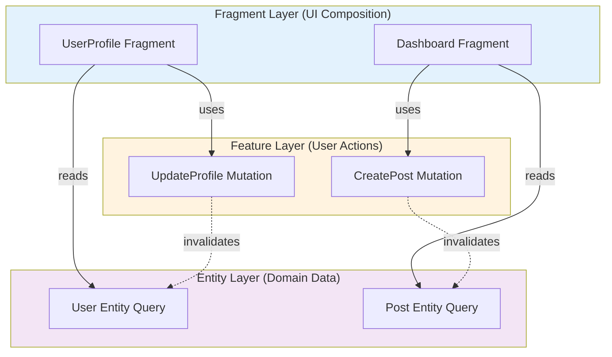
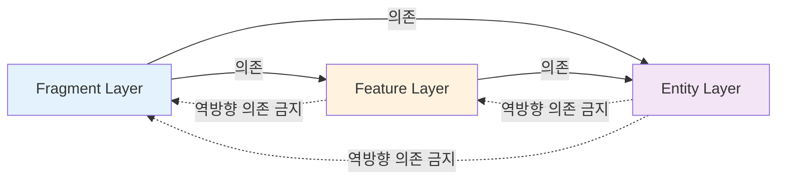
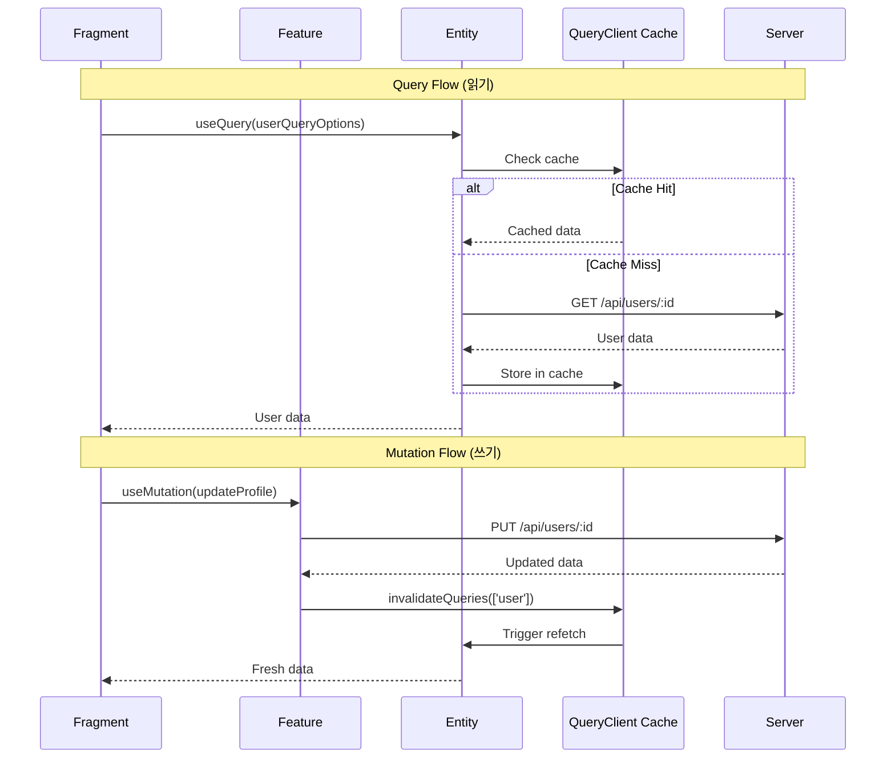
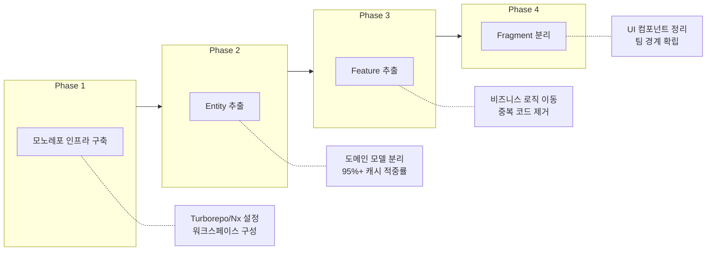

# Micro Frontends에서 Entity-Feature-Fragment 3계층 아키텍처: 복잡성을 다스리는 구조적 접근

## 한눈에 보기

Micro Frontends 환경에서 Entity-Feature-Fragment 3계층 아키텍처는 도메인 모델, 비즈니스 로직, UI 렌더링을 명확히 분리하여 팀 간 자율성과 시스템의 유지보수성을 동시에 확보합니다. 이 구조는 단방향 의존성을 강제함으로써 독립적인 빌드와 배포를 가능하게 하고, CQRS 패턴을 자연스럽게 수용하여 데이터 흐름의 예측 가능성을 높입니다.

---

## 들어가며

프론트엔드 애플리케이션의 규모가 커지면서 한 가지 근본적인 질문이 떠오릅니다. "여러 팀이 하나의 애플리케이션을 어떻게 함께 만들 수 있는가?" Micro Frontends는 이 질문에 대한 답으로 등장했습니다. 백엔드에서 마이크로서비스가 해결한 문제를 프론트엔드에서도 해결하려는 시도입니다.

그러나 Micro Frontends를 도입한다고 해서 모든 문제가 자동으로 해결되지는 않습니다. 오히려 새로운 질문이 생깁니다. "각 마이크로 프론트엔드 내부는 어떻게 구조화해야 하는가?" 그리고 "서로 다른 마이크로 프론트엔드 간에 공유되는 것들은 어떻게 관리해야 하는가?"

Entity-Feature-Fragment 3계층 아키텍처는 이러한 질문들에 대한 하나의 정교한 답입니다. 이 글에서는 이 아키텍처가 무엇인지, 왜 이런 구조가 필요한지, 그리고 실제로 어떻게 작동하는지를 탐구합니다.

---

## 세 개의 계층, 세 가지 책임

3계층 아키텍처의 핵심은 애플리케이션의 관심사를 세 가지 명확한 영역으로 분리하는 것입니다. 1974년 Dijkstra가 제안한 "관심사의 분리" 원칙—"한 번에 하나의 측면에만 집중하라"—이 이 구조의 철학적 기반입니다. 그러나 이 원칙을 Micro Frontends 환경에 적용할 때는 단순히 코드를 나누는 것 이상의 의미가 있습니다.



**Entity 계층**은 순수한 도메인 모델과 데이터 조회를 담당합니다. "사용자란 무엇인가?", "주문은 어떤 속성을 가지는가?"와 같은 질문에 답하는 곳입니다. 이 계층은 Single Source of Truth로서 도메인 모델을 중앙화합니다. 여러 마이크로 프론트엔드에서 '사용자'라는 개념을 다르게 정의한다면 어떤 혼란이 발생할지 상상해 보십시오. Entity 계층은 이러한 혼란을 방지합니다.

```typescript
// entities/user/queries.ts
import { queryOptions } from '@tanstack/react-query';
import { fetchUser, fetchUserPosts } from './api';

export const userQueryOptions = (userId: string) =>
  queryOptions({
    queryKey: ['user', userId],
    queryFn: () => fetchUser(userId),
    staleTime: 5 * 60 * 1000,  // 5분간 fresh
  });

export const userPostsQueryOptions = (userId: string) =>
  queryOptions({
    queryKey: ['user', userId, 'posts'],
    queryFn: () => fetchUserPosts(userId),
    select: (data) => data.filter(post => !post.deleted),
  });
```

**Feature 계층**은 비즈니스 로직과 데이터 변경(Mutation)을 캡슐화합니다. "장바구니에 상품을 추가할 때 재고를 확인해야 하는가?", "결제 실패 시 어떤 처리를 해야 하는가?"와 같은 비즈니스 규칙이 이곳에 위치합니다. 비즈니스 로직이 여러 곳에 산재되면 규칙 변경 시 모든 곳을 찾아다녀야 하는 고통이 따릅니다. Feature 계층은 이러한 산재와 중복 구현을 방지합니다.

```typescript
// features/user/mutations.ts
import { mutationOptions } from '@tanstack/react-query';
import { updateUserProfile } from '@/entities/user/api';
import { queryClient } from '@/shared/query-client';

export const updateProfileMutationOptions = () =>
  mutationOptions({
    mutationFn: (data: UpdateProfileRequest) => updateUserProfile(data),
    onSuccess: (_, variables) => {
      // Entity 계층의 캐시 무효화
      queryClient.invalidateQueries({ queryKey: ['user', variables.userId] });
    },
    onError: (error) => {
      // Feature 계층에서 사용자 친화적 에러 처리
      toast.error('프로필 업데이트에 실패했습니다');
      logger.error('UpdateProfile failed', { error });
    },
  });
```

**Fragment 계층**은 순수한 UI 렌더링과 컴포넌트 조합에 집중합니다. "버튼은 어떻게 생겼는가?", "로딩 상태는 어떻게 표시하는가?"와 같은 시각적 표현만을 다룹니다. UI와 비즈니스 로직이 결합되면 디자인 변경이 비즈니스 로직에 영향을 주거나, 그 반대의 상황이 발생합니다. Fragment 계층은 이러한 결합을 방지합니다.

```typescript
// fragments/user-profile/UserProfileFragment.tsx
import { useSuspenseQuery, useMutation } from '@tanstack/react-query';
import { userQueryOptions } from '@/entities/user/queries';
import { updateProfileMutationOptions } from '@/features/user/mutations';
import { ProfileCard, EditButton } from '@/shared/ui';

interface Props {
  userId: string;
}

export const UserProfileFragment = ({ userId }: Props) => {
  // Entity 계층에서 데이터 조회
  const { data: user } = useSuspenseQuery(userQueryOptions(userId));

  // Feature 계층에서 mutation 가져오기
  const { mutate: updateProfile } = useMutation(updateProfileMutationOptions());

  // Fragment는 조합과 UI 상태만 관리
  return (
    <ProfileCard user={user}>
      <EditButton onClick={() => updateProfile({ userId, name: 'New Name' })} />
    </ProfileCard>
  );
};
```

---

## 단방향 의존성이 가져오는 구조적 이점

3계층 아키텍처에서 가장 중요한 규칙은 의존성의 방향입니다. Fragment는 Feature를 알 수 있고, Feature는 Entity를 알 수 있지만, 그 반대는 허용되지 않습니다. 이 단방향 의존성(Fragment → Feature → Entity)은 2012년 Robert Martin의 Clean Architecture에서 강조된 원칙입니다. 그러나 이 원칙이 Micro Frontends 환경에서 특별히 중요한 이유가 있습니다.



첫째, **빌드와 배포의 독립성**입니다. 순환 의존성이 없으면 각 계층을 독립적으로 빌드하고 배포할 수 있습니다. Entity 계층의 변경은 상위 계층에 영향을 줄 수 있지만, Fragment 계층의 변경은 하위 계층에 영향을 주지 않습니다. 이는 UI 변경—가장 빈번하게 발생하는 변경—이 시스템 전체를 다시 빌드하지 않아도 됨을 의미합니다.

둘째, **캐싱 효율성**입니다. 모노레포 환경에서 계층별로 패키지를 분리하면 놀라운 캐시 적중률을 달성할 수 있습니다. Entity 계층은 가장 안정적이므로 95% 이상의 캐시 적중률을 보입니다. Feature 계층은 80-90%, Fragment 계층은 60-70% 정도입니다. Turborepo나 Nx 같은 도구를 활용하면 이러한 캐싱 전략이 빌드 시간을 극적으로 단축시킵니다.

셋째, **팀 자율성의 보장**입니다. Conway의 법칙은 "시스템의 구조는 그것을 만드는 조직의 커뮤니케이션 구조를 반영한다"고 말합니다. 역으로 생각하면, 아키텍처를 통해 팀 간의 경계를 명확히 할 수 있습니다. Entity 계층을 플랫폼 팀이 관리하고, 각 제품 팀이 자신의 Feature와 Fragment를 독립적으로 개발하는 구조가 자연스럽게 형성됩니다.

---

## CQRS 패턴과 데이터 흐름의 분리

3계층 아키텍처는 2010년에 등장한 CQRS(Command Query Responsibility Segregation) 패턴을 자연스럽게 수용합니다. CQRS의 핵심 아이디어—읽기(Query)와 쓰기(Command)를 명시적으로 분리하라—는 Entity와 Feature 계층 간의 책임 분배에 그대로 적용됩니다.



**Entity 계층에서의 Query**는 세 가지 이점을 제공합니다. 캐시 일관성—동일한 데이터를 요청하는 여러 컴포넌트가 같은 캐시를 공유합니다. 네트워크 효율성—중복 요청을 제거하고 요청을 배치 처리할 수 있습니다. 스키마 일관성—데이터의 형태가 한 곳에서 정의되므로 타입 안전성이 보장됩니다.

**Feature 계층에서의 Mutation**은 다른 종류의 이점을 제공합니다. 컨텍스트 인식—비즈니스 로직이 데이터 변경의 맥락을 이해합니다. 비즈니스 규칙 캡슐화—"언제 변경이 허용되는가"라는 질문에 답합니다. Side Effect 관리—데이터 변경 후 발생해야 하는 후속 작업을 한 곳에서 관리합니다.

TanStack Query를 사용한다면 이 패턴이 더욱 명확해집니다. Entity 계층은 `useQuery`를 통해 데이터를 조회하고, Feature 계층은 `useMutation`을 통해 데이터를 변경합니다. 캐시 전략에서는 하이브리드 접근이 효과적입니다. 읽기 캐시는 공유하여 네트워크 효율을 높이고, 쓰기 작업은 격리하여 비즈니스 로직의 독립성을 유지합니다.

---

## 계층별 에러 핸들링 전략

에러 핸들링은 3계층 아키텍처의 분리 원칙이 실질적인 가치를 발휘하는 영역입니다. 각 계층은 자신의 관심사에 맞는 에러만 처리합니다.

| 계층 | 에러 유형 | 처리 방식 | 예시 |
|------|----------|----------|------|
| **Entity** | 네트워크, 데이터 파싱 | 재시도, 에러 정규화 | 404 → EntityNotFoundError |
| **Feature** | 비즈니스 규칙 위반 | 롤백, 사용자 안내, 분석 | 재고 부족 → 토스트 + 분석 이벤트 |
| **Fragment** | UI 상태 | 시각적 피드백, 대체 UI | 에러 → EmptyState 컴포넌트 |

**Entity 계층**은 네트워크와 데이터 수준의 에러를 다룹니다. 서버 연결 실패, 타임아웃, 잘못된 응답 형식 등이 이에 해당합니다. 이 계층의 에러 처리 전략은 재시도 로직과 에러 정규화입니다. "서버가 500 에러를 반환했다"는 사실을 "데이터를 불러올 수 없습니다"라는 정규화된 형태로 상위 계층에 전달합니다.

**Feature 계층**은 비즈니스 로직 에러를 다룹니다. "재고가 부족합니다", "결제가 거부되었습니다"와 같은 비즈니스 규칙 위반이 이에 해당합니다. 이 계층의 에러 처리 전략은 롤백과 사용자 안내입니다. 낙관적 업데이트(Optimistic Update)가 실패했을 때 이전 상태로 복구하고, 사용자에게 어떤 조치를 취해야 하는지 안내합니다.

**Fragment 계층**은 UI 상태로서의 에러를 다룹니다. 에러 메시지를 어떻게 표시할지, 에러 발생 시 어떤 대체 UI를 보여줄지가 이 계층의 관심사입니다. Error Boundary를 통한 시각적 피드백과 대체 UI 제공이 주요 전략입니다.

이러한 분리는 에러 처리 로직의 중복을 방지하고, 각 계층이 자신의 전문 영역에 집중할 수 있게 합니다.

---

## 점진적 마이그레이션 경로

기존 애플리케이션에 3계층 아키텍처를 도입할 때 빅뱅 방식의 전환은 현실적이지 않습니다. 대신 네 단계의 점진적 마이그레이션이 효과적입니다.



**Phase 1: 모노레포 인프라 구축**. Turborepo나 Nx를 도입하여 여러 패키지를 관리할 수 있는 기반을 마련합니다. 기존 코드는 그대로 두고 인프라만 먼저 준비합니다.

**Phase 2: Entity 추출**. 도메인 모델과 데이터 조회 로직을 별도의 패키지로 분리합니다. 가장 안정적이고 변경이 적은 부분부터 시작하므로 리스크가 낮습니다. 이 단계에서 95% 이상의 캐시 적중률이라는 즉각적인 이점을 얻을 수 있습니다.

**Phase 3: Feature 추출**. 비즈니스 로직을 Feature 패키지로 이동합니다. 이 과정에서 산재되어 있던 비즈니스 규칙들이 한 곳으로 모이면서 중복 코드가 드러나고 제거됩니다.

**Phase 4: Fragment 분리**. UI 컴포넌트를 순수한 렌더링 로직만 담당하도록 정리합니다. 이 시점에서 각 계층이 독립적으로 테스트 가능해지고, 팀 간 경계가 명확해집니다.

---

## 트레이드오프

모든 아키텍처 결정에는 트레이드오프가 따릅니다. 3계층 아키텍처도 예외가 아닙니다.

**강점**으로는 팀 자율성 확보, 테스트 용이성 향상, 독립적인 빌드와 배포, 그리고 점진적 마이그레이션 가능성이 있습니다. 특히 Micro Frontends 환경에서 여러 팀이 협업할 때 이러한 강점이 빛을 발합니다.

**한계**도 분명합니다. 초기 복잡성이 증가합니다. 작은 규모의 애플리케이션이나 단일 팀 프로젝트에서는 과도한 엔지니어링이 될 수 있습니다. 계층 간 통신에서 성능 오버헤드가 발생할 수 있으며, 모노레포에서 여러 패키지를 관리하는 복잡성도 고려해야 합니다.

| 기준 | 3계층 불필요 | 3계층 권장 |
|------|-------------|-----------|
| 팀 크기 | 1-2명 | 3명 이상 |
| 코드베이스 | < 10,000 LOC | > 30,000 LOC |
| 배포 빈도 | 주 1회 미만 | 일 1회 이상 |
| 도메인 복잡도 | 단순 CRUD | 복잡한 비즈니스 로직 |

결국 이 아키텍처가 적합한지는 팀의 규모, 애플리케이션의 복잡도, 그리고 장기적인 유지보수 계획에 따라 달라집니다. 두세 명의 개발자가 만드는 작은 애플리케이션에는 과도할 수 있지만, 여러 팀이 협업하는 대규모 애플리케이션에서는 필수적인 구조가 될 수 있습니다.

---

## 마무리하며

Entity-Feature-Fragment 3계층 아키텍처는 Micro Frontends 환경에서 복잡성을 다스리기 위한 구조적 접근입니다. Dijkstra의 관심사 분리, Clean Architecture의 단방향 의존성, CQRS의 읽기/쓰기 분리—이러한 검증된 원칙들이 프론트엔드 특유의 문제들과 만나 새로운 형태로 구현된 것입니다.

이 아키텍처의 핵심 통찰은 "분리가 자유를 가져온다"는 것입니다. 도메인 모델을 분리하면 데이터의 일관성을 얻습니다. 비즈니스 로직을 분리하면 규칙의 명확성을 얻습니다. UI를 분리하면 변경의 유연성을 얻습니다. 그리고 이 모든 분리가 단방향 의존성으로 연결될 때, 팀들은 서로의 영역을 침범하지 않으면서도 하나의 제품을 함께 만들 수 있는 자유를 얻습니다.

결국 좋은 아키텍처란 제약을 통해 자유를 만드는 것입니다. 3계층 아키텍처가 부과하는 제약—각 계층의 책임, 의존성의 방향, Query와 Mutation의 분리—은 처음에는 번거롭게 느껴질 수 있습니다. 그러나 이 제약들이 만들어내는 구조적 명확성은 시스템이 성장할수록 그 가치를 드러냅니다.

---

## 더 읽어볼 자료

- [Micro Frontends - Martin Fowler](https://martinfowler.com/articles/micro-frontends.html)
- [Clean Architecture - Robert C. Martin](https://blog.cleancoder.com/uncle-bob/2012/08/13/the-clean-architecture.html)
- [Feature-Sliced Design](https://feature-sliced.design/)
- [CQRS - Martin Fowler](https://martinfowler.com/bliki/CQRS.html)
- [TanStack Query Documentation](https://tanstack.com/query/latest)
- [Turborepo Documentation](https://turbo.build/repo/docs)
