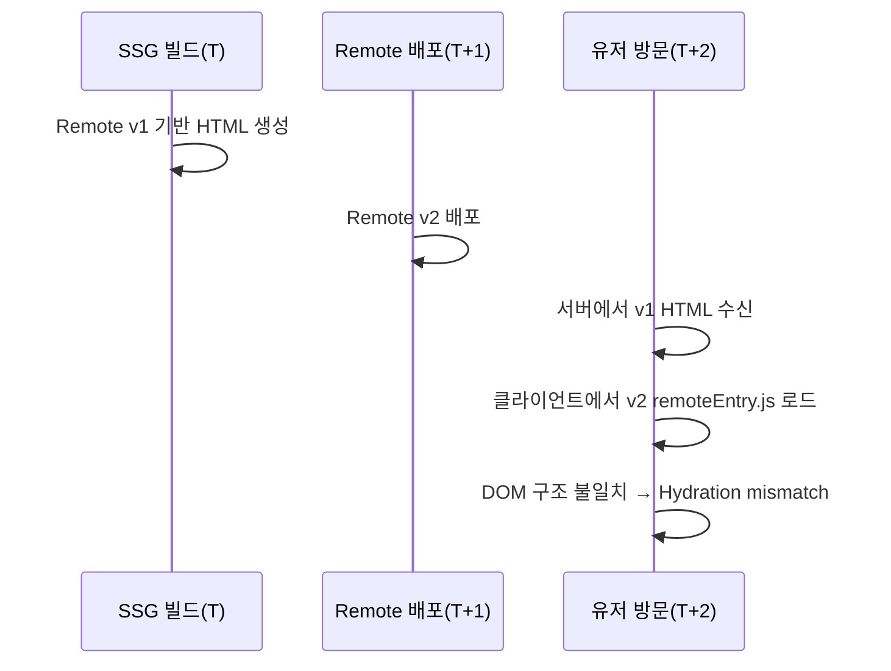
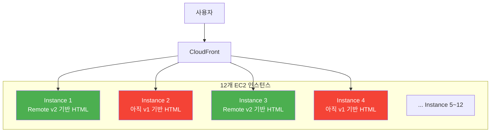
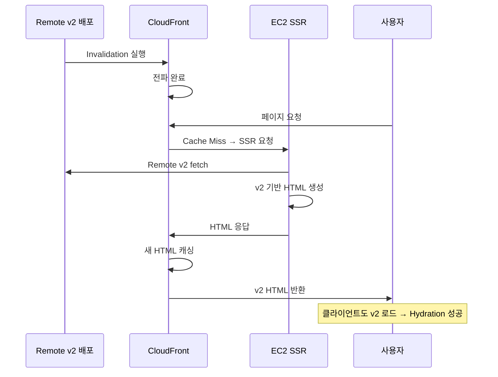
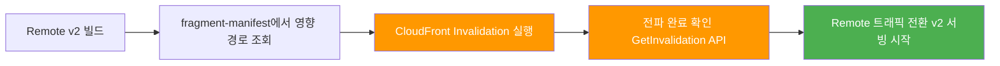

# Module Federation과 페이지 캐싱 전략

## 도입: Module Federation의 달콤한 약속, 그리고 깨진 HTML

Module Federation은 마이크로 프론트엔드의 게임 체인저로 불린다. Webpack 5(2020)에서 Zack Jackson이 설계한 이 기능은 "런타임에 별도로 빌드/배포된 앱 간에 모듈을 공유한다"는 단순한 아이디어에서 출발했다. npm으로 패키지를 배포하고 소비자 앱을 재빌드해야 했던 시대와 비교하면, 팀 간 배포 독립성이라는 관점에서 혁명적이었다.

그런데 이 "런타임 결합"이라는 특성이, 서버 사이드 렌더링과 만나는 순간 예상치 못한 균열을 만들어낸다. 특히 12개 EC2 클러스터와 CloudFront를 운영하는 규모에서는 이 균열이 구조적 결함으로 확대된다.

이 글은 미리캔버스 프론트엔드 팀이 Module Federation 도입 과정에서 마주한 Hydration mismatch 문제를 어떻게 분석하고, 어떤 대안을 검토했으며, 최종적으로 어떤 아키텍처 결정을 내렸는지를 다룬다.

---

## 문제의 시작: SSG와 Module Federation은 공존할 수 없다

### 빌드 시점 HTML vs 런타임 Remote

Module Federation의 핵심 메커니즘부터 짚어보자. Host 앱이 실행되면 Webpack 런타임이 remoteEntry.js를 동적으로 로드한다. 이 파일은 `init()`과 `get()` 두 메서드를 노출하는데, `init()`으로 shared scope(React, ReactDOM 등의 공유 레지스트리)를 초기화하고, `get()`으로 실제 모듈을 fetch한다.

```text
Host App 초기화
  └─ webpack runtime
       └─ shared scope 초기화
            └─ remoteEntry.js 동적 로드
                 └─ remote.init(sharedScope)
                      └─ remote.get('./Component')
                           └─ 실제 청크 fetch → 렌더링
```

문제는 SSG(Static Site Generation)가 빌드 시점에 HTML을 확정한다는 점이다. Remote가 독립 배포되면, 빌드 시점에 고정된 HTML과 클라이언트가 런타임에 로드하는 Remote 모듈 사이에 버전 불일치가 발생한다.



React의 Hydration은 "서버가 생성한 HTML"과 "클라이언트가 첫 렌더에서 생성한 가상 DOM"을 비교한다. 둘이 다르면 React는 경고를 내거나 전체 트리를 클라이언트에서 재렌더링한다. 사용자에게는 화면 깜빡임, 레이아웃 시프트, 또는 인터랙션 불가 상태로 나타난다.

---

## 첫 번째 시도: ISR로 해결하려 했지만

자연스러운 대응은 ISR(Incremental Static Regeneration)이었다. "빌드 시점에 고정되는 게 문제라면, 일정 주기로 페이지를 재생성하면 되지 않을까?" Next.js 9(2019)에서 도입된 ISR은 `revalidate` 옵션으로 페이지를 주기적으로 갱신한다. stale-while-revalidate 패턴과 유사하게, 사용자에게는 캐시된 페이지를 먼저 보여주고 백그라운드에서 새 버전을 생성한다.

그러나 ISR은 단일 인스턴스를 전제로 설계된 메커니즘이다. ISR 캐시는 인스턴스 로컬 파일 시스템에 존재한다. 12개 클러스터가 각자 독립적으로 revalidation 타이밍을 결정하면 다음과 같은 상황이 벌어진다.



동일한 URL에 대해 CloudFront가 어떤 인스턴스로 라우팅하느냐에 따라 다른 HTML이 반환된다. 사용자 A는 최신 버전을, 사용자 B는 이전 버전을 보게 되는 것이다. 이것은 Hydration mismatch와는 다른 차원의 문제다 — **캐시 불일치(Cache Divergence)**다.

이 문제는 분산 시스템에서 오래전부터 알려진 패턴이다. Eric Brewer의 CAP 정리(2000)에 따르면 분산 시스템은 일관성(Consistency), 가용성(Availability), 분할 내성(Partition Tolerance) 중 최대 두 가지만 보장할 수 있다. CDN은 명확히 AP를 선택한 시스템이며, ISR의 인스턴스별 독립 캐시는 의도치 않은 "무작위 일관성" 상태를 만들어낸다.

Vercel은 자사 인프라에서 ISR을 Redis 기반 중앙 캐시로 구현하여 이 문제를 해결한다. Self-hosted Next.js에서는 `cacheHandler` 커스텀 구현이 필요하지만, 이는 Redis 클러스터라는 새로운 단일 장애점(SPOF)을 도입하고 운영 복잡도를 증가시킨다.

---

## 두 번째 벽: CDN 캐시 계층

ISR revalidation이 성공하더라도 CloudFront TTL이 남아있으면 사용자는 여전히 stale HTML을 수신한다. Next.js 레벨의 캐시 무효화만으로는 CloudFront 엣지 캐시까지 제어할 수 없다.

결국 우리는 세 개의 캐시 계층이 서로 다른 시간축에서 독립적으로 동작하는 상황에 놓였다.

| 캐시 계층 | 무효화 주체 | 타이밍 | 제어 가능성 |
|---|---|---|---|
| ISR 인스턴스 캐시 | 각 EC2 인스턴스 | revalidate 주기 | 인스턴스별 독립 |
| CloudFront 엣지 캐시 | TTL 만료 또는 Invalidation | TTL 설정 | API로 제어 가능 |
| 브라우저 캐시 | Cache-Control 헤더 | max-age | 제어 불가 (이미 전송됨) |

---

## 검토하고 기각한 대안들

### 대안 A: SSG + ISR + CloudFront Invalidation 조합

Remote 배포 시 ISR revalidate와 CloudFront Invalidation을 순차 실행하는 방식이다. 단일 인스턴스 환경에서는 작동한다. 그러나 12개 인스턴스 환경에서는 ISR 캐시가 인스턴스별로 독립적이라 일관성을 보장하기 어렵다. ISR, CloudFront, 인스턴스 캐시라는 세 계층의 캐시 상태를 동기화해야 하는 복잡도가 운영 가능한 수준을 넘는다.

### 대안 B: SEO 페이지는 빌드 타임 결합, SSR 페이지는 런타임 Federation

페이지 성격에 따라 Federation 전략을 이원화하는 접근이다. SEO 페이지는 Remote를 빌드 타임에 포함시키고, SSR 페이지는 런타임에 로드한다. 그러나 두 가지 Federation 전략을 동시에 운영하면 배포 파이프라인이 이원화되고, 페이지 성격이 바뀔 때마다 전략을 전환해야 하는 부담이 생긴다. 복잡성이 시간에 따라 누적되는 구조다.

---

## 결정: SSR 고정, CloudFront를 단일 진실의 원천으로

우리의 결정은 세 문장으로 요약된다.

- 모든 페이지를 SSR로 고정한다.
- ISR을 완전히 제거한다.
- CloudFront를 캐시의 단일 진실의 원천(Single Source of Truth)으로 삼는다.

### 왜 SSR이 문제를 제거하는가

SSR은 요청 시점마다 HTML을 생성한다. 서버가 SSR을 수행하면서 그 시점의 최신 Remote를 fetch해 HTML을 만든다. 서버가 렌더링한 HTML과 클라이언트가 로드하는 Remote가 항상 같은 버전이므로 Hydration mismatch가 발생하지 않는다.



멀티 인스턴스 문제도 해소된다. 어느 인스턴스가 SSR을 수행하든 최신 Remote를 fetch하므로 결과가 동일하다. ISR처럼 인스턴스 로컬에 캐시를 보유하지 않기 때문에 인스턴스 간 불일치가 원천적으로 발생하지 않는다.

### 캐시 계층의 단순화

```text
Before (ISR 환경):
[EC2 인스턴스 로컬 캐시 ×12] ← 각각 독립적 revalidation
         ↓ (불일치 가능)
[CloudFront Edge Cache]
         ↓
[브라우저 HTTP Cache]

After (SSR + CloudFront 단일 캐시):
[EC2 인스턴스] → 항상 최신 SSR (캐시 없음)
         ↓
[CloudFront] → 유일한 캐시 계층
         ↓
[브라우저] → max-age=0으로 캐시 비활성화
```

캐시 무효화의 Two Generals Problem은 여전히 존재한다. 그러나 문제의 영역이 "EC2 + CloudFront + 브라우저" 세 계층에서 CloudFront 한 곳으로 축소되었다. 문제를 제거한 것이 아니라, 예측 가능하게 만든 것이다.

---

## SEO 여부에 따른 Remote 렌더링 분기

모든 페이지를 SSR로 고정하되, Remote 컴포넌트의 렌더링 타이밍은 SEO 필요 여부에 따라 분기한다.

```tsx
// SEO 필요: 서버에서 Remote를 기다려 HTML 완성
const UploadPanel = loadRemoteFragment('upload-panel');  // ssr: true (기본)

// SEO 불필요: 클라이언트에서만 로드
const EditorToolbar = dynamic(
  () => loadRemoteFragment('editor-toolbar'),
  {
    ssr: false,
    loading: () => <EditorToolbarSkeleton />,
  }
);
```

`ssr: true`인 Remote는 서버가 remoteEntry.js를 fetch하여 HTML에 포함시킨다. 검색 크롤러가 완성된 콘텐츠를 볼 수 있다.

`ssr: false`인 Remote는 서버 HTML에 스켈레톤만 포함되고, 브라우저에서 Remote를 로드한다. 서버 HTML에 Remote 내용이 없으므로 비교 대상 자체가 없어 Hydration mismatch가 원천적으로 불가능하다.

핵심은 Federation 전략 자체를 이원화하지 않는다는 점이다. 모든 페이지는 SSR이고, Remote의 렌더링 타이밍(`ssr: true/false`)만 분기한다. 운영 기준이 단일하다.

---

## 배포 파이프라인: 순서가 전부다

Remote 배포 시 CloudFront Invalidation과 트래픽 전환의 순서가 이 아키텍처의 정합성을 결정한다.



왜 이 순서인가? Invalidation 완료 전에 Remote를 전환하면, CloudFront가 아직 구 HTML을 캐싱한 상태에서 클라이언트가 새 Remote를 로드하는 윈도우가 생긴다. 바로 우리가 해결하려 했던 Hydration mismatch의 재발이다.

### Fragment-Page 매핑

```json
{
  "fragment-upload-panel": ["/workspace", "/team/:teamId/workspace"],
  "fragment-editor-toolbar": ["/workspace"],
  "fragment-checkout": ["/checkout", "/cart"]
}
```

전체 Invalidation(`/*`)은 피한다. 모든 엣지 캐시가 비워지면 대량의 요청이 EC2 오리진으로 직접 몰리는 Cache Stampede 현상이 발생한다. 선택적 Invalidation은 비용과 오리진 부하를 동시에 제어한다.

### CloudFront Invalidation 완료 감지

```bash
INVALIDATION_ID=$(aws cloudfront create-invalidation \
  --distribution-id $DISTRIBUTION_ID \
  --paths "/workspace" "/checkout" "/cart" \
  --query 'Invalidation.Id' \
  --output text)

aws cloudfront wait invalidation-completed \
  --distribution-id $DISTRIBUTION_ID \
  --id $INVALIDATION_ID
```

AWS 공식 문서에 따르면 Invalidation은 일반적으로 60초~수 분 내에 완료된다.

---

## 서버 부하 최적화: Cache-Control 전략

SSR 전환의 최대 비용은 서버 부하다. CloudFront 캐시 히트율이 충분히 높다면 실제 오리진에 도달하는 요청은 크게 줄어든다.

```text
# SSR HTML 응답
Cache-Control: public, s-maxage=300, max-age=0, must-revalidate

# Remote remoteEntry.js (버전 포함 URL)
Cache-Control: public, s-maxage=31536000, immutable

# fragment-manifest.json
Cache-Control: public, s-maxage=30, max-age=0
```

`s-maxage=300`은 CloudFront에서 5분간 캐싱하되 브라우저는 캐싱하지 않는다(`max-age=0`). CloudFront가 유일한 캐시 계층이 되는 구조를 헤더 수준에서 강제한다.

추가로 Origin Shield을 EC2와 동일 리전(ap-northeast-2)에 배치하면, Regional Edge Cache가 각각 오리진에 요청하는 대신 Origin Shield 하나를 통과시킬 수 있다. 오리진 히트 수를 유의미하게 줄일 수 있다.

---

## 유사한 결정을 내린 다른 팀들

- ByteDance 내부 플랫폼(2023): 대규모 MFE 환경에서 SSR 고정 + 중앙 CDN 캐시 원천 운영
- Next.js Self-hosting 커뮤니티: 다중 인스턴스 ISR보다 SSR + CDN이 예측 가능성이 높다는 결론 반복
- OpenNext: 분산 환경에서 인스턴스 로컬 캐시보다 중앙 저장소를 SSOT로 강제

---

## 마무리: 캐시 문제는 제거할 수 없다, 격리할 수 있을 뿐이다

캐시 무효화는 컴퓨터 과학에서 "가장 어려운 두 가지 문제" 중 하나로 불린다. 분산 환경에서 모든 노드가 동시에 캐시를 무효화하는 것은 수학적으로 불가능하다.

우리가 할 수 있는 것은 문제의 영역을 축소하는 것이다. 세 개의 독립적인 캐시 계층에서 발생하던 불일치를 CloudFront 한 곳으로 격리했다. ISR이라는 비결정적 캐시를 제거하고, CloudFront Invalidation이라는 결정적 메커니즘으로 대체했다.

이 결정에는 비용이 있다. SSR은 SSG보다 서버 자원을 더 소모한다. CloudFront Invalidation 전파 중 짧은 불일치 윈도우가 존재한다. fragment-manifest를 수동으로 관리해야 한다. 그러나 12개 인스턴스 환경에서 Hydration mismatch를 구조적으로 제거하고, 캐시 상태를 예측 가능하게 만든 가치가 이 비용을 상쇄한다고 판단했다.

Module Federation + SSR 조합을 검토하는 팀이라면, 먼저 자문해볼 질문이 있다.

> 당신의 인프라에서 캐시의 단일 진실의 원천은 어디인가?

이 질문에 명확히 답할 수 없다면, Hydration mismatch는 시간 문제다.

---

## 참고 자료

- Webpack 5 Module Federation 공식 문서
- Module Federation 2.0 (SSR 지원, Manifest 기반 버전 관리)
- Cache Made Consistent (Meta Engineering)
- AWS CloudFront Invalidation 문서
- Next.js ISR Self-hosting Discussion (#34517)
- OpenNext Caching Architecture
- Netflix Live Origin Architecture
- ADR (Michael Nygard, 2011)
- Lightweight ADR (Thoughtworks Technology Radar)
