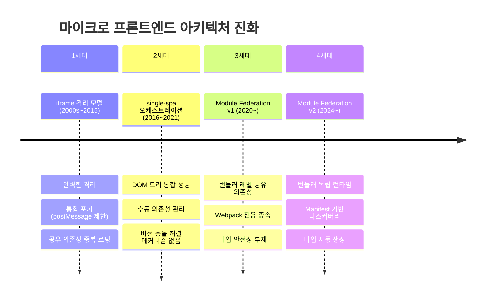
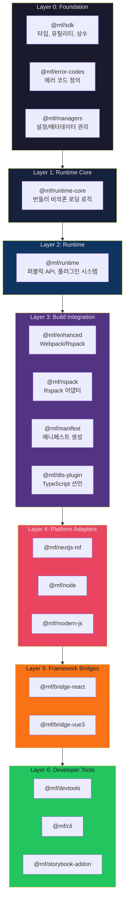

## 들어가며: "독립적으로 배포된 앱들을 런타임에 조립한다"는 것

5개 팀이 각자의 React 앱을 독립적으로 배포한다고 가정하자. 팀 A는 React 18.2.0, 팀 B는 18.3.0을 쓴다. 사용자의 브라우저에서 이 두 앱이 하나의 페이지에 공존해야 한다면, React를 두 번 다운로드할 것인가? 아니면 하나만 쓸 것인가? 하나만 쓴다면, 어떤 버전을?

이 질문이 Module Federation이 해결하는 핵심 문제다. 그리고 이 질문에 대한 답의 깊이가 v1과 v2를 가른다.

---

## "Federation"이라는 단어의 무게

Module Federation에서 "Federation"은 단순한 마케팅 용어가 아니다. 정치학에서 연방(Federation)은 독립된 개체들이 각자의 자율성을 유지하면서 공동의 프로토콜로 협력하는 체제를 뜻한다. 이 정의가 소프트웨어 세계에서 세 방향으로 독립 진화했다.

| 소프트웨어 Federation | 핵심 원리 | Module Federation과의 유사점 |
|---|---|---|
| **Federated Learning** (2016, Google) | 데이터 주권 유지 + 모델만 협력 통합 | 각 앱이 코드 소유권 유지 + 런타임에 모듈만 공유 |
| **GraphQL Federation** (2019, Apollo) | 서비스 자율성 + 통합 인터페이스 | 각 Remote가 독립 배포 + Host가 통합 UI 제공 |
| **ActivityPub / Fediverse** | 탈중앙화 + 프로토콜 기반 협력 | 중앙 서버 없이 Container 프로토콜로 협력 |

Zack Jackson이 2017년 LOSA(Lots of Small Applications) 아키텍처를 운영하면서 마주한 문제 -- "독립 배포되는 앱들 사이에서 React 싱글톤을 어떻게 보장할 것인가" -- 가 2019년 Webpack PR로 구체화되었고, 2020년 Webpack 5의 플래그십 기능이 되었다. 그리고 2024년 4월, ByteDance Web Infra 팀과의 협력으로 v2(`@module-federation/core`)가 공식 출시되었다.

---

## 마이크로 프론트엔드 아키텍처의 진화: 격리 vs 통합의 딜레마

Module Federation이 왜 현재의 형태가 되었는지 이해하려면, 이전 세대들이 무엇을 해결했고 무엇을 남겼는지 알아야 한다.



**1세대 iframe**: "격리"는 완벽했지만 "통합"을 포기했다. React가 10개 iframe에 10번 다운로드되고, URL 라우팅 동기화는 불가능했다.

**2세대 single-spa**: 하나의 DOM 트리 안에서 여러 앱을 공존시켰지만, 공유 의존성은 수동(`SystemJS` + `<script>` 태그 조작)이었다. React 16 팀과 React 17 팀이 공존할 때 어떤 버전을 쓸지 결정하는 메커니즘 자체가 없었다.

**3세대 MF v1**: 번들러 레벨에서 `shared: { react: { singleton: true } }` 한 줄로 공유 의존성을 선언하고, 런타임에 버전을 협상하는 혁신을 이뤘다. 하지만 Webpack 내부 구현에 강하게 결합되어 있었다. Vite 프로젝트에서는 사용 불가, `import('remote/Button')`의 반환 타입은 `any`, Remote URL은 빌드 타임에 하드코딩, 로딩 실패 시 디버깅 훅도 없었다.

**4세대 MF v2**: 런타임 코어를 번들러에서 분리하여 Webpack, Rspack, Vite 모두 지원하고, Manifest 기반 동적 디스커버리로 URL 하드코딩을 제거하고, TypeScript 타입 자동 생성 플러그인을 공식 제공한다.

---

## v2의 핵심 설계: 7계층 아키텍처

v2의 가장 큰 설계적 특징은 **엄격한 계층 분리**다. 각 계층은 하위 계층에만 의존하며, 역방향 의존은 허용되지 않는다.



### 왜 이 계층 구조가 중요한가

**런타임과 빌드의 분리가 모든 것을 가능하게 했다.** `runtime-core`(Layer 1)는 Webpack을 모른다. 이 한 가지 사실이 v2의 전체 아키텍처를 결정한다. runtime-core가 번들러를 모르기 때문에 Rspack도 동일한 런타임 위에 빌드 통합을 구현할 수 있고, Vite도 실험적으로 지원 가능하다.

마찬가지로 React 브릿지(Layer 5)는 Next.js를 모르고, Next.js 어댑터(Layer 4)는 React 브릿지를 직접 의존하지 않는다. 각자가 런타임 레이어에만 의존한다. 이 분리 덕분에 어느 한 계층의 변경이 다른 계층으로 번지지 않는다.

SDK(Layer 0)는 30개 이상의 패키지가 의존하므로 극도로 안정적이어야 한다. SDK의 타입이나 상수 변경은 전체 생태계에 파급된다. 반면 devtools(Layer 6)는 자유롭게 실험할 수 있다 -- 하위 계층에 아무 영향도 주지 않으므로.

### 플러그인 아키텍처의 세대 교체

v2의 Runtime Plugin 시스템은 기존 플러그인 아키텍처의 계보에서 독특한 위치를 차지한다.

| 세대 | 대표 시스템 | 특징 | 한계 |
|------|-----------|------|------|
| 1세대 | Eclipse Extension Point | 정적 확장, XML 선언 | 플러그인 그래프 고정 |
| 2세대 | Webpack Tapable, Rollup | 훅 기반 미들웨어 체인 | **빌드 타임** 전용 |
| 3세대 | **MF v2 Runtime Plugin** | **런타임** 모듈 로딩 인터셉션 | - |

Webpack의 Tapable이 `SyncHook`, `AsyncParallelHook` 등으로 번들 생성 파이프라인을 제어했다면, MF v2는 `beforeInit` → `beforeRequest` → `createScript` → `fetch` → `errorLoadRemote` 같은 훅으로 **브라우저 런타임의 네트워크 요청, 캐시 전략, 버전 해석**까지 제어한다.

결정적 차이는 두 가지다. 첫째, 분산 환경에서의 플러그인 합성(composition) -- 각 Remote가 독립적인 플러그인 체인을 가지면서도 Host의 런타임과 합성된다. 둘째, 훅의 인터셉션 대상이 네트워크 I/O를 포함한다 -- Express의 미들웨어 패턴과 유사하지만, 클라이언트 사이드 모듈 해석에 적용된 형태다.

---

## 5가지 핵심 개념 모델

Module Federation의 모든 것은 다섯 가지 개념으로 설명할 수 있다. 설정 파일을 보기 전에, 먼저 각 개념의 관계를 이해하자.

### 1. Container: 대사관 건물

Container는 빌드 타임에 생성되는 래퍼 모듈이다. `remoteEntry.js`로 구현되며, 크기는 1~5KB 정도로 가볍다. 비즈니스 로직은 포함하지 않고, 모듈 팩토리에 대한 참조만 갖는다.

```typescript
// Container의 핵심 계약(contract)
interface Container {
  // Host의 SharedScope를 전달받아 공유 의존성 등록
  init(shareScope: ShareScope): Promise<void>;
  // 노출된 모듈의 팩토리 함수 반환 (실제 코드가 아닌 팩토리)
  get(moduleName: string): Promise<() => Module>;
}
```

대사관 비유가 적절하다. 대사관은 독립적으로 존재하지만 외부 방문객에게 서비스를 제공하는 자족적 단위다. `init()`은 외교 프로토콜 수립(공유 의존성 협상), `get()`은 특정 서비스 요청(모듈 로딩)이다.

### 2. Share Scope: 버전 협상 테이블

Share Scope는 런타임 레지스트리다. 어떤 공유 의존성의 어떤 버전이 사용 가능한지 추적한다. **단순히 "라이브러리를 공유"하는 것이 아니라, "런타임에 버전을 협상"하는 시스템이다.**

```typescript
type ShareScope = {
  [scopeName: string]: {
    [packageName: string]: {
      [version: string]: {
        get: () => Promise<Module>;
        loaded: boolean;
        from: string;    // 어디서 제공했는지
        eager: boolean;  // 동기 로딩 여부
      };
    };
  };
};
```

4가지 버전 해석 전략이 존재한다:

| 전략 | 동작 | React에서의 의미 | 주의점 |
|------|------|----------------|--------|
| **Singleton** | 단 하나의 인스턴스만 허용, 먼저 로드된 버전 사용 | React는 **반드시** Singleton. 두 인스턴스 존재 시 Hook 에러 | 버전 불일치는 경고만 출력, 에러가 아님 |
| **Version-First** | semver 호환 범위 내 최신 버전 선택 | lodash 같은 유틸리티 라이브러리에 적합 | 범위 밖이면 별도 다운로드 발생 |
| **Loaded-First** | 이미 로드된 버전 재사용 | 네트워크 요청 최소화 우선 | 의도치 않은 구버전 사용 가능 |
| **Eager** | 앱 부트스트랩 시 동기 로딩 | 초기 렌더링 필수 의존성 | 초기 번들 크기 증가, 중복 로딩 위험 |

React가 반드시 Singleton이어야 하는 이유는 기술적으로 명확하다. React 18의 `useContext`, `useState` 등은 내부적으로 모듈 레벨 변수(`ReactCurrentDispatcher`, `ReactCurrentBatchConfig`)를 공유한다. 두 개의 React 인스턴스가 존재하면 Context가 공유되지 않고, "Invalid hook call" 에러가 발생한다.

#### Share Scope 해석 알고리즘의 결정론성

이 알고리즘에는 **결정론성이 깨지는 세 가지 시나리오**가 존재한다:

1. **로딩 경쟁(Race Condition)**: 두 Remote가 동시에 서로 다른 버전을 요청하면, 네트워크 지연에 따라 먼저 `initShared`를 호출한 쪽의 버전이 등록된다. 결과가 비결정적이다.
2. **Dynamic Remote 추가**: 런타임에 새 Remote를 동적으로 추가하면, 이미 로드된 버전과의 충돌 결과를 정적 분석으로 예측할 수 없다.
3. **Singleton 조용한 실패**: Singleton 모드에서 버전 불일치는 에러가 아닌 콘솔 경고로만 표시되고, 잘못된 버전의 모듈이 실제로 사용된다.

### 3. Host / Remote: 역할이지 정체성이 아니다

가장 흔한 오해는 Host와 Remote가 고정된 역할이라고 생각하는 것이다. 실제로는:

- **Host**: 다른 앱의 모듈을 소비하는 앱
- **Remote**: 모듈을 노출하는 앱
- **양방향**: 하나의 앱이 동시에 Host이면서 Remote일 수 있다

앱 A가 앱 B를 사용하면 A가 Host, B가 Remote다. 동시에 앱 B가 앱 C를 사용하면 B는 그 관계에서 Host가 된다. Host/Remote는 관계에서 결정되는 역할이지, 앱에 부여되는 정체성이 아니다.

### 4. Manifest: 동적 디스커버리의 핵심

`mf-manifest.json`은 v2에서 추가된 핵심 개념이다. 원격 앱의 메타데이터를 기술하는 JSON 파일로, remoteEntry.js의 URL을 하드코딩하지 않아도 되게 만든다.

```json
{
  "metaData": {
    "name": "shop",
    "type": "app",
    "buildVersion": "1.0.0"
  },
  "exposes": {
    "./Button": {
      "id": "./src/components/Button.tsx",
      "assets": {
        "js": { "async": ["Button.async.js"], "sync": [] },
        "css": { "async": ["Button.css"] }
      }
    }
  },
  "shared": {
    "react": { "version": "18.2.0", "singleton": true }
  },
  "remoteEntry": {
    "name": "remoteEntry.js",
    "path": "/static/remoteEntry.js"
  }
}
```

이것이 마이크로서비스의 **서비스 디스커버리 패턴**과 구조적으로 동형(isomorphic)이라는 점이 흥미롭다:

| 서비스 디스커버리 (Consul/etcd) | MF v2 Manifest 디스커버리 |
|------|------|
| Service Registry | mf-manifest.json |
| Service Name + Endpoint URL | Remote Name + remoteEntry URL |
| Health Check / TTL | (없음 - Manifest는 정적 스냅샷) |
| Client-side Discovery | Host 런타임 해석: `fetch(manifestUrl)` |
| Load Balancer 선택 | 버전 매칭 알고리즘 |
| Circuit Breaker | (없음 - Runtime Plugin으로 직접 구현) |

핵심 차이는 **동적성**이다. Consul은 서비스가 런타임에 등록/해제되지만, Manifest는 빌드 시점에 생성된 정적 스냅샷이다. 그래서 Runtime Plugin의 `errorLoadRemote` 훅으로 Circuit Breaker 같은 패턴을 직접 구현해야 한다.

### 5. Runtime Plugin: 런타임 동작의 완전한 제어

빌드타임 Webpack 플러그인과는 별개의, 런타임 전용 플러그인이다.

```typescript
interface FederationRuntimePlugin {
  name: string;
  beforeInit?: (args: BeforeInitArgs) => BeforeInitArgs;
  beforeRequest?: (args: BeforeRequestArgs) => BeforeRequestArgs;
  afterResolve?: (args: AfterResolveArgs) => AfterResolveArgs;
  createScript?: (args: CreateScriptArgs) => HTMLScriptElement | void;
  fetch?: (url: string, options: RequestInit) => Promise<Response>;
  errorLoadRemote?: (args: ErrorArgs) => Module | void;
}
```

v1에서 불가능했던 것들이 v2의 Runtime Plugin으로 가능해진다: CDN 폴백, 인증 토큰 주입, 로딩 성능 계측, 에러 리포팅, A/B 테스트를 위한 동적 Remote 선택 등.

---

## 모듈 로딩 라이프사이클: 6단계 비동기 여정

Host 앱에서 Remote 모듈을 로드할 때 거치는 6단계를 네트워크 관점에서 분석하면:

```
Time ──────────────────────────────────────────────────────────►

Stage 1: Remote Resolution       [HTTP GET /mf-manifest.json]
         ↓ beforeRequest 훅                              ~1KB
                                                          ↓
Stage 2: Entry Loading            [HTTP GET /remoteEntry.js]
         ↓ createScript / fetch 훅                    ~3-15KB
                                                          ↓
Stage 3: Container Init           [JS Execution - No Network]
         ↓ beforeInit 훅            버전 협상 발생
                                                          ↓
Stage 4: Module Request           [HTTP GET /chunk-abc123.js]
         container.get('./Button')                        ↓
                                                          ↓
Stage 5: Share Resolution         [SharedScope 확인 - 보통 No Network]
         버전 매칭 전략 적용            협상 실패 시 추가 다운로드
                                                          ↓
Stage 6: Module Execution         [JS Execution - No Network]
         ↓ onLoad / errorLoadRemote 훅
```

**핵심 포인트: 이 모든 단계가 비동기다.** SSR 환경에서 이것이 문제가 되는 이유는, 서버에서 렌더링할 때 Remote 모듈이 아직 로드되지 않았다면 빈 HTML이 생성되고, 클라이언트에서 다시 로드하면 Hydration mismatch가 발생하기 때문이다.

### 네트워크 Waterfall 최적화

여러 Remote를 로드할 때, 각 Remote의 Stage 1은 완전히 병렬화 가능하다. `Promise.all`로 동시에 초기화하면 전체 로딩 시간을 단일 Remote 수준으로 줄일 수 있다.

최적화 적용에 따른 성능 차이:

| 최적화 수준 | P50 로딩 시간 | P95 로딩 시간 |
|---|---|---|
| 최적화 없음 (순차 로딩) | ~800ms | ~2000ms |
| 병렬 Remote 초기화 | ~350ms | ~900ms |
| + Preload hint 적용 | ~150ms | ~400ms |
| + CDN Edge 캐싱 | ~80ms | ~200ms |

CDN 캐싱 전략의 핵심 원칙은 **Manifest는 짧은 TTL(`max-age=30`), 청크 파일은 컨텐츠 해시로 영구 캐시(`immutable`)**다. Manifest만 갱신하면 청크 파일 URL이 자동으로 변경되므로, 배포와 캐시 무효화가 깔끔하게 분리된다.

---

## 의존성 그래프와 빌드 순서

모노레포에서 패키지를 빌드할 때 순서가 중요하다:

```
Phase 1 (병렬):  sdk, error-codes
Phase 2:         managers (sdk에 의존)
Phase 3:         runtime-core (sdk, error-codes에 의존)
Phase 4:         runtime (sdk, error-codes, runtime-core에 의존)
Phase 5 (병렬):  enhanced, manifest, dts-plugin, webpack-bundler-runtime
Phase 6 (병렬):  nextjs-mf, node, modern-js, bridge-react, bridge-vue3
Phase 7 (병렬):  devtools, cli, storybook-addon
```

NX의 태스크 오케스트레이션이 이 순서를 자동으로 관리한다. NX는 `module-federation.config.js`의 `remotes` 배열을 분석하여 암묵적 의존성을 명시적 그래프 엣지로 변환한다. 10개의 Remote가 있는 모노레포에서 하나의 Remote만 변경되면, NX는 해당 Remote와 그것을 참조하는 Host만 재빌드한다(`nx affected`).

---

## 이중 모듈 포맷: 유니버설 런타임의 철학

모든 Foundation/Runtime 패키지는 ESM + CJS 이중 포맷을 지원한다:

```json
{
  "exports": {
    ".": {
      "import": "./dist/index.esm.js",
      "require": "./dist/index.cjs.cjs",
      "types": "./dist/index.d.ts"
    }
  }
}
```

이중 포맷은 "런타임이 어디서든 동작해야 한다"는 v2의 유니버설 런타임 철학을 반영한다. ESM은 브라우저와 최신 Node.js/Deno/Bun을, CJS는 기존 Node.js와 Jest 환경을 지원한다.

---

## 정리: 이 아키텍처가 해결하는 문제

| 문제 | v1의 한계 | v2의 해결 방식 |
|------|----------|--------------|
| 번들러 종속성 | Webpack 전용 | 런타임과 빌드 분리 → Rspack/Vite 지원 |
| 타입 안전성 부재 | `import('remote/X')`가 `any` | DTS 플러그인 + 실시간 WebSocket 타입 서버 |
| 하드코딩된 Remote URL | 빌드 타임 결정 | Manifest 기반 동적 디스커버리 |
| 런타임 디버깅 불가 | 에러 훅 없음 | Runtime Plugin 훅 시스템 |
| 프레임워크 boilerplate | 직접 구현 | 전용 브릿지 패키지 (React, Vue) |
| SSR 호환성 | 별도 설정, 공식 지원 없음 | Node.js 어댑터, 플랫폼별 런타임 플러그인 |

---

Module Federation v2는 단순히 "코드를 원격으로 로드하는 도구"가 아니다. 독립적으로 배포되고, 독립적으로 버전 관리되는 애플리케이션들이 런타임에 **프로토콜 기반으로 협력**하는 연방 시스템이다. 그리고 그 프로토콜의 핵심이 바로 이 7계층 아키텍처와 5가지 개념 모델이다.

> 다음 편: [02-런타임 시스템](2.module-federation-runtime-system.md) — FederationHost, 플러그인 훅 체이닝, Share Scope 해석 알고리즘의 코드 레벨 분석
