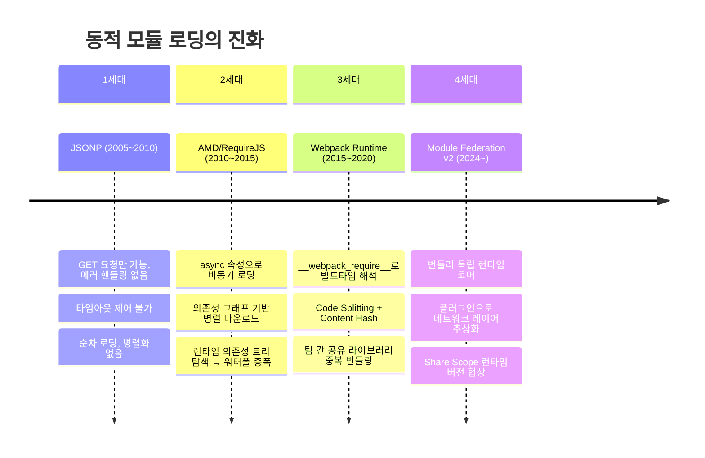
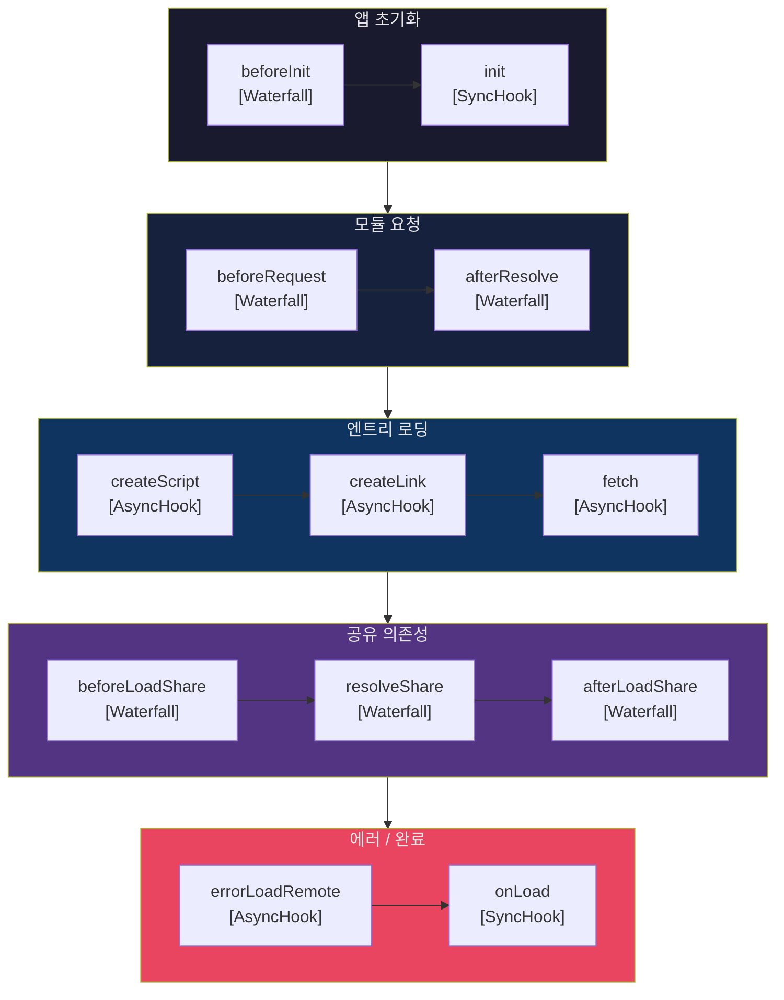
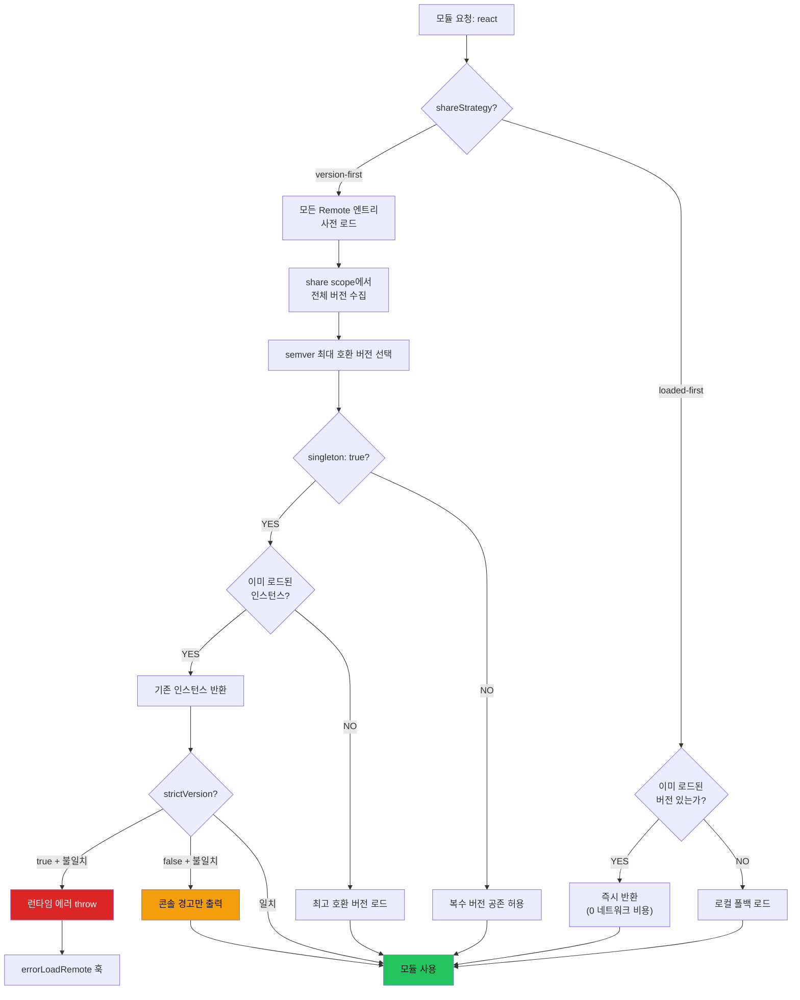

## 들어가며: `import`와 `loadRemote`는 같은 것이 아니다

```typescript
// 이것과
import { Button } from 'design-system';

// 이것의 차이는 무엇인가?
const { Button } = await loadRemote('shop/Button');
```

첫 번째 `import`는 빌드 타임에 모든 것이 결정된다. 번들러가 의존성 그래프를 완성하고, 파일 시스템이 진실의 원천이다. 두 번째 `loadRemote`는 런타임에 네트워크를 통해 원격 컨테이너에 접속하고, 버전을 협상하며, Share Scope에서 이미 로드된 의존성을 재사용할지 결정한다.

**제어의 역전(Inversion of Control) 타이밍이 다르다.** 정적 import는 빌드 타임 결정론적이고, `loadRemote`는 런타임 확률론적이다. 개발자들이 Module Federation 런타임을 이해하기 어려워하는 근본 이유는 후자에서도 전자의 멘탈 모델을 적용하려 하기 때문이다. `loadRemote`가 호출될 때 내부에서는 HTTP 요청, 버전 협상, 스크립트 주입, 캐시 확인이 연쇄적으로 일어난다. 이 글에서는 그 연쇄 반응의 모든 단계를 추적한다.

---

## JavaScript 모듈 로더의 진화: 런타임 해석은 왜 필요해졌나

Module Federation v2의 런타임을 이해하려면, 브라우저에서 모듈을 "동적으로 로드"하는 것이 왜 이토록 복잡한 문제인지를 역사적으로 짚어야 한다.



RequireJS 시절에는 10단계 깊이의 의존성이 10번의 네트워크 라운드트립을 의미했다. Webpack이 빌드 타임 해석으로 이 문제를 해결했지만, 독립 배포되는 마이크로프론트엔드들이 React를 각자의 번들에 중복 포함하는 새로운 문제가 생겼다. Module Federation은 "런타임에 의존성을 협상"하는 패러다임 전환으로 이를 풀었고, v2는 그 협상 엔진을 번들러에서 완전히 분리했다.

런타임 해석이 중요해진 근본 이유는 간단하다. **"팀별 독립 배포"라는 조직적 요구사항이 기술적 아키텍처보다 먼저 정해지기 때문이다.** 배포 시점이 다른 복수의 애플리케이션이 런타임에 React 인스턴스를 하나만 유지해야 하는 제약은, 빌드 타임 해석으로는 절대 충족할 수 없다.

---

## runtime-core / runtime: 육각형 아키텍처의 실현

v2 런타임은 두 개의 패키지로 나뉜다. 이 분리가 v2의 전체 아키텍처를 결정한다.

```
@module-federation/runtime-core  (Level 1)
  → 번들러에 의존하지 않는 순수 로딩 로직
  → FederationHost 클래스 구현
  → 공유 의존성 해석 엔진

@module-federation/runtime       (Level 2)
  → runtime-core 위의 퍼블릭 API
  → 플러그인 시스템 노출
  → 플랫폼별 어댑터 (브라우저/Node/RN)
```

이 구조는 Alistair Cockburn이 2005년 제안한 **Hexagonal Architecture(Ports and Adapters)**와 구조적으로 동형이다.

| Hexagonal Architecture | Module Federation v2 |
|---|---|
| Domain Core (비즈니스 로직) | `runtime-core` (FederationHost, ShareScope 알고리즘) |
| Ports (추상 인터페이스) | RuntimePlugin API (`createScript`, `fetch`, `errorLoadRemote`) |
| Adapters (외부 구현) | `runtime` (브라우저 DOM, Node.js vm, React Native Metro) |

**runtime-core는 Webpack도 React도 브라우저도 모른다.** 이 한 가지 사실이 모든 것을 가능하게 한다. Rspack이 동일한 런타임 위에 빌드 통합을 구현할 수 있고, Node.js SSR에서도 동일한 Share Scope 협상 알고리즘이 동작한다. 실질적 가치는 명확하다: **빌드 시스템을 Webpack에서 Rspack으로 교체해도 런타임 동작이 동일하게 유지된다.**

`@module-federation/runtime`은 다중 진입점을 제공한다:

```
main    → import { init, loadRemote } from '@module-federation/runtime'
helpers → import { ... } from '@module-federation/runtime/helpers'
types   → import type { ... } from '@module-federation/runtime/types'
core    → import { ... } from '@module-federation/runtime/core'
```

---

## FederationHost: 국제 무역항의 세관

`FederationHost`는 런타임의 중심 클래스다. 앱당 하나의 인스턴스가 생성되며, 모든 원격 모듈 로딩과 공유 의존성 관리를 담당한다. 단순한 "허브"보다 더 정확한 비유는 **국제 무역항의 세관(Customs)**이다.

| 세관 개념 | FederationHost 대응 |
|---|---|
| 세관 신고 | `init()` — 어떤 화물(shared 모듈)을 보유하는지 선언 |
| 통관 협상 | Share Scope 버전 협상 알고리즘 |
| 화물 추적 | `globalThis.__FEDERATION__` — 전역 인스턴스 레지스트리 |
| 면세 구역 | singleton 모드 — 이미 통관된 화물은 재검사 없이 재사용 |
| 환적 허브 | 한 Remote가 다른 Remote를 경유하는 시나리오 |

### 5가지 핵심 책임

```typescript
class FederationHost {
  remoteHandler: RemoteHandler;      // 1. 원격 앱 레지스트리
  shareScopeMap: ShareScopeMap;      // 2. 공유 의존성 레지스트리
  moduleCache: Map<string, Module>;  // 3. 모듈 캐시
  hooks: PluginSystem;               // 4. 플러그인 매니저
  options: FederationRuntimeOptions; // 5. 설정 (name, remotes, shared 등)
}
```

`globalThis.__FEDERATION__.__INSTANCES__` 배열이 페이지 내 모든 FederationHost 인스턴스를 추적한다. 신규 Remote가 로드될 때 이 레지스트리를 순회하여 기존 인스턴스의 ShareScope와 병합한다.

### 초기화 흐름

```typescript
import { init, loadRemote } from '@module-federation/runtime';

init({
  name: 'host-app',
  remotes: [
    { name: 'shop', entry: 'http://localhost:3001/mf-manifest.json' }
  ],
  shared: {
    react: { version: '18.2.0', singleton: true, scope: 'default' }
  },
  plugins: [myCustomPlugin()]
});

const Button = await loadRemote('shop/Button');
```

`init()` 호출 시 내부에서 일어나는 일:

```
new FederationHost(config)
  ├── validateConfig()          옵션 검증 (name 필수)
  ├── initShareScopeMap()       Share 버전 해석 알고리즘 초기화
  │   └── requiredVersion 파싱 (semver)
  ├── registerPlugins()         플러그인 등록
  │   ├── built-in: fetchPlugin, envPlugin
  │   └── user-defined plugins
  └── init hooks 실행
      └── Waterfall: beforeInit → init
```

---

## 플러그인 시스템: Waterfall과 AsyncHook의 이중 구조

런타임 플러그인 시스템은 두 가지 실행 모델을 사용한다. 이 차이를 이해하지 못하면 플러그인 작성 시 예기치 않은 동작에 부딪힌다.

### Waterfall 패턴: 파이프라인 변환

이전 플러그인의 반환값이 다음 플러그인의 입력이 된다. 함수형 프로그래밍의 `reduce` 연산과 동형이다.

```
Plugin A.beforeRequest(args)
  → 수정된 args 반환
    → Plugin B.beforeRequest(수정된 args)
      → 다시 수정된 args 반환
        → 최종 args로 실제 요청 수행
```

```typescript
// 내부적으로 이렇게 동작한다
const finalResult = plugins.reduce(
  (prevResult, plugin) => plugin.hook(prevResult),
  initialInput
);
```

### AsyncHook 패턴: First-Match 반환

첫 번째로 유효한 결과를 반환한 플러그인이 승리한다. `createScript`, `fetch` 등 비동기 작업에서 사용.

```
Plugin A.createScript(args)
  → Script element 반환 시 → 이 element 사용 (다음 플러그인 건너뜀)
  → undefined 반환 시 → Plugin B.createScript(args)로 넘어감
```

### Express/Koa 미들웨어와의 비교

| 특성 | Express 미들웨어 | Koa 미들웨어 | MF v2 Waterfall |
|---|---|---|---|
| 실행 흐름 | 단방향, 콜백 기반 | 양방향 (어니언 패턴) | 단방향, 반환값 전달 |
| 데이터 전달 | req/res 변이(mutation) | ctx 객체 변이 | 반환값이 다음 입력 |
| 중단 조건 | next() 미호출 | next() 미호출 | 명시적 return |

Koa의 어니언 패턴은 요청과 응답 양방향에 개입하지만, MF v2의 Waterfall은 **순수한 단방향 변환 파이프라인**이다. 이 차이가 중요한 이유는, 플러그인이 "반드시 원래 값을 반환해야" 파이프라인이 유지되기 때문이다.

### 전체 훅 맵



> **주의**: AsyncHook에서 플러그인 등록 순서가 결과를 결정한다. 사용자 정의 `resolveShare` 플러그인이 기본 알고리즘보다 먼저 등록되면 기본 알고리즘이 무시된다. 멀티 팀 환경에서는 플러그인 실행 순서를 명시적으로 문서화해야 한다.

---

## Share Scope 해석 알고리즘: 의존성 해석의 런타임 진화

패키지 의존성 해석은 본질적으로 **제약 충족 문제(CSP, Constraint Satisfaction Problem)**다. npm의 호이스팅 알고리즘이 빌드 타임에 이 문제를 풀었다면, Module Federation은 런타임에 푼다. 그리고 여기에 "로딩 순서"라는 변수가 추가되면서 복잡도가 한 차원 올라간다.

### v2의 두 가지 해석 전략

MF v2는 `shareStrategy` 옵션으로 두 가지 근본적으로 다른 알고리즘을 선택한다.



### 결정론성 분석: 언제 결과가 예측 불가능해지는가

**version-first는 준결정론적(quasi-deterministic)**이다. 모든 Remote 엔트리 로드가 완료된 후라면 결과가 일정하다. 하지만 초기화 완료 전에 모듈 요청이 발생하면 비결정적이 된다:

```
T=0ms:   Host 초기화 시작, Remote A 엔트리 로드 시작
T=50ms:  모듈 M 요청 발생 (Remote B 미로드 상태)
T=100ms: 결정 → Remote A의 v1.2.0 선택
T=200ms: Remote B 엔트리 완료 → v1.3.0 등록 (이미 늦음)
→ 결과: 최적 버전 미선택
```

**loaded-first는 명시적 비결정론**이다. 함수 `f(shareKey)`가 시간 `t`와 네트워크 지연 `δ`에 종속된다. 동일한 코드도 네트워크 상태에 따라 다른 버전을 사용할 수 있다. 이는 의도적 설계 선택이다 — 성능을 위해 결정론성을 희생한 것이다.

### 실제 shareScopeMap 데이터 구조

```javascript
__webpack_share_scopes__['default'] = {
  react: {
    '18.2.0': {
      get: () => Promise.resolve(() => require('react')),
      loaded: true,
      from: 'host-app',
      eager: false
    },
    '18.3.1': {
      get: () => import('react'),
      loaded: false,
      from: 'shop-remote',
      eager: false
    }
  }
};
```

### React가 반드시 Singleton이어야 하는 이유

React 18의 `useContext`, `useState` 등은 내부적으로 모듈 레벨 변수(`ReactCurrentDispatcher`, `ReactCurrentBatchConfig`)를 공유한다. 두 개의 React 인스턴스가 메모리에 존재하면 각자의 dispatcher를 가지므로, Context가 공유되지 않고 "Invalid hook call" 에러가 발생한다.

FederationHost가 이를 해결하는 메커니즘: 이미 `loaded: true`인 React 인스턴스가 ShareScope에 있으면, 신규 인스턴스 생성을 중단하고 기존 참조를 반환한다.

### eager 모드의 함정

`eager: true`는 초기 번들에 공유 라이브러리를 포함시켜 비동기 로딩을 제거한다. 그러나 두 Remote가 모두 `eager: true`로 React를 선언하면 **두 번 번들링되는 역설**이 발생한다. 권장 패턴: Shell 앱에만 `eager: true`를 설정하고, Remote들은 기본값(`eager: false`)을 유지한다.

---

## 플랫폼별 런타임 어댑터

### 브라우저: createScript 훅

```typescript
// CORS + CSP + SRI를 모두 처리하는 실전 플러그인
const secureScriptPlugin = () => ({
  name: 'secure-script-plugin',
  createScript({ url }) {
    const script = document.createElement('script');
    script.src = url;
    script.crossOrigin = 'anonymous';

    // CSP nonce 주입
    const nonce = document.querySelector('meta[name="csp-nonce"]')
      ?.getAttribute('content');
    if (nonce) script.nonce = nonce;

    // remoteEntry는 높은 우선순위
    if (url.includes('remoteEntry')) {
      script.fetchpriority = 'high';
    }

    return script;
  }
});
```

### Node.js: vm.Script vs eval의 트레이드오프

Node.js 환경에서 remoteEntry.js를 실행하는 세 가지 방법이 있으며, 각각 보안과 성능이 다르다.

| 항목 | vm.Script | eval | vm.SourceTextModule |
|---|---|---|---|
| 보안 격리 | 중간 (sandbox 탈출 가능) | 낮음 (현재 스코프 노출) | 높음 (ESM 네임스페이스) |
| 성능 | 높음 (V8 코드 캐시) | 중간 | 낮음 (experimental) |
| CSP 호환 | 가능 | 불가 | 가능 |
| 실운영 권장 | **권장** | 비권장 | 조심스럽게 |

> **보안 경고**: `vm.createContext`는 완전한 격리를 제공하지 않는다. Node.js 공식 문서도 "The vm module is not a security mechanism"이라고 명시한다. 신뢰할 수 없는 소스의 remoteEntry.js를 로드할 때는 SRI(Subresource Integrity) 해시 검증을 추가 계층으로 구현해야 한다.

### SSR 환경의 싱글톤 오염

브라우저에서 `globalThis`는 탭 단위로 격리되므로 싱글톤이 안전하다. **그러나 Node.js SSR에서는 동일한 프로세스가 수천 개의 요청을 처리하며, `globalThis.__FEDERATION__`은 모든 요청이 공유한다.**

```
요청 A (user=alice) → FederationHost → ShareScope 오염 → 요청 B (user=bob)
```

해결: `AsyncLocalStorage`로 요청별 FederationHost 인스턴스를 격리한다.

```typescript
import { AsyncLocalStorage } from 'async_hooks';

const federationStorage = new AsyncLocalStorage<FederationHost>();

// Express 미들웨어
app.use((req, res, next) => {
  const host = createFederationHost({
    name: 'ssr-host',
    remotes: [...],
    shared: { react: { singleton: true, version: '18.2.0' } }
  });
  federationStorage.run(host, next);
});

// 어디서든 현재 요청의 FederationHost 접근
function getCurrentHost(): FederationHost {
  return federationStorage.getStore()!;
}
```

> **실전 팁**: SSR 전용 설정에서는 상태를 가진 모듈(React Context 등)의 `singleton: false`를 고려하라. 또는 아예 공유에서 제외하라. 프로덕션에서 요청 간 상태 누출은 보안 사고로 이어진다.

---

## 네트워크 최적화: Waterfall을 깨는 전략

Module Federation의 기본 로딩은 순차적 Waterfall을 생성한다. 이를 병렬화하면 극적인 성능 개선이 가능하다.

```
Before 최적화 (순차적):
t=0      Host HTML 파싱 시작
t=100ms  Host 번들 완료
t=200ms  MF 런타임 초기화
t=250ms  remoteEntry.js 요청 시작         ← 첫 번째 병렬화 기회
t=450ms  remoteEntry.js 파싱 완료
t=450ms  비즈니스 청크 요청 시작           ← 두 번째 Waterfall
t=650ms  비즈니스 청크 로드 완료
t=680ms  컴포넌트 렌더링                   총 ~680ms

After 최적화 (병렬 + Resource Hints):
t=0      Host HTML 파싱 시작
t=0      103 Early Hints → remoteEntry preload
t=0      <link rel="modulepreload"> → 비즈니스 청크 prefetch
t=100ms  Host 번들 완료 (remoteEntry는 이미 캐시)
t=100ms  MF 런타임 즉시 초기화
t=120ms  비즈니스 청크도 이미 다운로드 완료
t=150ms  컴포넌트 렌더링                   총 ~150ms (-78%)
```

### 캐싱 전략: 두 가지 파일의 본질적 차이

```
remoteEntry.js  → 메타데이터 (어떤 모듈이 노출되는지)
                → 배포마다 변경 가능
                → Cache-Control: no-cache 또는 짧은 max-age + stale-while-revalidate

비즈니스 청크   → 실제 컴포넌트 코드
                → Content Hash 파일명 (checkout.a1b2c3.js)
                → Cache-Control: public, max-age=31536000, immutable
```

`stale-while-revalidate`의 네트워크 효과: 60초 이내는 캐시 HIT(0 RTT), 60~360초는 stale 캐시 즉시 반환 + 백그라운드 갱신, 360초 이후는 서버에서 최신 fetch.

### 멀티 CDN 폴백 + Circuit Breaker

`errorLoadRemote` 훅으로 CDN 장애에 대응하는 패턴:

```typescript
const multiCdnPlugin = (cdnList: string[]) => ({
  name: 'multi-cdn-fallback',
  async errorLoadRemote({ id, error, origin }) {
    for (const cdn of cdnList) {
      try {
        const health = await fetch(`${cdn}/health`, {
          signal: AbortSignal.timeout(2000)
        });
        if (health.ok) {
          origin.remoteInfos[id.split('/')[0]].entry =
            `${cdn}/remoteEntry.js`;
          return; // MF가 재시도
        }
      } catch { continue; }
    }
    return false; // 모든 CDN 실패 → 에러 전파
  }
});
```

### 적응형 로딩: Network Information API

```typescript
const adaptivePlugin = () => ({
  name: 'adaptive-loading',
  createScript({ url }) {
    const script = document.createElement('script');
    script.src = url;
    const conn = navigator.connection;

    if (conn?.saveData || conn?.effectiveType === '2g') {
      // 저대역폭: 비필수 Remote 건너뛰기
      if (!url.includes('critical')) {
        throw new Error('[MF] Skipping non-critical on slow connection');
      }
    }
    return script;
  }
});
```

---

## 에러 처리 계층: 다층 방어선

`@module-federation/error-codes`가 모든 런타임 에러를 중앙 관리한다:

```
RUNTIME-001: 원격 모듈을 찾을 수 없음
RUNTIME-002: 공유 범위 미초기화
RUNTIME-003: 버전 충돌
RUNTIME-008: 스크립트 로드 실패
RUNTIME-009: 잘못된 인스턴스
```

에러 흐름과 방어 계층:

```
스크립트 로드 실패
  → RUNTIME-008 에러 생성
  → errorLoadRemote 훅 실행
    ├─ Layer 1: CDN 폴백 플러그인 → 대체 CDN에서 재시도
    ├─ Layer 2: Circuit Breaker → 반복 실패 시 요청 차단
    ├─ Layer 3: 폴백 UI 플러그인 → 최소한의 대체 컴포넌트 반환
    └─ Layer 4: APM 리포팅 → Datadog/Sentry 에러 수집
```

### APM 통합 플러그인

```typescript
const monitoringPlugin = (apm: APMClient) => ({
  name: 'monitoring',
  beforeRequest({ id, options }) {
    performance.mark(`mf-start-${id}`);
    return { id, options };
  },
  afterResolve({ id, ...rest }) {
    performance.mark(`mf-end-${id}`);
    const duration = performance.measure(`mf-${id}`,
      `mf-start-${id}`, `mf-end-${id}`).duration;
    apm.recordMetric('federation.load_ms', duration, { remote: id });
    return { id, ...rest };
  },
  errorLoadRemote({ id, error }) {
    apm.captureError(error, { federationRemoteId: id });
  }
});
```

> **실전 팁**: `errorLoadRemote` 훅은 반드시 구현하라. MSA 환경에서 각 Remote는 독립적으로 장애가 발생한다. 이 훅 없이는 하나의 Remote 장애가 전체 앱을 크래시시킨다.

---

## 정리

| 컴포넌트 | 역할 | 핵심 메커니즘 |
|---|---|---|
| runtime-core / runtime | 번들러 독립 | Hexagonal Architecture (Ports and Adapters) |
| FederationHost | 런타임 싱글톤 | 원격 레지스트리 + ShareScope + 모듈 캐시 |
| Plugin System | 확장성 | Waterfall(변환 파이프라인) + AsyncHook(first-match) |
| Share Scope | 의존성 공유 | 런타임 CSP — version-first vs loaded-first |
| Error System | 다층 방어 | 에러 코드 + errorLoadRemote + Circuit Breaker |
| Network Layer | 성능 | Resource Hints + 적응형 로딩 + 멀티 CDN 폴백 |

Module Federation v2의 런타임은 단순한 모듈 로더가 아니다. 독립 배포된 애플리케이션들이 네트워크를 통해 의존성을 협상하고, 장애를 격리하며, 성능을 최적화하는 — **분산 시스템의 런타임 프로토콜**이다.

> 다음 편: [03-빌드-시스템.md](3.module-federation-build-system.md) — ContainerPlugin 내부, 매니페스트 생성, Webpack vs Rspack
