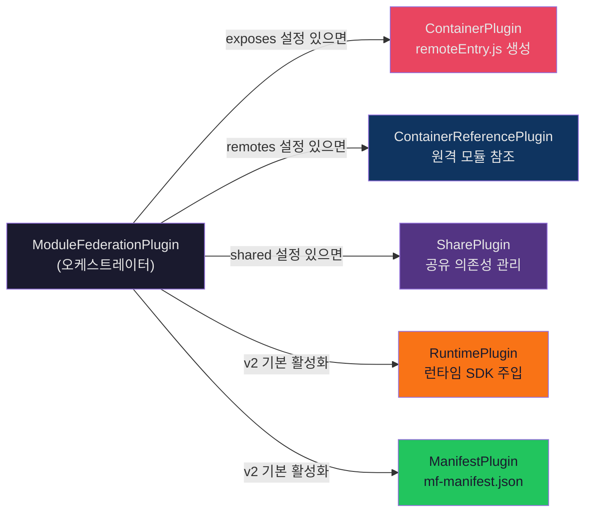

## 들어가며: "빌드 타임 마법"이라는 착각

`ModuleFederationPlugin` 하나를 설정에 추가하면 "어떻게든 된다." 많은 개발자들이 Module Federation을 이렇게 이해한다. 문제는 에러가 발생했을 때다. `ScriptExternalLoadError`, `Shared module is not available for eager consumption`, `Container initialization failed` — 이런 메시지 앞에서 "마법"은 무력하다.

이 글은 마법의 장막을 걷어낸다. `ModuleFederationPlugin`이라는 단일 API 뒤에서 5개의 서브 플러그인이 어떻게 조율되는지, `remoteEntry.js`가 왜 1~5KB밖에 안 되는지, Webpack의 어떤 컴파일 훅에서 Container가 탄생하는지를 코드 레벨로 추적한다.

---

## ModuleFederationPlugin: 오케스트라 지휘자

`ModuleFederationPlugin`은 실제 작업을 하지 않는다. 설정 객체를 읽고, 조건에 따라 서브 플러그인을 활성화하는 **오케스트레이터**다.



`exposes`가 없으면 ContainerPlugin은 동작하지 않는다. `remotes`가 없으면 ContainerReferencePlugin은 대기 상태다. 설정 객체가 "오늘의 편성표"이며, 지휘자는 이에 따라 실제 연주할 파트를 결정한다.

### 전체 설정 인터페이스

```typescript
new ModuleFederationPlugin({
  name: 'shop',                         // Container 이름 (필수)
  filename: 'remoteEntry.js',           // Container 엔트리 파일명
  exposes: {                            // 노출할 모듈
    './Button': './src/components/Button.tsx',
    './utils': './src/utils/index.ts'
  },
  remotes: {                            // 소비할 원격 앱
    checkout: 'checkout@http://localhost:3002/remoteEntry.js'
  },
  shared: {                             // 공유 의존성
    react: { singleton: true, requiredVersion: '^18.0.0', eager: true },
    'react-dom': { singleton: true, requiredVersion: '^18.0.0' }
  },
  runtimePlugins: ['./src/mf-plugins/ssr-fetch.ts'],  // 런타임 플러그인
  manifest: true,                       // 매니페스트 생성
  dts: { generateTypes: true }          // TypeScript 타입 생성 (v2)
});
```

---

## ContainerPlugin: remoteEntry.js는 어떻게 태어나는가

ContainerPlugin은 Webpack의 4가지 컴파일 훅에 등록하여 `remoteEntry.js`를 생성한다. 이 과정을 이해하면 빌드 에러의 80%를 해결할 수 있다.

### Webpack 컴파일 훅 4단계

```
1. thisCompilation
   "새로운 의존성 타입이 있습니다"
   → ContainerEntryDependency → ContainerEntryModuleFactory에 연결
   → ContainerExposedDependency → NormalModuleFactory에 연결

2. make (비동기)
   "이 가상 엔트리를 컴파일 그래프에 추가하세요"
   → compilation.addEntry(new ContainerEntryDependency(...))
   → 일반 엔트리(entry: './src/index.js')와 동일한 메커니즘

3. finishMake
   "모든 exposes 모듈이 빌드 완료되었는지 검증"
   → Container를 엔트리 포인트로 등록
   → 라이브러리 설정 적용

4. additionalTreeRuntimeRequirements
   "Federation 런타임 코드를 주입하세요"
   → FederationRuntimeModule 주입
   → Share Scope 관리 코드 주입
```

**핵심은 2단계 `make` 훅이다.** `compilation.addEntry()`를 통해 **가상 엔트리 포인트**를 동적으로 삽입한다. 실제 파일 시스템에 `remoteEntry.js`의 소스 파일은 존재하지 않는다. ContainerPlugin이 프로그래매틱하게 생성하는 합성 모듈(Synthetic Module)이다.

### 4가지 특수 의존성 타입

Module Federation은 Webpack 표준 의존성 시스템을 4개의 특수 클래스로 확장한다.

| 의존성 타입 | 역할 | 팩토리 |
|---|---|---|
| `ContainerEntryDependency` | 컴파일 엔트리를 Container 모듈에 연결 | `ContainerEntryModuleFactory` |
| `ContainerExposedDependency` | Container를 각 노출 모듈에 연결 | `NormalModuleFactory` |
| `RemoteToExternalDependency` | 원격 컨테이너를 external로 등록 | `ExternalModuleFactory` |
| `FallbackDependency` | 공유 폴백 모듈 해석 | `FallbackModuleFactory` |

모든 의존성은 `makeSerializable()`을 구현하여 Webpack 5의 영속 캐시 시스템과 호환된다. 캐시 파일에 직렬화되었다가, 다음 빌드 시 역직렬화되어 재사용된다.

### remoteEntry.js: 대사관의 전화번호부

`ContainerEntryModule.codeGeneration()` — 이 메서드가 `remoteEntry.js`의 실제 코드를 생성한다. 3단계로 진행된다.

#### Phase 1: Federation 인스턴스에 등록

```javascript
__webpack_require__.federation.instance.moduleCache[containerName] = {
  get: moduleMap,
  init: initFn
};
```

#### Phase 2: Expose Getters 생성

각 노출 모듈에 대해 **비동기 로더**를 생성한다. 실제 코드가 아닌 청크 참조만 포함한다.

```javascript
var moduleMap = {
  "./Button": () => {
    return __webpack_require__.e("src_Button_tsx")  // 비동기 청크 로딩
      .then(() => () => __webpack_require__("./src/Button.tsx"));
  },
  "./utils": () => {
    return __webpack_require__.e("src_utils_index_ts")
      .then(() => () => __webpack_require__("./src/utils/index.ts"));
  }
};
```

#### Phase 3: Container API 생성

```javascript
var get = (module, getScope) => {
  // moduleMap에서 모듈 팩토리 실행 → Promise 반환
};

var init = (shareScope, initScope) => {
  // 공유 스코프 등록 및 초기화
  __webpack_require__.S['default'] = shareScope;
};

export { get, init };
```

### remoteEntry.js가 1~5KB인 이유

이 구조를 보면 답이 명확하다. **remoteEntry.js에는 비즈니스 로직이 없다.**

| 포함되는 것 | 크기 |
|---|---|
| `get` 함수 | ~200 bytes |
| `init` 함수 | ~300 bytes |
| `moduleMap` (10개 exposes 기준) | ~500 bytes |
| Webpack 런타임 부트스트랩 | ~1-2KB |
| **합계** | **~2-3KB** |

| 포함되지 않는 것 | 위치 |
|---|---|
| 실제 컴포넌트 코드 | 비동기 청크 (`src_Button_tsx.js`) |
| CSS | 별도 에셋 |
| 공유 의존성 | Share Scope에서 런타임 해석 |

**네트워크 관점에서의 의미**: 10개 Remote 앱을 동시에 초기화할 때, v1 스타일이라면 `200KB × 10 = 2MB`의 초기 로드가 발생한다. v2에서는 `3KB × 10 = 30KB`. **98.5%의 초기 로드 크기 감소**다.

비유하자면 remoteEntry.js는 **대사관의 전화번호부**다. 대사관(Remote App)이 제공하는 서비스 목록과 연락처가 적혀 있을 뿐, 대사관 직원(실제 코드)이 안에 들어있지 않다. 호스트(외교부)는 번호부를 보관하다가 필요할 때 해당 번호로 전화(비동기 청크 로드)한다.

### Async Dependency Blocks: 코드 스플리팅의 비밀

각 노출 모듈이 별도 청크로 분리되는 메커니즘은 `AsyncDependenciesBlock`이다. `import()`가 파싱될 때 Webpack 내부에서 생성되는 것과 동일한 구조를 ContainerPlugin이 사용한다.

```
ContainerEntryModule
├─ AsyncDependenciesBlock (Button)
│   └─ ContainerExposedDependency → NormalModule (./src/Button.tsx)
│        ├─ SyncDependency → React
│        └─ SyncDependency → CSS module
│
├─ AsyncDependenciesBlock (utils)
│   └─ ContainerExposedDependency → NormalModule (./src/utils/index.ts)
│
└─ (remoteEntry.js에는 청크 ID 참조만 남음)
```

Host가 `container.get('./Button')`을 호출하면 Button 청크만 다운로드된다. utils 청크는 요청하지 않는 한 네트워크 비용이 0이다. 이것이 Module Federation 레벨의 자연스러운 코드 분할이다.

---

## SharePlugin: 빌드 타임과 런타임의 이중 처리

### 공유 설정 옵션 전체

```typescript
shared: {
  react: {
    version: '18.2.0',         // 명시적 버전 (기본: package.json에서 자동)
    singleton: true,           // 단일 인스턴스 강제
    requiredVersion: '^18.0.0', // semver 범위 요구
    eager: true,               // 동기식 로딩 (기본: false)
    strictVersion: false,      // 정확한 버전 매칭 강제
    shareKey: 'react',         // 대체 패키지 이름
    shareScope: 'default'      // 격리 스코프 이름
  }
}
```

### 빌드 타임 vs 런타임 협상

SharePlugin은 **두 단계**에 걸쳐 작동한다.

**빌드 타임**: `package.json`에서 실제 설치된 버전을 읽어 번들에 포함하고, 모든 가능한 버전의 모듈을 폴백용으로 번들에 포함시킨다.

```javascript
// 빌드 시 생성되는 Share Scope 초기화 코드
__webpack_share_scopes__['default'] = {
  react: {
    '18.2.0': {
      get: () => import('react'),  // non-eager: 비동기 팩토리
      loaded: false,
      from: 'shop',
      eager: false
    }
  }
};
```

**런타임**: 각 Container가 `init(shareScope)`를 호출할 때 실제 버전 협상이 발생한다. 모든 Remote가 등록한 버전 중 semver 범위를 만족하는 최고 버전이 선택된다.

### eager 모드의 트레이드오프

```
eager: false (기본)
  → import('react')로 비동기 로딩
  → 별도 청크 (vendors-react.js)
  → remoteEntry.js에 포함 안 됨 → 작은 크기 유지

eager: true
  → require('react')로 동기 로딩
  → 앱 초기 번들에 포함
  → 비동기 경계(async boundary) 불필요
  → 단, remoteEntry.js 크기 급증 가능
```

> **실전 규칙**: `eager: true`는 **Shell(Host) 앱에서만** 사용하라. Remote에서 `eager: true`를 설정하면 공유 의존성이 Remote 번들에도 포함되어 중복 번들링이 발생한다. "Shared module is not available for eager consumption" 에러의 80%가 이 설정 오류에서 시작된다.

### semver 협상의 한계

Webpack 내부는 "semver lite"라 불리는 간소화된 버전 비교를 사용한다. **프리릴리즈 버전(`1.0.0-beta.1`)** 처리에서 예상치 못한 동작이 발생할 수 있으며, 이는 장기 추적되는 알려진 한계다.

| 시나리오 | singleton | strictVersion | 동작 |
|---|---|---|---|
| Host: 18.2, Remote: 17.0 | false | - | 각자 자신의 버전 사용 |
| Host: 18.2, Remote: 17.0 | true | false | 18.2 사용, 콘솔 경고 |
| Host: 18.2, Remote: 17.0 | true | true | **런타임 에러** |
| Host: 18.2, Remote: 18.1 | true | false | 18.2 사용 (최고 호환) |

---

## ManifestPlugin: 서비스 디스커버리의 핵심

v2에서 추가된 `mf-manifest.json`은 단순한 파일 목록을 넘어, **런타임 서비스 디스커버리의 기반**이다.

### 생성 프로세스

ManifestPlugin은 Webpack `emit` 훅에서 실행된다. 빌드가 완료된 후 모든 청크 정보를 수집하여 JSON 매니페스트를 생성한다.

```
Webpack 컴파일 완료 → emit 훅
  → compilation.chunks 순회
  → ContainerPlugin 메타데이터 수집
  → 청크 해시, 파일 크기, 의존성 매핑
  → mf-manifest.json 직렬화
```

### 매니페스트 구조

```json
{
  "metaData": {
    "name": "shop",
    "type": "app",
    "buildVersion": "1.0.0",
    "remoteEntry": {
      "name": "remoteEntry.js",
      "path": "/static/remoteEntry.js",
      "type": "global"
    },
    "types": {
      "zip": "@mf-types.zip",
      "path": "/@mf-types.zip"
    }
  },
  "exposes": [{
    "id": "shop:./Button",
    "name": "./Button",
    "assets": {
      "js": { "async": ["src_Button_tsx.js"], "sync": [] },
      "css": { "async": ["Button.css"] }
    }
  }],
  "shared": [{
    "id": "shop:react",
    "name": "react",
    "version": "18.2.0",
    "singleton": true
  }]
}
```

### 매니페스트 vs 하드코딩 URL

```javascript
// v1 스타일: 빌드 타임에 URL 고정
remotes: { shop: 'shop@http://cdn.example.com/shop/remoteEntry.js' }

// v2 스타일: 매니페스트 기반 동적 디스커버리
remotes: [{ name: 'shop', entry: 'http://cdn.example.com/shop/mf-manifest.json' }]
```

매니페스트의 핵심 이점:
- **에셋 목록**을 알 수 있어 prefetch가 가능하다
- **타입 정의 위치**를 알 수 있어 자동 타입 소비가 가능하다
- **버전 정보**를 런타임에서 확인할 수 있다
- Remote가 빌드 결과물 구조를 변경해도 매니페스트만 업데이트하면 된다

### 네트워크 Waterfall 제거

매니페스트를 조기에 fetch하면 실제 모듈 요청 전에 브라우저의 prefetch 파이프라인을 채울 수 있다.

```
매니페스트 없이:
[0ms]   HTML → [100ms] main.js → [200ms] remoteEntry.js → [300ms] button.js → [400ms] 렌더링

매니페스트 활용:
[0ms]   HTML + mf-manifest.json 병렬 fetch
[50ms]  매니페스트 파싱 → button.js preload 시작
[100ms] main.js 완료, button.js 이미 50% 로드
[200ms] 렌더링 완료 → 50% 단축
```

---

## Webpack vs Rspack: 동일한 API, 다른 엔진

### 설정은 동일하다

```javascript
// Webpack
const { ModuleFederationPlugin } = require('@module-federation/enhanced');
// Rspack
const { ModuleFederationPlugin } = require('@module-federation/enhanced/rspack');
```

import 경로만 다르고 설정 인터페이스는 동일하다. **v2의 핵심 돌파구**: `@module-federation/runtime`이 번들러 독립 패키지이므로, Webpack으로 빌드한 Remote와 Rspack으로 빌드한 Host가 동일한 런타임 프로토콜로 통신할 수 있다.

### 내부 동작과 성능 차이

| 단계 | Webpack (JS) | Rspack (Rust) | 차이 원인 |
|---|---|---|---|
| 모듈 파싱 | ~60-70% 빌드 시간 | ~10-15x 빠름 | SWC 파서, 멀티스레드 |
| 의존성 그래프 구성 | 직렬 처리 | 병렬 처리 | Rayon 크레이트 |
| ContainerPlugin 처리 | JS 훅 체인 | Rust 네이티브 | 컨텍스트 스위칭 없음 |
| 청크 최적화 | 단일 스레드 | 병렬 청크 처리 | 워크 스틸링 스케줄러 |

### 실측 벤치마크

```
10개 Remote 포함 MF 프로젝트 기준:

콜드 빌드:    Webpack ~45-60s  →  Rspack ~8-12s   (5-7x)
HMR:          Webpack ~2-4s    →  Rspack ~200-400ms (8-10x)
메모리:       Webpack ~2-3GB   →  Rspack ~500MB-1GB (3-4x 절감)
```

### 선택 기준

```
Webpack이 적합한 경우:
  ✓ 기존 커스텀 플러그인 생태계에 의존
  ✓ 검증된 안정성이 최우선
  ✓ 팀의 Webpack 전문성이 높음

Rspack이 적합한 경우:
  ✓ 빌드 속도가 핵심 병목
  ✓ 대규모 MF 프로젝트 (10+ Remote)
  ✓ CI/CD 비용 절감이 중요
  ✓ 신규 프로젝트 또는 마이그레이션 여력
```

---

## 빌드 산출물 구조

```
dist/
├── remoteEntry.js              (1~5KB) 대사관 전화번호부
├── mf-manifest.json            (2~5KB) 서비스 메타데이터 (v2)
├── @mf-types.zip               TypeScript 타입 번들 (v2)
│
├── src_components_Button_tsx.js  노출 모듈별 비동기 청크
├── src_utils_index_ts.js         노출 모듈별 비동기 청크
├── vendors-react.js              shared 라이브러리 청크
│
├── main.js                       앱 자체 엔트리 (Host인 경우)
└── main.js.map                   소스맵
```

### 각 파일의 생성 주체

```
ContainerPlugin → remoteEntry.js + 노출 모듈 청크
SharePlugin     → vendors-react.js (shared 청크)
ManifestPlugin  → mf-manifest.json
DTS Plugin      → @mf-types.zip
일반 Webpack    → main.js (앱 자체 코드)
```

### CDN 캐싱 전략: 두 가지 파일의 본질적 차이

```nginx
# remoteEntry.js, mf-manifest.json — 항상 최신이어야 하는 진입점
location ~* ^(remoteEntry\.js|mf-manifest\.json)$ {
    add_header Cache-Control "public, max-age=60, stale-while-revalidate=300";
}

# Content Hash 포함 청크 — 영구 캐시
location ~* \.[0-9a-f]{8,20}\.(js|css)$ {
    add_header Cache-Control "public, max-age=31536000, immutable";
}
```

**배포 순서가 성능을 결정한다:**
1. Content Hash 청크 업로드 (새 URL → 기존 캐시에 영향 없음)
2. 모든 CDN Edge 전파 확인 (30초 대기)
3. remoteEntry.js + mf-manifest.json 업로드 (max-age=60이므로 최대 60초 내 갱신)
4. Canary 검증 후 완료

---

## NX 빌드 오케스트레이션

모노레포에서 20개 이상의 Module Federation 앱을 효율적으로 빌드하려면 의존성 순서 관리가 필수다.

### 빌드 순서 자동 관리

```
NX가 Module Federation 설정을 스캔:
  shell-app → remotes: ['payment-service', 'cart-service']
  payment-service → remotes: ['auth-service']

위상 정렬(topological sort) 결과:
  Tier 1 (병렬): auth-service, cart-service
  Tier 2:        payment-service (auth-service 완료 후)
  Tier 3:        shell-app (모든 Remote 완료 후)
```

### NX + MF 최적화의 핵심: 영향 분석

```bash
# 변경된 앱만 빌드 (nx affected)
pnpm nx affected --target=build --parallel=5

# 캐시 히트율 70-85% → CI 시간 60-80% 절감
```

NX는 `module-federation.config.js`의 `remotes` 배열을 분석하여 암묵적 의존성을 명시적 그래프 엣지로 변환한다. 하나의 Remote만 변경되면, 해당 Remote와 그것을 참조하는 Host만 재빌드한다.

---

## 트러블슈팅: 흔한 실수와 진단

| 실수 | 증상 | 진단 |
|---|---|---|
| `exposes` 키에 `./` 누락 | 모듈 로드 실패, undefined | `mf-manifest.json`의 exposes 필드 확인 |
| `shared`에 `singleton` 누락 | "Invalid hook call" | React DevTools로 인스턴스 수 확인 |
| Remote URL 오타 | `ScriptExternalLoadError` | 네트워크 탭 404 |
| Remote에서 `eager: true` | 공유 의존성 중복 번들링 | Bundle Analyzer로 크기 확인 |
| 배럴(barrel) 파일 expose | 거대한 단일 청크 | 개별 모듈로 분리 |
| `splitChunks`가 MF 청크 침범 | 예측 불가능한 청크 분할 | chunks 필터에서 remoteEntry 제외 |

```javascript
// 안전한 splitChunks 설정
optimization: {
  splitChunks: {
    chunks: (chunk) => !chunk.name?.includes('remoteEntry'),
  }
}
```

### v2 디버깅 필수 도구

1. **`mf-manifest.json` 확인** — 빌드 직후 첫 번째 디버깅 단계
2. **Runtime Plugin 디버깅** — `errorLoadRemote` 훅에서 실패 단계 식별
3. **Rsdoctor** (`npx @rsdoctor/cli analyze`) — MF 청크 관계, 중복 모듈 탐지

---

## 정리

| 컴포넌트 | 역할 | 핵심 산출물 |
|---|---|---|
| ModuleFederationPlugin | 오케스트레이터 | (직접 산출물 없음) |
| ContainerPlugin | remoteEntry.js 생성 | 1~5KB 컨테이너 엔트리 + 비동기 청크 |
| SharePlugin | 공유 의존성 관리 | 공유 라이브러리 청크 + 버전 메타데이터 |
| ManifestPlugin | 서비스 디스커버리 | mf-manifest.json |
| RuntimePlugin | 런타임 SDK 주입 | 번들러 독립 런타임 코드 |

빌드 타임에 결정되는 것: 어떤 모듈을 노출하는가, 어떤 버전의 공유 의존성을 제공하는가, 청크의 Content Hash.

런타임에 결정되는 것: 어떤 버전의 공유 의존성을 실제로 사용하는가, 어떤 청크를 실제로 다운로드하는가.

이 경계를 이해하면 "빌드를 다시 해야 하나, 안 해도 되나"라는 질문에 즉시 답할 수 있다.

> 다음 편: [04-타입-시스템과-DX.md](4.module-federation-type-system-DX.md) — DTS 플러그인, WebSocket 타입 서버, Chrome DevTools
