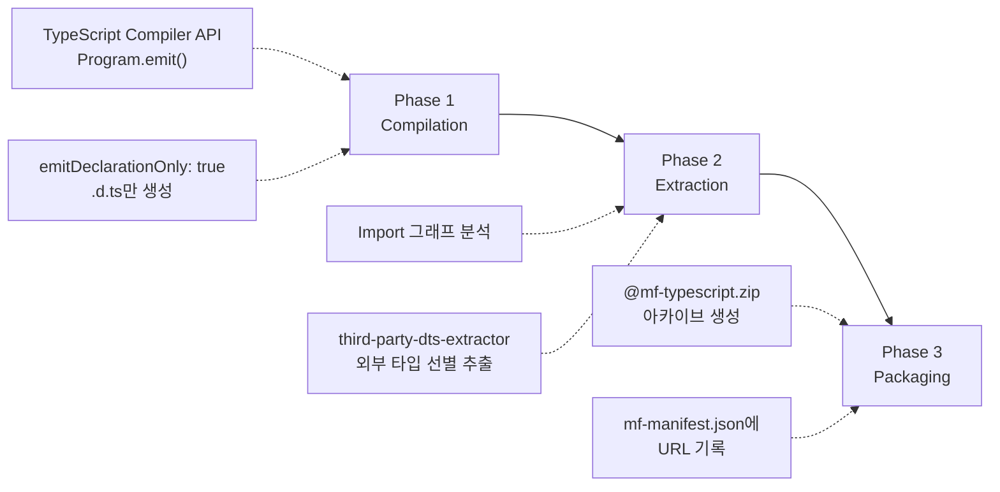
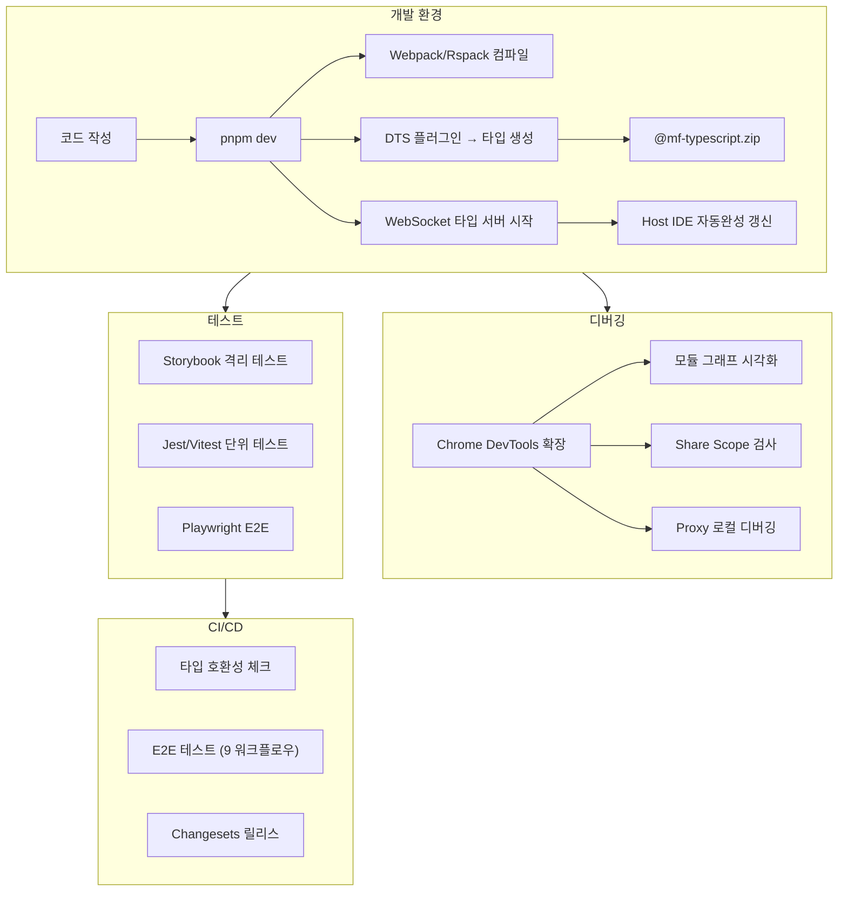

## `any`의 무게

2020년, Module Federation v1이 Webpack 5와 함께 세상에 나왔을 때, 마이크로프론트엔드 커뮤니티는 열광했다. 드디어 독립 배포되는 앱 사이에 런타임 모듈 공유가 가능해진 것이다.

그런데 TypeScript를 쓰는 팀에게는 치명적인 문제가 하나 있었다.

```typescript
// v1: Remote 모듈을 가져오는 순간
const Button = await loadRemote('shop/Button');
// Button의 타입? → any
// props? → 알 수 없음
// 오타? → 프로덕션에서 발견
```

모놀리식 앱에서 `import { Button } from '../components/Button'`으로 완벽한 타입 안전성을 누리던 팀이, 마이크로프론트엔드로 전환하는 순간 TypeScript의 핵심 가치를 잃었다. 아키텍처 경계에서 타입이 소실되는 이 현상은 단순한 불편이 아니었다. 팀 간 계약(contract)이 사라지는 것이었다.

이 글에서는 Module Federation v2가 이 문제를 어떻게 해결했는지, 그리고 그 과정에서 개발자 경험(DX)을 어떻게 근본적으로 재설계했는지를 코드베이스 수준에서 분석한다.

---

## 타입 공유 문제의 계보

v2의 해법을 이해하려면, 그 이전에 사람들이 무엇을 시도했는지 알아야 한다.

### 수동 타입 선언 파일 시대

가장 원시적인 접근은 각 팀이 `remote.d.ts`를 수동으로 작성하고 npm 패키지로 배포하는 것이었다.

```typescript
// @shop/types 패키지 (수동 작성)
declare module 'shop/Button' {
  export interface ButtonProps {
    label: string;
    variant?: 'primary' | 'secondary';
  }
  export const Button: React.FC<ButtonProps>;
}
```

문제는 명백했다. 실제 구현과 타입이 동기화되지 않았다. Remote 팀이 `variant`에 `'ghost'`를 추가해도, 타입 패키지가 업데이트되지 않으면 Host 팀은 알 수 없었다. npm publish → install → 재빌드라는 사이클은 하루에도 수십 번 변경이 일어나는 개발 환경에서 현실적이지 않았다.

### TypeScript 기존 해법의 한계

TypeScript 생태계의 기존 도구들도 이 문제에 적합하지 않았다.

| 접근 방식 | 작동 범위 | 한계 |
|----------|----------|------|
| `tsconfig.json` paths alias | 단일 레포 | 런타임 모듈과 타입이 분리됨, 실제 Remote 모듈과 무관 |
| Project References | 단일 레포 | 멀티레포에서 작동하지 않음, 빌드 오케스트레이션 복잡 |
| `@microsoft/api-extractor` | 패키지 수준 | Webpack 파이프라인과 별도 실행, 설정 복잡도 높음 |
| `dts-bundle-generator` | 패키지 수준 | 빌드 파이프라인 외부 도구, 자동화 어려움 |

이 모든 도구의 공통적 한계는 **빌드 파이프라인과 분리되어 있다**는 것이었다. 타입 생성이 번들링과 별개의 프로세스로 실행되는 이상, 동기화는 개발자의 규율에 의존할 수밖에 없었다.

### `fork-ts-checker-webpack-plugin`의 교훈

한 가지 중요한 선례가 있었다. 2018년 등장한 `fork-ts-checker-webpack-plugin`은 TypeScript 타입 체킹을 `child_process.fork()`로 별도 워커에서 실행하는 아이디어를 도입했다. 메인 Webpack 컴파일과 타입 체킹을 병렬로 수행하여 빌드 블로킹을 방지한 이 접근법이 Module Federation v2의 `compileInChildProcess` 설계에 직접적인 영감을 주었다.

---

## DTS 플러그인: 빌드 파이프라인에 타입을 심다

Module Federation v2의 핵심 발상은 단순하지만 강력하다. **타입 생성을 빌드 프로세스의 일부로 만든다.** 번들러가 코드를 번들링할 때, 동시에 타입도 생성하고 패키징한다.

### 3단계 파이프라인



**Phase 1: Compilation** — TypeScript Compiler API를 직접 호출하여 exposed 모듈의 `.d.ts` 파일을 생성한다. 핵심은 `emitDeclarationOnly: true` 옵션으로, JavaScript 번들링 없이 타입 정보만 추출한다.

```typescript
// DTS 플러그인 내부 동작 (개념적 재현)
const options: ts.CompilerOptions = {
  ...tsConfig,
  declaration: true,
  emitDeclarationOnly: true,  // JS 출력 없이 .d.ts만
  noEmit: false,
};

const program = ts.createProgram(entryFiles, options);

// writeFile 콜백으로 파일 시스템 대신 메모리에 수집
const dtsFiles = new Map<string, string>();
program.emit(
  undefined,
  (fileName, content) => {
    if (fileName.endsWith('.d.ts')) {
      dtsFiles.set(fileName, content);
    }
  },
  undefined,
  true  // emitOnlyDtsFiles
);
```

`Program.emit()`이 생성하는 `.d.ts`는 TypeScript 타입 체커가 이미 분석한 AST를 기반으로 한다. 이것은 단순한 텍스트 변환이 아니라, 컴파일러 수준의 정밀한 타입 추출이다.

**Phase 2: Extraction** — `@module-federation/third-party-dts-extractor`가 외부 라이브러리 타입을 지능적으로 추출한다. 이 단계가 왜 필요한지는 간단한 예시로 이해할 수 있다.

```typescript
// Remote의 Button.tsx
import { motion } from 'framer-motion';
import type { TargetAndTransition } from 'framer-motion';

export const Button = ({ animate }: { animate: TargetAndTransition }) => {
  return <motion.button animate={animate}>Click</motion.button>;
};
```

`TargetAndTransition`은 framer-motion의 타입이다. Host에 framer-motion이 설치되어 있지 않다면, 생성된 `.d.ts`가 이 타입을 참조할 때 해석이 불가능하다. Extractor는 이 문제를 3단계로 해결한다.

1. **Import 그래프 분석**: exposed 모듈에서 시작하여 AST의 `ImportDeclaration`, `ExportDeclaration` 노드를 방문하며 의존성 엣지를 기록
2. **외부 의존성 식별**: `node_modules`에 속한 타입 참조를 식별하되, Host가 자체 해결할 수 있는 범용 타입(React, 표준 라이브러리)은 제외
3. **타입 Pruning**: 식별된 외부 타입 중 exposed 인터페이스에서 실제 참조되는 심볼만 추출. 미사용 오버로드, 내부 구현 타입은 제거

이 과정에서 전이적 의존성(transitive dependency)도 추적된다. A 타입이 B 타입을 참조하고, B가 C 타입을 반환한다면, C 타입도 아카이브에 포함된다.

**Phase 3: Packaging** — 생성된 `.d.ts` 파일들을 `@mf-typescript.zip`으로 패키징한다.

```
@mf-typescript.zip
├── Button.d.ts              ← exposed 모듈의 타입
├── utils.d.ts               ← exposed 모듈의 타입
├── _internal/
│   └── shared-types.d.ts    ← 공유 타입 (pruning된 외부 타입 포함)
└── index.d.ts               ← barrel file
```

ZIP 형식을 선택한 이유는 원자적(atomic) 전송이다. 수십 개의 `.d.ts` 파일을 개별 HTTP 요청으로 전송하는 대신, 단일 아카이브로 전달하면 네트워크 라운드트립을 최소화하고, 부분적 업데이트로 인한 불일치 상태를 방지한다.

### 설정

```typescript
new ModuleFederationPlugin({
  name: 'shop',
  exposes: { './Button': './src/Button.tsx' },
  dts: {
    generateTypes: true,          // 타입 생성 활성화
    generateAPITypes: true,       // API 수준 타입도 생성
    extractThirdParty: false,     // 서드파티 타입 추출 (기본: false)
    compileInChildProcess: true,  // 별도 프로세스에서 컴파일
    compilerInstance: 'tsc'       // 사용할 TS 컴파일러
  }
});
```

`@module-federation/enhanced`를 사용하면 타입 힌팅이 **기본 활성화**된다. 이것은 "Pit of Success" 설계 원칙의 직접적 구현이다. 타입 안전성이 옵트인이 아닌 기본값이 되면, 개발자는 의식적 노력 없이도 더 안전한 코드를 작성하게 된다.

### `compileInChildProcess`의 실질적 효과

TypeScript 컴파일은 CPU 집약적 작업이다. 전체 타입 그래프를 분석해야 하기 때문에, 대규모 프로젝트에서는 수십 초가 소요될 수 있다.

```
메인 빌드 프로세스 (Webpack/Rspack)
    │
    ├─ [afterEmit hook] ──→ child_process.fork('./dts-worker.js')
    │                              │
    │   (메인 빌드 계속 진행)         ├─ TypeScript Language Service 초기화
    │                              ├─ 증분 컴파일 실행
    │                              ├─ .d.ts 파일 생성
    │                              └─ IPC: process.send({ type: 'DONE', files })
    │
    └─ IPC 수신 → zip 패키징 → 매니페스트 업데이트
```

`fork()`를 선택한 이유는 IPC 채널이 자동으로 설정되기 때문이다. 생성된 파일 목록, 오류, 타입 해시 등 구조화된 객체를 `process.send()`/`process.on('message')`로 직렬화 없이 주고받을 수 있다.

실질적인 빌드 시간 영향:

| 프로젝트 규모 | compileInChildProcess: false | compileInChildProcess: true |
|---|---|---|
| 소규모 (~50 파일) | +2초 빌드 추가 | +0.1초 (병렬) |
| 중규모 (~200 파일) | +8초 빌드 추가 | +0.3초 (병렬) |
| 대규모 (500+ 파일) | +25초+ 빌드 추가 | +0.5초 (병렬) |

타입 컴파일이 메인 번들링과 완전히 병렬로 실행되므로, 메인 빌드에 추가되는 시간은 거의 무시할 수 있는 수준이 된다.

---

## WebSocket 타입 서버: 분산 환경의 LSP

DTS 플러그인의 빌드 타임 타입 생성만으로도 큰 진보지만, v2의 진짜 혁신은 **개발 중 실시간 타입 스트리밍**에 있다.

### Language Server Protocol에서의 영감

2015년 Microsoft가 TypeScript 언어 서버 경험을 기반으로 Language Server Protocol(LSP)을 표준화했을 때, 핵심 아이디어는 "M개 에디터 × N개 언어 = M×N 구현"이라는 비효율을 "M+N"으로 줄이는 것이었다. 하나의 언어 서버가 모든 에디터와 표준 프로토콜로 통신한다.

Module Federation v2의 WebSocket 타입 서버는 이 LSP 패러다임의 **분산 확장**이다. 단일 머신의 언어 서버 대신, 원격 마이크로프론트엔드의 타입 서버가 WebSocket으로 Host IDE에 타입을 실시간 전달한다.

### 동작 원리

```
Remote 앱 (dev server)
  │
  ├── chokidar: 소스 코드 변경 감지
  │     └── awaitWriteFinish: { stabilityThreshold: 200ms }
  │
  ├── debounce(300ms) → 영향받은 모듈만 선별
  │
  ├── TypeScript 증분 컴파일 (createIncrementalProgram)
  │     └── .tsbuildinfo 캐시 재사용 → 변경 파일만 재컴파일
  │
  └── WebSocket 서버 (ws 라이브러리)
        │
        └── 브로드캐스트:
             { type: "mf-types-update",
               remoteName: "shop",
               zipUrl: ".../@mf-typescript.zip?t=1234567890",
               hash: "a3f8c92d" }

             Host 앱 (dev server)
               │
               ├── WebSocket 클라이언트가 수신
               ├── 새 zip 다운로드 → @mf-types/shop/ 압축 해제
               ├── tsserver에 파일 변경 이벤트 전달
               │     └── DidChangeWatchedFilesNotification (LSP 프로토콜)
               └── IDE가 타입 캐시 무효화 → 자동 IntelliSense 갱신
```

증분 컴파일의 핵심은 TypeScript의 `createIncrementalProgram` API다.

```typescript
// 이전 프로그램(builderProgram)을 재사용하여 변경 파일만 재컴파일
builderProgram = ts.createEmitAndSemanticDiagnosticsBuilderProgram(
  rootNames, options, host, builderProgram  // 이전 프로그램 전달
);
// 변경된 .d.ts만 추출하여 WebSocket으로 전송
```

파일 감시에는 `chokidar`를 사용한다. Node.js의 `fs.watch()`가 macOS(kqueue), Linux(inotify), Windows(ReadDirectoryChangesW) 간에 동작이 달라지는 문제를 추상화한다. 특히 macOS에서 `fs.watch()`가 디렉토리 이동 이벤트를 누락하는 버그가 있어, 프로덕션 도구들은 chokidar를 표준으로 채택하고 있다.

### 재연결 전략

WebSocket 연결이 끊어지는 원인은 크게 세 가지다: 네트워크 일시 단절, 프록시의 idle timeout, Remote dev server 재시작. 이에 대응하는 Exponential Backoff with Jitter가 적용된다.

```typescript
const createReconnectStrategy = () => {
  let attempt = 0;
  const BASE_DELAY = 1000;    // 1초
  const MAX_DELAY = 30000;    // 30초 상한
  const JITTER_FACTOR = 0.3;  // 30% 무작위 지터

  return () => {
    const exponential = Math.min(BASE_DELAY * Math.pow(2, attempt), MAX_DELAY);
    const jitter = exponential * JITTER_FACTOR * Math.random();
    attempt++;
    return exponential + jitter;
  };
};
// 재연결 간격: 1s → 2.3s → 4.7s → 9.2s → 18.8s → 30s (상한)
```

Jitter는 다수의 Host가 동시에 재연결을 시도하여 Remote 서버에 "thundering herd" 현상이 발생하는 것을 방지한다.

### 개발자가 경험하는 흐름

1. Remote 팀이 `Button` 컴포넌트에 `disabled` prop을 추가
2. Remote dev server의 chokidar가 변경 감지 → 300ms 디바운스
3. 증분 컴파일로 `Button.d.ts`만 재생성
4. WebSocket으로 Host에 새 타입 전송
5. Host의 `@mf-types/shop/` 디렉토리 업데이트
6. VS Code tsserver가 `DidChangeWatchedFilesNotification` 수신
7. Host 개발자의 IDE에서 `disabled` prop이 자동완성에 즉시 등장

**별도의 npm publish → install → 재빌드 없이**, 마치 같은 모노레포에서 작업하는 것 같은 경험이다.

### 기업 환경의 네트워크 이슈

기업 네트워크에서 WebSocket은 세 가지 차단 시나리오에 직면한다.

| 시나리오 | 증상 | 해결책 |
|---------|------|--------|
| HTTP 프록시가 Upgrade 차단 | 연결 즉시 실패 | `wss://` (WebSocket over TLS) 사용 |
| Idle timeout (30-60초) | 비활성 후 끊김 | 25초 간격 ping frame 전송 |
| HTTPS 환경에서 `ws://` 차단 | Mixed Content 경고 | 개발 서버 TLS 설정 또는 localhost 예외 |

### 대규모 팀의 연결 관리

Host가 N개의 Remote에 각각 WebSocket을 연결하면 연결 수가 선형으로 증가한다. 소규모 팀(Remote 3-5개)에서는 직접 연결이 충분하지만, 대규모 팀(Remote 20개 이상)에서는 Type Broker 패턴이 필요할 수 있다.

```
직접 연결 (소규모):           Type Broker (대규모):
Host ──→ Remote A             Host ──→ Broker ──→ Remote A
Host ──→ Remote B                              ──→ Remote B
Host ──→ Remote C                              ──→ Remote C

연결 수: N개                  연결 수: 1개 (Host 기준)
```

Broker는 구독 기반 라우팅으로, 해당 Remote를 실제로 사용하는 Host에게만 타입 업데이트를 전달한다.

---

## Host에서의 타입 소비

### 빌드 타임 (정적 소비)

CI/CD 환경에서는 매니페스트의 `typesPath`에서 zip을 다운로드하고 압축 해제한다.

```json
// mf-manifest.json (Remote가 생성)
{
  "metaData": {
    "name": "shop",
    "types": {
      "zip": "./static/@mf-typescript.zip",
      "api": "./static/@mf-types"
    }
  }
}
```

```json
// Host의 tsconfig.json
{
  "compilerOptions": {
    "paths": {
      "shop/*": ["./node_modules/@mf-types/shop/dist/*"]
    }
  }
}
```

### CDN 캐싱 전략

타입 아카이브의 CDN 전략은 콘텐츠 해시 기반 이중 전략이 효과적이다.

```
매니페스트 (항상 최신):
  https://cdn.example.com/shop/latest/mf-manifest.json
  Cache-Control: no-cache, no-store

타입 아카이브 (불변):
  https://cdn.example.com/shop/[contenthash]/@mf-typescript.zip
  Cache-Control: public, max-age=31536000, immutable
```

매니페스트는 `no-cache`로 항상 최신 버전을 가리키고, 타입 zip은 해시 기반 URL로 영구 캐싱을 적용한다. CDN 비용 최소화와 즉시 업데이트를 동시에 달성하는 구조다.

### 개발 타임 (동적 소비)

개발 환경에서는 DTS 플러그인이 자동으로 처리한다. `dts: true`만 활성화하면 WebSocket 연결, 타입 다운로드, tsconfig 경로 매핑이 모두 자동이다.

### CLI 도구

```bash
mf generate-types     # 타입 정의 생성 (Producer)
mf fetch-types        # 원격 타입 다운로드 (Consumer)
```

CLI는 `commander` 기반 파서와 `jiti`(TypeScript 직접 실행)로 구현되어 있다. Progressive Disclosure 원칙을 따라, 기본 실행은 설정 파일만 있으면 충분하고, `--tsConfigPath`, `--cwd` 같은 옵션으로 점진적으로 제어를 넓힌다.

---

## 타입 자동 생성의 한계

DTS 플러그인이 모든 타입 문제를 완벽하게 해결하는 것은 아니다. 알려진 한계들을 정직하게 짚어보자.

### 복잡한 타입 처리

TypeScript 4.1에서 도입된 template literal types와 recursive conditional types는 DTS 생성기에 도전을 제기한다. TypeScript 컴파일러 자체에서도 대규모 string literal union의 conditional type 처리 시 성능 문제가 확인된다(이슈 #47481 — 10,000×10,000 union 처리에 19초).

DTS 플러그인이 이런 복잡한 타입을 포함하는 exposed 모듈을 처리할 때, 정확한 타입 보존 대신 `string`이나 더 넓은 타입으로 widening하는 경향이 있다. 타입 안전성의 정밀도 손실이다.

### 간접 의존성 문제

GitHub 이슈 #2841에서 확인된 것처럼, 직접 import된 타입은 잘 처리하지만 "간접적으로 의존하는 타입"에서 불완전한 타입 정의가 생성되는 경우가 있다. A 컴포넌트가 내부적으로 B 라이브러리의 타입을 사용하지만 외부에 노출하지 않는 경우, B의 타입이 누락된 채 `.d.ts`가 생성되어 Consumer 측에서 `any` 추론이 발생할 수 있다.

### 동적 모듈 경로

```typescript
// 런타임에 결정되는 Remote 이름 → 정적 분석 불가능
const moduleName = getRemoteByRegion(userRegion);
const Component = await loadRemote(`${moduleName}/Dashboard`);
// 여전히 any
```

### 타입 아카이브 크기 관리

대규모 프로젝트에서 `@mf-typescript.zip`이 수십 MB로 커지는 경우가 발생한다. 주요 원인과 대응:

```typescript
// 1. 외부 라이브러리 타입 중복 포함 방지
dts: {
  extraOptions: {
    externalLibraries: ['@mui/material', '@ant-design/icons'],
    // Host가 직접 설치할 패키지는 추출에서 제외
  }
}

// 2. 공개 API 표면 최소화
// src/index.ts - barrel export로 필요한 것만 노출
export { Button } from './components/Button';
export type { ButtonProps } from './components/Button';
// 내부 구현은 expose하지 않음

// 3. 빌드 캐싱
// .tsbuildinfo 활용으로 증분 컴파일
// CI에서 이전 빌드 상태를 캐시하여 재사용
```

---

## Chrome DevTools 확장: 보이지 않는 것을 보다

v1 시대의 마이크로프론트엔드 디버깅은 `console.log`와 브라우저 네트워크 탭에 의존했다. "어떤 Remote가 로드되었는지", "어떤 버전의 공유 라이브러리가 사용되고 있는지", "왜 특정 모듈이 로딩에 실패했는지" — 모든 질문에 답하려면 런타임 코드를 뒤져야 했다.

### 아키텍처

```
Chrome DevTools Panel
  ├── Module Info: 로드된 모듈 버전, entry address, expose/shared
  ├── Dependency Graph: ReactFlow 기반 모듈 관계 시각화
  ├── Share Scope Inspector: 공유 의존성 버전 충돌 감지
  └── Proxy: 프로덕션 Remote를 로컬 dev server로 프록시

    ↕ Chrome DevTools Protocol (WebSocket JSON-RPC)

페이지 런타임
  ├── window.__FEDERATION__.instance (FederationHost 접근)
  ├── shareScopeMap (공유 의존성 상태)
  └── 모듈 로딩 이벤트 캡처
```

DevTools 확장은 Chrome DevTools Protocol(CDP)을 통해 페이지 런타임과 통신한다. CDP 자체가 WebSocket 위에서 동작하는 JSON-RPC 2.0 프로토콜이다.

```json
// DevTools → Chrome: Share Scope 읽기
{
  "method": "Runtime.evaluate",
  "params": {
    "expression": "JSON.stringify(__FEDERATION__.instance.shareScopeMap)",
    "returnByValue": true
  }
}
```

### 실제 디버깅 시나리오

**시나리오 1: React Hooks 에러의 원인 추적**

```
증상: "Invalid hook call. Hooks can only be called inside a React component"
```

이 에러는 보통 React가 두 개의 인스턴스로 로드되었을 때 발생한다. 기존에는 네트워크 탭에서 번들을 하나씩 분석해야 했지만, DevTools의 Share Scope Inspector에서 즉시 확인 가능하다.

```
Share Scope: 'default'
├── react
│   ├── 18.2.0 (from: host-app) ✓ loaded
│   └── 18.3.1 (from: shop-remote) ✗ not loaded → ⚠️ 버전 불일치!
├── react-dom
│   └── 18.2.0 (from: host-app) ✓ loaded
```

`requiredVersion` 불일치로 두 React 버전이 공존하는 상태를 시각적으로 확인하고, `shared` 설정에서 `requiredVersion`을 조정하여 해결할 수 있다.

**시나리오 2: 번들 크기 이상의 원인 파악**

```
증상: 초기 로드가 예상보다 2배 느림
```

Dependency Graph에서 `lodash@4.17.21`이 5개 Remote에서 각각 번들링된 것을 발견. `shared` 설정에 `lodash`를 추가하여 중복 로드를 제거한다.

**시나리오 3: Proxy를 활용한 로컬 디버깅**

DevTools의 Proxy 기능은 프로덕션 환경의 Remote를 로컬 개발 서버로 리다이렉션한다. 실제 프로덕션 Host에서 로컬에서 수정 중인 Remote 코드를 테스트할 수 있어, 환경 재현 비용이 크게 줄어든다.

### CDP 성능 최적화

CDP 기반 인스트루멘테이션은 직렬화 비용(V8 힙 → JSON), IPC 레이턴시, 훅 실행 비용이라는 세 가지 오버헤드를 유발한다. 이를 최소화하기 위해 이벤트 배치 전송 패턴이 적용된다.

```typescript
// 개별 이벤트마다 CDP 메시지를 보내는 대신 16ms(1 프레임) 단위 배치
class CDPEventBatcher {
  private queue: ModuleEvent[] = [];
  push(event: ModuleEvent) {
    this.queue.push(event);
    if (this.queue.length === 1) {
      setTimeout(() => this.flush(), 16);
    }
  }
  private flush() {
    window.__CDP_MF_BRIDGE__(JSON.stringify({
      type: 'batch', events: this.queue
    }));
    this.queue = [];
  }
}
```

또한 DevTools 패널이 열려 있지 않을 때는 인스트루멘테이션 자체를 비활성화하여 런타임 오버헤드를 제로로 유지한다.

---

## Storybook 통합: 격리 테스트의 해법

마이크로프론트엔드의 가장 큰 테스트 문제는 격리 테스트의 어려움이다. Remote 컴포넌트를 테스트하려면 전체 Host 환경을 구동해야 했다.

`@module-federation/storybook-addon`은 Module Federation 설정을 Storybook에 그대로 주입한다.

```javascript
// .storybook/main.js
module.exports = {
  addons: ['@module-federation/storybook-addon']
};
```

```typescript
// Remote의 Button을 Host의 Storybook에서 직접 렌더링
import { Button } from 'shop/Button';  // Federation import

export default {
  title: 'Remote/Shop/Button',
  component: Button,
};

export const Primary = {
  args: { label: 'Click me', variant: 'primary' },
};
```

Federation 컨텍스트가 Storybook 환경에 통합되므로, Remote 컴포넌트를 Host 없이 독립적으로 스토리화할 수 있다. HMR도 정상 작동하여 개발-테스트 피드백 루프가 즉각적이다.

---

## 테스트 인프라

### 패키지별 테스트 프레임워크

| 패키지 | 프레임워크 | 특이사항 |
|--------|-----------|----------|
| runtime / runtime-core | Jest | 다중 환경(Browser/Node) 테스트 |
| enhanced | Jest | 70+ 테스트 스위트, 메모리 최적화 필수 |
| dts-plugin | Jest | TypeScript 컴파일 테스트 |
| devtools | Vitest | Modern.js 기반 |

### E2E 테스트: 다중 앱 동시 기동

Module Federation E2E 테스트의 복잡성은 Host-Remote 양측 DevServer를 동시에 실행해야 한다는 점이다. Playwright의 `webServer` 배열 설정이 이를 해결한다.

```typescript
// playwright.config.ts
export default defineConfig({
  webServer: [
    {
      command: 'pnpm --filter remote dev --port 3001',
      port: 3001,
      timeout: 120000,  // 타입 컴파일 완료 대기 포함
    },
    {
      command: 'pnpm --filter host dev --port 3000',
      port: 3000,
      timeout: 120000,
    },
  ],
});
```

9개의 특화된 E2E 워크플로우 — Next.js 통합, Modern.js SSR, Manifest 프로토콜, Node.js 런타임, React Native Metro 등 — 가 이 패턴을 각 환경에 맞게 변형하여 사용한다.

### CI에서의 타입 호환성 검증

타입 호환성을 CI에 통합하는 핵심은 "타입 소비 테스트(Type Consumption Test)"다.

```yaml
# 1. Remote의 타입 아카이브 다운로드
- name: Fetch remote types
  run: |
    curl -O $(jq -r '.metaData.types.zip' mf-manifest.json)
    unzip @mf-typescript.zip -d node_modules/@mf-types/remote

# 2. Host에서 Remote 타입을 소비하는 tsc 체크
- name: Type compatibility check
  run: pnpm --filter host tsc --noEmit
```

Remote가 breaking change를 배포하면, Host의 CI에서 타입 에러가 발생하여 배포 전에 잡을 수 있다.

---

## 개발 워크플로우 전체 그림



---

## DX 혁신의 측정 가능한 효과

### "개발자가 인프라가 아닌 제품에 집중할 수 있는 환경"

DORA 2024 보고서에 따르면, 내부 개발자 플랫폼(IDP) 채택은 개인 생산성을 평균 8%, 팀 생산성을 평균 10% 개선했다. 보고서가 식별한 7가지 팀 아키타입 중 고성과 팀의 공통 특징은 "인프라 관리가 아닌 제품 개발에 집중할 수 있는 환경"이었다.

Module Federation v2의 DX 도구들은 정확히 이 방향을 지향한다.

### Before vs After

| 영역 | v1 (Before) | v2 (After) |
|------|-------------|------------|
| **타입 안전성** | Remote 모듈은 항상 `any` | 실시간 TypeScript 타입, 빌드 타임 검증 |
| **디버깅** | console.log + 네트워크 탭 | Chrome DevTools 모듈 그래프 + Share Scope Inspector |
| **타입 동기화** | npm publish → install → 재빌드 | WebSocket 실시간 스트리밍 (수초 이내) |
| **모듈 디스커버리** | URL 하드코딩 | 매니페스트 기반 디스커버리 |
| **격리 테스트** | 전체 환경 구동 필요 | Storybook 애드온으로 독립 테스트 |
| **CLI 지원** | 없음 | `mf` CLI (타입 생성, 검증, 분석) |
| **온보딩** | 아키텍처 문서 읽기 | DevTools Dependency Graph로 실시간 탐색 |

### MTTR 단축

SPACE 프레임워크(Microsoft Research, 2021)는 개발자 생산성의 5차원 중 특히 **Efficiency**(흐름 상태 유지, 방해 요소 최소화)와 **Satisfaction**(도구 만족도)이 산출물 품질과 높은 상관관계를 가짐을 보여주었다.

v2의 실시간 타입 동기화는 Efficiency를 — 코드 저장 후 IDE 자동완성까지의 지연이 수초 이내로, 개발자의 흐름 상태(flow state)가 유지된다. DevTools는 Satisfaction을 — "어디서 잘못됐는가"를 묻는 시간이 시각적 인터페이스로 극적으로 단축된다.

타입 불일치를 런타임 크래시가 아닌 컴파일 시점 에러로 전환하는 것은, 에러의 발생 시점을 앞당겨 수정 비용을 근본적으로 낮추는 전략이다. 프로덕션에서 발견되는 버그의 수정 비용은 개발 시점의 100배라는 오래된 경험칙이 여기서도 적용된다.

---

## 정리: 타입 시스템이 아키텍처를 완성한다

Module Federation v1이 "런타임 모듈 공유"라는 메커니즘을 제공했다면, v2는 그 위에 **개발자가 실제로 생산적으로 작업할 수 있는 환경**을 구축했다.

DTS 플러그인은 타입 생성을 빌드의 일부로 만들었고, WebSocket 타입 서버는 분산 환경에서 모노레포 수준의 IDE 경험을 제공했으며, Chrome DevTools는 보이지 않던 런타임 상태를 시각화했다. 이 세 요소가 함께 작동하여, 마이크로프론트엔드의 가장 큰 약점이었던 "아키텍처 경계에서의 개발자 경험 붕괴"를 해결했다.

물론 완벽하지는 않다. 복잡한 타입 처리의 한계, 간접 의존성 문제, 동적 모듈 경로의 `any` 폴백 등 알려진 제약이 있다. 하지만 v1의 "`any`의 세계"에서 v2의 "대부분 타입 안전한 세계"로의 전환은, 마이크로프론트엔드를 진지한 프로덕션 아키텍처로 채택하는 데 결정적인 역할을 했다.

> 다음 편: [05-프레임워크-통합.md](5.module-federation-framework-integration.md) — Next.js SSR, React/Vue 브릿지, SSR 호환성 전략
