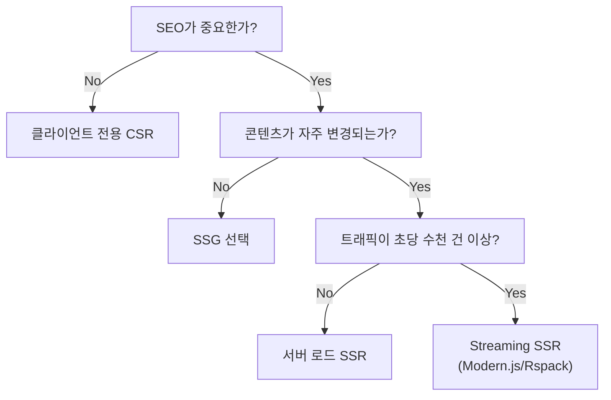
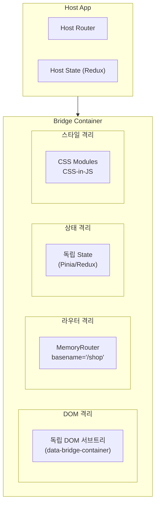

## 마이크로프론트엔드의 마지막 퍼즐

시리즈의 1편에서 우리는 `loadRemote('shop/Button')`이라는 한 줄의 코드 뒤에 숨겨진 7개 계층의 아키텍처를 살펴보았다. 2편에서 런타임 시스템, 3편에서 빌드 시스템, 4편에서 타입 시스템을 분석했다.

이제 마지막 질문이 남았다. **실제 프로덕션 프레임워크에서 이 모든 것이 어떻게 작동하는가?**

Next.js의 SSR, React Router의 버전 파편화, Vue와 React의 공존 — 이론적으로 우아한 아키텍처가 현실의 프레임워크 복잡성과 만났을 때 어떤 일이 벌어지는지를 이 글에서 다룬다.

---

## 프레임워크 통합의 두 계층

v2의 프레임워크 지원은 명확히 두 계층으로 나뉜다. 이 분리를 이해하지 못하면 전체 구조가 혼란스럽다.

```
Platform Adapters (빌드 파이프라인 통합)
├── @module-federation/nextjs-mf      → Next.js 빌드 파이프라인
├── @module-federation/node           → Node.js SSR 런타임
├── @module-federation/modern-js      → Modern.js 통합
└── @module-federation/rsbuild-plugin → Rsbuild 통합

Framework Bridges (런타임 앱 합성)
├── @module-federation/bridge-react   → React 앱 마운트 + Router
├── @module-federation/bridge-vue3    → Vue 3 앱 마운트 + Router
└── @module-federation/bridge-shared  → 공통 유틸리티
```

**Platform Adapter**는 "빌드를 어떻게 할 것인가"를, **Framework Bridge**는 "런타임에서 앱을 어떻게 합성할 것인가"를 담당한다. Adapter 없이 Bridge만으로는 빌드가 되지 않고, Bridge 없이 Adapter만으로는 컴포넌트 수준 공유만 가능하다.

---

## Next.js 통합: 가장 복잡한 관계

Next.js는 Module Federation과 가장 복잡한 관계를 가진 프레임워크다. 그 이유는 구조적이다.

### 네 가지 충돌 지점

1. **SSR/SSG 이중 렌더링**: 서버와 클라이언트 양쪽에서 동일한 모듈을 로드해야 한다
2. **파일 기반 라우팅**: 라우터가 프레임워크에 내장되어 있어, MF의 동적 라우팅과 충돌한다
3. **자동 코드 분할**: Next.js가 자체적으로 청크를 분할하므로, MF의 비동기 청크와 중복될 수 있다
4. **`_next/static` 경로 규약**: 정적 에셋 경로가 Next.js 관례를 따라야 한다

### 설정

```javascript
// next.config.js
const NextFederationPlugin = require('@module-federation/nextjs-mf');

module.exports = {
  webpack: (config, { isServer }) => {
    config.plugins.push(
      new NextFederationPlugin({
        name: 'shop',
        filename: 'static/chunks/remoteEntry.js',  // Next.js 에셋 경로
        exposes: {
          './Button': './components/Button'
        },
        remotes: {
          checkout: `checkout@${CHECKOUT_URL}/_next/static/chunks/remoteEntry.js`
        },
        shared: {
          react: { singleton: true, eager: true },
          'react-dom': { singleton: true, eager: true }
        },
        extraOptions: {
          automaticAsyncBoundary: true  // 자동 Suspense 경계
        }
      })
    );
    return config;
  }
};
```

`filename: 'static/chunks/remoteEntry.js'`에 주목하라. Next.js의 빌드 출력은 `.next/static/` 디렉토리에 위치하며, HTTP에서는 `_next/static/` 경로로 서빙된다. remoteEntry.js를 이 경로에 배치해야 Next.js의 정적 에셋 서빙 파이프라인과 호환된다.

### SSR에서의 모듈 로딩

서버와 클라이언트에서 동일한 Remote 모듈을 로드하는 과정은 완전히 다르다.

```
서버 렌더링 시 (Node.js):
  1. HTTP fetch로 remoteEntry.js 소스 코드 다운로드
  2. vm.runInContext()로 격리된 V8 컨텍스트에서 실행
  3. 모듈 팩토리 실행하여 React 컴포넌트 획득
  4. renderToString() 또는 renderToPipeableStream()에서 사용
  5. HTML 생성

클라이언트 Hydration 시 (브라우저):
  1. <script src="remoteEntry.js"> 로드
  2. 동일한 모듈 팩토리 실행
  3. React.hydrate()로 기존 HTML에 이벤트 바인딩
```

이 두 경로가 **완전히 같은 결과**를 내야 한다. 하나라도 다르면 Hydration Mismatch가 발생한다.

---

## Node.js SSR 어댑터: DOM 없는 세계

### 왜 별도의 패키지가 필요한가

브라우저에서 Module Federation은 `<script>` 태그를 DOM에 삽입하여 모듈을 로드한다. Node.js에는 DOM이 없다. 완전히 다른 메커니즘이 필요하다.

| 관점 | 브라우저 | Node.js |
|------|---------|---------|
| 모듈 로딩 | `<script>` 태그 | HTTP fetch + vm.runInContext |
| 전역 스코프 | `window` | `global` / `globalThis` |
| 캐싱 | 브라우저 캐시 | 인메모리 / require.cache |
| 에러 격리 | 각 스크립트 독립 | 프로세스 전체 영향 가능 |

### vm.runInContext의 샌드박싱

`@module-federation/node`는 Node.js의 `vm` 모듈을 사용하여 Remote 코드를 격리된 컨텍스트에서 실행한다.

```javascript
const vm = require('vm');

// 격리된 V8 컨텍스트 생성
const sandbox = vm.createContext({
  require,                    // Node.js require 주입
  module: { exports: {} },
  exports: {},
  globalThis: global,
  console,
  process,
  setTimeout,
  fetch: global.fetch,        // Node 18+
  __webpack_share_scopes__: {},
});

// Remote 코드를 격리된 컨텍스트에서 실행
const remoteCode = await fetch(remoteUrl).then(r => r.text());
const script = new vm.Script(remoteCode, { filename: remoteUrl });
script.runInContext(sandbox);

// 컨테이너 객체 추출
const container = sandbox[containerName];  // { init, get }
```

이 격리의 한계를 이해하는 것이 중요하다. `vm.createContext()`의 격리는 **얕은 격리(shallow isolation)**다.

- `require`를 주입하면 원본 `require.cache`를 공유한다
- `process` 객체를 공유하면 Remote가 `process.env`를 읽거나 수정할 수 있다
- V8 Isolate 수준의 메모리 격리는 제공하지 않는다

Node.js의 동적 코드 실행 기술은 `eval` → `vm.runInThisContext` → `vm.createContext` → `vm2`(2023년 RCE 취약점으로 deprecated) → `isolated-vm`으로 발전해왔다. Module Federation은 `vm.createContext`를 채택했는데, `isolated-vm`의 진정한 메모리 격리는 매력적이지만 `require` 같은 Node.js 네이티브 바인딩을 Isolate 경계 너머로 전달하는 복잡성 때문에 실용적이지 않았다.

### SSR에서의 공유 의존성 함정

```javascript
// 서버에서 React를 공유할 때의 위험
// Host의 React와 Remote의 React가 서로 다른 모듈 인스턴스가 될 수 있다

// Host: require('react') → Module A
// Remote: vm.runInContext에서 require('react') → Module B (다른 인스턴스!)

// 결과: "Invalid hook call" 에러

// 해결: singleton + eager로 단일 인스턴스 강제
shared: {
  react: { singleton: true, eager: true },
  'react-dom': { singleton: true, eager: true }
}
```

`require.cache`를 통해 Host와 Remote가 동일한 React 인스턴스를 공유하면 Hook 상태 공유가 가능하고, Context API가 인스턴스 경계를 넘어 동작한다. 그러나 하나의 Remote가 공유 모듈 상태를 변이시키면 전체 SSR 프로세스에 영향을 미칠 수 있다는 위험도 있다.

---

## Hydration Mismatch: SSR의 아킬레스건

### 문제의 본질

React는 서버에서 렌더링한 HTML과 클라이언트에서 렌더링한 HTML이 **비트 단위로 일치**해야 한다고 가정한다. MF 환경에서 이 가정이 깨지는 경우가 세 가지다.

**1. 버전 불일치**: 배포 중(rolling deployment)에 서버가 v1.2로 렌더링하고, 클라이언트가 v1.3으로 hydrate 시도

**2. 로딩 실패 비대칭**: 서버에서 Remote 로딩 실패 → 빈 HTML 생성 → 클라이언트에서 정상 로드 → 불일치

**3. CDN 캐시 불일치**: 서버가 CDN Edge A에서 v1.0을 받고, 클라이언트가 CDN Edge B에서 아직 캐시된 v0.9를 받는 시나리오

### v2의 매니페스트 기반 해결

`mf-manifest.json`에 콘텐츠 해시가 포함된 URL이 기록되므로, 서버와 클라이언트가 동일한 매니페스트를 참조하면 동일한 버전의 모듈을 로드하게 된다.

```json
{
  "exposes": [{
    "id": "shop:Button",
    "name": "Button",
    "assets": {
      "js": { "sync": ["static/js/Button.abc123.js"] }
    }
  }]
}
```

서버가 `Button.abc123.js`로 렌더링하고, HTML에 동일한 URL을 `<script>`로 삽입하면, 클라이언트도 정확히 같은 코드를 실행한다.

### CDN 캐시 불일치 방지 전략

```
매니페스트 (항상 최신):
  mf-manifest.json → Cache-Control: max-age=30, stale-while-revalidate=60

버전된 모듈 (불변):
  Button.abc123.js → Cache-Control: public, max-age=31536000, immutable
```

서버와 클라이언트가 동일한 CDN URL을 사용하되, 매니페스트는 짧은 TTL로 최신 버전을 가리키고, 모듈 파일은 해시 기반 URL로 영구 캐싱한다. 배포 시에는 CDN Surrogate Key 기반 선택적 퍼지로 매니페스트만 무효화한다.

### React 18 Selective Hydration의 역할

```jsx
// React 18 이전 — 전체 트리가 hydration 완료될 때까지 블록
<App>
  <HeavyRemoteComponent /> {/* 이것 때문에 전체가 블록 */}
</App>

// React 18 — Suspense 경계로 독립적 hydration
<App>
  <Suspense fallback={<Skeleton />}>
    <HeavyRemoteComponent /> {/* 독립적으로 hydrate */}
  </Suspense>
</App>
```

Selective Hydration은 Remote 컴포넌트의 hydration이 실패하거나 지연되어도 나머지 앱이 인터랙티브해지는 것을 허용한다. 타이밍 문제를 완화하지만, **콘텐츠 불일치 자체를 허용하지는 않는다** — HTML이 다르면 여전히 에러를 던진다.

---

## SSR 전략 비교

| 전략 | 설명 | SEO | TTFB | 구현 복잡도 |
|------|------|-----|------|------------|
| 서버에서 Remote 로드 | Node.js에서 fetch + vm으로 완전 SSR | 높음 | 느림 | 높음 |
| 클라이언트만 로드 | 서버는 placeholder, 클라이언트에서 Remote 로드 | 낮음 | 빠름 | 낮음 |
| Streaming SSR | React 18 Suspense + renderToPipeableStream | 높음 | 매우 빠름 | 매우 높음 |
| SSG + 클라이언트 로드 | 정적 빌드 + 클라이언트 동적 로드 | 높음 | 최고 | 중간 |

### 의사결정 흐름



### 서버에서 Remote 로드 + 폴백 패턴

```typescript
init({
  name: 'host',
  remotes: [
    { name: 'shop', entry: 'http://internal-lb/shop/mf-manifest.json' }
  ],
  plugins: [{
    name: 'ssr-fallback',
    errorLoadRemote({ id }) {
      // 서버에서 Remote 실패 시 → 클라이언트에 위임
      return () => ({
        default: () => <ClientOnlyRemote id={id} />
      });
    }
  }]
});
```

### Streaming SSR과 Remote 모듈의 연동

React 18의 Streaming SSR에서 Suspense는 비동기 로딩의 경계를 정의한다. Remote 모듈도 이 경계 내에서 로드된다.

```
HTML 스트리밍 타임라인:
t=0ms    : 사용자 요청 수신
t=5ms    : Shell HTML 스트리밍 시작 (TTFB = 5ms!)
           <html><head>...</head><body><header>...</header>
           <!--$?--><template id="B:0"></template><!--/$-->
t=5ms    : Remote remoteEntry.js fetch 병렬 시작
t=30ms   : remoteEntry.js 수신 완료 (CDN 히트)
t=35ms   : Remote 컴포넌트 렌더링 완료
           <div hidden id="S:0"><!-- Remote 실제 HTML --></div>
           <script>$RC("B:0", "S:0")</script>
t=40ms   : 전체 스트리밍 완료
```

Shell HTML이 즉시 전송되므로 TTFB가 5ms로 극적으로 빨라지고, Remote 모듈 로딩은 스트리밍 중에 병렬로 처리된다.

### SSR 서버의 Remote 장애 격리

프로덕션 SSR에서 가장 위험한 시나리오는 Remote 서버 장애가 Host 서버를 다운시키는 것이다. Circuit Breaker 패턴으로 연쇄 장애를 방지한다.

```typescript
class RemoteCircuitBreaker {
  private failures = 0;
  private lastFailureTime = 0;
  private state: 'closed' | 'open' | 'half-open' = 'closed';

  private readonly threshold = 5;       // 연속 5회 실패
  private readonly timeout = 60_000;    // 60초 차단
  private readonly requestTimeout = 3_000; // 요청당 3초 타임아웃

  async loadRemote(url: string): Promise<RemoteModule | null> {
    if (this.state === 'open') {
      const elapsed = Date.now() - this.lastFailureTime;
      if (elapsed < this.timeout) return null;  // 즉시 fallback
      this.state = 'half-open';
    }

    try {
      const controller = new AbortController();
      const timer = setTimeout(() => controller.abort(), this.requestTimeout);
      const response = await fetch(url, { signal: controller.signal });
      clearTimeout(timer);
      this.onSuccess();
      return await response.text();
    } catch {
      this.onFailure();
      return null;  // fallback 컴포넌트 사용
    }
  }
}
```

Kubernetes 환경에서는 서버가 공개 CDN 대신 **내부 로드 밸런서**를 통해 Remote에 접근하는 것이 효율적이다. 클러스터 내부 DNS(<1ms) + 단일 홉으로 레이턴시를 1-5ms로 단축할 수 있다.

```typescript
// 서버/클라이언트 URL 분리
const isServer = typeof window === 'undefined';
const remoteUrl = isServer
  ? 'http://remote-app-svc.default.svc.cluster.local/mf-manifest.json'  // K8s 내부
  : 'https://cdn.example.com/remote-app/mf-manifest.json';              // CDN
```

---

## Framework Bridges: 컴포넌트를 넘어 앱을 합성하다

### Bridge vs 일반 MF

일반 Module Federation은 컴포넌트 레벨 공유다. Host 앱에서 Remote의 Button을 import하여 사용한다.

Bridge는 **앱 레벨 합성**이다. Host 앱에서 Remote의 **전체 앱** — 라우팅, 상태 관리, 라이프사이클 포함 — 을 마운트한다.

```
일반 MF:    Host에서 Remote의 <Button> 사용 → 컴포넌트
Bridge:     Host에서 Remote의 전체 앱 마운트  → 애플리케이션
```

### 통합 API: createRemoteAppComponent

React와 Vue 모두 **동일한 인터페이스**를 제공한다. 이것이 DX 관점에서 핵심적이다.

```typescript
// React Bridge
import { createRemoteAppComponent } from '@module-federation/bridge-react';

const ShopApp = createRemoteAppComponent({
  loader: () => loadRemote('shop/App'),
  fallback: <Loading />,
  beforeBridgeRender: ({ dom, basename }) => {
    console.log('Remote 앱 마운트 직전');
  },
  beforeBridgeDestroy: ({ dom }) => {
    console.log('Remote 앱 언마운트 직전');
  }
});

// Host의 라우터에서 사용
<Route path="/shop/*" element={<ShopApp basename="/shop" />} />
```

```typescript
// Vue Bridge — 동일한 패턴!
import { createRemoteAppComponent } from '@module-federation/bridge-vue3';

const ShopApp = createRemoteAppComponent({
  loader: () => loadRemote('shop/App'),
});
```

패턴이 동일하다는 것의 의미: React 개발자가 Vue Remote를 소비할 때 **Vue를 몰라도 된다**. "다른 프레임워크의 Remote"가 아니라 그냥 "Remote 앱"이 된다.

### Bridge의 내부 동작

Bridge는 단순한 컴포넌트 래퍼가 아니라, 앱 수준 격리를 위한 복합 패턴이다.

```typescript
// 개념적 내부 구현
function createBridgeWrapper(RemoteApp, options) {
  return function BridgeWrapper(props) {
    const containerRef = useRef(null);

    // 1. 독립된 React Root 생성
    useLayoutEffect(() => {
      const root = ReactDOM.createRoot(containerRef.current, {
        identifierPrefix: options.name  // Concurrent Mode 식별자 충돌 방지
      });

      options.hooks?.beforeBridgeRender?.({ container: containerRef.current });

      root.render(
        <MemoryRouter basename={props.basename}>
          <RemoteApp {...props} />
        </MemoryRouter>
      );

      return () => {
        options.hooks?.beforeBridgeDestroy?.({ container: containerRef.current });
        root.unmount();
      };
    }, []);

    return <div ref={containerRef} data-bridge-container={options.name} />;
  };
}
```

### 네 가지 격리 메커니즘



**DOM 격리**: 각 Remote 앱이 독립된 React Root를 소유한다. React 17+에서 이벤트 리스너가 Root Container에 바인딩되므로, 이벤트 위임 충돌이 방지된다.

**라우터 격리**: Bridge는 Remote 앱에 `MemoryRouter`를 제공한다. Host의 URL 변경이 Remote 라우터에 전파되지 않고, Remote의 내부 네비게이션이 Host URL을 오염시키지 않는다.

```
Host URL: /admin/users/profile
├─ Host Router: basename="/" → 경로="/admin/users/profile"
└─ Remote Router: basename="/admin" → 경로="/users/profile"
```

**상태 격리**: Bridge 자체는 상태 격리를 강제하지 않는다. `shared` 설정의 `singleton: true`로 React만 공유하고, 각 앱의 상태 관리(Redux store, Pinia 등)는 독립적으로 유지한다.

**스타일 격리**: CSS Modules나 CSS-in-JS로 스코프를 분리한다. Shadow DOM을 강제하지 않는 이유는, Shadow DOM이 글로벌 디자인 시스템(Tailwind, MUI)의 스타일 주입을 차단하고, Portal 기반 컴포넌트와 충돌하기 때문이다.

### React Router 버전 호환성

| React Router 버전 | Bridge Export 경로 | 라우터 모델 |
|---|---|---|
| v5 | `bridge-react/router-v5` | Context 기반, BrowserRouter 싱글톤 |
| v6 | `bridge-react/router-v6` | useNavigate/useLocation 훅 기반 |
| v7 | `bridge-react/router-v7` | Remix 통합, RSC 실험적 지원 |

`@module-federation/bridge-react-webpack-plugin`이 `package.json`에서 React Router 버전을 자동 감지하여 올바른 bridge export를 설정한다. 개발자가 수동으로 버전을 지정할 필요가 없다.

---

## Cross-Framework 합성: React + Vue

Bridge의 진짜 힘은 **다른 프레임워크 앱을 하나의 화면에 합성**할 수 있다는 점이다.

```
React Host 앱
  ├── /          → React 컴포넌트 (로컬)
  ├── /shop/*    → Vue 3 Remote 앱 (bridge-vue3로 마운트)
  └── /checkout/* → React Remote 앱 (bridge-react로 마운트)
```

### 이벤트 시스템 충돌 방지

React의 Synthetic Event System과 Vue의 이벤트 시스템이 동일 DOM 트리에 공존할 때 이벤트 버블링 경로에서 두 프레임워크의 핸들러가 모두 실행될 수 있다.

React 17+에서 `ReactDOM.createRoot(container)`는 `container` 엘리먼트에 이벤트를 위임한다. Bridge가 각 Remote 앱에 독립된 Container를 제공하므로, 이벤트 버블링 경계가 자연스럽게 분리된다.

두 프레임워크 간 통신이 필요한 경우, DOM 이벤트보다 **프레임워크 독립적 이벤트 버스**가 안전하다.

```typescript
// shared 모듈로 등록하여 싱글톤 공유
class CrossFrameworkEventBus extends EventTarget {
  emit<T>(name: string, detail: T) {
    this.dispatchEvent(new CustomEvent(name, { detail }));
  }
  on<T>(name: string, handler: (detail: T) => void) {
    const listener = (e: Event) => handler((e as CustomEvent<T>).detail);
    this.addEventListener(name, listener);
    return () => this.removeEventListener(name, listener);
  }
}
export const eventBus = new CrossFrameworkEventBus();
```

### Cross-Framework의 현실적 한계

아키텍처적으로 가능한 것과 해야 하는 것은 다르다.

| 시나리오 | 추가 번들 크기 (gzip) |
|---------|---------------------|
| React 단독 | ~42 KB |
| Vue 3 단독 | ~33 KB |
| React Host + Vue Remote | **75 KB+** (프레임워크 런타임 중복) |
| React Host + React Remote (MF 공유) | ~42 KB (프레임워크 싱글톤) |

같은 프레임워크 간 통합은 `shared`로 런타임을 공유할 수 있지만, **Cross-Framework는 두 프레임워크 런타임이 반드시 번들에 포함**된다. 75KB+ 증가에 더해, 프레임워크 초기화 비용 중복, 이벤트 시스템 레이어 증가, 메모리 프로파일 증가가 있다.

**Bridge가 정당화되는 시나리오:**

- 인수합병으로 A사(React)와 B사(Vue)의 점진적 통합이 필요할 때
- Legacy jQuery 앱을 모던 React로 점진적 마이그레이션할 때
- 20개 이상 팀이 독립적 기술 선택권을 요구할 때

단일 팀이 운영하는 그린필드 프로젝트에서 Cross-Framework Bridge는 과도한 엔지니어링이다.

---

## Vue 3 Bridge 상세

```typescript
// Remote (Vue 앱) — 앱을 Bridge 컴포넌트로 내보내기
import { createBridgeComponent } from '@module-federation/bridge-vue3';
import App from './App.vue';
import router from './router';

export default createBridgeComponent({
  rootComponent: App,
  appOptions: () => ({ router })
});
```

```typescript
// Host (Vue 또는 React 앱) — Remote 앱 소비
import { createRemoteAppComponent } from '@module-federation/bridge-vue3';

const ShopApp = createRemoteAppComponent({
  loader: () => loadRemote('shop/App'),
  beforeBridgeRender: ({ appOptions, basename }) => {
    // Pinia store 주입, i18n 설정 등
    appOptions.plugins = [createPinia(), i18n];
  },
  beforeBridgeDestroy: ({ app }) => {
    app.unmount();
  }
});
```

`beforeBridgeRender` 훅에서 Pinia store나 i18n 플러그인을 주입할 수 있다. Host가 Remote 앱의 런타임 컨텍스트를 제어하는 강력한 확장 포인트다.

---

## HoistContainerReferencesPlugin

### 문제

Webpack의 `runtimeChunk: 'single'` 설정(Next.js의 기본값)을 사용하면 Federation 런타임이 잘못된 청크에 배치될 수 있다.

```
Before:
  runtime.js (Webpack 런타임만)
  main.js (앱 코드 + Federation 런타임 ← 잘못된 위치)
  remoteEntry.js → __webpack_require__ 참조 → runtime.js에 없음 → ERROR
```

### 해결

`HoistContainerReferencesPlugin`이 Webpack compilation의 `optimizeChunkModules` hook에서 동작하여, Federation 런타임을 올바른 런타임 청크로 끌어올린다.

```
After:
  runtime.js (Webpack 런타임 + Federation 런타임 ✓)
  main.js (앱 코드만)
  remoteEntry.js → __webpack_require__ 참조 → runtime.js에 있음 → OK
```

이 플러그인은 `runtimeChunk: 'single'`을 사용하는 모든 프로젝트에서 필요하다. Next.js는 이 설정이 기본이므로 `nextjs-mf`에 자동 포함되어 있다.

---

## SSR 메모리 관리

SSR 환경에서 `vm.runInContext`는 메모리 누수의 주범이 될 수 있다. 주요 누수 패턴 세 가지:

**1. 컨텍스트 캐시 누수**: Map에 context를 보관하면 GC 대상에서 제외

**2. 전역 이벤트 리스너 미해제**: Remote 모듈이 `process.on('uncaughtException', ...)`을 등록하면 context가 GC되어도 리스너가 남음

**3. require.cache 무한 증가**: 요청마다 새 Remote URL을 fetch하면 캐시가 무한히 커짐

```javascript
// 프로덕션 메모리 모니터링
setInterval(() => {
  const usage = process.memoryUsage();
  const metrics = {
    heapUsed: Math.round(usage.heapUsed / 1024 / 1024),  // MB
    cacheSize: Object.keys(require.cache).length,
  };
  if (metrics.heapUsed > 500) {  // 500MB 임계값
    console.warn('High memory usage:', metrics);
  }
}, 30000);
```

---

## Next.js App Router vs Pages Router

### Pages Router — 안정적 지원

Pages Router에서 MF는 비교적 안정적으로 작동한다. `HoistContainerReferencesPlugin`이 `runtimeChunk: 'single'` 충돌을 해결하고, `_next/static/chunks/` 경로에 remoteEntry.js가 올바르게 배치된다.

### App Router — 제약 있는 지원

App Router의 Server Components(RSC)는 서버에서만 실행되며 클라이언트 번들에 포함되지 않는다. MF의 런타임 초기화는 클라이언트를 전제로 설계되어 있어, 근본적 충돌이 존재한다.

| 기능 | Pages Router | App Router (Client) | App Router (Server) |
|------|-------------|--------------------|--------------------|
| Remote 로드 | 완전 지원 | 지원 (제약) | 실험적 |
| 공유 의존성 | 완전 지원 | 지원 | 미지원 |
| SSR | 완전 지원 | 제한적 | 미지원 |

**현실적 전략**: App Router를 사용하되, MF를 `'use client'` 경계 이하로 한정한다.

```typescript
'use client';  // 이 선언이 없으면 MF Remote가 동작하지 않음

import { createRemoteAppComponent } from '@module-federation/bridge-react';

const RemoteFeature = createRemoteAppComponent({
  name: 'remote1',
  export: 'FeatureComponent',
  fallback: <FeatureSkeleton />,
});
```

RSC는 데이터 페칭, 인증 등 서버 레이어에만 사용하고, 인터랙티브 컴포넌트와 MF Remote는 클라이언트 컴포넌트로 구현하는 것이 현재 가장 안전한 패턴이다.

---

## Modern.js 통합

Modern.js는 ByteDance의 메타 프레임워크로, Module Federation v2와 가장 긴밀하게 통합되어 있다. SSR/SSG 완전 지원, 자동 Module Federation 설정, DevTools 자동 통합을 제공하며, 7개 앱 동시 병렬 개발을 지원한다.

```bash
# Modern.js 예제 앱 실행 — 7개 앱 동시 시작
pnpm app:modern:dev
```

Next.js 통합이 "호환성 레이어"라면, Modern.js 통합은 "네이티브 통합"이다. Module Federation을 1등 시민(first-class citizen)으로 대우하는 프레임워크에서의 경험이 어떤 차이를 만드는지 보여주는 참조 구현이다.

---

## 릴리스 관리: Changesets

### 왜 Changesets인가

Module Federation 모노레포가 `semantic-release` 대신 Changesets를 선택한 이유는 **의도된 변경의 추적 가능성**이다.

| 관점 | Changesets | semantic-release |
|------|-----------|-----------------|
| 변경 이력 | PR 기반 changeset 파일 | 커밋 메시지 파싱 |
| 검토 가능성 | PR에서 변경사항 검토 가능 | 자동화로 검토 어려움 |
| 멀티 패키지 | 네이티브 지원 | 플러그인 필요 |
| pre-release | pre 모드 내장 | 별도 브랜치 필요 |

```bash
pnpm changeset        # 변경사항 기록
pnpm changeset pre enter next  # next 채널 진입
# 0.22.0 → 0.22.1-next.0 → 0.22.1-next.1 → 0.22.1 (릴리스)
```

### Foundation 패키지 동기화

모든 Foundation 패키지(`@module-federation/core`, `runtime`, `sdk`, `node`, `enhanced` 등)가 `0.22.1`로 동기화되는 비밀은 `.changeset/config.json`의 `linked` 배열이다.

```json
{
  "linked": [
    [
      "@module-federation/core",
      "@module-federation/runtime",
      "@module-federation/runtime-core",
      "@module-federation/sdk",
      "@module-federation/node",
      "@module-federation/enhanced"
    ]
  ]
}
```

`linked` 그룹 내 어느 하나라도 버전이 올라가면 전체가 동일한 버전으로 bump된다. 0.x 단계이므로 마이너 버전 범프가 breaking change를 의미할 수 있다.

---

## 예제 앱으로 이해하는 전체 그림

### Next.js E-commerce 데모

```
apps/3000-home/     (Host)  → 포트 3000
apps/3001-shop/     (Remote) → 포트 3001
apps/3002-checkout/ (Remote) → 포트 3002
```

3개 포트를 동시에 실행하면 **물리적으로** "분리된 애플리케이션이 통신한다"는 개념을 체득할 수 있다. home(랜딩), shop(상품), checkout(결제)이라는 비즈니스 도메인 분리가 직관적이다.

### Modern.js SSR 데모

```
apps/modernjs/          → 포트 4001 (메인)
apps/modernjs-ssr-*/    → 병렬 실행 (7개 앱)
```

### React Native Metro 데모

```
apps/metro-example-host/
apps/metro-example-mini/
apps/metro-example-nested-mini/
```

---

## 시리즈 총정리: 코드 한 줄의 무게

5편에 걸쳐 Module Federation v2의 코드베이스를 분석했다.

| 편 | 주제 | 핵심 |
|----|------|------|
| #1 | [아키텍처 개요](./01-아키텍처-개요.md) | 7개 계층, 모듈 로딩 라이프사이클 |
| #2 | [런타임 시스템](2.module-federation-runtime-system.md) | FederationHost, 플러그인 훅, Share Scope 알고리즘 |
| #3 | [빌드 시스템](3.module-federation-build-system.md) | ContainerPlugin, 매니페스트, Webpack vs Rspack |
| #4 | [타입 시스템과 DX](4.module-federation-type-system-DX.md) | DTS 플러그인, WebSocket 타입 서버, DevTools |
| #5 | [프레임워크 통합](5.module-federation-framework-integration.md) | Next.js SSR, React/Vue Bridge, SSR 전략 |

### v2 코드베이스에서 배울 수 있는 6가지 설계 원칙

**1. 계층 분리**: 런타임은 빌드를 모르고, 빌드는 프레임워크를 모른다. 각 계층이 자신의 책임만 수행한다.

**2. 이중 플러그인**: 빌드 타임(Webpack/Rspack 플러그인)과 런타임(Federation 플러그인) 각각에 독립적 확장 포인트를 제공한다.

**3. 매니페스트 기반 디스커버리**: URL 하드코딩 대신 `mf-manifest.json`이라는 메타데이터 계약으로 모듈을 연결한다. CDN 캐싱, 버전 고정, Hydration 안전성의 기반이다.

**4. Bridge 패턴**: 컴포넌트 공유를 넘어 앱 수준 합성. 프레임워크 불가지론적 인터페이스로 React와 Vue에 동일한 패턴을 제공한다.

**5. 타입 안전성 우선**: DTS 플러그인 + WebSocket 스트리밍으로 분산 환경에서도 TypeScript 타입을 보장한다. `any`의 세계에서 타입 안전한 세계로.

**6. 유니버설 런타임**: 하나의 런타임 코어로 브라우저, Node.js, React Native를 모두 지원한다. Platform Adapter 계층이 환경 차이를 흡수한다.

이 6가지 원칙은 결국 하나의 문장으로 수렴한다:

> **빌드 타임의 결합을 런타임의 계약으로 대체함으로써, Module Federation v2는 팀이 코드가 아닌 인터페이스에 합의할 수 있게 한다.**

### 기술 성숙도 지도 (2026 기준)

```
Level 5 (Production Ready):
└── Webpack 5 MF + React CSR + Pages Router Next.js

Level 4 (Stable):
├── MF v2 + Bridge (React-React)
├── Streaming SSR + Selective Hydration
└── Modern.js 완전 통합

Level 3 (Usable with Caveats):
├── App Router + MF (클라이언트 컴포넌트만)
└── Cross-Framework Bridge (React-Vue)

Level 2 (Experimental):
├── Turbopack + MF
└── RSC + MF 하이브리드

Level 1 (Research):
└── Server Module Federation (RSC 원격 스트리밍)
```

### "Module Federation v2가 마이크로프론트엔드의 미래인가?"

이 질문에 솔직하게 답하자면 — **당신의 팀 구조가 결정한다.**

마이크로프론트엔드는 기술적 선택이 아니라 조직적 선택이다. v2가 해결한 것은 기술적 장벽 — 타입 안전성, 디버깅 도구, 빌드 최적화, SSR 호환성 — 이다. 그러나 마이크로프론트엔드의 진짜 비용 — 운영 복잡성, 팀 간 계약 관리, 분산 시스템의 고유한 어려움 — 은 도구만으로 해결되지 않는다.

5개 이상의 팀이 독립 배포를 필요로 하고, 프레임워크 혼재를 관리해야 하며, 점진적 마이그레이션 경로가 필요한 조직이라면, Module Federation v2는 현재 존재하는 가장 완성도 높은 선택지다.

단일 팀이 운영하는 프로젝트라면, 잘 설계된 모놀리스가 여전히 최선이다.

> Module Federation v2는 마이크로프론트엔드의 미래가 아니라, 마이크로프론트엔드를 **현재**로 만드는 도구다. 미래가 될지는 당신의 팀이 결정한다.

---

*시리즈를 마치며: 1편에서 `loadRemote('shop/Button')` 한 줄을 보며 시작한 여정이, 7개 아키텍처 계층, 런타임 플러그인 시스템, Webpack 컴파일 훅, TypeScript Compiler API, WebSocket 타입 서버, vm.runInContext 샌드박스, Framework Bridge, 그리고 Streaming SSR을 거쳐 여기에 도착했다. 그 한 줄의 코드가 실행되기 위해 이 모든 인프라가 필요했다는 사실이, 이 프로젝트의 야심과 현대 웹 아키텍처의 복잡성을 동시에 보여준다.*
