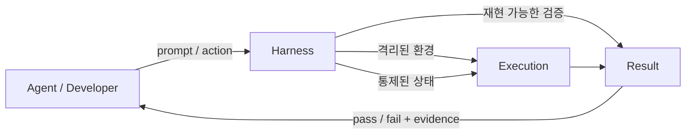
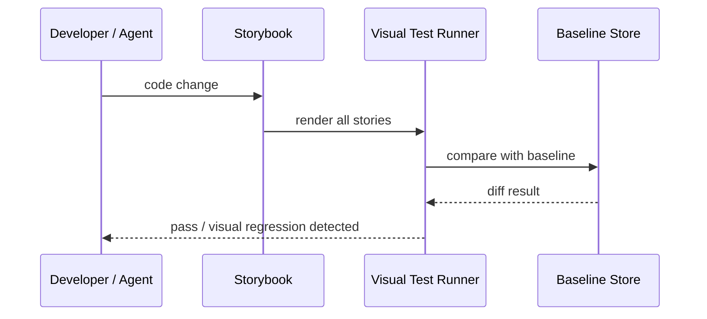
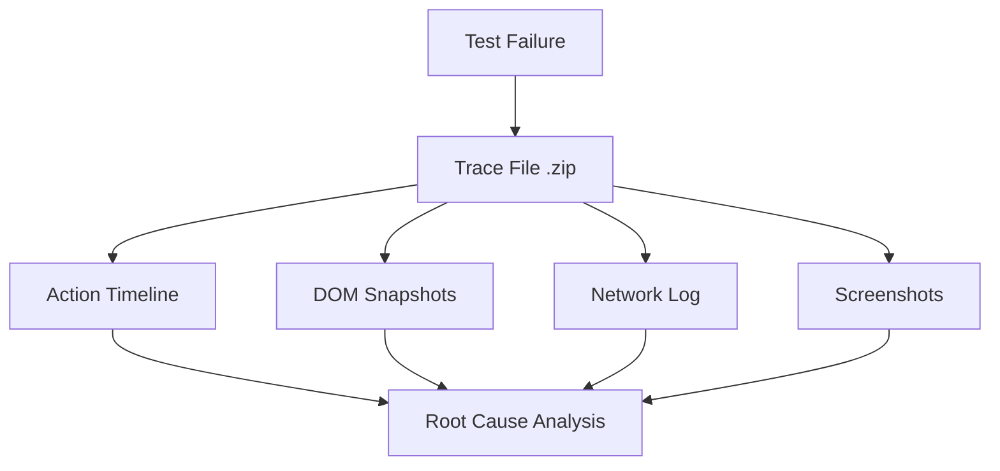
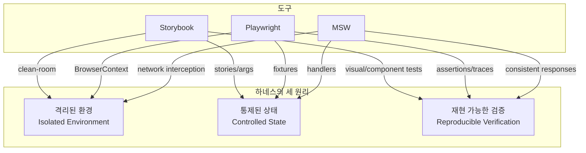
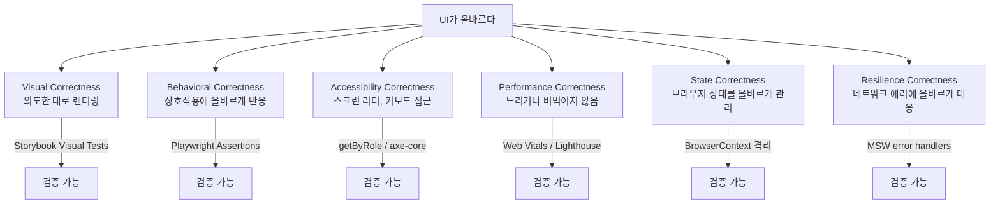
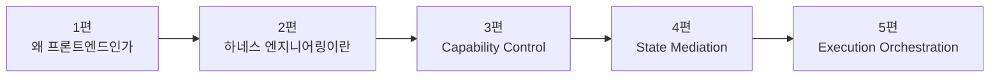

## 숫자 하나로 시작하겠다

Playwright 공식 통계에 따르면, 테스트 환경 격리 없이 작성된 E2E 테스트의 flakiness 비율은 격리된 환경 대비 평균 4~6배 높다. Google의 내부 연구(2016, "Flaky Tests at Google and How We Mitigate Them")는 E2E 테스트의 약 **16%가 flaky**하며, 이 중 상당수가 환경 공유로 인한 상태 오염에서 비롯됐다고 보고했다. 이 연구에서 주목할 점은 flaky test의 원인 분포다 — 비결정론적 동작(32%), 비동기 대기 실패(28%), 환경 의존성(22%), 테스트 간 상태 공유(18%) 순이었다. 앞의 두 가지도 결국 격리 부재에서 악화되는 문제다.

Storybook을 도입한 팀은 UI 회귀 버그를 발견하는 시점이 배포 직전에서 코드 리뷰 단계로 당겨진다. MSW를 사용하는 팀은 네트워크 의존성으로 인한 테스트 실패를 거의 제거한다.

세 도구는 각기 다른 영역을 다루지만, 공통된 사고방식을 공유한다. 그리고 그 사고방식에는 이름이 있다.

**하네스 엔지니어링(Harness Engineering)** 이다.

2026년 2월, OpenAI는 소규모 팀이 약 5개월간 수동 코드 한 줄 없이 100만 라인 코드베이스를 1,500개의 자동화 PR로 구축한 사례를 발표하며 이 용어를 공식화했다. Martin Fowler는 같은 시기에 이 개념의 계층 구조를 정의했다. Anthropic은 장기 실행 에이전트의 핵심 인프라로 하네스를 위치시켰다.

그런데 프론트엔드 개발자들은 이미 수년간 이 원리를 실천하고 있었다. 이름만 몰랐을 뿐이다.

---

## Agent 시대의 프론트엔드 개발자가 마주하는 진짜 문제

AI 코딩 도구의 진화는 명확한 3단계를 거쳤다.

| 시기 | 단계 | 대표 도구 | 검증 방식 |
|------|------|----------|----------|
| 2021-2022 | 자동완성 | GitHub Copilot | 개발자가 한 줄씩 판단 |
| 2023-2024 | 채팅 | ChatGPT, Cursor | 대화 → 복붙 → 확인 |
| 2025- | 에이전트 | Claude Code, Devin, Cursor Agent | **멀티스텝 자율 실행** |

2025년을 기점으로 근본적인 변화가 일어났다. Claude Code는 30시간이 넘는 워크플로우에서도 맥락 일관성을 유지하고, Devin은 자체 클라우드 샌드박스에서 계획부터 배포까지 수행하며, Cursor는 최대 8개의 병렬 에이전트를 운용한다.

그런데 흥미로운 현상이 생겼다. **agent를 잘 만드는 것보다, agent가 브라우저 · 코드베이스 · 네트워크 · 품질 게이트를 어떤 계약으로 통과하게 만들지를 설계하는 일이 훨씬 더 어렵고 중요하다**는 사실이 드러났다.

agent에게 "이 컴포넌트를 수정해줘"라고 시키는 건 쉽다. 하지만:

- agent가 수정한 코드가 다른 브라우저에서도 동일하게 동작하는가?
- 수정 과정에서 건드리지 말아야 할 상태를 오염시키지 않았는가?
- 네트워크가 불안정한 환경에서도 같은 결과를 재현할 수 있는가?
- 시각적 회귀가 발생하지 않았음을 어떻게 증명할 것인가?

Qodo의 2025년 코드 품질 보고서에 따르면, 개발자의 약 65%가 리팩토링 과정에서 AI가 맥락을 놓치는 문제를 경험했다. CHI 2025에서 발표된 CodeA11y 연구는 AI 코딩 에이전트가 특정 프롬프트 없이는 `aria-label`, 포커스 핸들링, 탭 순서를 권장하지 않는다는 것을 보여주었다.

이 질문들에 답하는 구조를 설계하는 일이 하네스 엔지니어링이다.

Martin Fowler의 비유를 빌리면: **프롬프트 엔지니어링이 "우회전"이라는 명령이라면, 하네스 엔지니어링은 에이전트가 안전하게 달릴 수 있는 고삐, 안장, 울타리, 도로 그 자체다.**

프롬프트는 의도를 만든다. **하네스는 결과의 경계를 만든다.**



---

## Storybook — 컴포넌트를 격리의 단위로 다루는 법

### UI 카탈로그에서 Component Testing Platform으로

Storybook은 2016년 Kadira팀이 React용 UI 개발 도구로 시작했다. 초기 목적은 단순했다 — 컴포넌트를 앱 맥락 없이 독립적으로 보여주는 "살아있는 스타일가이드"였다.

전환점은 두 단계로 왔다. 2019년 v5-v6에서 `args` 시스템과 Controls 애드온이 도입되면서 스토리가 "컴포넌트 상태의 선언적 명세"가 되기 시작했다. 2022년 v7에서 `play` 함수가 안정화되면서 스토리가 곧 테스트 케이스가 되는 패러다임이 열렸다. 2024년 Storybook 8은 이 진화의 완결이다. Vitest와의 네이티브 통합을 통해 스토리를 **실제 브라우저 환경**에서 실행하는 component test가 가능해졌다. 더 이상 jsdom 시뮬레이션이 아니다.

### Clean-room 환경이라는 개념

Storybook의 핵심 가치는 단순한 "UI 카탈로그"가 아니다. 진짜 가치는 **컴포넌트를 clean-room 환경에서 고립시켜, variation별로 독립적으로 다룰 수 있게 한다**는 데 있다.

현실의 애플리케이션에서 버튼 컴포넌트를 테스트하려면, 해당 버튼이 렌더링되는 페이지를 로드하고, 전역 상태를 세팅하고, 라우터를 초기화하고, 인증 컨텍스트를 주입해야 한다. 그 모든 과정을 거쳐도 테스트하고 싶은 건 버튼 하나다. Storybook은 이 비효율을 구조적으로 제거한다.

```typescript
// Button.stories.ts
import type { Meta, StoryObj } from '@storybook/react';
import { Button } from './Button';

const meta: Meta<typeof Button> = {
  component: Button,
  args: { label: 'Click me' },
};
export default meta;

type Story = StoryObj<typeof Button>;

export const Primary: Story = {
  args: { variant: 'primary', disabled: false },
};

export const Disabled: Story = {
  args: { variant: 'primary', disabled: true },
};

export const Loading: Story = {
  args: { variant: 'primary', loading: true },
};
```

`Primary`, `Disabled`, `Loading`은 단순한 문서가 아니다. 이것은 **컴포넌트의 상태별 test case**다. 각 story는 특정 상태를 재현 가능하게 고정시킨다. AI 에이전트에게 few-shot 예시를 주는 것처럼, Storybook은 컴포넌트 렌더러에게 "이런 입력 조건에서 이렇게 보여야 한다"는 구조화된 지시를 준다.

### Component Tests — JSDOM의 한계를 넘어서

Jest + JSDOM 조합은 오랫동안 프론트엔드 단위 테스트의 표준이었다. 하지만 JSDOM은 실제 브라우저가 아니다. CSS 레이아웃 계산, `ResizeObserver`, `IntersectionObserver`, 실제 포커스 동작은 JSDOM에서 정확하게 동작하지 않는다. 예를 들어 JSDOM에서 `element.getBoundingClientRect()`는 항상 0을 반환하며, CSS Grid나 Flexbox 레이아웃은 계산 자체가 이루어지지 않는다. `popover` API, `dialog` element의 포커스 트랩, 복잡한 `focus-visible` 동작도 JSDOM 시뮬레이션의 한계 영역이다.

Storybook 8의 `play` 함수는 실제 브라우저 위에서 story를 실행한다.

```typescript
import { expect, userEvent, within, fn } from '@storybook/test';

export const ClickInteraction: Story = {
  args: {
    variant: 'primary',
    onClick: fn(),
  },
  play: async ({ args, canvasElement }) => {
    const canvas = within(canvasElement);
    const button = canvas.getByRole('button', { name: /click me/i });

    await userEvent.click(button);

    await expect(args.onClick).toHaveBeenCalledOnce();
  },
};
```

### Storybook 8이 실제 브라우저에서 실행되는 내부 메커니즘

Storybook 8의 `@storybook/experimental-addon-test`가 어떻게 실제 브라우저에서 story를 실행하는지는 여러 계층의 위임 구조로 이루어진다.

```
Storybook Addon Test
  └── Vitest Browser Mode (vite-plugin-storybook-nextjs 등)
        └── @vitest/browser (브라우저 모드 플러그인)
              └── Playwright Provider
                    └── Chromium / Firefox / WebKit
```

Vitest의 Browser Mode는 JSDOM을 완전히 대체하는 실행 방식이다. Vitest 설정에서 `browser.provider: 'playwright'`를 지정하면, Vitest는 Playwright를 통해 실제 브라우저 인스턴스를 런치하고 WebSocket 채널로 연결한다. 테스트 코드는 Node.js 프로세스에서 실행되지만, DOM 조작과 assertion은 브라우저 컨텍스트에서 실행된다.

```typescript
// vitest.config.ts — Storybook과 Vitest Browser Mode 통합 설정
import { defineConfig } from 'vitest/config';
import { storybookTest } from '@storybook/experimental-addon-test/vitest-plugin';

export default defineConfig({
  plugins: [storybookTest()],
  test: {
    browser: {
      enabled: true,
      provider: 'playwright',
      name: 'chromium',
      headless: true,
    },
    // 각 스토리 파일이 독립된 BrowserContext에서 실행됨
    isolate: true,
    setupFiles: ['.storybook/vitest.setup.ts'],
  },
});
```

```typescript
// .storybook/vitest.setup.ts — Storybook 환경 초기화
import { beforeAll } from 'vitest';
import { setProjectAnnotations } from '@storybook/react';
import * as projectAnnotations from './preview';
import { initialize as initializeMSW, mswLoader } from 'msw-storybook-addon';

// MSW를 포함한 전역 데코레이터와 파라미터를 Vitest에 등록
const annotations = setProjectAnnotations([projectAnnotations]);

beforeAll(annotations.beforeAll);
```

핵심은 `storybookTest()` 플러그인이 각 `.stories.ts` 파일을 Vitest 테스트로 변환한다는 것이다. 각 story의 `play` 함수가 `it()` 블록이 되고, Playwright가 관리하는 실제 브라우저 탭에서 실행된다. 이 과정에서 각 테스트 파일은 독립된 BrowserContext를 가지므로, story 간 쿠키/로컬스토리지/서비스워커 오염이 구조적으로 방지된다.

### Visual Tests — 시각적 계약의 성문화

Visual tests는 각 story를 렌더링해 baseline 스크린샷과 픽셀 단위로 비교한다. Chromatic 같은 도구를 연동하면 PR마다 자동으로 UI 회귀를 감지한다.

Chromatic의 **Turbosnap** 기능은 특히 주목할 만하다. Git의 `--name-only` diff를 분석해 변경된 파일의 의존성 그래프를 역추적하고, 영향받는 story만 선별해서 실행한다. 공식 문서에 따르면 대규모 컴포넌트 라이브러리(스토리 수 500개 이상)에서 테스트 시간을 **70~80% 단축**한다. 예를 들어 `Button.tsx`를 변경하면, `Button`을 직접 사용하는 `Form`, `Dialog`, `Card` 등 상위 컴포넌트의 스토리까지 포함하지만, `Button`과 무관한 `Table`, `Chart` 계열 스토리는 건너뛴다.

```bash
# Turbosnap 적용 전후 비교 (예시 수치)
# 전: 847개 스토리 전체 실행 — 약 14분
# 후: 73개 영향받는 스토리만 실행 — 약 2분 10초
npx chromatic --only-changed --exit-zero-on-changes
```



이것이 하네스의 원리다. **격리된 환경에서 통제된 상태를 재현 가능하게 검증**한다.

---

## Playwright — 실행 환경 격리를 설계 원칙으로 삼은 도구

### Selenium에서 Playwright까지: 격리 철학의 진화

Selenium(2004)은 WebDriver 표준으로 "브라우저를 원격 제어"하는 모델이었다. 근본적인 문제는 테스트 간 상태 공유 — 같은 브라우저 세션에서 쿠키, 로컬스토리지, 인증 상태가 누적됐다. Puppeteer(2017, Google)가 Chrome DevTools Protocol로 개선했지만 Chrome 전용이었다.

Microsoft가 2020년 출시한 Playwright는 처음부터 다른 철학으로 설계됐다.

### BrowserContext — 상태 오염의 원천을 구조적으로 차단하는 3단계 격리 구조

Playwright의 가장 중요한 설계 결정은 **각 테스트마다 독립된 BrowserContext를 생성**한다는 것이다.

격리 레이어는 세 단계다:

**1단계 — Browser Process**: 하나의 브라우저 프로세스 (Chromium, Firefox, WebKit)가 전체 테스트 세션에서 재사용된다. 브라우저 프로세스 시작 비용(Chromium 기준 약 1~2초)을 한 번만 지불한다.

**2단계 — BrowserContext**: 프로세스 내의 독립 세션이다. 다음 항목이 BrowserContext 단위로 완전히 격리된다:
- HTTP 쿠키 저장소
- `localStorage` / `sessionStorage` / `IndexedDB`
- 서비스 워커(Service Worker) 등록
- 브라우저 캐시 (선택적)
- 네트워크 상태 (오프라인 설정, 대역폭 조절)
- 권한 설정 (geolocation, notifications)
- HTTP 헤더 기본값

OS 프로세스 격리가 아니므로 새 브라우저 인스턴스보다 훨씬 빠르게 생성된다 (수십 밀리초 수준).

**3단계 — Page**: Context 내의 탭이다. 같은 Context의 Page들은 쿠키를 공유하지만, 다른 Context의 Page와는 완전히 격리된다.

```typescript
import { test, expect, BrowserContext } from '@playwright/test';

// 각 test()는 자동으로 독립된 BrowserContext를 사용한다
test('로그인하지 않은 사용자는 대시보드에 접근할 수 없다', async ({ page }) => {
  await page.goto('/dashboard');
  await expect(page).toHaveURL('/login');
});

test('로그인한 사용자는 대시보드를 볼 수 있다', async ({ page, context }) => {
  // 이 컨텍스트는 위 테스트와 완전히 분리되어 있다
  // 첫 번째 테스트가 어떤 상태를 만들었든 영향 없음
  await context.addCookies([{
    name: 'auth_token', value: 'valid_token',
    domain: 'localhost', path: '/'
  }]);
  await page.goto('/dashboard');
  await expect(page).toHaveURL('/dashboard');
});

// storageState를 활용한 로그인 상태 재사용 패턴
// 매 테스트마다 로그인 플로우를 거치지 않고 세션 파일을 재사용
test.use({ storageState: 'playwright/.auth/user.json' });

test('인증된 사용자의 프로필 페이지', async ({ page }) => {
  await page.goto('/profile');
  await expect(page.getByRole('heading', { name: '내 프로필' })).toBeVisible();
});
```

Selenium/Puppeteer에서 격리는 별도 브라우저 인스턴스를 띄우는 비용이 큰 방법이었다. Playwright는 단일 브라우저 프로세스 안에서 경량 격리 컨텍스트를 만드는 개념을 도입함으로써, 격리의 비용을 구조적으로 낮췄다.

### Locator — 의미 기반 상호작용

Playwright는 CSS selector나 XPath 대신 **user-facing locator**를 권장한다.

```typescript
// 지양 — 구현 세부사항에 의존
page.locator('#submit-btn-v2')
page.locator('.btn.btn-primary.mt-4')

// 권장 — 사용자가 실제로 인식하는 방식으로
page.getByRole('button', { name: '제출' })
page.getByLabel('이메일 주소')
page.getByText('로그인 성공')
```

`getByRole`은 ARIA role을 기반으로 요소를 찾는다. 이것은 단순히 편리한 문법이 아니다. **접근성과 테스트 가능성이 같은 축 위에 있음**을 의미한다. 스크린 리더가 읽을 수 없는 요소는 Playwright로도 찾기 어렵다. 이 두 가지 압력이 결합되어 접근 가능한 마크업을 자연스럽게 유도한다.

AI 에이전트 관점에서 보면, locator가 없는 요소는 하네스의 세계에서 **존재하지 않는 것**이나 마찬가지다. Locator 선택이 곧 테스트 가능한 세계의 경계를 정의한다.

### Auto-waiting — Actionability Checks로 Flakiness를 흡수하는 원리

Playwright의 모든 action과 assertion은 기본적으로 retry된다. Selenium의 `sleep()`, `waitForElement()` 패턴이 flakiness의 주범이었다면, Playwright는 모든 액션에 **actionability checks**를 내장했다.

클릭(`click()`) 하나를 실행할 때 Playwright가 내부적으로 수행하는 체크 목록은 다음과 같다:

1. **Attached**: 요소가 DOM에 존재하는가
2. **Visible**: CSS `display: none`, `visibility: hidden`, `opacity: 0`이 아닌가
3. **Stable**: 애니메이션 중이거나 레이아웃 이동이 없는가 (2개 연속 프레임에서 동일한 bounding box)
4. **Enabled**: `disabled` 속성이 없는가
5. **Editable** (입력 필드의 경우): `readonly` 속성이 없는가
6. **Receives Events**: 클릭 이벤트를 실제로 받는 요소인가 (다른 요소에 가려지지 않았는가)

이 체크들을 기본 timeout(30초) 동안 retry하면서, 조건이 충족되는 순간 즉시 액션을 실행한다. `sleep(500)`이 "0.5초를 낭비하거나 부족할 수 있다"면, actionability checks는 "조건이 충족되는 최소 시간만 대기한다."

```typescript
// 이 코드는 버튼이 나타날 때까지 자동으로 대기한다
// — visible, stable, enabled, receives events 모두 충족 시 클릭
await page.getByRole('button', { name: '확인' }).click();

// 이 assertion은 조건이 충족될 때까지 retry된다
// — 비동기로 나타나는 토스트 메시지 등에 유효
await expect(page.getByText('저장 완료')).toBeVisible();

// 커스텀 timeout 지정
await expect(page.getByText('분석 완료')).toBeVisible({ timeout: 60_000 });
```

actionability checks가 흡수하는 대표적인 flakiness 패턴:
- **애니메이션 완료 대기**: CSS transition이 끝나기 전에 클릭하면 빗나가는 문제
- **동적 렌더링 대기**: React `Suspense`나 skeleton UI가 실제 컨텐츠로 교체되기 전의 클릭 실패
- **z-index 오버랩**: 모달이 닫히는 애니메이션 중 뒤에 있는 버튼을 클릭하는 경우

### Trace Viewer — 실행 증거의 완전 수집

테스트가 실패했을 때, Trace Viewer는 **실행 과정 전체를 증거로 수집**한다:

```typescript
// playwright.config.ts
export default defineConfig({
  use: {
    trace: 'on-first-retry', // 실패 시 자동으로 trace 수집
    screenshot: 'only-on-failure',
    video: 'retain-on-failure',
  },
});
```

Trace에는 각 action의 timeline, action 전후의 DOM snapshot, 네트워크 request/response, console log, 스크린샷이 포함된다. Chrome DevTools Protocol(CDP)의 `Page.captureSnapshot` 명령을 직접 구독하여 각 action 직전/직후의 DOM을 MHTML 형식으로 저장한다. `.zip` 형식으로 CI 아티팩트에 저장되며, `npx playwright show-trace trace.zip`으로 로컬에서 재생할 수 있다.



Agent가 작업을 수행한 후 "이 단계에서 무슨 일이 있었는가"를 재현 가능하게 설명할 수 있어야 한다면, Trace Viewer는 그 체계의 완성형에 가깝다.

---

## MSW — 외부 의존성을 결정론적 계약으로 대체하기

### 네트워크 레벨 가로채기의 의미

기존의 mocking은 코드 레벨에서 이루어졌다. `jest.mock('axios')`, `fetch.mockResolvedValue()` — 이런 방식은 **구현 세부사항에 결합된다.** `fetch`를 쓰다가 `axios`로 바꾸면 mock이 전부 깨진다. 실제 HTTP 스택(헤더 직렬화, 쿠키, CORS 처리)이 실행되지 않으며, 브라우저 DevTools에 요청이 보이지 않는다.

Mock Service Worker(MSW)는 Service Worker API가 원래 오프라인 캐싱용으로 설계된 "브라우저와 네트워크 사이의 프록시" 특성을 request mocking에 전용(轉用)했다. `FetchEvent.respondWith()`라는 API가 "임의의 Response를 주입"할 수 있게 설계되어 있었기에, 캐시에서 꺼내는 대신 핸들러 로직이 만든 합성 응답을 주입하면 되는 것이었다.

| 비교 | 코드 레벨 Mock | MSW 네트워크 레벨 |
|------|---------------|-----------------|
| 인터셉션 위치 | 라이브러리 내부 | OS 네트워크 스택 직전 |
| HTTP 스택 실행 | 우회 | 실제 실행 |
| DevTools 가시성 | 없음 | 있음 |
| 라이브러리 의존성 | fetch mock은 fetch에만 | 모든 HTTP 클라이언트 |
| 환경 간 핸들러 공유 | 불가능 | 동일 코드로 가능 |

### 브라우저와 Node.js의 이중 전략 — MSW의 이중 아키텍처 상세

MSW가 브라우저와 Node.js에서 동일한 핸들러 인터페이스를 제공하는 것은, 내부적으로 두 개의 완전히 다른 메커니즘으로 구현되어 있다.

**브라우저 전략 — Service Worker + MessageChannel**

브라우저에서 MSW는 `setupWorker()`로 Service Worker(`mockServiceWorker.js`)를 등록한다. 이후 네트워크 요청이 발생하면 다음 흐름으로 처리된다:

```
[브라우저 탭] fetch('/api/users')
     ↓ Service Worker 스코프 내 요청 인터셉트
[Service Worker] FetchEvent 수신 → respondWith(promise) 반환
     ↓ MessageChannel을 통해 메인 스레드에 요청 정보 전달
[Main Thread] 핸들러 배열에서 일치하는 패턴 탐색
     ↓ 핸들러 함수 실행 (테스트 상태, 조건 접근 가능)
[Main Thread] Response 생성 → MessageChannel로 Service Worker에 전달
     ↓
[Service Worker] FetchEvent.respondWith()로 최종 응답 주입
     ↓
[브라우저 탭] 응답 수신
```

핵심은 Service Worker가 직접 응답을 만들지 않는다는 것이다. 핸들러 코드가 메인 스레드의 JavaScript 컨텍스트에서 실행되어야, 테스트 변수나 상태에 접근할 수 있다. Service Worker는 중간 프록시 역할만 한다.

```typescript
// 브라우저 환경 — Storybook, 개발 서버
import { setupWorker } from 'msw/browser';
import { handlers } from './handlers';

export const worker = setupWorker(...handlers);

// Storybook preview.ts에서 초기화
// msw-storybook-addon이 이 과정을 자동화한다
await worker.start({
  onUnhandledRequest: 'bypass',
  serviceWorker: {
    url: '/mockServiceWorker.js', // public 디렉토리에 위치
  },
});
```

**Node.js 전략 — `@mswjs/interceptors`**

Node.js 환경에서는 Service Worker가 없다. 대신 `@mswjs/interceptors` 라이브러리가 Node.js의 HTTP 클라이언트들을 인터셉트한다. monkey-patch가 아닌 클래스 확장(class extension) 전략으로, `http.ClientRequest`, `XMLHttpRequest`, `fetch`(Node.js 18+ 빌트인)를 각각 확장한다. 기존 네트워크 스택을 최대한 실행하면서 인터셉션 로직을 삽입하므로, TLS 핸드셰이크, HTTP/2 프로토콜 협상 등 저수준 동작은 그대로 유지된다.

```typescript
// Node.js 환경 — Jest, Vitest
import { setupServer } from 'msw/node';
import { handlers } from './handlers';

const server = setupServer(...handlers);

// 테스트 생명주기와 연동
beforeAll(() => server.listen({ onUnhandledRequest: 'error' }));
afterEach(() => server.resetHandlers()); // 테스트별 오버라이드 초기화
afterAll(() => server.close());
```

```typescript
// handlers.ts — 모든 환경에서 재사용되는 단일 정의
import { http, HttpResponse } from 'msw';

export const handlers = [
  http.get('/api/users/:id', ({ params }) => {
    return HttpResponse.json({
      id: params.id,
      name: '김철수',
      email: 'chulsoo@example.com',
    });
  }),

  http.post('/api/auth/login', async ({ request }) => {
    const body = await request.json() as { email: string; password: string };

    if (body.password === 'wrong') {
      return HttpResponse.json(
        { message: '이메일 또는 비밀번호가 올바르지 않습니다' },
        { status: 401 }
      );
    }

    return HttpResponse.json({ token: 'mock-jwt-token' });
  }),
];
```

### 같은 handler, 여러 환경

MSW의 진짜 강점은 **하나의 handler 정의를 Storybook, Playwright, Jest 모두에서 재사용**할 수 있다는 점이다. 도구가 달라도 계약은 하나다.

```typescript
// Storybook에서 — msw-storybook-addon
import { initialize, mswLoader } from 'msw-storybook-addon';
import { handlers } from '../src/mocks/handlers';

initialize({ onUnhandledRequest: 'bypass' });
export const loaders = [mswLoader];
export const parameters = { msw: { handlers } };
```

```typescript
// Jest/Vitest에서 — setupServer
import { setupServer } from 'msw/node';
import { handlers } from '../mocks/handlers';

const server = setupServer(...handlers);
beforeAll(() => server.listen({ onUnhandledRequest: 'error' }));
afterEach(() => server.resetHandlers());
afterAll(() => server.close());
```

`onUnhandledRequest: 'error'`는 하네스 엔지니어링의 핵심 장치다. 핸들러가 없는 요청이 발생하는 순간 테스트가 실패한다. **"예상하지 못한 네트워크 요청은 버그"라는 계약을 코드로 강제한다.**

### 에러 모드의 결정론적 재현

네트워크 에러, 타임아웃, 500 에러 같은 엣지 케이스를 **결정론적으로** 재현할 수 있다:

```typescript
import { http, HttpResponse, delay } from 'msw';

// 네트워크 단절 시뮬레이션
http.get('/api/unreachable', () => {
  return HttpResponse.error(); // TypeError: Failed to fetch
})

// 타임아웃 시뮬레이션
http.get('/api/slow', async () => {
  await delay('infinite'); // 응답 영구 지연
  return new HttpResponse(null);
})

// Rate limiting 재현
let count = 0;
http.get('/api/resource', () => {
  if (++count % 3 === 0) {
    return HttpResponse.json({ error: 'Rate limited' }, { status: 429 });
  }
  return HttpResponse.json({ data: 'ok' });
})
```

핸들러 파일은 사실상 **API 계약의 실행 가능한 문서**다. 프론트엔드가 기대하는 요청/응답 형식이 코드로 명시되어 있고, 백엔드 팀이 API 스펙을 변경하면 핸들러 업데이트가 강제되어 프론트엔드 전체 테스트 스위트를 보호하는 방어선이 된다.

---

## Storybook + Playwright + MSW 통합 시 실전 문제

세 도구를 함께 사용할 때 이론대로 작동하지 않는 경우가 있다. 실전에서 자주 마주치는 문제와 그 원인, 해결책을 정리한다.

### 문제 1 — MSW Worker 초기화 순서 문제

Playwright 테스트에서 MSW를 사용할 때, Service Worker가 완전히 등록되기 전에 테스트 코드가 네트워크 요청을 발생시키는 경합 조건(race condition)이 발생한다.

```typescript
// 잘못된 패턴 — Worker 준비 완료를 기다리지 않음
test('사용자 목록을 불러온다', async ({ page }) => {
  await page.goto('/users'); // Service Worker가 아직 등록 중일 수 있음
  await expect(page.getByRole('list')).toBeVisible(); // 실제 API 요청이 나갈 수 있음
});

// 올바른 패턴 — Worker 준비 완료 확인 후 진행
test('사용자 목록을 불러온다', async ({ page }) => {
  // Service Worker 등록 완료를 기다리는 커스텀 조건
  await page.goto('/users');
  await page.waitForFunction(() =>
    navigator.serviceWorker.controller !== null
  );
  await expect(page.getByRole('list')).toBeVisible();
});
```

Playwright + MSW 조합에서는 `page.goto()` 이후 Service Worker 등록이 완료됐는지 확인하는 단계를 fixture로 추상화하는 것이 좋다:

```typescript
// fixtures/msw.ts — MSW Worker 준비를 보장하는 Playwright fixture
import { test as base } from '@playwright/test';

export const test = base.extend({
  page: async ({ page }, use) => {
    await page.goto('/'); // Service Worker 스코프 진입

    // MSW Worker 활성화 확인 (msw-storybook-addon이 window에 노출하는 플래그)
    await page.waitForFunction(() =>
      (window as any).__MSW_WORKER_READY__ === true,
      { timeout: 5000 }
    );

    await use(page);
  },
});
```

### 문제 2 — Playwright와 MSW의 이중 모킹 충돌

Playwright는 자체적으로 `page.route()`를 통해 네트워크 요청을 인터셉트할 수 있다. MSW도 동일한 요청을 인터셉트하려 할 때 충돌이 발생한다.

```typescript
// 충돌 상황 — Playwright route와 MSW handler가 동시에 같은 경로를 처리하려 함
test('에러 상태 테스트', async ({ page }) => {
  // Playwright 레벨 인터셉트
  await page.route('/api/users', route =>
    route.fulfill({ status: 500, body: 'Server Error' })
  );

  // MSW도 /api/users를 처리하도록 설정된 상태
  // → Playwright route가 먼저 처리하면 MSW handler는 실행되지 않음
  // → 어느 쪽이 먼저 처리할지 보장되지 않음
});
```

일관성을 위해 **하나의 인터셉션 레이어만 사용**하는 것을 원칙으로 삼아야 한다. Playwright E2E 테스트에서는 `page.route()`만, Storybook component 테스트에서는 MSW만 사용하도록 역할을 분리한다. 또는 Playwright 테스트에서도 MSW를 사용할 경우 `page.route()`를 완전히 비활성화한다:

```typescript
// playwright.config.ts — MSW를 사용하는 환경에서 Playwright 네트워크 인터셉트 비활성화
export default defineConfig({
  use: {
    // MSW가 모든 네트워크 처리를 담당
    // page.route()를 사용하지 않으면 충돌 없음
  },
  // 전역 설정으로 특정 경로만 pass-through 허용
  webServer: {
    command: 'pnpm dev',
    url: 'http://localhost:3000',
    reuseExistingServer: !process.env.CI,
  },
});
```

### 문제 3 — BrowserContext와 Service Worker 등록 문제

Playwright의 `BrowserContext` 격리가 MSW Service Worker 등록에 영향을 준다. Service Worker는 origin과 scope 기반으로 등록되며, BrowserContext가 격리되면 각 컨텍스트마다 Service Worker가 독립적으로 등록된다. 이 과정에서 Service Worker 등록에 실패하거나 이전 컨텍스트의 Worker가 해제되지 않으면 테스트가 엉킨다.

```typescript
// 해결책 — 각 BrowserContext 종료 시 Service Worker 명시적 해제
test.afterEach(async ({ context }) => {
  // Service Worker를 명시적으로 unregister하여 다음 컨텍스트에 영향 없게
  const workers = await context.serviceWorkers();
  await Promise.all(workers.map(worker => worker.evaluate(() =>
    self.registration.unregister()
  )));
});
```

또는 `storageState`를 비워서 각 테스트마다 깨끗한 컨텍스트를 보장한다:

```typescript
// playwright.config.ts
export default defineConfig({
  use: {
    // 각 테스트마다 빈 스토리지 상태로 시작
    storageState: { cookies: [], origins: [] },
  },
});
```

---

## 세 도구의 교집합 — 하네스의 세 원리

세 도구가 각기 다른 문제를 다루지만, 동일한 세 가지 원리를 공유한다.

| 원리 | Storybook | Playwright | MSW |
|------|-----------|------------|-----|
| **격리된 환경** | clean-room addon 환경 | 테스트별 독립 BrowserContext | 네트워크 레벨 interception |
| **통제된 상태** | stories / args | fixtures / test hooks | request handlers |
| **재현 가능한 검증** | visual + component tests | assertions / Trace Viewer | 일관된 mock response |



이 세 원리는 프론트엔드 하네스의 기초이자, **agent harness의 기초이기도 하다.**

OpenAI의 Codex 하네스 실험에서 도출된 핵심 원리가 정확히 동일하다. **격리**: git worktree 단위로 에이전트 환경을 부팅하고 작업 완료 후 tear down한다. **통제**: 의존성 방향을 에이전트도 위반할 수 없게 아키텍처 경계를 강제한다. **재현 가능한 검증**: 로그, 메트릭, 트레이스를 에이전트가 쿼리할 수 있는 형태로 노출한다.

LangChain의 실험에서는 모델을 바꾸지 않고 **하네스만 변경**해서 Terminal Bench 2.0 성능이 52.8%에서 66.5%로 향상됐다. 프롬프트를 개선한 것이 아니다. 에이전트가 작동하는 세계의 규칙을 바꾼 것이다.

---

## 프론트엔드의 "정답"이 코드 한 덩어리가 아닌 이유

백엔드 API의 정답은 비교적 명확하다. 올바른 status code, 올바른 response body, 올바른 side effect. 프론트엔드는 다르다. UI가 "올바르다"는 것은 다음이 **동시에** 성립해야 한다:



6가지 correctness 각각이 왜 독립적으로 검증되어야 하는지, 그리고 어떤 도구가 어떤 방식으로 그것을 증명하는지 살펴보자.

### Visual Correctness — 의도한 대로 렌더링되는가

가장 직관적이지만 가장 포착하기 어려운 영역이다. "올바른 코드"가 "올바른 시각적 결과"를 보장하지 않는다. CSS specificity 충돌로 인해 특정 브라우저에서만 글꼴 크기가 1px 다를 수 있다. 다크 모드에서만 배경과 텍스트 색상이 충돌할 수 있다. 100vw에서 스크롤바 너비만큼 레이아웃이 어긋날 수 있다.

Storybook Visual Tests(Chromatic 연동)는 픽셀 단위 비교로 이런 변화를 잡아낸다. 중요한 것은 **변경을 감지하는 것이 아니라 의도하지 않은 변경을 감지**한다는 점이다. Chromatic의 UI Review 프로세스는 검출된 차이를 팀이 의도적으로 승인(approve)하거나 거부(deny)하게 한다. "이 변경은 의도된 것"이라는 인간의 판단을 워크플로우에 포함시킨다.

```typescript
// story에 viewport를 명시하면 여러 뷰포트에서의 visual regression을 한 번에 관리
export const ResponsiveCard: Story = {
  parameters: {
    chromatic: {
      viewports: [320, 768, 1280], // 모바일, 태블릿, 데스크탑
    },
  },
};
```

### Behavioral Correctness — 상호작용에 올바르게 반응하는가

코드가 컴파일되고 렌더링이 올바르더라도, 사용자가 "클릭하면 메뉴가 열리고, 항목을 선택하면 닫히고, 이미 열린 메뉴를 다시 클릭하면 닫혀야 한다"는 동작이 실제로 작동하지 않을 수 있다. 특히 복잡한 상태 관리(토글, 폼 유효성, 낙관적 업데이트)에서 엣지 케이스가 숨어있다.

Storybook의 `play` 함수는 **특정 상호작용 시나리오를 재현 가능하게 고정**한다:

```typescript
export const DropdownMenuInteraction: Story = {
  play: async ({ canvasElement }) => {
    const canvas = within(canvasElement);

    // 메뉴 열기
    await userEvent.click(canvas.getByRole('button', { name: '메뉴 열기' }));
    await expect(canvas.getByRole('menu')).toBeVisible();

    // 항목 선택
    await userEvent.click(canvas.getByRole('menuitem', { name: '설정' }));
    // 메뉴가 닫혔는지 확인
    await expect(canvas.queryByRole('menu')).not.toBeInTheDocument();

    // 토글 재확인
    await userEvent.click(canvas.getByRole('button', { name: '메뉴 열기' }));
    await expect(canvas.getByRole('menu')).toBeVisible();

    // 외부 클릭으로 닫기
    await userEvent.click(document.body);
    await expect(canvas.queryByRole('menu')).not.toBeInTheDocument();
  },
};
```

### Accessibility Correctness — 스크린 리더와 키보드로 접근 가능한가

CHI 2025의 CodeA11y 연구가 보여주듯, AI가 생성한 코드는 기능적으로 올바르더라도 접근성 요소를 빠뜨리는 경향이 있다. 버튼처럼 보이는 `<div>`에 `role="button"`과 `tabindex="0"`이 없거나, ``에 `alt`가 비어있거나, 모달이 열렸을 때 포커스가 모달 안으로 들어가지 않는 문제 등이다.

Playwright의 `getByRole` locator는 **접근성 트리(accessibility tree)**를 기반으로 요소를 탐색한다. 이것이 강력한 이유는, 접근성 트리에 노출되지 않는 요소는 테스트도 불가능하게 만들기 때문이다:

```typescript
// 접근성 트리에 올바르게 노출된 경우
await page.getByRole('dialog', { name: '삭제 확인' }).isVisible();
await page.getByRole('button', { name: '취소' }).click();

// axe-core를 통한 자동화된 접근성 감사
import { checkA11y, injectAxe } from 'axe-playwright';

test('접근성 위반이 없어야 한다', async ({ page }) => {
  await page.goto('/form');
  await injectAxe(page);
  await checkA11y(page, undefined, {
    detailedReport: true,
    detailedReportOptions: { html: true },
  });
});
```

`axe-core`는 WCAG 2.1 기준으로 자동으로 감사 가능한 규칙 약 57개를 실행한다. 단, 전체 접근성 요구사항의 약 30~40%만 자동화로 잡을 수 있다 — 나머지는 사람의 판단이 필요하다.

### Performance Correctness — 느리거나 버벅이지 않는가

UI 상호작용이 올바르게 동작해도 300ms 이상 응답이 지연되면 사용자에게는 "고장난 것처럼" 느껴진다. Core Web Vitals — **LCP(Largest Contentful Paint)**, **FID(First Input Delay)**, **CLS(Cumulative Layout Shift)** — 는 성능 정확성을 수치화한 기준이다.

Playwright는 `performance.mark()`와 `page.metrics()` API를 통해 실제 브라우저에서 성능 지표를 수집할 수 있다:

```typescript
test('페이지 초기 로딩이 LCP 기준을 만족한다', async ({ page }) => {
  await page.goto('/dashboard');

  const lcp = await page.evaluate(() =>
    new Promise<number>(resolve => {
      new PerformanceObserver(list => {
        const entries = list.getEntries();
        const lastEntry = entries[entries.length - 1];
        resolve(lastEntry.startTime);
      }).observe({ type: 'largest-contentful-paint', buffered: true });
    })
  );

  // Good LCP 기준: 2.5초 이하
  expect(lcp).toBeLessThan(2500);
});
```

### State Correctness — 브라우저 상태를 올바르게 관리하는가

SPA(Single Page Application)는 URL, 히스토리 스택, 로컬스토리지, 세션스토리지, IndexedDB, 쿠키, 메모리 내 상태가 서로 동기화되어야 한다. 뒤로가기 후 앞으로 가기를 했을 때 폼 상태가 유지되는가? 새로고침 후에도 인증 상태가 복원되는가? 탭을 두 개 열었을 때 한쪽의 로그아웃이 다른 쪽에 반영되는가?

이런 시나리오는 Playwright의 멀티-페이지 컨텍스트로 검증한다:

```typescript
test('로그아웃이 모든 탭에 전파된다', async ({ context }) => {
  const tab1 = await context.newPage();
  const tab2 = await context.newPage();

  // 두 탭 모두 로그인 상태
  await tab1.goto('/dashboard');
  await tab2.goto('/profile');

  // tab1에서 로그아웃
  await tab1.getByRole('button', { name: '로그아웃' }).click();

  // tab2로 이동 시 로그인 페이지로 리디렉션되어야 함
  await tab2.reload();
  await expect(tab2).toHaveURL('/login');
});
```

Playwright의 BrowserContext가 쿠키와 로컬스토리지를 격리하기 때문에, 이 테스트는 실제 세션 관리 로직을 검증하면서도 외부 상태에 오염되지 않는다.

### Resilience Correctness — 네트워크 에러에 graceful하게 대응하는가

API 서버가 500을 반환하거나, 네트워크 연결이 끊기거나, 요청이 타임아웃되거나, rate limit에 걸렸을 때 UI가 어떻게 동작하는가? 빈 화면? 무한 로딩? 아니면 명확한 에러 메시지와 재시도 버튼?

MSW는 이런 엣지 케이스를 결정론적으로 재현 가능하게 만드는 유일한 도구다. 실제 서버에서는 의도적으로 500을 발생시키기 어렵고, 네트워크 단절은 재현 자체가 불가능에 가깝다:

```typescript
// story 단위로 에러 시나리오를 고정
export const NetworkErrorState: Story = {
  parameters: {
    msw: {
      handlers: [
        http.get('/api/dashboard', () => HttpResponse.error()),
      ],
    },
  },
};

export const ServerErrorState: Story = {
  parameters: {
    msw: {
      handlers: [
        http.get('/api/dashboard', () =>
          HttpResponse.json(
            { message: '서버 내부 오류가 발생했습니다' },
            { status: 500 }
          )
        ),
      ],
    },
  },
};
```

이렇게 정의된 story는 동시에 세 가지 역할을 한다 — (1) 개발 중 에러 UI를 빠르게 확인하는 환경, (2) 에러 처리가 올바른지 검증하는 component test, (3) 에러 상태 UI의 visual regression baseline.

---

## CI 파이프라인 최적화 — 하네스 검증의 효율적 실행

하네스의 6가지 correctness 검증을 매 PR마다 실행하려면 CI 파이프라인 최적화가 필수다. 검증이 올바르더라도 30분이 걸린다면 개발 흐름을 막는다.

### GitHub Actions 샤딩 전략

Playwright 테스트는 `--shard` 옵션으로 여러 병렬 워커에 분산할 수 있다. 테스트가 100개고 4개 샤드를 사용하면, 각 워커는 약 25개 테스트를 실행하여 전체 시간을 이론적으로 4배 단축한다:

```yaml
# .github/workflows/ci.yml
name: CI

jobs:
  # Storybook 빌드는 한 번만
  storybook-build:
    runs-on: ubuntu-latest
    steps:
      - uses: actions/checkout@v4
      - uses: actions/setup-node@v4
        with: { node-version: '20', cache: 'pnpm' }
      - run: pnpm install --frozen-lockfile
      - name: Build Storybook (캐시 활용)
        run: pnpm turbo run build-storybook
        # turbo는 inputs 해시 기반으로 변경 없으면 스킵
      - uses: actions/upload-artifact@v4
        with:
          name: storybook-static
          path: storybook-static/
          retention-days: 1

  # Visual regression은 변경된 컴포넌트만
  visual-regression:
    needs: storybook-build
    runs-on: ubuntu-latest
    steps:
      - uses: actions/checkout@v4
        with: { fetch-depth: 0 } # Turbosnap을 위해 전체 git 히스토리 필요
      - uses: actions/download-artifact@v4
        with: { name: storybook-static, path: storybook-static }
      - name: Run Chromatic (Turbosnap)
        run: npx chromatic --only-changed --exit-zero-on-changes
        env:
          CHROMATIC_PROJECT_TOKEN: ${{ secrets.CHROMATIC_PROJECT_TOKEN }}

  # Playwright는 샤딩으로 병렬 실행
  playwright-e2e:
    runs-on: ubuntu-latest
    strategy:
      fail-fast: false
      matrix:
        shard: [1/4, 2/4, 3/4, 4/4]
    steps:
      - uses: actions/checkout@v4
      - uses: actions/setup-node@v4
        with: { node-version: '20', cache: 'pnpm' }
      - run: pnpm install --frozen-lockfile
      - name: Install Playwright Browsers (캐시)
        run: pnpm exec playwright install --with-deps chromium
        # ~/.cache/ms-playwright를 캐시하면 설치 시간 절약
      - name: Run Playwright Tests
        run: pnpm exec playwright test --shard=${{ matrix.shard }}
      - uses: actions/upload-artifact@v4
        if: always()
        with:
          name: playwright-report-${{ matrix.shard }}
          path: playwright-report/
          retention-days: 7

  # 샤드 결과를 하나의 리포트로 병합
  merge-reports:
    needs: playwright-e2e
    runs-on: ubuntu-latest
    if: always()
    steps:
      - uses: actions/download-artifact@v4
        with: { pattern: playwright-report-*, merge-multiple: true }
      - run: pnpm exec playwright merge-reports --reporter html ./playwright-report
      - uses: actions/upload-artifact@v4
        with:
          name: playwright-merged-report
          path: playwright-report/
```

### 캐싱 전략

CI 성능의 50% 이상은 캐시 히트율이 결정한다. 프론트엔드 하네스에서 캐시할 대상은:

```yaml
# pnpm 의존성 캐시
- uses: actions/cache@v4
  with:
    path: ~/.pnpm-store
    key: pnpm-${{ hashFiles('pnpm-lock.yaml') }}
    restore-keys: pnpm-

# Playwright 브라우저 바이너리 캐시
- uses: actions/cache@v4
  with:
    path: ~/.cache/ms-playwright
    key: playwright-${{ hashFiles('package.json') }}-${{ runner.os }}

# Turbo 빌드 캐시 (원격 캐시 사용 시)
- run: pnpm turbo run build-storybook test
  env:
    TURBO_TOKEN: ${{ secrets.TURBO_TOKEN }}
    TURBO_TEAM: ${{ vars.TURBO_TEAM }}
```

이 최적화를 모두 적용하면, 스토리 200개 + E2E 테스트 150개 규모에서 CI 실행 시간을 약 25~30분에서 8~10분으로 줄일 수 있다.

---

## 프론트엔드 개발자가 이미 만들고 있었던 것

세 도구가 가장 강력하게 결합되는 패턴은 **Story를 "컴포넌트 동작의 단일 진실 소스"**로 만드는 것이다. MSW 핸들러가 정의된 스토리는 동시에:

- 개발 환경의 **문서**
- Vitest/Playwright의 **테스트 케이스**
- Visual regression의 **기준선**
- 에이전트가 방문할 수 있는 **격리된 검증 환경**

이 네 가지가 같은 스토리 파일에서 나오기 때문에 동기화 문제가 사라진다.

프론트엔드 개발자들은 에이전트 하네스 개념이 등장하기 전에, 이미 동일한 원리로 도구 생태계를 구축하고 있었다. Storybook은 격리를, MSW는 통제를, Playwright는 재현 가능한 검증을 구현한다. 2025년 10월 Playwright 1.56이 Playwright Agents(Planner, Generator, Healer)를 출시하고 Storybook 통합 테스트 러너와 함께 동작하는 것은 우연이 아니다.

**프롬프트는 에이전트의 의도를 만든다. 하네스는 에이전트 결과의 경계를 만든다. 그리고 그 경계를 만드는 기술이 이미 우리 손에 있었다.**

---

## 이 시리즈의 로드맵



| 편 | 주제 | 핵심 질문 |
|----|------|-----------|
| **1편 (이번)** | 왜 프론트엔드인가 | 프론트엔드 개발자는 이미 하네스를 만들고 있었는가? |
| 2편 | 하네스 엔지니어링이란 | 하네스를 하네스이게 만드는 다섯 개의 경계는 무엇인가? |
| 3편 | Capability Control | agent에게 무엇을 허용하고 무엇을 막을 것인가? |
| 4편 | State Mediation | 프론트엔드 상태의 다섯 층을 어떻게 분리하는가? |
| 5편 | Execution Orchestration | 8단계 실행 루프는 어떻게 설계하는가? |

다음 편에서는 "하네스 엔지니어링"이라는 개념 자체를 해부한다. 단순히 테스팅 도구 모음이 아닌, 하나의 소프트웨어 설계 원칙으로서의 하네스 엔지니어링이 무엇인지 정의하고, Capability Boundary, State Boundary, Environment Boundary, Verification Boundary, Approval Boundary — 다섯 개의 경계를 TypeScript 타입 시스템으로 구체화한다.
