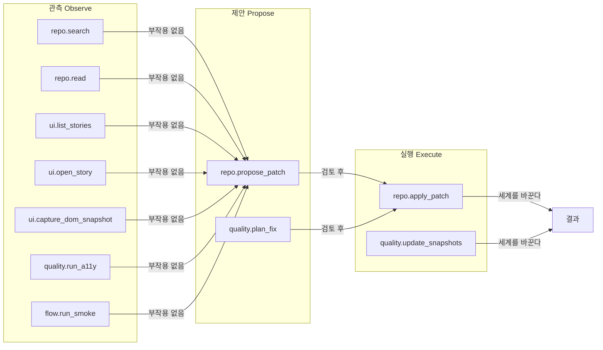
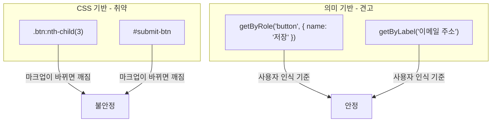
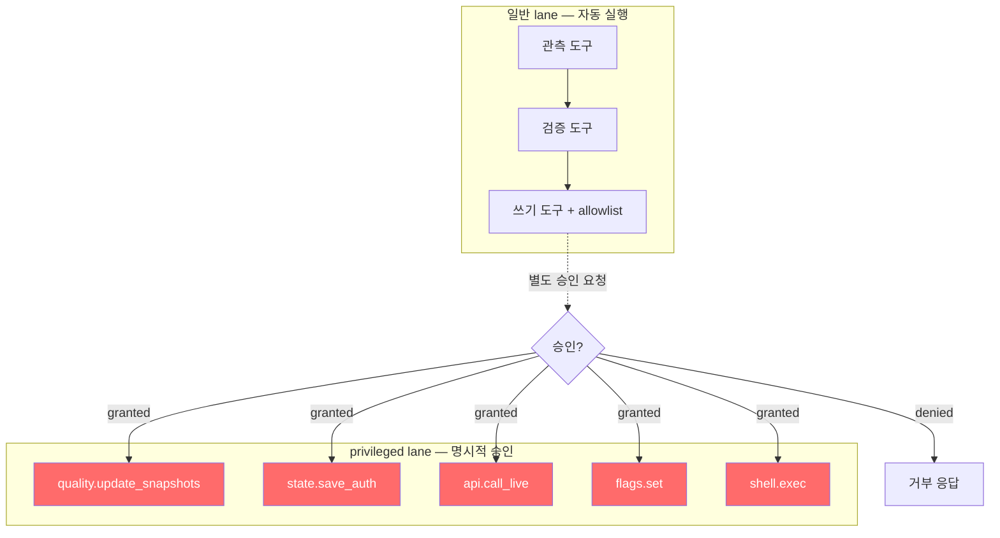
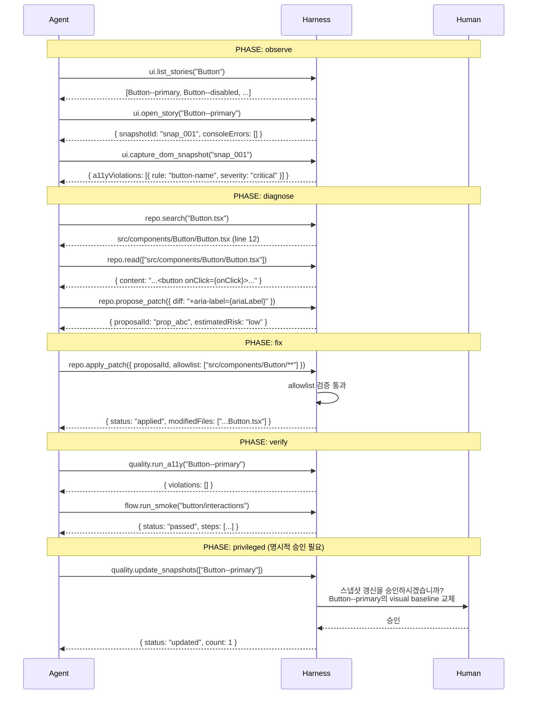

## 만능 agent의 유혹, 그리고 그 위험

프론트엔드 작업을 처음 agent에게 맡겨보는 팀이 흔히 하는 실수가 있다. 두 가지 도구만 주는 것이다.

```typescript
const tools = [
  { name: "edit_file", description: "파일을 수정한다" },
  { name: "run_bash", description: "쉘 명령을 실행한다" },
];
```

이 두 가지면 이론적으로 뭐든 할 수 있다. agent는 기뻐하며 작업에 착수한다. 그리고 얼마 지나지 않아 팀은 다음 중 하나를 경험한다.

```bash
# agent가 버튼 색상 변경 요청에 대해 실행한 명령
sed -i 's/color: blue/color: red/g' **/*.css
# 의도: 특정 버튼의 색상 변경
# 실제: 모든 CSS 파일의 blue → red 전역 치환
```

이것은 agent가 나쁜 것이 아니다. agent에게 **범위가 없는 권한**을 줬기 때문이다. `edit_file` 하나와 `run_bash` 하나만 있는 하네스는 하네스가 아니다. 그것은 그냥 열린 문이다.

진짜 하네스 엔지니어링은 **agent가 무엇을 할 수 있는지를 설계하는 일**이다. 그 설계의 핵심 원칙은 단순하다.

> **읽기는 넓게, 쓰기는 좁게.**

---

## 원칙 1: 3단 스펙트럼으로 도구를 분류하라

모든 도구는 동등하지 않다. 세계에 미치는 영향력에 따라 세 단계로 분류할 수 있다.



### 관측 도구 — 가장 넓게 허용

관측 도구는 agent가 자유롭게, 반복적으로 사용할 수 있어야 한다. **부작용이 없다.** 실행해도 세계가 달라지지 않는다.

하네스에 포함할 관측 도구 7종의 TypeScript 인터페이스를 구체적으로 정의하면 다음과 같다.

```typescript
// 1. 코드베이스 전문 검색 — semantic query 지원
interface RepoSearchTool {
  name: "repo.search";
  params: {
    query: string;
    fileGlob?: string;       // "**/*.tsx" 등 파일 필터
    contextLines?: number;   // 결과 주변 맥락 행 수, 기본 3
  };
  returns: {
    matches: Array<{
      file: string;
      line: number;
      snippet: string;       // contextLines 포함
      score: number;         // 관련도 0~1
    }>;
    totalMatches: number;
  };
}

// 2. 복수 파일 동시 읽기 — 단일 호출로 여러 파일
interface RepoReadTool {
  name: "repo.read";
  params: {
    paths: string[];         // 최대 20개 동시 요청 권장
    encoding?: "utf8" | "base64";
  };
  returns: {
    files: Array<{
      path: string;
      content: string;
      lineCount: number;
      exists: boolean;       // 없으면 false, 오류 아님
    }>;
  };
}

// 3. Storybook story 목록 조회
interface UiListStoriesTool {
  name: "ui.list_stories";
  params: {
    component?: string;      // "Button" — 없으면 전체 목록
    tags?: string[];         // ["a11y", "visual"] 등 필터
  };
  returns: {
    stories: Array<{
      storyId: string;       // "Button--primary"
      component: string;
      variant: string;
      tags: string[];
    }>;
    total: number;
  };
}

// 4. 특정 story 렌더링 및 관찰
interface UiOpenStoryTool {
  name: "ui.open_story";
  params: {
    storyId: string;
    viewport?: { width: number; height: number };
    waitFor?: "networkIdle" | "domReady";  // 기본 networkIdle
  };
  returns: {
    storyId: string;
    renderStatus: "success" | "error" | "timeout";
    consoleErrors: string[];               // 렌더 오류만 필터
    snapshotId: string;                    // 후속 도구가 참조
  };
}

// 5. DOM 스냅샷 — 필터링된 핵심 정보만
interface UiCaptureDomSnapshotTool {
  name: "ui.capture_dom_snapshot";
  params: {
    snapshotId: string;      // open_story 반환값
    selector?: string;       // 특정 요소만 캡처할 경우
    includeA11yTree?: boolean; // 기본 true
  };
  returns: {
    screenshotPath: string;  // 전체 base64가 아닌 파일 경로
    a11yViolations: A11yViolation[];
    interactiveElements: Array<{
      role: string;
      name: string;
      selector: string;
    }>;
    // 전체 DOM HTML은 포함하지 않음 — artifact reference 패턴
    domArtifactId: string;   // 필요 시 별도 도구로 조회
  };
}

// 6. 접근성 자동 검사
interface QualityRunA11yTool {
  name: "quality.run_a11y";
  params: {
    target: string;          // storyId 또는 URL
    rules?: string[];        // axe-core rule ID 필터
    level?: "A" | "AA" | "AAA"; // WCAG 레벨
  };
  returns: {
    violations: A11yViolation[];
    passes: number;
    incomplete: number;      // 수동 검토 필요
    runAt: string;
  };
}

// 7. E2E smoke flow 실행 — 읽기 전용, 상태 변경 없음
interface FlowRunSmokeTool {
  name: "flow.run_smoke";
  params: {
    flowId: string;          // "auth/login", "checkout/complete"
    seed?: Record<string, unknown>; // 테스트 데이터 seed
    dryRun?: boolean;        // true면 상태 변경 없이 경로만 검증
  };
  returns: {
    status: "passed" | "failed" | "skipped";
    steps: FlowStep[];
    failedStep?: FlowStepDetail; // 실패 시 상세 정보
    duration: number;
  };
}

// 공통 타입
interface A11yViolation {
  rule: string;
  severity: "critical" | "serious" | "moderate" | "minor";
  element: string;
  location: string;          // breadcrumb: "Auth/SignupModal > SubmitButton"
  fix_hint: string;
}

interface FlowStep {
  name: string;
  status: "passed" | "failed" | "skipped";
  duration: number;
}

interface FlowStepDetail extends FlowStep {
  action: string;            // "click", "fill", "navigate"
  target: string;            // locator 문자열
  expected: string;
  actual: string;
  screenshotPath: string;    // 실패 시점 스크린샷
  errorMessage: string;
}
```

agent는 이 도구들을 "생각하는 도구"로 사용한다. 코드를 이해하고, UI를 관찰하고, 패턴을 파악하는 과정은 몇 번을 반복해도 안전하다. 인터페이스의 `returns` 타입이 이미 필터링되어 있다는 것에 주목하라. `ui.capture_dom_snapshot`은 전체 DOM HTML을 돌려주지 않는다. `domArtifactId`만 돌려주고, 필요하면 별도로 조회한다.

### 제안 도구 — 중간, 검토 가능한 형태로

제안 도구는 agent가 의도를 **구체적이고 검토 가능한 형태로 표현**하는 도구다. 실행하지 않는다. 제안만 한다.

```typescript
interface ProposePatchParams {
  target: string;
  change: string;            // 자연어 설명
  diff: string;              // unified diff 형식
  context?: string;          // agent의 근거 설명
}

interface Proposal {
  proposalId: string;        // "prop_abc123"
  diff: string;
  targetFiles: string[];     // diff에서 추출된 파일 목록
  estimatedRisk: "low" | "medium" | "high";
  riskReason?: string;       // risk가 medium 이상이면 이유 명시
  createdAt: string;
  expiresAt: string;         // 제안은 TTL 존재, 오래된 제안 자동 무효
}

// dry-run 패턴: 실제 적용 전 시뮬레이션
interface DryRunResult {
  wouldSucceed: boolean;
  affectedFiles: string[];
  wouldViolateAllowlist: string[];  // 빈 배열이면 통과
  conflictsWithExisting: string[];  // merge conflict 가능성
  estimatedDiff: string;            // 최종 적용될 diff 미리보기
}

// 사용 예시
const proposal = await repo.propose_patch({
  target: "src/components/Button/Button.tsx",
  change: "aria-label prop 추가로 접근성 위반 수정",
  diff: `
-  <button className={styles.button} onClick={onClick}>
+  <button className={styles.button} onClick={onClick} aria-label={ariaLabel}>
  `,
  context: "quality.run_a11y에서 button-name 규칙 위반 감지됨",
});
// 반환:
// {
//   proposalId: "prop_abc123",
//   targetFiles: ["src/components/Button/Button.tsx"],
//   estimatedRisk: "low",
//   expiresAt: "2026-03-19T14:30:00Z"
// }

// dry-run으로 사전 검증
const dryRun = await repo.dry_run_patch({
  proposalId: proposal.proposalId,
  allowlist: ["src/components/Button/**"],
});
// wouldViolateAllowlist가 비어있으면 apply로 진행
```

제안 단계가 존재하면 두 가지 이점이 생긴다. 첫째, 사람이 검토할 수 있다. 둘째, agent 자신도 제안을 "되돌아볼" 수 있다 — dry-run으로 allowlist 충돌을 미리 확인한 후 실행 도구로 넘길 수 있다. `expiresAt` 필드는 오래된 제안이 stale한 코드 상태를 기반으로 적용되는 것을 막는다.

### 실행 도구 — 가장 좁게 제한

실행 도구는 세계를 바꾼다. 이 도구들은 **allowlist와 glob 매칭**이 붙어야 한다.

```typescript
// allowlist glob 매칭 구현
import { minimatch } from "minimatch";

function matchesAllowlist(filePath: string, allowlist: string[]): boolean {
  return allowlist.some((pattern) =>
    minimatch(filePath, pattern, {
      dot: true,       // 숨김 파일도 매칭 대상
      matchBase: false // 전체 경로 기준 매칭
    })
  );
}

function extractTargetFiles(diff: string): string[] {
  // unified diff에서 변경 대상 파일 목록 추출
  return diff
    .split("\n")
    .filter((line) => line.startsWith("+++ b/"))
    .map((line) => line.replace("+++ b/", "").trim());
}

// apply_patch 구현부
async function applyPatch(params: {
  proposalId: string;
  diff: string;
  allowlist: string[];
}): Promise<ApplyResult> {
  const targetFiles = extractTargetFiles(params.diff);
  const blockedFiles = targetFiles.filter(
    (file) => !matchesAllowlist(file, params.allowlist)
  );

  if (blockedFiles.length > 0) {
    // 오류가 아닌 "정보를 가진 거부" — agent가 학습할 수 있는 형태
    return {
      status: "rejected",
      reason: `allowlist 외 파일이 포함되어 있습니다`,
      blockedFiles,
      allowedPaths: params.allowlist,
      suggestion: "allowlist를 확장하거나 변경 범위를 축소하세요",
    };
  }

  // 통과 — 실제 파일 시스템 쓰기
  await writeFilesFromDiff(params.diff);
  return {
    status: "applied",
    modifiedFiles: targetFiles,
    proposalId: params.proposalId,
  };
}
```

allowlist 위반 시의 응답이 단순 오류가 아닌 `blockedFiles`, `allowedPaths`, `suggestion`을 포함하는 것이 중요하다. agent는 이 구조화된 거부에서 **왜 거부됐는지, 어떻게 재시도해야 하는지**를 이해하고 자체 수정한다. 에러 문자열만 돌려주면 agent는 같은 실수를 반복한다.

---

## 원칙 2: Generic tool보다 Semantic tool

Anthropic의 tool design guidance의 핵심 원칙:

> "더 많은 도구가 좋은 것이 아니다. 소수의 잘 설계된 high-impact workflow용 도구가 중요하다."

도구가 과잉(tool overload)되면 세 가지 증상이 나타난다. **선택 마비** — 유사한 목적의 도구가 많으면 agent가 매번 다른 도구를 선택한다. **설명 경쟁** — 각 도구의 description이 겹치면 tool selection이 예측 불가능해진다. **컨텍스트 오염** — 사용되지 않는 도구의 스키마가 context window를 차지한다.

### BAD: 만능 generic tool

```typescript
const tools = [
  {
    name: "edit_file",
    description: "파일 경로와 내용을 받아 파일을 수정한다",
    parameters: { path: "string", content: "string" },
  },
  {
    name: "run_command",
    description: "쉘 명령을 실행한다",
    parameters: { command: "string" },
  },
];
```

이 설계의 문제는 도구의 "의미"가 없다는 것이다. `edit_file`로 `.gitignore`를 수정할 수도 있고, `run_command`로 파일을 삭제할 수도 있다. 도구의 의미가 없으니 agent의 판단에 모든 것을 맡기게 된다.

### GOOD: Semantic tool

```typescript
const tools = [
  {
    name: "ui.open_story",
    description:
      "Storybook에서 특정 story를 열어 렌더링 상태를 관찰한다. " +
      "컴포넌트의 현재 visual 상태를 확인할 때 사용한다. " +
      "코드 내용 탐색은 repo.read를 사용하라.",
    parameters: { storyId: "string" },
  },
  {
    name: "repo.apply_patch",
    description:
      "검토된 diff를 허용된 경로에만 적용한다. 코드 변경이 필요할 때 사용한다. " +
      "반드시 repo.propose_patch로 제안을 먼저 생성한 후 proposalId를 사용하라. " +
      "read-only 탐색이 필요하면 repo.read를 사용하라.",
    parameters: {
      proposalId: "string",
      diff: "string",
      allowlist: "string[]",
    },
  },
  {
    name: "quality.run_a11y",
    description:
      "지정된 story 또는 URL에 대해 접근성 검사를 실행한다. " +
      "axe-core 기반. 위반사항이 없으면 violations 배열이 비어있다.",
    parameters: {
      target: "string",
      rules: "string[] (optional)",
      level: "'A' | 'AA' | 'AAA' (optional, 기본 AA)",
    },
  },
];
```

각 도구의 이름만 봐도 무엇을 하는지, 어떤 범위인지가 명확하다. description에 "언제 이 도구를 쓰지 말아야 하는지"를 명시하는 것이 tool selection 정확도를 높인다. Anthropic 가이드라인에서 이 패턴을 명시적으로 권고한다.

### Playwright Locator 철학과의 연결

이것은 Playwright의 locator 철학과 정확히 같은 방향이다.



`getByRole('button', { name: '저장' })`은 agent에게 "버튼의 CSS 클래스가 무엇인지 알 필요 없다. 역할과 이름만 알면 된다"고 말한다. 이것은 agent tool에서 `update_component_props({ componentId, newProps })`가 "파일의 몇 번째 줄을 어떻게 바꿔야 하는지 알 필요 없다"고 말하는 것과 동일한 패턴이다.

| BAD (구현 기반) | GOOD (의미 기반) |
|----------------|-----------------|
| `click('.btn:nth-child(3)')` | `click_button('저장')` |
| `fill('#email-input', value)` | `fill_field('이메일', value)` |
| `screenshot({ path: 'tmp.png' })` | `capture_visual_state('Auth/SignupModal--error')` |

---

## 원칙 3: Tool output은 high-signal이어야 한다

Anthropic의 guidance:

> "Tool response는 contextually relevant, high-signal information을 돌려줘야 한다."

LLM은 "주의 예산(attention budget)"을 갖고 있다. Context 중간에 위치한 정보는 시작과 끝에 비해 recall rate가 낮다 (U-shaped attention curve). 도구 출력이 불필요한 데이터로 가득 차면 이 예산이 소진된다. 이를 **context rot**이라 부른다 — context가 점차 저품질 신호로 부패하는 현상이다.

### BAD: `ui.capture_dom_snapshot`의 raw dump

```json
{
  "html": "<html><head><meta charset='utf-8'><title>Storybook</title>...[전체 DOM 3000줄]...",
  "console_logs": [
    "[HMR] connected",
    "[webpack] compiled successfully in 1.2s",
    "...[200줄 빌드 로그]..."
  ],
  "network_requests": [
    { "url": "http://localhost:6006/main.js", "status": 200, "size": 245000 },
    { "url": "http://localhost:6006/vendors.js", "status": 200, "size": 1200000 },
    "...[47개 전체]..."
  ],
  "computed_styles": {
    ".button": { "color": "rgb(255,255,255)", "background-color": "rgb(59,130,246)", "...[300개 속성]...": "..." }
  }
}
```

토큰 비용: 40,000~60,000 tokens. Agent가 신호를 찾기 위해 노이즈를 탐색해야 한다. 접근성 위반 한 줄을 찾기 위해 3000줄의 DOM을 읽는다.

### GOOD: `ui.capture_dom_snapshot`의 distilled signal

```json
{
  "snapshotId": "snap_abc123",
  "screenshotPath": "/tmp/harness/snap_abc123.png",
  "a11yViolations": [
    {
      "rule": "button-name",
      "severity": "critical",
      "element": "<button class='icon-btn'>",
      "location": "Auth/SignupModal > SubmitButton",
      "fix_hint": "aria-label 또는 visible text 필요"
    }
  ],
  "interactiveElements": [
    { "role": "button", "name": "", "selector": ".icon-btn" },
    { "role": "textbox", "name": "이메일", "selector": "#email-input" }
  ],
  "consoleErrors": [],
  "domArtifactId": "dom_abc123"
}
```

토큰 비용: 500~2,000 tokens. Agent가 즉시 다음 행동을 결정할 수 있다. 전체 DOM이 필요하면 `domArtifactId`로 별도 조회한다.

### BAD: `flow.run_smoke`의 실패 케이스 — 정보 없는 실패

```json
{
  "status": "failed",
  "error": "Error: Test failed"
}
```

agent가 이 output으로 할 수 있는 것은 없다. 어떤 단계가 실패했는지, 무엇을 기대했는지, 실제로 무엇을 봤는지 아무것도 없다.

### GOOD: `flow.run_smoke`의 실패 케이스 — 행동 가능한 상세

```json
{
  "flowId": "auth/login",
  "status": "failed",
  "steps": [
    { "name": "navigate to /login", "status": "passed", "duration": 120 },
    { "name": "fill email", "status": "passed", "duration": 45 },
    { "name": "fill password", "status": "passed", "duration": 38 },
    { "name": "click submit", "status": "failed", "duration": 5001 }
  ],
  "failedStep": {
    "name": "click submit",
    "action": "click",
    "target": "getByRole('button', { name: '로그인' })",
    "expected": "navigate to /dashboard within 3000ms",
    "actual": "timeout — page remained at /login after 5000ms",
    "screenshotPath": "/tmp/harness/flow_auth_login_failed.png",
    "errorMessage": "Timeout 5000ms exceeded. page.waitForURL('/dashboard')"
  },
  "duration": 5204
}
```

agent는 `failedStep.actual`에서 "로그인 후 /dashboard로 이동하지 않았다"는 것을 파악하고, `screenshotPath`로 시각적 확인을 요청하거나, 서버 측 에러 가능성을 탐색하는 다음 행동을 즉시 결정할 수 있다.

### Artifact Reference 패턴 구현

Screenshot이나 대용량 DOM을 output에 직접 포함하지 않고 참조(reference)로 처리하는 패턴이다.

```typescript
// artifact store — 대용량 데이터를 메모리 또는 파일에 보관
class ArtifactStore {
  private artifacts = new Map<string, Artifact>();

  store(type: "screenshot" | "dom" | "trace", data: Buffer | string): string {
    const id = `${type}_${crypto.randomUUID().slice(0, 8)}`;
    const path = `/tmp/harness/${id}`;

    if (data instanceof Buffer) {
      fs.writeFileSync(path, data);
    } else {
      fs.writeFileSync(path, data, "utf8");
    }

    this.artifacts.set(id, { id, type, path, createdAt: new Date() });
    return id;
  }

  retrieve(id: string): Artifact | undefined {
    return this.artifacts.get(id);
  }
}

// tool output 생성 시 artifact reference 패턴 적용
async function captureDomSnapshot(params: UiCaptureDomSnapshotParams) {
  const screenshot = await page.screenshot({ fullPage: true });
  const domHtml = await page.content();
  const a11yTree = await page.accessibility.snapshot();

  // 대용량 데이터는 store에 보관하고 id만 반환
  const screenshotPath = artifactStore.store("screenshot", screenshot);
  const domArtifactId = artifactStore.store("dom", domHtml);

  // a11y violations은 소용량이므로 직접 포함
  const violations = await extractA11yViolations(a11yTree);

  return {
    snapshotId: `snap_${crypto.randomUUID().slice(0, 8)}`,
    screenshotPath,        // 파일 경로 (base64 인코딩 아님)
    domArtifactId,         // 필요 시 retrieve_artifact 도구로 조회
    a11yViolations: violations,
    interactiveElements: extractInteractiveElements(a11yTree),
  };
}
```

Anthropic의 실험에 따르면 동적 필터링 적용 시 **평균 11% 정확도 향상**과 **평균 24% 입력 토큰 절감** 효과가 나타났다. 코드 실행 기반 접근에서는 150,000 tokens에서 2,000 tokens로 98.7% 절감을 달성한 사례도 있다. Artifact reference 패턴이 이 절감의 핵심 기제다.

---

## 원칙 4: Destructive 도구는 별도 lane에 둔다

MCP(Model Context Protocol) security guidance는 로컬 command execution에 대해 네 가지를 요구한다:

1. **Exact command disclosure** — agent가 실행하는 정확한 명령을 사전에 공개
2. **Explicit approval** — 실행 전에 명시적 승인
3. **Minimal default privileges** — 기본 권한은 최소, 추가 권한은 명시적 부여
4. **Sandboxing** — 격리된 환경에서 실행 (읽기 전용 파일시스템, allowlist 네트워크)

### Privileged lane 격리 구현

프론트엔드 하네스에서 privileged lane에 들어가는 항목들과 각각의 위험 이유:

| 카테고리 | 해당 도구 | 위험 이유 |
|----------|-----------|-----------|
| 스냅샷 갱신 | `quality.update_snapshots` | visual baseline을 바꿈 — 버그를 정상으로 기록할 수 있음 |
| 인증 상태 | `state.save_auth` | 자격증명 관련 — 타 사용자 세션 오염 가능 |
| Live API 호출 | `api.call_live` | 프로덕션 데이터 변경 가능 |
| Feature flag | `flags.set` | 프로덕션 사용자 영향 — 실험 오염 가능 |
| Shell script | `shell.exec` | 임의 코드 실행 — 파일시스템, 네트워크 무제한 접근 |

```typescript
// privileged lane 격리 구현
class PrivilegedLane {
  private pendingApprovals = new Map<string, PendingApproval>();

  async requestExecution(
    tool: PrivilegedTool,
    params: unknown,
    requestedBy: string
  ): Promise<PrivilegedResult> {
    const approvalId = crypto.randomUUID();

    // 1. 정확한 실행 내용을 사전 공개 (exact command disclosure)
    const disclosure = this.buildDisclosure(tool, params);

    // 2. 승인 요청 등록
    this.pendingApprovals.set(approvalId, {
      tool,
      params,
      disclosure,
      requestedBy,
      requestedAt: new Date(),
      expiresAt: new Date(Date.now() + 10 * 60 * 1000), // 10분 TTL
    });

    // 3. 승인 채널로 알림 (Slack, webhook, UI 등)
    await this.notifyApprover({
      approvalId,
      message: `Privileged 작업 승인 요청\n\n${disclosure}`,
    });

    // 4. 승인 대기 (폴링 또는 콜백)
    const approval = await this.waitForApproval(approvalId);

    if (!approval.granted) {
      return { status: "denied", reason: approval.reason };
    }

    // 5. 승인된 경우 실행 — sandboxed 환경에서
    return await this.executeSandboxed(tool, params);
  }

  private buildDisclosure(tool: PrivilegedTool, params: unknown): string {
    switch (tool) {
      case "quality.update_snapshots":
        return `스냅샷 갱신: ${(params as any).stories.join(", ")}의 visual baseline을 현재 렌더링으로 교체합니다.`;
      case "shell.exec":
        return `쉘 실행: \`${(params as any).command}\`\n경고: 임의 명령입니다.`;
      case "flags.set":
        return `Feature flag 변경: ${(params as any).flag} = ${(params as any).value}\n대상: ${(params as any).environment}`;
      default:
        return `${tool} 실행: ${JSON.stringify(params, null, 2)}`;
    }
  }

  private async executeSandboxed(tool: PrivilegedTool, params: unknown) {
    // shell.exec는 Docker 컨테이너 내에서 실행
    if (tool === "shell.exec") {
      return await runInContainer({
        command: (params as any).command,
        readonlyPaths: ["/src"],       // 소스 읽기는 가능
        networkPolicy: "none",         // 네트워크 차단
        timeout: 30_000,
      });
    }
    // 나머지 도구는 별도 격리 레이어
    return await executePrivilegedTool(tool, params);
  }
}
```



---

## ToolCall Discriminated Union — 전체 구현

3단 스펙트럼의 분류를 TypeScript 타입 시스템으로 표현하면 discriminated union이 자연스럽다. `kind` 필드가 타입을 좁혀(narrow)주고, authorize 함수가 컴파일 타임에 각 케이스를 안전하게 처리한다.

```typescript
// ToolCall discriminated union — 4종류
type ToolCall =
  | ReadToolCall
  | VerifyToolCall
  | WriteToolCall
  | PrivilegedToolCall;

interface ReadToolCall {
  kind: "read";
  tool:
    | "repo.search"
    | "repo.read"
    | "ui.list_stories"
    | "ui.open_story"
    | "ui.capture_dom_snapshot"
    | "quality.run_a11y"
    | "flow.run_smoke";
  params: Record<string, unknown>;
}

interface VerifyToolCall {
  kind: "verify";
  tool: "repo.propose_patch" | "quality.plan_fix" | "repo.dry_run_patch";
  params: Record<string, unknown>;
}

interface WriteToolCall {
  kind: "write";
  tool: "repo.apply_patch";
  params: {
    proposalId: string;
    diff: string;
    allowlist: string[];
  };
}

interface PrivilegedToolCall {
  kind: "privileged";
  tool:
    | "quality.update_snapshots"
    | "state.save_auth"
    | "api.call_live"
    | "flags.set"
    | "shell.exec";
  params: Record<string, unknown>;
}

// authorize — phase 검사, allowlist 검증, risk mismatch 감지 통합
type AuthorizeResult =
  | { allowed: true }
  | { allowed: false; reason: string; suggestion?: string }
  | { allowed: false; requiresApproval: true; prompt: string };

function authorize(
  call: ToolCall,
  context: { currentPhase: Phase; allowedPaths?: string[] }
): AuthorizeResult {
  // 1. privileged 도구는 항상 명시적 승인 필요 — phase 무관
  if (call.kind === "privileged") {
    return {
      allowed: false,
      requiresApproval: true,
      prompt:
        `Privileged 작업을 승인하시겠습니까?\n` +
        `도구: ${call.tool}\n` +
        `파라미터: ${JSON.stringify(call.params, null, 2)}`,
    };
  }

  // 2. phase 검사 — observe 단계는 read만 허용
  if (context.currentPhase === "observe" && call.kind !== "read") {
    return {
      allowed: false,
      reason: `observe 단계에서는 read 도구만 사용할 수 있습니다.`,
      suggestion: `현재 시도: ${call.kind}(${call.tool}). diagnose 단계로 전환 후 재시도하세요.`,
    };
  }

  // 3. diagnose 단계는 read + verify 허용, write 불가
  if (context.currentPhase === "diagnose" && call.kind === "write") {
    return {
      allowed: false,
      reason: `diagnose 단계에서는 쓰기가 허용되지 않습니다.`,
      suggestion: `원인 분석 완료 후 fix 단계로 전환하세요.`,
    };
  }

  // 4. verify 단계는 read만 허용 (재수정 방지)
  if (context.currentPhase === "verify" && call.kind !== "read") {
    return {
      allowed: false,
      reason: `verify 단계에서는 read 도구만 허용됩니다. 수정은 fix 단계로 돌아가세요.`,
    };
  }

  // 5. write 도구 allowlist 검증
  if (call.kind === "write" && call.tool === "repo.apply_patch") {
    if (!context.allowedPaths || context.allowedPaths.length === 0) {
      return {
        allowed: false,
        reason: "write 도구 사용 시 allowlist가 필요합니다.",
        suggestion: "context.allowedPaths에 허용 glob 패턴을 지정하세요.",
      };
    }

    const targetFiles = extractTargetFiles(call.params.diff);
    const blocked = targetFiles.filter(
      (f) => !matchesAllowlist(f, context.allowedPaths!)
    );

    if (blocked.length > 0) {
      return {
        allowed: false,
        reason: `allowlist 외 파일이 포함되어 있습니다: ${blocked.join(", ")}`,
        suggestion: `허용 경로: ${context.allowedPaths.join(", ")}`,
      };
    }
  }

  // 6. risk mismatch 감지 — verify 도구가 write 결과를 제안할 경우
  if (call.kind === "verify" && call.tool === "repo.propose_patch") {
    const risk = (call.params as any).estimatedRisk;
    if (risk === "high" && context.currentPhase !== "fix") {
      return {
        allowed: false,
        reason: `high-risk 제안은 fix 단계에서만 허용됩니다. 현재: ${context.currentPhase}`,
      };
    }
  }

  return { allowed: true };
}

// executeToolCall — 전체 실행 루프
async function executeToolCall(
  call: ToolCall,
  context: HarnessContext
): Promise<ToolResult> {
  // 1. 권한 검사
  const authResult = authorize(call, context);

  if (!authResult.allowed) {
    if ("requiresApproval" in authResult) {
      // privileged — 승인 채널로 이관
      return await context.privilegedLane.requestExecution(
        call.tool as PrivilegedTool,
        call.params,
        context.sessionId
      );
    }
    // 일반 거부 — 구조화된 거부 응답 반환
    return {
      status: "rejected",
      reason: authResult.reason,
      suggestion: authResult.suggestion,
    };
  }

  // 2. 실행 — kind에 따라 분기
  switch (call.kind) {
    case "read":
      return await executeReadTool(call);
    case "verify":
      return await executeVerifyTool(call);
    case "write":
      return await executeWriteTool(call, context.allowedPaths);
    case "privileged":
      // authorize에서 이미 처리됨 — 여기 도달하지 않음
      throw new Error("privileged call should have been intercepted");
  }
}
```

이 구조의 핵심은 `authorize`가 **컴파일 타임에 kind별 분기를 강제**한다는 점이다. `PrivilegedToolCall`에 `allowlist` 필드를 실수로 접근하면 컴파일 오류가 발생한다. TypeScript의 narrowing이 런타임 안전성을 설계 단계에서 보장한다.

---

## Phase-Based 권한: 같은 agent, 다른 능력

동일한 agent라도 현재 작업 단계(phase)에 따라 허용되는 도구가 달라져야 한다. "Phase-based least privilege"는 최소 권한 원칙을 agent의 작업 흐름에 투영한 것이다.

### 도구 권한 매트릭스

| Phase | 목적 | 허용 도구 | 차단 도구 |
|-------|------|-----------|-----------|
| **observe** | 현재 상태 파악 | repo.search, repo.read, ui.*, flow.run_smoke | repo.propose_patch, repo.apply_patch, quality.update_snapshots |
| **diagnose** | 원인 분석 | 모든 read 도구 + quality.run_a11y + repo.propose_patch | repo.apply_patch, 모든 write |
| **fix** | 수정 적용 | repo.apply_patch (allowlist 내) + 모든 read | quality.update_snapshots, flags.set, shell.exec |
| **verify** | 결과 검증 | 모든 read 도구 + quality.run_a11y + flow.run_smoke | 모든 write — 재수정 방지 |

### 실제 시나리오: 접근성 버그 수정 전체 흐름



이 시나리오에서 주목할 점이 있다. agent가 `observe` 단계에서 `repo.apply_patch`를 시도하면 `authorize`가 즉시 거부한다. `verify` 단계에서 fix를 재시도하려 해도 차단된다. **phase 전환은 agent가 명시적으로 선언하거나, 하네스가 자동 전환하는 두 가지 방식**이 모두 가능하다. 전자는 agent의 자율성을 높이고, 후자는 안전성을 높인다.

이 구조의 실용적 이점: observe/diagnose는 자동화하고, fix만 human approval을 유지하는 식으로 **신뢰를 쌓으면서 자율화 수준을 점진적으로 높일 수 있다.**

---

## 설계를 검증하는 5가지 질문

새로운 도구를 하네스에 추가하기 전에 반드시 답해야 할 체크리스트다.

### Q1. 이 도구는 세계를 바꾸는가?

도구가 파일을 수정하거나, 상태를 변경하거나, 외부 시스템에 쓰기 작업을 하면 `write` 또는 `privileged`로 분류한다. 읽기만 하면 `read`다. 읽고 임시 데이터를 생성하는 것(스크린샷 파일 저장)은 `read`다 — 하네스 외부의 세계를 바꾸지 않기 때문이다.

```typescript
// 판단 기준
function classifyTool(tool: ToolDefinition): ToolKind {
  const sideEffectKeywords = ["apply", "update", "delete", "set", "save", "exec", "create"];
  const privilegedKeywords = ["snapshot", "auth", "flag", "shell", "live"];

  const name = tool.name.toLowerCase();

  if (privilegedKeywords.some((k) => name.includes(k))) return "privileged";
  if (sideEffectKeywords.some((k) => name.includes(k))) return "write";
  return "read";
}
```

### Q2. 이 도구의 output이 agent의 다음 결정에 직접 사용되는가?

output의 모든 필드가 다음 tool call을 결정하는 데 사용되지 않는다면, 그 필드는 context를 오염시키는 노이즈다. 각 필드에 "이 정보가 없으면 agent가 잘못된 결정을 내리는가?"를 물어보라.

```typescript
// output 설계 체크리스트
interface OutputField {
  name: string;
  usedForDecision: boolean;   // agent의 다음 결정에 사용?
  estimatedTokens: number;    // 이 필드의 토큰 비용
  canBeArtifact: boolean;     // 대용량이면 artifact로 분리 가능?
}
```

### Q3. 도구 이름만 보고 언제 쓰고 언제 쓰지 말아야 하는지 알 수 있는가?

`ui.capture_dom_snapshot`은 "DOM을 캡처한다"는 것을 이름에서 알 수 있다. `run_thing`은 "무언가를 실행한다"는 것 외에 아무것도 말하지 않는다. description의 첫 문장이 도구의 positive use case, 두 번째 문장이 negative use case(언제 쓰지 말아야 하는지)를 담아야 한다.

### Q4. 이 도구가 실패할 때 agent가 자체 수정할 수 있는 정보를 돌려주는가?

거부 응답에 `reason`, `suggestion`, `allowedPaths` 등 복구 가능한 정보가 담겨 있어야 한다. 단순 `Error: not allowed` 메시지는 agent를 루프에 빠뜨린다.

```typescript
// 나쁜 실패 응답
throw new Error("Permission denied");

// 좋은 실패 응답
return {
  status: "rejected",
  reason: "현재 phase(observe)에서 write 도구는 허용되지 않습니다",
  currentPhase: "observe",
  requiredPhase: "fix",
  suggestion: "diagnose 단계에서 원인을 파악한 후 fix 단계로 전환하세요",
};
```

### Q5. 이 도구가 privileged lane에 속해야 하는가?

다음 중 하나라도 해당하면 privileged다:

- **기준선 변경**: 이 도구가 성공/실패 판단의 기준이 되는 데이터를 수정하는가? (snapshot, golden file)
- **자격증명 접근**: 토큰, 비밀번호, API 키를 읽거나 쓰는가?
- **프로덕션 영향**: 이 도구의 결과가 프로덕션 사용자에게 직접 노출되는가? (feature flag, live API)
- **임의 코드**: 실행될 내용이 사전에 정해져 있지 않은가? (shell.exec, eval)

```typescript
const PRIVILEGED_CRITERIA = [
  (tool: ToolDefinition) => tool.modifiesBaseline,
  (tool: ToolDefinition) => tool.accessesCredentials,
  (tool: ToolDefinition) => tool.affectsProduction,
  (tool: ToolDefinition) => tool.executesArbitraryCode,
] as const;

function requiresPrivilegedLane(tool: ToolDefinition): boolean {
  return PRIVILEGED_CRITERIA.some((criterion) => criterion(tool));
}
```

---

## 핵심 정리

이 편의 핵심을 한 문장으로 요약하면:

> **agent가 자유롭게 "생각"하는 것이 아니라, 그 생각을 어떤 effect로 바꿀 수 있는지를 하네스가 결정한다.**

도구의 분류(`kind`), 도구의 의미(`semantic tool`), 도구의 output(`high-signal`), 도구의 격리(`privileged lane`), 도구의 phase(`authorize`) — 이 다섯 가지가 맞물릴 때, agent는 충분히 강력하면서도 충분히 안전하다.

Anthropic의 동적 필터링 실험이 보여준 11% 정확도 향상과 24% 토큰 절감은 "더 많은 도구, 더 많은 정보"가 아닌 **"정확히 필요한 도구, 정확히 필요한 정보"**가 agent 성능을 높인다는 것을 수치로 입증한다. U-shaped attention curve는 context를 아끼는 것이 미덕이 아닌 필수임을 말한다. 중간에 묻힌 정보는 agent에게도 읽히지 않는다.

다음 편에서는 이 도구들이 다루는 **"상태"**가 프론트엔드에서 왜 특별히 어려운지를 다룬다. Source, Component, Browser, Network, Product/External — 프론트엔드 상태의 다섯 층을 분해하고, 층 간 혼동이 만드는 체계적 착각을 구체적으로 짚어본다.
