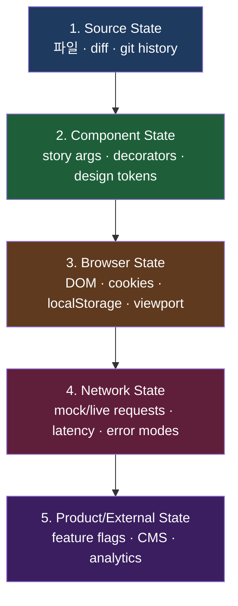
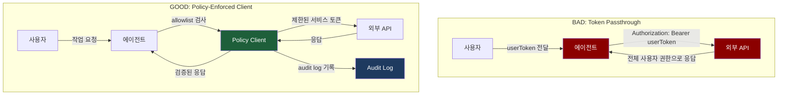

## Story에서는 완벽했는데, Route에서는 깨졌다

agent가 `ProductCard` 컴포넌트의 레이아웃 버그를 수정했다. Storybook story를 열면 완벽하게 렌더링된다. `Primary`, `WithDiscount`, `OutOfStock` — 모든 variant가 의도한 대로 보인다. agent는 작업이 완료됐다고 판단한다.

그런데 실제 `/products/:id` route에서 해당 컴포넌트를 확인해보면 레이아웃이 무너져 있다.

```typescript
// Story에서의 product prop
const mockProduct = {
  id: "prod-001",
  name: "Wireless Headphones",
  price: "129.99",      // string
  inStock: true,
};

// 실제 API 응답 — GET /api/products/prod-001
{
  "id": "prod-001",
  "name": "Wireless Headphones",
  "price": 129.99,              // number — story와 다른 타입!
  "is_stock_available": true    // 다른 필드 이름!
}
```

Story에서는 `price`가 `string`이었고, 컴포넌트가 `toFixed`를 호출하지 않는 path를 타면서 문제가 보이지 않았다. 실제 API에서는 `number`가 내려오고 `toFixed`가 호출되면서 에러가 발생한다.

agent가 story에서 성공했다고 해서 실제 환경에서도 성공한다는 보장은 없다. 두 환경이 **다른 상태 층**을 다루고 있기 때문이다. 이것이 State Mediation이 해결하려는 문제다.

---

## 프론트엔드 상태는 한 겹이 아니다 — 다섯 층

하네스 엔지니어링의 관점에서 프론트엔드 상태는 다섯 층으로 분해된다.



각 층은 서로 다른 도구로 다루어야 하고, 서로 다른 격리 전략이 필요하다. **한 층에서의 성공이 다른 층의 성공을 보장하지 않는다.**

---

## Layer 1: Source State — `diff apply` vs `overwrite`의 차이

파일 시스템에 존재하는 코드 자체, diff, git history가 이 층에 해당한다. 언뜻 단순해 보이지만, 에이전트가 파일을 다루는 방식이 이 층의 신뢰성 전체를 결정한다.

### `diff apply` vs `overwrite` — 왜 차이가 치명적인가

에이전트가 파일을 수정하는 방법은 크게 두 가지다. 변경 사항을 unified diff 형태로 기존 파일에 적용하거나(diff apply), 수정된 전체 파일 내용을 새로 작성하거나(overwrite). 겉으로 보면 결과가 같아 보이지만, 프로세스 관점에서 두 방법은 완전히 다른 위험 프로파일을 가진다.

**overwrite의 세 가지 위험:**

첫째, 동시성 충돌(concurrency conflict)을 감지할 수 없다. 에이전트가 파일을 읽은 시점과 새 내용을 쓰는 시점 사이에 다른 프로세스가 파일을 수정했다면, 그 변경 사항은 조용히 사라진다.

둘째, diff apply는 컨텍스트 줄(context lines)을 통해 적용 위치를 검증한다. 변경 대상 줄 위아래의 코드가 예상과 다르면 patch 적용이 실패한다. overwrite는 이런 검증이 없다.

셋째, git history 연속성이 깨진다. diff apply는 변경된 줄만 수정하므로 `git blame`이 각 줄의 실제 변경 시점을 정확하게 추적한다. overwrite로 생성된 커밋은 변경된 줄이 아닌 "모든 줄이 이 시점에 작성됨"으로 기록된다.

```typescript
// GOOD: 변경 사항을 diff로 추적 — 히스토리 보존, 충돌 감지
interface SourceStateInterface {
  read(path: string): Promise<string>;
  applyDiff(path: string, diff: UnifiedDiff): Promise<ApplyResult>;
  getHistory(path: string, limit?: number): Promise<Commit[]>;
  getDiff(fromRef: string, toRef: string, path?: string): Promise<string>;
}

// ApplyResult는 성공 여부와 함께 실제로 적용된 hunk 목록을 반환
interface ApplyResult {
  success: boolean;
  appliedHunks: number;
  failedHunks: HunkFailure[];
  // 실패한 hunk가 있으면 partial apply도 롤백
}

// BAD: 전체 파일을 한 번에 덮어쓰기 — 히스토리 손실, 충돌 감지 불가
interface BadSourceState {
  overwrite(path: string, content: string): Promise<void>;
  // Promise<void>가 반환 타입인 것 자체가 경고 신호 — 성공 검증이 없다
}
```

### git history를 통한 변경 추적의 중요성

에이전트가 코드베이스를 수정할 때 git history는 단순한 백업이 아니라 **의도의 기록**이다. 각 커밋은 "이 변경이 왜 필요했는가"를 기록하고, 향후 에이전트가 동일 파일을 다시 수정할 때 컨텍스트를 제공한다.

```typescript
// git history 기반 변경 추적 구현
class SourceStateTracker {
  async getRecentChanges(path: string, limit = 10): Promise<ChangeContext[]> {
    const commits = await this.git.log({ file: path, maxCount: limit });
    return commits.map(commit => ({
      hash: commit.hash.slice(0, 7),
      message: commit.message,
      author: commit.author,
      timestamp: commit.date,
      // 어떤 줄이 변경되었는지 — 이후 에이전트 작업의 컨텍스트
      changedLines: commit.diff?.stats,
    }));
  }

  // 특정 변경이 언제, 왜 도입되었는지 추적
  async blameRange(
    path: string,
    startLine: number,
    endLine: number
  ): Promise<BlameEntry[]> {
    return this.git.blame(path, { startLine, endLine });
  }
}
```

---

## Layer 2: Component State — Storybook story가 "상태의 뷰"로 작동하는 메커니즘

Story args, decorators, mocked props — 컴포넌트가 렌더링되기 위해 필요한 모든 설정이 이 층에 속한다. Storybook이 "clean-room 환경"이라 불리는 이유다.

### Story가 단순한 예시가 아닌 "상태 명세"인 이유

Story를 단순히 컴포넌트를 보여주는 문서로 취급하면, 이 층의 가치가 절반으로 줄어든다. Story는 **컴포넌트가 올바르게 동작하기 위해 필요한 상태를 명시적으로 선언하는 명세**다.

```typescript
// src/stories/ProductCard.stories.tsx
import type { Meta, StoryObj } from '@storybook/react';
import { expect, userEvent, within } from '@storybook/test';
import { ProductCard } from '../components/ProductCard';
import { ProductSchema } from '../schemas/product';

const meta: Meta<typeof ProductCard> = {
  title: 'Commerce/ProductCard',
  component: ProductCard,
  // Decorator: 모든 story에 적용되는 전역 래퍼
  // 실제 앱의 Context Provider 구조를 재현
  decorators: [
    (Story) => (
      <ThemeProvider theme={defaultTheme}>
        <CartProvider initialItems={[]}>
          <Story />
        </CartProvider>
      </ThemeProvider>
    ),
  ],
  // argTypes: 각 prop의 타입과 제약을 명시
  argTypes: {
    product: {
      description: 'ProductSchema로 검증된 product 객체',
    },
    onAddToCart: { action: 'addToCart' },
  },
};

export default meta;
type Story = StoryObj<typeof ProductCard>;

// 기본 story — ProductSchema 기반 mock data
export const Primary: Story = {
  args: {
    // Schema.parse()를 통과한 데이터만 사용 — Layer 1 착각을 방지
    product: ProductSchema.parse({
      id: 'prod-001',
      name: 'Wireless Headphones',
      price: 129.99,        // number — Schema 정의와 일치
      inStock: true,
    }),
  },
};
```

### play 함수와 interaction test — 상태 전환의 검증

`play` 함수는 story가 렌더링된 후 자동으로 실행되는 interaction 시퀀스를 정의한다. 이를 통해 컴포넌트의 **상태 전환(state transition)**을 story 안에서 검증할 수 있다.

```typescript
export const AddToCartFlow: Story = {
  args: {
    product: ProductSchema.parse({
      id: 'prod-002',
      name: 'Bluetooth Speaker',
      price: 79.99,
      inStock: true,
    }),
  },
  // play 함수: story 렌더링 후 자동 실행되는 interaction 시퀀스
  play: async ({ canvasElement, args }) => {
    const canvas = within(canvasElement);

    // 1. 초기 상태 확인
    const addButton = canvas.getByRole('button', { name: '장바구니 추가' });
    await expect(addButton).toBeEnabled();

    // 2. 사용자 인터랙션 시뮬레이션
    await userEvent.click(addButton);

    // 3. 상태 전환 후 결과 검증
    await expect(addButton).toHaveText('추가됨');
    await expect(args.onAddToCart).toHaveBeenCalledWith('prod-002');

    // 4. 로딩 상태 검증 (비동기 작업이 있는 경우)
    await expect(canvas.getByTestId('loading-spinner')).not.toBeInTheDocument();
  },
};

// OutOfStock 상태 — 버튼 비활성화 검증
export const OutOfStock: Story = {
  args: {
    product: ProductSchema.parse({
      id: 'prod-003',
      name: 'Sold Out Item',
      price: 49.99,
      inStock: false,
    }),
  },
  play: async ({ canvasElement }) => {
    const canvas = within(canvasElement);
    const addButton = canvas.getByRole('button', { name: '품절' });
    await expect(addButton).toBeDisabled();
    // 비활성화된 버튼 클릭 시 아무 일도 일어나지 않음을 확인
    await userEvent.click(addButton);
    await expect(addButton).toHaveText('품절'); // 텍스트 변화 없음
  },
};
```

### Decorator 패턴 — 실제 앱 환경 재현

Decorator는 story가 실제 앱에서 동작하는 컨텍스트를 재현한다. Provider 누락으로 인한 "works in story, breaks in app" 문제를 방지하는 핵심 메커니즘이다.

```typescript
// .storybook/preview.tsx — 전역 decorator 설정
import type { Preview } from '@storybook/react';
import { initialize, mswLoader } from 'msw-storybook-addon';

initialize({ onUnhandledRequest: 'warn' });

const preview: Preview = {
  // 모든 story에 공통 적용되는 decorator 스택
  decorators: [
    // 1. 최외곽: 앱 전체 Provider 구조 재현
    (Story) => (
      <QueryClientProvider client={new QueryClient()}>
        <AuthProvider>
          <Story />
        </AuthProvider>
      </QueryClientProvider>
    ),
    // 2. 뷰포트 시뮬레이션
    (Story, context) => {
      const viewport = context.globals.viewport ?? 'desktop';
      return (
        <ViewportSimulator viewport={viewport}>
          <Story />
        </ViewportSimulator>
      );
    },
  ],
  // MSW loader: 각 story의 parameters.msw.handlers를 자동 등록
  loaders: [mswLoader],
  // 글로벌 파라미터
  parameters: {
    // story 단위 MSW handler 정의
    msw: {
      handlers: globalHandlers,
    },
  },
};

export default preview;
```

**핵심 경고**: 이 층에서의 성공은 다른 층의 성공을 보장하지 않는다. Story decorator가 아무리 실제 환경을 잘 재현해도, Layer 3 이상에서 발생하는 문제(인증 상태, 실제 API 응답, 기능 플래그)는 story에서 드러나지 않는다.

---

## Layer 3: Browser State — Playwright와 BrowserContext 격리의 세 단계

DOM, cookies, localStorage, sessionStorage, viewport — 실제 브라우저 환경에서의 상태 전체다. Playwright가 `BrowserContext`를 테스트마다 격리하는 이유가 여기에 있다.

### BrowserContext 격리의 세 단계: Browser → Context → Page

Playwright의 격리 계층을 이해하는 것이 이 층에서 가장 중요하다.

```
Browser (하나의 브라우저 인스턴스)
  └── BrowserContext (격리된 세션 — cookies, localStorage 독립)
        └── Page (실제 탭 — DOM, 이벤트 루프 독립)
```

`Browser`는 프로세스다. `BrowserContext`는 그 프로세스 안에서 완전히 격리된 사용자 세션이다. 동일한 `Browser`에서 두 `BrowserContext`를 생성하면, 한 Context의 localStorage를 수정해도 다른 Context에 전혀 영향을 미치지 않는다.

`Page`는 Context 안의 탭이다. 같은 Context 내의 두 Page는 cookies와 localStorage를 공유하지만, DOM과 JavaScript 실행 컨텍스트는 분리된다.

```typescript
// playwright.config.ts — Context 격리 설정
import { defineConfig } from '@playwright/test';

export default defineConfig({
  use: {
    // 기본적으로 각 test file마다 새 BrowserContext 생성
    // storageState를 지정하면 해당 상태로 Context 초기화
  },
  projects: [
    {
      name: 'authenticated',
      use: {
        // 미리 저장된 auth state로 Context 초기화
        storageState: 'playwright/.auth/user.json',
      },
      testMatch: '**/*.auth.spec.ts',
    },
    {
      name: 'anonymous',
      use: {
        storageState: undefined, // 빈 Context — 쿠키/localStorage 없음
      },
      testMatch: '**/*.anon.spec.ts',
    },
  ],
});
```

### Playwright storageState API — 설계 의도

`storageState` API는 단순히 "로그인을 빠르게 하기 위한" 도구가 아니다. 설계 의도는 **재현 가능한 브라우저 상태를 파일로 직렬화**하는 것이다.

`storageState`가 직렬화하는 것:
- cookies (domain, path, sameSite, httpOnly, secure 속성 포함)
- localStorage (도메인별로 분리)
- sessionStorage (도메인별로 분리)

이 파일 하나로 특정 시점의 사용자 세션을 완전히 재현할 수 있다. "특정 사용자로 로그인한 상태에서 결제 플로우를 테스트"하는 시나리오를 매번 로그인 과정을 거치지 않고 실행할 수 있는 이유다.

```typescript
// tests/auth-setup.ts — global setup: auth state 파일 생성
import { chromium, type FullConfig } from '@playwright/test';

async function globalSetup(config: FullConfig) {
  const browser = await chromium.launch();
  const page = await browser.newPage();

  // 실제 로그인 플로우 실행
  await page.goto('/login');
  await page.getByLabel('이메일').fill(process.env.TEST_USER_EMAIL!);
  await page.getByLabel('비밀번호').fill(process.env.TEST_USER_PASSWORD!);
  await page.getByRole('button', { name: '로그인' }).click();

  // 로그인 성공 확인
  await page.waitForURL('/dashboard');

  // 현재 브라우저 상태(cookies, localStorage 전체)를 파일로 저장
  await page.context().storageState({ path: 'playwright/.auth/user.json' });

  await browser.close();
}

export default globalSetup;
```

```typescript
// playwright.config.ts에서 global setup 등록
export default defineConfig({
  globalSetup: './tests/auth-setup.ts',
  // ...
});
```

### auth state 파일 관리 — .gitignore 필수

`storageState`가 생성하는 JSON 파일에는 실제 인증 토큰과 세션 쿠키가 포함된다. 이 파일을 git에 커밋하면 토큰 유출이 발생한다.

```
# .gitignore
playwright/.auth/
```

CI 환경에서는 이 파일이 없으므로 `globalSetup`이 매번 실행되어야 한다. 로컬에서는 캐시된 파일을 재사용하여 테스트 실행 속도를 높인다.

```typescript
// tests/auth-setup.ts — 캐시 활용 + 만료 처리
async function globalSetup(config: FullConfig) {
  const authFile = 'playwright/.auth/user.json';

  // 캐시된 파일이 있고 1시간 이내라면 재사용
  if (fs.existsSync(authFile)) {
    const stat = fs.statSync(authFile);
    const ageMinutes = (Date.now() - stat.mtimeMs) / 60000;
    if (ageMinutes < 60) {
      console.log('auth state cache hit, skipping login');
      return;
    }
  }

  // 캐시 미스 또는 만료 — 새로 로그인
  const browser = await chromium.launch();
  const page = await browser.newPage();
  await performLogin(page);
  await page.context().storageState({ path: authFile });
  await browser.close();
}
```

---

## Layer 4: Network State — MSW의 `mock/live` 명시적 경계

MSW handler가 정의하는 것은 단순한 mock이 아니라 **네트워크 행동의 계약(contract)**이다.

### NetworkMode 타입과 configureNetwork 함수

MSW handler를 작성할 때 "이 handler가 mock으로 동작하는가, live API로 포워딩하는가"를 명시적으로 선언하면 테스트의 의도가 코드에 드러난다.

```typescript
// src/mocks/network-config.ts
export type NetworkMode = 'mock' | 'live' | 'passthrough';

export interface HandlerConfig {
  mode: NetworkMode;
  baseUrl?: string;         // live 모드에서 사용할 실제 API URL
  latencyMs?: number;       // mock 모드에서 인위적 지연
  logRequests?: boolean;
}

// 네트워크 모드를 명시적으로 선언하는 handler factory
export function configureNetwork(
  handler: RequestHandler,
  config: HandlerConfig
): RequestHandler {
  if (config.mode === 'live') {
    // live 모드: handler를 bypass하고 실제 서버로 전송
    return passthrough(handler);
  }
  if (config.mode === 'passthrough') {
    // passthrough: 요청을 기록만 하고 통과
    return withLogging(handler, config.logRequests ?? false);
  }
  // mock 모드: 인위적 지연 추가 후 mock 응답 반환
  return withLatency(handler, config.latencyMs ?? 0);
}

// 사용 예시
export const productHandlers = [
  configureNetwork(
    http.get('/api/products/:id', productResolver),
    { mode: 'mock', latencyMs: 200 }      // 200ms 지연으로 로딩 상태 테스트
  ),
  configureNetwork(
    http.post('/api/orders', orderResolver),
    { mode: 'mock', latencyMs: 1500 }     // 결제 API의 실제 지연 시뮬레이션
  ),
];
```

### onUnhandledRequest 옵션별 차이

`onUnhandledRequest` 설정은 "이 코드베이스가 네트워크를 얼마나 엄격하게 통제하는가"를 결정한다.

| 옵션 | 동작 | 적합한 환경 | 주의사항 |
|------|------|------------|---------|
| `'error'` | 미처리 요청 시 예외 발생, 테스트 즉시 실패 | 단위/통합 테스트 | 사용하는 모든 API를 handler에 등록해야 함 |
| `'warn'` | 콘솔 경고만 출력, 요청은 실제 서버로 전달 | 개발 중 Storybook | 경고를 무시하면 mock 누락을 발견하지 못함 |
| `'bypass'` | 아무 처리 없이 실제 서버로 전달 | E2E 테스트 (live API) | mock 환경에서 사용하면 테스트 비결정적(non-deterministic)해짐 |
| `(req) => {}` | 커스텀 함수 — URL 패턴에 따라 다르게 처리 | 하이브리드 환경 | 복잡도 증가 |

```typescript
// handlers/index.ts — "허용된 네트워크 API 계약서"
export const handlers = [
  http.get('/api/users', resolver),
  http.post('/api/auth/login', resolver),
  http.get('/api/feature-flags', resolver),
  // 이 목록에 없는 모든 요청 → 에러
];

// 개발 환경 (Storybook, 로컬 dev server)
worker.start({ onUnhandledRequest: 'warn' });

// 테스트 환경
server.listen({ onUnhandledRequest: 'error' });
```

**`onUnhandledRequest: 'error'`가 강제하는 계약**: 핸들러가 없는 요청이 발생하는 순간 테스트가 실패한다. "예상하지 못한 네트워크 요청은 버그"라는 원칙을 코드로 표현한 것이다.

### error mode 패턴 — 전체 구현

프로덕션 환경에서 API는 단순히 성공 응답만 돌려주지 않는다. timeout, 500 Internal Server Error, 401 Unauthorized, 429 Too Many Requests — 이 모든 실패 모드가 UI에서 올바르게 처리되는지 검증해야 한다.

```typescript
// src/mocks/handlers/cart.ts — 모든 error mode를 포함한 handler
import { http, HttpResponse, delay } from 'msw';

export const cartHandlers = [
  http.post('/api/cart/add', async ({ request }) => {
    const scenario = request.headers.get('X-Test-Scenario');

    switch (scenario) {
      // 재고 부족 — 409 Conflict
      case 'out-of-stock':
        return HttpResponse.json(
          {
            error: 'INSUFFICIENT_STOCK',
            message: '재고가 부족합니다',
            available: 0,
          },
          { status: 409 }
        );

      // 세션 만료 — 401 Unauthorized
      case 'session-expired':
        return HttpResponse.json(
          {
            error: 'SESSION_EXPIRED',
            message: '세션이 만료되었습니다. 다시 로그인해주세요.',
          },
          { status: 401 }
        );

      // 요청 과다 — 429 Too Many Requests (Retry-After 헤더 포함)
      case 'rate-limited':
        return HttpResponse.json(
          {
            error: 'RATE_LIMIT_EXCEEDED',
            message: '잠시 후 다시 시도해주세요.',
            retryAfter: 30,
          },
          {
            status: 429,
            headers: { 'Retry-After': '30' },
          }
        );

      // 서버 오류 — 500 Internal Server Error
      case 'server-error':
        return HttpResponse.json(
          {
            error: 'INTERNAL_SERVER_ERROR',
            message: '서버 오류가 발생했습니다.',
            traceId: 'trace-xyz-123',
          },
          { status: 500 }
        );

      // 네트워크 타임아웃 — 응답 없음
      case 'timeout':
        await delay('infinite'); // 응답을 영원히 보내지 않음
        return; // unreachable, but TypeScript needs it

      // 느린 응답 — 실제 지연 시뮬레이션 (로딩 UI 테스트용)
      case 'slow':
        await delay(3000);
        return HttpResponse.json({ success: true, cartId: 'cart-123' });

      // 정상 응답
      default:
        return HttpResponse.json({
          success: true,
          cartId: 'cart-123',
          addedAt: new Date().toISOString(),
        });
    }
  }),
];

// 테스트에서 사용
test('rate limit 처리 — 사용자에게 안내 메시지 표시', async ({ page }) => {
  // 특정 테스트에서만 rate limit 시나리오 활성화
  await page.setExtraHTTPHeaders({ 'X-Test-Scenario': 'rate-limited' });
  await page.getByRole('button', { name: '장바구니 추가' }).click();
  await expect(page.getByRole('alert')).toHaveText(/잠시 후 다시 시도/);
});

test('timeout 처리 — skeleton UI 유지 + 에러 상태 전환', async ({ page }) => {
  await page.setExtraHTTPHeaders({ 'X-Test-Scenario': 'timeout' });
  await page.getByRole('button', { name: '장바구니 추가' }).click();
  // 버튼이 로딩 상태로 전환됨을 확인
  await expect(page.getByRole('button', { name: '추가 중...' })).toBeVisible();
  // 타임아웃 후 에러 상태
  await expect(page.getByRole('alert')).toHaveText(/요청이 너무 오래/, {
    timeout: 15000,
  });
});
```

---

## Layer 5: Product/External State — `read-mostly, write-rarely`

Feature flags, CMS 콘텐츠 — 시스템 외부에서 관리되며 다수의 사용자에게 영향을 미치는 상태다. 이 층의 핵심 원칙은 프론트엔드가 **뷰어(viewer)**일 뿐이라는 것이다.

### Policy-Enforced Client 전체 구현 — allowlist + audit log + read-only 모드

단순히 "API를 호출하는 클라이언트"를 넘어서, 에이전트가 외부 상태에 접근하는 모든 행위를 정책(policy)으로 제어하고 감사(audit)하는 클라이언트가 필요하다.

```typescript
// src/harness/feature-flag-client.ts

export class PolicyViolationError extends Error {
  constructor(
    message: string,
    public readonly key: string,
    public readonly policy: string
  ) {
    super(message);
    this.name = 'PolicyViolationError';
  }
}

interface AuditEntry {
  timestamp: string;
  action: 'flag-read' | 'flag-write' | 'access-denied' | 'policy-violation';
  key: string;
  agentId?: string;
  result: 'success' | 'denied';
  value?: unknown;
  reason?: string;
}

export interface FeatureFlagHarnessConfig {
  /** 에이전트가 읽을 수 있는 flag 키 목록 */
  allowedKeys: string[];
  /** read-only 모드에서는 쓰기 작업 전면 차단 */
  mode: 'read-only' | 'read-write';
  /** 실제 LaunchDarkly/Unleash 등 클라이언트 */
  flagClient: FlagClient;
  auditLogger: AuditLogger;
  agentId: string;
}

export class FeatureFlagHarnessClient {
  private readonly allowedKeys: Set<string>;
  private readonly mode: 'read-only' | 'read-write';
  private readonly flagClient: FlagClient;
  private readonly auditLogger: AuditLogger;
  private readonly agentId: string;

  constructor(config: FeatureFlagHarnessConfig) {
    this.allowedKeys = new Set(config.allowedKeys);
    this.mode = config.mode;
    this.flagClient = config.flagClient;
    this.auditLogger = config.auditLogger;
    this.agentId = config.agentId;
  }

  async getFlag(key: string): Promise<boolean> {
    // 1. Allowlist 검사
    if (!this.allowedKeys.has(key)) {
      await this.auditLogger.record({
        timestamp: new Date().toISOString(),
        action: 'access-denied',
        key,
        agentId: this.agentId,
        result: 'denied',
        reason: `Key "${key}" not in allowlist`,
      });
      throw new PolicyViolationError(
        `Flag "${key}" not in allowlist`,
        key,
        'allowlist'
      );
    }

    // 2. 감사 로그 기록 (읽기 전)
    const value = await this.flagClient.get(key);

    await this.auditLogger.record({
      timestamp: new Date().toISOString(),
      action: 'flag-read',
      key,
      agentId: this.agentId,
      result: 'success',
      value,
    });

    return value as boolean;
  }

  async setFlag(key: string, value: boolean): Promise<void> {
    // read-only 모드에서는 쓰기 전면 차단
    if (this.mode === 'read-only') {
      await this.auditLogger.record({
        timestamp: new Date().toISOString(),
        action: 'policy-violation',
        key,
        agentId: this.agentId,
        result: 'denied',
        reason: 'Write operation attempted in read-only mode',
      });
      throw new PolicyViolationError(
        `Write operation denied: client is in read-only mode`,
        key,
        'read-only-mode'
      );
    }

    // Allowlist 검사
    if (!this.allowedKeys.has(key)) {
      throw new PolicyViolationError(
        `Flag "${key}" not in allowlist`,
        key,
        'allowlist'
      );
    }

    await this.flagClient.set(key, value);
    await this.auditLogger.record({
      timestamp: new Date().toISOString(),
      action: 'flag-write',
      key,
      agentId: this.agentId,
      result: 'success',
      value,
    });
  }

  /** 에이전트가 접근 가능한 flag 목록 반환 (allowlist 범위 내) */
  getAllowedKeys(): string[] {
    return Array.from(this.allowedKeys);
  }
}

// 사용 예시 — 하네스 환경 초기화
const harnessClient = new FeatureFlagHarnessClient({
  allowedKeys: [
    'new-checkout-flow',
    'product-recommendations',
    'dark-mode',
    // 에이전트가 접근해야 할 flag를 명시적으로 열거
    // 이 목록이 없으면 에이전트는 아무 flag도 읽을 수 없음
  ],
  mode: 'read-only',  // 에이전트는 flag를 읽을 수만 있음
  flagClient: launchDarklyClient,
  auditLogger: new StructuredAuditLogger(),
  agentId: 'harness-agent-v1',
});
```

---

## 인증 상태(Auth State)의 특수성 — 여러 층에 걸쳐 있는 상태

인증 상태는 하나의 층에 속하지 않는다. 이것이 인증을 특별하게 다루어야 하는 이유다.

```
Layer 2 (Component State): 로그인 여부에 따라 다른 컴포넌트 렌더링
Layer 3 (Browser State):   cookies, localStorage의 JWT/session token
Layer 4 (Network State):   Authorization 헤더, 401 응답 처리
Layer 5 (External State):  사용자 권한(role), 기능 접근 정책
```

인증 상태를 하나의 층에서만 처리하면 나머지 층에서 불일치가 생긴다. Story에서는 "로그인된 사용자"로 렌더링했는데, Playwright 테스트에서 실제 쿠키가 없어 API 호출이 401을 반환하는 상황이 대표적이다.

```typescript
// tests/auth-setup.ts — global setup: Playwright auth state
import { chromium, type FullConfig } from '@playwright/test';
import path from 'path';
import fs from 'fs';

export const AUTH_FILE = path.join(__dirname, '../playwright/.auth/user.json');
export const ADMIN_AUTH_FILE = path.join(
  __dirname,
  '../playwright/.auth/admin.json'
);

async function performLogin(
  page: import('@playwright/test').Page,
  credentials: { email: string; password: string }
) {
  await page.goto('/login');
  await page.getByLabel('이메일').fill(credentials.email);
  await page.getByLabel('비밀번호').fill(credentials.password);
  await page.getByRole('button', { name: '로그인' }).click();
  await page.waitForURL('/dashboard', { timeout: 10000 });
}

async function globalSetup(config: FullConfig) {
  const browser = await chromium.launch();

  // 일반 사용자 auth state 생성
  const userPage = await browser.newPage();
  await performLogin(userPage, {
    email: process.env.TEST_USER_EMAIL!,
    password: process.env.TEST_USER_PASSWORD!,
  });
  fs.mkdirSync(path.dirname(AUTH_FILE), { recursive: true });
  await userPage.context().storageState({ path: AUTH_FILE });

  // 관리자 auth state 생성
  const adminPage = await browser.newPage();
  await performLogin(adminPage, {
    email: process.env.TEST_ADMIN_EMAIL!,
    password: process.env.TEST_ADMIN_PASSWORD!,
  });
  await adminPage.context().storageState({ path: ADMIN_AUTH_FILE });

  await browser.close();
}

export default globalSetup;
```

```
# .gitignore — auth state 파일은 절대 커밋하지 않음
playwright/.auth/
*.auth.json
```

```typescript
// playwright.config.ts — 역할별 project 분리
import { defineConfig } from '@playwright/test';
import { AUTH_FILE, ADMIN_AUTH_FILE } from './tests/auth-setup';

export default defineConfig({
  globalSetup: './tests/auth-setup.ts',
  projects: [
    // 인증 없는 테스트
    { name: 'anonymous', testMatch: '**/*.anon.spec.ts' },
    // 일반 사용자 인증 테스트
    {
      name: 'authenticated',
      use: { storageState: AUTH_FILE },
      testMatch: '**/*.user.spec.ts',
    },
    // 관리자 인증 테스트
    {
      name: 'admin',
      use: { storageState: ADMIN_AUTH_FILE },
      testMatch: '**/*.admin.spec.ts',
    },
  ],
});
```

---

## Token Passthrough 안티패턴 — Confused Deputy Attack

MCP(Model Context Protocol) security guidance는 **token passthrough**를 명시적 안티패턴으로 분류한다. 에이전트가 사용자로부터 받은 토큰을 그대로 외부 API에 전달하면 두 가지 취약점이 생긴다.

**Confused Deputy Attack**: 에이전트가 사용자의 권한으로 사용자가 의도하지 않은 작업을 수행한다. 에이전트 자체의 권한 범위가 없으므로, 에이전트를 통해 사용자 토큰이 유출되면 토큰의 모든 권한이 공격자에게 넘어간다.

**Scope Amplification**: 에이전트는 특정 작업을 위해 제한된 권한만 있으면 된다. 사용자 토큰 전체를 전달하면 에이전트가 필요 이상의 권한으로 동작한다.

### BAD vs GOOD — 흐름 비교



```typescript
// BAD: token passthrough — 정책 없음, 감사 없음
// 에이전트가 사용자 토큰을 그대로 외부 API에 전달
async function badAgentAction(userToken: string, flagKey: string) {
  // 문제 1: 어떤 key를 읽을 수 있는지 제한 없음
  // 문제 2: 이 호출이 언제, 왜 발생했는지 추적 불가
  // 문제 3: userToken이 유출되면 전체 권한 탈취
  const response = await fetch(`https://api.launchdarkly.com/flags/${flagKey}`, {
    headers: { Authorization: `Bearer ${userToken}` },
  });
  return response.json();
}

// GOOD: policy-enforced client — 세 가지 보호 레이어
async function goodAgentAction(
  harnessClient: FeatureFlagHarnessClient, // 정책이 적용된 클라이언트만 주입
  flagKey: string
) {
  // 1. allowlist 검사 — 허용된 key만 접근 가능
  // 2. audit log — 모든 접근 기록
  // 3. read-only mode — 쓰기 작업 불가
  // userToken은 harnessClient 내부에 캡슐화 — 외부에 노출되지 않음
  return harnessClient.getFlag(flagKey);
}

// 에이전트 초기화 시 하네스 클라이언트 주입
const agent = new HarnessAgent({
  // 에이전트는 harnessClient 인터페이스만 알고 있음
  // 실제 토큰, API endpoint는 모름
  featureFlags: harnessClient,
});
```

---

## 상태를 섞으면 Agent가 착각하는 네 가지 시나리오

### 착각 1: "Story에서 잘 보인다 → Route에서도 맞다"

이것이 가장 흔한 착각이다. Story의 mock data와 실제 API 응답의 타입이 다르면 런타임 에러가 발생한다.

**해결: Zod Schema를 Single Source of Truth로 — 전체 파이프라인**

단순히 Schema를 정의하는 것으로는 부족하다. Story의 mock data, API 응답, TypeScript 타입이 모두 **동일한 Schema에서 파생**되어야 한다. Schema가 바뀌면 세 곳이 동시에 강제 업데이트된다.

```typescript
// src/schemas/product.ts — 단일 진실 소스
import { z } from 'zod';

export const ProductSchema = z.object({
  id: z.string(),
  name: z.string().min(1),
  // price: API는 number를 내려보내지만, UI는 항상 string으로 포맷
  price: z.number().positive().transform(n => n.toFixed(2)),
  // 필드명 정규화: API의 snake_case → 앱의 camelCase
  inStock: z.boolean().optional(),
  is_stock_available: z.boolean().optional(),
}).transform(data => ({
  id: data.id,
  name: data.name,
  price: data.price,          // 이미 string으로 변환됨
  inStock: data.inStock ?? data.is_stock_available ?? false,
}));

// Schema에서 TypeScript 타입 파생 — 타입 정의를 별도로 작성하지 않음
export type Product = z.infer<typeof ProductSchema>;

// 잘못된 raw data가 Schema를 통과하면 어떻게 되는지:
// ProductSchema.parse({ id: 1, name: '', price: -10 })
// → ZodError: id는 string이어야 함, name은 비어있을 수 없음, price는 양수여야 함
```

```typescript
// src/api/products.ts — API 응답을 Schema로 파싱
export const fetchProduct = async (id: string): Promise<Product> => {
  const response = await fetch(`/api/products/${id}`);
  if (!response.ok) {
    throw new Error(`HTTP ${response.status}: ${response.statusText}`);
  }
  const raw = await response.json();

  // parse(): 실패하면 ZodError throw — 백엔드 계약 위반을 조기 감지
  // safeParse(): 실패해도 throw 없이 {success: false, error} 반환
  return ProductSchema.parse(raw);
};
```

```typescript
// src/mocks/data/products.ts — Mock data도 Schema로 파싱
// raw mock이 Schema와 일치하지 않으면 앱 시작 시점에 에러 발생
export const MOCK_PRODUCTS = [
  ProductSchema.parse({
    id: 'prod-001',
    name: 'Wireless Headphones',
    price: 129.99,           // number → Schema가 "129.99" string으로 변환
    is_stock_available: true, // snake_case → Schema가 inStock으로 변환
  }),
  ProductSchema.parse({
    id: 'prod-002',
    name: 'Bluetooth Speaker',
    price: 79.99,
    inStock: false,
  }),
];
// MOCK_PRODUCTS의 타입은 Product[] — Schema에서 파생
```

```typescript
// src/stories/ProductCard.stories.tsx — Story도 동일 Schema 사용
import { MOCK_PRODUCTS } from '../mocks/data/products';

export const Primary: Story = {
  args: {
    product: MOCK_PRODUCTS[0], // 타입: Product — Schema를 통과한 데이터
  },
};
// Story, API 응답, Mock이 모두 ProductSchema를 거치므로
// "타입은 맞지만 값이 다른" 불일치는 이제 불가능
```

| 상황 | Schema 없을 때 | Schema 있을 때 |
|------|---------------|---------------|
| Mock ↔ API 타입 불일치 | 런타임 버그 (발견 어려움) | mock 작성 시점에 `parse()` 에러 |
| API 응답 ↔ 앱 기대값 불일치 | 프로덕션 버그 | 첫 호출 시 ZodError |
| TypeScript 타입 drift | Mock에서 infer (점차 벌어짐) | Schema에서 infer (항상 일치) |
| 필드명 변경 (API 리팩터링) | 영향 범위 파악 어려움 | Schema 하나 수정 → 컴파일 에러로 영향 범위 파악 |

### 착각 2: "Mock API에서 성공했다 → Live behavior도 맞다"

Mock handler가 happy path만 다루고 있다면, live 환경에서 발생하는 error mode들을 전혀 검증하지 못한다. 더 구체적으로: 장바구니 추가 버튼이 항상 성공 응답을 받는 환경에서 테스트했다면, 재고 부족 시 UI가 어떻게 동작하는지 알 수 없다.

**해결**: Error mode를 명시적으로 정의하고, 각 error mode에 대한 별도 테스트를 작성한다. 앞서 Layer 4에서 다룬 `cartHandlers`의 전체 구현이 이 착각을 방지하는 패턴이다.

```typescript
// 모든 error mode에 대한 story 작성 — story가 error state 명세가 됨
export const OutOfStockError: Story = {
  parameters: {
    msw: {
      handlers: [
        http.post('/api/cart/add', () =>
          HttpResponse.json(
            { error: 'INSUFFICIENT_STOCK', message: '재고가 부족합니다' },
            { status: 409 }
          )
        ),
      ],
    },
  },
  play: async ({ canvasElement }) => {
    const canvas = within(canvasElement);
    await userEvent.click(canvas.getByRole('button', { name: '장바구니 추가' }));
    // 재고 부족 에러 메시지가 표시되는지 확인
    await expect(canvas.getByRole('alert')).toHaveText('재고가 부족합니다');
    // 버튼이 다시 활성화되는지 확인 (사용자가 재시도 가능해야 함)
    await expect(canvas.getByRole('button', { name: '장바구니 추가' })).toBeEnabled();
  },
};
```

### 착각 3: "코드가 깔끔하다 → UX도 맞다"

코드의 로직적 정확성과 실제 사용자 경험은 다른 층에 있다. 구체적인 사례:

- **모바일 화면 잘림**: `price` 필드가 `"1,299,000원"` 같은 긴 문자열일 때 모바일 카드 레이아웃에서 overflow hidden이 적용되어 텍스트가 잘린다. 코드 리뷰에서 발견 불가능.
- **소수점 locale 차이**: `(129.99).toLocaleString('ko-KR')`은 `"129.99"`를 반환하지만, 유럽 locale에서는 `"129,99"`가 된다. 단위 테스트에서 locale을 고정하지 않으면 CI 환경마다 결과가 다르다.
- **loading state 부재**: API 호출 중 버튼 비활성화를 하지 않으면 더블 클릭으로 동일 요청이 두 번 전송된다. 코드는 "맞지만" UX는 틀렸다.

이 세 가지 문제 모두 Layer 3 (Browser State) 검증, 즉 Playwright 시각적 스냅샷이나 실제 브라우저 인터랙션 테스트로만 발견할 수 있다.

### 착각 4: "컴포넌트 테스트 통과 → 접근성도 괜찮다"

기능 동작 검증과 접근성 검증은 분리된 레이어다. axe-core를 사용하면 이 두 검증을 동일한 테스트 파일에서 함께 실행할 수 있다.

```typescript
// tests/ProductCard.a11y.spec.ts — axe-core 접근성 검증
import { test, expect } from '@playwright/test';
import AxeBuilder from '@axe-core/playwright';

test.describe('ProductCard 접근성', () => {
  test('WCAG 2.1 AA 기준 위반 없음', async ({ page }) => {
    await page.goto('/storybook/iframe.html?id=commerce-productcard--primary');
    await page.waitForSelector('[data-testid="product-card"]');

    const accessibilityScanResults = await new AxeBuilder({ page })
      .withTags(['wcag2a', 'wcag2aa', 'wcag21aa'])
      // 특정 컴포넌트만 스캔
      .include('[data-testid="product-card"]')
      .analyze();

    expect(accessibilityScanResults.violations).toEqual([]);
  });

  test('키보드 포커스 순서가 올바름', async ({ page }) => {
    await page.goto('/products/prod-001');
    // Tab으로 포커스 이동
    await page.keyboard.press('Tab');
    await expect(page.getByRole('button', { name: '장바구니 추가' })).toBeFocused();
    // 포커스 가시성 확인 — focus-visible CSS가 적용됨
    await expect(page.getByRole('button', { name: '장바구니 추가' })).toHaveCSS(
      'outline-style',
      'solid'
    );
  });

  test('스크린 리더 — 할인가 정보가 올바르게 읽힘', async ({ page }) => {
    await page.goto('/products/prod-001');
    const priceElement = page.getByTestId('product-price');
    // aria-label이 "정가 179,000원, 할인가 129,000원"처럼 맥락을 포함해야 함
    await expect(priceElement).toHaveAttribute(
      'aria-label',
      /할인가/
    );
  });
});
```

---

## StateMediatorConfig — 다섯 층을 하나로 통합하는 인터페이스

다섯 층을 각각 독립적으로 다루다 보면 층 간 일관성이 깨지기 쉽다. "Layer 2 Story에서 사용하는 mock product의 flag key가 Layer 5에서 허용된 key와 다른" 상황이 대표적이다.

`StateMediatorConfig`는 다섯 층의 설정을 한 곳에서 선언하고, `validateConsistency()`가 층 간 일관성을 런타임에 검증한다.

```typescript
// src/harness/state-mediator-config.ts

import { z, ZodTypeAny } from 'zod';
import { RequestHandler } from 'msw';

// 다섯 층의 설정을 한 인터페이스로 통합
export interface StateMediatorConfig {
  /** Layer 1: Source State */
  source: {
    diffStrategy: 'apply' | 'overwrite';
    gitRoot: string;
    trackHistory: boolean;
  };

  /** Layer 2: Component State */
  component: {
    // 사용되는 모든 schema — mock data와 일치 여부 검증에 사용
    schemas: Record<string, ZodTypeAny>;
    // story에서 사용하는 mock data — schema로 파싱 필요
    mockData: Record<string, unknown[]>;
    // 모든 story에 적용되는 global decorator
    globalDecorators?: StoryDecorator[];
  };

  /** Layer 3: Browser State */
  browser: {
    // 역할별 auth state 파일 경로
    authStateFiles: Record<string, string>;
    // Context 격리 수준
    contextIsolation: 'per-test' | 'per-file' | 'shared';
    // 뷰포트 설정
    viewports: Record<string, { width: number; height: number }>;
  };

  /** Layer 4: Network State */
  network: {
    handlers: RequestHandler[];
    onUnhandledRequest: 'error' | 'warn' | 'bypass';
    // 환경별 network mode
    defaultMode: Record<'test' | 'storybook' | 'dev', 'mock' | 'live'>;
    // mock 지연 설정 — 로딩 UI 테스트
    defaultLatencyMs: number;
  };

  /** Layer 5: Product/External State */
  external: {
    featureFlags: {
      allowedKeys: string[];
      mode: 'read-only' | 'read-write';
    };
    cms?: {
      allowedContentTypes: string[];
      mode: 'read-only' | 'read-write';
    };
  };
}

// 층 간 일관성 검증
export async function validateConsistency(
  config: StateMediatorConfig
): Promise<ValidationResult> {
  const errors: ConsistencyError[] = [];

  // 검증 1: Layer 2 mock data가 등록된 schema를 통과하는지 확인
  for (const [key, mockItems] of Object.entries(config.component.mockData)) {
    const schema = config.component.schemas[key];
    if (!schema) {
      errors.push({
        layer: 2,
        code: 'MISSING_SCHEMA',
        message: `Mock data "${key}"에 대응하는 schema가 없습니다`,
      });
      continue;
    }
    for (const item of mockItems) {
      const result = schema.safeParse(item);
      if (!result.success) {
        errors.push({
          layer: 2,
          code: 'MOCK_SCHEMA_MISMATCH',
          message: `Mock data "${key}"가 schema와 일치하지 않습니다: ${result.error.message}`,
        });
      }
    }
  }

  // 검증 2: Layer 3 auth state 파일 존재 여부
  for (const [role, filePath] of Object.entries(config.browser.authStateFiles)) {
    const exists = await fileExists(filePath);
    if (!exists) {
      errors.push({
        layer: 3,
        code: 'MISSING_AUTH_STATE',
        message: `Role "${role}"의 auth state 파일이 없습니다: ${filePath}. global setup을 실행하세요.`,
        severity: 'warning', // CI에서는 global setup이 먼저 실행되므로 경고만
      });
    }
  }

  // 검증 3: Layer 4 handler가 Layer 2 schema에 등록된 API 경로를 커버하는지
  // (handler 목록에서 path 추출 후 schema key와 대조)
  const handlerPaths = extractHandlerPaths(config.network.handlers);
  for (const schemaKey of Object.keys(config.component.schemas)) {
    const expectedPath = `/api/${schemaKey}`;
    if (!handlerPaths.some(p => p.includes(schemaKey))) {
      errors.push({
        layer: 4,
        code: 'MISSING_HANDLER',
        message: `Schema "${schemaKey}"에 대응하는 MSW handler가 없습니다 (예상 경로: ${expectedPath})`,
        severity: 'warning',
      });
    }
  }

  return {
    valid: errors.filter(e => e.severity !== 'warning').length === 0,
    errors,
  };
}

interface ConsistencyError {
  layer: 1 | 2 | 3 | 4 | 5;
  code: string;
  message: string;
  severity?: 'error' | 'warning';
}

interface ValidationResult {
  valid: boolean;
  errors: ConsistencyError[];
}

// 사용 예시
const config: StateMediatorConfig = {
  source: {
    diffStrategy: 'apply',
    gitRoot: process.cwd(),
    trackHistory: true,
  },
  component: {
    schemas: {
      products: ProductSchema,
      users: UserSchema,
      cart: CartSchema,
    },
    mockData: {
      products: MOCK_PRODUCTS,
      users: MOCK_USERS,
    },
  },
  browser: {
    authStateFiles: {
      user: 'playwright/.auth/user.json',
      admin: 'playwright/.auth/admin.json',
    },
    contextIsolation: 'per-test',
    viewports: {
      mobile: { width: 375, height: 812 },
      tablet: { width: 768, height: 1024 },
      desktop: { width: 1440, height: 900 },
    },
  },
  network: {
    handlers: [...productHandlers, ...cartHandlers, ...authHandlers],
    onUnhandledRequest: 'error',
    defaultMode: {
      test: 'mock',
      storybook: 'mock',
      dev: 'live',
    },
    defaultLatencyMs: 0,
  },
  external: {
    featureFlags: {
      allowedKeys: ['new-checkout-flow', 'product-recommendations', 'dark-mode'],
      mode: 'read-only',
    },
  },
};

// 앱 시작 또는 테스트 setup에서 일관성 검증
const result = await validateConsistency(config);
if (!result.valid) {
  console.error('State Mediator 일관성 검증 실패:');
  result.errors.forEach(e => {
    console.error(`  [Layer ${e.layer}] ${e.code}: ${e.message}`);
  });
  process.exit(1);
}
```

---

## 올바른 상태 인터페이스 설계 요약

| 상태 층 | 올바른 인터페이스 | 잘못된 인터페이스 | 대표 도구 |
|--------|----------------|----------------|---------|
| **Source** | `read + diff apply` | 전체 파일 덮어쓰기 | git, patch |
| **Component** | `stories + args + play` | 직접 props 주입 | Storybook |
| **Browser** | `user-like actions + storageState` | DOM 직접 조작 | Playwright |
| **Network** | `mock/live 명시 분리 + error modes` | 암묵적 live 연결 | MSW |
| **Product/External** | `read-mostly + policy client` | 무제한 API 접근 | policy client |

각 층에 올바른 인터페이스를 사용하는 것이 State Mediation의 핵심이다. 다섯 층의 상태를 올바르게 구분하고, 각 층에 적절한 인터페이스를 사용하고, 층 간 혼동을 방지하는 것. 그리고 `StateMediatorConfig.validateConsistency()`로 층 간 일관성을 지속적으로 검증하는 것.

하지만 상태를 올바르게 중재하는 것만으로는 부족하다. Agent가 올바른 상태 층에서, 올바른 인터페이스로 작업하더라도 — **어떤 순서로, 어떤 검증을 거쳐** 작업이 실행되는지가 결과의 신뢰성을 결정한다. 다음 편에서는 Execution Orchestration — 8단계 실행 루프의 설계를 다룬다.
