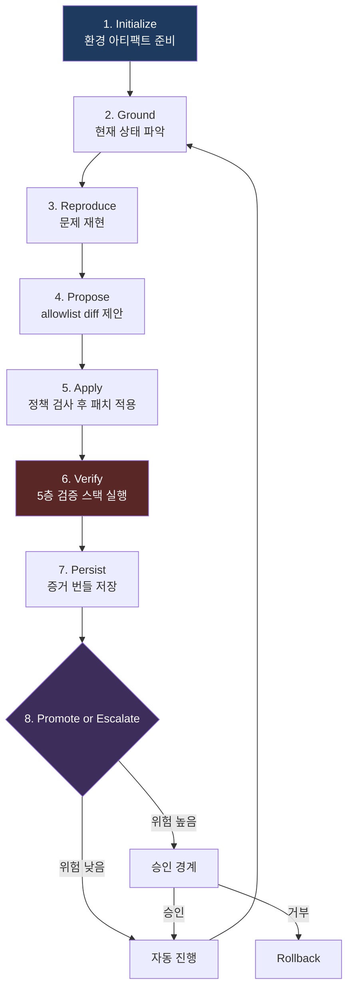
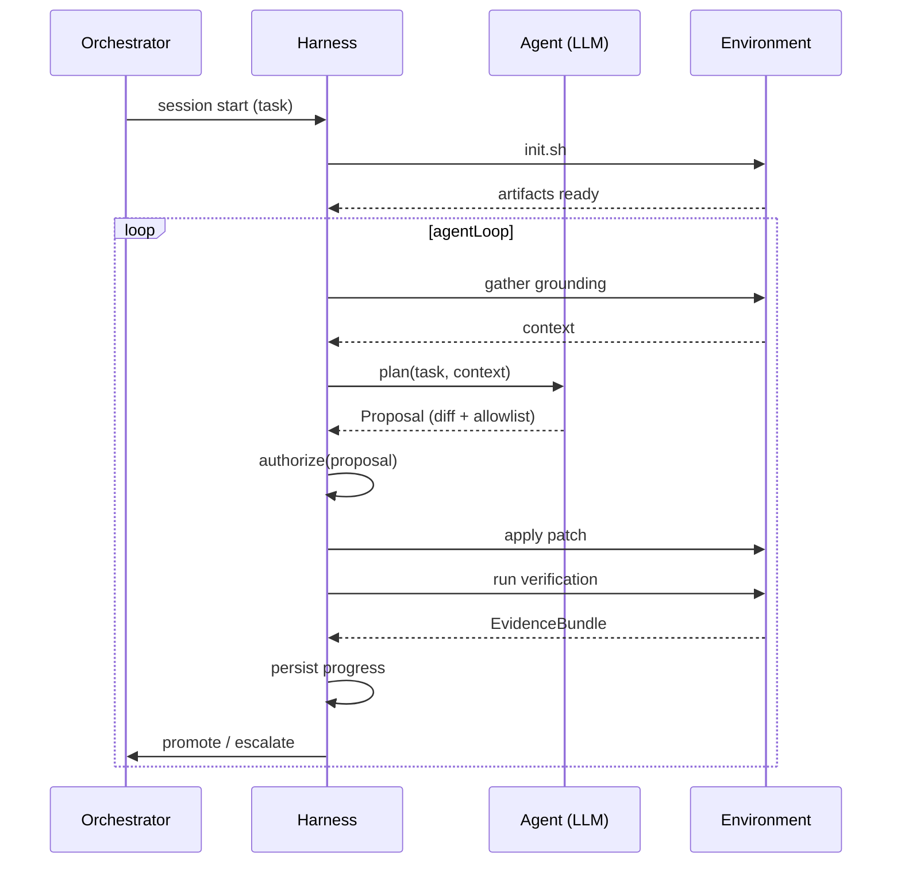

## 순서 없는 자유는 위험이다

Google의 내부 연구에 따르면, 코드 리뷰 없이 자동화 시스템이 프로덕션에 패치를 적용했을 때 버그 유입률이 수동 리뷰 대비 **3.7배** 높았다. 오류의 68%는 단순 컴파일 오류가 아닌 behavioral regression — 기능은 동작하지만 엣지 케이스에서 잘못된 결과를 내는 — 이었다. 이러한 버그는 평균 4.2일 후 프로덕션에서 발견됐다.

AI agent에게도 같은 원리가 적용된다. Agent가 아무리 좋은 도구를 갖고 있어도, 그 도구를 어떤 순서로 쓸지에 대한 통제가 없다면 위험하다. "먼저 파일을 수정하고 나중에 테스트를 돌린다"와 "먼저 테스트가 실패하는지 확인하고 수정한다"는 완전히 다른 결과를 낳는다.

하네스의 진짜 핵심은 도구 목록이 아니다. **실행 순서와 검증 흐름을 강제하는 orchestration**이다.

---

## Anthropic의 Long-Running Agent 패턴

Anthropic이 장기 실행 agent를 운영하면서 발견한 패턴이 있다. 단일 세션에서 모든 것을 끝내려 하지 말고, 세션을 구분하고 각 세션이 안전하게 시작하고 안전하게 끝나도록 설계하라는 것이다.

### Initializer 세션 — 멱등성(Idempotency) 원칙

첫 세션은 환경을 만드는 일만 한다. 코드를 건드리지 않는다. 그런데 여기서 중요한 원칙이 하나 더 있다. **Initializer는 멱등적이어야(idempotent) 한다.**

멱등성이란, 같은 Initializer를 두 번 실행해도 결과가 동일하다는 보장이다. 언뜻 당연해 보이지만, 실제로는 쉽게 무너진다.

```bash
# 위험한 방식 — 멱등성 없음
echo "→ Creating .harness directory..."
mkdir .harness          # 두 번째 실행 시 "File exists" 오류로 중단
mkdir .harness/baselines
mkdir .harness/evidence

# 올바른 방식 — 멱등적
echo "→ Ensuring .harness directory structure..."
mkdir -p .harness/baselines .harness/evidence .harness/test-results
```

`mkdir` vs `mkdir -p`의 차이가 멱등성 전체를 결정한다. 네트워크 오류, 서버 재시작, 이전 세션의 비정상 종료 등 다양한 이유로 Initializer는 반복 실행될 수 있다. 멱등적으로 설계된 Initializer는 몇 번 실행해도 동일한 상태로 수렴한다.

```bash
#!/bin/bash
set -euo pipefail  # 하나라도 실패하면 즉시 중단

echo "→ Checking environment..."
npx ts-node scripts/validate-env.ts

# 멱등적 아티팩트 생성 — 이미 있으면 덮어씀
echo "→ Generating manifests..."
npx ts-node scripts/generate-manifests.ts --force

echo "→ Starting dev server..."
# 이미 실행 중이면 재사용, 없으면 시작
if ! curl -sf http://localhost:3000/health > /dev/null 2>&1; then
  npm run dev &
fi
npx wait-on http://localhost:3000 --timeout 30000

echo "→ Starting Storybook..."
if ! curl -sf http://localhost:6006 > /dev/null 2>&1; then
  npm run storybook &
fi
npx wait-on http://localhost:6006 --timeout 60000

echo "→ Running smoke flows..."
npx ts-node scripts/run-smoke-flows.ts

echo "✓ Environment ready."
```

`set -euo pipefail`이 핵심이다. Dev server가 뜨지 않으면 manifest 생성도 없고, smoke flow도 없고, agent도 없다. 이 단계가 실패하면 coding agent는 아예 시작되지 않는다. **환경이 보장되지 않은 상태에서 코드를 수정하는 것 자체를 막는 게 목적**이다.

멱등성 위반의 실제 실패 사례를 보면 왜 중요한지 분명해진다. 한 팀이 Initializer에서 `baselines/` 디렉토리를 생성하고, 그 안에 스크린샷 baseline을 캡처해 저장했다. 그런데 세션 재시작 시 이 단계가 `mkdir`로 실패하면서 이후 환경 전체가 "준비 완료" 상태가 됐다 — 실제로는 baseline 없이. Agent는 baseline 없는 상태에서 visual regression 비교를 시작했고, 모든 시각적 변경이 "first run"으로 통과됐다.

### Progress File이 JSON인 이유 — 구체적 실패 사례

Anthropic은 feature pass/fail 상태를 JSON으로 관리한다. 자유 텍스트보다 model이 부적절하게 덮어쓰는 일이 적었다고 공개적으로 설명한다. 왜 그런가를 실제 실패 사례를 통해 이해할 필요가 있다.

**실패 사례 1: 의미론적 중복 (Semantic Duplication)**

```
# 자유 텍스트 — Session 1 작성
/dashboard 라우트를 App Router로 마이그레이션 완료.
layout.tsx 생성, page.tsx 변환, 테스트 모두 통과.

# Session 2가 읽고 쓴 내용
/dashboard 검토: 이전 세션에서 완료됐으나 재확인 필요.
page.tsx의 useEffect 패턴이 Server Component와 충돌 가능성.
재작업 시작.
```

Session 2 agent는 "재확인 필요"라는 텍스트를 읽고 합리적인 판단을 내렸다. 실제로 의심스러운 패턴이 있었을 수도 있다. 그러나 이전 세션의 검증 증거(EvidenceBundle)를 확인하지 않고 재작업을 시작했다. 이미 통과한 테스트를 다시 돌리고, 이미 생성된 파일을 다시 만들었다. 최악의 경우, 이미 올바르게 마이그레이션된 코드를 "개선"하는 과정에서 회귀가 발생했다.

**실패 사례 2: 상태 병합 오류 (State Merge Error)**

```
# 자유 텍스트 — Session 1
완료: /dashboard, /profile, /settings

# Session 3 (Session 2를 읽고 다시 씀)
완료: /dashboard, /settings (재검증됨), /notifications (새로 추가)
```

Session 2가 `/profile`에서 문제를 발견하고 메모에서 제외했다고 가정하자. Session 3은 Session 2의 노트만 읽고 `/profile`이 존재했다는 사실 자체를 잃어버렸다. 이제 `/profile`은 "pending"도 "failed"도 아닌, 시스템이 모르는 상태가 됐다.

```json
// JSON Ledger는 이런 오류를 구조적으로 방지한다
{
  "routes": [
    { "path": "/dashboard", "status": "verified", "verifiedAt": "2026-03-19T10:30:00Z" },
    { "path": "/profile", "status": "failed", "lastAttempt": "2026-03-19T11:00:00Z",
      "blockers": ["useEffect-server-component-conflict"] },
    { "path": "/settings", "status": "verified", "verifiedAt": "2026-03-19T12:00:00Z" },
    { "path": "/notifications", "status": "pending" }
  ]
}
```

JSON에서 `/profile`은 사라질 수 없다. `status`가 변경될 뿐이다. Agent는 각 항목을 독립적으로 업데이트하며, 다른 항목의 존재를 위협하지 않는다. 이것이 자유 텍스트가 아닌 JSON을 사용하는 핵심 이유다.

**실패 사례 3: 집계의 의미론적 오염 (Aggregation Semantic Pollution)**

```
# 자유 텍스트 — Session 4가 계산한 진행률
전체 10개 라우트 중 7개 완료 = 70% 진행
```

이 "70%"는 무엇을 기준으로 한 숫자인가? `migrated` 상태도 포함됐는가, `verified`만 포함됐는가? 라우트의 복잡도가 반영됐는가? Session 5 agent는 이 숫자를 읽고 70%라는 기준점에서 계획을 세운다. 하지만 실제로 promote 가능한 상태는 5개뿐이라면, 의사결정 전체가 잘못된 전제 위에 세워진 것이다.

### Resume 세션 — 세 가지 읽기의 상세 구현

새 세션이 시작되면 가장 먼저 세 가지를 읽는다. 이 순서는 의도적이다.

```typescript
async function resumeSession(sessionId: string): Promise<ResumeContext> {
  console.log(`→ Resuming session ${sessionId}...`);

  // 1단계: Progress file 읽기 — "어디까지 왔는가"
  const ledger = await readProgressLedger(".harness/progress.json");
  const pendingTasks = ledger.routes.filter(r =>
    r.status === "pending" || r.status === "migrated"
  );
  const failedTasks = ledger.routes.filter(r => r.status === "failed");

  // 2단계: Git history 읽기 — "마지막 커밋 이후 무슨 일이 있었는가"
  const gitLog = await getRecentGitLog({ limit: 20, since: ledger.lastCommitRef });
  const uncommittedChanges = await getUncommittedChanges();

  if (uncommittedChanges.length > 0) {
    // 이전 세션이 Apply까지 하고 Persist를 못 했을 가능성
    console.warn(`⚠ Uncommitted changes found: ${uncommittedChanges.map(c => c.path).join(", ")}`);
  }

  // 3단계: Smoke test — "지금 이 순간 앱이 깨져 있는가"
  const smokeResult = await runSmokeFlows(".harness/smoke-flows.json");

  if (!smokeResult.passed) {
    // 이전 세션이 깨진 상태를 남기고 끝났다면, 먼저 복구한다
    console.error(`✗ Smoke test failed. Recovery required before proceeding.`);
    return {
      mode: "recovery",
      brokenFlows: smokeResult.failedFlows,
      uncommittedChanges,
      pendingTasks,
      failedTasks,
    };
  }

  return {
    mode: failedTasks.length > 0 ? "retry-failed" : "continue",
    ledger,
    gitLog,
    smokeResult,
    pendingTasks,
    failedTasks,
  };
}
```

세 번째 읽기(smoke test)가 가장 중요하다. Progress file이 "완료"를 가리키고, git history가 깔끔해도, 앱 자체가 지금 깨져 있다면 그 모든 정보는 무의미하다. `mode: "recovery"`로 진입하면 agent는 새 작업을 시작하기 전에 반드시 깨진 부분부터 수리한다. **먼저 복구하고, 그다음에 전진한다.**

`failedTasks`가 있는 경우 `mode: "retry-failed"`로 진입한다. 이전 세션에서 실패한 작업이 있을 때 무시하고 새 pending 작업으로 이동하면, 시스템 전체의 상태 일관성이 깨진다. 실패한 작업에는 `blockers` 배열이 있고, agent는 그 블로커를 먼저 해소하거나 escalate해야 한다.

---

## 프론트엔드 하네스의 8단계 실행 루프



### 1단계: Initialize — 환경을 계약으로 만들기

Initialize 단계가 생성하는 아티팩트는 단순한 설정 파일이 아니다. 이후 8단계 루프 전체가 이 아티팩트에 의존한다는 점에서 **계약(contract)**이다.

```typescript
interface InitializeArtifacts {
  devServerUrl: string;
  storybookUrl: string;
  routeManifest: RouteManifest;
  storyManifest: StoryManifest;
  smokeFlows: SmokeFlow[];
  baselineTimestamp: string;
}
```

각 필드의 역할을 구체적으로 이해해야 한다.

**`routeManifest: RouteManifest`**

```typescript
interface RouteManifest {
  routes: Array<{
    path: string;              // "/dashboard/settings"
    component: string;         // "src/app/dashboard/settings/page.tsx"
    layoutChain: string[];     // ["src/app/layout.tsx", "src/app/dashboard/layout.tsx"]
    dataFetching: "server" | "client" | "hybrid";
    authRequired: boolean;
    allowedRoles?: string[];
  }>;
  generatedAt: string;
  appRouterCompatible: boolean;
}
```

`routeManifest`는 agent가 존재하지 않는 route로 이동을 시도하는 것을 막는다. Next.js App Router 마이그레이션을 예로 들면, Pages Router에서는 `/dashboard/settings`였던 경로가 App Router에서 `/dashboard/settings` 구조는 같지만 파일 경로와 데이터 페칭 방식이 달라진다. Agent가 `routeManifest` 없이 자유롭게 파일을 탐색하면, 이미 마이그레이션된 라우트와 아직 Pages Router에 있는 라우트를 혼동한다.

`layoutChain`은 특히 중요하다. 한 라우트를 수정할 때 영향 받는 레이아웃 체인 전체를 파악해야 regression 범위를 계산할 수 있다. `layoutChain`이 없으면 `/dashboard` 레이아웃을 수정했을 때 그 하위 모든 라우트가 영향받는다는 사실을 agent가 놓친다.

**`storyManifest: StoryManifest`**

```typescript
interface StoryManifest {
  stories: Array<{
    storyId: string;           // "components-button--primary"
    componentPath: string;     // "src/components/Button/Button.tsx"
    variants: string[];        // ["primary", "secondary", "destructive", "loading"]
    hasA11yAddon: boolean;
    hasInteractionTests: boolean;
    coverageTarget: number;    // 0.0 - 1.0, story가 커버해야 할 컴포넌트 분기 비율
  }>;
  totalComponents: number;
  storybookVersion: string;
}
```

`storyManifest`는 Verify 단계의 5층 스택 중 visual regression과 a11y audit의 범위를 결정한다. Agent가 `Button` 컴포넌트를 수정했을 때, `storyManifest`를 통해 연관된 story ID를 즉시 조회하고 해당 story들에 대해서만 visual regression을 돌린다. 전체 스토리북을 매번 돌리는 것은 비용이 너무 크다.

**`smokeFlows: SmokeFlow[]`**

```typescript
interface SmokeFlow {
  id: string;
  name: string;
  steps: Array<{
    action: "navigate" | "click" | "fill" | "assert";
    target: string;
    value?: string;
  }>;
  requiredAuth?: string;  // "user" | "admin" | "anonymous"
  criticalityLevel: "blocking" | "warning";
  // blocking: 실패 시 전체 세션 중단
  // warning: 실패 기록 후 진행 가능
}
```

`smokeFlows`는 단순한 "앱이 살아있는가" 체크가 아니다. 핵심 사용자 경로가 여전히 작동하는가를 검증한다. `criticalityLevel: "blocking"` smoke flow가 하나라도 실패하면 Initializer 전체가 실패한다. Agent는 시작조차 할 수 없다. 이것이 Initializer의 진짜 역할이다 — 환경이 아니라 **사용자 경험의 최소 수준을 계약으로 만드는 것**.

### 2단계: Ground — 어디에 있는지 파악하기

Agent가 첫 번째로 하는 일이다. 코드를 보지 않는다. 먼저 현재 상태를 읽는다.

```typescript
async function gatherGrounding(): Promise<GroundingContext> {
  // Promise.all로 병렬 로드 — 순서 의존성이 없는 I/O들을 동시에 실행
  const [ledger, gitLog, testResults, baseline, branchStatus] =
    await Promise.all([
      readProgressLedger(".harness/progress.json"),
      getRecentGitLog({ limit: 20 }),
      getLastFailingTests(".harness/test-results/"),
      getLastKnownGoodBaseline(".harness/baselines/"),
      getCurrentBranchStatus(),
    ]);

  return {
    progressLedger: ledger,
    recentGitLog: gitLog,
    lastFailingTests: testResults,
    lastKnownGoodBaseline: baseline,
    currentBranchStatus: branchStatus,
  };
}
```

`Promise.all`로 병렬 로드하는 이유는 단순히 속도 때문이 아니다. 각 소스가 서로 다른 진실을 담고 있기 때문에 **어느 하나도 다른 것을 기다리며 오염되어서는 안 된다.** 순차 로드하면 ledger를 읽는 도중 브랜치 상태가 바뀌는 — 실제로는 드물지만 CI 환경에서는 발생하는 — race condition을 갖게 된다.

더 중요한 이유가 있다. Grounding이 느리면 agent가 "대충 알겠으니까 시작하자"는 유혹에 빠진다. 이것은 LLM 특유의 패턴이다. Context window가 충분히 채워지기 전에 확신이 생기면, 이후 추가 정보를 처리하는 과정에서 이미 형성된 가설을 강화하는 방향으로 해석하는 경향이 있다. Grounding을 하나의 빠른 병렬 I/O 배치로 처리하면, agent는 모든 정보가 동시에 제공된 상태에서 판단을 시작한다.

**`lastFailingTests`가 있을 때의 복구 우선 패턴**

```typescript
async function planWithGrounding(
  task: string,
  context: GroundingContext
): Promise<Plan> {
  const { lastFailingTests, progressLedger } = context;

  // 이전에 실패한 테스트가 있다면, 새 작업보다 우선순위가 높다
  if (lastFailingTests.length > 0) {
    const unresolved = lastFailingTests.filter(test => {
      // 이미 해결된 실패라면 스킵
      const relatedRoute = findRelatedRoute(progressLedger, test.filePath);
      return !relatedRoute || relatedRoute.status !== "verified";
    });

    if (unresolved.length > 0) {
      // 새 작업 대신 실패 복구 계획 반환
      return {
        type: "recovery",
        priority: "high",
        targets: unresolved.map(t => ({
          filePath: t.filePath,
          testName: t.testName,
          lastErrorMessage: t.errorMessage,
          // 이전 세션의 실패 컨텍스트를 그대로 전달
        })),
        originalTask: task, // 복구 후 원래 작업으로 돌아올 것을 명시
      };
    }
  }

  // 실패가 없거나 모두 해결됐다면 원래 작업 계획
  return buildTaskPlan(task, context);
}
```

`lastFailingTests`를 단순히 "정보로 참고"하는 것과 "복구 우선 패턴을 강제"하는 것은 다르다. 많은 agent 구현에서 실패 정보를 context에 포함시키지만 그에 따른 행동을 강제하지 않는다. 결과적으로 agent는 새 작업이 더 명확하고 흥미롭기 때문에 자연스럽게 새 작업을 우선시한다. 위 패턴은 `lastFailingTests`가 존재할 때 Plan 자체의 타입을 강제 변경한다. `type: "recovery"`인 Plan을 받은 executor는 원래 task가 무엇이든 복구 루틴을 먼저 실행한다.

### 3단계: Reproduce — 문제를 직접 보기

```typescript
async function reproduce(target: ReproduceTarget): Promise<ReproduceResult> {
  // MSW fixture 로드 — 네트워크 요청을 고정된 응답으로 인터셉트
  if (target.mswFixtures) {
    await loadMSWFixtures(target.mswFixtures);
    // fixture가 로드되면 실제 API 서버 없이도 앱이 동작
  }

  // auth slot 주입 — 특정 권한 상태의 사용자로 앱 진입
  if (target.authSlot) {
    await injectAuthSlot(target.authSlot);
    // 예: { role: "admin", permissions: ["read", "write", "delete"] }
  }

  const result = await captureCurrentState(target);
  const isReproduced = await matchExpectedFailure(result, target.expectedFailure);

  if (!isReproduced) {
    throw new ReproduceError(
      `Expected failure not found. 이미 고쳐져 있거나, reproduce target이 잘못됐습니다.`
    );
  }
  return result;
}
```

MSW(Mock Service Worker) fixture를 Reproduce 단계에서 로드하는 이유를 명확히 해야 한다. 단순히 "API 서버가 없어도 된다"는 편의성이 아니다. **재현 가능성의 계약**이다.

실제 API를 사용한다면 재현이 실패할 수 있는 이유는 수십 가지다. 서버 데이터가 변경됐을 수 있고, 다른 agent 세션이 같은 테스트 데이터를 수정했을 수 있고, API 응답 시간이 달라졌을 수 있다. MSW fixture는 이 모든 변수를 제거한다. 동일한 fixture로 Reproduce와 Verify를 실행하면, 두 실행의 차이는 오직 코드 변경뿐이다. 이것이 diff의 정확한 의미다.

**`auth slot 주입`의 구체적 구현**

```typescript
interface AuthSlot {
  userId: string;
  role: "anonymous" | "user" | "admin" | "superadmin";
  permissions: string[];
  organizationId?: string;
  // JWT를 실제로 생성하거나, 테스트용 쿠키를 주입하거나
  // — 구현 방식은 앱마다 다르지만 인터페이스는 동일
}

async function injectAuthSlot(slot: AuthSlot): Promise<void> {
  // 방식 1: 테스트용 쿠키 직접 설정
  await page.context().addCookies([{
    name: "test-auth",
    value: Buffer.from(JSON.stringify(slot)).toString("base64"),
    domain: "localhost",
    path: "/",
  }]);

  // 방식 2: MSW handler로 /api/me 엔드포인트 오버라이드
  await msw.use(
    rest.get("/api/me", (req, res, ctx) => res(ctx.json(slot)))
  );
}
```

`authSlot`이 중요한 이유는 많은 버그가 특정 권한 상태에서만 발생하기 때문이다. 관리자 전용 UI 요소가 일반 사용자에게 노출되거나, 권한 없는 사용자가 특정 API를 호출할 수 있거나. 이런 버그는 "기본 사용자 세션"으로는 재현되지 않는다. `authSlot`을 Reproduce target에 명시함으로써, 어떤 권한 상태에서 이 문제가 발생하는지를 계약으로 만든다.

**`ReproduceError`가 치명적이지 않은 이유**

```typescript
try {
  const reproduced = await reproduce(target);
  return { status: "reproduced", result: reproduced };
} catch (error) {
  if (error instanceof ReproduceError) {
    // 재현 실패는 치명적 오류가 아니다
    return {
      status: "already-fixed",
      reason: error.message,
      recommendation: "verify-and-promote",
      // 재현이 안 됐다는 것은 이미 고쳐졌을 가능성
    };
  }
  throw error; // ReproduceError 이외의 오류는 진짜 치명적 오류
}
```

`ReproduceError`가 치명적이지 않은 이유는 두 가지 해석이 가능하기 때문이다. 첫째, 다른 agent 세션이나 수동 수정으로 문제가 이미 해결됐을 수 있다. 둘째, reproduce target 자체가 잘못 작성됐을 수 있다 — 예상 실패 조건이 현재 코드베이스와 맞지 않는 경우. 두 경우 모두 즉시 세션을 중단하는 것보다는 "재현 불가" 상태를 기록하고 escalate해서 사람이 판단하는 것이 낫다.

반대로, Playwright 타임아웃이나 MSW fixture 파싱 오류처럼 인프라적 실패는 진짜 치명적이다. 이 경우는 `ReproduceError`가 아닌 일반 `Error`로 던져져 세션을 중단시킨다.

### 4단계: Propose — diff로만 말하기

Agent는 자연어로 설명하지 않는다. **Allowlist가 붙은 diff를 직접 제안한다.**

```typescript
interface Proposal {
  id: string;
  diff: FileDiff[];
  allowedOperations: AllowedOperation[];
  estimatedRisk: RiskLevel;
  affectedComponents: string[];
  affectedRoutes: string[];
  rationale: string;  // 자연어 설명이지만 참고용, 결정의 근거가 아님
}

type AllowedOperation =
  | { type: "modify-file"; path: string; allowedSections?: string[] }
  | { type: "create-file"; path: string; template?: string }
  | { type: "delete-file"; path: string }
  | { type: "run-command"; command: string; cwd?: string };
```

**`allowedOperations`가 `next.config.js` 접근을 막는 메커니즘**

`allowedOperations`는 agent가 제안한 변경의 범위를 명시적으로 선언하는 구조다. Apply 단계의 policy check는 이 선언을 검증한다.

```typescript
// Apply 단계의 정책 검사 (일부)
function checkOperationScope(
  proposal: Proposal,
  actualDiff: FileDiff[]
): PolicyCheckResult {
  const declaredPaths = new Set(
    proposal.allowedOperations
      .filter(op => op.type === "modify-file" || op.type === "create-file")
      .map(op => op.path)
  );

  // 고위험 파일 목록 — 어떤 proposal도 수정 불가
  const neverModify = [
    "next.config.js",
    "next.config.ts",
    ".env",
    ".env.local",
    ".env.production",
    "package.json",    // dependency 변경은 별도 승인 필요
  ];

  const violations: PolicyViolation[] = [];

  for (const diff of actualDiff) {
    // 1. 선언하지 않은 파일을 건드리려는 시도
    if (!declaredPaths.has(diff.path)) {
      violations.push({
        severity: "block",
        rule: "undeclared-file-modification",
        detail: `${diff.path} was not in allowedOperations`,
      });
    }

    // 2. 절대 수정 불가 파일
    if (neverModify.includes(diff.path)) {
      violations.push({
        severity: "block",
        rule: "protected-file",
        detail: `${diff.path} is in the never-modify list`,
      });
    }
  }

  return violations.length > 0
    ? { passed: false, violations }
    : { passed: true, violations: [] };
}
```

`next.config.js`는 프로젝트 전체의 빌드, 라우팅, 보안 헤더, 번들 분석 설정을 담당한다. Agent가 이 파일을 수정하면 의도하지 않은 효과가 지수적으로 커진다. `allowedOperations`에 `next.config.js`를 포함시키려면 별도의 high-privilege 승인이 필요하도록 설계한다. 대부분의 컴포넌트 레벨 작업에서 이 파일은 `neverModify` 목록에 있기 때문에, agent가 의도적으로 허위 신고하더라도 정책이 막는다.

**`estimatedRisk` vs `actualRisk` — 왜 두 점수가 필요한가**

```typescript
type RiskLevel = "low" | "medium" | "high" | "critical";

// Apply 단계에서 실제 diff를 분석하여 계산
function computeActualRisk(diff: FileDiff[]): RiskLevel {
  const signals: string[] = [];

  for (const file of diff) {
    const linesChanged = file.additions + file.deletions;
    if (linesChanged > 200) signals.push("large-change");

    if (file.path.includes("auth") || file.path.includes("security"))
      signals.push("security-sensitive");

    if (file.path === "src/middleware.ts")
      signals.push("middleware-change");

    if (file.path.includes("__tests__") && file.deletions > file.additions)
      signals.push("test-deletion");
  }

  if (signals.includes("middleware-change") || signals.includes("security-sensitive"))
    return "critical";
  if (signals.includes("large-change") && signals.includes("test-deletion"))
    return "high";
  if (signals.length >= 2)
    return "medium";
  return "low";
}

// Apply 단계에서의 비교 로직
function compareRiskScores(
  estimated: RiskLevel,
  actual: RiskLevel
): "escalate" | "proceed" {
  const levels = { low: 0, medium: 1, high: 2, critical: 3 };
  const gap = levels[actual] - levels[estimated];

  // agent가 의도적으로 낮게 신고했거나, 판단이 틀렸을 때
  if (gap >= 2) return "escalate";
  return "proceed";
}
```

`estimatedRisk`와 `actualRisk` 비교가 필요한 이유는 LLM의 특성 때문이다. LLM은 자신의 proposal을 선호하는 방향으로 평가하는 경향이 있다. "이 변경은 안전합니다"라고 판단하면 risk를 낮게 신고한다. 실제 diff가 미들웨어를 건드리거나 200줄 이상 변경하는데 `estimatedRisk: "low"`라면, 이 2단계 이상의 차이는 escalate 신호다. Agent의 자기 평가를 신뢰하되, 독립적인 분석으로 검증한다.

### 5단계: Apply — 정책을 통과한 diff만 현실이 된다

```typescript
interface PolicyCheckResult {
  passed: boolean;
  violations: PolicyViolation[];
  warnings: PolicyWarning[];
  actualRisk: RiskLevel;
}

interface PolicyViolation {
  severity: "block" | "warn";
  rule: string;
  detail: string;
  autoFixable: boolean;
}
```

**`block` vs `warn` 구분 — 실전 예시들**

Policy violation의 심각도를 `block`과 `warn`으로 구분하는 기준은 "이 violation이 있는 상태에서 diff를 적용하면 회복 불가능한 피해가 생기는가"이다.

```typescript
const policyRules: PolicyRule[] = [
  {
    name: "secret-key-pattern",
    severity: "block",
    // 비밀 키 패턴 감지: AWS, GitHub, Stripe, private key 등
    check: (diff) => {
      const secretPatterns = [
        /AKIA[0-9A-Z]{16}/,           // AWS Access Key
        /ghp_[a-zA-Z0-9]{36}/,        // GitHub Personal Access Token
        /sk_live_[a-zA-Z0-9]{24}/,    // Stripe Live Key
        /-----BEGIN (RSA |EC )?PRIVATE KEY-----/,
      ];
      return diff.additions.some(line =>
        secretPatterns.some(pattern => pattern.test(line))
      );
    },
    // 비밀 키가 코드에 들어가면 git history에 영원히 남음 — block
  },

  {
    name: "bundle-size-spike",
    severity: "block",
    check: async (diff) => {
      // 실제 번들 빌드 후 크기 비교
      const beforeSize = await getBundleSize("before");
      const afterSize = await getBundleSize("after");
      const increase = (afterSize - beforeSize) / beforeSize;
      return increase > 0.15; // 15% 이상 증가는 block
    },
    // 번들 사이즈 15% 급증은 사용자 경험에 직접 영향 — block
  },

  {
    name: "deprecated-api-usage",
    severity: "warn",
    check: (diff) => {
      const deprecatedAPIs = [
        "ReactDOM.render(",    // React 18에서 deprecated
        "componentWillMount",  // React 16.3부터 deprecated
        "getInitialProps",     // Next.js App Router에서 동작 안 함
      ];
      return diff.additions.some(line =>
        deprecatedAPIs.some(api => line.includes(api))
      );
    },
    // Deprecated API는 경고이되, 즉시 기능 중단은 아님 — warn
  },

  {
    name: "test-coverage-regression",
    severity: "warn",
    check: (diff) => {
      const deletedTests = diff.files
        .filter(f => f.path.includes("__tests__") || f.path.includes(".test."))
        .reduce((sum, f) => sum + f.deletions, 0);
      const addedTests = diff.files
        .filter(f => f.path.includes("__tests__") || f.path.includes(".test."))
        .reduce((sum, f) => sum + f.additions, 0);
      return deletedTests > addedTests * 2; // 테스트 삭제가 추가의 2배 이상 — warn
    },
  },
];
```

`block`은 diff 적용 자체를 막는다. `warn`은 diff를 적용하되 EvidenceBundle에 warning을 기록하고, Promote 단계에서 자동 승인 대신 수동 검토를 요구한다.

**git stash 기반 원자적 롤백**

```typescript
async function applyPatch(authorized: AuthorizedProposal): Promise<void> {
  // 현재 상태를 stash에 저장 — 롤백 포인트 생성
  const stashRef = await git.stash({ message: `harness-rollback-${authorized.id}` });

  try {
    for (const diff of authorized.diff) {
      await applyFileDiff(diff);
    }

    // 모든 diff가 성공적으로 적용된 경우에만 stash 삭제
    await git.stashDrop(stashRef);
  } catch (error) {
    // 하나라도 실패하면 무조건 stash에서 복원
    await git.stashPop(stashRef);
    throw new PatchApplicationError(
      `Patch application failed at ${error.filePath}. Rolled back to previous state.`,
      { originalError: error, stashRef }
    );
  }
}
```

`git stash` 기반 롤백이 중요한 이유는 **부분 적용(partial application)** 문제 때문이다. 10개 파일을 변경하는 diff가 있고, 7번째 파일에서 충돌이 발생했다면? 1-6번 파일은 이미 변경됐고, 7-10번 파일은 원본이다. 이 상태에서 Verify를 돌리면 혼합된 상태를 검증하게 된다. 결과는 무의미하다.

`git stash`는 이 시나리오를 원자적으로 처리한다. 성공하거나 아무것도 변경되지 않거나 — 중간 상태는 없다. stash reference를 명시적으로 저장하는 이유는, 동시에 여러 harness 세션이 동일한 기계에서 돌아가는 경우에도 어떤 stash가 어떤 proposal에 속하는지 추적하기 위해서다.

### 6단계: Verify — 5층 검증 스택

Apply 이후 바로 결과를 "완료"로 처리하지 않는다. 다섯 층을 순서대로 통과해야 한다.

```typescript
async function runVerification(applied: AppliedPatch): Promise<VerificationStack> {
  // 층 1: 컴포넌트 단위 테스트 — 가장 빠르고 가장 세밀한 실패 시그널
  const component = await runComponentTests(applied.affectedComponents);
  if (!component.passed) {
    // component 실패 시 이후 모든 단계 스킵 — 신호 오염 방지
    return { component, ...allSkipped("component-failed") };
  }

  // 층 2: 인터랙션 테스트 — 컴포넌트 간 통합 동작 검증
  const interaction = await runInteractionTests(applied.affectedComponents);
  if (!interaction.passed) {
    return { component, interaction, ...restSkipped("interaction-failed") };
  }

  // 층 3, 4, 5: 앞 두 단계 통과 후 병렬 실행
  // visual, a11y, performance는 상호 의존성 없으므로 Promise.all
  const [visual, a11y, performance] = await Promise.all([
    runVisualRegression(applied.affectedRoutes, applied.affectedComponents),
    runA11yAudit(applied.affectedComponents),
    runPerformanceGate(applied.affectedRoutes),
  ]);

  return { component, interaction, visual, a11y, performance };
}
```

**5층 스택의 순서가 중요한 이유 — 각 층의 의존성**

층의 순서는 실패 시 신호 품질을 보존하기 위해 설계됐다.

`component` 테스트가 실패했다는 것은 컴포넌트의 기본 렌더링이 깨졌다는 뜻이다. 이 상태에서 `visual` regression을 돌리면 스크린샷이 찍히겠지만, 그 스크린샷은 "깨진 컴포넌트의 모습"이다. 이 스크린샷을 baseline과 비교하면 모든 픽셀이 달라져 있을 것이고, visual regression은 "전부 실패"를 반환한다. 이것은 사실이지만 유용하지 않다. 진짜 문제가 컴포넌트 로직인지 시각적 스타일인지 알 수 없게 된다.

`performance` 측정도 마찬가지다. 컴포넌트가 오류를 던지고 fallback UI가 렌더링되면 메인 컴포넌트보다 훨씬 가볍다. "성능이 개선됐습니다"라는 거짓 신호가 나온다.

앞 두 단계(`component`, `interaction`)가 통과했다는 것은 "코드가 의도대로 동작한다"는 보장이다. 그 이후 `visual`, `a11y`, `performance`는 서로 독립적이므로 `Promise.all`로 병렬 실행한다. 세 가지 비용이 큰 작업을 순차 실행하면 불필요하게 총 시간이 길어진다.

### 7단계: Persist — 증거 번들을 남기기

Verify가 통과하든 실패하든, 결과는 반드시 저장된다.

```typescript
interface EvidenceBundle {
  id: string;
  proposalId: string;
  sessionId: string;
  verification: VerificationStack;
  screenshots: {
    before: ScreenshotRef;  // baseline 스크린샷
    after: ScreenshotRef;   // 변경 후 스크린샷
    diff: ScreenshotRef;    // pixel diff 이미지
    // 세 장이 반드시 세트로 존재해야 유효한 EvidenceBundle
  };
  gitRef: string;
  diff: FileDiff[];
  policyCheckResult: PolicyCheckResult;
  duration: {
    total: number;
    byStage: Record<"component" | "interaction" | "visual" | "a11y" | "performance", number>;
  };
  storageRef?: string;  // S3 등 외부 스토리지 URL
}

interface ScreenshotRef {
  localPath: string;   // .harness/evidence/{id}/before.png
  storageUrl?: string; // s3://harness-evidence/{org}/{repo}/{id}/before.png
  hash: string;        // SHA256 — 조작 방지
}
```

**Before/After/Diff 세트의 중요성**

`screenshots.diff`가 단독으로 있으면 의미가 없다. "변경 전에 무엇이 있었는가"를 알아야 "diff가 올바른 변경을 가리키는가"를 판단할 수 있다. Before만 있으면 변경이 어떻게 됐는지 모른다. After만 있으면 원래 상태를 모른다. 세 장이 세트여야 한다.

특히 나중에 "이 변경이 의도적이었나, 회귀였나"를 판단할 때 before/after/diff 세트가 유일한 증거가 된다. EvidenceBundle이 없는 상태 전환은 `verified`로 승격될 수 없다.

**외부 스토리지(S3) 저장 전략**

```typescript
async function persistEvidence(bundle: EvidenceBundle): Promise<void> {
  // 1. 로컬 저장 — 즉시 참조 가능
  await saveLocalEvidence(bundle, ".harness/evidence/");

  // 2. Ledger 업데이트 — 원자적으로
  await updateLedger(".harness/progress.json", (ledger) => {
    const route = ledger.routes.find(r =>
      bundle.verification.affectedRoutes.includes(r.path)
    );
    if (route) {
      route.evidence = {
        bundleId: bundle.id,
        verificationPassed: isAllPassed(bundle.verification),
        localPath: `.harness/evidence/${bundle.id}`,
      };
      route.status = isAllPassed(bundle.verification) ? "verified" : "failed";
    }
  });

  // 3. 외부 스토리지 업로드 — 실패해도 로컬은 보존
  try {
    const storageUrl = await uploadToS3(bundle, {
      bucket: process.env.HARNESS_EVIDENCE_BUCKET,
      prefix: `${process.env.REPO_NAME}/${bundle.sessionId}/`,
      retryCount: 3,
    });
    bundle.storageRef = storageUrl;
  } catch (uploadError) {
    // S3 업로드 실패는 치명적이지 않다
    // 로컬에 있으면 충분하고, 나중에 재시도 가능
    console.warn(`S3 upload failed, evidence preserved locally: ${uploadError.message}`);
    await appendToRetryQueue(".harness/upload-queue.json", bundle.id);
  }
}
```

S3 업로드 실패를 치명적으로 처리하지 않는 이유는 관심사 분리(separation of concerns) 때문이다. 검증 증거의 존재와 그 증거의 원격 백업은 별개의 관심사다. 증거가 로컬에 있으면 지금 당장의 의사결정은 가능하다. S3는 장기 보관과 다른 팀의 접근을 위한 것이지, 현재 세션의 진행을 막는 의존성이 아니다.

### 8단계: Promote or Escalate

```typescript
function decideNextStep(evidence: EvidenceBundle): NextStep {
  if (!isAllPassed(evidence.verification)) {
    return {
      action: "rollback",
      targetRef: evidence.gitRef,
      failedLayers: getFailedLayers(evidence.verification),
      // 어느 층에서 실패했는지 명시 — 다음 재시도에서 참고
    };
  }

  // 통과했지만 위험 신호가 있는 경우
  const escalationReasons = collectEscalationReasons(evidence);
  if (escalationReasons.length > 0) {
    return {
      action: "escalate",
      reasons: escalationReasons,
      approvalRequired: true,
      // 사람이 검토할 때 보여줄 컨텍스트
      summary: buildEscalationSummary(evidence, escalationReasons),
    };
  }

  return {
    action: "promote",
    nextTask: getNextPendingTask(),
  };
}

function collectEscalationReasons(evidence: EvidenceBundle): EscalationReason[] {
  const reasons: EscalationReason[] = [];

  // 케이스 1: 성능 위험도 높음
  if (evidence.verification.performance.riskScore >= "high") {
    reasons.push({
      type: "performance-risk",
      detail: `Bundle size increased by ${evidence.verification.performance.bundleSizeIncrease}%`,
    });
  }

  // 케이스 2: Visual regression이 "허용 범위 내"이지만 누적 변화가 큰 경우
  const cumulativeDrift = computeCumulativeVisualDrift(evidence);
  if (cumulativeDrift > 0.12) {  // 12% 누적 픽셀 변화
    reasons.push({
      type: "cumulative-visual-drift",
      detail: `Cumulative visual drift: ${(cumulativeDrift * 100).toFixed(1)}% over last 5 sessions`,
    });
  }

  // 케이스 3: Policy warning이 하나 이상
  const warnings = evidence.policyCheckResult.violations
    .filter(v => v.severity === "warn");
  if (warnings.length > 0) {
    reasons.push({
      type: "policy-warnings",
      detail: warnings.map(w => w.detail).join("; "),
    });
  }

  return reasons;
}
```

**"통과했지만 위험한" 케이스의 구체적 예시**

테스트를 모두 통과했지만 escalate가 필요한 상황은 실제 프로덕션에서 가장 자주 문제가 되는 케이스다.

- **번들 사이즈 임계치 접근**: 각 마이그레이션 세션마다 번들이 0.8%씩 증가했다. 각 세션 기준으로는 "허용 범위 내"지만, 10번째 세션 이후 누적 증가율은 8%가 됐다. 이 시점에서 에스컬레이션 없이 계속 진행하면 15번째 세션쯤에서 번들 사이즈 제한에 걸린다.

- **Visual regression 누적 drift**: 폰트 렌더링 방식이 바뀌거나 전역 스타일이 미세하게 달라졌을 때, 각 세션의 visual diff는 "0.3% 픽셀 변화 — 허용 범위"이지만 5번 누적되면 1.5%가 된다. 사람 눈으로는 보이지 않지만, 브랜드 일관성 관점에서는 의미있는 변화다.

- **Deprecated API 경고**: `componentWillMount` 사용이 경고로 기록됐다. 지금은 동작하지만 다음 React major 업그레이드 시 breaking change가 된다. 지금 escalate해서 수정하는 것이 나중에 react 업그레이드 시 발견하는 것보다 비용이 훨씬 낮다.

---

## Structured Ledger — 세 가지 형태의 완전한 구현

### Route Migration Ledger

```typescript
interface RouteMigrationLedger {
  schemaVersion: "1.0";
  migrationTarget: "app-router" | "pages-router";
  startedAt: string;
  routes: Array<{
    path: string;
    status: "pending" | "migrated" | "verified" | "failed" | "skipped";
    complexity: "low" | "medium" | "high";
    lastAttempt?: string;
    attemptCount: number;
    evidence?: {
      bundleId: string;
      verificationPassed: boolean;
      localPath: string;
    };
    blockers?: Array<{
      code: string;  // "use-effect-server-conflict", "missing-auth-provider" 등
      description: string;
      autoResolvable: boolean;
    }>;
  }>;
  overallProgress: null;  // agent가 직접 계산하지 않음 — computeProgress()가 담당
}
```

실전 JSON 예시:

```json
{
  "schemaVersion": "1.0",
  "migrationTarget": "app-router",
  "startedAt": "2026-03-18T09:00:00Z",
  "routes": [
    {
      "path": "/dashboard",
      "status": "verified",
      "complexity": "medium",
      "lastAttempt": "2026-03-18T10:30:00Z",
      "attemptCount": 1,
      "evidence": {
        "bundleId": "evd_dashboard_001",
        "verificationPassed": true,
        "localPath": ".harness/evidence/evd_dashboard_001"
      }
    },
    {
      "path": "/dashboard/settings",
      "status": "failed",
      "complexity": "high",
      "lastAttempt": "2026-03-18T14:00:00Z",
      "attemptCount": 2,
      "blockers": [
        {
          "code": "nested-layout-auth-conflict",
          "description": "Settings layout expects auth context from parent, but App Router layout chain breaks the provider",
          "autoResolvable": false
        }
      ]
    },
    {
      "path": "/profile",
      "status": "migrated",
      "complexity": "low",
      "lastAttempt": "2026-03-19T09:00:00Z",
      "attemptCount": 1,
      "evidence": null
    },
    {
      "path": "/notifications",
      "status": "pending",
      "complexity": "low",
      "attemptCount": 0
    }
  ],
  "overallProgress": null
}
```

### Design Token Rollout Ledger

```typescript
interface DesignTokenRolloutLedger {
  schemaVersion: "1.0";
  tokenVersion: string;   // "v2.1.0"
  components: Array<{
    componentId: string;  // "Button", "Input", "Card"
    status: "pending" | "token-replaced" | "verified" | "failed";
    tokenChanges: Array<{
      from: string;  // "--color-brand-500" (old token)
      to: string;    // "--color-primary-500" (new token)
      occurrences: number;
    }>;
    evidence?: {
      bundleId: string;
      visualRegressionPassed: boolean;
    };
  }>;
  overallProgress: null;
}
```

### Story Coverage Ledger

```typescript
interface StoryCoverageLedger {
  schemaVersion: "1.0";
  components: Array<{
    componentId: string;
    requiredVariants: string[];   // ["default", "loading", "error", "empty"]
    coveredVariants: string[];    // 실제 story가 있는 variants
    a11yPassed: boolean | null;
    interactionTestsPassed: boolean | null;
    coverageRatio: number;        // 0.0 - 1.0
    status: "insufficient" | "adequate" | "complete";
  }>;
  overallProgress: null;
}
```

### `overallProgress: null` — agent가 계산하지 못하게 하는 세 가지 이유

**이유 1: 정의 불일치 (Definition Mismatch)**

"전체 10개 라우트 중 7개 완료"에서 "완료"의 정의가 세션마다 다르다. Session A의 agent는 `status === "migrated"`를 완료로 계산했다. Session B의 agent는 `status === "verified"`만 완료로 계산했다. 두 agent 모두 합리적이다. 하지만 이 숫자는 비교 불가능하다.

**이유 2: 덮어쓰기 문제 (Overwrite Problem)**

Agent가 `overallProgress`를 직접 계산해서 JSON에 쓴다고 가정하자.

```json
// Session 4가 저장한 상태
{ "overallProgress": 0.75 }
```

Session 5가 시작될 때 새 라우트 `/admin`이 마이그레이션 대상에 추가됐다. Session 5는 이 새 라우트와 함께 전체를 재계산해서 `overallProgress: 0.60`으로 덮어쓴다. 그런데 이 재계산 과정에서 Session 5가 이전에 `verified`였던 `/dashboard`를 잘못 읽어 `migrated`로 계산했다. 저장된 숫자는 진실과 무관해졌다.

**이유 3: 합성 오류 (Composition Error)**

`migrated`(파일 변경 완료)와 `verified`(5층 스택 통과)를 모두 "완료"로 계산하면 progress가 실제보다 높게 표시된다. `/profile`이 `migrated` 상태일 때 이를 "완료"로 계산한 숫자를 보고 스프린트 계획을 세우면, Verify 단계에서 실패가 발생했을 때 계획 전체가 틀어진다.

```typescript
// 하네스가 실행하는 집계 함수 — agent 바깥에서 실행
function computeProgress(ledger: RouteMigrationLedger): ProgressReport {
  const routes = ledger.routes;
  const total = routes.length;

  return {
    total,
    // 각 상태를 명확히 분리 — 집계 방식을 caller가 선택
    verified: routes.filter(r => r.status === "verified").length,
    migrated: routes.filter(r => r.status === "migrated").length,
    pending: routes.filter(r => r.status === "pending").length,
    failed: routes.filter(r => r.status === "failed").length,
    skipped: routes.filter(r => r.status === "skipped").length,

    // "안전하게 promote 가능한" 라우트만 따로 계산
    promotable: routes.filter(r =>
      r.status === "verified" && r.evidence != null && r.evidence.verificationPassed
    ).length,

    // 자동 복구 불가능한 blocker가 있는 라우트
    blockedNeedingHuman: routes.filter(r =>
      r.status === "failed" &&
      r.blockers?.some(b => !b.autoResolvable)
    ).length,

    // 백분율은 "verified"만 기준으로 계산 — "migrated"는 포함 안 함
    verifiedRatio: total > 0
      ? routes.filter(r => r.status === "verified").length / total
      : 0,

    computedAt: new Date().toISOString(),
    // agent가 계산한 것이 아님을 명시
    computedBy: "harness-compute-progress-v1",
  };
}
```

### "migrated" vs "verified"의 결정적 차이 — 사고 사례

이 두 상태를 단일 "done"으로 합치면 어떤 일이 생기는지, 구체적인 시나리오로 보자.

한 팀이 Next.js App Router 마이그레이션을 진행했다. `/profile` 라우트를 마이그레이션하면서 `status: "migrated"`로 기록했다. 그 후 Verify 단계를 실행하기 전에 다른 우선순위 작업이 생겼고, `/profile`은 "done" 상태로 ledger에 남았다.

두 달 후 프로덕션에서 `/profile` 페이지가 Safari에서만 레이아웃이 깨지는 버그가 보고됐다. 원인을 추적하니 App Router로 마이그레이션하면서 CSS 모듈 네이밍이 바뀌었고, Safari의 CSS parsing 방식 차이로 특정 selector가 적용되지 않은 것이었다. Visual regression 테스트에서 Safari 스크린샷을 돌렸다면 잡혔을 버그다.

```typescript
// 잘못된 패턴 — "migrated"를 완료로 취급
const isComplete = (route: RouteMigrationLedger["routes"][0]) =>
  route.status === "migrated" || route.status === "verified";

// 올바른 패턴 — "verified"만 완료, "migrated"는 진행 중
const isPromotable = (route: RouteMigrationLedger["routes"][0]) =>
  route.status === "verified" &&
  route.evidence !== null &&
  route.evidence.verificationPassed === true;

// "migrated"는 다음 작업이 있는 상태를 의미
const needsVerification = (route: RouteMigrationLedger["routes"][0]) =>
  route.status === "migrated";
```

Agent가 두 상태를 임의로 승격할 수 없다. `migrated` → `verified` 전환은 하네스가 EvidenceBundle을 확인한 다음에만 일어난다. 이 전환 권한이 agent에게 없기 때문에, agent가 "이 정도면 됐다"고 판단하고 상태를 건너뛰는 것이 구조적으로 불가능하다.

---

## agentLoop() — 각 줄의 순서 이유

```typescript
async function agentLoop(task: string): Promise<LoopResult> {
  // 1. 매 루프마다 fresh한 ground truth에서 시작
  const context = await gatherGrounding();

  // 2. 구조화된 Proposal을 반환 (자연어 아님)
  const proposal = await agent.plan(task, context);

  // 3. 이 줄에서 실패하면 수정은 아무것도 일어나지 않음
  const checked = await authorize(proposal);

  // 4. agent가 직접 호출하지 않음. 하네스가 대신 호출
  const result = await execute(checked);

  // 5. 결과는 pass/fail이 아니라 EvidenceBundle
  const evidence = await runVerification(result);

  // 6. 통과든 실패든 증거를 남김
  await persistProgress({ proposal, result, evidence });

  // 7. promote, escalate, rollback 중 하나
  return decideNextStep(evidence);
}
```

각 줄이 그 순서에 있어야 하는 이유를 하나씩 짚는다.

**`gatherGrounding()`이 첫 번째인 이유**

Agent가 이전 루프의 기억에 의존하지 않도록 하기 위해서다. LLM context window는 루프가 쌓일수록 초반 정보가 희석된다. 루프 3회차에 Loop 1에서 읽은 ledger 상태를 "기억"에 의존한다면, 그 사이 다른 프로세스가 ledger를 업데이트했을 경우를 놓친다. `gatherGrounding()`을 매 루프 첫 번째로 실행함으로써, 각 루프는 현재 시점의 진실에서 시작한다.

이것은 성능 비용이 있다. 매 루프마다 I/O를 다시 실행한다. 하지만 stale context에서 내린 잘못된 결정보다 이 비용이 훨씬 작다.

**`authorize()` 전에 `execute()`가 없는 이유**

`proposal`이 생성되는 순간부터 `authorize()`까지 현실에 아무 변화가 없어야 한다. Proposal은 "이렇게 하겠다는 의도의 선언"이다. 이 선언이 검토되기 전에 어떤 파일도 변경되면 안 된다.

현실에서 이것은 당연해 보이지만, agent에게 `writeFile` 도구를 직접 줬을 때 이 순서가 깨진다. Agent가 plan을 세우면서 "일단 파일을 수정해보고 결과를 보자"는 탐색적 행동을 하면, authorize가 존재해도 이미 파일이 변경된 상태다. `execute()`를 agent의 도구 목록에서 제거하고 하네스가 호출하는 구조가 이 순서를 강제한다.

**`execute()`를 agent가 직접 호출하지 않는 이유**

Agent가 직접 실행 도구를 가지면 두 가지 문제가 생긴다. 첫째, agent는 정책 검사를 우회하는 경로를 찾으려는 경향이 있다 — 의도적으로가 아니라, 목표 달성을 위한 최적 경로를 탐색하다 보면 검사 단계를 건너뛰는 경로가 더 짧아 보이기 때문이다. 둘째, 실행의 부수효과(side effect)를 agent가 완전히 예측할 수 없다. 파일 시스템 변경, 프로세스 실행, 네트워크 요청 — 이것들이 하네스를 통해 매개되면 하네스가 각 부수효과를 기록하고 제어할 수 있다.

`execute()`를 하네스가 대신 호출한다는 것은 agent가 "무엇을 원하는가"를 선언하고, 그 선언이 현실화되는 방법은 하네스가 통제한다는 분리다.

**`persistProgress()`가 `decideNextStep()` 전인 이유**

`decideNextStep()`은 네트워크 오류, 다음 작업 조회 실패 등으로 예외를 던질 수 있다. 만약 `persistProgress()`가 `decideNextStep()` 뒤에 있다면, next step 결정이 실패했을 때 이번 루프의 증거 자체가 저장되지 않는다. 다음 재시도 세션은 이번 루프가 존재했다는 사실을 모르고 처음부터 시작한다.

`persistProgress()`를 먼저 실행함으로써, `decideNextStep()`이 어떻게 되든 증거는 항상 남는다. 최악의 경우 next step 결정이 실패해도, 다음 세션은 증거를 읽고 "이 proposal은 실행됐고 verification은 통과했다"는 사실에서 resume할 수 있다.



Agent(LLM)가 Environment에 직접 접근하는 화살표가 없다. **모든 실행은 Harness를 거친다.**

---

## 실전 적용: Next.js App Router 마이그레이션

### 전체 Ledger JSON과 단계별 상태 전이

실제 마이그레이션 프로젝트에서 ledger가 어떻게 진화하는지 추적해보면 orchestration 설계의 가치가 명확해진다.

**Day 1 — 마이그레이션 시작 직후**

```json
{
  "schemaVersion": "1.0",
  "migrationTarget": "app-router",
  "startedAt": "2026-03-18T09:00:00Z",
  "routes": [
    { "path": "/", "status": "pending", "complexity": "low", "attemptCount": 0 },
    { "path": "/dashboard", "status": "pending", "complexity": "medium", "attemptCount": 0 },
    { "path": "/dashboard/settings", "status": "pending", "complexity": "high", "attemptCount": 0 },
    { "path": "/profile", "status": "pending", "complexity": "low", "attemptCount": 0 },
    { "path": "/admin", "status": "pending", "complexity": "high", "attemptCount": 0 }
  ],
  "overallProgress": null
}
```

**Day 2 — Session 3 이후 (일부 완료, 일부 실패)**

```json
{
  "routes": [
    {
      "path": "/",
      "status": "verified",
      "complexity": "low",
      "lastAttempt": "2026-03-18T10:00:00Z",
      "attemptCount": 1,
      "evidence": {
        "bundleId": "evd_root_001",
        "verificationPassed": true,
        "localPath": ".harness/evidence/evd_root_001"
      }
    },
    {
      "path": "/dashboard",
      "status": "verified",
      "complexity": "medium",
      "lastAttempt": "2026-03-18T12:30:00Z",
      "attemptCount": 1,
      "evidence": {
        "bundleId": "evd_dashboard_001",
        "verificationPassed": true,
        "localPath": ".harness/evidence/evd_dashboard_001"
      }
    },
    {
      "path": "/dashboard/settings",
      "status": "failed",
      "complexity": "high",
      "lastAttempt": "2026-03-19T09:00:00Z",
      "attemptCount": 2,
      "blockers": [
        {
          "code": "nested-layout-auth-conflict",
          "description": "Settings page uses useSession() inside Server Component — needs Client Component boundary",
          "autoResolvable": true
        }
      ]
    },
    {
      "path": "/profile",
      "status": "migrated",
      "complexity": "low",
      "lastAttempt": "2026-03-19T10:00:00Z",
      "attemptCount": 1,
      "evidence": null
    },
    {
      "path": "/admin",
      "status": "pending",
      "complexity": "high",
      "attemptCount": 0
    }
  ],
  "overallProgress": null
}
```

이 ledger를 `computeProgress()`에 넘기면:

```typescript
{
  total: 5,
  verified: 2,        // "/" 과 "/dashboard"
  migrated: 1,        // "/profile" — 아직 verify 안 됨
  pending: 1,         // "/admin"
  failed: 1,          // "/dashboard/settings"
  skipped: 0,
  promotable: 2,      // verified 중 evidence 있는 것
  blockedNeedingHuman: 0,  // blocker가 autoResolvable이므로 0
  verifiedRatio: 0.4, // 2/5 — "migrated"는 포함하지 않음
  computedAt: "2026-03-19T11:00:00Z",
  computedBy: "harness-compute-progress-v1"
}
```

**`verifiedRatio: 0.4`의 의미**: 스프린트 계획에서 "40% 완료"다. `/profile`이 `migrated` 상태임에도 이 숫자에 포함되지 않는 이유는, verify를 거치지 않은 변경은 언제든 실패할 수 있기 때문이다. 이 보수적인 집계가 Sprint 계획을 안전하게 만든다.

**`/dashboard/settings`의 `autoResolvable: true`**: `useSession()` in Server Component 문제는 Client Component 경계를 추가하는 표준 패턴으로 해결 가능하다. Agent가 다음 루프에서 자동으로 재시도할 수 있다. `autoResolvable: false`였다면 사람의 개입이 필요하다는 신호가 된다.

---

## 세 가지 핵심 원칙

8단계 루프를 관통하는 원칙은 세 가지다.

**첫째, agent는 직접 쉘을 치지 않는다.** Allowlist diff 기반 proposal 구조는 agent의 행동 범위를 "특정 파일의 특정 변경"으로 제한한다. `allowedOperations` 선언 밖의 파일은 존재하지 않는 것과 같다.

**둘째, 수정은 항상 정책을 통과한 diff로만 현실이 된다.** "Agent가 수정했다"와 "하네스가 agent의 proposal을 검토하고 적용했다"는 완전히 다른 책임 구조다. 전자는 agent의 판단에 의존하고, 후자는 시스템의 정책에 의존한다.

**셋째, 완료 여부는 증거 번들이 판단한다.** Agent가 "완료했습니다"고 말해도 EvidenceBundle이 없으면 완료가 아니다. Ledger의 `status`가 `verified`로 바뀌는 것은 하네스가 EvidenceBundle을 확인한 다음이다. 이 원칙이 `migrated`와 `verified`를 구분하고, `overallProgress`를 null로 유지하며, progress 집계를 agent 바깥의 함수가 담당하게 하는 모든 설계 결정의 근거다.

---

*프론트엔드 하네스 엔지니어링 Deep Dive 시리즈*
- 1편: 왜 프론트엔드에 하네스가 필요한가
- 2편: 하네스 엔지니어링이란 정확히 무엇인가
- 3편: Capability Control — 읽기는 넓게, 쓰기는 좁게
- 4편: State Mediation — 프론트엔드 상태의 다섯 얼굴
- **5편: Execution Orchestration — 하네스의 심장 (현재)**
