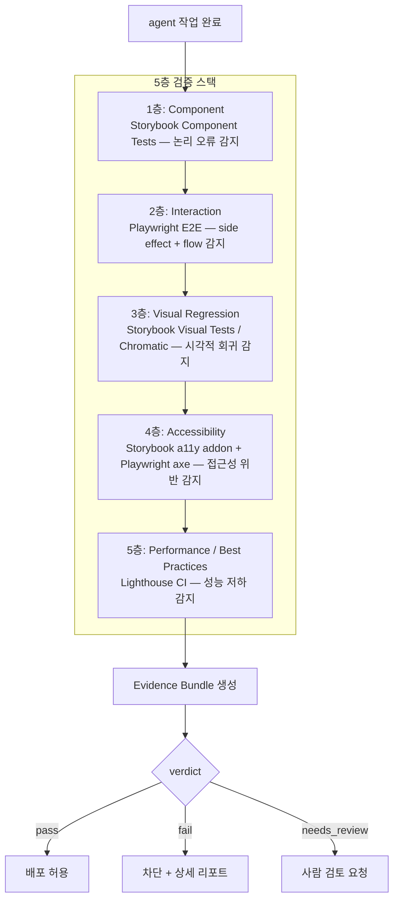
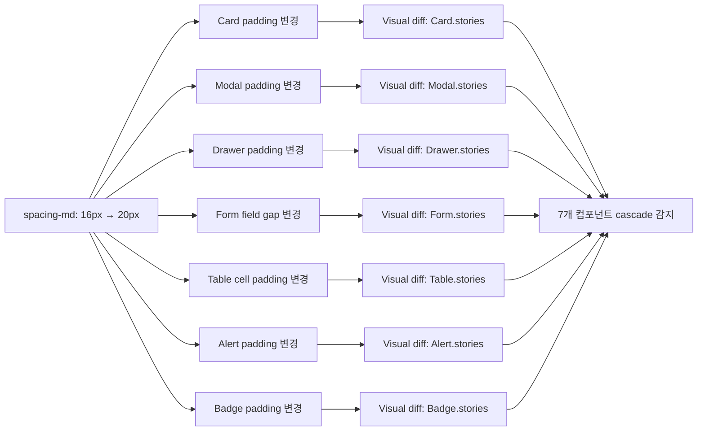
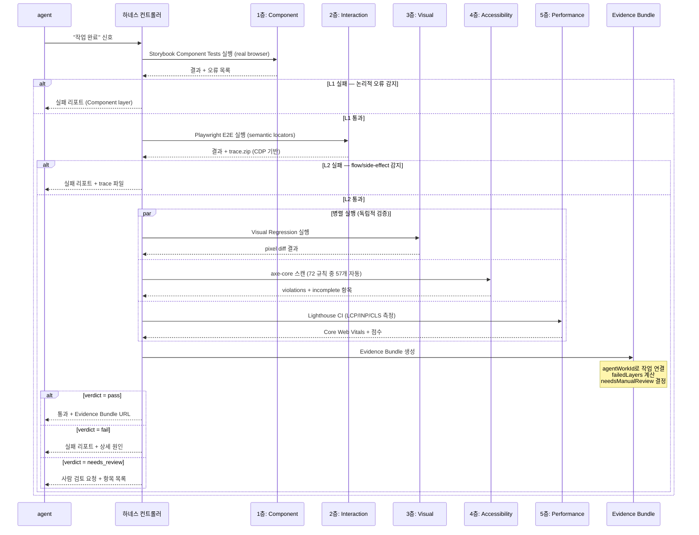
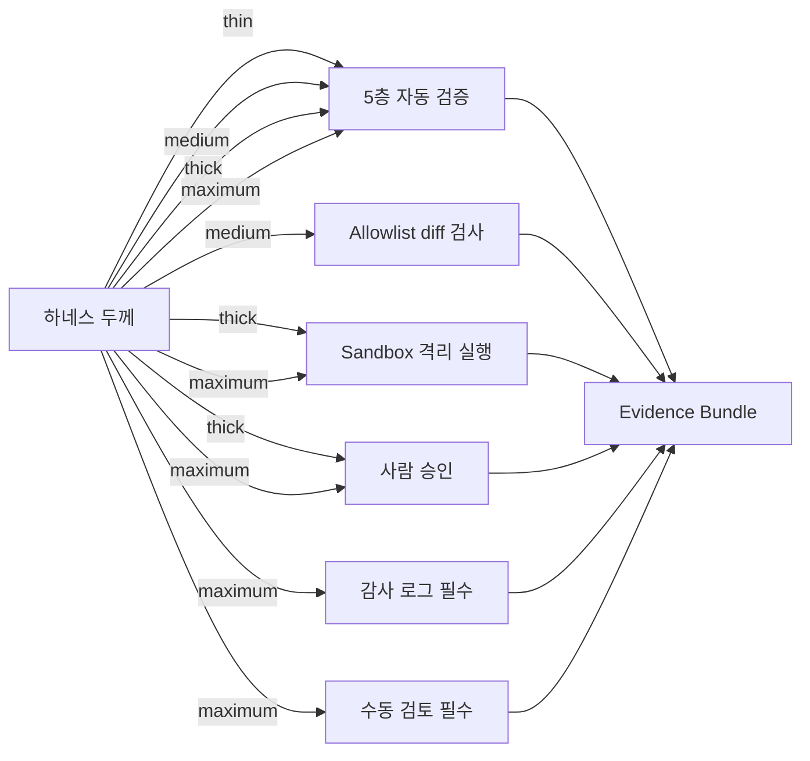

## agent는 "완료"라고 말했다. 그 다음이 문제다

2024년 Stripe의 내부 실험 결과가 공개됐을 때 많은 개발자들이 놀랐다. AI agent를 코드 수정 작업에 투입했을 때, agent가 "완료"라고 보고한 작업 중 **약 23%는 실제로 검증 기준을 통과하지 못했다**. 숫자 자체보다 더 충격적인 것은 실패 유형의 분포였다.

```
실패 유형 분포 (Stripe 내부 실험, 2024)
─────────────────────────────────────────
논리적 오류         31%  ████████████
접근성 위반         19%  ███████
시각적 회귀         18%  ███████
성능 저하           17%  ██████
다른 route side effect  15%  ██████
─────────────────────────────────────────
```

논리적 오류는 전체 실패의 31%에 불과하다. 나머지 69%는 **agent가 "잘 됐는지 확인했다"고 말했음에도 불구하고** 접근성이 무너졌거나, 픽셀이 틀어졌거나, 다른 route에서 side effect가 터졌거나, 체감 성능이 나빠진 경우다.

agent는 자신이 수정한 부분이 동작하는 것을 확인한다. 그런데 그것이 수정한 부분의 전부가 아닐 때 문제가 생긴다. `padding` 값 하나를 바꿨는데 디자인 시스템 전체에 cascade되거나, `div`를 `button`으로 교체했는데 `aria-label`이 사라지거나, 이미지 하나를 추가했는데 LCP가 2.3초에서 5.1초로 뛰어오르는 일이 실제로 일어난다.

**agent의 자기평가는 검증이 아니다. 검증은 agent 외부에 있어야 한다.**

이번 편에서는 그 외부 검증 구조, 즉 5층 검증 스택(Verification Stack)의 각 층을 해부한다. 각 층이 어떤 실패를 잡도록 설계되었는지, 어떤 한계를 가지고 있는지, 그리고 층들이 어떻게 하나의 Evidence Bundle로 수렴하는지를 다룬다.

---

## 이전 편 요약

5편에서는 MSW(Mock Service Worker)를 중심으로 네트워크 계층 하네스를 다뤘다. agent가 API를 호출할 때 실제 서버 대신 MSW handler가 응답을 가로채도록 구성하면, 네트워크 의존성을 제거하면서도 실제 HTTP 흐름을 시뮬레이션할 수 있다. 핵심은 handler를 story/test/CI 단위로 격리해서 상태 오염 없이 재현 가능한 환경을 만드는 것이었다.

이번 편은 그 위에 얹힌다. 격리된 환경이 준비되었다면, 이제 그 환경에서 무엇을 검증하는가가 문제다. 그리고 그 검증 결과를 어떻게 structured evidence로 남기는가가 그다음 문제다.

---

## 5층 검증 스택 전체 구조

검증 스택은 단순한 테스트 레이어가 아니다. 각 층은 서로 다른 실패 유형을 담당하고, 층간 중복은 최소화한다. Stripe 실패 분포의 다섯 범주 각각에 대응하는 층이 있다고 봐도 좋다.



각 층은 독립적으로 실패할 수 있고, 어느 층에서든 실패하면 전체 verdict는 `fail` 또는 `needs_review`가 된다. 통과 조건은 합산이 아니라 **모든 층의 AND**다.

통과 조건을 AND로 설계하는 것이 처음에는 과하게 느껴질 수 있다. 하지만 Stripe 데이터를 다시 보면 이해가 된다. 논리적 오류만 잡는 테스트로는 전체 실패의 31%밖에 잡지 못한다. 나머지 69%를 잡으려면 다른 성격의 층들이 AND로 연결되어야 한다.

---

## 1층: Component Layer (Storybook)

### 왜 JSDOM이 아닌 real browser인가

Storybook story는 컴포넌트의 기준 상태(canonical state)를 코드로 표현한 것이다. "이 컴포넌트는 이 props와 이 상태에서 이렇게 동작해야 한다"는 계약서다. agent가 컴포넌트를 수정하면 가장 먼저 이 계약이 깨지는지 확인해야 한다.

Storybook component test가 1층에 오는 가장 중요한 이유는 **real browser에서 실행된다**는 것이다. JSDOM 기반 테스트 환경이 가진 맹점(blind spot)들을 제거한다.

JSDOM의 한계는 알려진 것들만 열거해도 상당하다.

| API | JSDOM 동작 | real browser 동작 |
|-----|-----------|-----------------|
| `getBoundingClientRect()` | 항상 `{x:0, y:0, width:0, height:0}` 반환 | 실제 렌더링 크기 반환 |
| `IntersectionObserver` | 미구현 (polyfill 필요) | 실제 viewport 교차 감지 |
| `ResizeObserver` | 미구현 | 요소 크기 변화 감지 |
| `CSS calc()` / `clamp()` | 계산 안 됨, 리터럴 문자열 반환 | 실제 computed value |
| CSS Grid / Subgrid | 레이아웃 계산 안 됨 | 실제 격자 배치 |
| `window.matchMedia()` | 모킹 필요 | 실제 미디어 쿼리 평가 |
| `getComputedStyle()` | CSS 변수 미해석, 불완전한 cascade | 실제 적용된 스타일 |

agent가 CSS specificity 변경, 레이아웃 리팩토링, 반응형 로직을 건드렸다면 JSDOM에서는 절대 잡히지 않는 회귀가 발생할 수 있다. 1층이 real browser에서 돌아가는 이유가 바로 이것이다.

### 구체적 시나리오: Button 컴포넌트의 disabled state

agent에게 Button 컴포넌트의 hover animation을 개선해달라고 요청했다고 가정하자. agent는 hover 상태를 수정하면서 CSS specificity 충돌로 `disabled` prop이 있을 때 `pointer-events`가 제대로 적용되지 않는 문제를 만들었다.

```typescript
// Button.stories.ts
import type { Meta, StoryObj } from '@storybook/react';
import { Button } from './Button';
import { expect, userEvent, within } from '@storybook/test';

const meta: Meta<typeof Button> = {
  component: Button,
};
export default meta;

type Story = StoryObj<typeof Button>;

export const Disabled: Story = {
  args: {
    disabled: true,
    children: '제출',
  },
  play: async ({ canvasElement }) => {
    const canvas = within(canvasElement);
    const button = canvas.getByRole('button');

    // disabled 상태에서 클릭이 무시되어야 한다
    await userEvent.click(button);

    // onClick이 호출되지 않았음을 확인
    await expect(button).toBeDisabled();
    await expect(button).toHaveAttribute('aria-disabled', 'true');

    // pointer-events: none이 실제로 적용되었는지
    // real browser에서만 신뢰할 수 있는 검증
    // JSDOM에서 이 줄은 빈 문자열 또는 잘못된 값을 반환한다
    const styles = window.getComputedStyle(button);
    await expect(styles.pointerEvents).toBe('none');
  },
};
```

이 테스트는 JSDOM 기반 Jest 환경에서 실행하면 마지막 assertion이 빈 문자열을 받아 조용히 통과하거나 예상치 못한 결과를 낸다. Storybook component test는 실제 Chromium에서 실행되기 때문에 agent의 specificity 버그가 즉시 드러난다.

### 1층이 잡아야 하는 것

- props 계약 위반 (required props 제거, 타입 변경)
- 상태별 렌더링 오차 (hover, focus, disabled, loading, error)
- 이벤트 핸들러 연결 끊김
- CSS 적용 오류 (specificity, cascade, CSS variable 해석)
- 자식 컴포넌트 composition 깨짐
- 반응형 breakpoint 로직 오류 (`matchMedia` 의존 로직)

1층에서 잡을 수 있는 회귀는 반드시 1층에서 잡아야 한다. 상위 층으로 올라갈수록 디버깅 비용이 기하급수적으로 증가한다. Playwright E2E 실패 원인을 추적했더니 사실 Button의 `disabled` 스타일 문제였던 경우를 생각해보면 알 수 있다.

---

## 2층: Interaction Layer (Playwright)

### 사용자가 실제로 보는 것을 기준으로

1층이 컴포넌트 단위의 계약을 검증한다면, 2층은 실제 사용자 흐름을 검증한다. Playwright E2E 테스트가 이 역할을 담당한다.

Anthropic의 내부 문서에서 언급된 중요한 원칙이 있다. web-app agent가 작업을 완료했다고 보고할 때, 그 검증은 **browser automation으로 실제 human user처럼** 수행해야 한다. 즉, agent 자신이 "잘 됐는지 확인해봤다"는 말은 검증이 아니다. 외부 자동화 도구가 독립적으로 실행해야 진짜 검증이다.

2층이 Stripe 실패 분포에서 "side effect(15%)"를 잡는 주요 구조다. agent가 signup form을 수정했는데 로그인 flow가 깨지는 경우, 또는 cart에 상품을 담는 로직을 바꿨는데 결제 페이지에서 총액이 틀리게 계산되는 경우가 이에 해당한다. 이런 cross-route 영향은 컴포넌트 단위 테스트로는 절대 잡히지 않는다.

### CSS selector 난사를 피하고 semantic locator를 쓴다

agent가 수정하면서 class명이나 id가 바뀔 수 있다. `[data-testid]`도 agent가 리팩토링하면 사라질 수 있다. 가장 안정적인 locator는 **사용자가 실제로 인식하는 방식**으로 작성된 것이다.

```typescript
// 취약한 locator — agent 수정 후 깨질 가능성 높음
await page.locator('.btn-primary.submit-btn').click();
await page.locator('#email-input-v2').fill('user@example.com');
await page.locator('div.form-wrapper > div:nth-child(3) input').fill('password');

// 안정적인 semantic locator — DOM 구조 변경에 내성을 가짐
await page.getByRole('button', { name: '가입하기' }).click();
await page.getByLabel('이메일').fill('user@example.com');
await page.getByPlaceholder('비밀번호를 입력하세요').fill('secure123!');
```

`getByRole`, `getByLabel`, `getByText`는 DOM 구조가 바뀌어도 의미론적 관계가 유지되는 한 동작한다. 여기에 부수 효과가 있다. 이 locator들이 통과하려면 HTML이 의미론적으로 올바르게 작성되어야 한다. 즉, **semantic locator는 그 자체로 가벼운 접근성 강제 메커니즘**이다.

### 구체적 시나리오: 회원가입 flow 전체 검증

```typescript
// signup.spec.ts
import { test, expect } from '@playwright/test';

test('회원가입 flow 전체 검증', async ({ page }) => {
  await page.goto('/signup');

  // 1단계: 이메일 입력 및 실시간 유효성 검사 확인
  await page.getByLabel('이메일').fill('newuser@example.com');
  await page.getByLabel('이메일').blur();
  // blur 후 유효한 이메일이면 error message가 나타나지 않아야 한다
  await expect(page.getByRole('alert')).not.toBeVisible();

  // 2단계: 비밀번호 입력 및 강도 인디케이터 확인
  await page.getByLabel('비밀번호').fill('SecureP@ss1');
  await page.getByLabel('비밀번호 확인').fill('SecureP@ss1');
  await expect(
    page.getByText('강력한 비밀번호입니다')
  ).toBeVisible();

  // 3단계: 약관 동의
  await page.getByRole('checkbox', { name: '이용약관에 동의합니다' }).check();

  // 4단계: 제출
  await page.getByRole('button', { name: '가입하기' }).click();

  // 성공 메시지 확인
  await expect(
    page.getByRole('heading', { name: '가입이 완료되었습니다' })
  ).toBeVisible({ timeout: 5000 });

  // 5단계: 대시보드로 이동 확인
  await expect(page).toHaveURL('/dashboard');

  // side effect 검증: 로그인 상태가 올바르게 유지되는지
  await page.reload();
  await expect(page).toHaveURL('/dashboard'); // 로그인 상태 유지
  await expect(page.getByText('로그인')).not.toBeVisible(); // 로그인 버튼 사라짐
});
```

이 테스트는 agent가 signup form의 어느 부분을 수정하든, 전체 흐름이 사용자 관점에서 유효한지 검증한다. 특히 마지막 `page.reload()` 이후 로그인 상태가 유지되는지를 확인하는 부분은, agent가 쿠키/세션 처리 로직을 건드렸을 때 side effect를 잡는다.

### stable flow id 패턴

복잡한 멀티스텝 flow에서는 `data-flow-id` 같은 stable identifier를 붙이는 것이 좋다. class명이나 일반 id와 달리 이 attribute는 명시적으로 하네스용으로 관리되기 때문에 agent가 무심코 건드리지 않는다.

```html
<form data-flow-id="signup-form">
  <div data-flow-id="signup-email-field">...</div>
  <div data-flow-id="signup-password-field">...</div>
  <button data-flow-id="signup-submit">가입하기</button>
</form>
```

이 attribute의 존재 자체가 "이 요소는 테스트 인프라가 참조한다"는 신호가 된다. agent가 PR을 만들면 `data-flow-id` attribute가 삭제된 diff를 코드 리뷰에서 즉시 발견할 수 있다.

---

## 3층: Visual Layer (Visual Regression)

### 코드 유지비 없이 UI regression을 잡는다

시각적 회귀 테스트(Visual Regression Testing)는 "코드를 보는" 것이 아니라 "렌더링된 픽셀을 보는" 검증이다. 이것이 장점이자 단점이다.

**장점:** agent가 CSS를 어떻게 수정하든, 시각적으로 달라진 것은 무조건 감지된다. 별도의 assertion 코드를 작성하지 않아도 된다. 컴포넌트 10개에 걸친 cascade를 assertion 없이 잡는다.

**단점:** 렌더링 환경(OS, 폰트, GPU 렌더링 엔진, subpixel 처리)에 따라 무의미한 diff가 발생할 수 있다. pixel-perfect 비교가 flaky한 이유가 이것이다.

이 문제는 **모든 baseline 비교를 단일 CI 환경(Docker + 고정된 Chrome 버전)에서 실행**함으로써 해결한다. Storybook의 Visual Tests 기능 또는 Chromatic을 쓰면 이 환경 일관성을 보장해준다. 로컬 머신의 retina display와 CI 서버의 1x display가 다른 픽셀을 찍는 문제가 사라진다.

### 핵심 원칙: baseline 갱신은 privileged action

시각적 baseline을 갱신하는 행위는 단순한 파일 업데이트가 아니다. "이 시각적 변화는 의도된 것이며, 이것이 새로운 기준이다"라는 명시적 승인이다. 이것이 privileged action이어야 하는 이유는 두 가지다.

첫 번째, **자동 갱신은 회귀를 기준선으로 만든다.** agent가 baseline을 자동으로 갱신할 수 있다면, 버튼 색상이 잘못 바뀌었을 때 "이게 새 baseline이야"라고 갱신해버릴 수 있다. 다음 비교에서는 잘못된 색상이 정답이 된다.

두 번째, **점진적 UI drift가 발생한다.** 각 agent 작업마다 미세한 시각적 변화가 누적되고 각각이 auto-approved되면, 6개월 후 UI는 디자인 시스템에서 완전히 이탈한 상태가 된다. 아무도 그 순간을 "문제"라고 인식하지 못한 채.

```typescript
// .storybook/test-runner.ts
import { TestRunnerConfig } from '@storybook/test-runner';

const config: TestRunnerConfig = {
  async postVisit(page, context) {
    // visual snapshot 저장
    await page.screenshot({
      path: `./visual-snapshots/${context.id}.png`,
      fullPage: true,
    });
    // baseline과 비교
    // 차이가 있으면 실패 — agent는 이 플래그를 트리거할 수 없다
    // --update-snapshots 플래그는 PR author가 아닌
    // reviewer만 트리거할 수 있도록 CI 권한 설정
  },
};

export default config;
```

CI 설정에서 `--update-snapshots`를 트리거하는 권한을 reviewer 역할에만 부여하거나, 명시적인 Slack 승인 flow와 연동하는 것이 일반적인 구현이다.

### 구체적 시나리오: 디자인 토큰 cascade

agent가 디자인 시스템의 기본 `spacing-md` 토큰 값을 `16px`에서 `20px`로 변경했다고 하자. 코드 diff는 단 한 줄이다.

```css
/* design-tokens.css */
--spacing-md: 20px; /* 16px에서 변경 */
```

이 토큰을 사용하는 컴포넌트가 Card, Modal, Drawer, Tooltip, Dropdown, Form, Table, Alert, Badge, Tag 등 10개가 넘는다면?



visual regression은 이 7개 컴포넌트 전체의 스냅샷 diff를 즉시 보여준다. agent는 "spacing-md 값을 수정했습니다"라고 보고했을 것이다. 맞는 말이다. 하지만 cascade 영향은 보고하지 않는다. 코드 리뷰에서 1줄 diff를 보고 10개 컴포넌트를 머릿속으로 추적하는 것은 인간에게도 어렵다. Visual regression이 그 공백을 채운다.

---

## 4층: Accessibility Layer

### 접근성은 옵션이 아니라 기본 gate다

Stripe 실패 분포에서 접근성 위반이 19%를 차지한다. agent가 "완료"라고 보고한 작업의 거의 5분의 1이 접근성을 어딘가에서 무너뜨렸다는 뜻이다. agent는 HTML 구조를 빠르게 바꾸는데, 그 과정에서 ARIA 속성, 레이블 연결, 키보드 포커스 순서가 조용히 무너진다.

### axe-core의 자동화 범위와 한계

axe-core는 72개의 접근성 규칙을 내장하고 있다. 그 중 57개가 자동으로 검사 가능하다. WCAG 2.1 AA 기준 전체에서 axe-core가 자동으로 감지할 수 있는 것은 **30~40%**에 불과하다.

나머지는 인간만이 판단할 수 있다.

| 자동화 가능 | 인간만 판단 가능 |
|------------|----------------|
| `button-name`: 버튼에 텍스트 또는 aria-label 있는지 | alt 텍스트가 이미지 내용을 의미론적으로 설명하는지 |
| `label`: form input에 레이블 연결 여부 | 키보드 탐색 순서가 시각적 순서와 논리적으로 일치하는지 |
| `color-contrast`: 전경/배경 색상비 4.5:1 이상 | 스크린 리더가 읽을 때 컨텍스트가 충분한지 |
| `html-has-lang`: html 태그에 lang 속성 | 인터랙티브 흐름이 keyboard-only 사용자에게도 완결되는지 |
| `image-alt`: img에 alt 속성 있는지 | alt="" 처리된 이미지가 정말 decorative인지 |

이 분리가 4층 설계에 직접 반영된다. axe-core 자동 검사가 잡을 수 있는 것은 CI에서 hard gate로 세우고, 자동화 불가능한 항목들은 `needs_review` verdict와 함께 사람에게 명시적으로 위임한다.

### Storybook a11y addon: 자동 검사와 수동 확인 지점 구분

```typescript
// Button.stories.ts에 a11y 설정 추가
export const IconOnly: Story = {
  args: {
    icon: <SearchIcon />,
    // aria-label 없음 — 의도적으로 실패 케이스를 문서화
  },
  parameters: {
    a11y: {
      // 이 story는 aria-label 부재를 테스트하기 위한 케이스
      // 자동 검사를 disable하고 수동 확인 지점으로 표시
      config: {
        rules: [
          {
            id: 'button-name',
            enabled: false,
          },
        ],
      },
    },
  },
};

export const IconOnlyWithLabel: Story = {
  args: {
    icon: <SearchIcon />,
    'aria-label': '검색',
  },
  // a11y addon이 자동으로 button-name 규칙을 통과 확인
  // 이 story는 올바른 구현의 reference
};
```

자동 검사와 수동 확인 지점을 명시적으로 구분하는 것이 중요하다. 모든 것을 자동화하려다 보면, 맥락 없이 실패하는 테스트가 무시되기 시작한다. 어떤 항목이 "자동으로 통과해야 하는 것"이고 어떤 것이 "사람이 확인해야 하는 것"인지 코드에 명시한다.

### Playwright axe로 통합 접근성 스캔

```typescript
// accessibility.spec.ts
import { test, expect } from '@playwright/test';
import AxeBuilder from '@axe-core/playwright';

test.describe('접근성 검증', () => {
  test('홈페이지 — 심각한 위반 없음', async ({ page }) => {
    await page.goto('/');

    const accessibilityScanResults = await new AxeBuilder({ page })
      .withTags(['wcag2a', 'wcag2aa', 'wcag21a', 'wcag21aa'])
      .analyze();

    expect(accessibilityScanResults.violations).toEqual([]);
  });

  test('회원가입 페이지 — 폼 레이블 검증', async ({ page }) => {
    await page.goto('/signup');

    const results = await new AxeBuilder({ page })
      .include('#signup-form')
      .withTags(['wcag2a', 'wcag2aa'])
      .analyze();

    // violations 있을 경우 상세 리포트 출력
    if (results.violations.length > 0) {
      const report = results.violations.map(v => ({
        id: v.id,
        impact: v.impact,
        description: v.description,
        affectedNodes: v.nodes.map(n => n.html),
      }));
      console.error('접근성 위반 상세:', JSON.stringify(report, null, 2));
    }

    expect(results.violations).toEqual([]);
  });

  test('인터랙티브 흐름 후 접근성 상태 검증', async ({ page }) => {
    await page.goto('/signup');

    // 폼 제출 시도 (빈 폼)
    await page.getByRole('button', { name: '가입하기' }).click();

    // 에러 상태가 나타난 후 접근성 재검사
    // agent가 에러 메시지를 role="alert"로 구현했는지 확인
    const resultsAfterError = await new AxeBuilder({ page })
      .withTags(['wcag2a', 'wcag2aa'])
      .analyze();

    expect(resultsAfterError.violations).toEqual([]);
  });
});
```

마지막 테스트 케이스가 특히 중요하다. 많은 접근성 버그는 정적 상태가 아니라 **인터랙션 이후의 동적 상태**에서 발생한다. 에러 메시지가 `role="alert"` 없이 나타나거나, 모달이 열린 후 포커스가 트랩되지 않는 경우가 여기에 해당한다.

### 구체적 시나리오: div를 button으로 교체할 때 aria-label 누락

agent에게 "이 클릭 가능한 div를 semantic button으로 바꿔줘"라고 요청하는 케이스는 매우 흔하다.

```html
<!-- 이전: 시맨틱하지 않은 클릭 핸들러 -->
<div class="icon-btn" onClick={handleClose}>
  <CloseIcon />
</div>

<!-- agent 수정 후: button 태그는 맞지만 aria-label 누락 -->
<button class="icon-btn" onClick={handleClose}>
  <CloseIcon />
</button>
```

스크린 리더 사용자는 이 버튼을 "버튼"이라고만 읽는다. 무엇을 하는 버튼인지 알 수 없다. axe-core는 `button-name` 규칙 위반(impact: `critical`)으로 이것을 즉시 잡는다.

올바른 버전:

```html
<button
  class="icon-btn"
  onClick={handleClose}
  aria-label="닫기"
  type="button"
>
  <CloseIcon aria-hidden="true" />
</button>
```

`aria-hidden="true"`를 아이콘에 붙이는 것도 중요하다. 스크린 리더가 아이콘의 SVG 내부 텍스트(`<title>`, path 등)를 읽으려 할 수 있기 때문이다. 4층이 이 두 가지를 모두 잡는다.

---

## 5층: Performance / Best Practices Layer (Lighthouse CI)

### Core Web Vitals 2024 기준

Lighthouse 5층이 검증하는 핵심은 Core Web Vitals다. 2024년 기준으로 FID(First Input Delay)가 INP(Interaction to Next Paint)로 교체된 것이 가장 큰 변화다.

| 지표 | 의미 | 좋음 | 개선 필요 | 나쁨 |
|-----|------|------|---------|------|
| **LCP** (Largest Contentful Paint) | 최대 콘텐츠 렌더링 시간 | ≤ 2.5s | 2.5s ~ 4.0s | > 4.0s |
| **INP** (Interaction to Next Paint) | 상호작용 응답성 (FID 대체) | ≤ 200ms | 200ms ~ 500ms | > 500ms |
| **CLS** (Cumulative Layout Shift) | 누적 레이아웃 이동 | ≤ 0.1 | 0.1 ~ 0.25 | > 0.25 |

INP는 FID보다 훨씬 엄격하다. FID는 첫 번째 입력만 측정했지만, INP는 **페이지 수명 전체에 걸쳐 모든 상호작용의 p75 응답 시간**을 측정한다. agent가 onClick 핸들러에 무거운 동기 연산을 추가하거나, 상태 업데이트를 묶지 않으면 INP가 악화된다.

### Lighthouse CI 설정

```yaml
# .github/workflows/lighthouse.yml
name: Lighthouse CI

on:
  pull_request:
    branches: [main]

jobs:
  lighthouse:
    runs-on: ubuntu-latest
    steps:
      - uses: actions/checkout@v4
      - uses: actions/setup-node@v4
        with:
          node-version: '20'

      - name: Install dependencies
        run: npm ci

      - name: Build
        run: npm run build

      - name: Run Lighthouse CI
        run: |
          npm install -g @lhci/cli
          lhci autorun
        env:
          LHCI_GITHUB_APP_TOKEN: ${{ secrets.LHCI_GITHUB_APP_TOKEN }}
```

```javascript
// lighthouserc.js
module.exports = {
  ci: {
    collect: {
      // 핵심 route만 선별 — 모든 페이지를 다 돌릴 필요 없다
      // 변경 영향이 있는 route만 포함한다
      url: [
        'http://localhost:3000/',
        'http://localhost:3000/signup',
        'http://localhost:3000/dashboard',
        'http://localhost:3000/products',
      ],
      numberOfRuns: 3, // 평균값으로 flakiness 완화
    },
    assert: {
      assertions: {
        'categories:performance': ['error', { minScore: 0.85 }],
        'categories:accessibility': ['error', { minScore: 0.95 }],
        'categories:best-practices': ['error', { minScore: 0.9 }],
        'categories:seo': ['warn', { minScore: 0.9 }],

        // Core Web Vitals 2024 기준
        'largest-contentful-paint': ['error', { maxNumericValue: 2500 }],
        'interaction-to-next-paint': ['error', { maxNumericValue: 200 }],
        'cumulative-layout-shift': ['error', { maxNumericValue: 0.1 }],

        // 추가 성능 지표
        'first-contentful-paint': ['warn', { maxNumericValue: 1800 }],
        'total-blocking-time': ['error', { maxNumericValue: 300 }],
        'speed-index': ['warn', { maxNumericValue: 3400 }],
      },
    },
    upload: {
      target: 'lhci',
      serverBaseUrl: process.env.LHCI_SERVER_URL,
    },
  },
};
```

### 구체적 시나리오: LCP가 2.3초에서 5.1초로 악화

agent에게 상품 상세 페이지에 hero 이미지를 추가해달라고 요청했다. agent는 이미지를 추가했다.

```html
<!-- agent가 추가한 이미지 — 최적화 전무 -->

```

이 한 줄이 LCP를 2.3초에서 5.1초로 만든다. 문제 원인이 여러 곳에 동시에 있다.

1. **4MB PNG 원본 서빙**: 압축, WebP 변환 없음
2. **`width`/`height` 속성 없음**: 브라우저가 이미지 크기를 모르기 때문에 레이아웃 공간을 미리 확보하지 못함 → CLS 발생
3. **`priority` / `fetchpriority` 없음**: 이 이미지가 LCP 대상임을 브라우저에 알리지 않아 다른 리소스보다 늦게 로드
4. **`loading="lazy"` 가 없다는 것과는 다른 문제**: viewport 내에 있는 이미지에 `lazy`를 붙이면 오히려 나빠지지만, 여기서는 최적화 자체가 부재

Lighthouse CI는 `/products/123` route에서 LCP가 2.5s 기준을 초과했음을 즉시 감지하고 `error` 수준으로 차단한다. screenshot은 이것을 보여주지 못한다. 시각적으로는 완벽해 보인다. **성능 저하는 시각 검증 도구로 잡을 수 없다.** Lighthouse만이 잡는다.

올바른 Next.js 이미지 처리:

```tsx
import Image from 'next/image';

<Image
  src="/images/product-hero.png"
  alt="이 상품의 정면 전체 이미지"
  width={1200}
  height={630}
  priority          // LCP 대상 — preload 힌트를 브라우저에 전달
  sizes="(max-width: 768px) 100vw, 1200px"
  // Next.js가 자동으로 WebP/AVIF 변환, 크기 최적화
/>
```

---

## Evidence Bundle: 검증의 흔적을 남긴다

### Playwright Trace의 내부 구조

CI에서 테스트가 실패했을 때 "왜 실패했는가"를 파악하는 데 드는 시간이 전체 디버깅 비용의 상당 부분을 차지한다. screenshot 하나가 전부라면 그 비용은 매우 높다.

Playwright Trace Viewer는 Chrome DevTools Protocol(CDP)을 기반으로 동작한다. 테스트가 실행되는 동안 CDP 이벤트를 실시간으로 녹화하고, 그것을 `trace.zip` 파일로 압축한다.

`trace.zip` 내부 구조:

```
trace.zip
├── trace.trace      # CDP 이벤트 스트림 (Action 타임라인, DOM snapshot)
├── trace.network    # 네트워크 요청/응답 상세
└── resources/       # 스냅샷에서 참조된 이미지, 폰트, 스타일시트
    ├── screenshot-*.png
    └── ...
```

이 파일 하나에 다음이 모두 들어간다.

- 각 action의 타임라인 (정확한 timestamp)
- action **전후**의 DOM snapshot (타임 트래블 디버깅 가능)
- 각 시점의 network request/response 전체
- console log와 에러
- 실패 시점의 screenshot

"타임 트래블 디버깅"이라는 표현을 Playwright 팀이 실제로 사용한다. trace viewer에서 타임라인을 스크럽하면 각 시점의 DOM 상태, 네트워크 상태, 스크린샷이 함께 바뀐다. CI에서 실패한 테스트를 로컬 환경에서 재현하지 않고 브라우저에서 직접 분석할 수 있는 이유다.

```typescript
// playwright.config.ts
import { defineConfig } from '@playwright/test';

export default defineConfig({
  use: {
    trace: 'on-first-retry', // 첫 번째 재시도 시 trace 수집
    screenshot: 'only-on-failure',
    video: 'retain-on-failure',
  },
  reporter: [
    ['html', { outputFolder: 'playwright-report' }],
    ['json', { outputFile: 'test-results/results.json' }],
  ],
});
```

```yaml
# CI artifact 설정 (.github/workflows/ci.yml)
- name: Upload Playwright traces
  uses: actions/upload-artifact@v4
  if: failure()
  with:
    name: playwright-traces
    path: test-results/
    retention-days: 30
```

### Evidence Bundle 인터페이스

```typescript
interface ComponentTestResult {
  storyId: string;
  storyName: string;
  status: 'pass' | 'fail' | 'skip';
  duration: number;
  errors?: string[];
  browser: 'chromium' | 'firefox' | 'webkit';
}

interface PlaywrightTestResult {
  testTitle: string;
  status: 'pass' | 'fail' | 'timedOut' | 'skip';
  duration: number;
  retries: number;
  errors?: string[];
  attachments: {
    name: string;         // 'trace', 'screenshot', 'video'
    path: string;
    contentType: string;
  }[];
}

interface VisualDiffResult {
  storyId: string;
  baselineExists: boolean;
  diffPercentage: number;   // 0 = 동일, 1 = 완전히 다름
  diffImagePath?: string;
  status: 'match' | 'diff' | 'new';
  // 'new': baseline 없음 — 최초 story 또는 rename
  // 'diff': baseline 있고 픽셀 차이 발생
  // 'match': 기준선과 동일
}

interface AccessibilityReport {
  violations: {
    id: string;
    impact: 'minor' | 'moderate' | 'serious' | 'critical';
    description: string;
    affectedNodes: string[];
    wcagCriteria: string[];   // 예: ['1.1.1', '4.1.2']
  }[];
  passes: number;
  incomplete: number;   // axe가 판단하지 못한 항목 — 수동 검토 대상
  inapplicable: number;
}

interface LighthouseReport {
  url: string;
  scores: {
    performance: number;      // 0-1
    accessibility: number;
    bestPractices: number;
    seo: number;
  };
  coreWebVitals: {
    lcp: number;    // ms — 목표: ≤ 2500
    inp: number;    // ms — 목표: ≤ 200
    cls: number;    // 목표: ≤ 0.1
    fcp: number;    // ms
    tbt: number;    // ms
  };
  auditsFailed: string[];
}

interface EvidenceBundle {
  // 각 층의 결과
  componentResults: ComponentTestResult[];
  interactionResults: PlaywrightTestResult[];
  visualDiffs: VisualDiffResult[];
  a11yReport: AccessibilityReport;
  performanceReport: LighthouseReport[];   // route별 복수

  // Trace 파일 (Playwright CDP 기반)
  traces: {
    testTitle: string;
    tracePath: string;    // trace.zip 경로
    cdpEventsCount: number;
  }[];

  // 메타데이터
  timestamp: string;
  agentWorkId: string;    // agent 작업과 evidence를 연결하는 ID
  commitSha: string;
  branch: string;

  // 종합 판정
  verdict: 'pass' | 'fail' | 'needs_review';
  failedLayers: ('component' | 'interaction' | 'visual' | 'a11y' | 'performance')[];
  needsManualReview: {
    layer: string;
    reason: string;       // 예: "axe incomplete: 3개 항목 수동 확인 필요"
  }[];
}
```

`agentWorkId`는 이 구조에서 핵심이다. evidence bundle은 특정 agent 작업의 결과물로 생성된다. 나중에 "이 배포는 어떤 agent 작업에서 비롯되었고, 당시 검증 결과는 무엇이었나"를 추적하려면 이 연결고리가 필요하다. 인시던트 발생 시 "어떤 agent 작업이 이 버그를 만들었는가"를 역추적하는 것이 가능해진다.

### Trace Viewer vs. 기타 디버깅 도구

| 항목 | Screenshot | Video | Trace Viewer |
|------|-----------|-------|-------------|
| 실패 시점 파악 | 실패 순간 한 장 | 재생 가능 | 정확한 타임라인 |
| DOM 상태 확인 | 불가 | 불가 | action 전후 DOM diff |
| Network 요청 확인 | 불가 | 불가 | 요청/응답 전체 내용 |
| 타임 트래블 | 불가 | 제한적 | 임의 시점으로 이동 |
| 용량 | 작음 (~100KB) | 큼 (~50MB) | 중간 (~5MB) |
| 디버깅 효율 | 낮음 | 중간 | 높음 |

CI에서 실패를 디버깅할 때는 trace viewer를 우선 확인하는 것을 팀 관례로 만드는 것이 좋다. "screenshot 봤는데 잘 모르겠어요"라는 말이 나오는 순간, trace를 보면 대부분 해결된다.

---

## 하네스 두께 결정 공식

### 4변수 공식

하네스를 얼마나 두껍게 만들 것인지는 아무렇게나 결정할 수 없다. 너무 얇으면 실패를 놓치고, 너무 두꺼우면 개발 속도가 마비된다.

4개의 변수가 두께를 결정한다.

```typescript
// 하네스 두께 계산 함수
function calculateHarnessThickness(action: {
  externalStateChange: boolean;     // Q1: 외부 상태를 변경하는가?
  reversibility: 'easy' | 'medium' | 'hard' | 'very-hard';  // Q2: 되돌리기 난이도
  observability: 'immediate' | 'delayed' | 'difficult';      // Q3: 실패 관측 가능성
  blastRadius: 'small' | 'medium' | 'large' | 'critical';   // Q4: 잘못됐을 때 영향 범위
}): 'thin' | 'medium' | 'thick' | 'maximum' {
  let score = 0;

  // Q1: 외부 상태 변경
  if (action.externalStateChange) score += 3;

  // Q2: 되돌리기 난이도
  const reversibilityScore = {
    'easy': 0, 'medium': 1, 'hard': 2, 'very-hard': 3
  };
  score += reversibilityScore[action.reversibility];

  // Q3: 관측 가능성 (관측이 어려울수록 하네스를 두껍게)
  const observabilityScore = {
    'immediate': 0, 'delayed': 1, 'difficult': 2
  };
  score += observabilityScore[action.observability];

  // Q4: Blast radius
  const blastRadiusScore = {
    'small': 0, 'medium': 1, 'large': 2, 'critical': 3
  };
  score += blastRadiusScore[action.blastRadius];

  // 총점 0-11
  if (score <= 2) return 'thin';
  if (score <= 5) return 'medium';
  if (score <= 8) return 'thick';
  return 'maximum';
}
```

각 변수를 구체적으로 살펴보자.

**Q1. 외부 상태를 변경하는가?**
DB 쓰기, 이메일 발송, 결제 처리, 외부 API 호출은 외부 상태를 변경한다. UI 스타일 수정, 컴포넌트 리팩토링은 변경하지 않는다. 이 구분이 가장 중요한 첫 번째 기준이다.

**Q2. 되돌리기 난이도는?**
UI 변경은 Git revert 하나로 끝난다(easy). 이메일 발송은 취소할 수 없다(very-hard). 데이터베이스 스키마 변경은 마이그레이션 롤백이 필요하다(hard). 재정 트랜잭션은 회계 처리까지 얽힌다(very-hard).

**Q3. 실패를 즉시 관측할 수 있는가?**
UI는 시각적으로 즉시 관측된다(immediate). 비동기 job 실패는 몇 분 후에야 알 수 있다(delayed). 이메일 전송 결과, 외부 서비스 상태는 파악하기 어렵다(difficult).

**Q4. 잘못되면 blast radius가 얼마나 큰가?**
Button 색상 변경의 blast radius는 해당 버튼 사용자에게만 영향(small). 공유 디자인 토큰 변경은 전체 앱에 영향(large). 인증 로직 변경은 모든 사용자의 접근에 영향(critical).

### 하네스 두께 매트릭스

```mermaid
quadrantChart
    title 하네스 두께 결정 매트릭스
    x-axis "되돌리기 쉬움" --> "되돌리기 어려움"
    y-axis "blast radius 작음" --> "blast radius 큼"
    quadrant-1 두꺼운 하네스 (승인 + sandbox + 감사)
    quadrant-2 두꺼운 하네스 (sandbox + 감사 필수)
    quadrant-3 얇은 하네스 (자동 검증)
    quadrant-4 중간 두께 (allowlist + 자동 검증)
    "UI 스타일 변경": [0.1, 0.1]
    "공유 토큰 변경": [0.2, 0.6]
    "비공개 API 호출": [0.6, 0.3]
    "인증 로직 변경": [0.7, 0.85]
    "결제 처리": [0.9, 0.95]
    "DB 스키마 변경": [0.85, 0.75]
```

| 행동 유형 | 외부 상태 | 되돌리기 | 관측 | Blast Radius | 두께 | 게이트 |
|-----------|-----------|---------|------|-------------|------|--------|
| UI 스타일 수정 | 없음 | easy | immediate | small | **thin** | 5층 자동 검증 |
| 컴포넌트 리팩토링 | 없음 | easy | immediate | medium | **medium** | allowlist diff + 5층 검증 |
| 공유 디자인 토큰 변경 | 없음 | medium | immediate | large | **thick** | 시각 회귀 + 사람 승인 |
| 내부 API 호출 | 있음 | medium | delayed | medium | **thick** | sandbox + 감사 로그 |
| 외부 서비스 연동 | 있음 | hard | difficult | large | **thick** | sandbox + 사람 승인 + 감사 |
| 인증/권한 변경 | 있음 | hard | delayed | critical | **maximum** | 수동 검토 필수 |
| 결제/재정 처리 | 있음 | very-hard | difficult | critical | **maximum** | 사람 승인 없이 불가 |

### 세 가지 원칙으로 요약

**읽기 경로는 얇게.** GET 요청, 데이터 페칭, 렌더링 — 외부 상태를 바꾸지 않는 경로는 자동 검증만으로 충분하다. 여기에 승인 게이트를 추가하면 개발 속도를 죽이는 불필요한 마찰이 생긴다.

**수정 경로는 중간 두께로.** UI 변경, 로컬 상태 변경, 코드 리팩토링 — allowlist 기반으로 허용된 범위 내의 diff만 적용하고, 5층 검증 스택을 전부 통과해야 한다.

**외부 상태 경로는 두껍게.** DB 쓰기, 이메일 발송, 외부 API 호출, 결제 처리 — 승인 게이트, sandbox 환경, 감사 로그 모두 필수다. agent가 자율적으로 실행하는 것은 허용하지 않는다.

---

## 전체 검증 흐름 시각화



L3, L4, L5가 **병렬 실행**으로 표시된 것에 주목할 필요가 있다. 이 세 층은 서로 독립적이다. L2까지 통과한 후 세 층을 순차적으로 실행하면 시간이 3배 걸린다. 병렬 실행으로 전체 검증 시간을 최소화하면서 각 층의 독립성을 유지한다.

---

## 검증 스택과 하네스 두께의 교차점

검증 스택의 5개 층은 하네스 두께 결정과 교차한다. "thick" 이상의 하네스가 필요한 행동에는 5층 검증 스택 전체 통과 이상의 게이트가 추가된다.



`maximum` 하네스 영역에서 5층 검증 스택은 필요 조건이지 충분 조건이 아니다. 5층을 모두 통과해도 사람 승인과 감사 로그 없이는 실행할 수 없다.

---

## 마무리: 이론적 프레임워크의 완성

이 시리즈를 통해 프론트엔드 하네스 엔지니어링의 구조적 프레임워크를 단계적으로 쌓았다.

```
1편: 왜 프론트엔드인가 — 하네스 엔지니어링의 필요성
2편: 정의와 경계 — Storybook을 격리 환경의 기반으로
3편: Capability Control — agent에게 어떤 도구를 어떻게 쥐어주는가
4편: State Mediation — 전역 상태 격리와 MSW 네트워크 하네스
5편: Execution Orchestration — 8단계 실행 루프와 세션 구분
6편: 검증 스택 (현재) — 5층 검증과 Evidence Bundle
7편: 실전 도입 (예정) — 어디서 시작하고 어떤 순서로 확장하는가
```

이번 편에서 다룬 핵심을 세 줄로 요약하면:

첫째, agent의 자기평가는 검증이 아니다. Stripe 데이터가 보여주듯 agent가 놓치는 실패의 69%는 agent 관점의 검증으로는 보이지 않는 곳에 있다.

둘째, 5층 검증 스택의 각 층은 서로 다른 실패 유형을 담당한다. 어느 층에서든 실패는 전체 verdict를 fail로 만든다. 통과 조건은 AND다.

셋째, 하네스 두께는 4변수 공식으로 결정한다. 모든 것에 두꺼운 하네스를 적용하면 개발 속도가 죽는다. 외부 상태, 되돌리기 난이도, 관측 가능성, blast radius의 조합으로 필요한 두께를 계산한다.

**다음 편(7편)에서는 이 모든 것을 실제 팀에 어떤 순서로 도입하는지**를 다룬다. 한 번에 5층을 쌓으려다 실패하는 팀들이 많다. 어디서 시작하고, 어떤 순서로 확장하며, 어떤 함정을 피해야 하는지 — 도입 로드맵과 실패 패턴을 중심으로 실전 가이드를 제공한다.

---

*이 글은 "프론트엔드 하네스 엔지니어링 Deep Dive" 시리즈의 6편입니다.*
