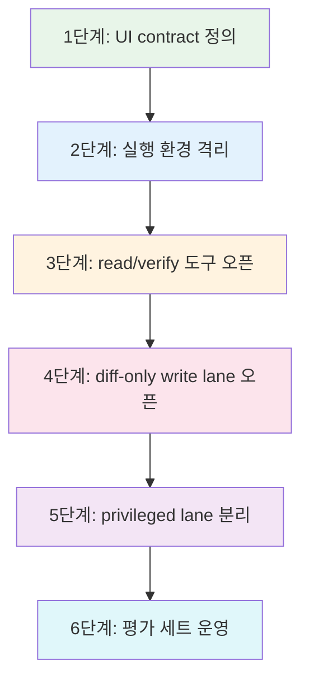
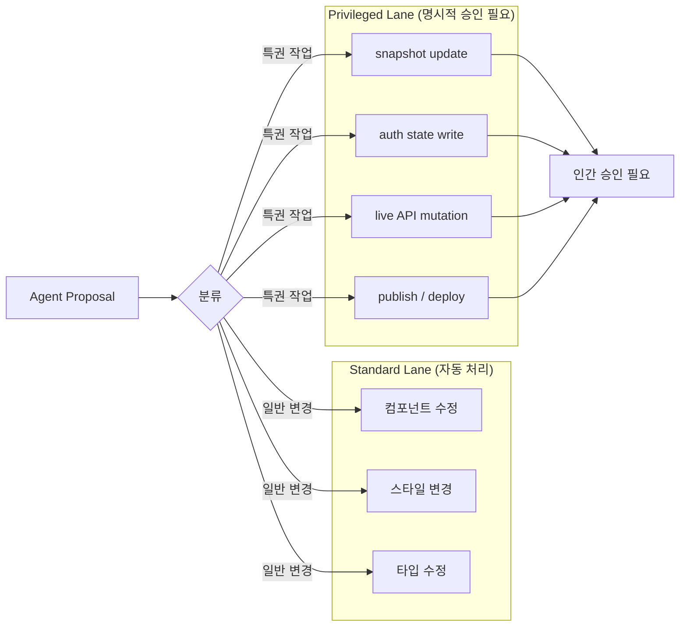
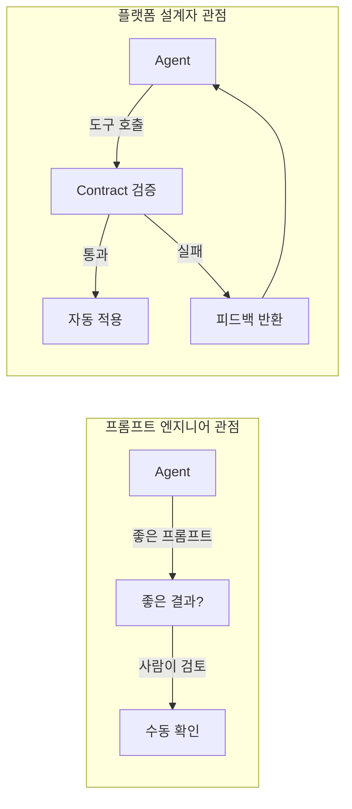
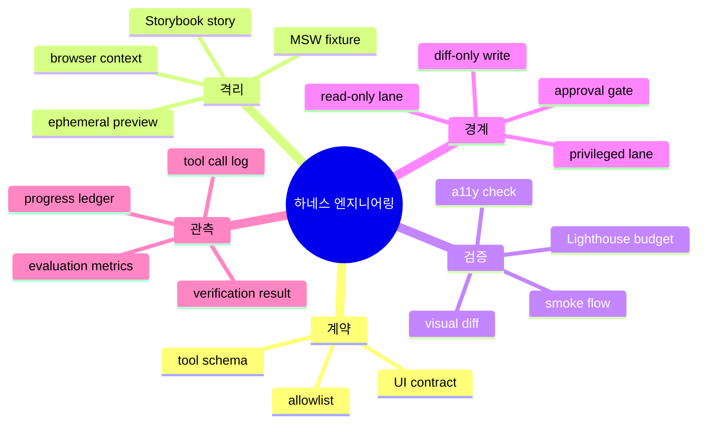

## 가장 흔한 실수부터 말하자

팀에 AI agent를 도입하겠다고 결정하는 순간, 대부분의 엔지니어는 같은 실수를 한다. **agent부터 붙인다.** Cursor를 열거나, Claude API를 연동하거나, Copilot Workspace를 활성화한다. 그리고 몇 주 후에 이런 말을 하게 된다.

"agent가 이상하게 동작해요." "왜 이게 작동하는지 모르겠어요." "agent가 멀쩡한 파일을 건드렸어요." "어디서 망가진지 추적이 안 돼요."

이건 agent의 문제가 아니다. **출발점이 잘못된 것**이다.

Gartner는 2027년까지 아젠틱(agentic) AI 프로젝트의 40%가 중단될 것이라 예측한다. 이유는 두 가지다. 비용 증가와 모니터링 부재. 두 번째 이유가 핵심이다. agent가 무언가를 했을 때 그 행동이 성공인지 실패인지를 시스템이 판별할 수 없으면, 사람이 일일이 눈으로 검토해야 한다. 그건 agent가 있기 전과 거의 다르지 않다. 오히려 더 나쁠 수 있다. 검토 대상이 늘어나기 때문이다.

agent 도입의 올바른 출발점은 agent가 아니라 **관측 가능성(observability)**이다. 그리고 관측 가능성보다 더 먼저 있어야 하는 것은 **성공의 기준(success criteria)**이다.

이 글은 하네스 엔지니어링을 실제 팀에 도입하는 6단계 접근 순서와, 현장에서 반복적으로 관찰되는 7가지 안티패턴을 다룬다. 그리고 시리즈 전체를 마무리하는 결론으로 끝낸다.

---

## 관측이 자동화보다 먼저인 이유

IBM이 엔터프라이즈 AI 자동화 프로젝트에서 발견한 패턴이 있다. 자동화를 성공시킨 팀은 예외 없이 **read-only 관찰 모드**에서 시작했다. agent에게 아무것도 건드리지 못하게 하면서 패턴을 식별했다. 그 다음에야 점진적 자동화로 이행했다.

OpenTelemetry는 2025년에 AI agent를 위한 표준 관측 프로토콜을 발표했다. 핵심은 에이전트 스팬(agent span)이다. 도구 호출 하나하나를 분산 추적(distributed tracing)의 스팬으로 다루면, agent가 무엇을 했는지가 기존 관측 인프라와 통합된다.

```typescript
// OpenTelemetry agent span 예시
import { trace, SpanStatusCode } from '@opentelemetry/api';

const tracer = trace.getTracer('agent-harness');

async function runToolWithObservability(
  toolName: string,
  params: Record<string, unknown>,
  executor: () => Promise<unknown>
) {
  const span = tracer.startSpan(`agent.tool.${toolName}`, {
    attributes: {
      'agent.tool.name': toolName,
      'agent.tool.params': JSON.stringify(params),
    },
  });

  try {
    const result = await executor();
    span.setStatus({ code: SpanStatusCode.OK });
    span.setAttribute('agent.tool.result', JSON.stringify(result));
    return result;
  } catch (error) {
    span.setStatus({ code: SpanStatusCode.ERROR, message: String(error) });
    throw error;
  } finally {
    span.end();
  }
}
```

이 패턴이 있어야 "agent가 이 도구를 몇 번 호출했고, 실패율은 얼마이며, 어디서 지연이 발생하는가"를 데이터로 알 수 있다. 데이터 없이는 하네스를 개선할 수 없다.

---

## 도입 6단계 접근 순서



### 1단계: UI Contract를 먼저 만든다

agent가 오기 전에, "무엇을 고치면 성공인지"를 기계가 판별할 수 있어야 한다. 이것이 UI contract다. UI contract는 agent의 행동을 제약하는 것이 아니라, **성공의 기준을 명문화하는 것**이다.

UI contract를 구성하는 요소는 다음과 같다.

| 항목 | 내용 | 도구 |
|------|------|------|
| 핵심 route | 반드시 200을 반환해야 하는 페이지 목록 | Playwright |
| 핵심 story | 항상 렌더링되어야 하는 컴포넌트 상태 | Storybook |
| smoke flow | 사용자가 완료해야 하는 핵심 시나리오 | Playwright |
| visual baseline | 스크린샷 diff 허용 임계값 | Chromatic / Percy |
| a11y 기준 | 위반 허용 레벨 (critical, serious 등) | axe-core |
| Lighthouse budget | 각 지표의 최소 점수 | Lighthouse CI |

이 항목들이 정의되기 전에는 agent를 붙이지 않는다. 구체적인 체크리스트로 표현하면 이렇다.

```typescript
// ui-contract.config.ts
export const uiContract = {
  criticalRoutes: [
    { path: '/', maxLoadMs: 3000 },
    { path: '/dashboard', maxLoadMs: 4000 },
    { path: '/checkout', maxLoadMs: 3500 },
  ],
  requiredStories: [
    'Button/Primary',
    'Button/Disabled',
    'Form/LoginForm',
    'Modal/ConfirmDialog',
  ],
  smokeFlows: [
    'user-can-login',
    'user-can-add-to-cart',
    'user-can-complete-checkout',
  ],
  visualDiffThreshold: 0.02, // 2% 픽셀 차이까지 허용
  a11yViolationLevels: ['critical', 'serious'], // 이 레벨은 0이어야 함
  lighthouseBudget: {
    performance: 85,
    accessibility: 95,
    'best-practices': 90,
    seo: 85,
  },
} as const;
```

이 파일이 있으면, CI는 "agent가 바꾼 것이 contract를 통과하는가"를 자동으로 판별할 수 있다. 사람이 검토하는 것은 contract를 통과한 diff만 된다.

### 2단계: 실행 환경을 격리한다

환경 격리는 하네스 엔지니어링의 물리적 기반이다. 이것이 안 되어 있으면 agent의 잘못이 아니라 **환경이 비재현적인 것**이다. 재현되지 않는 환경에서 나온 테스트 결과는 신뢰할 수 없고, 신뢰할 수 없는 결과 위에 agent를 붙이면 혼란만 커진다.

격리해야 하는 네 가지 층위가 있다.

**Storybook clean-room**: 각 story는 외부 전역 상태에서 독립되어야 한다.

```typescript
// .storybook/decorators/isolatedDecorator.tsx
import { Decorator } from '@storybook/react';
import { QueryClient, QueryClientProvider } from '@tanstack/react-query';

export const isolatedDecorator: Decorator = (Story) => {
  // 매 story마다 새로운 QueryClient 인스턴스 생성
  const queryClient = new QueryClient({
    defaultOptions: {
      queries: { retry: false, gcTime: 0 },
    },
  });

  return (
    <QueryClientProvider client={queryClient}>
      <Story />
    </QueryClientProvider>
  );
};
```

**MSW fixture**: 네트워크는 항상 mock으로 제어한다.

```typescript
// mocks/fixtures/user.ts
import { http, HttpResponse } from 'msw';

export const userFixtures = {
  authenticated: http.get('/api/user', () =>
    HttpResponse.json({
      id: 'test-user-1',
      name: 'Test User',
      role: 'admin',
    })
  ),
  unauthenticated: http.get('/api/user', () =>
    HttpResponse.json({ error: 'Unauthorized' }, { status: 401 })
  ),
  networkError: http.get('/api/user', () => HttpResponse.error()),
};
```

**Playwright browser context**: 각 테스트는 독립된 브라우저 context를 사용한다.

```typescript
// playwright.config.ts
import { defineConfig } from '@playwright/test';

export default defineConfig({
  use: {
    storageState: undefined,
  },
  projects: [
    {
      name: 'agent-tests',
      use: {
        // agent가 실행하는 테스트는 완전히 빈 상태에서 시작
        storageState: { cookies: [], origins: [] },
        baseURL: process.env.PREVIEW_URL ?? 'http://localhost:3000',
      },
    },
  ],
});
```

**Ephemeral preview**: agent의 변경은 항상 격리된 preview 환경에서 검증한다. PR마다 독립된 URL이 생성되고, 그 URL에서만 agent가 작동한다.

```yaml
# .github/workflows/preview.yml
- name: Deploy preview
  id: preview
  uses: vercel/action@v1
  with:
    vercel-args: '--prebuilt'

- name: Run agent tests against preview
  env:
    PREVIEW_URL: ${{ steps.preview.outputs.preview-url }}
  run: npx playwright test --project=agent-tests
```

### 3단계: Read/Verify 도구부터 연다

많은 팀이 agent에게 처음부터 수정 권한을 준다. 그것이 "agent를 쓰는 것"이라고 생각하기 때문이다. 하지만 올바른 순서는 **읽기와 검증 권한을 먼저** 주는 것이다.

IBM의 접근과 동일하다. read-only 단계에서 agent가 어떻게 추론하는지를 관찰한다. 이 관찰 데이터가 이후 write 도구를 어떻게 설계할지 결정한다.

```typescript
// tools/read-verify-tools.ts
const readVerifyToolset = {
  // 저장소 구조와 파일 내용 읽기
  'repo.read': {
    description: '파일 또는 디렉토리 내용을 읽는다',
    parameters: {
      path: { type: 'string', description: '읽을 경로' },
      recursive: { type: 'boolean', default: false },
    },
    sideEffects: 'none',
  },

  // Storybook story를 브라우저에서 열고 스크린샷을 반환
  'ui.open_story': {
    description: '특정 story를 렌더링하고 스크린샷을 반환한다',
    parameters: {
      storyId: { type: 'string', description: 'Storybook story ID' },
      viewport: { type: 'object', properties: { width: 'number', height: 'number' } },
    },
    sideEffects: 'none',
  },

  // smoke flow를 실행하고 결과를 반환
  'flow.run_smoke': {
    description: '지정된 smoke flow를 실행하고 pass/fail과 로그를 반환한다',
    parameters: {
      flowId: { type: 'string', description: 'smoke flow 식별자' },
      environment: { type: 'string', enum: ['preview', 'staging'] },
    },
    sideEffects: 'none',
  },

  // 접근성 검사 실행
  'quality.run_a11y': {
    description: '지정된 URL 또는 story에 대해 axe-core를 실행한다',
    parameters: {
      target: { type: 'string', description: 'URL 또는 story ID' },
      violationLevels: { type: 'array', items: { type: 'string' } },
    },
    sideEffects: 'none',
  },

  // 시각적 diff 확인
  'quality.run_visual_diff': {
    description: '현재 스크린샷과 baseline을 비교하고 diff 이미지를 반환한다',
    parameters: {
      target: { type: 'string', description: 'URL 또는 story ID' },
      threshold: { type: 'number', description: '허용 픽셀 차이 비율' },
    },
    sideEffects: 'none',
  },
} as const;
```

이 다섯 도구만 있어도 agent는 현재 코드베이스의 상태를 진단할 수 있다. 그리고 사람이 관찰할 수 있는 추론 로그가 생긴다. 이 로그가 이후 write 도구 설계의 입력이 된다.

### 4단계: Diff-only Write Lane을 연다

수정 권한을 열 때, **"파일 전체 다시 쓰기"가 아니라 "검토 가능한 패치"가 핵심**이다. agent는 diff만 제안하고, 그 diff가 allowlist를 통과하고 자동 검증을 통과한 뒤에만 실제로 적용된다.

```typescript
// tools/diff-write-tool.ts
import { z } from 'zod';
import { applyPatch } from 'diff';
import { runVerification } from '../verification';

const FileDiffSchema = z.object({
  filePath: z.string(),
  diff: z.string(), // unified diff 형식
  reason: z.string(), // 왜 이 변경이 필요한지
});

const AllowlistSchema = z.object({
  allowedPaths: z.array(z.string()), // glob 패턴
  blockedPaths: z.array(z.string()), // 절대 건드리면 안 되는 경로
});

async function applyDiff(
  proposal: z.infer<typeof FileDiffSchema>,
  allowlist: z.infer<typeof AllowlistSchema>
): Promise<{ applied: boolean; reason: string; verificationResult?: unknown }> {
  // 1. allowlist 검사
  const isAllowed = matchesAllowlist(proposal.filePath, allowlist);
  if (!isAllowed) {
    return { applied: false, reason: `${proposal.filePath} is not in allowlist` };
  }

  // 2. diff 미리보기 생성 (실제 적용 전)
  const preview = applyPatch(await readFile(proposal.filePath), proposal.diff);
  if (!preview) {
    return { applied: false, reason: 'diff could not be applied cleanly' };
  }

  // 3. 검증 실행
  const verificationResult = await runVerification({
    filePath: proposal.filePath,
    proposedContent: preview,
    checks: ['typescript', 'eslint', 'smoke'],
  });

  if (!verificationResult.passed) {
    return {
      applied: false,
      reason: `verification failed: ${verificationResult.failures.join(', ')}`,
      verificationResult,
    };
  }

  // 4. 검증 통과 후에만 적용
  await writeFile(proposal.filePath, preview);
  return { applied: true, reason: 'diff applied successfully', verificationResult };
}
```

이 구조에서 agent는 diff를 제안하는 역할이고, 시스템이 그 diff를 검증하고 적용하는 역할이다. "agent가 고쳤다"가 아니라 "시스템이 검증했다"가 완료 조건이 된다.

### 5단계: Privileged Lane을 분리한다

모든 write가 같은 위험 수준을 가지지는 않는다. 다음 작업들은 별도의 승인 경계가 필요하다.



특권 도구는 호출되는 순간 승인 큐에 쌓이고, 사람이 승인하기 전까지 실행되지 않는다. 이 분리가 없으면 agent는 의도치 않게 production 데이터를 바꾸거나, 시각적 기준선을 조용히 무너뜨릴 수 있다.

### 6단계: 평가 세트를 운영한다

Anthropic은 tool 개발을 evaluation-driven process로 다룬다. 사례를 하나 들면, Claude의 웹 검색 도구가 쿼리에 "2025"를 불필요하게 붙이는 문제가 있었다. 팀은 이 문제를 프롬프트가 아니라 **도구 설명의 개선**으로 해결했다. SWE-bench state-of-the-art 역시 agent 자체가 아닌, 도구 설명의 정밀한 개선으로 달성했다.

핵심 교훈은 이것이다. evaluation 없이는 어떤 변경이 개선인지 퇴보인지 알 수 없다.

평가 세트는 단순한 테스트가 아니다. **agent가 기대대로 동작하는지를 측정하는 메트릭 체계**다.

```typescript
// evaluation/metrics.ts
interface AgentEvaluationMetrics {
  // agent가 주어진 task를 완료했는가 (성공/실패)
  taskSuccessRate: number;

  // 검증 게이트를 통과한 비율 (quality.run_smoke, quality.run_a11y 등)
  verificationPassRate: number;

  // agent가 잘못된 도구를 호출하거나 존재하지 않는 도구를 호출한 비율
  toolConfusionRate: number;

  // 사람이 agent의 결정을 직접 override한 비율
  humanOverrideRate: number;

  // agent가 적용한 변경을 나중에 rollback한 비율
  rollbackRate: number;

  // 부수 지표
  avgToolCallsPerTask: number;
  avgTokensPerTask: number;
  avgDurationMs: number;
}

// 평가 실행 예시
async function runEvaluation(
  taskSet: EvalTask[],
  agent: AgentRunner
): Promise<AgentEvaluationMetrics> {
  const results = await Promise.all(
    taskSet.map(async (task) => {
      const startTime = Date.now();
      const result = await agent.run(task);

      return {
        taskId: task.id,
        success: result.outcome === 'success',
        verificationPassed: result.verificationResults.every((v) => v.passed),
        toolErrors: result.toolCalls.filter((t) => t.error).length,
        humanOverridden: result.humanInterventions > 0,
        rolledBack: result.rolledBack,
        toolCallCount: result.toolCalls.length,
        tokenCount: result.tokenUsage.total,
        durationMs: Date.now() - startTime,
      };
    })
  );

  return computeMetrics(results);
}
```

엘리트 팀과 일반 팀의 차이를 메트릭으로 보면 이렇다.

| 메트릭 | 엘리트 팀 | 일반 팀 |
|--------|----------|---------|
| taskSuccessRate | 70%+ | 32% |
| humanOverrideRate | 8% | 31% |
| rollbackRate | 3% | 19% |
| toolConfusionRate | 4% | 22% |

이 수치의 격차는 agent 모델의 차이에서 오지 않는다. 평가 사이클 운영 여부에서 온다. 주간 단위로 추적하면 무엇이 개선되고 있는지, 어떤 도구 설명이 혼란을 일으키는지가 보인다. 직관이 아니라 데이터로 하네스를 개선할 수 있게 된다.

---

## 프론트엔드 7대 안티패턴

### 안티패턴 1: `bash(command: string)`을 기본 도구로 여는 것

**왜 나쁜가**: bash나 `page.evaluate(js: string)` 같은 unrestricted executor를 기본 도구로 열면, agent는 사실상 서버에서 임의의 코드를 실행할 수 있는 상태가 된다. OWASP가 발표한 Agentic Applications Top 10(2026)에서 이 패턴은 상위 위협으로 분류된다. intent와 side effect 사이의 경계가 없어진다.

실제로 얼마나 심각한가. bash에 접근할 수 있는 agent는 시스템 콜(syscall) 전체에 접근할 수 있다. gVisor 샌드박스를 사용하면 350개의 시스템 콜을 68개로 줄일 수 있다. Firecracker microVM은 하드웨어 수준의 격리를 제공한다. bash 하나를 막는 것보다 실행 환경 자체를 제한하는 것이 더 근본적인 해결책이다.

```typescript
// BAD: unrestricted executor
const tools = {
  bash: {
    description: '터미널 명령어를 실행한다',
    parameters: { command: { type: 'string' } },
    // 이 도구 하나로 agent는 무엇이든 할 수 있다
  },
};

// GOOD: 목적이 명확한 도구로 분해
const tools = {
  'test.run_unit': {
    description: '유닛 테스트를 실행한다. jest 또는 vitest만 실행 가능하다',
    parameters: { pattern: { type: 'string', description: '테스트 파일 glob 패턴' } },
    allowedCommands: ['jest', 'vitest'],
    sandboxed: true,
  },
  'build.check_types': {
    description: 'TypeScript 타입 검사를 실행한다. tsc --noEmit만 실행 가능하다',
    parameters: { tsconfig: { type: 'string', default: 'tsconfig.json' } },
    allowedCommands: ['tsc'],
    sandboxed: true,
  },
};
```

**어떻게 고치나**: bash를 열어야 한다면, exact command disclosure(어떤 명령어가 실행되는지 로그), explicit approval(실행 전 확인), sandboxing(컨테이너 격리)을 모두 붙여야 한다. 도구 설명에 "이 도구로 실행 가능한 명령어"를 명시하는 것이 핵심이다. Anthropic의 경험처럼, 도구 설명이 agent의 행동을 가장 직접적으로 제어한다.

### 안티패턴 2: `edit_file` 하나로 모든 수정을 처리하는 것

**왜 나쁜가**: 행동 단위가 너무 커진다. 파일 전체를 다시 쓰면 무엇이 바뀌었는지 추적하기 어렵고, 검증도, 감사도, 롤백도 어렵다. agent가 실수했을 때 "무엇이 잘못됐는지"를 파악하는 시간이 크게 늘어난다.

```typescript
// BAD: 파일 전체 교체
const editFileTool = {
  name: 'edit_file',
  parameters: {
    path: { type: 'string' },
    content: { type: 'string' }, // 전체 파일 내용
  },
};

// GOOD: diff 기반 수정 + 검증 포함
const patchFileTool = {
  name: 'patch_file',
  parameters: {
    path: { type: 'string' },
    diff: { type: 'string', description: 'unified diff 형식' },
    reason: { type: 'string', description: '변경 이유' },
  },
  postApply: ['typescript-check', 'eslint', 'smoke-test'],
};
```

**어떻게 고치나**: diff 기반으로만 수정을 제안하게 하고, 각 diff에는 reason 필드를 의무화한다. 적용 후 자동 검증이 뒤따른다.

### 안티패턴 3: JSDOM이나 유닛 테스트만으로 correctness를 확인하는 것

**왜 나쁜가**: Kent C. Dodds는 "Why I Won't Use JSDOM"에서 이 문제를 명확하게 지적했다. JSDOM은 실제 브라우저가 아니다. CSS 레이아웃, scroll behavior, focus management, pointer event, WebGL, Web Audio API 등 브라우저에서만 재현되는 영역이 크다. 유닛 테스트를 통과한 컴포넌트가 Safari에서 깨지는 경우는 드물지 않다.

이 문제를 인식한 생태계는 이미 방향을 바꿨다. Vitest는 Browser Mode를 공식 지원하기 시작했다. 테스트를 실제 브라우저에서 실행하는 것이 가능하고, agent의 검증 파이프라인에서도 이 방향이 맞다.

```typescript
// BAD: JSDOM 기반 테스트만 실행
const verifyChanges = async (filePath: string) => {
  await runJest(`--testPathPattern=${filePath}`);
  // "테스트 통과" = "올바름"이라고 착각
};

// GOOD: real browser 검증 포함
const verifyChanges = async (storyId: string) => {
  // JSDOM 기반 유닛 테스트 (빠른 피드백)
  const unitResult = await runVitest({ pattern: storyId, mode: 'node' });

  // real browser에서 story 렌더링 확인 (Vitest Browser Mode)
  const browserResult = await runVitest({ pattern: storyId, mode: 'browser' });

  // visual diff
  const diffResult = await runVisualDiff(storyId, { threshold: 0.02 });

  // a11y 검사
  const a11yResult = await runA11y(storyId, { levels: ['critical', 'serious'] });

  return {
    unit: unitResult,
    browser: browserResult,
    visual: diffResult,
    a11y: a11yResult,
    passed: [unitResult, browserResult, diffResult, a11yResult].every((r) => r.passed),
  };
};
```

**어떻게 고치나**: 컴포넌트 변경에는 real browser 검증을 포함한다. story를 실제 브라우저에서 열어 렌더링을 확인하는 `ui.open_story` 도구를 검증 파이프라인에 포함한다.

### 안티패턴 4: Live backend를 기본 네트워크로 쓰는 것

**왜 나쁜가**: agent가 실행하는 테스트가 실제 서버와 통신하면, 네트워크 상태에 따라 결과가 달라진다. 테스트가 flaky해진다. 더 나쁜 경우, agent가 테스트 과정에서 staging 데이터를 오염시킨다.

```typescript
// BAD: 실제 API 서버로 요청이 나감
const smokeTest = async () => {
  const response = await fetch('/api/user'); // live backend
  expect(response.status).toBe(200);
};

// GOOD: MSW로 네트워크를 완전히 제어
import { setupServer } from 'msw/node';
import { userFixtures } from '../mocks/fixtures/user';

const server = setupServer(userFixtures.authenticated);

beforeAll(() => server.listen({ onUnhandledRequest: 'error' }));
afterEach(() => server.resetHandlers());
afterAll(() => server.close());

const smokeTest = async () => {
  // MSW가 응답. 네트워크 상태와 무관하게 항상 같은 결과
  const response = await fetch('/api/user');
  expect(response.status).toBe(200);
};
```

`onUnhandledRequest: 'error'` 옵션이 중요하다. agent가 mock 정의에 없는 API를 호출하면 즉시 실패한다. 조용히 실제 서버로 빠져나가는 경우를 차단한다.

**어떻게 고치나**: MSW를 기본 네트워크 레이어로 만든다. agent 도구는 mock/live를 명시적으로 선택하게 하고, 기본값은 항상 mock이다.

### 안티패턴 5: Auth state를 repo에 커밋하는 것

**왜 나쁜가**: 2025년 GitHub에서 탐지된 비밀(secret) 누출은 2,864만 건이다. 전년 대비 34% 증가다. Claude Code가 생성한 코드의 비밀 누출률은 3.2%로 기준치의 2배다. 세션 토큰, 쿠키, credential을 `storageState.json`으로 생성해 repo에 커밋하면, 해당 파일이 영구화된다. 세션이 만료되면 모든 테스트가 한꺼번에 깨지고, 그 원인을 찾는 데 시간이 걸린다. 더 심각하게는 credential이 코드베이스 히스토리에 남는다.

```typescript
// BAD: auth state를 파일로 저장하고 커밋
const setupAuth = async () => {
  const page = await browser.newPage();
  await page.goto('/login');
  await page.fill('[name=email]', 'test@example.com');
  await page.fill('[name=password]', 'password123');
  await page.click('[type=submit]');
  await page.context().storageState({ path: 'storageState.json' }); // 커밋됨!
};

// GOOD: auth state를 런타임에 생성, 임시 경로 사용
import * as os from 'os';
import * as path from 'path';

const setupAuth = async (): Promise<string> => {
  const tempPath = path.join(os.tmpdir(), `auth-state-${Date.now()}.json`);
  const page = await browser.newPage();
  // ... 로그인 과정
  await page.context().storageState({ path: tempPath });
  return tempPath; // 테스트 완료 후 삭제
};

// .gitignore에 반드시 추가:
// storageState.json
// *.auth.json
// .auth/
// playwright/.auth/
```

**어떻게 고치나**: auth state는 항상 임시 경로에 생성하고, 테스트 완료 후 삭제한다. `.gitignore`에 auth 관련 패턴을 명시한다. privileged tool인 `auth.write_session`을 통해서만 생성하게 한다. agent가 생성한 파일이 repo에 커밋되기 전 secret scanning을 CI에서 반드시 실행한다.

### 안티패턴 6: Snapshot update를 자동 승인하는 것

**왜 나쁜가**: visual snapshot update는 "UI가 바뀌었다"는 사실을 기록하는 것이 아니라, "이 상태가 올바른 기준선이다"라고 선언하는 것이다. agent가 버그를 소개하고 그 버그가 반영된 스크린샷으로 baseline을 갱신하면, 이후 테스트는 그 버그 상태를 정상으로 간주한다.

Percy의 2025년 AI Visual Review Agent는 40%의 노이즈를 자동으로 필터링한다. 하지만 Percy 팀도 명확히 한다: **초기 baseline은 수동으로 검토하는 것이 필수**다. AI가 필터링할 수 있는 노이즈는 기준선이 올바르게 설정된 이후의 작은 변화들이다. 기준선 자체가 잘못 설정되면 AI 필터링도 의미가 없다.

```typescript
// BAD: snapshot update를 일반 write와 같은 level로 처리
const tools = {
  'snapshot.update': {
    requiresApproval: false, // 자동 승인
    autoApply: true,
  },
};

// GOOD: snapshot update는 명시적 승인 필요
const tools = {
  'snapshot.update': {
    requiresApproval: true,
    approvalMessage: (storyIds: string[]) =>
      `다음 ${storyIds.length}개 story의 visual baseline을 갱신합니다:\n` +
      storyIds.map((id) => `  - ${id}`).join('\n') +
      '\n\n변경 전 diff 이미지를 확인한 후 승인해주세요.',
    showDiffBeforeApproval: true, // 승인 전 diff 이미지를 보여줌
  },
};
```

**어떻게 고치나**: snapshot update는 privileged lane에 배치하고, 반드시 사람이 diff 이미지를 확인한 후 명시적으로 승인해야 적용된다. 승인 메시지에는 변경 대상 story 목록과 diff 이미지 링크를 포함한다.

### 안티패턴 7: 새 세션이 들어올 때 현재 상태를 추측하게 두는 것

**왜 나쁜가**: Anthropic의 long-running agent 연구는 이 문제를 "세 가지 병리"로 명명한다. 세션 경계는 hard reset이다. 이전 세션의 맥락이 사라진다. 그 결과:

1. **데이터 중복**: 이미 완료된 작업을 다시 수행한다
2. **무한 루프**: 해결된 문제를 다시 발견하고 다시 시도한다
3. **전략 퇴행**: 이전 세션에서 실패로 확인된 접근을 다시 시도한다

세션 간 연속성 없이 장기 작업을 agent에게 맡기는 것은 기억상실이 있는 사람에게 이어서 작업하라고 하는 것과 같다.

Mitchell Hashimoto는 Ghostty 프로젝트에서 이 문제를 AGENTS.md 패턴으로 해결했다. "에이전트가 실수를 저지를 때마다, 다시는 같은 실수를 못 하도록 환경에 해결책을 기록하라." 이것이 조직적 기억(organizational memory)이다.

```typescript
// BAD: 상태 추적 없이 agent를 시작
const startAgentSession = async (task: string) => {
  await agent.run(task); // agent는 현재 상태를 모른다
};

// GOOD: progress ledger + AGENTS.md + init script 포함
interface ProgressLedger {
  taskId: string;
  completedSteps: string[];
  pendingSteps: string[];
  lastVerificationResults: Record<string, boolean>;
  lastCommitSha: string;
  activeFiles: string[];
  // 이전 세션의 실패 패턴 기록
  knownFailures: Array<{
    approach: string;
    reason: string;
    timestamp: string;
  }>;
}

const startAgentSession = async (task: string, ledger?: ProgressLedger) => {
  // 세션 초기화 스크립트
  const initContext = await buildInitContext({
    ledger,
    agentsMd: await readFile('AGENTS.md'), // 조직적 기억
    gitLog: await getRecentGitLog(10),
    smokeResults: await runSmokeFlow('quick-check'),
    currentBranch: await getCurrentBranch(),
  });

  await agent.run(task, {
    systemContext: initContext,
    onStepComplete: async (step) => {
      // 각 스텝 완료 후 ledger 업데이트
      await updateLedger(ledger, step);
    },
    onFailure: async (failure) => {
      // 실패 패턴을 AGENTS.md에 자동 기록
      await appendToAgentsMd(failure);
    },
  });
};
```

AGENTS.md 예시:

```markdown
# AGENTS.md - 조직적 기억

## 알려진 실패 패턴

### 2026-03-10: Button 컴포넌트 수정 시 주의사항
- 증상: Button의 variant prop을 수정할 때 Storybook의 Controls addon이 타입을 자동으로 추론하지 못함
- 원인: ButtonProps 인터페이스가 별도 파일에서 import됨
- 해결: ButtonProps 변경 후 반드시 Button.stories.tsx의 argTypes도 업데이트할 것

### 2026-03-12: MSW handler 순서 주의
- 증상: /api/user handler가 /api/user/:id handler보다 먼저 매칭됨
- 원인: MSW는 등록 순서대로 매칭함
- 해결: 구체적인 패턴을 먼저 등록할 것
```

**어떻게 고치나**: 세션 시작 시 init script를 실행해 현재 상태를 명확하게 전달한다. progress ledger를 지속적으로 업데이트해 세션 간 연속성을 유지한다. AGENTS.md를 통해 팀이 발견한 실패 패턴을 환경에 기록하고, 모든 agent 세션에 제공한다.

---

## 태도의 변화: 프롬프트 엔지니어가 아니라 플랫폼 설계자처럼

하네스 엔지니어링을 제대로 하려면 사고방식의 전환이 필요하다. Martin Fowler는 이것을 이렇게 표현했다. "하네스는 에이전트가 올바른 방향으로 자연스럽게 움직이도록 설계된 환경이다." 환경 설계가 핵심이지, 프롬프트 최적화가 핵심이 아니다.

이 전환을 다섯 가지 대비로 표현하면 이렇다.

| 프롬프트 엔지니어 반응 | 플랫폼 설계자 반응 |
|----------------------|-----------------|
| "agent에게 더 잘 설명하면 되겠지" | "도구 설명을 evaluation으로 검증한다" |
| "agent를 믿는다" | "증거와 격리를 믿는다" |
| "추론 자유도를 높인다" | "side effect 경계를 먼저 설계한다" |
| "agent가 고쳤다"를 완료로 본다 | "시스템이 검증했다"를 완료로 본다 |
| 도구 수를 늘린다 | 의미 있는 contract를 늘린다 |



플랫폼 설계자는 agent에게 무엇을 시킬지가 아니라, agent가 어떤 경계 안에서 작동하는지를 설계한다. 경계가 명확하면 agent의 실수는 작고, 국소적이고, 관측 가능하고, 되돌릴 수 있다.

Anthropic의 사례가 이것을 가장 잘 보여준다. 웹 검색 도구에서 발견된 "불필요한 2025 추가" 문제는 프롬프트를 고쳐서 해결하지 않았다. 도구 설명이라는 **환경**을 고쳐서 해결했다. 그것이 플랫폼 설계자의 접근이다.

---

## 시리즈 결론: 하네스 엔지니어링이란 무엇인가

이 시리즈는 일곱 편에 걸쳐 프론트엔드 관점에서 하네스 엔지니어링을 해부했다.

- **1편**: 왜 하네스 엔지니어링인가 — 하네스가 필요한 이유, agent의 신뢰 문제
- **2편**: 도구의 분류와 설계 원칙 — sideEffects, granularity, schema 설계
- **3편**: 관측 가능성 파이프라인 — 도구 호출 로그, 추론 추적, 이상 탐지
- **4편**: 검증 게이트 설계 — smoke flow, visual diff, a11y, Lighthouse
- **5편**: 권한 경계와 allowlist — standard lane vs privileged lane
- **6편**: 멀티 에이전트 아키텍처 — 오케스트레이터, 서브에이전트, 충돌 방지
- **7편**: 실전 도입 전략과 안티패턴 — 지금 이 글

이 모든 것을 한 문장으로 압축한다면:

> **브라우저·코드베이스·네트워크·품질 게이트를 작은 계약들로 분해해서, agent가 그 계약을 통과할 때만 변경이 현실이 되게 만드는 일.**

좋은 하네스는 agent를 천재처럼 보이게 만드는 시스템이 아니다. 좋은 하네스는 **agent의 실수를 작게, 국소적으로, 관측 가능하게, 되돌릴 수 있게** 만드는 시스템이다.

그리고 프론트엔드 개발자가 해야 할 일은 agent에게 권한을 주는 것이 아니다. **agent가 통과해야 할 UI 실험실과 품질 게이트를 설계하는 것**이다.



프론트엔드 개발자는 이미 여기에 필요한 감각을 가지고 있다.

컴포넌트 분해, story 기반 사고, 상태 격리, 접근성, 회귀 테스트, preview 환경, 브라우저 디버깅은 전부 하네스 엔지니어링의 재료다.

새로운 것은 LLM이 아니다. **그 재료들을 agent의 행동 경계로 재배치하는 방식**이다.

프론트엔드 개발자가 오랫동안 해온 일, 즉 복잡한 시스템을 작은 계약들로 쪼개고, 각 계약이 충족되는지를 자동으로 검증하는 일이 AI agent 시대에도 여전히 가장 중요한 엔지니어링이다. 그 일을 잘 하는 사람이 agent를 가장 효과적으로 쓰는 사람이다.

---

*이 글은 "프론트엔드 하네스 엔지니어링 Deep Dive" 시리즈의 마지막 편입니다. 시리즈 전체를 통해 하네스 엔지니어링의 why(1편), what(2편), 도구 설계(3편), 관측 가능성(4편), 검증 게이트(5편), 멀티 에이전트(6편), 그리고 실전 도입(7편)을 다뤘습니다.*
