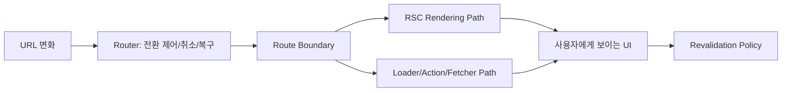

품질 게이트(주제 고정, 단일 목소리, Why 중심, 7,000자 이상, 코드 비중 20% 이하, ~입니다 체)를 반영해 재작성한 본문입니다.

---
title: "RSC 시대에 Router는 무엇을 담당하나 — React Router v7의 경계 재설계"
date: "2026-02-23"
tags: [React Router, React Router v7, RSC, Architecture]
series: "React Router v7 × RSC"
---

## 한눈에 보기

- React Router 7 + RSC 실무 운영의 핵심은 “무엇을 서버에서 렌더링할까”가 아니라 “이동 중 어떤 일관성을 보장할까”입니다.
- RSC는 렌더링 효율을 높이지만, URL 계약·전환 취소·오류 격리·재검증 정책은 여전히 Router가 책임지는 운영 영역입니다.
- 운영 장애의 다수는 API 기능 부족보다 **경계 모델 부재**에서 발생합니다.
- 팀 규모가 커질수록 코드 스타일보다 먼저 고정해야 하는 것은 **경계 소유권과 의사결정 루프**입니다.
- React Router 7 + RSC는 기술 조합이 아니라 제품 신뢰도를 관리하는 **운영 체계**입니다.

---

## 들어가며

React Router 7 + RSC 실무 운영을 시작하면 곧바로 한 가지 오해를 마주하게 됩니다.
“RSC가 서버에서 렌더링과 데이터 결합을 담당하니, Router는 이제 URL 매칭 정도만 하면 되는 것 아닌가?”라는 오해입니다.

이 질문은 직관적으로는 맞아 보입니다. 클라이언트에서 하던 일을 서버로 옮기면, 라우팅 계층의 비중도 줄어들 것처럼 느껴지기 때문입니다. 그러나 실제 운영 데이터와 장애 회고는 정반대를 보여줍니다. RSC를 도입할수록 Router가 맡아야 할 역할은 줄어드는 것이 아니라 더 정교해집니다.

이유는 단순합니다. 사용자가 체감하는 품질은 “어디에서 렌더링했는가”보다 “이동하는 동안 무엇이 보장되는가”에 더 크게 좌우되기 때문입니다.
- 클릭 이후 얼마나 일관되게 전환되는가
- 이전 요청이 늦게 도착해 화면을 덮어쓰지 않는가
- 일부 실패가 전체 실패로 번지지 않는가
- mutation 이후 최신성 규칙이 예측 가능한가

이 질문들은 RSC가 자동으로 결정해 주지 않습니다. 결국 React Router 7 + RSC 실무 운영의 본질은 기능 조합이 아니라 **경계 운영**입니다. 이 글은 그 경계를 “왜”라는 관점에서 정리합니다.

---

## 왜 RSC를 도입해도 전환 품질 문제는 남는가

많은 팀이 RSC 도입으로 기대하는 효과는 분명합니다. 초기 번들 감소, 서버 근접 데이터 조합, 스트리밍 기반 첫 화면 개선입니다. 이 기대 자체는 타당합니다. 다만 제품 운영에서 문제가 되는 지점은 첫 화면 속도만이 아닙니다.

실사용 환경에서 반복적으로 나타나는 이슈는 다음과 같습니다.

1. **경쟁 상태(race condition)**
연속 네비게이션 중 이전 요청이 늦게 도착해 최신 의도를 덮어쓰는 현상입니다.

2. **오류 반경 과대화**
섹션 단위 실패를 전체 페이지 실패로 처리해 사용자가 맥락을 잃는 현상입니다.

3. **재검증 정책 불일치**
mutation 이후 누가, 언제, 어디까지 새로고침해야 하는지 팀마다 판단이 다른 현상입니다.

4. **MFE 경계 충돌**
URL 소유권이 불명확해 링크 공유·QA 재현·분석 이벤트가 서로 다른 기준으로 작동하는 현상입니다.

이 문제들의 공통점은 렌더링 기술만으로 해결되지 않는다는 점입니다. RSC는 서버 렌더링 경로를 효율적으로 제공하지만, 전환 제어 정책과 운영 규약을 자동으로 만들어주지는 않습니다. 따라서 React Router 7 + RSC 실무 운영이 안정화되려면 “컴포넌트 기술”보다 먼저 “경계 정책”이 정리되어야 합니다.

---

## 원인: 라이브러리의 한계가 아니라 경계 모델의 공백

장애를 복기하면 원인은 대개 프레임워크 결함이 아니라 팀 내부의 암묵적 규칙입니다.
즉, “어디까지를 라우터 책임으로 볼 것인가”가 문서화되어 있지 않은 상태입니다.

경계 모델이 부재한 팀에서는 보통 다음 질문에 일관된 답이 없습니다.

- 이 URL이 표현하는 제품 상태는 무엇인가
- 어떤 전환은 취소하고 어떤 전환은 유지하는가
- 실패가 나면 어디서 복구하고 어디서 중단하는가
- 어떤 데이터는 즉시 최신이어야 하고 어떤 데이터는 지연을 허용하는가

이 질문이 합의되지 않으면 기능팀은 로컬 최적화를 선택합니다. 단기 생산성은 올라가지만, 장기 운영비가 급증합니다. 특히 팀이 20~30명 규모로 커지면, 기술 부채의 핵심은 코드 중복이 아니라 경계 불일치가 됩니다. 결과적으로 사용자 입장에서는 “가끔 이상하다”로 보이는 현상이 조직 입장에서는 “재현 불가 장애”로 누적됩니다.

React Router 7 + RSC 실무 운영에서 가장 먼저 해야 할 일은 기능 추가가 아니라 **경계 모델의 명시화**입니다.

---

## React Router 7 + RSC에서 Router가 맡아야 하는 네 가지 책임

### 1) URL 계약을 제품의 공용 인터페이스로 유지하는 책임

URL은 화면 진입점 이상의 의미를 가집니다. 링크 공유, 북마크, QA 시나리오, 로그 상관관계, 분석 이벤트가 모두 URL을 기준으로 연결됩니다. 따라서 URL이 흔들리면 UI만 흔들리는 것이 아니라 운영 체계 전체가 불안정해집니다.

React Router 7 + RSC 실무 운영에서 중요한 것은 라우트 트리 문법이 아니라 URL 의미의 안정성입니다.
쿼리 파라미터를 임시 상태 저장소처럼 남용하면 브라우저 히스토리와 화면 의미가 분리됩니다. 이때 디버깅 비용은 기하급수적으로 증가합니다.
정리하면, URL에 남길 상태(공유·복원 가능한 상태)와 남기지 않을 상태(일시적 UI 상태)를 분리해야 합니다.

### 2) 전환 취소·중단·재시도를 일관되게 다루는 책임

사용자는 이상적인 속도로 행동하지 않습니다. 빠르게 탭 이동하고, 뒤로 가기를 연속으로 누르고, 필터를 연달아 바꿉니다. 이때 사용자 기대는 한 가지입니다. “내 마지막 의도가 마지막 화면으로 반영되어야 한다”는 기대입니다.

이 기대를 보장하는 계층이 Router입니다.
React Router 7 + RSC 실무 운영에서는 API 사용법보다 **취소 정책**이 더 중요합니다.
- 어떤 요청은 즉시 폐기할 것인가
- 어떤 요청은 백그라운드로 유지할 것인가
- 어떤 실패는 재시도하고 어떤 실패는 즉시 노출할 것인가

정책이 없으면 같은 코드를 배포해도 네트워크 상황에 따라 결과가 달라집니다. 이는 기능 버그가 아니라 운영 버그입니다.

### 3) 라우트 단위 오류 격리로 장애 반경을 줄이는 책임

실패는 피할 수 없습니다. 중요한 것은 실패의 크기입니다. 작은 API 실패를 전체 페이지 실패로 증폭시키면 사용자는 업무 흐름을 잃고, 이탈 가능성이 커집니다.

RSC 환경에서도 실패 지점이 사라지지 않습니다. 단지 위치가 이동합니다.
따라서 React Router 7 + RSC 실무 운영에서는 라우트 경계를 기준으로
- 어디서 실패를 포착할지
- 어떤 fallback을 보여줄지
- 어떤 경로를 유지한 채 복구할지
를 먼저 설계해야 합니다.

결국 “에러 화면을 예쁘게 만드는 일”보다 “실패가 번지지 않게 경계를 잘 자르는 일”이 더 중요합니다.

### 4) 재검증(revalidation)을 암묵이 아닌 정책으로 다루는 책임

RSC, loader/action, fetcher를 혼합하면 최신성 판단은 빠르게 복잡해집니다. mutation 이후 전체를 다시 가져올지, 일부만 갱신할지, stale 허용 시간을 둘지 결정해야 합니다.

이 판단을 개발자 감각에 맡기면 팀별 편차가 생깁니다.
- 어떤 팀은 모든 액션 후 전체 재검증
- 어떤 팀은 거의 재검증 없음
- 어떤 팀은 임의의 캐시 무효화

결과는 예측 불가능한 사용자 경험입니다.
React Router 7 + RSC 실무 운영에서는 “반드시 최신이어야 하는 도메인”을 먼저 분류해야 합니다.
예를 들어 결제·권한·주문 상태는 보수적으로, 통계 카드·추천 목록은 지연 허용으로 정책을 나눌 수 있습니다.
핵심은 기술 옵션이 아니라 **도메인 위험도 기반 의사결정**입니다.

---

## 운영 관점: 팀이 실제로 굴러가게 만드는 방법

### 1) 경계 소유권을 사람에게 붙입니다

아키텍처는 다이어그램이 아니라 의사결정 구조입니다.
React Router 7 + RSC 실무 운영에서 효과적인 구조는 다음과 같습니다.

- 플랫폼/아키텍처 팀: URL 스키마, 전환 규칙, 공통 오류 정책
- 도메인 기능팀: 화면 책임, 비즈니스 예외, 사용자 흐름
- 운영/품질 팀: 로그 스키마, 경보 기준, 관측 지표

핵심은 구현자가 아니라 **결정권자**를 명확히 하는 것입니다. 결정권이 흐리면 리뷰는 많아지고 품질은 정체됩니다.

### 2) 혼합 모드를 “과도기 예외”가 아닌 “기본 전제”로 둡니다

대부분의 조직은 한 번에 RSC 100%로 전환하지 못합니다. 실제 현장은 RSC 경로와 기존 loader/action 경로가 장기간 공존합니다. 이때 필요한 것은 이상론이 아니라 충돌 방지 규칙입니다.

- 동일 리소스의 중복 패칭 탐지
- 경계별 fallback UI 표준화
- route 단위 추적 키(전환 ID, 실패 타입, 요청 소스) 통일
- 점진 이관 순서의 사전 정의(트래픽 우선/복잡도 우선)

혼합 모드를 인정하면 오히려 운영 품질이 올라갑니다. 숨기면 사고가 납니다.

### 3) 테스트의 중심을 “정적 화면”에서 “동적 전환”으로 이동합니다

RSC 도입 이후에도 치명 장애를 많이 잡는 테스트는 스냅샷 테스트가 아니라 전환 시나리오 테스트입니다.

- 연속 네비게이션에서 마지막 의도 보장
- back/forward에서 URL-화면 일치
- 부분 실패 시 핵심 흐름 유지
- mutation 후 필요 범위만 재검증

React Router 7 + RSC 실무 운영에서 이 테스트가 빠지면, 릴리스 전까지 “눈에 보이지 않는 전환 결함”이 남습니다.

### 4) 관측 지표를 기술 지표와 경험 지표로 분리합니다

응답 시간과 에러율만으로는 라우팅 품질을 설명하기 어렵습니다.
실제로 봐야 할 것은 사용자 전환 경험입니다.

- 경로별 전환 중단율
- fallback 노출 시간 분포
- older-over-newer 역전 발생 건수
- 복구 UI에서의 재시도 성공률

이 지표를 주간 단위로 추적하면 “체감이 왜 나쁜지”를 감정이 아니라 데이터로 논의할 수 있습니다. 이것이 React Router 7 + RSC 실무 운영을 팀 학습 루프로 바꾸는 핵심입니다.

---

## 성능·네트워크·자동화 관점에서 보는 추가 현실

React Router 7 + RSC 실무 운영은 프론트엔드 내부 문제로 끝나지 않습니다. 빌드, 네트워크, 자동화까지 연결됩니다.

### 빌드/배포 관점

경계가 안정되지 않은 팀은 코드 스플리팅·캐시 최적화를 해도 체감 개선이 제한적입니다. 이유는 단순합니다. 배포는 빨라졌는데 전환 규칙이 불안정하면 사용자 경험이 흔들리기 때문입니다.
즉, 빌드 최적화의 효과를 사용자 가치로 전환하려면 라우팅 경계가 선행되어야 합니다.

### 네트워크 관점

HTTP/2·HTTP/3, CDN, 캐시 정책이 좋아져도 전환 정책이 불명확하면 불필요 재요청이 증가합니다. 네트워크 기술은 파이프를 넓혀주지만, 어떤 물을 언제 흘릴지는 Router 정책이 정합니다.
결국 전환 취소 정책과 재검증 정책이 네트워크 비용을 결정합니다.

### 자동화/AI 관점

코드 생성이나 규칙 검사는 라우트 패턴 표준화에 도움을 줄 수 있습니다. 하지만 경계 철학이 없는 상태에서 자동화만 늘리면 일관성 없는 규칙을 더 빠르게 복제하게 됩니다.
AI는 결정을 대신하는 도구가 아니라, 이미 합의된 경계를 반복 적용하는 증폭기여야 합니다.

---

## 최소 협력 모델

아래 구조를 기억하면 React Router 7 + RSC를 대체 관계가 아니라 협력 관계로 이해할 수 있습니다.

핵심은 분명합니다.
RSC는 렌더링 전략입니다. Router는 전환과 경계를 운영하는 실행 계층입니다.
둘을 경쟁 관계로 보면 설계가 충돌하고, 역할 분담으로 보면 운영이 안정됩니다.

---

## 트레이드오프

### 1) 중앙 규칙 강화 vs 팀 자율성 확대

- 중앙 규칙 강화의 장점: URL 계약·관측·장애 대응이 일관됩니다.
- 단점: 초기 의사결정 속도가 느려지고 플랫폼 병목이 생길 수 있습니다.
- 팀 자율성의 장점: 기능 실험과 출시 속도가 빨라집니다.
- 단점: 장기적으로 경계 편차가 누적되어 통합 비용이 커집니다.

현실적인 해법은 “핵심 계약 중앙화, 화면 구현 자율화”입니다.

### 2) 공격적 재검증 vs 선택적 재검증

- 공격적 재검증 장점: 최신성 신뢰가 높고 상태 역전 위험이 낮습니다.
- 단점: 네트워크 비용과 체감 지연이 증가합니다.
- 선택적 재검증 장점: 인터랙션이 가볍고 비용이 줄어듭니다.
- 단점: 정책 누락 시 stale 이슈가 누적됩니다.

정답은 일괄 선택이 아니라 도메인 위험도 기반 분리입니다.

### 3) 빠른 점진 이관 vs 완성도 높은 일괄 이관

- 점진 이관 장점: 리스크 분산, 학습 사이클 단축
- 단점: 혼합 모드 비용 증가
- 일괄 이관 장점: 최종 구조 정합성
- 단점: 실패 시 충격 반경 큼

대부분 조직은 점진 이관이 현실적이며, 그 전제는 혼합 모드 규칙의 선행 정의입니다.

### 4) 단순 에러 UX vs 세분화된 복구 UX

- 단순 UX 장점: 구현 비용 낮음
- 단점: 장애 반경 확대
- 세분화 UX 장점: 맥락 보존, 복구율 향상
- 단점: 설계·테스트 복잡도 증가

핵심 경로는 세분화, 보조 경로는 단순화를 적용하는 우선순위 전략이 유효합니다.

---

## 마무리하며

RSC 시대에 Router의 역할은 축소가 아니라 재정의입니다.
React Router 7 + RSC 실무 운영의 성패는 새 API를 얼마나 빨리 도입했는지가 아니라, 경계를 얼마나 명시적으로 운영하느냐에 달려 있습니다.

- URL을 계약으로 다루는가
- 전환 취소와 복구를 정책으로 관리하는가
- 실패 반경을 라우트 단위로 줄이는가
- 재검증을 도메인 위험도 기반으로 설계하는가

이 네 가지에 답할 수 있다면, Router와 RSC는 서로를 대체하지 않습니다. 오히려 서로의 공백을 메우며 제품 신뢰도를 끌어올립니다.
결국 React Router 7 + RSC 실무 운영은 “렌더링 기술 선택”이 아니라 “전환 경험을 조직적으로 보장하는 일”입니다.

---

## 더 읽어볼 자료

- [React Router 공식 문서](https://reactrouter.com/)
- [React Server Components 개요 (React Docs)](https://react.dev/reference/rsc/server-components)
- [Remix Docs: Data Loading / Errors / Transitions](https://remix.run/docs)
- [Micro Frontends (Martin Fowler)](https://martinfowler.com/articles/micro-frontends.html)
- [Core Web Vitals (web.dev)](https://web.dev/vitals/)
