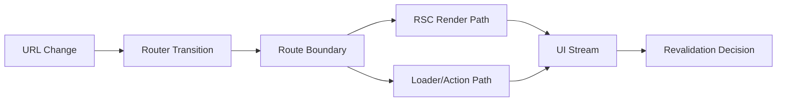

React Server Components(RSC)가 본격적으로 논의되면서, 많은 팀이 비슷한 질문을 던집니다.

> "RSC가 데이터 패칭과 서버 렌더링을 담당하면 Router 역할은 줄어드는 것 아닌가?"

표면적으로는 맞아 보입니다. 서버 컴포넌트가 늘어나면 클라이언트 라우팅의 중요도가 약해지는 것처럼 느껴지기 때문입니다. 하지만 실무에서는 정반대 현상이 자주 발생합니다. RSC를 도입할수록 **경계(boundary) 설계**가 중요해지고, 이 경계를 실제 런타임에서 책임지는 축은 여전히 Router입니다.

이 글은 React Router v7 관점에서, RSC 시대에 Router의 책임이 어떻게 재정의되는지 정리합니다.

---

## RSC가 해결하는 것과, 해결하지 않는 것

먼저 분리해서 봐야 합니다.

### RSC가 잘하는 일

- 서버에서 컴포넌트를 렌더링해 초기 로딩 부담을 낮춘다
- 서버 리소스(DB, 내부 API)에 가까운 위치에서 데이터를 조합한다
- 불필요한 클라이언트 번들을 줄인다

### RSC가 직접 해결하지 않는 일

- URL을 중심으로 화면 상태를 조직하는 문제
- 내비게이션 전환 중 로딩/취소/중단 처리
- 라우트 단위 에러 경계와 복구 흐름 설계
- 페이지 전환 이후 데이터 재검증 정책

즉 RSC는 "어디서 렌더링할 것인가"를 강하게 바꾸지만,
Router는 "무엇을 경계로 나누고 어떻게 전환할 것인가"를 계속 책임집니다.

---

## React Router v7에서 경계가 중요한 이유

React Router v7은 라이브러리 모드만 보는 도구가 아니라, Framework/Data/Library를 모두 포괄하는 **멀티 전략 라우터**입니다. 이 의미는 단순히 기능이 많다는 뜻이 아닙니다.

핵심은 다음입니다.

1. 라우트 단위로 데이터/에러/로딩 경계를 모델링할 수 있다
2. 서버와 클라이언트 전환 사이에서 상태 일관성을 유지한다
3. 점진적 마이그레이션(v6/Remix → v7)에서 중간 상태를 견딜 수 있다

RSC를 도입하면 렌더링 위치는 바뀌지만, 이 3가지는 오히려 더 중요해집니다.

---

## Router 책임을 다시 정의해보면

RSC 시대의 Router 책임을 한 줄로 요약하면:

> **데이터 소스가 아니라 사용자 전환 경험을 설계하는 런타임 계층**

조금 더 실무적으로 풀면 아래 4가지입니다.

### 1) URL을 제품 상태의 계약으로 유지

팀이 커질수록 URL은 단순 주소가 아니라 계약(contract)입니다.
RSC를 도입해도 URL 계약이 흔들리면 QA, 분석, 공유 링크, 장애 대응이 동시에 무너집니다.

### 2) 전환 중단/취소/재시도의 일관성

사용자는 빠르게 이동하고, 네트워크는 느리고, 데이터는 자주 바뀝니다.
Router는 이 비동기 경합에서 어떤 요청을 살리고 버릴지 결정하는 첫 관문입니다.

### 3) 라우트 단위 에러 경계

RSC만으로는 "어디까지 실패를 격리할지"가 자동으로 정해지지 않습니다.
React Router의 경계 설계를 잘하면 전체 앱 다운 대신 부분 복구가 가능합니다.

### 4) 재검증(revalidation) 정책

RSC/loader/action/fetcher가 혼합된 앱에서는 "언제 데이터가 stale인가"를 명시적으로 정해야 합니다.
이 정책이 없으면 사용자에게는 랜덤 버그처럼 보입니다.

---

## 실무에서 자주 생기는 오해 3가지

### 오해 1) "RSC 쓰면 loader/action 줄여도 된다"

줄일 수 있는 경우는 맞지만, 대체가 항상 가능한 건 아닙니다.
뮤테이션 이후 재검증, 폼 처리, 에러 복구 흐름은 Router 레이어가 더 명확한 경우가 많습니다.

### 오해 2) "Router는 화면 스위칭만 한다"

v7 기준 Router는 데이터 흐름과 전환 상태까지 포함해 다룹니다.
특히 대규모 팀에서는 화면 전환보다 **전환 중 상태 관리**가 더 큰 비용입니다.

### 오해 3) "RSC 도입 후 MFE 경계는 자동으로 정리된다"

오히려 반대입니다.
MFE 환경에서는 Shell/Fragment 책임을 명확히 나누지 않으면 중복 패칭, 에러 전파, 로딩 플리커가 심해집니다.

---

## 팀 관점(30인 규모)에서의 추천 경계

종구리님 팀처럼 MFE 전환 중이고 의사결정자가 존재하는 조직에서는 다음 원칙이 현실적입니다.

1. **URL/라우팅 계약은 플랫폼 팀이 소유**
2. **도메인 데이터 책임은 각 기능팀이 소유**
3. **에러/로딩 UX 기준은 공통 규격으로 통일**
4. **재검증 규칙은 문서+테스트로 고정**

여기서 중요한 점은 "누가 코드를 쓰느냐"보다 "누가 경계를 소유하느냐"입니다.
RSC는 구현 옵션이고, 경계 소유권은 운영 모델입니다.

---

## 최소 경계 다이어그램

포인트는 단순합니다.
RSC와 loader/action은 경쟁 관계가 아니라, 라우트 경계 아래에서 협력하는 두 경로입니다.

---

## 실무 체크리스트

- [ ] 라우트별 책임 문서가 존재하는가 (데이터/에러/로딩/권한)
- [ ] 전환 취소 시나리오를 테스트로 재현 가능한가
- [ ] stale 데이터 재검증 규칙이 팀 공통으로 합의되어 있는가
- [ ] MFE 경계에서 URL 계약을 누가 승인하는지 명확한가

---

## 마무리

RSC 시대에 Router 역할은 줄어들지 않습니다.
정확히는 **렌더링 도구에서 경계 오케스트레이터로 역할이 선명해집니다.**

React Router v7은 이 경계를 다루기 위한 현실적인 선택지(Framework/Data/Library)를 제공하고, 팀은 그 위에서 운영 모델을 결정해야 합니다.

다음 글에서는 이 질문으로 넘어가겠습니다.

> React Router v7은 실제로 RSC를 어떤 구조로 수용하고, 모드별로 어떤 선택지를 제공하는가?
