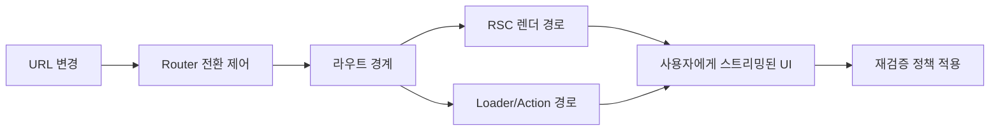

재작성본을 품질 게이트까지 통과시킨 뒤 바로 전달하겠습니다.

---
title: "RSC 시대에 Router는 무엇을 담당하나 — React Router v7의 경계 재설계"
date: "2026-02-23"
tags: [React Router, React Router v7, RSC, Architecture]
series: "React Router v7 × RSC"
---

## 한눈에 보기

- RSC가 도입되어도 Router의 역할은 줄어들지 않으며, 오히려 **경계 설계와 전환 제어의 중요성**이 커집니다.
- React Router 7 + RSC 실무 운영의 핵심은 기능 나열이 아니라 **URL 계약, 전환 일관성, 실패 격리, 재검증 정책**을 조직 단위로 고정하는 일입니다.
- RSC는 “서버에서 무엇을 렌더링할지”를 잘 다루지만, “사용자가 이동하는 동안 어떤 경험을 보장할지”는 Router가 계속 책임집니다.
- 운영에서 문제가 되는 지점은 렌더링 기술 자체보다 **혼합 모드(RSC + loader/action + fetcher + MFE)에서의 경계 충돌**입니다.
- 팀이 커질수록 코딩 스타일 통일보다 먼저 필요한 것은 **경계 소유권과 의사결정 루프**입니다.

## 들어가며

React Router 7 + RSC 실무 운영을 시작하면 가장 먼저 부딪히는 질문이 있습니다. “이제 서버가 렌더링과 데이터 결합을 맡는데, Router의 존재감이 약해지는 것 아닌가?”라는 질문입니다. 처음 들으면 꽤 설득력 있어 보입니다. 클라이언트에서 하던 일을 서버로 옮기면 라우팅은 URL 매칭 정도로 단순화될 것처럼 느껴지기 때문입니다.

하지만 실제 운영 환경에서 관찰되는 패턴은 반대입니다. RSC를 도입할수록 라우팅 계층이 얇아지지 않고, 오히려 더 정교해져야 장애가 줄어듭니다. 이유는 간단합니다. 제품에서 사용자가 체감하는 문제의 대부분은 “어디에서 렌더링했는가”보다 “이동 중에 무엇이 보이고, 무엇이 취소되고, 실패가 어디까지 전파되는가”에서 발생하기 때문입니다.

React Router 7을 RSC와 함께 쓸 때의 본질은 라우터를 UI 스위처로 보는 관점에서 벗어나는 데 있습니다. Router는 화면 간 이동 버튼이 아니라, URL 기반 상태 머신이자 경계 오케스트레이터입니다. 이 글은 그 관점으로 실무 운영을 정리합니다.

## 본문

### 1) 문제: RSC를 도입했는데도 사용자 경험 이슈가 줄지 않는 이유

RSC 도입 후 많은 팀이 기대하는 변화는 명확합니다. 초기 번들 감소, 서버 근접 데이터 조합, 그리고 더 빠른 첫 화면입니다. 이 기대는 대부분 맞습니다. 다만 여기서 자주 놓치는 점이 있습니다. 성능 지표 일부가 개선되어도, 전환 경험이 흔들리면 사용자는 앱이 더 안정적이라고 느끼지 않습니다.

운영에서 자주 만나는 문제는 다음과 같습니다.

- 이동 중 이전 요청 결과가 늦게 도착해 UI를 덮어쓰는 경쟁 상태
- 섹션 단위 실패를 전체 페이지 실패처럼 노출하는 에러 경계 부재
- mutation 이후 어떤 화면이 언제 최신화되는지 팀마다 다른 규칙
- MFE 경계에서 URL 소유권이 불명확해 링크 공유, QA, 분석 이벤트가 어긋나는 현상

이 네 가지는 모두 RSC가 자동으로 해결해 주지 않습니다. RSC는 서버 렌더링 경로를 강력하게 제공하지만, 전환 중 제어 정책까지 자동으로 만들어주지는 않기 때문입니다. 결국 Router 설계가 약하면 RSC 도입 효과가 사용자 체감으로 연결되지 않습니다.

### 2) 원인: 기술 문제가 아니라 경계 모델 부재

실무에서 장애를 복기해 보면 “라이브러리 버그”보다 “경계 모델 부재”가 원인인 경우가 많습니다. 여기서 경계는 단순한 컴포넌트 분리가 아닙니다. 최소한 다음 질문에 팀이 동일하게 답할 수 있어야 합니다.

- 이 URL이 표현하는 제품 상태는 무엇인가
- 이동 중 데이터 요청 취소 기준은 무엇인가
- 실패가 발생하면 어디까지 격리하고 어떤 복구 UI를 노출할 것인가
- 어떤 이벤트가 재검증을 트리거하고, 어떤 이벤트는 캐시를 유지할 것인가

이 질문이 문서와 테스트로 고정되지 않으면, 각 팀은 당장의 기능 완성도를 기준으로 개별 최적화를 하게 됩니다. 단기적으로는 빠르게 보일 수 있지만, 시간이 지날수록 전환 플리커, stale 데이터, 중복 패칭, 예외 전파 같은 비용이 누적됩니다. 특히 20~30명 이상 조직에서는 이 누적 비용이 기능 속도보다 먼저 한계에 도달합니다.

### 3) 원리: React Router 7에서 Router가 다시 맡아야 할 네 가지 책임

#### 3-1. URL 계약을 제품의 공용 인터페이스로 유지합니다

URL은 단순 주소가 아니라 팀 간 계약입니다. 링크 공유, 즐겨찾기, QA 시나리오, 분석 이벤트, 운영 재현 절차가 모두 URL을 기준으로 돌아갑니다. RSC를 도입했다는 이유로 URL 의미가 흔들리면, 프론트엔드만의 문제가 아니라 운영 전체 신뢰도가 낮아집니다.

React Router 7 운영에서 중요한 포인트는 “라우트 정의”보다 “URL 의미의 안정성”입니다. 쿼리 파라미터를 임시 상태 저장소처럼 남용하면 브라우저 히스토리와 실제 화면 의미가 분리되고, 디버깅 비용이 급증합니다. URL에 남길 상태와 남기지 않을 상태를 명확히 구분해야 합니다.

#### 3-2. 전환 중단·취소·재시도를 일관되게 처리합니다

사용자는 기다려주지 않습니다. 빠르게 탭을 이동하고, 뒤로 가기를 누르고, 검색 조건을 연속으로 바꿉니다. 이때 가장 먼저 깨지는 것은 “마지막 입력이 마지막 결과를 보장한다”는 기대입니다. Router는 이 기대를 지키는 런타임 제어 레이어입니다.

React Router 7에서 중요한 것은 API 문법보다도 팀 규칙입니다. 어떤 요청은 즉시 취소하고, 어떤 요청은 유지할지 기준을 정해야 합니다. 기준이 없으면 네트워크 상태에 따라 결과가 바뀌는 랜덤 버그가 됩니다. 사용자 관점에서는 “가끔 이상함”이지만, 운영 관점에서는 재현 불가 장애가 됩니다.

#### 3-3. 라우트 단위 실패 격리로 장애 반경을 줄입니다

실패는 반드시 발생합니다. 문제는 실패 자체가 아니라 실패의 반경입니다. 전체 페이지를 하나의 실패 단위로 다루면 작은 API 오류도 전면 장애로 느껴집니다. 반대로 라우트 경계를 기준으로 실패를 격리하면, 사용자는 핵심 흐름을 유지한 채 일부 기능만 재시도할 수 있습니다.

RSC 환경에서도 이 원칙은 동일합니다. 서버 컴포넌트가 더 많아질수록 실패 지점이 사라지는 것이 아니라 이동합니다. 따라서 실패를 어디에서 캡처하고 어떤 복구 패턴을 제공할지 Router 경계에서 먼저 설계해야 합니다.

#### 3-4. 재검증 규칙을 “암묵적 습관”이 아니라 “명시적 정책”으로 운영합니다

RSC, loader/action, fetcher를 함께 쓰면 데이터 최신성 판단이 복잡해집니다. 어떤 mutation 이후 전체 재검증이 필요한지, 부분 갱신으로 충분한지, 백그라운드 동기화를 허용할지 같은 결정이 필요합니다. 이를 명시하지 않으면 팀마다 다른 직관이 코드에 반영됩니다.

재검증 정책은 성능과 신뢰도의 균형점입니다. 무조건 재검증하면 느리고, 과도한 캐시 유지로 가면 오래된 정보가 노출됩니다. 결국 “언제 반드시 최신이어야 하는가”를 도메인 기준으로 정의해야 합니다. 예를 들어 결제, 주문 상태, 권한 정보는 보수적으로, 통계 카드나 추천 목록은 지연 허용 범위를 둘 수 있습니다.

### 4) 운영: React Router 7 + RSC를 팀에서 굴리는 현실적인 방법

기술 선택보다 운영 체계가 먼저입니다. 아래는 실무에서 효과가 높았던 운영 원칙입니다.

#### 4-1. 경계 소유권을 역할로 고정합니다

- 플랫폼/아키텍처 영역: URL 스키마, 라우팅 계약, 공통 전환 UX 기준
- 도메인 기능팀: 데이터 해석, 화면 책임, 비즈니스 예외 처리
- 공통 운영: 에러 분류 체계, 로깅 키, 관측 대시보드 정의

핵심은 “누가 구현하느냐”가 아니라 “누가 최종 결정권을 갖느냐”입니다. 책임 주체가 흐리면 코드 리뷰는 늘어나는데 품질은 나아지지 않습니다.

#### 4-2. 혼합 모드를 전제로 설계합니다

대부분의 조직은 한 번에 RSC 100%로 이동하지 않습니다. 일정 기간은 RSC 경로와 기존 loader/action 경로가 공존합니다. 이때 필요한 것은 이상적인 아키텍처가 아니라 충돌 방지 규칙입니다.

- 동일 데이터 소스에 대한 중복 패칭 감시
- 경계별 fallback UI 표준화
- route 단위 로그 필드 통일(경로, 전환 ID, 실패 타입)
- 점진 이관 순서(트래픽 큰 경로 우선 또는 복잡도 낮은 경로 우선) 명시

#### 4-3. 테스트를 기능 테스트가 아니라 전환 테스트 중심으로 재구성합니다

RSC 도입 이후에도 장애를 많이 잡는 테스트는 “렌더링 스냅샷”보다 “전환 시나리오”입니다. 예를 들어 다음 케이스가 중요합니다.

- 연속 네비게이션에서 마지막 요청만 반영되는지
- 뒤로 가기/앞으로 가기에서 URL과 화면 상태가 일치하는지
- 부분 실패 시 다른 영역이 정상 유지되는지
- mutation 직후 필요한 범위만 재검증되는지

이 테스트가 없으면 릴리스 직전까지도 전환 결함이 숨어 있습니다.

#### 4-4. 관측 지표를 기술 지표와 경험 지표로 분리합니다

운영 대시보드는 보통 응답 시간과 에러율로 끝나기 쉽습니다. 하지만 라우팅 품질은 사용자 경험 지표를 따로 봐야 합니다.

- 경로별 전환 중단율
- route 경계별 fallback 노출 시간
- 재검증 후 데이터 역전(older-over-newer) 발생 건수
- 복구 UI에서 실제 재시도 성공 비율

이 지표를 주간으로 추적하면, “왜 사용자 체감이 나쁜지”를 기술적 언어로 설명할 수 있습니다.

### 5) 실무에서 자주 생기는 판단 오류

첫째, “RSC가 있으니 loader/action은 곧 사라질 것”이라는 가정입니다. 실제로는 폼 제출, mutation 이후 흐름 제어, 실패 복구에서는 Router 계층의 명시성이 더 유리한 경우가 많습니다. 둘째, “Router는 화면만 바꾸는 계층”이라는 가정입니다. 대규모 앱에서 비용이 큰 부분은 화면 렌더링 그 자체보다 전환 중 일관성입니다. 셋째, “MFE로 나누면 각 팀이 독립적으로 빨라진다”는 가정입니다. URL 계약과 경계 규칙이 없다면 독립성은 속도가 아니라 충돌로 귀결됩니다.

### 6) 경계를 이해하기 위한 최소 구조

아래 그림은 RSC와 Router를 대립 구조가 아니라 협력 구조로 보는 최소 모델입니다.

핵심은 단순합니다. RSC는 렌더링 전략이고, Router는 전환과 경계를 통합 관리하는 실행 레이어입니다. 둘을 대체 관계로 보면 설계가 흔들리고, 역할 분담 관계로 보면 운영이 안정됩니다.

## 트레이드오프

React Router 7 + RSC 운영은 정답이 아니라 선택의 연속입니다. 실무에서 자주 맞닥뜨리는 트레이드오프를 스캔 가능한 형태로 정리하면 다음과 같습니다.

### 1) 중앙집중형 라우팅 규칙 vs 팀 자율성

- 중앙집중형 장점: URL 계약과 전환 UX 일관성이 높아지고 장애 분석 속도가 빨라집니다.
- 중앙집중형 단점: 초기 의사결정 속도가 느려지고 플랫폼 병목이 생길 수 있습니다.
- 팀 자율성 장점: 기능 실험과 출시 속도가 빨라집니다.
- 팀 자율성 단점: 장기적으로 규칙 편차가 커져 통합 비용이 상승합니다.

실무 권장점은 “핵심 계약은 중앙, 화면 디테일은 자율”입니다.

### 2) 공격적 재검증 vs 선택적 재검증

- 공격적 재검증 장점: 데이터 신뢰도가 높고 상태 역전 가능성이 낮아집니다.
- 공격적 재검증 단점: 네트워크 비용과 체감 지연이 늘어납니다.
- 선택적 재검증 장점: 성능 최적화에 유리하고 인터랙션이 가볍습니다.
- 선택적 재검증 단점: 정책 누락 시 stale 이슈가 누적됩니다.

권장 방식은 도메인 중요도 기반 계층화입니다. 고위험 데이터는 보수적으로, 저위험 데이터는 지연 허용으로 분리해야 합니다.

### 3) 빠른 점진 이관 vs 완성도 높은 일괄 이관

- 빠른 점진 이관 장점: 리스크를 분산하고 학습 사이클이 빨라집니다.
- 빠른 점진 이관 단점: 혼합 모드 운영 기간이 길어져 규칙 관리 비용이 증가합니다.
- 일괄 이관 장점: 최종 아키텍처 정합성이 높아집니다.
- 일괄 이관 단점: 실패 시 영향 반경이 크고 일정 리스크가 큽니다.

대부분의 조직에서는 점진 이관이 현실적이며, 대신 혼합 모드 규칙을 먼저 정해야 합니다.

### 4) 단순한 에러 UX vs 세분화된 복구 UX

- 단순 UX 장점: 구현/유지 비용이 낮습니다.
- 단순 UX 단점: 장애 반경이 커지고 사용자가 수행 중인 맥락을 잃기 쉽습니다.
- 세분화 UX 장점: 부분 실패 복구가 가능해 체감 안정성이 높습니다.
- 세분화 UX 단점: 설계/테스트 난이도가 높아집니다.

핵심 경로(결제, 주문, 권한)는 세분화, 보조 경로는 단순화처럼 우선순위를 두는 것이 현실적입니다.

## 마무리하며

RSC 시대에 Router의 역할은 축소가 아니라 재정의입니다. 서버 렌더링 기술이 발전할수록, 사용자 전환 경험을 일관되게 보장하는 계층의 중요성은 더 커집니다. React Router 7 + RSC 실무 운영의 가치는 새로운 API 목록에 있지 않습니다. URL 계약을 유지하고, 전환 경쟁을 제어하고, 실패 반경을 줄이고, 재검증 정책을 운영 가능한 규칙으로 고정할 수 있는가에 있습니다.

결국 팀의 성숙도를 가르는 기준은 “RSC를 썼는가”가 아닙니다. 경계를 소유하고, 그 경계를 테스트하고, 운영 지표로 개선 루프를 돌릴 수 있는가입니다. 이 관점을 잡으면 Router와 RSC는 경쟁하지 않습니다. 서로의 빈틈을 메우며, 제품 신뢰도를 높이는 조합이 됩니다.

## 더 읽어볼 자료

- React Router 공식 문서: Framework/Data/Library 모드와 라우트 경계 설계
- https://reactrouter.com/
- React Server Components 개요와 렌더링 모델
- https://react.dev/reference/rsc/server-components
- Remix/React Router 생태계에서의 데이터 전환 및 에러 경계 운영 사례
- https://remix.run/docs
- 대규모 프론트엔드에서 URL 계약과 관측성(Observability) 설계 실무 자료
- https://martinfowler.com/articles/micro-frontends.html
- 웹 성능과 사용자 체감 품질(Core Web Vitals) 관점의 전환 경험 최적화
- https://web.dev/vitals/
