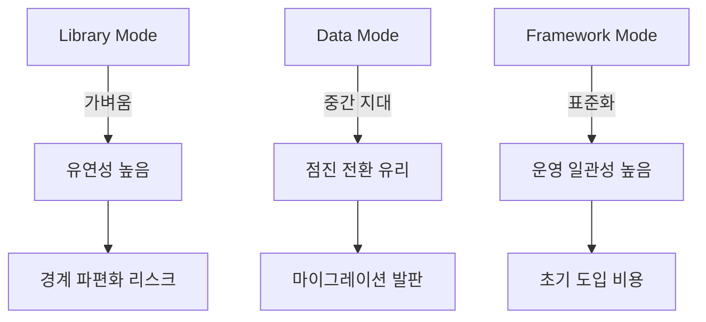

1편에서 "RSC 시대에도 Router 경계 설계는 더 중요해진다"는 점을 다뤘습니다.
이번 글에서는 그 다음 질문으로 들어갑니다.

> React Router v7은 실제로 RSC를 어떤 구조로 수용할까?

실무에서 가장 많이 생기는 혼란은 기능 자체보다 **모드 선택**에서 시작됩니다. React Router v7은 하나의 API가 아니라 Framework / Data / Library라는 서로 다른 운영 모델을 제공합니다. RSC 논의도 이 모드 구분 없이 이야기하면 거의 항상 결론이 틀어집니다.

---

## 먼저 결론: "RSC 지원"은 단일 스위치가 아니다

RSC를 지원한다는 문장은 보통 너무 뭉뚱그려져 있습니다.
실제로는 다음 질문을 분리해야 정확합니다.

1. 서버 렌더링 경로를 공식 런타임으로 가져가는가?
2. 라우트 모듈 단위로 서버/클라이언트 경계를 다룰 수 있는가?
3. 데이터 로딩/뮤테이션/재검증을 어떤 계층에서 표준화하는가?

React Router v7은 이 질문에 대해 **모드별로 다른 답**을 줍니다.

---

## 3가지 모드 다시 보기 (RSC 관점)

## 1) Framework Mode

가장 기능이 완성된 모드입니다.
라우팅, 데이터, 빌드, 타입 생성, SSR 경로를 하나의 운영 체계로 묶습니다.

RSC를 중심 주제로 본다면, 이 모드가 가장 자연스럽습니다.

- 라우트 모듈 기반 구조를 강하게 사용
- 서버/클라이언트 경계 설계가 명시적
- 개발/배포 파이프라인까지 묶여 운영 일관성 확보

단점은 분명합니다.
- 팀 규약을 맞춰야 하고
- 초기 도입 비용이 있습니다.

하지만 팀 규모가 커질수록(특히 20~30명+) 이 비용을 운영 안정성으로 회수하는 경우가 많습니다.

## 2) Data Mode

가장 실무 친화적인 중간지대입니다.
`createBrowserRouter` 중심의 데이터 라우팅을 쓰면서도, 전체 프레임워크 전환 부담은 줄일 수 있습니다.

RSC와의 관계를 현실적으로 보면:
- 기존 앱에 점진 도입이 유리
- loader/action/revalidation을 먼저 표준화하기 좋음
- 이후 Framework Mode로 넘어갈 발판이 됨

즉, "RSC를 당장 전면 도입은 어렵지만 경계 정리는 시작해야 한다"는 팀에 적합합니다.

## 3) Library Mode

가장 가볍고 유연합니다.
기존 컴포넌트 라우팅 흐름을 유지하면서 라우터 기능을 최소 단위로 가져갑니다.

RSC 관점에서는 제한이 분명합니다.
- 팀 공통 규약 없이 쓰면 경계가 파편화되기 쉬움
- 데이터/에러/로딩 정책이 코드베이스 전역에서 일관되기 어려움

소규모/단순 앱엔 좋지만, 조직 규모가 커질수록 운영 표준을 별도로 보완해야 합니다.

---

## 모드 선택을 위한 의사결정표

아래 표는 기술 성향이 아니라 운영 요구를 기준으로 보셔야 합니다.

- Framework Mode 추천
  - 팀 간 라우팅 계약이 중요함
  - SSR/RSC를 제품 핵심으로 밀 계획
  - 빌드/타입/런타임 표준화를 우선함

- Data Mode 추천
  - 기존 코드베이스를 크게 흔들기 어려움
  - loader/action 중심으로 먼저 데이터 경계부터 통일하고 싶음
  - 점진 마이그레이션이 중요함

- Library Mode 추천
  - 앱 규모가 작고 구조가 단순함
  - 라우팅 외 인프라는 이미 별도로 안정화되어 있음

---

## 우리 같은 MFE 전환 팀에선 어떻게 시작할까

MFE 전환 중인 조직에서 가장 많이 실패하는 패턴은 "모드 결정 없이 기능만 먼저 붙이는 것"입니다.

추천 순서는 다음이 더 안전합니다.

1. 먼저 Data Mode 사고방식으로 경계 문서화
   - 라우트별 데이터 소유권
   - 에러 경계
   - 재검증 규칙

2. 팀 합의가 올라오면 Framework Mode 요소를 순차 도입
   - 타입 생성
   - 라우트 모듈 관례
   - 배포 파이프라인 통합

3. Library Mode는 예외 케이스(단순 서브앱)로 제한

핵심은 "기술 도입"보다 "운영 모델 전환"입니다.

---

## 최소 비교 다이어그램

---

## 실무 체크리스트

- [ ] 우리 앱에서 라우트 경계 실패 사례를 3개 이상 설명할 수 있는가
- [ ] 팀 단위로 모드 선택 기준(기능/운영)을 문서화했는가
- [ ] Data Mode → Framework Mode 전환 시퀀스를 정의했는가
- [ ] MFE 예외 케이스에 Library Mode 사용 조건을 합의했는가

---

## 마무리

React Router v7의 RSC 지원은 "지원/미지원" 이분법이 아닙니다.
정확히는, 모드별로 다른 운영 모델을 제공하고 팀이 그 중 하나를 선택하는 구조입니다.

다음 글에서는 이 선택을 더 구체화해보겠습니다.

> Loader/Action과 RSC 데이터 흐름의 책임을 어떻게 분리해야, 중복 fetch와 캐시 충돌을 피할 수 있을까?
