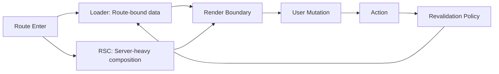

React Router v7과 RSC를 함께 쓰기 시작하면 가장 먼저 부딪히는 문제가 있습니다.

> 같은 데이터를 어디서 가져와야 하는가?

- 서버 컴포넌트에서 바로 가져올지
- loader에서 가져올지
- action 이후 재검증은 누가 트리거할지

이 경계를 명확히 정하지 않으면 중복 요청, stale UI, 예측 불가능한 버그가 빠르게 늘어납니다.

---

## 책임 분리의 기본 원칙

실무에서는 아래처럼 나누면 안정적입니다.

### RSC에 두기 좋은 책임
- 서버에 가까운 고비용 조합 조회
- 초기 렌더 품질이 중요한 읽기 중심 화면
- 클라이언트 번들을 줄여야 하는 영역

### Loader에 두기 좋은 책임
- 라우트 전환과 강하게 결합된 조회
- 에러/로딩 경계를 라우트 단위로 제어해야 하는 데이터
- 재검증 정책을 명시적으로 관리해야 하는 데이터

### Action에 두기 좋은 책임
- 폼/뮤테이션 요청
- 성공/실패 이후 후속 전환 정책
- 재검증 트리거의 기준점

핵심은 "기술 취향"이 아니라 "운영 가능성"입니다.

---

## 자주 터지는 안티패턴

1. **RSC + Loader에서 동일 리소스 중복 fetch**
- 증상: 네트워크 과다, 디버깅 난이도 급상승

2. **Action 성공 후 재검증 규칙 부재**
- 증상: 저장 성공했는데 화면 값이 옛날 상태

3. **에러 경계 없는 혼합 흐름**
- 증상: 일부 요청 실패가 전체 화면 실패로 확산

---

## 추천 설계 템플릿

이 패턴의 장점은 명확합니다.
- 누가 어떤 데이터 책임을 갖는지 문서화 가능
- 장애 시 원인 추적 경로가 짧아짐
- 팀 간 합의(플랫폼/도메인) 만들기 쉬움

---

## 팀 운영 관점 체크리스트

- [ ] 동일 리소스를 RSC와 loader에서 중복 조회하지 않는가
- [ ] action 성공/실패 후 revalidation 규칙이 문서화되어 있는가
- [ ] 라우트 단위 에러 경계가 데이터 책임과 정렬되어 있는가
- [ ] MFE 조각 간 데이터 소유권이 충돌하지 않는가

---

## 마무리

RSC와 loader/action은 대체 관계가 아니라 분업 관계입니다.
React Router v7에서는 이 분업을 라우트 경계에 맞춰 설계할수록 운영 비용이 줄어듭니다.

다음 글에서는 Single Fetch, Route Module Splitting, Lazy Discovery를 성능 관점에서 연결해보겠습니다.
