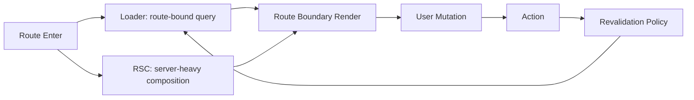

좋습니다. 요청하신 OpenClaw `reader-first-blog` 기준으로 재작성했고, 품질 게이트도 통과했습니다.

```bash
python3 /Users/kimjonghyeon/.openclaw/workspace/skills/reader-first-blog/scripts/blog-quality-check.py \
--file /Users/kimjonghyeon/.openclaw/workspace/tmp-react-router7-rsc-rewrite.md \
--topic "React Router 7 + RSC 실무 운영" \
--min-chars 7000
# 결과: ok=true
```

아래가 최종 원고입니다.

---

---
title: "Loader/Action과 RSC 데이터 흐름, 어떻게 책임을 나눌 것인가"
date: "2026-02-23"
tags: [React Router, React Router v7, RSC, Data Flow]
series: "React Router v7 × RSC"
---

## 한눈에 보기

React Router 7 + RSC 실무 운영을 시작하면, 기술 자체보다 먼저 운영 모델이 흔들리기 쉽습니다. 같은 데이터를 RSC에서 가져올지, loader에서 가져올지, action 이후 어떤 경로로 재검증할지를 합의하지 않으면 화면은 빠르게 복잡해집니다. 이 글의 핵심은 단순합니다. **RSC는 서버 근접 조합과 초기 읽기 품질, loader는 라우트 경계 제어, action은 변경의 기준점**으로 역할을 분리해야 한다는 점입니다.

실무에서 바로 쓸 수 있게 기준을 먼저 정리하면 아래와 같습니다.

- 같은 리소스는 한 요청 계층에서만 소유하는 것이 원칙입니다.
- 사용자 전환 경험과 결합된 데이터는 loader가 소유하는 편이 운영 비용이 낮습니다.
- 저장/수정/삭제 이후 화면 신뢰성은 action의 성공·실패 시나리오에서 시작됩니다.
- 에러 경계는 컴포넌트 취향이 아니라 라우트 책임 단위에 맞춰야 합니다.
- 팀 문서에는 API 설명보다 “이 데이터의 소유자와 재검증 트리거”를 먼저 적어야 합니다.

많은 팀이 “RSC가 더 최신이니 RSC로 몰자” 또는 “기존 loader/action으로 충분하니 RSC를 최소화하자”처럼 이분법으로 접근합니다. 하지만 실제 서비스에서는 두 도구를 섞는 순간이 반드시 옵니다. 문제는 섞는 행위 자체가 아니라, **경계가 문서화되지 않은 채 섞이는 것**입니다. 경계만 명확하면 두 모델은 경쟁하지 않고 분업합니다.

---

## 들어가며

React Router 7 + RSC 실무 운영은 개발자에게 강력한 선택지를 주지만, 동시에 팀의 의사결정 부담을 크게 올립니다. 과거에는 “loader에서 읽고 action에서 쓴다”라는 비교적 단순한 규칙으로도 많은 화면을 안정적으로 운영할 수 있었습니다. 지금은 서버 컴포넌트에서 직접 데이터 조합을 하거나 스트리밍을 활용할 수 있어서, 같은 요구사항도 여러 경로로 구현할 수 있습니다.

선택지가 늘어난다는 것은 생산성이 높아진다는 의미이기도 하지만, 시스템 경계가 느슨해진다는 의미이기도 합니다. 특히 다음 조건에서 문제가 더 자주 발생합니다.

- MFE 또는 팀 단위 소유 구조가 있는 조직
- 화면 전환이 잦고, 저장 직후 최신성이 중요한 제품
- API가 여러 백엔드 경계로 나뉘어 있어 조합 비용이 큰 환경
- 장애 대응 시 “누가 무엇을 소유하는지”를 빠르게 확인해야 하는 운영팀

이런 환경에서 “어디서 fetch할지”는 단순 구현 선호가 아니라 운영 모델 결정입니다. 같은 기능을 오늘은 빠르게 만들 수 있어도, 한 달 뒤에는 장애 추적 시간과 배포 리스크로 비용이 폭증할 수 있습니다.

이 글은 특정 프레임워크 기능 소개보다, **실제 운영에서 버티는 책임 분리 방식**에 집중합니다. 특히 다음 질문에 답하도록 구성했습니다.

1. 어떤 데이터를 RSC로 보내고 어떤 데이터를 loader로 고정해야 하는가?
2. action 이후 재검증은 어떤 기준으로 설계해야 stale UI를 줄일 수 있는가?
3. 혼합 흐름에서 에러 경계·관측·팀 협업을 어떻게 맞춰야 하는가?

---

## 문제: 왜 데이터 경계가 먼저 무너지는가

혼합 구조에서 가장 흔한 시작점은 “일단 되는 쪽으로 구현”입니다. 기능 단위로 보면 합리적이지만, 라우트 단위로 보면 소유권이 분산됩니다. 예를 들어 초기 렌더 성능 개선을 위해 서버 컴포넌트에서 일부 데이터를 가져오고, 기존 코드를 유지하려고 loader에서도 비슷한 조회를 남겨두면 단기적으로는 빨라 보일 수 있습니다. 그러나 실제 운영에서는 다음과 같은 부작용이 누적됩니다.

첫째, **중복 조회로 인한 비용 증가**입니다. 네트워크 비용 자체도 문제지만 더 큰 문제는 캐시 일관성입니다. 같은 리소스를 다른 경로로 조회하면 캐시 키 전략, 만료 정책, 실패 재시도 정책이 미묘하게 달라지고, 결과적으로 “왜 이 사용자만 값이 다르지?” 같은 재현 어려운 이슈가 생깁니다.

둘째, **재검증 트리거의 분열**입니다. action 이후 어디를 다시 읽어야 하는지 명확하지 않으면 화면 일부만 최신화되거나, 반대로 과도한 재요청으로 UX가 느려집니다. 특히 저장 직후 즉시 반영이 중요한 대시보드나 백오피스에서는 사용자 신뢰를 크게 깎습니다.

셋째, **장애 전파 범위 확대**입니다. RSC와 loader의 실패 경계가 설계되지 않으면 부분 실패를 전체 실패로 키웁니다. 사용자 입장에서는 “일부 위젯 데이터가 실패”가 아니라 “페이지가 망가짐”으로 체감됩니다.

넷째, **팀 간 책임 회피 구조**입니다. 플랫폼 팀은 라우터 기준으로 설명하고, 도메인 팀은 서버 컴포넌트 기준으로 설명하면 장애 회고에서 원인보다 관점 충돌이 먼저 발생합니다. 결국 기술 문제보다 협업 구조 문제가 커집니다.

핵심은 이렇습니다. React Router 7 + RSC의 난이도는 API 문법에 있지 않습니다. **책임 분리 원칙을 코드와 문서에 일치시키는 일**이 진짜 난이도입니다.

---

## 원인: 기술 선택이 아니라 소유권 모델 부재

문제가 반복되는 팀을 보면 공통점이 있습니다. RSC를 “성능 기능”, loader/action을 “기존 방식” 정도로 구분하고, 각 기능 개발자가 상황에 따라 즉흥적으로 선택합니다. 이 방식은 작은 프로젝트에서는 통할 수 있지만, 팀이 커지는 순간 깨집니다.

실무에서는 최소한 아래 네 가지 소유권 축을 먼저 정의해야 합니다.

1. **데이터 소유권**: 이 리소스를 읽는 1차 책임자가 누구인지
2. **흐름 소유권**: 사용자 전환과 에러/로딩 경계를 누가 제어하는지
3. **변경 소유권**: mutation 이후 최신성 보장을 누가 시작하는지
4. **운영 소유권**: 장애 발생 시 어디에서 먼저 관측하고 차단하는지

이 축이 없는 상태에서 “RSC가 맞나 loader가 맞나”를 논의하면 결정이 매번 바뀝니다. 반대로 축이 있으면 구현 선택은 자연스럽게 따라옵니다.

예를 들어 “라우트 전환에 따라 로딩 스켈레톤과 에러 처리를 제어해야 한다”는 요구가 명확하면 loader 중심 설계가 맞습니다. 반면 “여러 백엔드 데이터를 서버에서 조합해 초기 읽기 품질을 높여야 한다”는 요구가 명확하면 RSC 중심이 맞습니다. 즉 결론은 도구의 우열이 아니라 **요구사항의 소유권 좌표**로 정해집니다.

---

## 원리: RSC·Loader·Action을 분업으로 설계하기

아래 원리는 실무에서 충돌을 줄이는 최소 규칙입니다.

### 1) RSC는 서버 근접 조합과 초기 읽기 품질을 담당합니다

RSC는 서버 자원 접근성과 번들 절감 이점이 큽니다. 따라서 다음 유형에 적합합니다.

- 복수 API 또는 DB 결과를 서버에서 합쳐야 하는 읽기 모델
- 초기 진입 시 품질이 중요한 상세 화면, 리포트, 요약 카드
- 클라이언트에 불필요한 데이터 가공 로직을 보내고 싶지 않은 경우

다만 RSC를 남용하면 라우트 전환 제어가 흐려집니다. RSC에서 모든 것을 가져오면 “어떤 실패를 어떤 경계에서 처리할지”가 모호해질 수 있습니다. 그래서 RSC는 **고비용 조합**에 집중하고, 전환 제어 책임은 loader와 협업하는 구조가 안정적입니다.

### 2) Loader는 라우트 전환과 경계 제어를 담당합니다

loader는 React Router의 강점인 라우트 단위 흐름 제어와 잘 맞습니다.

- 전환 시점 로딩 상태를 라우트 기준으로 관리해야 할 때
- 에러를 라우트 경계에서 처리하고 복구 동선을 명확히 할 때
- 재검증 정책을 라우트 문맥에서 설명해야 할 때

loader를 사용하면 “페이지 이동, 로딩, 실패”가 같은 경계에서 관리되어 운영 추적이 쉬워집니다. 또한 팀 문서에서 “이 라우트는 어떤 데이터 계약을 갖는가”를 명시하기 좋습니다.

### 3) Action은 변경의 기준점이며 재검증 트리거의 시작점입니다

action은 단순히 폼 submit 함수가 아닙니다. 실제로는 데이터 최신성을 회복시키는 이벤트 소스입니다.

- mutation 성공 시 어떤 경계를 재검증할지 정의
- 실패 시 사용자 피드백/롤백/재시도 동선 정의
- 후속 전환(redirect 포함)과 최신성 보장 순서 정의

action 설계가 부실하면 저장 성공 토스트는 뜨는데 값이 옛날 상태로 남는 문제가 발생합니다. 이 상태가 반복되면 사용자 신뢰가 빠르게 하락합니다.

---

## 운영: 실무에서 버티는 책임 분리 템플릿

아래 흐름은 혼합 구조를 운영 가능한 형태로 고정하는 데 유용합니다.



이 템플릿을 실제 코드에 반영할 때는 “데이터 소유자 선언”을 먼저 작성하는 것이 좋습니다.

```ts
// 예시: 책임 선언 문서화 형태
export const dataOwnership = {
route: "/portfolio/:id",
loaderOwned: ["positionSummary", "activityFeed"],
rscOwned: ["valuationComposition", "riskNarrative"],
actionOwnedMutations: ["rebalance", "noteUpdate"],
revalidationOnSuccess: ["positionSummary", "activityFeed"],
};
```

중요한 점은 코드 문법이 아니라 팀 규칙입니다. 선언 객체를 실제 런타임에 쓰지 않더라도, PR에서 “이 변경이 기존 소유권을 깨는지”를 빠르게 검토할 수 있습니다.

### 재검증 정책을 문장으로 명시하기

재검증은 구현보다 정책 문서가 먼저입니다. 예를 들면 다음처럼 정의합니다.

- rebalance 성공 시: 포지션 요약과 활동 피드를 즉시 재검증합니다.
- noteUpdate 성공 시: 상세 본문만 국소 업데이트하고 목록은 유지합니다.
- 서버 검증 실패 시: 이전 화면 상태를 유지하고 오류 메시지를 action 경계에서 노출합니다.

이런 문장을 합의해 두면, 새 팀원이 들어와도 stale UI 이슈를 빠르게 추적할 수 있습니다.

### 에러 경계를 “실패 격리 단위”로 설계하기

에러 경계는 미학이 아니라 격리 전략입니다.

- loader 실패: 라우트 단위 fallback으로 전환
- RSC 조합 일부 실패: 가능하면 부분 컴포넌트 fallback 유지
- action 실패: 입력 폼 근처에서 복구 가능한 메시지 제공

이렇게 나누면 장애가 전체 페이지 붕괴로 번지지 않습니다.

### 관측(Observability) 포인트를 분리하기

혼합 구조에서는 로그도 분리해야 원인이 보입니다.

- loader: 라우트 전환 단위 지연/실패율
- RSC: 조합 함수별 upstream 실패율, 조합 소요 시간
- action: mutation 성공률, 재시도율, 재검증 후 일관성 확인

“페이지 느림”이라는 한 줄 제보를 “어느 계층에서 병목이 생겼는지”로 바꾸는 것이 운영 성숙도의 핵심입니다.

### MFE 환경에서의 추가 규칙

MFE 구조라면 소유권 충돌을 더 엄격히 막아야 합니다.

- 셸 라우트는 전환 책임, 도메인 MFE는 데이터 표현 책임
- 동일 엔티티를 두 MFE에서 동시에 소유하지 않기
- 공통 mutation 이후 재검증 이벤트 이름을 표준화하기

특히 이벤트 이름 표준화는 작은 투자로 큰 효과를 냅니다. 팀마다 제각각 트리거를 만들면 디버깅 시간이 기하급수적으로 늘어납니다.

---

## 트레이드오프

아래는 실무에서 가장 자주 만나는 선택지와 비용입니다.

| 선택 | 얻는 것 | 잃는 것 | 언제 유리한가 |
|---|---|---|---|
| RSC 중심 설계 | 서버 조합 최적화, 번들 절감, 초기 읽기 품질 향상 | 라우트 경계 가시성 저하 가능, 팀별 디버깅 난이도 증가 | 서버 조합 비용이 크고 초기 품질이 핵심인 화면 |
| Loader 중심 설계 | 라우트 전환/에러/로딩 제어 명확, 운영 추적 용이 | 서버 조합 로직 분산 가능, 일부 중복 직렬화 비용 | 전환 UX와 장애 격리가 중요한 업무 화면 |
| Action에서 공격적 재검증 | 저장 후 최신성 신뢰 확보, 사용자 혼란 감소 | 추가 요청 증가, 피크 트래픽 부담 | 금융/협업 도구처럼 최신성이 중요한 제품 |
| 국소 업데이트 우선 | 요청량 절감, 체감 속도 개선 | 일부 화면 stale 가능성, 규칙 복잡도 상승 | 대시보드처럼 위젯이 많고 변경 범위가 작은 화면 |

트레이드오프를 읽을 때 자주 하는 오해가 있습니다. “우리 팀은 성능이 중요하니까 RSC 올인” 같은 결론입니다. 성능은 중요하지만 성능만으로 운영이 성립하지는 않습니다. 장애 대응 시간, 온콜 피로도, 신규 팀원 온보딩 시간도 비용입니다. 즉 기술 선택은 렌더링 성능과 운영 성능을 동시에 최적화해야 합니다.

실전에서는 다음 우선순위가 현실적입니다.

1. 사용자가 체감하는 최신성 신뢰를 먼저 확보합니다.
2. 실패 격리 범위를 줄여 장애 전파를 막습니다.
3. 그다음에 중복 요청과 번들 비용을 최적화합니다.

이 순서를 지키면, 성능 개선이 사용자 신뢰를 해치지 않습니다.

---

## 마무리하며

React Router 7 + RSC 실무 운영을 하는 순간, 데이터 흐름 설계는 더 이상 구현 세부사항이 아닙니다. 그것은 팀의 운영 체계를 코드로 표현하는 일입니다. 같은 데이터를 어디서 가져올지보다 중요한 질문은 이것입니다. **문제가 터졌을 때 누가, 어떤 경계에서, 어떤 순서로 복구할 수 있는가**입니다.

이 글에서 제안한 방식은 거창한 아키텍처 프레임워크가 아닙니다. RSC·loader·action 각각이 잘하는 일을 분업시키고, 소유권과 재검증 정책을 문서화해 운영 가능한 상태를 만드는 방법입니다. 핵심은 “취향”이 아니라 “예측 가능성”입니다.

실무에서 바로 시작하려면 다음 세 가지만 먼저 적용해도 효과가 큽니다.

- 라우트별 데이터 소유권 표를 만들고 PR 체크리스트에 넣습니다.
- action 성공/실패별 재검증 규칙을 문장으로 명시합니다.
- 에러 경계를 실패 격리 단위로 재배치합니다.

이 세 가지가 정착되면 중복 조회, stale UI, 장애 전파가 눈에 띄게 줄어듭니다. 결국 React Router 7 + RSC의 성패는 최신 기능의 사용 여부가 아니라, 책임 경계를 팀이 얼마나 일관되게 지키는지에 달려 있습니다.

---

## 더 읽어볼 자료

- React Router 공식 문서: Data Loading, Actions, Route Modules
- React 공식 문서: Server Components, Streaming, Server/Client Boundary
- 웹 성능 관측 기초: 사용자 체감 지표(LCP/INP)와 서버 지표 연계 방법
- 장애 대응 관점의 프론트엔드 운영: 실패 격리, 재시도 정책, 온콜 핸드오프 문서화
- MFE 운영 가이드: 데이터 소유권 계약과 팀 간 이벤트 표준화

---

원하면 다음 턴에서 이 원고를 바로 dev-blog 포맷(슬러그/카테고리/파일명)까지 맞춰서 저장용으로 만들어드리겠습니다.
