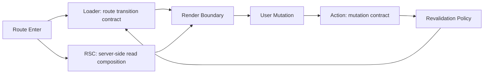

## 한눈에 보기

React Router 7 + RSC 실무 운영의 핵심 난제는 기능 구현이 아니라 **운영 가능한 책임 경계 설계**입니다. 같은 데이터를 RSC, loader, client fetch에 동시에 걸치기 시작하면 초기 속도는 좋아 보여도, 곧 stale UI·재검증 누락·장애 전파로 되돌아옵니다.
결론은 단순합니다. **RSC는 서버 근접 읽기 조합, loader는 라우트 전환 경계, action은 변경 이후 신뢰 회복의 시작점**으로 분리해야 합니다.

이 분리를 코드 레벨에서 끝내면 다시 흔들립니다. 실무에서는 반드시 문서·관측·배포 규칙까지 포함해 운영 모델로 고정해야 합니다. React Router 7 + RSC 실무 운영이 어려운 이유도 여기 있습니다. 기술이 복잡해서가 아니라, 팀의 의사결정과 장애 대응 체계를 함께 바꿔야 하기 때문입니다.

---

## 들어가며: React Router 7 + RSC 실무 운영이 “기능”보다 “운영” 문제인 이유

React Router 7 + RSC 실무 운영을 도입하는 팀은 대개 같은 기대를 갖습니다.
“초기 렌더를 빠르게 만들고, 서버 조합으로 클라이언트 부담을 줄이며, 라우트 단위 흐름 제어까지 깔끔하게 가져가자.”

이 기대 자체는 맞습니다. 문제는 도입 2~4주 이후에 발생합니다.

- 어떤 화면은 RSC에서 데이터를 읽고,
- 어떤 화면은 loader에서 읽고,
- 일부는 기존 client query를 유지한 채,
- mutation 이후 재검증 트리거는 팀마다 다르게 적용됩니다.

그 순간부터 화면 품질은 “가끔 맞고 가끔 틀린” 상태로 바뀝니다. 사용자는 이를 성능 문제로 체감하지 않습니다. 신뢰 문제로 체감합니다.
저장 성공 알림은 떴는데 값이 이전 상태로 남아 있거나, 라우트 이동 후 일부 위젯만 갱신되지 않거나, 에러가 부분 실패가 아니라 페이지 전체 붕괴로 보이면 사용자 입장에서는 기술 스택이 아니라 제품 완성도가 낮다고 판단합니다.

그래서 React Router 7 + RSC 실무 운영의 첫 질문은 “어디서 fetch할까?”가 아닙니다.
**“누가 이 데이터의 진실한 소유자인가, 변경 이후 누가 신뢰를 회복시키는가”**가 첫 질문이어야 합니다.

---

## 왜 경계가 먼저 무너지는가: 선택지가 늘어날수록 소유권은 흐려집니다

React Router 7 + RSC 조합은 선택지를 크게 늘립니다.
선택지는 생산성을 올리지만, 동시에 규칙 없는 팀에서는 책임을 분산시킵니다.

### 1) 단기 최적화가 장기 운영 비용으로 전환됩니다

실무에서 자주 보는 패턴은 다음과 같습니다.

- 초기 TTFB 개선을 위해 RSC에서 읽기 조합 추가
- 기존 라우트 로직 보존을 위해 loader 유지
- mutation 이후 UI 즉시 반영을 위해 client-side optimistic patch 추가

개별 결정은 각각 타당해 보입니다. 하지만 세 경로가 같은 엔티티를 공유하는 순간, 팀은 “어떤 경로가 canonical source인가”를 잃습니다.
이때부터 버그는 기능 버그가 아니라 **경계 버그**가 됩니다.

### 2) 재검증 규칙이 코드에 숨어 문서에서 사라집니다

“저장 후 뭐가 갱신돼야 하는가?”는 제품 요구사항입니다.
그런데 많은 팀이 이를 implementation detail로 밀어 넣습니다. action 성공 후 `revalidate`를 어디서 호출할지, 어떤 loader를 다시 태울지, 어떤 RSC read를 재실행할지 코드에만 남습니다. 결과적으로 신규 팀원이 합류하면 코드 탐색 전에는 규칙을 알 수 없습니다. 운영 지식이 암묵지화됩니다.

### 3) 장애 시 관측 단위가 사용자 시나리오와 분리됩니다

대부분의 로그 체계는 계층 중심입니다.

- 서버 로그는 endpoint 기준
- 프론트 로그는 라우트 기준
- action 실패는 이벤트 기준

사용자는 “포트폴리오 저장 후 목록이 안 바뀐다”를 보고하지만, 관측은 세 계층으로 쪼개져 있어 원인 추적이 길어집니다.
React Router 7 + RSC 실무 운영에서 진짜 비용은 렌더링이 아니라 이 추적 시간입니다.

---

## 원리: React Router 7 + RSC 실무 운영의 책임 모델

아래 모델은 도구의 우열을 가르는 모델이 아닙니다.
**운영 관점에서 충돌을 줄이기 위한 책임 계약**입니다.

## 1) RSC: 서버 근접 읽기 조합의 소유자

RSC는 다음에 강합니다.

- 여러 upstream(API/DB/BFF) 결과를 서버에서 조합해야 할 때
- 클라이언트로 보내면 불필요한 가공 비용이 큰 읽기 모델
- 초기 진입 품질(“첫 인상”)이 중요한 화면

RSC를 “모든 읽기의 기본값”으로 삼으면 오히려 경계가 흐려집니다.
RSC는 **고비용 읽기 조합**에 집중할 때 가장 효과적입니다.

## 2) loader: 라우트 전환·에러·로딩 경계의 소유자

loader는 React Router가 가장 잘하는 영역입니다.

- 라우트 전환 시점 제어
- 라우트 단위 에러 처리
- 네비게이션 문맥에서의 재검증 정책

실무에서 loader를 유지해야 하는 이유는 기술 보수성이 아닙니다.
**운영 가시성** 때문입니다. “이 라우트는 어떤 데이터 계약을 갖는가”를 설명하기 가장 좋은 단위가 loader입니다.

## 3) action: 변경 이후 신뢰 회복의 소유자

action은 단순 submit 핸들러가 아닙니다.
제품 신뢰를 회복하는 출발점입니다.

- 무엇이 성공으로 간주되는지
- 성공 후 무엇을 재검증해야 하는지
- 실패 시 사용자가 어디서 복구할 수 있는지

이 3가지를 action에서 명시하지 않으면, UI는 점점 “성공처럼 보이는 실패”를 축적합니다.

---

## 역사와 원칙: 왜 이 분리가 지금도 유효한가

React Router 7 + RSC는 최신 조합이지만, 기반 철학은 오래된 원칙 위에 있습니다.

- **Separation of Concerns**: Dijkstra 이후 계속 반복된 원칙입니다.
실무에서의 번역은 “읽기 조합, 전환 제어, 변경 트리거를 같은 계층에 몰아넣지 않는다”입니다.
- **단일 책임의 실무 해석**: 컴포넌트가 아니라 운영 단위에서의 단일 책임이 중요합니다.
즉, “오류가 났을 때 누가 복구를 시작하느냐”가 책임 분리의 기준입니다.
- **증분 최적화의 역사**: 빌드/캐시/요청 최적화는 항상 있었지만, 성공한 시스템의 공통점은 최적화 전에 경계를 먼저 고정했다는 점입니다.

결국 React Router 7 + RSC 실무 운영은 새 개념을 배우는 일이 아니라, 오래된 원칙을 새로운 런타임 제약에서 다시 적용하는 일입니다.

---

## 데이터 흐름 설계: 문제 → 원인 → 해결 구조로 고정하기

혼합 구조를 운영 가능하게 만드는 실무 패턴은 “정답 기술”이 아니라 “정답 순서”입니다.

1. 문제를 사용자 시나리오로 정의합니다.
2. 원인을 책임 충돌로 환원합니다.
3. 해결은 계층별 소유권 계약으로 명시합니다.
4. 마지막에 구현 세부(훅/유틸/캐시)를 붙입니다.

아래처럼 템플릿을 고정하면 의사결정 비용이 크게 줄어듭니다.

핵심은 화살표가 아니라 계약 문장입니다.
“어떤 실패가 어느 경계에서 처리되는가”가 문장으로 없으면, 다이어그램은 장식이 됩니다.

---

## 실무 운영 규칙: 팀이 흔들리지 않게 만드는 최소 합의

React Router 7 + RSC 실무 운영에서 가장 효과가 컸던 규칙은 화려하지 않습니다.

### 규칙 1) 엔티티별 단일 읽기 소유자를 선언합니다

같은 리소스를 RSC와 loader가 동시에 소유하지 않습니다.
불가피하게 중복이 필요하면, 한쪽을 파생 데이터로 명시합니다.

### 규칙 2) action별 재검증 정책을 문장으로 고정합니다

예:
- `rebalance` 성공 시 `positionSummary`, `activityFeed` 재검증
- `memoUpdate` 성공 시 상세 패널만 국소 갱신, 목록은 유지
- 검증 실패 시 optimistic state 폐기 후 action 경계에서 복구 안내

문장 합의가 있으면 코드 리뷰가 빨라집니다. 없으면 리뷰가 취향 싸움이 됩니다.

### 규칙 3) 에러 경계를 “복구 가능 단위”로 설계합니다

- loader 실패: 라우트 fallback + 재시도 동선
- RSC 조합 일부 실패: 부분 컴포넌트 fallback 유지
- action 실패: 입력 맥락 근처에서 복구 가능해야 함

실패를 한 화면으로 뭉개지 않으면 온콜 피로도가 내려갑니다.

### 규칙 4) 관측 지표를 계층이 아니라 시나리오로 묶습니다

예: “저장 후 3초 내 최신값 반영률” 같은 지표를 둡니다.
이 지표는 loader/RSC/action 로그를 함께 보게 만듭니다.
계층별 최적화보다 사용자 신뢰를 먼저 보게 하는 장치입니다.

---

## AI/자동화 관점: 어디까지 자동화하고, 어디서 멈춰야 하는가

React Router 7 + RSC 실무 운영에는 자동화 여지가 분명히 있습니다. 다만 경계를 잘못 잡으면 자동화가 부채를 증폭합니다.

자동화에 적합한 영역:

- 라우트 계약 스캐폴딩 생성(소유자 선언 템플릿)
- action별 재검증 정책 누락 탐지(lint-like check)
- PR에서 데이터 소유권 변경 감지(diff-based rule)
- 운영 문서와 코드 간 불일치 리포트

자동화에 부적합한 영역:

- 도메인별 최신성 우선순위 판단
- 실패 시 사용자 복구 UX 결정
- 팀 간 책임 협상(조직 설계 문제)

즉 AI/툴은 “규칙을 강제”하는 데 강하고, “규칙을 정의”하는 데는 제한적입니다.
React Router 7 + RSC 실무 운영에서 자동화는 결정권자가 아니라 **일관성 집행자**로 배치할 때 효과가 큽니다.

---

## 네트워크/성능 관점: 빠름의 정의를 다시 세워야 합니다

혼합 구조에서 성능은 평균 응답시간 하나로 설명되지 않습니다.

- 초기 진입: RSC 조합이 유리할 수 있음
- 전환/상호작용: loader 경계 제어가 체감 품질을 좌우
- 변경 이후: action 재검증이 신뢰 지연을 결정

그래서 “RSC로 빨라졌다”는 진술은 절반만 맞습니다.
실무 운영에서 중요한 것은 **사용자가 믿는 속도**입니다. 즉,

1. 첫 화면이 빨리 보이는가
2. 이동할 때 흐름이 끊기지 않는가
3. 저장 후 결과가 즉시 일치하는가

이 세 가지를 동시에 만족해야 빠르다고 느낍니다. 하나라도 깨지면 제품은 느리게 평가됩니다.

---

## 빌드/배포 관점: 런타임 경계와 릴리스 경계를 맞춰야 합니다

React Router 7 + RSC 실무 운영에서는 코드 구조와 배포 구조가 불일치할 때 사고가 큽니다.

- RSC 계약은 바뀌었는데 loader 재검증 규칙이 이전 릴리스에 남아 있는 경우
- action 응답 스키마가 바뀌었는데 일부 MFE가 구버전 로직을 사용하는 경우
- 팀별 배포 주기가 달라 경계 계약이 순간적으로 깨지는 경우

이 문제를 줄이는 방법은 단순합니다.

- 데이터 계약 버전 명시
- action 결과 스키마의 하위 호환 기간 운영
- 소유권 변경 PR에 릴리스 체크리스트 강제

즉 React Router 7 + RSC 실무 운영은 프론트 기술 선택이면서 동시에 플랫폼 운영 문제입니다.

---

## 트레이드오프: 무엇을 얻고 무엇을 감수하는가

| 선택 | 얻는 것 | 감수할 것 | 적합한 상황 |
|---|---|---|---|
| RSC 비중 확대 | 서버 조합 효율, 초기 읽기 품질 개선 | 경계 가시성 저하 위험, 팀 간 디버깅 난이도 상승 | 조합 비용이 크고 첫 진입 품질이 핵심일 때 |
| loader 비중 확대 | 전환/에러/로딩 경계 명확, 운영 추적 용이 | 조합 로직 분산 가능성, 직렬화 부담 | 업무형 화면, 장애 격리 우선일 때 |
| action 재검증 강화 | 저장 후 신뢰성 향상, 사용자 혼란 감소 | 요청량 증가, 피크 비용 상승 | 금융·협업·백오피스처럼 최신성이 중요한 도메인 |
| 국소 업데이트 우선 | 체감 속도 향상, 트래픽 절감 | stale 가능성 관리 필요, 규칙 복잡도 증가 | 위젯이 많고 변경 범위가 작을 때 |

중요한 점은 “어느 전략이 더 현대적인가”가 아닙니다.
**우리 제품에서 실패 비용이 어디에 큰가**가 기준입니다.
대부분의 실무 서비스에서 실패 비용은 평균 latency보다 “잘못된 상태 노출”에서 더 크게 발생합니다.

---

## 바로 적용할 수 있는 운영 체크리스트

React Router 7 + RSC 실무 운영을 당장 개선하려면, 아래 세트만 먼저 적용해도 충분합니다.

- 라우트별 데이터 소유권 표를 만듭니다.
- action 성공/실패 재검증 규칙을 문장으로 씁니다.
- 에러 경계를 복구 단위로 재배치합니다.
- PR 템플릿에 “소유권 변화 여부” 항목을 추가합니다.
- 사용자 시나리오 기준 관측 지표(저장 후 반영률 등)를 하나라도 만듭니다.

이 다섯 가지는 새 도구 없이도 시작할 수 있고, 대부분 1~2스프린트 내 체감 효과가 납니다.

---

## 마무리하며

React Router 7 + RSC 실무 운영의 성패는 최신 기능을 얼마나 많이 쓰는지가 아니라, **책임 경계를 얼마나 예측 가능하게 유지하느냐**에 달려 있습니다.
RSC, loader, action은 경쟁 관계가 아닙니다. 서로 다른 실패 모드를 다루는 분업 구조입니다.

- RSC는 서버 근접 읽기 조합으로 초기 품질을 높이고,
- loader는 라우트 전환과 오류 경계를 안정화하며,
- action은 변경 이후 신뢰를 회복합니다.

이 분업이 문서, 관측, 릴리스 규칙까지 연결될 때 비로소 “실무 운영”이 됩니다.
결국 React Router 7 + RSC 실무 운영은 프레임워크 학습의 문제가 아니라, 팀 운영 체계를 코드와 동기화하는 문제입니다. 이 동기화만 성공하면 기능 개발 속도와 운영 안정성은 함께 올라갑니다.

---

## 더 읽어볼 자료

- React Router 공식 문서: Data Loading, Actions, Route Modules
- React 공식 문서: Server Components, Server/Client Boundary, Streaming
- 웹 성능 관측: LCP/INP와 서버 지표를 사용자 시나리오로 연결하는 방법
- 프론트엔드 장애 대응: 실패 격리, 재시도 정책, 복구 동선 설계
- MFE 운영 가이드: 데이터 소유권 계약, 이벤트 표준화, 릴리스 호환 전략
