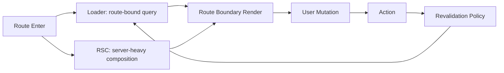

React Router v7과 React Server Components(RSC)를 함께 도입할 때, 팀이 가장 먼저 부딪히는 문제는 기능 부족이 아닙니다. 거의 항상 **책임 경계가 흐려지는 문제**입니다.

초기에는 이렇게 시작합니다.

- 읽기 데이터는 RSC에서 가져오면 되겠지
- 라우트 전환 데이터는 loader가 하던 대로 처리하자
- 폼 제출은 action으로 두자

문제는 여기서 끝나지 않습니다. 몇 주가 지나면 동일한 리소스가 여러 경로에서 조회되고, action 이후 어떤 데이터를 언제 재검증해야 하는지 합의가 깨지고, 장애가 나면 "누가 고쳐야 하는지"부터 길어집니다. 사용자 입장에서는 더 단순합니다. 저장했는데 화면이 안 바뀌거나, 전환할 때 로딩이 깜빡이거나, 가끔 새로고침해야 정상 동작합니다.

이 글의 목적은 하나입니다.

> React Router v7 기준으로, loader/action과 RSC를 **대체 관계가 아닌 분업 관계**로 설계하는 기준을 제시하는 것.

---

## 왜 이 문제가 v7 + RSC 조합에서 더 커지는가

v6 시절에는 상대적으로 데이터 흐름의 중심이 loader/action에 더 모여 있었습니다. 반면 RSC를 도입하면 서버 컴포넌트가 직접 데이터를 가져오는 경로가 자연스럽게 생깁니다. 이건 장점입니다. 서버에 가까운 곳에서 데이터 조합을 하고, 클라이언트 번들을 줄일 수 있으니까요.

하지만 운영 관점에서는 데이터 경로가 늘어난다는 뜻이기도 합니다.

- 경로 A: 라우트 전환 중심 조회 (loader)
- 경로 B: 서버 컴포넌트 조합 조회 (RSC)
- 경로 C: 뮤테이션/폼 처리 (action)
- 경로 D: 백그라운드 상호작용(fetcher 계열)

경로가 늘어나면 성능 최적화 여지는 커지지만, 책임 분리가 없으면 복잡도가 폭발합니다. 특히 팀 규모가 크고(MFE 전환, 다수 팀 동시 개발) 배포 주기가 빠른 조직일수록 더 빨리 문제가 드러납니다.

---

## 기본 원칙: "데이터 위치"보다 "전환 책임"으로 나눈다

많은 팀이 "어디서 fetch할까"로 시작합니다. 더 안정적인 질문은 이겁니다.

1. 이 데이터는 라우트 전환과 강하게 결합돼 있는가?
2. 실패했을 때 라우트 경계에서 복구해야 하는가?
3. 뮤테이션 이후 재검증 기준을 Router가 잡아야 하는가?

이 질문에 "예"가 많을수록 loader/action 쪽으로 두는 게 낫습니다. 반대로 다음 조건이면 RSC 쪽이 유리합니다.

- 서버 리소스 조합 비용이 크고
- 초기 렌더 품질에 직접 영향이 크며
- 라우트 전환 제어보다 서버 계산 최적화가 우선일 때

즉, 분기 기준은 기술 취향이 아니라 **실패 반경과 운영 가능성**입니다.

---

## 책임 분리 가이드 (실무 버전)

### RSC에 두기 좋은 책임

- 여러 내부 API/DB를 조합하는 고비용 조회
- SEO/초기 페인트 품질에 영향이 큰 읽기 화면
- 클라이언트로 내려보내는 JS를 줄여야 하는 영역

### Loader에 두기 좋은 책임

- URL/라우트 파라미터 변화에 즉시 반응해야 하는 조회
- 라우트 단위 로딩/에러 경계가 중요한 데이터
- action 이후 재검증 규칙을 명확히 관리해야 하는 데이터

### Action에 두기 좋은 책임

- 사용자 의도(폼 제출, 변경 요청)를 서버에 반영하는 쓰기 작업
- 성공/실패 후 전환 정책(redirect, remain, retry)
- invalidate/revalidate 트리거의 기준점

핵심은 이 세 레이어가 서로의 일을 대신하지 않도록 하는 것입니다.

---

## 흔한 실패 패턴 1: 중복 fetch

가장 자주 보는 문제입니다.

- RSC가 `product/:id`를 조회
- 같은 라우트 loader도 `product/:id`를 조회
- action 이후 둘 다 암묵적으로 갱신될 것이라 기대

결과:

- 요청 수 증가
- stale 타이밍 불일치
- 캐시 정책 충돌
- 장애 시 원인 추적 난이도 상승

해결 원칙:

- 리소스별 소유 경로를 문서화합니다. (예: Product 상세 읽기 소유자는 RSC, 가격/재고 단건 갱신 반영은 loader 재검증 경로)
- PR 리뷰에서 "동일 리소스 중복 조회"를 체크리스트로 강제합니다.

---

## 흔한 실패 패턴 2: action 성공 후 재검증 부재

UI 버그 보고의 절반은 여기서 시작합니다.

- 저장 API는 성공
- toast도 성공
- 그런데 리스트/상세 화면 값은 이전 상태

개발자는 "가끔 갱신 안 된다"고 느끼고, 사용자는 "저장됐는지 모르겠다"고 느낍니다.

해결은 단순하지만 명시적이어야 합니다.

1. action 성공 시 어떤 라우트 데이터가 stale인지 선언
2. 그 stale 집합에 대해 재검증 정책 적용
3. 실패 시 fallback UX(재시도/복구) 정의

이 과정을 문서화하지 않으면 팀마다 다르게 구현하고, 결국 버그는 랜덤하게 재현됩니다.

---

## 흔한 실패 패턴 3: 에러 경계 미정렬

RSC/loader/action이 섞인 상태에서 에러 경계를 라우트 책임과 맞추지 않으면, 작은 실패가 전체 실패로 번집니다.

- 하위 섹션 API 실패 → 전체 페이지 다운
- 반대로 전체 컨텍스트 문제인데 부분 에러로 숨겨져 진짜 원인 파악 실패

권장 방식:

- "데이터 소유 경계"와 "에러 경계"를 같은 단위로 맞춥니다.
- 즉, 소유권이 있는 팀이 에러 fallback까지 소유합니다.

---

## 권장 아키텍처 패턴

이 패턴의 장점은 기술보다 운영에 있습니다.

- 장애 시 추적 경로가 짧아짐
- 소유권이 명확해 코드 리뷰 품질 상승
- 신규 팀원 온보딩 속도 개선

---

## 팀 운영 모델로 연결하기 (30인/MFE 기준)

기술적 정답만으로는 유지되지 않습니다. 운영 룰이 필요합니다.

### 1) 소유권 명세서

리소스마다 아래를 한 줄로 고정합니다.

- Read owner: RSC / Loader / 둘 중 하나
- Write owner: Action
- Revalidation owner: Router policy
- Fallback owner: 해당 도메인 팀

### 2) 리뷰 체크리스트

PR에서 반드시 확인:

- 동일 리소스 중복 조회 여부
- action 이후 stale 정의 여부
- 경계 실패 시 사용자 복구 경로 존재 여부

### 3) 관측성(Observability)

로그에 최소한 아래를 남겨야 합니다.

- route id
- data source path (RSC/loader/action)
- revalidation trigger reason
- failure boundary id

이 데이터가 없으면 운영 중 문제를 "감"으로 추측하게 됩니다.

---

## 마이그레이션 시 적용 순서

v6/Remix에서 v7 + RSC로 가는 팀이라면, 아래 순서가 안전합니다.

1. 기존 loader/action 흐름을 인벤토리화
2. 중복 조회 구간 식별
3. 읽기 전용·고비용 조합 화면부터 RSC로 이동
4. action 재검증 정책을 명시적으로 고정
5. 라우트 경계별 에러/로딩 fallback 검증

핵심은 한 번에 옮기지 않는 것입니다. 경계 단위 점진 전환이 장애 비용을 가장 낮춥니다.

---

## 실무 체크리스트

- [ ] 동일 리소스를 RSC와 loader에서 중복 조회하지 않는가
- [ ] action 성공/실패 후 revalidation 규칙이 문서화되어 있는가
- [ ] 라우트별 에러 경계가 데이터 소유권과 정렬되어 있는가
- [ ] 관측성 로그에 route/source/revalidation reason이 남는가
- [ ] MFE 팀 간 계약 문서가 PR 기준으로 강제되는가

---

## 결론

RSC와 loader/action은 경쟁 관계가 아닙니다. 역할이 다릅니다.

- RSC는 서버 계산과 전달 효율을 높이는 경로
- loader/action은 라우트 전환과 재검증을 운영 가능한 규칙으로 만드는 경로

React Router v7에서 중요한 건 기능 선택보다 **경계 설계**입니다.
책임 분리를 먼저 고정하면 성능 최적화도, 마이그레이션도, 장애 대응도 모두 쉬워집니다.

다음 글에서는 이 경계를 성능 관점으로 확장해, Single Fetch · Route Module Splitting · Lazy Discovery를 하나의 파이프라인으로 연결해 보겠습니다.
