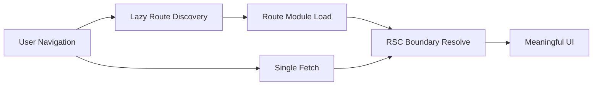

## 한눈에 보기

React Router 7 + RSC 실무 운영에서 성능은 보통 단일 옵션으로 해결되지 않습니다. 실무에서 체감 성능을 좌우하는 축은 세 가지입니다. 첫째는 라우트 전환 시 데이터 왕복을 줄이는 Single Fetch, 둘째는 실행 코드 경계를 라우트 단위로 분리하는 Route Module Splitting, 셋째는 라우트 정보를 필요한 시점까지 미루는 Lazy Route Discovery입니다.

핵심은 세 기능을 독립 체크박스로 다루지 않는 것입니다. 요청 수를 줄였는데도 느린 이유는 코드 청크가 비대하기 때문일 수 있고, 청크를 잘 쪼갰는데도 전환이 버벅이는 이유는 라우트 발견 시점이 늦거나 데이터 병합 비용이 몰렸기 때문일 수 있습니다. 반대로 초기 진입만 빠르게 만들어도, 실제 사용 구간의 전환이 불안정하면 전체 서비스 평가는 낮아집니다.

운영 관점에서 가장 중요한 질문은 단순합니다. “이 전환에서 어떤 요청이 발생했고, 어떤 코드가 로드됐고, 그 시점에 사용자는 무엇을 봤는가”입니다. React Router 7 + RSC 실무 운영의 성패는 이 질문에 로그로 답할 수 있느냐에서 갈립니다. 이 글은 세 축을 하나의 전환 파이프라인으로 묶어 설계하고, 회귀를 감지하고, 운영 지표까지 연결하는 방법을 다룹니다.

---

## 들어가며

React Router 7과 RSC 조합은 프런트엔드 아키텍처를 한 단계 정교하게 만듭니다. 서버와 클라이언트의 책임 경계를 더 명확히 나눌 수 있고, 데이터 로딩 전략과 UI 전개 전략을 전환 단위로 설계할 수 있기 때문입니다. 문제는 강력한 도구일수록 “부분 최적화”를 유도한다는 점입니다. 팀은 보통 자신이 가장 익숙한 지점부터 손댑니다. 누군가는 fetch 호출 수를 줄이고, 누군가는 번들 분석에 집중하고, 누군가는 초기 부트 성능만 개선합니다.

하지만 사용자는 조직도를 보지 않습니다. 버튼을 눌렀을 때 반응이 빠른지, 로딩 상태가 안정적인지, 뒤로 가기와 재방문이 일관적인지를 봅니다. 결국 성능은 기능별 고득점의 합이 아니라 전환 경험의 일관성으로 평가됩니다. 여기서 React Router 7 + RSC 실무 운영의 핵심이 드러납니다. 라우팅 계층, 코드 로딩 계층, 데이터 계층을 분리된 최적화 대상이 아니라 하나의 시간축 위 시스템으로 다뤄야 합니다.

RSC가 도입되면 이 문제는 더 입체적입니다. 서버 경계에서 데이터와 UI 구성이 결합되고, 클라이언트는 하이드레이션과 상호작용을 담당합니다. 이때 라우터 계층이 흔들리면 RSC의 장점은 상쇄되고, 라우터 계층이 견고하면 RSC의 장점은 증폭됩니다. 그래서 이 글은 기능 소개가 아니라 운영 설계 문서의 시각으로 접근합니다. 무엇을 켤지보다 어떤 순서로 묶고, 어떤 리스크를 먼저 막고, 어떤 지표로 회귀를 설명할지에 집중합니다.

---

## 문제 정의: 옵션은 켰는데, 전환 품질은 왜 흔들리는가

React Router 7 + RSC 실무 운영에서 자주 만나는 상황은 다음과 같습니다.

- Single Fetch를 적용했는데 특정 라우트 전환이 여전히 1초 이상 걸립니다.
- Route Module Splitting을 했는데 초기 진입 JS가 기대만큼 줄지 않습니다.
- Lazy Route Discovery를 도입했더니 첫 진입은 빨라졌지만 깊은 링크 전환에서 지연이 튑니다.

이 패턴의 본질은 단순합니다. 병목이 사라진 것이 아니라 이동했는데, 개선으로 오해한 것입니다. 예를 들어 loader 호출 수는 줄었지만 응답이 커져 직렬화·파싱·캐시 미스 비용이 증가할 수 있습니다. 모듈을 분할했지만 공통 의존성이 비대해 실제 전송량이 거의 줄지 않을 수 있습니다. 발견 시점을 늦췄지만 전환 직전에 발견·모듈 로드·데이터 fetch가 한 번에 몰리면, 사용자는 그것을 단일 긴 대기로 인식합니다.

RSC 환경에서는 한 단계가 더 추가됩니다. 서버 컴포넌트 경계에서 계산량이 크거나 무효화가 잦으면, 라우터의 최적화는 체감 반응으로 연결되지 않습니다. 즉 React Router 7 실무 운영에서 성능 문제를 해결하려면 “라우팅 최적화”와 “RSC 경계 설계”를 분리해서 보면 안 됩니다.

---

## 원인 분석: 요청·코드·발견이 서로 다른 언어로 관리된다

근본 원인은 세 축이 조직적으로 분리 운영된다는 점입니다.

### 1) 요청 축(네트워크)

프런트엔드 팀은 API 호출 수 감소에 집중합니다. 그러나 응답 스키마, 캐시 키, 재검증 정책이 함께 설계되지 않으면 개선은 제한적입니다. 호출 수는 줄었는데 재검증 타이밍이 어긋나면 오히려 재요청 폭증이 발생합니다.

### 2) 코드 축(번들/실행)

번들 크기 최적화는 빌드 설정 문제처럼 보이지만, 실제 병목은 “어떤 전환에서 어떤 청크가 동시에 열리느냐”입니다. 동일 번들 크기라도 전환 시점 동시 로딩 패턴에 따라 체감은 크게 달라집니다.

### 3) 발견 축(라우트 메타)

라우트 트리를 언제 얼마나 아는지에 대한 전략이 없으면, 초기 부하나 전환 지연 중 하나를 반드시 지불합니다. 조기 발견은 초기를 무겁게 만들고, 지연 발견은 특정 전환 꼬리를 악화시킵니다.

결론적으로 React Router 7 + RSC 실무 운영에서 최적화 단위는 기능이 아니라 전환 시나리오입니다. 기능 단위 최적화는 로컬 최적점에 머물고, 사용자 경험은 글로벌 최적점을 요구합니다.

---

## React Router 7 + RSC 실무 운영의 핵심 원리: 전환을 하나의 시간축으로 설계합니다

실무적으로 가장 강력한 원리는 단순합니다. 전환을 이벤트 하나로 보고, 단계를 시간축으로 분해하는 것입니다.

1. 사용자 입력 발생
2. 라우트 발견(필요 시)
3. 코드 모듈 로드(필요 시)
4. 데이터 수집(Single Fetch 경로)
5. RSC 경계 해석 및 렌더 결합
6. 사용자에게 의미 있는 UI 반응 노출

여기서 중요한 것은 총 시간만이 아닙니다. 각 단계의 분산과 꼬리 지연(p95/p99)이 더 중요합니다. 평균이 좋아도 꼬리가 길면 “가끔 매우 느린 앱”이 되고, 운영 신뢰는 그 가끔에서 무너집니다. React Router 7 실무 운영에서 성능은 속도의 문제가 아니라 일관성의 문제입니다.



핵심은 병렬화 가능한 단계는 겹치고, 차단점은 최소화하는 것입니다. 이 관점을 채택하면 “무엇을 최적화할지”보다 “무엇을 기다리지 않게 만들지”가 명확해집니다.

---

## 운영 설계: 세 기능을 묶어야 하는 이유와 실제 패턴

### 1) Single Fetch는 요청 최적화가 아니라 “전환 계약”입니다

Single Fetch의 본질은 fetch 횟수 절감이 아니라 전환 단위 계약 정의입니다. 어떤 데이터가 첫 반응에 필수인지, 어떤 데이터는 후속으로 미뤄도 되는지 명확히 나눠야 합니다. 이 구분이 없으면 Single Fetch는 거대한 단일 병목으로 변합니다.

```ts
export async function loader({ request }: LoaderArgs) {
const critical = await getCriticalSummary(request)
const nonCriticalPromise = getDetailPanels(request)

return { critical, nonCriticalPromise }
}
```

이 예시는 문법보다 운영 의도를 보여줍니다. React Router 7 + RSC 실무 운영에서는 “핵심 우선, 부가 지연” 원칙이 전환 안정성을 만듭니다. 첫 반응을 보장한 뒤 풍부함을 확장하는 구조가 필요합니다.

### 2) Route Module Splitting은 파일 분할이 아니라 책임 경계 설계입니다

실무에서 모듈 분할이 실패하는 이유는 기술 경계와 팀 경계가 어긋나기 때문입니다. React Router 7 운영에서 효과적인 분할은 “누가 소유하고 누가 회귀를 책임지는가”가 드러나는 경계를 만듭니다. 그래야 장애 시 롤백과 원인 파악이 빨라집니다.

점검 기준은 명확합니다.

- 공통 유틸이 다수 라우트에 중복 포함되는지 확인합니다.
- 디자인 시스템 의존성이 초기 진입 경로를 과도하게 묶는지 확인합니다.
- 실제 사용자 동선 기준으로 같이 열리는 라우트를 묶습니다.

즉 기술적으로 쪼개는 것보다, 사용자 행동과 운영 책임을 반영해 쪼개는 것이 React Router 7 + RSC 실무 운영에서 더 큰 성능 이득을 만듭니다.

### 3) Lazy Route Discovery는 초기 속도 최적화가 아니라 지연 분산 전략입니다

Lazy Route Discovery는 초기 비용을 줄이는 데 유리하지만, 전환 직전 비용 집중을 일으킬 수 있습니다. 그래서 두 단계 전략이 안전합니다.

- **기본 단계**: 인접 라우트 메타만 보수적으로 선준비합니다.
- **확장 단계**: hover, viewport 근접, 다음 행동 예측 신호에서 추가 발견을 수행합니다.

이 방식은 초기 과적재를 피하면서 꼬리 지연을 줄입니다. 특히 모바일 네트워크에서는 “모든 것 선로딩”이 성능 전략이 아니라 실패 전략이 되기 쉽습니다. React Router 7 실무 운영에서는 탐욕적 선준비보다 확률 기반 준비가 더 안정적입니다.

### 4) RSC 경계 설계는 “빠르게 보이게”가 아니라 “불안을 만들지 않게”입니다

RSC 전환에서 지연을 완전히 제거하기는 어렵습니다. 운영 품질은 지연 자체보다 지연의 표현 방식에서 갈립니다. 전역 스피너 하나로 모든 상황을 덮으면 사용자는 제어를 잃었다고 느낍니다.

권장 기준은 다음과 같습니다.

- 라우트 단위 Pending UI와 컴포넌트 단위 스켈레톤을 분리합니다.
- 실패 경로(타임아웃·부분 데이터 누락·네트워크 에러)를 정상 경로만큼 설계합니다.
- “아직 처리 중임”과 “실패했음”의 시각적 의미를 분명히 구분합니다.

React Router 7 + RSC 실무 운영에서 체감 성능은 ms 단축만으로 결정되지 않습니다. 예측 가능한 피드백이 있는가가 사용자 신뢰를 좌우합니다.

### 5) 계측은 숫자 수집이 아니라 원인 분해를 위한 설계입니다

LCP/INP만으로는 전환 품질을 설명하기 어렵습니다. SPA/RSC에서는 라우트 전환 전용 지표가 필요합니다.

최소 계측 권장 항목:

- 전환당 요청 수
- 전환당 전송 바이트와 주요 청크 크기
- discovery 시작~완료 시간
- module load 시작~완료 시간
- 입력 후 첫 의미 있는 UI 노출 시점
- 전환 실패율(타임아웃/재시도/취소)

```ts
type NavigationMetric = {
route: string
discoverMs: number
moduleLoadMs: number
dataMs: number
firstMeaningfulUiMs: number
status: "ok" | "timeout" | "error"
}
```

중요한 것은 대시보드가 아니라 의사결정 속도입니다. React Router 7 운영에서 좋은 계측은 p95 급등 라우트를 즉시 식별하고, 병목 축(요청/코드/발견)을 한 번에 분해하게 해줍니다.

### 6) 도입 순서를 고정해야 회귀를 설명할 수 있습니다

대규모 서비스에서 세 기능을 동시에 켜면 원인 추적이 어렵습니다. 실무적으로는 다음 순서가 안전합니다.

1. **기준선 수집**: 최소 1주 전환 지표 확보
2. **Module Splitting 정리**: 경계/공통 의존성 정리
3. **Single Fetch 적용**: 라우트별 전환 계약 명시
4. **Lazy Discovery 확장**: 초기 비용과 꼬리 지연 균형 조정
5. **RSC 경계 미세조정**: Pending/에러 UX 안정화

이 순서는 단순한 취향이 아니라 디버깅 가능성의 문제입니다. React Router 7 + RSC 실무 운영은 빠르게 만드는 일 이전에 설명 가능하게 만드는 일입니다.

---

## 트레이드오프

아래는 **React Router 7 + RSC 실무 운영에서 자주 발생하는 선택**을 빠르게 스캔할 수 있도록 정리한 매트릭스입니다.

### 트레이드오프 스캔 매트릭스

| 선택 축 | 얻는 것 | 잃는 것 | 실패 신호 | 실무 대응 |
|---|---|---|---|---|
| 왕복 횟수 감소(Single Fetch 강화) | RTT 감소, 전환 수순 단순화 | 응답 비대화, 파싱/직렬화 비용 증가 | p95 dataMs 증가, 모바일에서 TTI 악화 | 핵심/부가 데이터 분리, 응답 스키마 슬림화 |
| 세밀한 Module Splitting | 초기 진입 JS 축소, 캐시 효율 개선 | 공통 청크 중복, 로드 오케스트레이션 복잡도 증가 | 초기 바이트는 줄었는데 전환 속도 불변 | 사용자 동선 기반 번들 재묶음, 공통 청크 정책 명시 |
| 공격적 Lazy Discovery | 초기 로딩 가벼움, 저사양 기기 유리 | 예측 실패 시 전환 순간 지연 급등 | 특정 deep-link에서 discoverMs 급등 | 인접 라우트 보수적 선발견 + 의도 신호 기반 확장 |
| 서버 중심 RSC 경계 | 데이터 일관성, 보안/권한 통제 용이 | 상호작용 즉시성 저하 가능성 | 클릭 후 반응 지연, INP 악화 | 상호작용 고밀도 구간은 Client 경계 유지 |
| 지표 단순화(핵심 지표만 운영) | 운영 비용/인지부하 감소 | 원인 분해 능력 저하 | 회귀 발생 시 팀 간 책임 공방 | 대시보드는 단순, 원본 이벤트 로그는 상세 유지 |

### 판단 체크리스트(배포 전 5문항)

- [ ] 전환별 p95 기준이 정의되어 있습니까?
- [ ] Single Fetch 응답에서 핵심/부가 데이터가 분리되어 있습니까?
- [ ] 상위 10개 사용자 동선에 대한 청크 동시 로드 패턴을 파악했습니까?
- [ ] Lazy Discovery의 선발견 규칙이 네트워크 등급별로 조정됩니까?
- [ ] 실패 경로 UI(타임아웃/부분 실패)가 정상 경로와 동일한 품질입니까?

### “사용할 때”와 “멈출 때” 기준

- **더 밀어도 되는 신호**: p95는 안정적이고 p99만 개선 여지가 있을 때, 실패율이 낮고 회귀 원인이 분해 가능할 때
- **멈추고 재설계할 신호**: 평균은 개선되는데 p95/p99가 악화될 때, 전환 실패율이 증가할 때, 팀이 지표를 해석하지 못할 때

트레이드오프의 핵심은 기술 우열이 아닙니다. React Router 7 + RSC 실무 운영에서 어떤 비용을 언제 지불할지 명시적으로 선택하는 것입니다.

---

## 마무리하며

React Router 7 + RSC 실무 운영에서 성능은 기능 플래그의 문제가 아닙니다. 전환이라는 단일 경험 안에서 요청, 코드, 발견 시점을 어떻게 조율하느냐의 문제입니다. Single Fetch, Route Module Splitting, Lazy Route Discovery는 각각 유효하지만 단독 적용으로는 병목을 옮길 가능성이 높습니다. 반대로 세 축을 하나의 시간축에서 설계하면 체감 성능은 단발 개선이 아니라 운영 가능한 품질로 바뀝니다.

실무에서 기억할 포인트는 세 가지입니다. 첫째, 최적화 단위를 기능이 아니라 전환 시나리오로 잡아야 합니다. 둘째, 평균보다 꼬리 지연을 관리해야 사용자 신뢰를 유지할 수 있습니다. 셋째, 지표는 보기 좋은 보고서가 아니라 회귀 원인을 설명하는 구조로 설계해야 합니다.

결국 좋은 운영은 “아주 빠른 순간”을 만드는 일이 아니라 “대부분의 순간을 예측 가능하게” 만드는 일입니다. React Router 7 + RSC는 그 목표를 달성하기에 충분히 강력한 조합이며, 성패는 도구 선택보다 설계 일관성에서 갈립니다.

---

## 더 읽어볼 자료

- React Router 공식 문서: Data Loading, Framework Mode, Performance 가이드
- React 공식 문서: Server Components, Suspense, Streaming 관련 섹션
- Core Web Vitals 참고 문서: LCP/INP 해석과 실무 운영 방식
- 번들 분석 도구 문서: 라우트 단위 청크 구성과 공통 의존성 추적
- Observability 실무 자료: p95/p99 기반 회귀 탐지 및 원인 분해 전략
