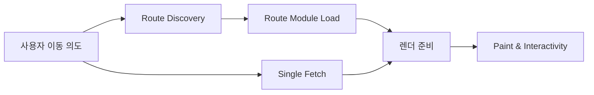

## 한눈에 보기

React Router 7 + RSC 실무 운영에서 성능은 기능 하나로 해결되지 않습니다. React Router 7 + RSC 실무 운영의 체감 속도를 결정하는 축은 보통 세 가지입니다.

- **요청 구조**: Single Fetch를 어디까지 묶고, 어디서 끊을지
- **코드 로딩 구조**: Route Module Splitting을 사용자 전환 단위로 어떻게 배치할지
- **라우트 발견 타이밍**: Lazy Route Discovery를 경로별로 어떻게 차등 적용할지

핵심은 “좋은 기능을 켰는가”가 아니라 **전환의 임계 경로를 줄였는가**입니다. 실제 지연은 데이터, 모듈, 라우트 메타 탐색이 연쇄적으로 늦어질 때 발생합니다.

이 글은 React Router 7 + RSC를 체크리스트로 소개하지 않습니다. 대신 운영 관점에서, 한 번의 라우트 전환을 어떤 파이프라인으로 보고 어떤 의사결정을 내려야 회귀를 줄일 수 있는지 정리합니다.

읽고 나면 다음을 바로 판단할 수 있도록 구성했습니다.

1. 지금 느린 구간이 네트워크인지, 모듈인지, discovery인지
2. Single Fetch를 켜도 왜 느릴 수 있는지
3. Route Module Splitting을 파일 분할이 아니라 제품 경계로 설계하는 방법
4. Lazy Discovery를 전역 토글이 아닌 정책으로 운영하는 방법
5. 팀 단위로 성능 회귀를 막는 계측/배포 습관

---

## 들어가며

React Router 7과 RSC를 함께 도입하면, 기술 난이도보다 먼저 의사결정 난이도가 올라갑니다. 팀마다 같은 현상을 다른 언어로 말하기 때문입니다.

- 플랫폼 관점에서는 요청 수와 서버 부담이 먼저 보입니다.
- 프론트엔드 관점에서는 번들 크기와 hydration 비용이 먼저 보입니다.
- 제품 관점에서는 “사용자가 버튼을 누른 뒤 얼마나 빨리 반응하느냐”가 전부입니다.
- QA 관점에서는 “가끔 느림”처럼 재현이 어려운 이슈가 누적됩니다.

각 시각은 모두 맞습니다. 다만 분리해서 보면 답이 틀어집니다. React Router 7 + RSC에서 전환 지연은 단일 병목이 아니라 **연쇄 지연**으로 나타나기 때문입니다.

예를 들어 Single Fetch를 적용해 요청 횟수를 줄였다고 가정하겠습니다. 그런데 응답 페이로드가 커져 TTFB가 늘어나면 클릭 후 반응은 여전히 느립니다. 반대로 모듈을 잘게 나눠도 discovery가 늦으면 import 시작 자체가 밀립니다. 또 discovery와 모듈이 빨라도, 전환 필수 데이터가 optional 데이터와 함께 묶여 늦게 도착하면 사용자는 멈춤으로 인식합니다.

즉 실무 질문은 “무엇을 도입할까?”보다 다음에 가깝습니다.

- 어떤 구간이 사용자 신뢰를 깨는가?
- 그 구간의 임계 경로를 어떤 순서로 줄일 것인가?
- 개선이 회귀하지 않게 어떤 운영 장치를 둘 것인가?

RSC가 이 판단을 더 어렵게 만드는 이유도 같습니다. RSC는 클라이언트 JS 절대량을 줄이는 강력한 도구이지만, 경계가 잘못 잡히면 서버 왕복 비용과 전환 예측 불가능성이 커집니다. 결국 필요한 것은 기능의 ON/OFF가 아니라 **경계 설계와 운영 정책**입니다.

---

## 본문

### 1) 문제: 왜 “기능을 켰는데도” 체감이 안 좋아질까요

실무에서 가장 흔한 실패는 도입 자체를 목표로 삼는 경우입니다.

- Single Fetch를 일괄 적용했지만 응답이 비대해짐
- Route Module Splitting을 했지만 공통 의존성이 과도하게 커짐
- Lazy Discovery를 전역 기본값으로 둬서 일부 경로 전환이 흔들림

이 패턴의 공통점은 “로컬 최적화”입니다. 각 기능은 개선됐는데 전환 파이프라인 전체는 개선되지 않습니다. 사용자는 내부 사정을 모릅니다. 사용자가 느끼는 건 클릭 후 전체 지연뿐입니다.

그래서 전환을 페이지 단위가 아니라 **트랜잭션 단위**로 봐야 합니다. 한 번의 전환에서 최소한 아래 네 이벤트는 같이 관찰해야 합니다.

1. 라우트 메타 발견 시점(Discovery Start/End)
2. 모듈 다운로드+평가 시점(Module Load/Eval)
3. 데이터 요청/응답 시점(Request Start/TTFB/Done)
4. 사용자 체감 시점(첫 의미 있는 페인트, 상호작용 가능 시점)

이 4개를 같은 타임라인에 올려보면, 어느 팀의 주장도 단독으로 정답이 아니라는 사실이 선명해집니다.

### 2) 원인: 임계 경로를 분리하지 않은 설계

성능 회귀의 근본 원인은 대개 기능 부족이 아닙니다. **경계가 섞인 설계**가 원인입니다.

#### 데이터 경계가 섞일 때

전환 필수 데이터와 통계/추천/부가 정보를 하나의 Single Fetch 응답에 담으면, 빠르게 보여줄 수 있는 화면도 느려집니다. “요청이 한 번”이라는 수치는 좋아 보이지만 실제로는 가장 느린 쿼리에 전체 반응이 종속됩니다.

#### 모듈 경계가 섞일 때

라우트를 파일로 분리했어도 공유 유틸, 디자인 시스템, 차트 라이브러리 등이 특정 전환에 과도하게 걸리면 청크 분할 효과가 줄어듭니다. 사용자는 여전히 큰 청크를 기다립니다.

#### 발견 경계가 섞일 때

핵심 퍼널과 롱테일 경로를 동일한 discovery 정책으로 운영하면 양쪽 모두 손해를 봅니다. 핵심 퍼널은 전환 안정성을 잃고, 롱테일 경로는 초기 진입 부담을 키웁니다.

결국 경계를 나누는 기준은 기술 분류가 아니라 **사용자 의도**여야 합니다. “이 클릭에서 지금 꼭 필요한가”가 유일한 기준입니다.

### 3) 원리: React Router 7 + RSC 전환 파이프라인으로 보기

아래 흐름으로 보면 세 기능의 관계가 명확해집니다.



이 흐름에서 중요한 사실은 두 가지입니다.

- **병렬성은 자동으로 안전하지 않습니다.** 병렬로 시작해도 가장 늦는 단계가 전체를 지배합니다.
- **선행조건은 상호 의존적입니다.** 데이터가 빨라도 모듈이 늦으면 못 그립니다. 모듈이 빨라도 데이터가 늦으면 의미 있는 화면을 못 냅니다.

RSC를 함께 쓰면 “클라이언트 JS 감축”이라는 장점이 생기지만, 서버 왕복과 경계 설계 품질이 성패를 좌우합니다. 특히 전환 중 자주 바뀌는 인터랙션 영역을 무리하게 서버 경계로 밀어 넣으면, 왕복 비용이 체감 지연으로 돌아옵니다.

따라서 원리는 간단합니다.

- 전환 임계 경로에 있는 것만 먼저 도착시킵니다.
- 임계 경로 밖의 것은 지연 로딩/스트리밍으로 뒤로 보냅니다.
- 경계 선택 이유를 문서화해 팀 공통 규칙으로 운영합니다.

### 4) 운영: 세 기능을 실제로 배치하는 방법

#### 4-1. Single Fetch는 “요청 수 절감”이 아니라 “응답 의미 최소화”로 설계합니다

Single Fetch의 성공 기준은 요청 수가 아닙니다. **전환에 필요한 최소 의미를 가장 먼저 전달했는가**입니다.

실무 체크리스트는 아래처럼 단순하게 유지하는 편이 좋습니다.

- 전환 필수(critical)와 보조(optional) 데이터를 응답 구조에서 분리합니다.
- critical은 화면 의사결정에 필요한 항목만 포함합니다.
- optional은 지연 로딩 또는 후속 요청으로 분리합니다.
- 캐시 키는 화면 전체가 아니라 사용자 의도 단위로 좁힙니다.

```ts
// 개념 예시: 전환 임계 데이터 우선
export async function loader() {
const critical = await getOrderSummary();
const deferred = getRecommendations(); // await 하지 않음

return {
critical,
deferred,
};
}
```

이 패턴의 장점은 단순합니다. 사용자는 먼저 “다음 행동을 결정할 정보”를 보고, 부가 정보는 뒤따라 와도 경험이 깨지지 않습니다.

#### 4-2. Route Module Splitting은 폴더링이 아니라 전환 단위 최적화입니다

라우트 모듈은 코드 단위이면서 제품 단위입니다. 따라서 분할 기준은 “개발자 편의”보다 “같이 이동하는 화면 묶음”이 유효합니다.

운영에서 특히 효과가 큰 지점은 다음입니다.

- 전환 빈도가 높은 경로(예: 목록→상세)는 연속 전환 기준으로 청크를 설계합니다.
- 공통 의존성은 크기와 중복을 주간 단위로 모니터링합니다.
- prefetch는 “모든 링크”가 아니라 사용자 의도가 높은 링크에 한정합니다.

자주 보는 오해는 “쪼개면 무조건 빨라진다”입니다. 실제로는 **쪼개는 순간 prefetch 전략이 같이 필요**합니다. 클릭 시점에 discovery, module load, data fetch가 한꺼번에 시작되면 오히려 순간 지연이 커집니다.

#### 4-3. Lazy Route Discovery는 경로별 SLA 정책입니다

Lazy Discovery는 초기 로드를 가볍게 만들지만, 전환 순간의 리스크를 키울 수 있습니다. 그래서 전역 토글보다 경로별 정책이 맞습니다.

권장되는 기본값은 다음과 같습니다.

- 핵심 퍼널(매출/전환 경로): eager 성향
- 저빈도 경로(설정/관리/실험): lazy 성향
- 이벤트성 캠페인 페이지: 기간 기반 정책

실무에서는 “가끔 느림”이 가장 위험합니다. 평균 속도보다 예측 가능성이 신뢰를 좌우하기 때문입니다. 따라서 핵심 퍼널은 보수적으로 안정성을 우선하는 편이 좋습니다.

#### 4-4. RSC 경계는 컴포넌트 성격이 아니라 사용자 행동으로 결정합니다

RSC 경계를 정할 때 “서버로 갈 수 있나”를 먼저 묻기 쉽습니다. 하지만 운영에서는 “이 경계가 사용자 행동을 끊는가”를 먼저 봐야 합니다.

- 짧은 간격으로 상호작용이 반복되는 UI는 왕복을 최소화해야 합니다.
- 초기 정보 밀도가 높은 읽기 중심 화면은 서버 중심 구성이 효과적일 수 있습니다.
- 전환 중 실패 가능성이 높은 구간은 boundary/pending UI와 함께 설계합니다.

핵심은 기술 신념이 아니라 체감 안정성입니다. 빠른 첫 렌더 한 번보다, 일관된 전환 경험이 장기 만족도를 더 크게 만듭니다.

#### 4-5. 회귀를 막는 배포 루틴

성능은 프로젝트가 아니라 운영 습관입니다. 기능 도입 이후 아래를 자동화하지 않으면 거의 반드시 회귀합니다.

- PR마다 번들 증감 리포트 기록
- 전환 시간 임계값 초과 시 경고
- 대형 의존성 추가 시 리뷰 체크
- 핵심 퍼널 전환 시나리오를 합성 모니터링에 포함

특히 “평균값”만 보는 대시보드는 위험합니다. 퍼센타일(p75/p95)과 경로별 지표를 함께 봐야 실제 사용자 불만과 연결됩니다.

---

## 트레이드오프

아래 표는 React Router 7 + RSC 운영에서 실제로 자주 마주치는 선택을 빠르게 비교할 수 있도록 정리한 것입니다.

| 선택 지점 | 공격적 전략 | 보수적 전략 | 얻는 것 | 잃는 것 | 추천 판단 기준 |
|---|---|---|---|---|---|
| Single Fetch 범위 | 가능한 데이터를 크게 통합 | 전환 필수만 통합, 나머지 분리 | 요청 수 감소, 구현 단순화 | 응답 비대화, TTFB 증가 위험 | 핵심 전환에서 첫 의사결정 데이터만 우선 |
| Module Splitting 단위 | 세밀한 파일 단위 분할 | 전환 묶음 단위 분할 | 초기 청크 축소 | 청크/의존성 관리 복잡도 증가 | 사용자 이동 패턴과 팀 소유권이 일치하는지 |
| Prefetch 강도 | 광범위 prefetch | 의도 기반 선택적 prefetch | 전환 즉시성 향상 | 네트워크/메모리 낭비 가능 | 클릭 확률 높은 링크만 우선 |
| Route Discovery 정책 | 전역 eager | 핵심 eager + 롱테일 lazy | 전환 안정성 향상 | 초기 진입 비용 증가 | 매출/핵심 퍼널 여부 |
| RSC 경계 설정 | 가능한 영역 서버화 | 상호작용 중심 영역은 클라이언트 유지 | JS 절감, 서버 중심 일관성 | 왕복 증가 시 체감 저하 | 인터랙션 빈도와 왕복 민감도 |
| 성능 관리 방식 | 수동 점검 중심 | CI/모니터링 자동화 | 초기 설정 부담 낮음 | 회귀 반복 가능성 큼 | 팀 규모와 배포 빈도가 높을수록 자동화 |

표만 기억하면 놓치기 쉬운 포인트가 하나 있습니다. 트레이드오프는 “정답 고르기”가 아니라 **경로별 정책 조합**입니다. 예를 들어 결제 퍼널은 eager discovery + 선택적 prefetch + 엄격한 critical fetch가 맞고, 관리자 페이지는 lazy discovery + 보수적 prefetch가 더 합리적일 수 있습니다.

즉 같은 앱 안에서도 전략은 달라져야 합니다. 중요한 것은 일관성보다 **의도와 지표의 정합성**입니다.

---

## 마무리하며

React Router 7 + RSC 성능 운영의 핵심은 기능 목록이 아닙니다. React Router 7 + RSC 실무 운영에서는 한 번의 전환을 파이프라인으로 보고, 임계 경로를 줄이는 순서를 팀이 합의하는 것이 출발점입니다.

정리하면 다음 네 문장으로 수렴합니다.

- Single Fetch는 요청 횟수보다 응답 의미를 줄이는 도구입니다.
- Route Module Splitting은 파일 분할이 아니라 사용자 전환 설계입니다.
- Lazy Route Discovery는 전역 설정이 아니라 경로별 정책입니다.
- RSC 경계는 기술 취향이 아니라 사용자 행동과 신뢰를 기준으로 정해야 합니다.

성능은 빠른 데모로 증명되지 않습니다. 릴리스가 반복되어도 지표가 무너지지 않을 때 비로소 운영 역량이 됩니다. 그래서 지금 필요한 것은 더 많은 최적화 트릭이 아니라, 경계를 설명하고 계측으로 검증하는 팀의 공통 언어입니다.

다음 단계에서는 Pending UI, Error Boundary, 재시도 전략을 전환 파이프라인에 연결해 “실패해도 신뢰가 유지되는 UX”까지 함께 설계해보면 좋습니다. 실제 서비스 품질은 최고 속도보다, 흔들릴 때의 복원력에서 갈립니다.

---

## 더 읽어볼 자료

- React Router 공식 문서: Data Loading, Route Modules, Rendering Strategies
- React 공식 문서: Server Components, Suspense, Streaming
- web.dev 성능 자료: Core Web Vitals, INP/LCP 해석 가이드
- Chrome DevTools 문서: Performance 패널로 전환 병목 추적하기
- 대규모 프론트엔드 사례 글: prefetch 정책, chunk governance, 성능 회귀 방지 사례
- 팀 운영 문서로 바로 쓸 템플릿
- 라우트 전환 지표 정의서(경로·퍼센타일·임계값)
- RSC 경계 ADR 템플릿(선택 이유·대안·리스크)
- PR 성능 체크리스트(번들·전환·의존성 영향)

결국 오래가는 성능은 최신 기능이 아니라, 지표를 읽고 경계를 설명할 수 있는 팀에서 만들어집니다. React Router 7 + RSC도 같은 원리입니다.
