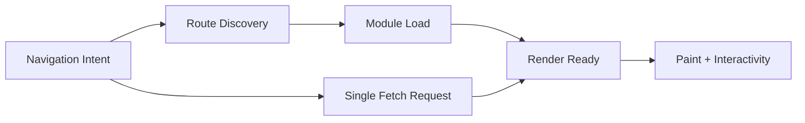

React Router v7 성능 이야기를 하면 보통 기능 이름이 먼저 등장합니다. Single Fetch를 켤지, 라우트 모듈을 쪼갤지, Lazy Route Discovery를 도입할지 같은 항목입니다. 하지만 실제 운영에서 체감 성능을 결정하는 것은 기능 하나의 유무가 아닙니다. 거의 항상 **요청 구조, 코드 로딩 구조, 라우트 발견 타이밍**이 어떻게 결합되는지에서 결과가 갈립니다.

이 글은 성능 기능을 체크리스트처럼 나열하는 대신, 세 기능을 하나의 파이프라인으로 보고 설계하는 방법을 정리합니다.

---

## 먼저 전제: 성능 문제를 어디서 관측할 것인가

튜닝 전에 먼저 실패 지점을 분해해야 합니다.

1. 네트워크 왕복이 많은가?
2. JS 다운로드/평가 비용이 큰가?
3. 라우트 메타/모듈 발견 시점이 늦어서 전환이 멈추는가?
4. 위 세 가지가 동시에 발생하는가?

대규모 앱에서는 보통 4번입니다. 그래서 기능도 조합으로 접근해야 합니다.

---

## Single Fetch: 요청 수를 줄이는 전략, 하지만 만능은 아니다

Single Fetch의 직관은 간단합니다. 라우트 전환 시 필요한 데이터를 가능한 한 단일 요청 흐름으로 묶어 왕복 횟수를 줄입니다. 특히 중첩 라우트가 깊고 loader 호출이 많은 화면에서 효과가 큽니다.

### 장점

- 요청 수 감소
- 전환 단계 단순화
- 로컬/저지연 환경에서 특히 일관된 체감

### 함정

Single Fetch만 믿고 페이로드 구조를 방치하면 역효과가 납니다.

- 한 번에 너무 많은 데이터를 실어 TTFB 증가
- 실제로는 일부 라우트에만 필요한 데이터까지 과적재
- 캐시 키가 거칠어져 재사용률 저하

즉 Single Fetch는 "요청 횟수"를 줄여주지만, "요청 품질"까지 보장하지는 않습니다.

---

## Route Module Splitting: 코드 분할을 운영 경계로 연결하기

코드 분할은 오래된 주제지만, React Router v7에서는 라우트 모듈 단위로 설계하기 때문에 팀 운영과 결합하기 쉽습니다.

### 왜 라우트 모듈 단위가 중요한가

- 기능 소유권(팀/도메인)과 배포 영향 범위를 맞출 수 있음
- 특정 라우트에서만 쓰는 의존성을 격리하기 쉬움
- 회귀 테스트 범위를 예측 가능하게 만들 수 있음

### 실패 패턴

- 공통 유틸/디자인 시스템이 비대해 실제 청크가 다시 커짐
- "분할했다"는 사실만 있고 전환 시점 prefetch 정책이 없음
- 라우트 간 공유 의존성 관리를 하지 않아 중복 로드 발생

결론적으로 splitting은 시작일 뿐이고, prefetch·공통 의존성·캐시 전략까지 같이 설계해야 체감이 좋아집니다.

---

## Lazy Route Discovery: 초기 부하와 전환 부하의 균형점

모든 라우트 정보를 초기 로드에 포함하면 첫 진입이 무거워집니다. 반대로 모든 걸 늦게 발견하면 전환 순간 끊김이 생깁니다. Lazy Route Discovery의 핵심은 이 균형을 잡는 것입니다.

### 언제 유리한가

- 라우트 수가 많고, 사용자별 실제 접근 경로가 제한적일 때
- MFE처럼 팀별 라우트가 분산되어 전체 메타가 큰 구조

### 주의할 점

- 탐색 흐름이 빠른 화면에서는 discovery 지연이 곧 UX 지연
- 모니터링 없이 도입하면 "가끔 느림" 문제로 남음

따라서 discovery는 기능이 아니라 정책입니다. 어떤 경로는 eager, 어떤 경로는 lazy로 나눠야 합니다.

---

## 세 기능을 하나로 보면 보이는 것

이 다이어그램에서 핵심은 병렬성입니다.

- discovery가 늦으면 module load가 늦고
- module load가 늦으면 fetch가 빨라도 렌더가 늦고
- fetch가 느리면 module이 준비돼도 화면이 멈춤

즉 한 축만 최적화하면 다른 축이 병목이 됩니다.

---

## 실전 튜닝 순서 (권장)

### 1단계: 계측부터

최소한 아래 지표를 route transition 단위로 수집합니다.

- 전환당 요청 수
- 총 페이로드 크기
- 라우트 모듈 로드 시간
- discovery 지연 시간
- 전환 완료까지 걸린 총 시간

### 2단계: Single Fetch 적용 범위 결정

모든 라우트에 일괄 적용하지 말고, 요청 fan-out이 큰 구간부터 적용합니다.

### 3단계: 모듈 분할 재검토

"기능별 폴더"가 아니라 "전환 단위" 기준으로 분할합니다. 사용자가 함께 움직이는 화면은 함께 튜닝해야 합니다.

### 4단계: discovery 정책 분기

핵심 경로(상위 트래픽)는 eager 성향, 롱테일 경로는 lazy 성향으로 나눕니다.

### 5단계: 회귀 방지 룰

- PR마다 번들 증감량 표시
- 전환 지표 임계값 초과 시 경고
- 대규모 의존성 추가 시 사전 리뷰

---

## 안티패턴 4가지

1. **"Single Fetch 켰으니 끝"**
   - 페이로드 최적화 없이 켜면 오히려 느려짐

2. **"코드 분할만 하면 빠르다"**
   - discovery/prefetch 정책 없으면 전환이 더 끊김

3. **"전역 eager discovery"**
   - 첫 진입 성능을 과도하게 희생

4. **"지표 없이 체감으로만 튜닝"**
   - 팀마다 주관적 판단 충돌, 회귀 반복

---

## 팀 운영 관점 체크리스트

- [ ] route transition 지표를 대시보드로 보고 있는가
- [ ] Single Fetch 적용 범위를 문서화했는가
- [ ] 라우트 모듈 분할 기준이 팀 간 합의됐는가
- [ ] lazy/eager discovery 정책이 경로별로 정의됐는가
- [ ] 성능 회귀를 PR 단계에서 감지할 수 있는가

---

## 마무리

React Router v7 성능 최적화의 핵심은 기능 토글이 아닙니다. **요청-코드-발견 타이밍을 하나의 전환 파이프라인으로 설계**하는 것입니다. Single Fetch, Route Module Splitting, Lazy Route Discovery는 각각 좋은 기능이지만, 조합으로 설계할 때 비로소 운영 가능한 성능이 됩니다.

다음 글에서는 성능 못지않게 사용자 신뢰를 좌우하는 주제, RSC 환경의 Error Boundary와 Pending UI 설계를 다룹니다.
