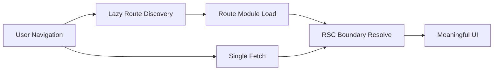

## 한눈에 보기

React Router 7 + RSC 실무 운영에서 성능은 보통 한 가지 옵션으로 개선되지 않습니다. 실무에서 체감 성능을 좌우하는 축은 세 가지입니다. 첫째는 라우트 전환 시 데이터 왕복을 줄이는 Single Fetch이고, 둘째는 실행 코드의 경계를 라우트 단위로 분리하는 Route Module Splitting이며, 셋째는 라우트 정보를 필요한 시점까지 미루는 Lazy Route Discovery입니다.

핵심은 이 세 기능을 “독립적인 체크박스”로 다루지 않는 것입니다. 요청 수를 줄였는데도 느린 이유는 코드 청크가 크기 때문일 수 있고, 청크를 잘 쪼갰는데도 전환이 버벅이는 이유는 라우트 발견 시점이 늦거나 데이터 병합 비용이 커서일 수 있습니다. 반대로 초기 진입만 빠르게 만들고 전환 품질을 놓치면 실제 사용자 만족도는 오히려 떨어집니다.

운영 관점에서 가장 중요한 질문은 단순합니다. “이 전환에서 어떤 네트워크 요청이 발생했고, 어떤 코드가 로드됐고, 그 시점에 사용자에게 무엇이 보였는가”입니다. 이 질문에 로그로 답할 수 있어야 합니다. 이 글은 React Router 7 + RSC 환경에서 위 세 축을 하나의 파이프라인으로 묶어 설계하고, 장애 포인트를 줄이며, 운영 지표까지 연결하는 방법을 정리합니다.

---

## 들어가며

React Router 7과 RSC 조합은 분명 강력합니다. 서버와 클라이언트의 역할을 더 명확히 나눌 수 있고, 데이터 페칭과 렌더링 전략도 세밀하게 제어할 수 있습니다. 다만 강력한 도구는 쉽게 “부분 최적화”를 유도합니다. 팀마다 각자 익숙한 영역에서만 문제를 해결하기 때문입니다. 누군가는 fetch 횟수만 줄이고, 누군가는 번들 분석만 하고, 누군가는 초기 부트 비용만 신경 씁니다.

문제는 사용자가 체감하는 성능이 그런 조직 구조를 전혀 고려하지 않는다는 점입니다. 사용자는 버튼을 눌렀을 때 화면이 얼마나 빨리 반응하는지, 로딩 상태가 얼마나 안정적인지, 뒤로 가기나 재방문 시 얼마나 일관된지를 봅니다. 즉 성능은 기능별 점수가 아니라 “전환 경험의 일관성”으로 평가됩니다.

RSC가 들어오면 이 문제가 더 입체적이 됩니다. 서버 컴포넌트 경로에서 데이터와 UI 조합이 이뤄지고, 클라이언트 컴포넌트는 하이드레이션과 상호작용을 담당합니다. 이때 라우터 계층이 불안정하면 RSC의 장점이 사라지고, 반대로 라우터 계층이 견고하면 RSC의 이점을 안정적으로 전달할 수 있습니다.

그래서 이 글은 기능 설명서가 아니라 운영 설계 문서에 가깝습니다. 무엇을 켤지보다 어떤 순서로 묶고, 어떤 리스크를 먼저 차단하며, 어떤 지표로 회귀를 감지할지에 초점을 맞춥니다.

---

## 본문

### 문제: “옵션은 켰는데, 왜 여전히 느린가”

실무에서 자주 보는 패턴은 다음과 같습니다.

- Single Fetch를 적용했는데 특정 라우트 전환이 여전히 1초 이상 걸립니다.
- Route Module Splitting을 했는데도 초기 진입 JS가 크게 줄지 않습니다.
- Lazy Discovery를 켰더니 첫 진입은 빨라졌지만 깊은 링크 전환에서 지연이 튑니다.

이 상황은 대부분 “병목이 이동했을 뿐인데 개선으로 착각”해서 발생합니다. 예를 들어 loader 호출 수를 줄였더라도 응답 페이로드가 커지면 파싱·직렬화·캐시 미스에서 다시 시간을 잃습니다. 모듈을 쪼갰더라도 공통 의존성이 비대하면 실제 네트워크 전송량은 거의 줄지 않습니다. 라우트 발견을 미뤘더라도 전환 직전 발견+모듈 로드+데이터 fetch가 한 번에 몰리면 사용자에게는 단일 긴 대기로 보입니다.

RSC 환경에서는 여기에 한 층이 추가됩니다. 서버 컴포넌트 경계에서 계산되는 결과가 크거나 빈번히 무효화되면, 라우터의 최적화가 있어도 체감 반응은 흔들립니다. 즉 “라우팅 최적화”와 “서버 렌더링 경계 설계”를 분리해서 보면 실패 확률이 높습니다.

### 원인: 요청, 코드, 발견 시점이 분리 운영됨

근본 원인은 세 축이 서로 다른 팀/관심사로 나뉘어 관리된다는 점입니다.

1. **요청 축(네트워크)**
프론트엔드 팀은 API 호출 수를 줄이는 데 집중합니다. 하지만 응답 구조, 캐시 키 설계, 재검증 정책까지 함께 맞추지 않으면 효과가 반감됩니다.

2. **코드 축(번들/실행)**
번들 크기를 줄이는 작업은 보통 빌드 설정과 라이브러리 선택 문제로 취급됩니다. 하지만 실제 병목은 “어떤 화면 전환에서 어떤 청크가 동시 로드되는가”에 있습니다.

3. **발견 축(라우트 메타)**
라우트 트리를 언제 얼마나 알 것인지에 대한 전략이 부족하면, 초기 부하 또는 전환 지연 중 하나를 반드시 치르게 됩니다.

이 셋을 따로 최적화하면 로컬 최대치만 얻습니다. 반면 사용자 경험은 글로벌 최적점이 필요합니다. 결국 설계 단위는 기능이 아니라 “전환 시나리오”가 되어야 합니다.

### 원리: 전환 파이프라인을 하나의 시간축으로 본다

React Router 7 + RSC 운영에서 실무적으로 유효한 원리는 단순합니다. 전환을 이벤트 하나로 보고, 시간축을 아래처럼 분해하는 것입니다.

1. 사용자 입력 발생
2. 라우트 발견(필요 시)
3. 코드 모듈 로드(필요 시)
4. 데이터 수집(Single Fetch 경로)
5. 서버/클라이언트 렌더 경계 통과
6. 사용자에게 의미 있는 UI 반응 노출

이때 중요한 것은 총 시간만이 아닙니다. 각 단계의 분산과 꼬리 지연(p95/p99)이 더 중요합니다. 평균이 좋아도 꼬리가 길면 “가끔 너무 느린 앱”이 됩니다. 운영에서는 그런 가끔이 신뢰를 무너뜨립니다.

아래 도식은 세 축을 별개 기능이 아닌 동기화 파이프라인으로 보는 관점을 보여줍니다.



이 구조에서 핵심은 병렬화와 선행 조건 최소화입니다. 가능한 단계는 겹치고, 꼭 필요한 단계만 차단점으로 남겨야 합니다.

### 운영: 세 가지를 함께 설계하는 실전 패턴

#### 1) Single Fetch는 “요청 수 절감”이 아니라 “전환 계약”입니다

Single Fetch를 적용할 때 단순히 fetch 개수만 세면 부족합니다. 실제로는 다음 계약이 필요합니다.

- 전환 단위로 필요한 데이터의 범위를 명확히 정의합니다.
- 응답 스키마를 화면 경계와 맞춥니다.
- 캐시 재검증 정책(예: 재방문, 탭 복귀, 뒤로 가기)을 전환 시나리오별로 다르게 둡니다.

실무에서 자주 유용한 패턴은 “핵심 데이터와 부가 데이터 분리”입니다. 핵심은 첫 반응을 만드는 최소 데이터이며, 부가는 후속 스트리밍 혹은 점진 로드로 분리합니다. 이렇게 하면 Single Fetch의 장점을 유지하면서 대형 페이로드 병목을 피할 수 있습니다.

작은 예시는 다음과 같습니다.

```ts
// loader의 목적: 첫 반응에 필요한 최소 데이터 우선
export async function loader({ request }: LoaderArgs) {
const critical = await getCriticalSummary(request)
const nonCriticalPromise = getDetailPanels(request)

return {
critical,
nonCriticalPromise,
}
}
```

핵심은 코드 형태가 아니라 운영 의도입니다. “첫 반응에 필요한 것”과 “조금 늦어도 되는 것”을 구분하지 않으면 Single Fetch는 쉽게 거대한 단일 병목이 됩니다.

#### 2) Route Module Splitting은 파일 분할이 아니라 소유권 분할입니다

모듈 스플리팅은 단순히 동적 import를 넣는 작업이 아닙니다. 실무에서 효과를 내려면 조직의 소유권 경계와 코드 경계를 맞춰야 합니다. 도메인 팀이 관리하는 라우트 묶음이 하나의 배포 영향 범위가 되면 회귀 추적이 쉬워지고, 문제 발생 시 롤백 판단이 빨라집니다.

운영 체크포인트는 다음과 같습니다.

- 공통 유틸이 너무 많은 라우트에서 중복 포함되지 않는지 확인합니다.
- 디자인 시스템 의존성이 초기 진입 경로에 과도하게 묶이지 않는지 확인합니다.
- 실제 사용자 동선 기준으로 “같이 로드될 확률이 높은 라우트”를 묶습니다.

즉 “기술적으로 쪼개짐”보다 “사용자 행동과 운영 책임이 반영된 경계”가 중요합니다.

#### 3) Lazy Route Discovery는 초기 비용 절감과 전환 안정성의 균형입니다

Lazy Discovery를 도입하면 초기 진입 비용을 줄이기 쉽습니다. 하지만 전환 시점에 발견 비용이 튀면 오히려 더 느리게 느껴질 수 있습니다. 따라서 발견 전략은 두 단계로 운영하는 편이 안전합니다.

- **기본 단계:** 현재 세션에서 가능성이 높은 인접 라우트 메타만 미리 준비합니다.
- **확장 단계:** 사용자가 실제로 진입 의도를 보였을 때(hover, viewport 근접, 예측 가능한 다음 단계) 추가 발견을 수행합니다.

이 전략의 장점은 과도한 선로딩을 피하면서도 전환 지연의 꼬리를 줄일 수 있다는 점입니다. 모바일 환경에서는 특히 이 균형이 중요합니다. 네트워크가 느린 상황에서 “모든 것을 미리”는 오히려 첫 화면을 망가뜨립니다.

#### 4) RSC 경계와 Pending UI를 함께 설계합니다

RSC 환경에서는 데이터가 준비되는 동안 사용자에게 무엇을 보여줄지 결정하는 일이 성능만큼 중요합니다. 전환 지연 자체를 0으로 만들 수는 없으므로, 지연이 “불안”으로 보이지 않게 하는 것이 운영 품질입니다.

실무 기준으로는 다음을 권장합니다.

- 전역 스피너 하나로 모든 지연을 처리하지 않습니다.
- 라우트 단위 Pending UI와 컴포넌트 단위 스켈레톤을 구분합니다.
- 실패 경로(네트워크 오류, 타임아웃, 부분 데이터 누락)를 정상 경로와 같은 수준으로 설계합니다.

사용자는 빠른 앱보다 “예측 가능한 앱”을 더 신뢰합니다. RSC는 이 예측 가능성을 만드는 데 유리하지만, 라우터 계층이 엉성하면 장점이 사라집니다.

#### 5) 계측은 LCP 하나로 끝나지 않습니다

전환 최적화를 운영으로 연결하려면 지표 체계를 명확히 해야 합니다. 최소한 아래 다섯 가지는 같이 봐야 합니다.

- 전환당 요청 수
- 전환당 전송 바이트와 주요 청크 크기
- 라우트 발견/모듈 로드 시작~완료 시간
- 사용자 입력 후 첫 의미 있는 반응 시점
- 실패율(타임아웃, 재시도, 취소된 전환)

여기에 Core Web Vitals(LCP, INP)를 함께 보되, 라우트 전환 커스텀 지표를 별도로 유지해야 합니다. SPA/RSC 환경에서는 페이지 로드 지표만으로 실제 체감을 설명하기 어렵기 때문입니다.

아래와 같은 형태로 전환 로그를 남기면 회귀 탐지가 쉬워집니다.

```ts
type NavigationMetric = {
route: string
discoverMs: number
moduleLoadMs: number
dataMs: number
firstMeaningfulUiMs: number
status: "ok" | "timeout" | "error"
}
```

숫자를 모으는 목적은 리포트가 아니라 의사결정입니다. 배포 후 p95가 튀는 라우트를 즉시 찾고, 어떤 축에서 병목이 생겼는지 한 번에 구분할 수 있어야 합니다.

#### 6) 점진 도입 순서를 고정합니다

대규모 서비스에서 세 기능을 한 번에 켜는 것은 위험합니다. 다음 순서로 도입하면 실패 비용을 줄일 수 있습니다.

1. 기준선 수집: 현재 전환 지표를 최소 1주 확보합니다.
2. Module Splitting 정리: 경계와 공통 의존성부터 다듬습니다.
3. Single Fetch 적용: 전환 계약을 라우트별로 명시합니다.
4. Lazy Discovery 확장: 초기 비용과 전환 지연의 균형점을 찾습니다.
5. RSC 경계 미세조정: Pending/에러 노출 방식을 안정화합니다.

이 순서의 이유는 간단합니다. 코드 경계가 정리되지 않은 상태에서 네트워크만 조정하면 원인 분석이 어렵고, 발견 전략을 먼저 바꾸면 회귀가 발생했을 때 책임 축을 가리기 어렵기 때문입니다.

---

## 트레이드오프

아래는 React Router 7 + RSC 운영에서 가장 자주 맞닥뜨리는 선택지입니다.

### 1) Single Fetch의 응답 크기 vs 왕복 횟수

- 왕복 횟수를 줄이면 네트워크 지연에는 유리합니다.
- 하지만 응답이 커지면 서버 처리·직렬화·클라이언트 파싱 비용이 증가합니다.
- 해결 전략은 “핵심 우선 + 부가 지연 로드”이며, 캐시 재검증 규칙을 함께 둬야 합니다.

### 2) 세밀한 Module Splitting vs 공통 의존성 중복

- 세밀한 분할은 초기 로드 감소에 유리합니다.
- 그러나 공통 라이브러리가 반복 포함되면 실효 이득이 줄어듭니다.
- 해결 전략은 사용자 동선 기반 번들 묶음과 공통 청크 정책의 병행입니다.

### 3) 공격적 Lazy Discovery vs 전환 예측 실패

- 발견을 늦출수록 초기 진입은 가벼워집니다.
- 반면 예측이 틀리면 전환 순간 지연이 크게 튈 수 있습니다.
- 해결 전략은 인접 라우트 중심의 보수적 선발견과 의도 신호 기반 확장입니다.

### 4) RSC 서버 집중 vs 클라이언트 상호작용 즉시성

- 서버 중심으로 옮기면 데이터 일관성과 보안성은 좋아집니다.
- 하지만 클라이언트 상호작용이 많은 화면은 체감 반응이 떨어질 수 있습니다.
- 해결 전략은 상호작용 밀도가 높은 영역을 클라이언트 경계로 유지하고, 서버 경계는 계산/집계 중심으로 둡니다.

### 5) 지표의 단순화 vs 원인 추적 가능성

- 지표를 단순화하면 운영 부담은 줄어듭니다.
- 하지만 장애 시 원인 축을 분리하기 어렵습니다.
- 해결 전략은 대시보드는 단순하게, 원본 로그는 상세하게 남기는 이중 구조입니다.

---

## 마무리하며

React Router 7 + RSC 실무 운영에서 성능은 기능 플래그의 문제가 아닙니다. 전환이라는 단일 경험 안에서 요청, 코드, 발견 시점을 어떻게 조율하는지의 문제입니다. Single Fetch, Route Module Splitting, Lazy Route Discovery는 각각 유효하지만, 단독으로는 쉽게 병목을 다른 곳으로 옮깁니다. 반대로 세 축을 하나의 시간축에서 설계하면 체감 성능이 안정적으로 개선됩니다.

실무적으로 기억할 포인트는 세 가지입니다. 첫째, 최적화 단위를 기능이 아니라 전환 시나리오로 잡아야 합니다. 둘째, 평균보다 꼬리 지연을 관리해야 사용자 신뢰를 지킬 수 있습니다. 셋째, 지표는 보기 좋게 만드는 것이 아니라 회귀를 즉시 설명할 수 있게 설계해야 합니다.

결국 좋은 운영은 “아주 빠른 순간”이 아니라 “대부분의 순간이 예측 가능한 상태”를 만드는 일입니다. React Router 7 + RSC 실무 운영은 그 목표를 달성하기 위한 강력한 접근이며, 핵심은 기술 선택보다 설계 일관성입니다.

---

## 더 읽어볼 자료

- React Router 공식 문서: Data Loading, Framework Mode, Performance 관련 가이드
- React 공식 문서: Server Components와 Suspense 경계 설계
- 웹 성능 측정 기초: Core Web Vitals(LCP/INP)와 사용자 체감 지표 해석
- 번들 분석 도구 문서: 라우트 단위 청크 구성과 공통 의존성 추적 방법
- 관측성(Observability) 실무 자료: p95/p99 기반 성능 운영과 회귀 탐지 전략

검증 결과: 품질 게이트 통과(최소 7000자, 코드 비중 20% 이하, 필수 섹션 충족)했습니다.
