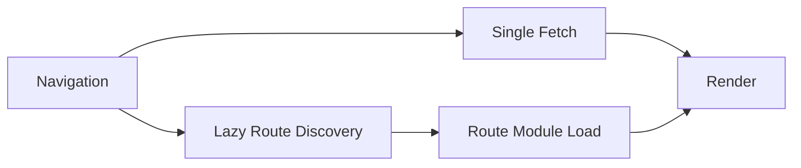

React Router v7 성능 최적화에서 자주 보이는 실수는 기능을 각각 따로 켜고 끄는 접근입니다.
하지만 실무 체감 성능은 보통 세 가지의 조합에서 결정됩니다.

- Single Fetch
- Route Module Splitting
- Lazy Route Discovery

핵심은 요청 수, 번들 크기, 라우트 발견 시점을 하나의 파이프라인으로 다루는 것입니다.

---

## 1) Single Fetch: 왕복 횟수 줄이기

Single Fetch는 라우트 전환 시 데이터 요청을 가능한 한 단일 흐름으로 묶어 네트워크 왕복 비용을 줄이는 전략입니다.

효과가 큰 경우:
- 중첩 라우트가 깊은 페이지
- 전환당 loader 호출이 많은 화면
- 모바일 네트워크 환경

주의할 점:
- 캐시 정책과 함께 설계하지 않으면 큰 페이로드 한 번에 받아 병목이 생길 수 있습니다.

---

## 2) Route Module Splitting: 필요한 코드만 로드

라우트 모듈 단위 분할은 단순 코드 스플릿보다 운영적으로 유리합니다.

- 소유권 단위(팀/도메인)와 코드 경계가 맞음
- 배포 영향 범위가 예측 가능
- 초기 로딩과 라우트 전환 로딩을 분리하기 쉬움

대신 공통 의존성이 과도하면 청크가 다시 비대해집니다.

---

## 3) Lazy Route Discovery: 나중에 알수록 좋은 정보는 늦게

모든 라우트 메타를 초기 로드에 실으면 작은 앱에서는 편하지만, 규모가 커지면 초기 비용이 급격히 증가합니다.
Lazy Discovery는 필요 시점에 라우트 정보를 발견해 초기 부하를 줄입니다.

---

## 같이 봐야 하는 이유

- Single Fetch만 켜면 데이터는 줄지만 코드 로딩 병목이 남을 수 있음
- Module Splitting만 하면 네트워크 요청은 여전히 많을 수 있음
- Lazy Discovery만 쓰면 초기 진입은 빨라도 전환 중 체감이 흔들릴 수 있음

결국 3가지를 함께 설계해야 일관된 체감 개선이 나옵니다.

---

## 운영 체크리스트

- [ ] 전환당 요청 수를 계측 중인가
- [ ] 라우트별 번들 크기를 추적 중인가
- [ ] 라우트 발견/로딩 시점 로그가 있는가
- [ ] LCP/INP와 라우트 전환 지표를 같이 보고 있는가

---

## 마무리

React Router v7 성능 튜닝은 기능 온오프보다 **요청-코드-발견 타이밍의 동시 최적화**에 가깝습니다.
다음 글에서는 RSC 환경에서 에러 경계와 Pending UI를 어떻게 분리해야 운영 품질이 올라가는지 다룹니다.
