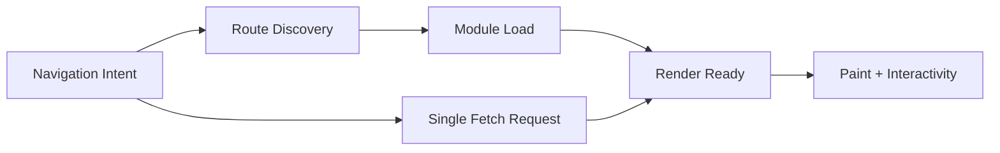

## 한눈에 보기

React Router 7 + RSC 환경에서 성능은 기능 하나로 해결되지 않습니다. 핵심은 다음 세 축을 **동시에 설계**하는 것입니다.

- **요청 구조**: Single Fetch를 어디에, 어떤 데이터 경계로 적용할지
- **코드 로딩 구조**: Route Module Splitting을 어떤 사용자 전환 단위로 설계할지
- **라우트 발견 타이밍**: Lazy Route Discovery를 어떤 경로에는 늦추고, 어떤 경로에는 앞당길지

실무에서 자주 발생하는 실패는 “좋은 기능을 켰는데도 체감이 나빠지는” 상황입니다. 그 이유는 단순합니다.
대부분의 전환 지연은 하나의 병목이 아니라, **데이터-모듈-발견 타이밍의 연쇄 지연**으로 나타나기 때문입니다.

이 글은 React Router 7 + RSC 기준으로, 세 기능을 체크리스트가 아니라 **전환 파이프라인**으로 묶어 해석합니다. 그리고 “무엇을 켤 것인가”보다 중요한 질문, 즉 **왜 이 구간에서 이 전략이 필요한가**를 중심으로 정리합니다.

---

## 들어가며

React Router 7과 RSC를 함께 다루기 시작하면 팀이 가장 먼저 부딪히는 문제는 기술 자체가 아니라 **의사결정 단위의 혼선**입니다.

- 백엔드/플랫폼 팀은 요청 횟수를 줄이자고 말합니다.
- 프론트엔드 팀은 번들을 쪼개자고 말합니다.
- 제품 팀은 첫 화면이 빨라야 한다고 말합니다.
- QA 팀은 “가끔 느림” 이슈가 재현이 어렵다고 말합니다.

각 주장 모두 맞습니다. 문제는 이 주장이 서로 다른 시간축에서 나온다는 점입니다.
React Router 7 + RSC에서는 한 번의 라우트 전환이 최소한 다음 질문들을 동시에 포함합니다.

1. 어떤 경로의 라우트 정보를 지금 알아야 하는가?
2. 어떤 모듈을 지금 내려받아야 렌더가 가능한가?
3. 어떤 데이터를 지금 받지 않으면 사용자 의도가 끊기는가?

이 세 질문은 독립적이지 않습니다. 예를 들어 데이터 요청을 단일화해도(좋은 일입니다), 해당 경로 모듈 발견이 늦으면 렌더 준비가 밀립니다. 반대로 모듈을 잘 쪼개도, 데이터 응답이 과적재되어 TTFB가 길어지면 전환은 늦습니다.
즉 실무에서 중요한 것은 “기능 도입 여부”가 아니라 **전환의 임계 경로(critical path)를 어디서 줄일 것인가**입니다.

RSC는 여기서 판단을 더 어렵게 만듭니다. 서버 컴포넌트는 “클라이언트 번들을 줄여주는 은총”처럼 보이지만, 잘못 사용하면 서버 왕복과 경계 전환 비용이 증가합니다. React Router 7이 제공하는 라우트 단위 설계력은 강력하지만, 팀이 이를 운영 정책으로 정리하지 않으면 결과는 흔들립니다.

결론적으로, 우리는 성능 기능을 “도입”하는 것이 아니라 **서비스 맥락에 맞게 배치**해야 합니다. 그리고 그 배치 원칙은 대부분 “왜 여기서 지연이 사용자 신뢰를 깨는가?”라는 질문에서 출발합니다.

---

## 트레이드오프

이 섹션은 기능 설명이 아니라, 실제 운영에서 마주치는 선택지를 “왜” 중심으로 해부합니다.

### 1) Single Fetch: 요청 수를 줄이는 기술이 아니라, 요청 의미를 재설계하는 기술입니다

Single Fetch는 표면적으로 “요청 횟수 감소”라는 분명한 장점이 있습니다. 특히 중첩 라우트가 깊고 loader fan-out이 큰 화면에서는 체감 효과가 큽니다.
하지만 실무에서 중요한 포인트는 횟수보다 **요청 경계(boundary)**입니다.

왜냐하면 Single Fetch가 잘못 적용되는 대표 상황은 다음과 같기 때문입니다.

- 전환에 반드시 필요한 데이터와, “있으면 좋은” 데이터를 한 페이로드로 묶음
- 사용자 경로별 편차가 큰 데이터를 동일한 응답 구조로 강제함
- 캐시 키를 너무 넓게 잡아 재사용률이 떨어짐

즉 Single Fetch는 네트워크 횟수를 줄여도 **의미 없는 바이트를 늘릴 수 있습니다.**
이때 사용자는 “요청은 한 번인데 왜 느리지?”를 경험합니다. 팀은 도구를 탓하지만, 실제 문제는 설계입니다.

실무에서는 보통 다음 원칙이 유효합니다.

- 전환 필수 데이터(critical)와 보조 데이터(optional)를 분리합니다.
- Single Fetch 응답은 “화면 최초 의사결정에 필요한 최소 집합”으로 제한합니다.
- 나머지는 스트리밍/지연 로딩으로 밀어냅니다.

짧은 예시는 다음과 같습니다.

```ts
// 개념 예시: 전환 임계 데이터만 우선 제공
export async function loader() {
const critical = await getCriticalDashboardData();
const deferred = getNonCriticalInsights(); // await 하지 않음
return { critical, deferred };
}
```

코드는 단순하지만 핵심은 문장입니다.
**Single Fetch는 “모든 걸 한 번에 받는다”가 아니라 “전환 의도를 끊지 않을 최소 응답을 먼저 보장한다”**는 전략입니다.

---

### 2) Route Module Splitting: 번들 분할이 아니라, 팀 경계와 사용자 경로를 맞추는 일입니다

많은 팀이 코드 스플리팅을 “번들 줄이기” 과제로만 취급합니다. 그래서 폴더를 분리하고 dynamic import를 넣는 데서 멈춥니다.
하지만 React Router 7에서는 라우트 모듈이 단순 파일 단위가 아니라 **운영 단위**가 됩니다.

왜 운영 단위인가요?

- 라우트는 사용자 의도(이동), 데이터 경계(loader), 렌더 경계(component)가 한 지점에 모이는 곳입니다.
- 즉 라우트 모듈은 “기술 단위”이면서 동시에 “제품 경험 단위”입니다.
- 이 단위가 팀 소유권과 맞지 않으면, 성능 회귀의 책임이 흐려집니다.

실패 패턴은 대체로 비슷합니다.

1. 라우트는 쪼갰지만 공통 유틸이 비대해져 실제 청크는 다시 커집니다.
2. prefetch 정책이 없어, 클릭 시점에야 모듈과 데이터가 동시에 시작됩니다.
3. 공유 의존성 버전/중복 관리가 약해 중복 로딩이 생깁니다.

결국 splitting은 시작점입니다. 성능을 만들려면 아래가 함께 필요합니다.

- 전환 빈도가 높은 경로의 사전 로딩 정책
- 공통 의존성의 크기/중복 추적
- “사용자가 함께 이동하는 경로 묶음” 기준 최적화

한 줄로 요약하면 이렇습니다.
**모듈을 파일 기준으로 나누면 개발은 편해질 수 있지만, 전환 기준으로 나누지 않으면 체감은 좋아지지 않습니다.**

---

### 3) Lazy Route Discovery: 초기 성능과 전환 안정성 사이의 계약입니다

Lazy Route Discovery는 보통 “초기 로드 가볍게”라는 메시지로 소개됩니다. 맞는 말입니다.
다만 실무에서 더 중요한 질문은 이것입니다.

> 어떤 경로의 라우트 메타를 지금 모르면, 사용자 경험이 깨지는가?

모든 것을 eager로 들고 오면 첫 진입이 무거워집니다.
모든 것을 lazy로 미루면 전환 순간의 멈춤이 늘어납니다.
따라서 discovery는 기능이 아니라 **경로별 정책**입니다.

- 핵심 퍼널(예: 홈 → 상세 → 결제)은 eager 성향
- 롱테일/관리자 경로는 lazy 성향
- 실험 기능이나 저빈도 페이지는 필요 시 발견

여기서 RSC를 함께 보면 더 명확해집니다.
RSC는 “클라이언트 JS를 줄이는 대신 서버-클라이언트 경계의 설계 정밀도”를 요구합니다. discovery 지연이 생기면 서버 응답이 빨라도 사용자 눈에는 느립니다. 반대로 discovery를 과도하게 앞당기면 초기 진입이 무거워집니다.

즉 핵심은 “전부 빠르게”가 아니라 **느려도 되는 지점과 느려지면 안 되는 지점을 조직적으로 구분하는 것**입니다.

---

### 4) 세 기능을 하나의 전환 파이프라인으로 볼 때, 병목은 더 명확해집니다

아래 흐름은 단순한 다이어그램이지만, 실무 논쟁을 정리할 때 매우 유용합니다.



여기서 중요한 관찰은 병렬성입니다.

- Discovery가 늦으면 모듈 로드 시작이 늦습니다.
- 모듈 로드가 늦으면 데이터가 와도 렌더 준비가 안 됩니다.
- 데이터가 늦으면 모듈이 준비돼도 화면이 멈춥니다.

따라서 “우리 팀은 네트워크만 잡으면 된다” 같은 단일 처방은 거의 항상 실패합니다.
전환 지표를 최소 다음 묶음으로 봐야 합니다.

- 전환당 요청 수/총 페이로드/TTFB
- 모듈 로드 시간/평가 시간
- 라우트 discovery 지연
- 클릭→첫 의미 있는 페인트까지 총 전환 시간

왜 이렇게까지 하냐고 묻는다면, 이유는 단순합니다.
**사용자는 병목의 출처를 구분하지 않고, 전체 전환 지연만 기억하기 때문입니다.**

---

### 5) RSC 실무 관점에서 꼭 짚어야 할 질문: “무엇을 서버에 둘 것인가”보다 “왜 그 경계를 선택했는가”

RSC를 도입하면 종종 “클라이언트 코드를 줄이는 것”이 목표가 됩니다.
하지만 성능이 흔들리는 팀은 대체로 경계 결정의 이유를 문서화하지 않았습니다.

실무에서 자주 보는 잘못된 접근은 다음과 같습니다.

- 서버에 올릴 수 있는 건 전부 서버로 이동
- 인터랙션 많은 영역도 경계만 보고 서버화
- 데이터 의존성이 큰 컴포넌트를 경로 전환마다 재평가

이 방식은 처음엔 깔끔해 보이지만, 곧 전환 흔들림으로 돌아옵니다.
RSC의 장점은 “JS 절대량 감소”에 있지만, 대가로 “서버 왕복 + 경계 설계”가 필요하기 때문입니다.

그래서 다음 원칙이 유효합니다.

1. 사용자 의사결정에 직접 연결되는 인터랙션은 불필요한 경계 왕복을 피합니다.
2. 전환 임계 경로에서는 안정적 지각 속도를 우선합니다.
3. 서버/클라이언트 경계 선택 이유를 라우트 단위 ADR(의사결정 기록)로 남깁니다.

핵심은 기술 신념이 아니라 사용자 신뢰입니다.
**빠른 첫 렌더보다, 예측 가능한 전환이 실제 만족도를 더 크게 좌우하는 경우가 많습니다.**

---

### 6) 실전 적용 순서: 기능 도입보다 관측 체계를 먼저 세웁니다

현장에서 가장 효과적인 순서는 보통 다음과 같습니다.

#### 1단계: 전환 단위 계측
라우트 전환을 하나의 트랜잭션처럼 다루고 핵심 지표를 수집합니다.
왜냐하면 페이지 단위 평균값은 병목을 숨기기 쉽기 때문입니다.

#### 2단계: Single Fetch의 적용 구간 선별
fan-out이 큰 경로부터 시작합니다. 전역 일괄 적용은 피합니다.
적용 전후로 페이로드와 TTFB를 반드시 비교합니다.

#### 3단계: Route Module Splitting 재편
“기능 폴더”가 아니라 “사용자 전환 묶음” 기준으로 분할합니다.
같이 움직이는 화면은 같이 튜닝해야 실제 체감이 좋아집니다.

#### 4단계: Discovery 정책 차등화
핵심 경로 eager, 롱테일 lazy의 기본 정책을 합의합니다.
합의 없는 lazy는 곧 “가끔 느림”으로 돌아옵니다.

#### 5단계: 회귀 방지 장치
PR 단위 번들 증감, 전환 임계값 초과 경고, 대형 의존성 리뷰를 자동화합니다.
성능은 한 번의 프로젝트가 아니라 운영 습관입니다.

---

### 7) 안티패턴을 “왜 위험한가”로 다시 보기

1. **“Single Fetch 켰으니 끝”**
요청 횟수만 줄고 응답이 비대해지면 첫 반응이 느려집니다.

2. **“코드 분할만 하면 빨라진다”**
prefetch/discovery 정책이 없으면 클릭 시점 동시 지연이 생깁니다.

3. **“전역 eager discovery”**
전환 안정성을 얻는 대신 초기 진입을 과도하게 희생합니다.

4. **“체감으로만 튜닝”**
팀별 주관이 충돌하고 회귀가 반복됩니다. 데이터 없는 최적화는 신념 대결이 됩니다.

이 네 가지는 기술 문제가 아니라 의사결정 구조 문제입니다.
그래서 해결책도 “기능 변경”보다 “운영 원칙 문서화 + 지표 문화”에 가깝습니다.

---

## 마무리하며

React Router 7 + RSC에서 성능 설계의 본질은 토글이 아닙니다.
Single Fetch, Route Module Splitting, Lazy Route Discovery는 각각 유용하지만, 실무 성과를 내는 순간은 세 기능을 **전환 파이프라인으로 결합**했을 때입니다.

그리고 이 결합의 기준은 늘 “왜”여야 합니다.

- 왜 이 데이터가 지금 필요한가?
- 왜 이 모듈은 지금 로드되어야 하는가?
- 왜 이 경로는 지금 발견되어야 하는가?
- 왜 이 지연은 사용자가 용인 가능한가?

이 질문에 답하지 못하면 성능 개선은 일회성으로 끝나고, 결국 다시 회귀합니다.
반대로 이 질문이 팀 합의로 남으면, 기능 추가와 제품 확장 속에서도 성능은 **운영 가능한 자산**이 됩니다.

다음 단계에서 다룰 만한 주제는 명확합니다.
성능이 “빠름”의 문제라면, 신뢰는 “안정감”의 문제입니다. RSC 환경에서는 특히 Error Boundary와 Pending UI 설계가 사용자 신뢰를 좌우합니다. 전환 속도 못지않게, 실패와 대기 상황을 어떻게 보여줄지도 함께 설계해야 합니다.

---

## 더 읽어볼 자료

- React Router 공식 문서 (v7 계열): 라우트 모듈, 데이터 로딩, 서버 렌더링 관련 섹션
- React 공식 문서: Server Components, Suspense, Streaming 렌더링 개념
- 웹 성능 기초 자료: RAIL 모델, Core Web Vitals 해석 가이드
- 대규모 프론트엔드 운영 사례: 코드 스플리팅/프리패치/캐시 전략 포스트모템
- 팀 적용용 실무 문서화 템플릿:
- 라우트 전환 지표 정의서
- 서버/클라이언트 경계 ADR 템플릿
- PR 성능 체크리스트(번들 증감, 전환 영향, 의존성 영향)

실무에서는 최신 기능보다, **지표를 읽고 경계를 설명하는 팀의 역량**이 더 오래 갑니다. 이 점을 기준으로 React Router 7 + RSC 성능 설계를 이어가면, “빠른 데 불안한 앱”이 아니라 “예측 가능하게 빠른 앱”에 가까워질 수 있습니다.
