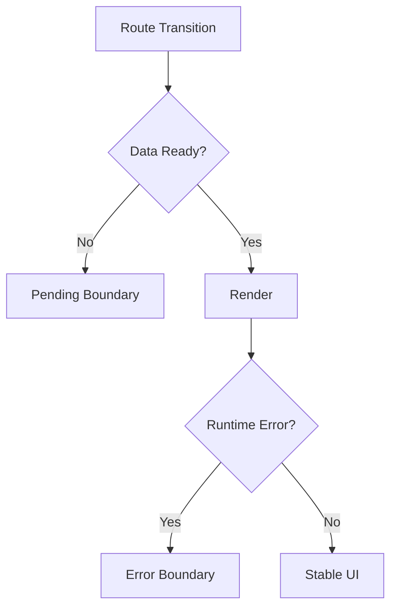

RSC를 도입한 뒤 사용자 경험이 흔들리는 가장 흔한 이유는 기능 부족이 아니라 경계 설계 부족입니다.
특히 아래 두 가지가 분리되지 않으면 장애가 바로 사용자 불신으로 이어집니다.

- 에러 경계(Error Boundary)
- 로딩 경계(Pending UI)

---

## 에러 경계: "어디까지 실패를 격리할 것인가"

라우트 단위 에러 경계의 목적은 단순 예외 처리보다 **장애 반경 최소화**입니다.

좋은 경계 설계의 특징:
- 실패한 섹션만 대체 UI로 격리
- 상위 레이아웃/네비게이션은 유지
- 재시도 경로가 명확

나쁜 경계 설계의 특징:
- 하위 데이터 실패가 전체 화면 파괴
- 사용자가 맥락을 잃음

---

## Pending UI: "기다림을 보이되, 불안을 주지 않기"

전환 중 로딩 상태를 숨기면 앱이 멈춘 것처럼 보이고, 과도하게 노출하면 깜빡임이 증가합니다.
핵심은 경계별로 다른 로딩 전략을 주는 것입니다.

- 상위 라우트: 안정적인 스켈레톤
- 하위 라우트: 최소 영역 스피너/placeholder
- 빠른 요청: 로딩 UI 생략 임계값 적용

---

## 권장 패턴

포인트는 단순합니다.
- 로딩은 "아직 성공하지 않음"
- 에러는 "명시적으로 실패함"
둘을 같은 UI로 처리하면 사용자 의사결정이 꼬입니다.

---

## 팀 운영 체크리스트

- [ ] 라우트별 ErrorBoundary 소유 팀이 지정돼 있는가
- [ ] Pending UI 노출 기준(시간/영역)이 문서화돼 있는가
- [ ] 장애시 사용자 복귀 경로(재시도/뒤로/홈)가 있는가
- [ ] 에러 로그가 라우트 단위로 집계되는가

---

## 마무리

RSC 환경에서 UX 품질은 렌더링 기술보다 경계 설계가 좌우합니다.
React Router v7의 장점은 이 경계를 라우트 단위로 모델링하고 운영 가능하게 만든다는 점입니다.

다음 글에서는 v6/Remix에서 v7 + RSC로 넘어갈 때의 점진 마이그레이션 전략을 정리하겠습니다.
