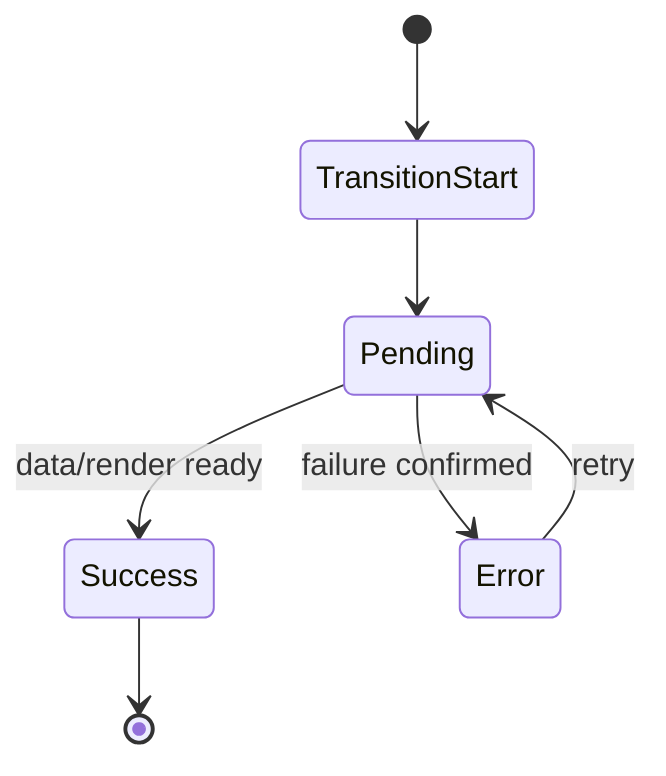

성능이 좋은 앱과 신뢰할 수 있는 앱은 다릅니다. React Router v7과 RSC를 함께 도입한 프로젝트에서 이 차이는 특히 크게 드러납니다. 로딩 지표는 좋아졌는데 사용자 불만이 늘어나는 케이스가 실제로 많습니다. 이유는 단순합니다. 사용자는 숫자가 아니라 **전환 경험**을 겪기 때문입니다.

전환 경험의 핵심은 두 가지입니다.

1. 지금 무엇이 진행 중인지 알 수 있는가 (Pending UI)
2. 실패했을 때 어디까지 망가졌는지, 어떻게 복구할 수 있는지 알 수 있는가 (Error Boundary)

이 글은 React Router v7 기준으로 RSC 환경에서 Error/Pending 경계를 어떻게 설계해야 운영 품질이 올라가는지 다룹니다.

---

## 왜 RSC 환경에서 경계 설계가 더 어려워지는가

RSC를 도입하면 렌더링/데이터 경로가 분리됩니다.

- 서버 컴포넌트 경로
- loader/action 기반 라우트 경로
- 클라이언트 상호작용 경로

문제는 실패/지연이 이 경로에서 각각 다르게 발생한다는 점입니다.

- 서버 컴포넌트 조합이 느려질 수 있음
- loader 응답이 늦을 수 있음
- action은 성공했지만 revalidation이 지연될 수 있음

즉 "로딩 중"이라는 단일 상태로 묶기 어려워집니다. 그래서 경계가 필요합니다. 경계는 UI 미관이 아니라 **상태 복잡도를 사용자에게 전달 가능한 형태로 단순화하는 장치**입니다.

---

## Error와 Pending을 분리하지 않으면 생기는 문제

많은 코드베이스는 로딩/실패를 한 컴포넌트에서 처리합니다. 처음엔 편해 보이지만 운영 단계에서 문제가 커집니다.

### 문제 1) 사용자 행동이 막힘

실패와 지연을 같은 UI로 보여주면 사용자는 다음 행동을 결정할 수 없습니다.

- 기다려야 하는가?
- 새로고침해야 하는가?
- 다시 시도해야 하는가?

행동 지침 없는 UI는 기술적으로는 동작해도 제품 신뢰를 떨어뜨립니다.

### 문제 2) 운영 로그의 해상도 하락

로딩/실패 상태를 한 레이어에 섞으면 관측성도 흐려집니다.

- pending timeout인지
- 실제 exception인지
- dependency API 장애인지

구분이 어려워 장애 분석 시간이 늘어납니다.

### 문제 3) 경계 소유권 충돌

MFE/멀티팀 구조에서는 "이 경계 누구 소유냐"가 중요합니다.
로딩과 실패가 섞이면 소유권도 흐려지고, 대응 SLA가 깨집니다.

---

## 경계 설계 원칙 1: 실패 반경을 먼저 결정한다

ErrorBoundary를 구현할 때 가장 먼저 해야 할 일은 컴포넌트 배치가 아니라 실패 반경 정의입니다.

질문:
- 이 라우트 섹션이 실패했을 때 전체 화면을 막아야 하는가?
- 상위 네비게이션/레이아웃은 살아 있어야 하는가?
- 실패한 영역만 격리해도 사용자 task가 유지되는가?

권장 원칙:
- 전체 task가 중단되는 경우만 상위 경계로 승격
- 도메인 섹션 실패는 하위 경계에서 격리
- "복구 가능한 실패"는 반드시 재시도 경로를 제공

---

## 경계 설계 원칙 2: Pending은 진행률이 아니라 맥락을 전달해야 한다

스피너를 보여주는 것 자체는 쉽습니다. 어려운 것은 맥락 전달입니다.

### 상위 경계 Pending

- 페이지 전환 자체가 진행 중임을 알려야 함
- 레이아웃이 흔들리지 않는 skeleton 권장

### 하위 경계 Pending

- 일부 영역 갱신임을 드러내야 함
- 최소 영역 placeholder 사용

### 짧은 요청 처리

요청이 매우 짧을 때 Pending UI를 무조건 노출하면 플리커가 생깁니다. 임계값(예: 150~250ms) 이하 요청은 pending 표시를 생략하거나 지연 노출하는 정책이 필요합니다.

---

## React Router v7 관점에서의 경계 모델

React Router v7의 장점은 라우트 단위로 상태 경계를 조직할 수 있다는 점입니다. 즉, Error/Pending UI를 "컴포넌트 취향"이 아니라 "라우트 계약"으로 관리할 수 있습니다.

권장 모델:

1. route-level boundary: 페이지 책임
2. section-level boundary: 도메인 책임
3. interaction-level boundary: 액션 책임

이 모델은 RSC/loader/action 혼합 환경에서 특히 유리합니다. 데이터 경로가 여러 개여도 사용자에게는 경계가 일관되게 보이기 때문입니다.

---

## 실무 시나리오: 저장 성공 후 stale UI

많이 발생하는 문제를 경계 관점으로 보겠습니다.

상황:
- action으로 수정 성공
- 토스트는 성공 메시지
- 리스트 영역은 이전 값 유지

원인:
- pending/commit/revalidation 상태가 분리되지 않음
- 사용자는 "성공"을 봤는데 데이터는 아직 old state

해결:
- action success는 "서버 반영 완료"로만 표현
- 화면 반영은 revalidation 완료 시점에 상태 전이
- 중간 상태는 section-level pending으로 노출

이렇게 분리하면 사용자 인지와 내부 상태가 맞춰집니다.

---

## 운영 관점: 경계를 문서화하지 않으면 반복된다

경계는 코드만으로 유지되지 않습니다. 운영 문서가 필요합니다.

필수 문서 항목:
- route id
- boundary owner team
- pending threshold
- retry policy
- fallback UX pattern
- logging fields

특히 owner가 중요합니다. 장애 발생 시 "누가 먼저 대응하는가"가 결정되어야 평균 복구 시간이 줄어듭니다.

---

## 관측성 설계: 로그 필드를 먼저 고정한다

Error/Pending 운영 품질을 높이려면 로그 필드를 표준화해야 합니다.

권장 필드:
- routeId
- boundaryId
- stateType (pending/error)
- durationMs
- retryCount
- sourcePath (RSC/loader/action)
- correlationId

이 필드를 기반으로 대시보드를 만들면, 체감 이슈를 숫자로 추적할 수 있습니다.

---

## 안티패턴 정리

1. **전역 스피너 만능주의**
   - 모든 전환을 전역 스피너로 처리하면 맥락 손실

2. **에러 메시지 노출만 하고 복구 경로 없음**
   - 기술적으로는 실패 노출, 제품적으로는 실패 방치

3. **pending 임계값 미설정**
   - 플리커로 체감 품질 하락

4. **경계 소유권 부재**
   - 장애 시 책임 공백

5. **revalidation 완료 전 성공 확정 UX**
   - 사용자 인지 불일치

---

## 경계 상태 머신 (권장)

포인트:
- Pending은 성공/실패 이전 상태
- Error는 확정 실패 상태
- Retry는 상태 전이를 명시적으로 재개

이 상태 머신을 PM/디자인/개발/QA가 공유하면 커뮤니케이션 비용이 크게 줄어듭니다.

---

## 팀 체크리스트

- [ ] route-level / section-level 경계가 구분되어 있는가
- [ ] pending threshold가 합의되어 있는가
- [ ] retry UX가 행동 가능한가
- [ ] action success와 data reflect completion을 구분하는가
- [ ] boundary owner가 문서에 명시되어 있는가
- [ ] 경계 로그 필드가 표준화되어 있는가

---

## 마무리

RSC 시대의 UX 품질은 렌더링 기술 그 자체보다 경계 설계에서 결정됩니다. React Router v7이 강한 이유는 이 경계를 라우트 단위로 표현하고, 운영 가능한 계약으로 만들 수 있다는 점입니다.

요약하면 다음과 같습니다.

- Pending은 "기다리세요"가 아니라 "지금 무슨 단계인지"를 전달해야 합니다.
- Error는 "실패했습니다"가 아니라 "어떻게 복구할지"를 제시해야 합니다.
- 경계는 코드 패턴이 아니라 운영 모델입니다.

다음 글에서는 이 경계를 깨지 않고 v6/Remix에서 v7 + RSC로 점진 전환하는 실전 전략을 이어서 다룹니다.
