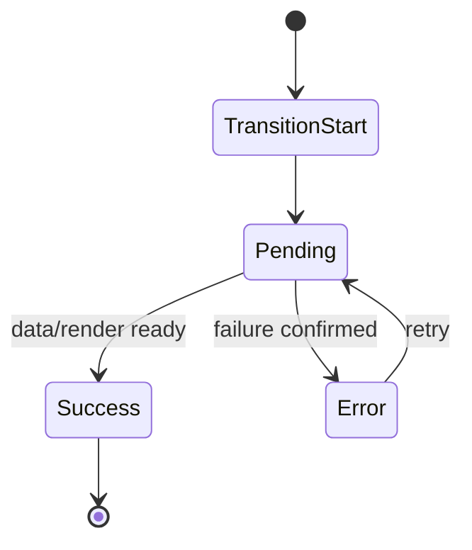

## 한눈에 보기

React Router 7과 RSC를 함께 쓰는 순간, 앱의 성능 숫자와 사용자의 체감 품질이 분리되기 시작합니다. TTFB나 렌더링 지표는 좋아졌는데, 사용자는 “왜 지금 멈춘 것처럼 보이는지”, “왜 성공했다고 했는데 화면은 그대로인지”, “어디를 다시 시도해야 하는지”를 모른 채 불안해합니다. 실무에서 문제가 되는 지점은 바로 여기입니다.

핵심은 기술 스택이 아니라 **경계(boundary)를 어디에, 어떤 책임으로 둘 것인가**입니다.
- Pending은 단순한 로딩 표시가 아니라 **사용자의 다음 행동을 안내하는 상태 언어**여야 합니다.
- Error는 실패 노출이 아니라 **복구 경로를 포함한 운영 계약**이어야 합니다.
- React Router 7은 이 두 상태를 라우트 단위로 조직할 수 있기 때문에, 컴포넌트 취향이 아닌 제품 레벨 합의로 끌어올리기 좋습니다.

이 글은 “어떻게 구현하느냐”보다 “왜 그렇게 설계해야 실제 운영에서 덜 깨지는가”를 중심으로 다룹니다. 결론만 먼저 말하면 다음과 같습니다.

1. 경계 설계의 시작점은 UI가 아니라 **실패 반경(failure radius)**입니다.
2. Pending과 Error를 분리하지 않으면 UX, 관측성, 책임 체계가 동시에 무너집니다.
3. RSC/loader/action이 혼재된 환경일수록, React Router 7의 route-level 계약이 품질을 지켜줍니다.
4. “성공” 이벤트와 “화면 반영 완료” 이벤트를 분리하지 않으면 신뢰가 급격히 떨어집니다.
5. 경계는 코드 패턴이 아니라 문서화된 운영 모델이어야 합니다.

---

## 들어가며

“성능이 좋아졌는데 왜 불만은 늘었을까요?”
React Router 7 + RSC 전환 프로젝트에서 정말 자주 듣는 질문입니다. 이 질문이 중요한 이유는, 팀이 보통 성능을 기술 지표로만 판단하기 때문입니다. 그러나 사용자는 지표를 보지 않습니다. 사용자는 흐름을 경험합니다. 즉, **전환의 순간**을 경험합니다.

RSC는 서버에서 더 많은 일을 처리하고, 클라이언트 번들을 줄이며, 초기 체감 성능을 개선하는 강력한 도구입니다. React Router 7은 라우트 단위 데이터 흐름과 상태 관리를 더 명확하게 잡을 수 있게 해줍니다. 문제는 이 둘이 만나면 상태 경로가 늘어난다는 점입니다. 전통적인 CSR 앱에서는 “로딩 중/완료/실패” 정도로 단순화되던 것이, RSC 환경에서는 다음처럼 분기됩니다.

- 서버 컴포넌트 스트림이 늦는 경우
- 특정 route loader만 늦는 경우
- action은 성공했는데 revalidation이 지연되는 경우
- 일부 섹션만 갱신되고 나머지는 이전 상태인 경우

즉, 사용자 눈에는 하나의 화면이지만, 내부적으로는 서로 다른 시간축의 상태가 동시에 공존합니다. 이때 전역 스피너 하나로 덮거나, 에러 메시지 한 문장으로 처리하면 어떤 일이 생길까요?
사용자는 “앱이 느린지, 실패한지, 기다려야 하는지, 내가 뭘 해야 하는지”를 판단할 수 없게 됩니다. 신뢰가 떨어지는 이유는 기술적 실패 때문만이 아닙니다. **인지 실패** 때문입니다.

그래서 실무에서 경계 설계는 미관의 문제가 아닙니다. 컴포넌트 분리 취향도 아닙니다. 경계 설계는 다음 세 가지를 동시에 해결하는 제품 아키텍처입니다.

1. 사용자 행동을 막지 않는 안내 체계
2. 장애를 빠르게 복구하기 위한 운영 관측성
3. 멀티팀 환경에서 책임을 분명히 하는 소유권 모델

React Router 7의 가치는 여기서 커집니다. 라우트는 단지 URL 매핑이 아니라, “이 경로의 데이터·실패·대기·복구를 누가 책임질 것인가”를 기술적으로 표현하는 단위가 됩니다. 그리고 이것이 RSC 시대의 품질 차이를 만듭니다.

---

## 트레이드오프

### 1) Pending과 Error를 분리하면 왜 복잡해지는데도 이득일까요

처음에는 한 컴포넌트에서 `isLoading || error`를 같이 처리하는 방식이 가장 간단해 보입니다. 하지만 이 단순함은 개발자 내부 단순함일 뿐, 사용자 경험 단순함이 아닙니다. 사용자는 “지연”과 “실패”를 전혀 다르게 해석합니다.

- 지연은 **기다릴 수 있는 상태**입니다.
- 실패는 **행동 전환이 필요한 상태**입니다.

둘을 섞으면 사용자는 기다려야 할지, 재시도해야 할지, 새로고침해야 할지 알 수 없습니다. 이때 생기는 문제는 단순 불편을 넘어선 운영 문제로 연결됩니다. 로그에서도 pending timeout인지 exception인지 분해가 안 되고, 장애 대응 시간은 늘어납니다.

결국 분리는 복잡도를 늘리는 것이 아니라, 복잡도를 **올바른 레이어로 이동**시키는 일입니다. 내부의 명시적 복잡도를 조금 늘려서, 외부의 암묵적 혼란을 줄이는 선택입니다.

---

### 2) 실패 반경을 작게 가져가면 항상 좋은가요

많은 팀이 “에러는 최대한 부분 격리”를 정답처럼 받아들입니다. 대체로 맞지만, 항상 맞지는 않습니다. 실패 반경을 지나치게 잘게 자르면 화면은 살아 있어 보이는데 실제로는 핵심 태스크를 완료할 수 없는 상태가 됩니다. 사용자는 “되는 척하는 앱”을 가장 싫어합니다.

예를 들어 결제/저장/승인 같은 핵심 플로우에서 핵심 섹션이 실패했는데 주변 UI만 정상처럼 보이면, 사용자는 잘못된 신호를 받습니다. 이 경우에는 상위 경계로 승격해서 “지금은 핵심 작업을 완료할 수 없음”을 분명히 보여주는 편이 더 신뢰를 지킵니다.

따라서 기준은 기술적 독립성이 아니라 **사용자 태스크 연속성**입니다.

- 태스크가 유지되면 하위 경계 격리
- 태스크가 중단되면 상위 경계 승격

이 판단을 먼저 해야 컴포넌트 트리 배치가 의미를 갖습니다.

---

### 3) Pending UI는 왜 “진행률”보다 “맥락”이 중요할까요

실무에서 흔한 오해는 “로딩 표시를 넣었으니 됐다”입니다. 하지만 스피너는 상태를 보여줄 뿐, 의미를 주지 않습니다. 사용자가 알고 싶은 것은 퍼센트가 아니라 **지금 어떤 단계가 진행 중인지**입니다.

- 페이지 이동 중인지
- 특정 목록만 갱신 중인지
- 버튼 액션은 끝났지만 화면 동기화가 남았는지

맥락 없는 로딩은 불안만 키웁니다. 특히 RSC + React Router 7에서는 일부 경로만 늦어질 수 있어 “어디가 느린지”를 알려주는 것이 중요합니다. 상위 레벨에서는 레이아웃 안정성을 유지하는 skeleton이 필요하고, 하위 레벨에서는 최소 영역 placeholder로 국소적인 변화임을 표현해야 합니다.

그리고 짧은 요청은 아예 표시를 늦춰야 합니다. 150~250ms 이하 요청에 매번 로딩을 띄우면 플리커가 발생하고, 사용자는 오히려 더 느리다고 느낍니다. 즉, Pending 정책에는 반드시 임계값이 들어가야 합니다.

---

### 4) React Router 7 라우트 경계 모델이 왜 실무 친화적인가요

React Router 7의 장점은 상태를 컴포넌트 취향이 아니라 라우트 계약으로 다룰 수 있다는 점입니다. 추천하는 구조는 다음 3단입니다.

1. **route-level boundary**: 페이지 책임
2. **section-level boundary**: 도메인 책임
3. **interaction-level boundary**: 액션 책임

이 구조가 중요한 이유는 RSC/loader/action의 소스가 달라도 사용자는 일관된 경계 경험을 얻기 때문입니다. 또한 팀 단위 소유권을 지정하기가 쉬워집니다. “이 routeId는 어느 팀이 장애 대응 SLA를 가진다”를 명시할 수 있고, 운영 문서·로그·알림 체계가 맞물립니다.

간단한 예시는 아래처럼 잡을 수 있습니다.

```tsx
// 예시: 개념 전달용 (축약)
export function ProductRoute() {
return (
<RouteBoundary routeId="products">
<Layout>
<SectionBoundary boundaryId="product-list">
<ProductList />
</SectionBoundary>

<SectionBoundary boundaryId="recommendations">
<Recommendations />
</SectionBoundary>
</Layout>
</RouteBoundary>
);
}
```

코드 포인트는 구현 디테일이 아니라 **명명된 경계 단위**입니다. 이름이 있어야 로그가 남고, 로그가 있어야 책임이 생기고, 책임이 있어야 복구가 빨라집니다.

---

### 5) “성공 토스트 + stale 화면”은 왜 반복될까요

실제 운영에서 가장 자주 보는 불일치는 이것입니다.

- 사용자 수정 요청 전송
- 서버 action 성공
- 토스트 “저장되었습니다”
- 그런데 리스트는 이전 값 유지

문제의 본질은 기술 버그가 아니라 상태 언어의 혼선입니다. 팀이 “action 성공”을 “사용자 관점 완료”로 잘못 번역한 것입니다. 사용자에게 완료란 서버 반영이 아니라 **화면에서 결과가 확인되는 순간**입니다.

그래서 상태를 최소 3단으로 분리해야 합니다.

1. submit/pending
2. action committed
3. revalidation reflected

두 번째와 세 번째를 합치면 신뢰가 깨집니다. 특히 투자/결제/권한 같은 민감 도메인에서는 “성공했는데 안 보인다”가 치명적인 불안을 유발합니다. 따라서 success 메시지의 시점 정의 자체를 팀 규약으로 가져가야 합니다.

---

### 6) 관측성은 왜 나중이 아니라 먼저 설계해야 할까요

경계 품질은 운영에서 드러납니다. 그런데 많은 팀이 경계를 먼저 코딩하고, 로그는 나중에 붙입니다. 그러면 이미 상태 모델이 섞여 있어서 어떤 필드를 남겨야 할지 합의가 어렵습니다.

처음부터 고정해야 할 필드는 아래 정도입니다.

- routeId
- boundaryId
- stateType(pending/error)
- durationMs
- retryCount
- sourcePath(RSC/loader/action)
- correlationId

이 필드만 일관되게 남겨도 “체감 느림” 제보를 기술 사건으로 역추적할 수 있습니다. 반대로 필드가 없으면 모든 장애가 “가끔 느림”으로 뭉개지고, 팀은 반복해서 같은 토론을 하게 됩니다.

---

### 7) 문서화 없는 경계는 왜 결국 무너질까요

경계는 코드로 시작하지만 운영으로 완성됩니다. 문서에 최소한 다음이 있어야 합니다.

- route id
- boundary owner team
- pending threshold
- retry policy
- fallback UX 패턴
- logging schema

특히 owner가 핵심입니다. 장애 시 “누가 먼저 본다”가 정해져 있지 않으면, 기술적으로 훌륭한 경계도 실제로는 방치됩니다. 멀티팀 구조에서 경계 설계의 목적은 예쁜 컴포넌트가 아니라 **책임의 자동 라우팅**입니다.

---

### 8) 안티패턴을 “왜”의 관점으로 다시 보면

1. 전역 스피너 만능주의
- 왜 문제인가: 상태 맥락이 사라져 사용자의 의사결정이 멈춥니다.

2. 에러 노출만 있고 복구 경로 없음
- 왜 문제인가: 실패를 전달했지만 행동을 닫아버려, UX 기준으로는 미완료입니다.

3. pending 임계값 없음
- 왜 문제인가: 플리커가 발생해 실제 속도보다 느리게 인지됩니다.

4. 경계 소유권 부재
- 왜 문제인가: 장애가 기술 이슈가 아니라 조직 이슈로 전환됩니다.

5. revalidation 전 성공 확정
- 왜 문제인가: 사용자 인지 모델과 시스템 상태 모델이 충돌합니다.

---

### 9) 상태 머신을 공유 언어로 쓰는 이유

경계 논의가 자꾸 감으로 흐르는 팀은 상태 머신을 문서 맨 앞에 두는 것만으로 정렬이 됩니다.



중요한 점은 화려한 다이어그램이 아닙니다.
- Pending은 성공/실패 이전의 가변 상태
- Error는 확정 실패 상태
- Retry는 명시적 전이

이 세 줄이 PM, 디자이너, QA, 개발자의 언어를 맞춰줍니다. 결과적으로 릴리스 후 “의도한 동작인지 버그인지” 논쟁이 크게 줄어듭니다.

---

## 마무리하며

React Router 7 + RSC 조합은 분명 강력합니다. 하지만 실무 품질을 가르는 건 프레임워크 선택 그 자체가 아닙니다. **경계를 운영 가능한 계약으로 만들었는가**입니다.
우리가 진짜로 설계해야 하는 것은 컴포넌트가 아니라 신뢰입니다.

신뢰는 세 가지에서 만들어집니다.

- 사용자가 지금 상태를 이해할 수 있는가
- 실패 시 다음 행동을 알 수 있는가
- 팀이 문제를 빠르게 추적하고 복구할 수 있는가

이 관점에서 보면 Pending은 로딩 장식이 아니고, ErrorBoundary는 예외 처리 장치가 아닙니다. 둘 다 사용자 행동과 팀 운영을 연결하는 인터페이스입니다. 그리고 React Router 7은 그 인터페이스를 라우트 단위로 명시할 수 있게 해줍니다.

실무에서 바로 적용하려면, 다음 순서로 시작하면 됩니다.

1. route별 실패 반경 정의
2. pending threshold 합의(예: 200ms)
3. action 성공과 화면 반영 완료 이벤트 분리
4. boundary owner와 로그 필드 문서화
5. QA 시나리오를 “성공/지연/실패/재시도” 전이 기준으로 재작성

결국 “왜 이 설계가 필요한가”에 대한 답은 단순합니다.
RSC 시대의 앱은 더 빨라졌지만, 상태는 더 복잡해졌기 때문입니다. 복잡해진 상태를 사용자가 이해할 수 있는 경험으로 번역하지 못하면, 성능 향상은 오히려 불신으로 돌아옵니다. React Router 7 기반 경계 설계는 그 번역을 가능하게 하는 가장 실용적인 방법 중 하나입니다.

---

## 더 읽어볼 자료

- React Router 공식 문서 (Data APIs, Pending UI, Error Boundaries)
https://reactrouter.com/

- React Server Components 개념 및 아키텍처 배경
https://react.dev/reference/rsc/server-components

- Remix/React Router 계열의 로딩·에러 UX 패턴 논의
https://remix.run/docs

- Web Vitals와 사용자 체감 성능의 관계(지표와 UX 간 간극 이해)
https://web.dev/vitals/

- 장애 관측성 설계 기초(OpenTelemetry 개념 참고)
https://opentelemetry.io/docs/
