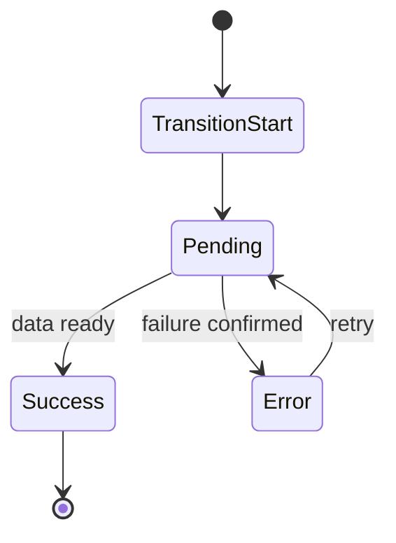

성능 최적화가 잘 되어도 사용자가 앱을 신뢰하지 못하는 순간이 있습니다. 대표적으로 두 경우입니다.

1. 로딩 중인지 멈춘 건지 알 수 없을 때
2. 일부 실패가 전체 실패처럼 보일 때

RSC를 도입한 앱에서는 이 문제가 더 미묘해집니다. 서버/클라이언트 경계가 늘어나면서 실패 지점도 다양해지고, 전환 중 상태가 복합적으로 섞이기 때문입니다. 그래서 React Router v7에서는 Error Boundary와 Pending UI를 "UI 장식"이 아니라 **운영 경계**로 다뤄야 합니다.

---

## 로딩과 실패를 같은 것으로 취급하면 왜 문제가 커지나

많은 코드베이스에서 다음 패턴이 보입니다.

- 데이터가 아직 없음 → 에러와 비슷한 UI
- 실제 에러 발생 → 로딩과 비슷한 UI

사용자는 둘을 구분하지 못하면 의사결정을 못 합니다. 기다려야 하는지, 재시도해야 하는지, 뒤로 가야 하는지 판단이 서지 않습니다. 결국 "앱이 불안정하다"는 인상만 남습니다.

### 원칙

- Pending: 아직 성공/실패가 확정되지 않은 상태
- Error: 실패가 확정된 상태

둘은 상태 전이가 다르므로, 경계와 UI도 달라야 합니다.

---

## Error Boundary 설계: 장애 반경을 줄이는 기술

Error Boundary의 목적은 예외를 잡는 것보다 **실패를 격리하는 것**입니다.

### 좋은 경계의 특징

- 실패한 라우트 영역만 대체
- 상위 레이아웃/내비게이션 유지
- 사용자 복구 경로(재시도/홈/뒤로) 제공

### 나쁜 경계의 특징

- 하위 API 실패가 전체 화면 중단으로 확산
- 에러 메시지는 있으나 행동 가능한 버튼이 없음
- 어떤 팀이 이 경계를 책임지는지 불명확

라우트 단위 경계를 운영 모델과 맞추면 장애 대응 속도가 크게 올라갑니다.

---

## Pending UI 설계: 기다림의 품질을 관리하기

로딩은 숨긴다고 없어지지 않습니다. 잘 보이게 하되 과하게 흔들리지 않게 해야 합니다.

### 권장 패턴

1. 상위 경계는 안정적 스켈레톤
2. 하위 경계는 최소 영역 placeholder
3. 짧은 요청엔 로딩 UI 생략 임계값 적용
4. 전환 취소 시 UI 롤백 규칙 명확화

핵심은 "항상 스피너"가 아닙니다. 사용자에게 진행 상태와 기대 시간을 일관되게 전달하는 것입니다.

---

## RSC + Router에서 자주 나는 UX 버그

1. **Streaming 중 중간 실패 처리 누락**
   - 일부 섹션만 깨져야 하는데 전체가 fallback으로 전환

2. **Pending UI 플리커**
   - 짧은 요청마다 로딩 컴포넌트가 깜빡여 체감 악화

3. **재시도 동선 부재**
   - 에러 화면은 나오지만 회복 버튼이 없음

4. **에러 경계 소유권 부재**
   - "이건 플랫폼팀 문제인가 도메인팀 문제인가"로 시간 소모

---

## 권장 상태 다이어그램

이 상태 다이어그램을 코드/디자인/QA가 공유하면, 오류 재현과 수정 속도가 크게 좋아집니다.

---

## 운영 관점: 경계를 문서화해야 하는 이유

기술적으로만 해결하면 다시 깨집니다. 운영 문서가 필요합니다.

필수 문서 항목:

- 라우트별 ErrorBoundary owner
- Pending UI 노출 기준(ms)
- 재시도 정책(자동/수동)
- 로깅 필드(route id, boundary id, error code)

이 문서가 있으면 장애시 채널에서 "누가 먼저 움직일지"가 명확해집니다.

---

## 팀 체크리스트

- [ ] Error/Pending UI를 상태 전이 기준으로 구분했는가
- [ ] 라우트별 경계 소유 팀이 지정돼 있는가
- [ ] 재시도/복구 동선이 실제로 동작하는가
- [ ] 플리커 방지 임계값을 합의했는가
- [ ] 에러 로그가 경계 단위로 수집되는가

---

## 마무리

RSC 환경에서 UX 품질은 렌더링 기술보다 경계 설계가 좌우합니다. React Router v7의 강점은 이 경계를 라우트 단위로 모델링하고 운영 가능한 규칙으로 만드는 데 있습니다.

다음 글에서는 이 경계를 깨지 않으면서 v6/Remix에서 v7 + RSC로 점진 전환하는 전략을 정리하겠습니다.
