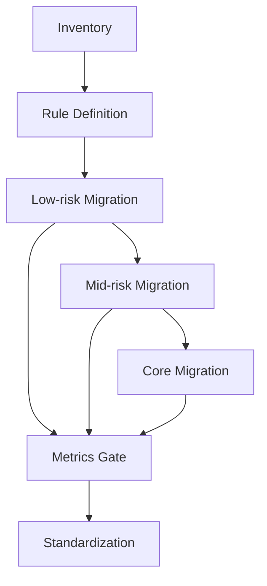

마이그레이션은 기술 이벤트처럼 보이지만, 실제로는 조직 운영 이벤트입니다. React Router v6/Remix 기반 앱을 v7 + RSC로 옮길 때도 본질은 같습니다. 코드가 돌아가는지보다 중요한 것은 **지속 가능한 상태로 전환하는가**입니다.

이 글은 "빅뱅 전환" 대신 점진 전환을 전제로, 실무에서 실패율을 낮추는 전략을 정리합니다.

---

## 왜 빅뱅 전환이 위험한가

대다수 팀은 다음 조건을 동시에 갖습니다.

- 기능 개발을 멈출 수 없음
- 장애 허용치가 낮음
- 팀별 숙련도와 소유 경계가 다름
- 데이터 경로가 이미 복잡함

이 상태에서 전체 라우팅/데이터 경계를 한 번에 바꾸면,
기술 부채보다 운영 부채가 먼저 폭발합니다.

대표 증상:
- 배포 후 장애 원인 추적 불가
- rollback은 가능한데 데이터 일관성 복구가 안 됨
- 팀 간 "누가 고칠지" 논쟁 증가

그래서 점진 전환은 보수적 선택이 아니라, 실무에서는 가장 빠른 선택입니다.

---

## 전환 목표를 "완료"가 아니라 "안정한 단계"로 정의한다

전환을 시작할 때 목표를 잘못 잡으면 끝까지 흔들립니다.

나쁜 목표:
- "3주 안에 v7 전환 완료"

좋은 목표:
- "읽기 중심 라우트 20%를 v7 경계로 이관하고, 에러율과 전환 지표를 baseline 대비 유지"

즉 상태 기반 목표를 잡아야 합니다.

---

## 1단계: 인벤토리 (코드보다 먼저)

전환 전에 반드시 문서화할 항목:

1. 라우트 트리 + 소유 팀
2. loader/action 사용 지점
3. error/pending boundary 위치
4. 핵심 도메인별 read/write 소유권
5. baseline 성능/에러 지표

이 문서가 없으면 나중에 "무엇이 좋아졌는지" 증명할 수 없습니다.

---

## 2단계: 책임 규칙 고정 (RSC vs loader/action)

RSC를 도입한다고 loader/action이 사라지지 않습니다.
먼저 분리 규칙을 고정해야 합니다.

- RSC: server-heavy read composition
- loader: route transition-bound read
- action: write + revalidation trigger

규칙 없이 옮기면 중복 fetch/stale conflict가 반복됩니다.

---

## 3단계: 전환 단위 선택

권장 순서:

1) 저위험 읽기 라우트
2) 중간 복잡도 라우트
3) write-heavy 핵심 라우트

이 순서의 장점:
- 학습 비용을 작은 장애 반경에서 지불
- 관측성/롤백 루틴을 초기부터 검증
- 조직 신뢰를 유지한 채 확장

---

## 4단계: feature flag + rollback first

전환 배포는 항상 되돌릴 수 있어야 합니다.

필수:
- 라우트/도메인 단위 feature flag
- rollback 시나리오 문서
- rollback 담당자와 실행 시간 목표

중요 포인트는 "코드를 되돌리는 것"이 아니라 "상태를 되돌릴 수 있는가"입니다.

---

## 5단계: 게이트 기반 배포

PR/배포 게이트를 설정합니다.

권장 게이트:
- transition latency
- error rate
- duplicate request ratio
- bundle delta
- recovery time (장애 복구 시간)

게이트 없는 전환은 결국 개인 감각에 의존하게 됩니다.

---

## MFE 환경에서 추가로 필요한 것

MFE에서는 전환이 팀 단위로 분산됩니다. 그래서 아래가 필수입니다.

1. Shell/Fragment 계약 업데이트
2. cross-team RFC 절차
3. 공통 observability schema
4. boundary ownership registry

이 4개가 없으면 기술적으로 전환돼도 운영은 붕괴합니다.

---

## 전형적인 실패 시나리오

### 실패 1) 핵심 라우트부터 전환

이유: "효과 크게 보자"
결과: 작은 버그도 대형 장애

### 실패 2) 문서 없이 코드 우선

이유: "먼저 만들어보자"
결과: 소유권 충돌 + 회귀 반복

### 실패 3) rollback 없는 실험

이유: "문제 없을 것 같음"
결과: 긴급 대응 시 품질/신뢰 동시 하락

---

## 추천 상태 전이 모델

핵심은 각 단계마다 게이트가 있다는 점입니다.

---

## 팀 운영 체크리스트

- [ ] 라우트/소유권 인벤토리가 최신인가
- [ ] RSC/loader/action 분리 규칙이 문서화됐는가
- [ ] feature flag와 rollback 경로가 준비됐는가
- [ ] baseline 지표와 비교 대시보드가 있는가
- [ ] cross-team RFC 루프가 작동하는가

---

## 마무리

v7 + RSC 전환의 핵심은 기술 전환이 아니라 운영 전환입니다. 작은 단위로 옮기고, 경계를 명확히 하고, 지표와 rollback으로 제어하면 실패 비용을 크게 줄일 수 있습니다.

전환 성공의 기준은 "새로운 API를 쓴다"가 아니라,

> 장애를 내지 않고, 장애가 나도 빨리 복구할 수 있는 구조로 바뀌었는가

입니다.

다음 글(시리즈 마지막)에서는 이 전환을 MFE 조직 운영 패턴으로 고정하는 방법을 정리합니다.
