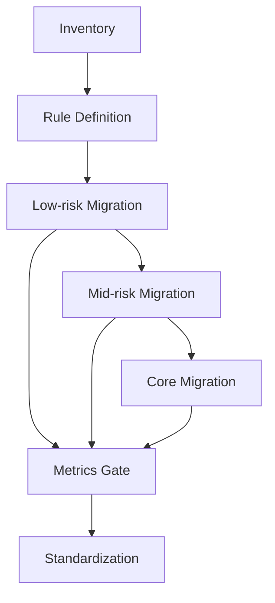

## 한눈에 보기

React Router 7 + RSC 전환은 프레임워크 업그레이드가 아니라 **운영 모델 전환**입니다.
팀이 실제로 마주하는 문제는 API 학습 자체보다, 기능 개발과 안정성을 동시에 유지해야 한다는 점입니다.

실무에서 바로 적용할 핵심만 먼저 정리하면 다음과 같습니다.

- 목표는 “완료율”이 아니라 **안정한 단계**여야 합니다.
- RSC·loader·action의 책임을 먼저 고정하지 않으면 중복 fetch와 stale 데이터가 반복됩니다.
- 전환 순서는 기술 선호가 아니라 **위험도 기반**이어야 합니다.
- feature flag, rollback runbook, 운영 게이트 지표가 없으면 전환은 감각 의사결정으로 무너집니다.
- MFE 환경에서는 코드보다 **경계 소유권과 관측성 계약**이 성패를 가릅니다.

한 문장으로 요약하면 이렇습니다.

> 기능 개발을 멈추지 않은 상태에서, 장애 반경을 통제하고, 복구 시간을 줄이는 구조로 전환해야 합니다.

---

## 들어가며

React Router v6/Remix에서 v7 + RSC로 넘어가는 논의는 보통 성능, DX, 최신 아키텍처로 시작합니다.
이 관점은 맞습니다. 다만 실무에서는 한 질문이 더 중요합니다.

**왜 지금, 우리 조직에서, 이 전환이 성공할 수 있는가입니다.**

많은 전환이 실패하는 이유는 기술이 부족해서가 아닙니다.
로컬에서는 잘 동작하지만 운영에서는 실패합니다.
배포 파이프라인, 온콜 체계, 팀별 소유권, 관측성, 릴리즈 리듬이 함께 바뀌지 않기 때문입니다.

특히 MFE 조직에서는 팀마다 배포 속도와 숙련도가 다릅니다.
일부 팀은 RSC 경계 설계가 익숙하고, 일부 팀은 기존 loader/action 패턴에 최적화되어 있습니다.
이 차이를 무시하면 “전환 완료”는 찍히더라도 운영 품질은 오히려 떨어집니다.

그래서 이 글은 API 소개보다 운영 관점에 집중합니다.
핵심은 세 가지입니다.

1. 무엇을 먼저 옮길지 정하는 기준입니다.
2. 어떤 경계를 계약으로 고정할지입니다.
3. 장애 시 복구 가능한 시스템을 어떻게 먼저 만들지입니다.

---

## 본문

### 문제: 왜 빅뱅 전환이 반복적으로 실패하는가

빅뱅 전환은 일정표상으로는 깔끔해 보입니다.
하지만 실무에서는 다음 변경이 같은 주기에 겹칩니다.

- 라우트 경계 재설계
- 데이터 패칭 경로 변경
- pending/error boundary 재배치
- 캐시/재검증 정책 변경
- 팀 간 소유권 이동

이 다섯 축이 동시에 흔들리면, 장애가 나도 원인 분리가 거의 불가능해집니다.
겉으로는 네트워크 지연처럼 보여도 실제 원인은 책임 중복일 수 있고,
코드를 롤백해도 상태 오염 때문에 증상이 남습니다.

즉 빅뱅 전환의 핵심 리스크는 “기술 난이도”보다 **관측 불가능성**입니다.
원인을 설명할 수 없으면 팀은 보수적으로 변하고,
전환 속도는 급격히 떨어지며,
결국 기능 개발과 전환 모두 손해를 보는 상태가 됩니다.

### 원인: 완료 지향 계획이 운영 품질을 망가뜨리는 구조

전환 계획 문서에 “n주 내 100% 전환”이 들어가면 의사결정이 왜곡됩니다.

- 테스트·관측성 투자보다 일정 준수가 우선됩니다.
- 위험이 낮은 영역보다 가시성이 높은 핵심 화면부터 건드리게 됩니다.
- 실패 시 원인 분석보다 일정 방어가 우선됩니다.

그래서 목표를 “완료”에서 “안정한 단계”로 바꿔야 합니다.
예를 들면 아래와 같은 목표가 실무적으로 유효합니다.

- 읽기 중심 라우트 20% 이관
- 전환 구간 error rate baseline 대비 ±x% 이내 유지
- p95 transition latency 악화 없음
- rollback drill 15분 내 완료

이 방식은 화려하지 않지만 팀이 감당 가능한 속도를 만듭니다.
전환은 단기 성과 이벤트가 아니라 장거리 운영이기 때문입니다.

### 원리: RSC·loader·action 경계를 먼저 고정해야 하는 이유

RSC를 도입하면 흔히 “이제 서버에서 다 하면 되나?”라는 질문이 나옵니다.
문제는 가능성 중심으로 설계하면 경계가 무너진다는 점입니다.
실무에서는 “무엇이 가능한가”보다 “무엇을 어디에 두는가”가 더 중요합니다.

가장 충돌이 적은 기본 원칙은 다음과 같습니다.

- **RSC**: 서버 조합 가치가 큰 읽기
- **loader**: 라우트 전환 시점에 필요한 읽기
- **action**: 쓰기 의도 처리 + 재검증 트리거

아래 예시는 코드 자체보다 책임 분리 관점이 중요합니다.

```tsx
// RSC: 서버 조합 읽기
export default async function ProductPageRSC({ params }) {
const product = await getProduct(params.id);
const price = await getRealtimePrice(params.id);
return <ProductView product={product} price={price} />;
}

// loader: 전환 시점 read
export async function loader({ params }) {
return json(await getRelatedItems(params.id));
}

// action: 쓰기 + 재검증 트리거
export async function action({ request }) {
const form = await request.formData();
await updateWishlist(String(form.get("productId")));
return redirect("/wishlist");
}
```

이 규칙을 문서 계약으로 고정하지 않으면 다음 문제가 반복됩니다.

- 같은 화면에서 서버·클라이언트 중복 요청
- 특정 라우트에서만 stale 데이터 재현
- 재검증 트리거 누락으로 부분 갱신 실패
- 온콜 시 “누가 책임지는가”가 모호해 복구 지연

경계 계약은 개발 편의를 줄이는 장치가 아닙니다.
**디버깅 시간을 줄이고 복구 예측성을 높이는 장치**입니다.

### 운영: 위험도 기반 전환, 게이트, 롤백을 하나의 시스템으로 묶기

전환 순서는 보통 다음이 가장 안전합니다.

1. 읽기 중심 저위험 라우트
2. 중간 복잡도 라우트
3. 쓰기 핵심 라우트

이 순서의 장점은 명확합니다.

- 사용자 피해 반경이 작습니다.
- 운영 루틴(계측·롤백·커뮤니케이션)을 실트래픽에서 검증할 수 있습니다.
- 팀 간 공통 언어를 만들 시간이 생깁니다.

여기에 반드시 붙어야 하는 것이 feature flag와 rollback 체계입니다.
최소 요건은 아래와 같습니다.

- 라우트/도메인 단위 flag
- rollback runbook + 담당자 + 권한 확인
- RTO(복구 목표 시간) 명시
- 상태 복구 전략(재검증·캐시 무효화·중복 쓰기 정리)

중요한 포인트는 하나입니다.

> 코드를 되돌릴 수 있는가보다, 상태를 되돌릴 수 있는가가 더 중요합니다.

실제 사고는 코드보다 상태 계층에 오래 남습니다.
action 경로 변경으로 생긴 중복 쓰기, 재검증 누락, 캐시 오염은
git revert만으로 해결되지 않습니다.

따라서 전환은 “배포 성공률”이 아니라 “복구 예측성”으로 관리해야 합니다.

### 운영 지표: 감각 의사결정을 막는 최소 게이트

전환 기간에 가장 위험한 것은 데이터가 아니라 분위기입니다.
숫자가 없으면 결국 목소리 큰 사람의 감각이 의사결정을 지배합니다.

실무에서 최소한 아래 다섯 가지는 게이트로 두는 것이 좋습니다.

- transition latency (p95/p99)
- route/action error rate
- duplicate request ratio
- bundle size delta
- detection-to-recovery time

각 지표는 실패 패턴과 직접 연결됩니다.

- latency 악화: 경계 설계 실패 또는 서버 조합 과부하
- error rate 상승: 데이터 계약/예외 경계 불일치
- duplicate ratio 상승: RSC·loader 책임 중복
- bundle 증가: 클라이언트 경계 누수
- recovery time 증가: runbook·권한·연락 체계 미비

게이트는 속도를 늦추는 장치가 아닙니다.
잘못된 방향으로 빠르게 가는 것을 막아 총 리드타임을 줄이는 장치입니다.

### MFE 실무 포인트: 기술보다 계약이 먼저입니다

MFE에서는 “우리 팀만 정리하면 된다”가 성립하지 않습니다.
Shell, Fragment, Shared Contract가 결합되어 있기 때문입니다.

v7 + RSC 전환 시 최소한 다음 네 가지 운영 계약이 필요합니다.

1. **Shell/Fragment 경계 계약**: 라우트·데이터·에러 표면 명시
2. **Cross-team RFC 루프**: 설계 변경이 팀 내부에서 닫히지 않게 유지
3. **공통 관측성 스키마**: 로그/메트릭 키를 표준화
4. **Boundary Ownership Registry**: 장애 시 단일 책임자 즉시 식별

이 네 가지가 없으면 기술적으로는 배포되어도 운영은 분절됩니다.
문제가 생겼을 때 “누구 문제인가”로 시간이 소모되면,
복구 시간이 길어지고 전환 신뢰가 빠르게 무너집니다.

### 단계 모델: 전환을 프로젝트가 아니라 운영 루프로 다루기

아래 순서는 구현 단계라기보다 운영 통제 단계입니다.



핵심은 각 단계마다 게이트가 있다는 점입니다.
게이트 없는 단계는 개인 역량 의존 구간이 되고,
개인 의존이 커질수록 조직 확장성과 예측 가능성은 낮아집니다.

### React Router 7 + RSC 실무 운영 체크리스트

실제로 현장에서 효과가 큰 것은 거대한 설계 문서보다, 배포 직전에 확인하는 짧고 단단한 체크리스트입니다.
아래 항목은 React Router 7 + RSC 실무 운영에서 반복적으로 문제가 되던 지점을 압축한 것입니다.

- 이번 배포에서 바뀐 라우트 경계가 명확히 문서화되어 있는가입니다.
- RSC와 loader가 동일 데이터를 이중으로 가져오지 않는가입니다.
- action 이후 재검증 대상이 화면 단위로 합의되어 있는가입니다.
- rollback 시 되돌려야 할 상태(캐시·큐·중복 쓰기)가 정의되어 있는가입니다.
- 온콜 담당자가 runbook 경로와 실행 권한을 이미 확인했는가입니다.

여기서 중요한 것은 체크리스트를 “QA 단계 문서”로만 두지 않는 것입니다.
PR 템플릿, 배포 승인 절차, 온콜 인수인계에 같은 항목을 공유해야 React Router 7 + RSC 실무 운영이 개인 습관이 아니라 팀 시스템으로 고정됩니다.

또 하나의 실무 팁은 전환 성공 기준을 기능팀과 플랫폼팀이 동일하게 읽게 만드는 것입니다.
기능팀은 사용자 시나리오 단위의 회귀를 먼저 보고,
플랫폼팀은 지표 악화와 복구 시간을 먼저 보게 됩니다.
두 관점을 한 문장으로 합치면 “사용자 가치 훼손 없이 복구 가능해야 한다”가 됩니다.
이 문장을 릴리즈 기준으로 합의하면 논쟁이 줄고 의사결정 속도가 빨라집니다.

---

## 트레이드오프

전환은 정답이 아니라 선택입니다.
선택에는 이익과 비용이 동시에 존재합니다.
아래 항목을 시작 전에 합의해두면, 전환 중 논쟁 비용을 크게 줄일 수 있습니다.

| 항목 | 얻는 것 | 치르는 비용 | 실무 권장 기준 |
|---|---|---|---|
| 성능 잠재력 vs 운영 복잡도 | 서버 조합 최적화, 초기 렌더 효율 | 경계 증가로 디버깅 난도 상승 | 경계 규칙 문서 + 공통 로그 키 선행 |
| 서버 중심 조합 vs 팀 역량 분포 | 읽기 경로 단순화, 일관성 | 특정 인력 병목 위험 | 난이도별 라우트 배치 + 페어링 리뷰 |
| 점진 전환 안정성 vs 기간 장기화 | 장애 반경 통제, 학습 누적 | 혼합 체제 유지 비용 | 스프린트마다 legacy 정리 목표 포함 |
| 강한 게이트 vs 초기 체감 속도 | 재작업/복구 비용 절감 | 초반 배포가 느리게 느껴짐 | 3~6개월 총 리드타임 기준으로 평가 |
| 공통 규칙 vs 팀 자율성 | 일관된 품질·예측성 | 예외 구현 유연성 감소 | 예외 허용 조건을 문서화해 제한 허용 |

핵심은 “무엇이 더 좋다”가 아닙니다.
우리 조직의 실패 비용 구조에서 어떤 선택이 더 싸게 유지되는지 계산하는 일입니다.

---

## 마무리하며

React Router 7 + RSC 전환의 성공 기준은 새 API 사용량이 아닙니다.
다음 질문에 “예”라고 답할 수 있으면 성공입니다.

- 기능 개발을 멈추지 않고 전환했는가입니다.
- 장애 반경을 사전에 통제할 수 있었는가입니다.
- 장애 시 복구 시간이 실제로 짧아졌는가입니다.
- 팀 간 경계·책임·의사결정 기준이 명확해졌는가입니다.
- 운영이 특정 개인이 아니라 시스템으로 굴러가는가입니다.

결국 점진 전환은 느린 전략이 아닙니다.
실무에서 가장 빠르게 성공하는 전략입니다.
빨리 도착하는 팀은 보통 빨리 코딩한 팀이 아니라,
실패 비용을 작게 쪼개고 복구 가능한 구조를 먼저 만든 팀입니다.

v7 + RSC의 잠재력은 분명합니다.
다만 잠재력은 자동으로 현실이 되지 않습니다.
규칙, 관측성, 롤백, 소유권 계약이 함께 설계될 때만
성능 개선과 운영 안정성이 동시에 현실이 됩니다.

---

## 더 읽어볼 자료

- React Router 공식 문서
https://reactrouter.com/
- React Router Framework/Data 라우팅 개요
https://reactrouter.com/start/framework/installation
- Remix 공식 문서(데이터 로딩·액션 모델 비교)
https://remix.run/docs
- React Server Components 공식 레퍼런스
https://react.dev/reference/rsc/server-components
- Martin Fowler — Micro Frontends
https://martinfowler.com/articles/micro-frontends.html
- Google SRE Workbook (릴리즈·복구·운영 지표)
https://sre.google/workbook/table-of-contents/
- Thoughtworks Technology Radar
https://www.thoughtworks.com/radar
