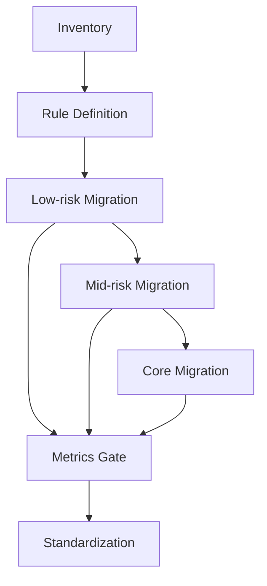

## 한눈에 보기

React Router 7 + RSC 전환은 프레임워크 업그레이드가 아니라 **운영 모델 전환**입니다.
많은 팀이 “새 API 도입”을 목표로 잡고 시작하지만, 실무에서 성패를 가르는 기준은 다음 한 줄로 정리됩니다.

> 기능 개발을 멈추지 않은 상태에서, 장애 반경을 통제하며, 복구 시간을 줄이는 구조로 바꿀 수 있는가입니다.

이 글의 핵심 메시지는 아래 다섯 가지입니다.

1. **빅뱅 전환은 기술 리스크보다 운영 리스크가 더 큽니다.**
코드가 맞아도 팀이 감당 못 하면 실패입니다.

2. **목표는 ‘완료’가 아니라 ‘안정한 단계’여야 합니다.**
예: “3주 안에 끝내기”가 아니라 “저위험 읽기 라우트 20% 이관 + SLO 유지”입니다.

3. **RSC/loader/action 책임을 먼저 고정해야 합니다.**
규칙 없이 옮기면 중복 fetch, stale 데이터, 재검증 혼선이 반복됩니다.

4. **전환 단위는 위험도 기반이어야 합니다.**
읽기 중심 → 중간 복잡도 → 쓰기 핵심 라우트 순서가 실무적으로 가장 안전합니다.

5. **feature flag + rollback + 게이트 지표가 없으면 전환은 ‘느낌’으로 흘러갑니다.**
전환은 용기가 아니라 제어 시스템으로 이기는 일입니다.

---

## 들어가며

React Router v6/Remix에서 v7 + RSC로 넘어가는 논의는 보통 “성능”, “개발 경험”, “최신 아키텍처” 같은 기술 키워드로 시작됩니다. 맞는 이야기입니다. 다만 실무에서는 그보다 더 먼저 물어야 할 질문이 있습니다.

**왜 지금 전환해야 하는가입니다.**
그리고 그 다음 질문은 더 중요합니다.
**왜 이 전환이 우리 조직에서 성공할 수 있는가입니다.**

기술 글에서 자주 놓치는 지점이 여기입니다. 프레임워크 전환은 로컬 머신에서 끝나지 않습니다. 배포 파이프라인, 장애 대응 체계, 팀 간 소유권, 온콜 부담, 데이터 계약, 릴리즈 달력까지 전부 영향을 받습니다. 그래서 전환은 코드 변경 이벤트가 아니라 조직 운영 이벤트입니다.

React Router 7과 RSC 조합이 매력적인 이유는 분명합니다. 서버에서 읽기 조합을 더 자연스럽게 처리하고, 클라이언트가 해야 할 일을 줄이며, 라우트 전환 시 데이터 경계를 더 명시적으로 설계할 수 있습니다. 그러나 “좋은 기술”과 “우리 팀에서 성공하는 기술”은 다릅니다.
좋은 기술이 실패하는 가장 흔한 이유는 구현 난이도가 아니라 **도입 순서가 잘못되기 때문**입니다.

많은 팀이 다음과 같은 압력을 동시에 받습니다.

- 기능 개발을 멈출 수 없습니다.
- 프로덕션 장애 허용치가 낮습니다.
- 팀별 숙련도와 코드 소유 경계가 균질하지 않습니다.
- 이미 복잡한 데이터 경로 위에서 운영 중입니다.
- MFE 구조라면 팀 간 릴리즈 속도도 제각각입니다.

이 조건에서 “한 번에 갈아엎자”는 계획은 멋져 보이지만, 실제로는 복구 불가능한 상태를 만들 확률이 높습니다. 전환의 본질은 새 구조를 빨리 도입하는 일이 아니라, **기존 가치를 잃지 않고 새 구조를 흡수하는 일**이기 때문입니다.

그래서 이 글은 “어떻게 v7 + RSC를 쓰는가”보다,
**왜 점진 전환이 실무에서 가장 빠른 전략인지**,
그리고 **어떤 운영 장치를 먼저 깔아야 실패비용을 줄일 수 있는지**를 다룹니다.

---

### 1) 왜 빅뱅 전환이 반복적으로 실패하는가

빅뱅 전환의 가장 큰 착각은 “한 번에 끝내면 오히려 리스크가 줄어든다”입니다.
실제로는 반대입니다. 리스크 총량은 비슷해 보여도, **동시 폭발 반경**이 커집니다.

- 라우팅 경계 변경
- 데이터 패칭 경로 변경
- 에러/펜딩 경계 재배치
- 캐시/재검증 정책 변경
- 팀 간 소유권 변화

이 다섯 가지가 같은 주기에 겹치면, 장애가 났을 때 원인을 분해하기가 매우 어렵습니다.
문제가 하나여도 증상은 여러 군데에서 터집니다. 예를 들어 중복 요청은 네트워크 이슈처럼 보이지만, 실제 원인은 RSC와 loader 책임 중복일 수 있습니다. 혹은 rollback을 했는데도 데이터 일관성이 안 맞는 상황이 생깁니다. 코드 버전은 돌아갔지만 상태는 돌아가지 않았기 때문입니다.

즉, 빅뱅 전환의 실패는 기술 미숙보다 **관측 불가능성**에서 시작됩니다.
무슨 일이 왜 일어났는지 설명할 수 없으면, 팀은 빠르게 보수적으로 변하고 전환 동력을 잃습니다.

---

### 2) 목표를 “완료율”이 아니라 “안정도”로 바꿔야 하는 이유

전환 계획 문서에 “n주 내 100% 전환”이 적혀 있으면 보기에는 명확합니다. 하지만 이 목표는 실무에서 두 가지 부작용을 만듭니다.

- 일정 압박이 테스트/관측성 투자를 밀어냅니다.
- “완료”를 위해 저위험이 아닌 고가시성 영역부터 건드리게 됩니다.

반대로 상태 기반 목표는 전환 품질을 지킵니다. 예를 들어 이런 식입니다.

- 읽기 중심 라우트 20%를 v7 경계로 이관
- 전환 구간 error rate를 baseline 대비 ±x% 이내 유지
- p95 전환 지연 악화 없음
- rollback drill 15분 내 완료 가능

이 목표들은 화려하지 않지만, 조직이 감당 가능한 속도로 진화하게 만듭니다.
전환은 단거리 경주가 아니라 **서비스 품질을 유지한 채 구조를 바꾸는 장거리 운영**이기 때문입니다.

---

### 3) 인벤토리를 먼저 만드는 이유: “좋아졌는지”를 증명하려면

인벤토리는 지루합니다. 그래서 대부분 건너뜁니다.
하지만 인벤토리 없는 전환은 “체감상 좋아진 것 같은데?” 수준에서 끝나기 쉽습니다.

최소한 아래는 전환 전에 고정되어야 합니다.

1. 라우트 트리 + 소유 팀
2. loader/action 사용 지점
3. error/pending boundary 위치
4. 도메인별 read/write 권한과 데이터 출처
5. baseline 성능/에러/복구 지표

왜 중요할까요?
전환은 결국 “비용을 내고 구조를 바꾸는 의사결정”입니다. 그 비용이 정당했는지 증명하지 못하면, 다음 전환에서 조직 신뢰를 얻지 못합니다. 인벤토리는 문서 작업이 아니라 **신뢰 자산**입니다.

---

### 4) RSC, loader, action 책임을 왜 먼저 고정해야 하는가

RSC를 도입하면 “이제 다 서버에서 하면 되나?”라는 질문이 나옵니다.
여기서 규칙 없이 출발하면 거의 반드시 데이터 경합이 생깁니다.

실무적으로 가장 많이 쓰는 책임 분리는 다음과 같습니다.

- **RSC**: 서버에서 조합 가치가 큰 읽기(aggregation, auth-aware composition, expensive read)
- **loader**: 라우트 전환 시점의 읽기(transition-bound read)
- **action**: 쓰기 + 재검증 트리거(write intent + revalidation trigger)

핵심은 “무엇이 가능한가”가 아니라 “무엇을 어디에 둘지 팀이 합의했는가”입니다.
합의가 없으면 개발자는 안전을 위해 중복 호출을 넣고, QA는 재현이 어려운 stale 버그를 만나고, 온콜은 원인 파악에 시간을 다 씁니다.

아래는 책임 경계의 예시입니다(개념 예시).

```tsx
// 개념 예시: 역할 분리 관점
// RSC: 서버 조합 읽기
export default async function ProductPageRSC({ params }) {
const product = await getProduct(params.id);
const price = await getRealtimePrice(params.id);
return <ProductView product={product} price={price} />;
}

// loader: 전환 시점 라우트 read
export async function loader({ params }) {
return json(await getRelatedItems(params.id));
}

// action: 쓰기 + 재검증 트리거
export async function action({ request }) {
const form = await request.formData();
await updateWishlist(form.get("productId"));
return redirect("/wishlist");
}
```

코드는 단순해 보이지만, 진짜 포인트는 코드가 아니라 **경계 계약(contract)**입니다.
팀마다 같은 화면을 다르게 이해하면 전환이 아니라 혼합 체제로 고착됩니다.

---

### 5) 왜 저위험 읽기 라우트부터 시작해야 하는가

“효과를 크게 보여주려면 핵심 라우트부터”라는 유혹이 큽니다.
그러나 전환 초기에는 기술 성공보다 **학습 성공**이 먼저입니다.

권장 순서가 읽기 중심 라우트 → 중간 복잡도 → 쓰기 핵심 라우트인 이유는 명확합니다.

- 실패해도 사용자 피해 반경이 작습니다.
- 계측/롤백/운영 루틴을 실제 트래픽에서 검증할 수 있습니다.
- 팀이 공통 언어를 빠르게 만들 수 있습니다.
- “전환은 위험하다”는 조직 심리를 완화합니다.

전환은 기술만의 문제가 아니라 심리의 문제이기도 합니다.
초기 성공 사례가 없으면 구성원은 방어적으로 변하고, RFC는 형식만 남으며, 결국 전환은 “하던 사람만 하는 일”이 됩니다. 저위험 구간에서 반복 가능한 성공을 만드는 것이 장기적으로 가장 빠른 길입니다.

---

### 6) feature flag와 rollback first가 왜 필수인가

전환 배포는 “문제가 없기를 바라는 행위”가 아니라 “문제가 생겨도 통제 가능한 상태를 보장하는 행위”여야 합니다.
그래서 feature flag와 rollback 문서는 옵션이 아닙니다.

최소 요건은 다음과 같습니다.

- 라우트/도메인 단위 flag
- 롤백 절차(runbook)와 담당자
- 롤백 목표 시간(RTO)
- 상태 복구 전략(데이터 재검증, 캐시 무효화, 큐 처리 기준)

여기서 중요한 포인트는 하나입니다.
**코드를 되돌릴 수 있는가보다 상태를 되돌릴 수 있는가**가 더 중요합니다.

많은 팀이 “git revert 가능”을 롤백 준비로 오해합니다. 하지만 실제 장애는 상태 계층에서 오래 남습니다. 예를 들어 action 경로가 바뀌며 생긴 중복 쓰기, 재검증 누락, 캐시 오염은 코드 롤백만으로 사라지지 않습니다.
즉 rollback first는 비관론이 아니라 **운영 낙관을 가능하게 하는 전제조건**입니다.

---

### 7) 게이트 없는 전환이 위험한 이유: 감각이 지표를 이긴다

전환 기간에는 누구나 바쁩니다. 이때 지표 게이트가 없으면 의사결정은 결국 목소리 큰 사람의 감각으로 흐릅니다.

실무에서 유의미한 게이트는 대체로 아래 다섯 가지입니다.

- transition latency (p95/p99)
- error rate (route/action 별)
- duplicate request ratio
- bundle delta (초기/경로별)
- recovery time (장애 탐지→복구)

왜 이 다섯 가지인가?
각각이 전환 실패의 전형적인 증상과 직접 연결되기 때문입니다.

- latency 악화: 경계 설계 실패 또는 서버 조합 비용 과다
- error rate 증가: 예외 경계/데이터 계약 불일치
- duplicate ratio 증가: 책임 중복
- bundle 증가: 클라이언트 경계 누수
- recovery time 증가: 운영 문서/권한/절차 미비

게이트는 개발 속도를 늦추는 장치가 아닙니다.
**잘못된 방향으로 빠르게 달리지 않게 해주는 브레이크**입니다.

---

### 8) MFE 환경에서 왜 더 어렵고, 무엇을 추가해야 하는가

MFE에서는 “우리 팀만 잘하면 된다”가 성립하지 않습니다.
Shell, Fragment, Shared contract가 엮여 있기 때문입니다. 그래서 v7 + RSC 전환에서는 일반 단일 앱보다 운영 계약을 더 명확히 해야 합니다.

필수 추가 항목은 네 가지입니다.

1. **Shell/Fragment 계약 업데이트**
라우트 경계, 데이터 계약, 에러 표면을 문서화해야 합니다.

2. **Cross-team RFC 루프**
설계 변경이 팀 단위로 고립되지 않게 해야 합니다.

3. **공통 observability schema**
팀마다 로그 키가 다르면 장애가 “남의 문제”로 분절됩니다.

4. **Boundary ownership registry**
이 경계는 누가 책임지는가를 명시해야 복구가 빨라집니다.

MFE 전환 실패의 핵심은 기술 부족이 아니라 책임 모호성입니다.
기술적으로는 배포가 되었는데 운영은 붕괴하는 이유가 여기 있습니다.

---

### 9) 전형적인 실패 패턴을 “왜”로 해부하기

#### 실패 1) 핵심 라우트부터 전환
- 표면 이유: 효과를 빨리 보여주고 싶어서입니다.
- 근본 이유: 전환을 학습 과정이 아니라 성과 이벤트로 보기 때문입니다.
- 결과: 작은 회귀도 대형 장애로 증폭됩니다.

#### 실패 2) 문서 없이 코드 우선
- 표면 이유: 구현이 더 생산적으로 느껴지기 때문입니다.
- 근본 이유: 운영 비용을 미래의 문제로 미루기 때문입니다.
- 결과: 소유권 충돌, 회귀 반복, 온콜 피로 누적입니다.

#### 실패 3) rollback 없는 실험
- 표면 이유: “이번엔 괜찮을 것”이라는 낙관입니다.
- 근본 이유: 실패를 엔지니어 역량의 문제로만 보고 시스템 문제로 보지 않기 때문입니다.
- 결과: 사고 시 품질과 신뢰를 동시에 잃습니다.

실패 시나리오를 미리 정의하는 이유는 두렵게 만들기 위해서가 아닙니다.
**실패를 설계 단계에서 싸게 학습하기 위해서**입니다.

---

### 10) 추천 상태 전이 모델(운영 관점)

아래 흐름은 기술 단계가 아니라 운영 단계로 읽어야 합니다.



핵심은 “각 단계에 게이트가 있다”는 점입니다.
게이트 없는 단계는 결국 개인 역량 의존 구간이 되고, 개인 의존이 커질수록 조직 확장성은 낮아집니다.

---

## 트레이드오프

React Router 7 + RSC 전환은 정답이 아니라 선택입니다.
선택에는 항상 비용이 있고, 그 비용을 정직하게 보는 팀이 오래 갑니다.

### 1) 성능 잠재력 vs 운영 복잡도

RSC 도입으로 읽기 경로 최적화 가능성이 커집니다.
하지만 동시에 경계가 늘어납니다. 경계가 늘면 추적 포인트도 늘고, 책임 합의가 없으면 디버깅 비용이 폭증합니다.
즉 “빠른 렌더링”의 이익을 얻으려면 “정교한 운영” 비용을 지불해야 합니다.

### 2) 서버 중심 조합 vs 팀 역량 분포

서버 조합은 아키텍처적으로 매력적이지만, 팀 전체가 같은 수준으로 이해하지 못하면 특정 인력에게 병목이 집중됩니다.
전환 설계는 기술 난이도만이 아니라 **조직의 역량 분포**를 반영해야 합니다.

### 3) 점진 전환의 안정성 vs 전환 기간 장기화

점진 전환은 안전하지만 기간이 길어질 수 있습니다.
그 기간 동안 혼합 체제(v6/Remix + v7/RSC)가 유지되며 복잡도가 증가합니다.
따라서 점진 전환의 핵심은 “천천히”가 아니라 **짧은 주기로 정리하며 전진하는 것**입니다.

### 4) 강한 게이트의 품질 보장 vs 초기 속도 체감 저하

게이트를 강화하면 초반엔 느려 보입니다.
그러나 중후반에는 장애 복구·재작업 비용이 줄어 총 리드타임이 짧아집니다.
전환은 첫 달 속도가 아니라 **3~6개월 총비용**으로 평가해야 합니다.

### 5) 공통 규칙의 일관성 vs 팀 자율성

RSC/loader/action 규칙을 강하게 표준화하면 일관성이 생깁니다.
반면 팀 자율성은 일부 줄어듭니다.
이 균형은 “예외 허용 기준”을 명시할 때 가장 잘 맞습니다.
원칙은 통일하되, 예외는 문서화된 조건에서만 허용하는 방식이 현실적입니다.

---

## 마무리하며

React Router 7 + RSC 전환은 “최신 기술 채택”이 아니라,
**서비스 안정성과 팀 운영 성숙도를 동시에 끌어올리는 프로젝트**입니다.

성공 기준은 새 API를 많이 쓰는 것이 아닙니다.
다음 질문에 “예”라고 답할 수 있으면 성공입니다.

- 기능 개발을 멈추지 않고 전환했는가입니다.
- 장애 반경을 예측하고 통제할 수 있는가입니다.
- 문제가 생겼을 때 복구 시간이 실제로 짧아졌는가입니다.
- 팀 간 경계와 책임이 전보다 명확해졌는가입니다.
- 전환 이후의 운영이 개인이 아닌 시스템으로 굴러가는가입니다.

왜 중심으로 다시 정리하면 결론은 분명합니다.
**왜 점진 전환인가?**
실무에서 가장 빠르게 성공하는 길이기 때문입니다.

**왜 운영 장치가 먼저인가?**
기술 품질은 운영 구조 위에서만 재현 가능하기 때문입니다.

**왜 v7 + RSC인가?**
단지 유행이 아니라, 읽기/쓰기 경계를 더 명확히 설계하고 장기 유지보수 비용을 낮출 잠재력이 있기 때문입니다. 단, 그 잠재력은 자동으로 실현되지 않습니다. 팀이 합의한 규칙, 관측성, 롤백 체계가 있을 때만 현실이 됩니다.

시리즈를 이어간다면 다음 주제는 자연스럽게 이것입니다.
MFE 조직에서 이 전환 패턴을 일회성 프로젝트가 아니라 **상시 운영 표준**으로 고정하는 방법입니다.

---

## 더 읽어볼 자료

- React Router 공식 문서
https://reactrouter.com/

- React Router `Framework`/`Data` 라우팅 개념
https://reactrouter.com/start/framework/installation

- Remix 공식 문서(데이터 로딩/액션 철학 비교에 유용)
https://remix.run/docs

- React Server Components 개요(React 공식)
https://react.dev/reference/rsc/server-components

- Martin Fowler — Micro Frontends
https://martinfowler.com/articles/micro-frontends.html

- Google SRE Workbook (릴리즈/복구/운영 지표 관점)
https://sre.google/workbook/table-of-contents/

- Thoughtworks Technology Radar (아키텍처 전환 시 조직적 관점 참고)
https://www.thoughtworks.com/radar
